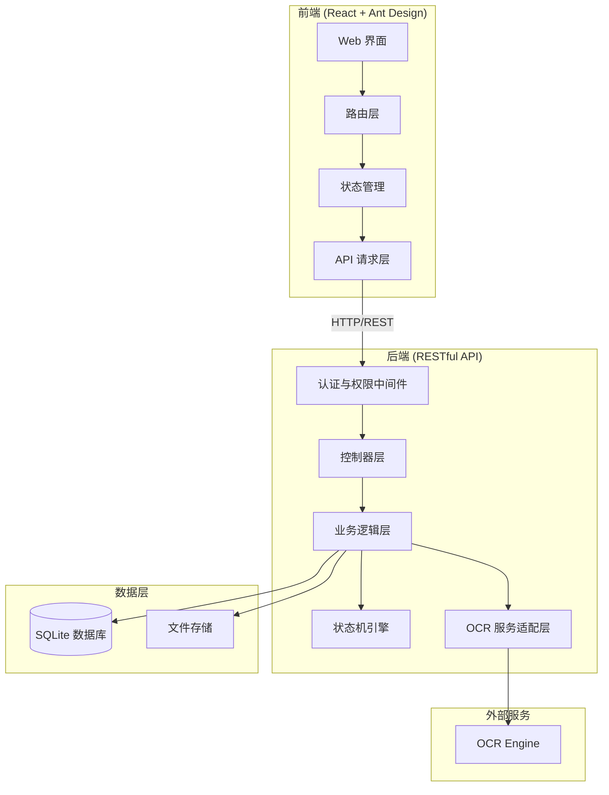
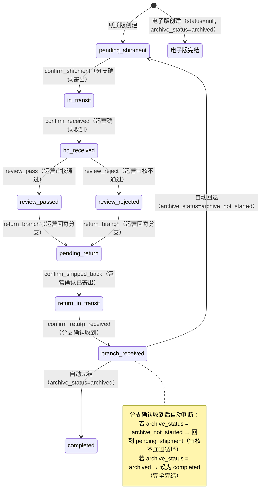
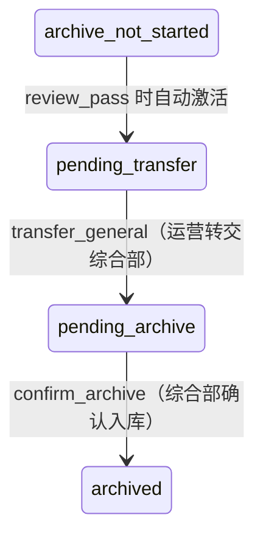

# 技术设计文档：档案管理系统

## 概述（Overview）

档案管理系统是一个面向金融机构的合同档案全生命周期管理平台，基于 React + Ant Design 构建 Web 前端，采用前后端分离架构。系统核心功能包括：

- Excel 批量数据导入与档案记录创建
- 基于角色（运营人员、分支机构、综合部）的权限控制与业务操作
- 纸质版合同的完整状态流转（寄送 → 审核 → 回寄 → 循环/完结）
- 电子版合同的快速归档
- 档案扫描件 OCR 识别与自动填充
- 多条件组合查询与分页展示

系统区分电子版与纸质版合同：电子版创建即完结，纸质版需经历完整业务流程。系统采用"双状态字段"设计：主流程状态（status）跟踪寄送、审核、回寄的完整流程（8个状态值 + completed 终态），综合部归档状态（archive_status）独立跟踪归档流程（4个状态值）。审核通过后，archive_status 从"归档待启动"自动激活为"待转交"；审核不通过时，合同经回寄循环后可重新寄送审核，循环次数不限。当主流程到达"分支已确认收到"且 archive_status 为"已归档-完结"时，status 自动设为"完结"（completed），记录完全完结；若 archive_status 仍为"归档待启动"（审核不通过路径），则自动回到"待分支机构寄出"重新开始流程。

所有列表页采用表格勾选 + 表格上方批量操作按钮的统一交互模式，不在操作列中放置按钮。状态流转通过状态机严格控制，每次变更记录操作日志，确保合规可追溯。

## 架构（Architecture）

### 整体架构

采用前后端分离的 B/S 架构：



### 前端架构

```
src/
├── api/                  # API 请求封装
│   ├── archive.ts        # 档案相关 API
│   ├── auth.ts           # 认证 API
│   └── ocr.ts            # OCR 相关 API
├── components/           # 通用组件
│   ├── ArchiveTable/     # 档案列表表格
│   ├── SearchForm/       # 查询表单
│   └── OcrUpload/        # OCR 上传组件
├── pages/                # 页面组件
│   ├── Login/            # 登录页
│   ├── Operator/         # 运营人员页面
│   │   ├── ImportPage    # 数据导入
│   │   ├── ReviewPage    # 审核分发
│   │   └── OcrPage       # OCR 识别
│   ├── Branch/           # 分支机构页面
│   │   └── ShipmentPage  # 寄送确认
│   └── GeneralAffairs/   # 综合部页面
│       └── ArchivePage   # 归档确认
├── hooks/                # 自定义 Hooks
├── store/                # 状态管理
├── utils/                # 工具函数
│   ├── stateMachine.ts   # 前端状态机校验
│   └── excelParser.ts    # Excel 解析
├── types/                # TypeScript 类型定义
└── routes/               # 路由配置与权限守卫
```


## 组件与接口（Components and Interfaces）

### 1. 认证与权限模块

**职责**：管理用户登录、角色识别、权限校验。

**接口设计**：

```typescript
// POST /api/auth/login
interface LoginRequest {
  username: string;
  password: string;
}
interface LoginResponse {
  token: string;
  user: {
    id: string;
    username: string;
    role: 'operator' | 'branch' | 'general_affairs';
    branchName?: string; // 分支机构所属营业部
  };
}

// GET /api/auth/me - 获取当前用户信息
interface CurrentUserResponse {
  id: string;
  username: string;
  role: UserRole;
  branchName?: string;
  permissions: Permission[];
}
```

**权限映射**：

| 角色 | 权限列表 |
|------|---------|
| operator | import, search, confirm_received, review_pass, review_reject, return_branch, confirm_shipped_back, transfer_general, upload_scan, ocr |
| branch | view_own_archives, confirm_shipment, confirm_return_received |
| general_affairs | confirm_archive |

**前端权限守卫**：

```typescript
// 路由级权限守卫
const ProtectedRoute: React.FC<{ allowedRoles: UserRole[] }> = ({ allowedRoles, children }) => {
  const { user } = useAuth();
  if (!allowedRoles.includes(user.role)) {
    message.error('权限不足');
    return <Navigate to="/unauthorized" />;
  }
  return <>{children}</>;
};
```

### 2. 档案记录 CRUD 模块

**职责**：档案记录的创建、读取、更新、查询。

**接口设计**：

```typescript
// POST /api/archives/import - Excel 批量导入
interface ImportRequest {
  file: File; // .xlsx/.xls 文件
}
interface ImportResponse {
  totalRows: number;
  successCount: number;
  failureCount: number;
  errors: Array<{
    row: number;
    reason: string;
  }>;
}

// GET /api/archives - 查询档案列表
interface ArchiveQueryParams {
  customerName?: string;
  fundAccount?: string;
  branchName?: string;
  contractType?: string;
  status?: MainStatus;
  archiveStatus?: ArchiveSubStatus;
  contractVersionType?: ContractVersionType;
  openDateStart?: string;
  openDateEnd?: string;
  page: number;
  pageSize: number; // 默认 20
}
interface ArchiveListResponse {
  total: number;
  page: number;
  pageSize: number;
  records: ArchiveRecord[];
}

// GET /api/archives/:id - 获取档案详情（含状态变更历史）
interface ArchiveDetailResponse {
  record: ArchiveRecord;
  statusHistory: StatusChangeLog[];
}

// GET /api/archives/template - 下载导入模板
// 返回 Excel 文件流

// POST /api/archives - 创建新档案记录
interface CreateArchiveRequest {
  customerName: string;                          // 客户姓名
  fundAccount: string;                           // 资金账号（唯一）
  branchName: string;                            // 营业部
  contractType: string;                          // 合同类型
  openDate: string;                              // 开户日期 (YYYY-MM-DD)
  contractVersionType: ContractVersionType;      // 合同版本类型
}
interface CreateArchiveResponse {
  success: boolean;
  record: ArchiveRecord;
  message?: string;
}
```

### 3. 状态流转模块

**职责**：严格控制档案状态的合法流转，记录操作日志。

**接口设计**：

```typescript
// POST /api/archives/:id/transition - 状态流转
interface TransitionRequest {
  action: TransitionAction;
}
interface TransitionResponse {
  success: boolean;
  record: ArchiveRecord;
  message?: string;
}

// POST /api/archives/batch-transition - 批量状态流转
interface BatchTransitionRequest {
  archiveIds: string[];
  action: TransitionAction;
}
interface BatchTransitionResponse {
  successCount: number;
  failureCount: number;
  results: Array<{
    archiveId: string;
    success: boolean;
    message?: string;
  }>;
}
```

**状态机定义**：

系统采用"双状态字段"设计。主流程状态（status）跟踪寄送、审核、回寄的完整流程（8个状态值），综合部归档状态（archive_status）独立跟踪归档流程（4个状态值）：



**综合部归档状态独立流转**：



**状态机实现**：

```typescript
// 主流程状态（8个状态值 + completed 终态）
type MainStatus =
  | 'pending_shipment'      // 待分支机构寄出
  | 'in_transit'            // 寄送总部在途
  | 'hq_received'           // 总部已收到
  | 'review_passed'         // 审核通过
  | 'review_rejected'       // 审核不通过
  | 'pending_return'        // 待总部回寄
  | 'return_in_transit'     // 总部回寄在途
  | 'branch_received';      // 分支已确认收到
// + 'completed' 作为终态

// 综合部归档状态（4个状态值）
type ArchiveSubStatus =
  | 'archive_not_started'   // 归档待启动
  | 'pending_transfer'      // 待转交
  | 'pending_archive'       // 待综合部入库
  | 'archived';             // 已归档-完结

// 状态流转操作（10个操作）
type TransitionAction =
  | 'confirm_shipment'        // 分支确认寄出
  | 'confirm_received'        // 运营确认收到
  | 'review_pass'             // 运营审核通过
  | 'review_reject'           // 运营审核不通过
  | 'return_branch'           // 运营回寄分支
  | 'confirm_shipped_back'    // 运营确认已寄出
  | 'confirm_return_received' // 分支确认收到回寄
  | 'transfer_general'        // 运营转交综合部
  | 'confirm_archive';        // 综合部确认入库

// 主流程状态合法转换表
const MAIN_STATUS_TRANSITIONS: Record<MainStatus, Partial<Record<TransitionAction, MainStatus>>> = {
  'pending_shipment': {
    'confirm_shipment': 'in_transit',
  },
  'in_transit': {
    'confirm_received': 'hq_received',
  },
  'hq_received': {
    'review_pass': 'review_passed',
    'review_reject': 'review_rejected',
  },
  'review_passed': {
    'return_branch': 'pending_return',
  },
  'review_rejected': {
    'return_branch': 'pending_return',
  },
  'pending_return': {
    'confirm_shipped_back': 'return_in_transit',
  },
  'return_in_transit': {
    'confirm_return_received': 'branch_received',
  },
  'branch_received': {}, // 自动判断：回退或完结
};

// 综合部归档状态合法转换表
const ARCHIVE_STATUS_TRANSITIONS: Record<ArchiveSubStatus, Partial<Record<TransitionAction, ArchiveSubStatus>>> = {
  'archive_not_started': {
    // review_pass 时自动激活为 pending_transfer（由状态机内部处理）
  },
  'pending_transfer': {
    'transfer_general': 'pending_archive',
  },
  'pending_archive': {
    'confirm_archive': 'archived',
  },
  'archived': {}, // 终态
};

// 操作-角色权限表
const ACTION_ROLE_MAP: Record<TransitionAction, UserRole> = {
  'confirm_shipment': 'branch',
  'confirm_received': 'operator',
  'review_pass': 'operator',
  'review_reject': 'operator',
  'return_branch': 'operator',
  'confirm_shipped_back': 'operator',
  'confirm_return_received': 'branch',
  'transfer_general': 'operator',
  'confirm_archive': 'general_affairs',
};

// 判断记录是否完全完结
function isFullyCompleted(record: ArchiveRecord): boolean {
  return record.status === 'completed';
}
```

**review_pass 的联动逻辑**：当 review_pass 操作成功时，状态机除了将 status 从 `hq_received` 更新为 `review_passed`，还需同时将 archive_status 从 `archive_not_started` 更新为 `pending_transfer`。

**branch_received 的自动判断逻辑**：当 confirm_return_received 操作将 status 更新为 `branch_received` 后，系统自动判断：
- 若 archive_status = `archive_not_started`（审核不通过路径）→ 自动将 status 回退为 `pending_shipment`，重新进入寄送审核循环
- 若 archive_status = `archived`（归档已完成）→ 自动将 status 设为 `completed`，记录完全完结

### 4. OCR 识别模块

**职责**：接收扫描件文件，调用 OCR 引擎提取关键字段，返回识别结果与置信度。

**接口设计**：

```typescript
// POST /api/ocr/recognize - 上传扫描件并识别
interface OcrRequest {
  file: File; // JPG, PNG, PDF
}
interface OcrResponse {
  success: boolean;
  fields: {
    customerName: OcrField;
    fundAccount: OcrField;
    branchName: OcrField;
    contractType: OcrField;
    openDate: OcrField;
    contractVersionType: OcrField;
  };
  rawText?: string;
}
interface OcrField {
  value: string;
  confidence: number; // 0-1，低于阈值需人工复核
}
```

**OCR 服务适配层设计**：

```typescript
// OCR 引擎适配器接口，支持替换不同 OCR 实现
interface IOcrEngine {
  recognize(fileBuffer: Buffer, fileType: string): Promise<OcrRawResult>;
}

// OCR 结果解析器：从原始文本中提取结构化字段
interface IOcrFieldExtractor {
  extract(rawResult: OcrRawResult): OcrResponse;
}
```

### 5. 前端页面组件

所有列表页统一采用表格勾选 + 表格上方批量操作按钮的交互模式，不在操作列中放置任何操作按钮。

#### 5.1 运营人员 - 数据导入页

```typescript
// 使用 Ant Design Upload + Dragger 组件
const ImportPage: React.FC = () => {
  // Upload 组件：接受 .xlsx/.xls
  // 模板下载 Button
  // 导入结果 Modal：显示成功/失败条数及错误详情 Table
};
```

#### 5.2 运营人员 - 审核分发页

```typescript
// 搜索表单 (Form + Input + Select) + 新增记录按钮 + 档案列表 (Table, 每行带 Checkbox) + 表格上方批量操作按钮组
const ReviewPage: React.FC = () => {
  // Form: 客户姓名 Input、资金账号 Input
  // "新增记录" Button: 打开新增记录 Modal
  // Table: 展示所有状态的档案记录，每行带 Checkbox 勾选框
  //   列: 客户姓名、资金账号、营业部、合同类型、开户日期、合同版本类型、主流程状态、综合部归档状态、编辑
  // 表格上方6个批量操作按钮（按钮置灰规则）:
  //   - "确认收到" Button（仅当选中的记录状态都为 in_transit 时启用，否则置灰）
  //   - "审核通过" Button（仅当选中的记录状态都为 hq_received 时启用，否则置灰）
  //   - "审核不通过" Button（仅当选中的记录状态都为 hq_received 时启用，否则置灰）
  //   - "回寄分支" Button（仅当选中的记录状态都为 review_passed 或 review_rejected 时启用，否则置灰）
  //   - "确认已寄出" Button（仅当选中的记录状态都为 pending_return 时启用，否则置灰）
  //   - "转交综合部" Button（仅当选中的记录 archive_status 都为 pending_transfer 时启用，否则置灰）
  // 新增记录 Modal:
  //   - 表单字段: 客户姓名、资金账号、营业部、合同类型、开户日期、合同版本类型
  //   - 提交按钮: 创建新档案记录
  //   - 取消按钮: 关闭 Modal
  // 不在操作列中放置任何按钮（除编辑按钮外）
};
```

#### 5.3 分支机构 - 寄送确认页

```typescript
// Table (每行带 Checkbox rowSelection) + 表格上方2个批量操作按钮
const ShipmentPage: React.FC = () => {
  // Table: 展示本营业部所有档案记录，每行带 Checkbox 勾选框
  //   列: 客户姓名、资金账号、营业部、合同类型、开户日期、主流程状态、综合部归档状态
  // 表格上方2个批量操作按钮（按钮置灰规则）:
  //   - "确认寄出" Button（仅当选中的记录状态都为 pending_shipment 时启用，否则置灰）
  //   - "确认收到" Button（仅当选中的记录状态都为 return_in_transit 时启用，否则置灰）
  // 不在操作列中放置任何按钮
};
```

#### 5.4 综合部 - 归档确认页

```typescript
// Table (每行带 Checkbox rowSelection) + 表格上方1个批量操作按钮
const ArchivePage: React.FC = () => {
  // Table: 展示"综合部归档状态"为"待综合部入库"的记录，每行带 Checkbox 勾选框
  //   列: 客户姓名、资金账号、营业部、主流程状态、综合部归档状态
  // 表格上方1个批量操作按钮:
  //   - "确认入库" Button（勾选记录后操作）
  // 不在操作列中放置任何按钮
};
```

#### 5.5 运营人员 - OCR 识别页

```typescript
// Upload 组件 + OCR 结果表单 (Form)
const OcrPage: React.FC = () => {
  // Upload: 接受 JPG/PNG/PDF，限制文件大小
  // 识别结果 Form: 各字段 Input，低置信度字段高亮标记
  // 提交 Button: 将修正后的数据保存为档案记录
};
```


## 数据模型（Data Models）

### 核心实体

```typescript
// 用户角色枚举
type UserRole = 'operator' | 'branch' | 'general_affairs';

// 合同版本类型枚举
type ContractVersionType = 'electronic' | 'paper';

// 主流程状态枚举（8个状态值 + completed 终态）
type MainStatus =
  | 'pending_shipment'      // 待分支机构寄出
  | 'in_transit'            // 寄送总部在途
  | 'hq_received'           // 总部已收到
  | 'review_passed'         // 审核通过
  | 'review_rejected'       // 审核不通过
  | 'pending_return'        // 待总部回寄
  | 'return_in_transit'     // 总部回寄在途
  | 'branch_received';      // 分支已确认收到
// status 字段还可以取值 'completed'（完全完结终态）或 null（电子版）

// 综合部归档状态枚举（4个状态值）
type ArchiveSubStatus =
  | 'archive_not_started'   // 归档待启动
  | 'pending_transfer'      // 待转交
  | 'pending_archive'       // 待综合部入库
  | 'archived';             // 已归档-完结

// 状态流转操作枚举（10个操作）
type TransitionAction =
  | 'confirm_shipment'        // 分支确认寄出（pending_shipment → in_transit）
  | 'confirm_received'        // 运营确认收到（in_transit → hq_received）
  | 'review_pass'             // 运营审核通过（hq_received → review_passed）
  | 'review_reject'           // 运营审核不通过（hq_received → review_rejected）
  | 'return_branch'           // 运营回寄分支（review_passed/review_rejected → pending_return）
  | 'confirm_shipped_back'    // 运营确认已寄出（pending_return → return_in_transit）
  | 'confirm_return_received' // 分支确认收到回寄（return_in_transit → branch_received）
  | 'transfer_general'        // 运营转交综合部（pending_transfer → pending_archive）
  | 'confirm_archive';        // 综合部确认入库（pending_archive → archived）

// 档案记录（双状态字段设计：status + archive_status）
interface ArchiveRecord {
  id: string;                                    // 主键
  customerName: string;                          // 客户姓名
  fundAccount: string;                           // 资金账号（唯一）
  branchName: string;                            // 营业部
  contractType: string;                          // 合同类型
  openDate: string;                              // 开户日期 (YYYY-MM-DD)
  contractVersionType: ContractVersionType;      // 合同版本类型
  status: MainStatus | 'completed' | null;       // 主流程状态（电子版为 null，完全完结为 completed）
  archiveStatus: ArchiveSubStatus;               // 综合部归档状态
  scanFileUrl?: string;                          // 扫描件文件 URL
  createdAt: string;                             // 创建时间
  updatedAt: string;                             // 更新时间
}

// 状态变更日志
interface StatusChangeLog {
  id: string;                           // 主键
  archiveId: string;                    // 关联档案记录 ID
  statusField: string;                  // 变更的状态字段名（status / archive_status）
  previousValue: string | null;         // 变更前状态值
  newValue: string;                     // 变更后状态值
  action: TransitionAction | 'create';  // 触发操作
  operatorId: string;                   // 操作人 ID
  operatorName: string;                 // 操作人姓名
  operatedAt: string;                   // 操作时间
}

// 用户
interface User {
  id: string;
  username: string;
  passwordHash: string;
  role: UserRole;
  branchName?: string;                  // 分支机构所属营业部
  createdAt: string;
}
```

### 数据库表结构

使用 SQLite 作为数据库，数据库文件存储在后端项目目录下（如 `data/archive.db`）。SQLite 不支持 ENUM 类型，使用 TEXT + CHECK 约束替代；不支持 `ON UPDATE CURRENT_TIMESTAMP`，通过应用层在每次更新时设置 `updated_at` 字段。

```sql
-- 用户表
CREATE TABLE users (
  id            TEXT PRIMARY KEY,
  username      TEXT NOT NULL UNIQUE,
  password_hash TEXT NOT NULL,
  role          TEXT NOT NULL CHECK(role IN ('operator', 'branch', 'general_affairs')),
  branch_name   TEXT,
  created_at    TEXT DEFAULT (datetime('now'))
);

-- 档案记录表（双状态字段：status + archive_status，无 branch_return_status）
CREATE TABLE archive_records (
  id                    TEXT PRIMARY KEY,
  customer_name         TEXT NOT NULL,
  fund_account          TEXT NOT NULL UNIQUE,
  branch_name           TEXT NOT NULL,
  contract_type         TEXT NOT NULL,
  open_date             TEXT NOT NULL, -- 格式: YYYY-MM-DD
  contract_version_type TEXT NOT NULL CHECK(contract_version_type IN ('electronic', 'paper')),
  status                TEXT CHECK(status IN (
    'pending_shipment', 'in_transit', 'hq_received',
    'review_passed', 'review_rejected',
    'pending_return', 'return_in_transit', 'branch_received',
    'completed'
  )), -- 主流程状态，电子版为 NULL，completed 为终态
  archive_status        TEXT NOT NULL DEFAULT 'archive_not_started' CHECK(archive_status IN (
    'archive_not_started', 'pending_transfer', 'pending_archive', 'archived'
  )), -- 综合部归档状态
  scan_file_url         TEXT,
  created_at            TEXT DEFAULT (datetime('now')),
  updated_at            TEXT DEFAULT (datetime('now'))
);

-- 档案记录表索引
CREATE INDEX idx_fund_account ON archive_records(fund_account);
CREATE INDEX idx_branch_name ON archive_records(branch_name);
CREATE INDEX idx_status ON archive_records(status);
CREATE INDEX idx_archive_status ON archive_records(archive_status);
CREATE INDEX idx_contract_version_type ON archive_records(contract_version_type);

-- 状态变更日志表
CREATE TABLE status_change_logs (
  id              TEXT PRIMARY KEY,
  archive_id      TEXT NOT NULL REFERENCES archive_records(id),
  status_field    TEXT NOT NULL, -- 变更的状态字段名：status / archive_status
  previous_value  TEXT,          -- 变更前状态值
  new_value       TEXT NOT NULL, -- 变更后状态值
  action          TEXT NOT NULL,
  operator_id     TEXT NOT NULL,
  operator_name   TEXT NOT NULL,
  operated_at     TEXT DEFAULT (datetime('now'))
);

CREATE INDEX idx_archive_id ON status_change_logs(archive_id);
```

**SQLite 适配说明**：
- SQLite 使用文件级数据库，无需连接池配置，通过 `better-sqlite3` 库以同步方式访问，性能优异且无需管理连接生命周期
- 所有 ENUM 类型替换为 `TEXT + CHECK` 约束，在数据库层面保证值域合法性
- 时间字段使用 `TEXT` 类型存储 ISO 8601 格式字符串，默认值通过 `datetime('now')` 生成
- `updated_at` 字段的自动更新由应用层在每次 UPDATE 操作时显式设置 `datetime('now')`
- SQLite 原生支持外键约束，需在连接时执行 `PRAGMA foreign_keys = ON` 启用

### 状态机规则汇总

**主流程状态转换表**：

| 当前主流程状态 | 允许操作 | 目标主流程状态 | 允许角色 | 联动效果 |
|--------------|---------|--------------|---------|---------|
| pending_shipment（待分支机构寄出） | confirm_shipment（确认寄出） | in_transit（寄送总部在途） | branch | - |
| in_transit（寄送总部在途） | confirm_received（确认收到） | hq_received（总部已收到） | operator | - |
| hq_received（总部已收到） | review_pass（审核通过） | review_passed（审核通过） | operator | archive_status: archive_not_started → pending_transfer |
| hq_received（总部已收到） | review_reject（审核不通过） | review_rejected（审核不通过） | operator | archive_status 保持 archive_not_started 不变 |
| review_passed（审核通过） | return_branch（回寄分支） | pending_return（待总部回寄） | operator | - |
| review_rejected（审核不通过） | return_branch（回寄分支） | pending_return（待总部回寄） | operator | - |
| pending_return（待总部回寄） | confirm_shipped_back（确认已寄出） | return_in_transit（总部回寄在途） | operator | - |
| return_in_transit（总部回寄在途） | confirm_return_received（确认收到） | branch_received（分支已确认收到） | branch | 自动判断（见下方） |

**branch_received 自动判断逻辑**：

| 条件 | 自动操作 | 说明 |
|------|---------|------|
| archive_status = archive_not_started | status 自动回退为 pending_shipment | 审核不通过路径，重新进入寄送审核循环 |
| archive_status ≠ archive_not_started 且 archive_status = archived | status 自动设为 completed | 完全完结 |
| archive_status 为其他值（pending_transfer / pending_archive） | status 保持 branch_received | 等待归档流程完成 |

**综合部归档状态转换表**：

| 当前综合部归档状态 | 允许操作 | 目标综合部归档状态 | 允许角色 | 前置条件 |
|------------------|---------|------------------|---------|---------|
| archive_not_started（归档待启动） | - | pending_transfer（待转交） | - | review_pass 时自动激活 |
| pending_transfer（待转交） | transfer_general（转交综合部） | pending_archive（待综合部入库） | operator | - |
| pending_archive（待综合部入库） | confirm_archive（确认入库） | archived（已归档-完结） | general_affairs | - |
| archived（已归档-完结） | - | - | - | 终态 |

**完全完结判定**：当 status = `completed` 时，整条记录完全完结，禁止任何状态修改。

**设计决策说明**：

1. **双状态字段设计**：系统使用 `status`（主流程状态）和 `archive_status`（综合部归档状态）两个独立字段。`status` 跟踪寄送、审核、回寄的完整流程（8个状态值 + completed 终态），`archive_status` 独立跟踪综合部归档流程（4个状态值）。审核通过后 archive_status 自动从"归档待启动"激活为"待转交"，两个字段各自独立流转。
2. **审核不通过循环机制**：审核不通过时，archive_status 保持 `archive_not_started` 不变。合同经回寄循环后，当 status 到达 `branch_received` 且 archive_status 仍为 `archive_not_started` 时，自动回退到 `pending_shipment` 重新开始流程，循环次数不限。
3. **电子版合同直接完结**：电子版合同创建时 status 为 null（不参与寄送流程），archive_status 直接设为 `archived`（已归档-完结），即创建即完结。
4. **资金账号唯一约束**：资金账号作为业务唯一标识，数据库层面通过 UNIQUE 约束保证，导入时进行重复检查。
5. **SQLite 数据库选型**：系统采用 SQLite 作为数据库，通过 `better-sqlite3` 库访问。SQLite 为嵌入式数据库，无需独立部署数据库服务，简化运维；同步 API 避免回调复杂性；单文件存储便于备份迁移。对于本系统的并发量级（内部管理系统），SQLite 的 WAL 模式可满足读写需求。


## 正确性属性（Correctness Properties）

*属性（Property）是指在系统所有合法执行中都应成立的特征或行为——本质上是对系统应做什么的形式化陈述。属性是连接人类可读规格说明与机器可验证正确性保证之间的桥梁。*

### Property 1: 角色权限访问控制

*For any* 用户角色和任意状态流转操作，该操作是否被允许执行应严格等于该操作是否存在于该角色的权限列表中（即 ACTION_ROLE_MAP 中该操作对应的角色是否匹配）。不在权限范围内的操作应被拒绝并返回"权限不足"。

**Validates: Requirements 1.2, 1.3, 1.4, 1.5**

### Property 2: 分支机构数据隔离

*For any* 分支机构用户和任意档案记录集合，该用户查询返回的记录应仅包含其所属营业部名下的记录，不应包含其他营业部的记录。

**Validates: Requirements 1.3, 4.1**

### Property 3: 档案记录必填字段完整性

*For any* 档案记录创建请求，如果缺少客户姓名、资金账号、营业部、合同类型、开户日期、合同版本类型中的任何一个字段，系统应拒绝创建。

**Validates: Requirements 2.1**

### Property 4: 字段值域约束

*For any* 档案记录，合同版本类型的值只能是"电子版"或"纸质版"；主流程状态的值只能是 pending_shipment、in_transit、hq_received、review_passed、review_rejected、pending_return、return_in_transit、branch_received 之一，或 completed（终态），或 null（电子版）；综合部归档状态的值只能是 archive_not_started、pending_transfer、pending_archive、archived 之一。

**Validates: Requirements 2.2, 2.3, 2.4**

### Property 5: 初始状态由合同版本类型决定

*For any* 新创建的档案记录，如果合同版本类型为"纸质版"，则 status 应为 pending_shipment、archive_status 应为 archive_not_started；如果合同版本类型为"电子版"，则 status 应为 null、archive_status 应为 archived。

**Validates: Requirements 2.5, 2.6, 7.3**

### Property 6: 资金账号唯一性

*For any* 两条不同的档案记录，它们的资金账号不应相同。尝试创建或修改为已存在的资金账号应被拒绝。

**Validates: Requirements 2.7, 5.12**

### Property 7: 完全完结判定与保护

*For any* 档案记录，当 status 到达 branch_received 且 archive_status 为 archived 时，系统应自动将 status 设为 completed。对于 status 为 completed 的记录，任何角色的任何状态变更操作和编辑操作都应被拒绝。

**Validates: Requirements 2.8, 5.11, 6.4, 7.6**

### Property 8: 审核不通过循环回退

*For any* 档案记录，当 status 到达 branch_received 且 archive_status 为 archive_not_started 时，系统应自动将 status 回退为 pending_shipment，使该记录重新进入寄送审核循环。在整个审核不通过回寄循环过程中，archive_status 应始终保持 archive_not_started 不变。

**Validates: Requirements 2.9, 7.7, 7.8**

### Property 9: Excel 导入正确性

*For any* 包含合法数据行和非法数据行的 Excel 文件，导入后成功条数 + 失败条数应等于总数据行数，且每条成功导入的记录应根据合同版本类型设置正确的初始状态（纸质版：status=pending_shipment, archive_status=archive_not_started；电子版：status=null, archive_status=archived）。

**Validates: Requirements 3.1, 3.2, 3.3**

### Property 10: 主流程状态机合法转换

*For any* 档案记录和任意主流程状态转换操作，操作是否成功应严格等于该转换是否存在于主流程合法状态转换表中。具体合法路径为：pending_shipment →[confirm_shipment]→ in_transit →[confirm_received]→ hq_received →[review_pass]→ review_passed →[return_branch]→ pending_return →[confirm_shipped_back]→ return_in_transit →[confirm_return_received]→ branch_received；以及 hq_received →[review_reject]→ review_rejected →[return_branch]→ pending_return。非法的状态跳转应被拒绝。

**Validates: Requirements 4.2, 4.3, 5.2, 5.5, 5.6, 7.1, 7.5**

### Property 11: 审核操作对 archive_status 的联动

*For any* status 为 hq_received 的档案记录，执行 review_pass 操作后 archive_status 应从 archive_not_started 变为 pending_transfer；执行 review_reject 操作后 archive_status 应保持 archive_not_started 不变。

**Validates: Requirements 5.3, 5.4, 7.8**

### Property 12: 综合部归档状态机合法转换

*For any* 档案记录和综合部归档相关操作（transfer_general、confirm_archive），操作是否成功应严格等于该转换是否存在于综合部归档合法状态转换表中。合法路径为：archive_not_started →[review_pass 自动]→ pending_transfer →[transfer_general]→ pending_archive →[confirm_archive]→ archived。

**Validates: Requirements 5.7, 6.2, 6.5, 7.2**

### Property 13: 转交操作独立性

*For any* 档案记录，执行 transfer_general 操作后应仅更新 archive_status 字段（从 pending_transfer 到 pending_archive），status 字段应保持不变。

**Validates: Requirements 7.10**

### Property 14: 电子版合同不可变更

*For any* 合同版本类型为"电子版"的档案记录和任意状态变更操作，系统应拒绝该操作并提示"电子版合同无需执行此操作"。

**Validates: Requirements 7.4**

### Property 15: 状态变更审计日志完整性

*For any* 成功的状态变更操作，系统应生成一条日志记录，包含操作人 ID、操作人姓名、操作时间、变更的状态字段名称（status 或 archive_status）、变更前状态值和变更后状态值，且这些字段均不为空。

**Validates: Requirements 7.9**

### Property 16: 批量状态流转正确性

*For any* 选中的档案记录集合和任意批量操作，操作完成后每条符合前置条件的记录对应的状态字段都应正确更新为目标状态值，不符合条件的记录应被标记为失败。

**Validates: Requirements 4.4, 6.3**

### Property 17: 组合查询结果正确性

*For any* 查询条件组合（客户姓名、资金账号、营业部、合同类型、主流程状态、综合部归档状态、开户日期范围、合同版本类型），返回的每条记录都应满足所有指定的查询条件。

**Validates: Requirements 8.1**

### Property 18: 分页不变量

*For any* 查询结果，每页返回的记录数不超过 pageSize（默认 20），且遍历所有页的记录总数应等于 total 字段的值。

**Validates: Requirements 8.2**

### Property 19: 档案列表展示字段完整性

*For any* 档案记录，列表 API 返回的数据应包含客户姓名、资金账号、营业部、合同类型、开户日期、合同版本类型、主流程状态、综合部归档状态八个字段，使用户可以同时看到流转进度和归档进度。

**Validates: Requirements 8.3, 8.5**

### Property 20: 档案详情数据完整性

*For any* 档案记录，其详情 API 返回的数据应包含所有必要字段（含 status 和 archive_status 两个状态字段）以及该记录的状态变更历史。

**Validates: Requirements 8.4**

### Property 21: 角色导航菜单过滤

*For any* 用户角色，导航菜单应仅包含该角色有权限访问的页面入口，不应显示无权限的页面链接。

**Validates: Requirements 9.8**

### Property 22: OCR 文件类型验证

*For any* 上传文件，文件是否被接受应严格等于其格式是否为 JPG、PNG 或 PDF。非合法格式的文件应被拒绝。

**Validates: Requirements 10.2, 10.3**

### Property 23: OCR 识别结果结构完整性与自动填充

*For any* 成功的 OCR 识别结果，应包含客户姓名、资金账号、营业部、合同类型、开户日期、合同版本类型六个字段及其置信度，且这些字段应被正确填充到表单对应位置。

**Validates: Requirements 10.4, 10.5**

### Property 24: OCR 低置信度字段标记

*For any* OCR 识别结果中的字段，如果其置信度低于阈值，则该字段在 UI 中应被标记为需要人工复核。

**Validates: Requirements 10.7**


## 错误处理（Error Handling）

### 错误分类与处理策略

| 错误类别 | 场景 | 处理方式 | 用户提示 |
|---------|------|---------|---------|
| 认证错误 | Token 过期/无效 | 重定向到登录页 | "登录已过期，请重新登录" |
| 权限错误 | 角色无权执行操作 | 拒绝操作，返回 403 | "权限不足" |
| 主流程状态流转错误 | 非法主流程状态转换 | 拒绝操作，返回 400 | "状态流转不合法" |
| 审核不通过重复操作 | 对非 hq_received 记录执行审核操作 | 拒绝操作，返回 400 | "状态流转不合法" |
| 综合部转交重复操作 | 已转交再次转交 | 拒绝操作，返回 400 | "该记录已完成转交综合部" |
| 电子版操作错误 | 对电子版合同执行流转操作 | 拒绝操作，返回 400 | "电子版合同无需执行此操作" |
| 完全完结操作错误 | 对 status=completed 的记录执行操作 | 拒绝操作，返回 400 | "该记录已完全完结，不可修改" |
| 数据唯一性错误 | 资金账号重复 | 拒绝创建，返回 409 | "资金账号已存在" |
| 文件格式错误 | Excel 非 .xlsx/.xls | 拒绝导入，返回 400 | "文件格式不正确，请上传 Excel 文件" |
| OCR 文件格式错误 | 非 JPG/PNG/PDF | 拒绝上传，返回 400 | "文件格式不支持，请上传 JPG、PNG 或 PDF 格式的扫描件" |
| OCR 文件大小错误 | 超过最大限制 | 拒绝上传，返回 400 | "文件大小超出限制，请压缩后重新上传" |
| OCR 识别失败 | 引擎错误/无法识别 | 返回错误，允许手动填写 | "扫描件识别失败，请检查文件清晰度后重试" |
| 批量操作空选择 | 未选择记录即操作 | 前端拦截 | "请至少选择一条档案记录" |
| 导入行级错误 | Excel 某行数据不合法 | 跳过该行，汇总报告 | 导入结果中标注行号和错误原因 |

### 前端错误处理

```typescript
// 统一 API 错误拦截器
const apiClient = axios.create({ baseURL: '/api' });

apiClient.interceptors.response.use(
  (response) => response,
  (error) => {
    const { status, data } = error.response;
    switch (status) {
      case 401:
        message.error('登录已过期，请重新登录');
        redirectToLogin();
        break;
      case 403:
        message.error('权限不足');
        break;
      case 400:
        message.error(data.message || '操作失败');
        break;
      case 409:
        message.error(data.message || '数据冲突');
        break;
      default:
        message.error('系统异常，请稍后重试');
    }
    return Promise.reject(error);
  }
);
```

### 后端错误响应格式

```typescript
interface ErrorResponse {
  code: string;        // 错误码，如 'INVALID_TRANSITION', 'PERMISSION_DENIED'
  message: string;     // 用户可读的错误信息
  details?: unknown;   // 可选的详细信息（如导入错误列表）
}
```

## 测试策略（Testing Strategy）

### 测试方法

本系统采用单元测试与属性测试（Property-Based Testing）相结合的双重测试策略：

- **单元测试**：验证具体示例、边界情况和错误条件
- **属性测试**：验证在所有输入上都成立的通用属性

两者互补：单元测试捕获具体 bug，属性测试验证通用正确性。

### 属性测试库

- 使用 **fast-check** 作为 TypeScript/JavaScript 的属性测试库
- 每个属性测试配置最少 **100 次迭代**
- 每个属性测试必须通过注释引用设计文档中的属性编号
- 标签格式：**Feature: archive-management-system, Property {number}: {property_text}**
- 每个正确性属性由**单个**属性测试实现

### 单元测试范围

单元测试聚焦于以下场景：

1. **边界情况**：
   - 空 Excel 文件导入（需求 3.4）
   - 非法文件格式上传（需求 3.4, 10.3）
   - 非法合同版本类型值（需求 3.6）
   - 批量操作空选择（需求 4.5, 5.9）
   - OCR 识别失败（需求 10.8）
   - 文件大小超限（需求 10.9）
   - 对非 pending_archive 记录执行入库（需求 6.5）

2. **具体示例**：
   - 系统支持三种角色定义（需求 1.1）
   - Excel 模板下载功能可用（需求 3.5）
   - 综合部展示待入库记录（需求 6.1）

3. **集成测试**：
   - 完整的纸质版合同状态流转路径（审核通过路径：pending_shipment → ... → completed）
   - 审核不通过循环路径（pending_shipment → ... → branch_received → 自动回退 → pending_shipment → ...）
   - 转交综合部操作不影响 status 字段
   - Excel 导入端到端流程
   - OCR 识别到表单填充的完整流程

### 属性测试范围

每个正确性属性对应一个属性测试，覆盖：

| 属性编号 | 测试描述 | 生成器策略 |
|---------|---------|-----------|
| Property 1 | 角色权限访问控制 | 随机角色 × 随机操作组合 |
| Property 2 | 分支机构数据隔离 | 随机营业部 × 随机档案记录集 |
| Property 3 | 必填字段完整性 | 随机缺失字段组合 |
| Property 4 | 字段值域约束 | 随机合法/非法字段值（含两个状态字段） |
| Property 5 | 初始状态由版本类型决定 | 随机合同版本类型，验证 status 和 archive_status |
| Property 6 | 资金账号唯一性 | 随机资金账号对 |
| Property 7 | 完全完结判定与保护 | 随机 status × 随机 archive_status 组合，验证 completed 判定和保护 |
| Property 8 | 审核不通过循环回退 | 随机 archive_status 为 archive_not_started 的 branch_received 记录 |
| Property 9 | Excel 导入正确性 | 随机合法/非法行混合 |
| Property 10 | 主流程状态机合法转换 | 随机主流程状态 × 随机操作（含 confirm_received, review_reject, confirm_shipped_back） |
| Property 11 | 审核操作对 archive_status 的联动 | 随机 hq_received 记录 × review_pass/review_reject 操作 |
| Property 12 | 综合部归档状态机合法转换 | 随机 archive_status × transfer_general/confirm_archive 操作 |
| Property 13 | 转交操作独立性 | 随机 pending_transfer 记录，验证 transfer_general 后 status 不变 |
| Property 14 | 电子版合同不可变更 | 随机操作 × 电子版记录 |
| Property 15 | 审计日志完整性 | 随机状态变更操作，验证日志含 status_field |
| Property 16 | 批量状态流转 | 随机记录集 × 任意批量操作 |
| Property 17 | 组合查询正确性 | 随机查询条件组合（含两个状态字段筛选）× 随机数据集 |
| Property 18 | 分页不变量 | 随机数据量 × 随机 pageSize |
| Property 19 | 列表展示字段完整性 | 随机档案记录，验证八个字段 |
| Property 20 | 详情数据完整性 | 随机档案记录 |
| Property 21 | 角色导航菜单过滤 | 随机角色 |
| Property 22 | OCR 文件类型验证 | 随机文件扩展名 |
| Property 23 | OCR 结果结构与填充 | 随机 OCR 响应数据 |
| Property 24 | 低置信度字段标记 | 随机置信度值 × 阈值 |

### 测试文件组织

```
tests/
├── unit/                          # 单元测试
│   ├── auth.test.ts               # 认证与权限
│   ├── import.test.ts             # Excel 导入边界情况
│   ├── stateMachine.test.ts       # 状态机边界情况
│   └── ocr.test.ts                # OCR 边界情况
├── property/                      # 属性测试
│   ├── auth.property.test.ts      # Property 1, 2, 21
│   ├── archive.property.test.ts   # Property 3, 4, 5, 6, 7, 8, 19, 20
│   ├── import.property.test.ts    # Property 9
│   ├── stateMachine.property.test.ts # Property 10, 11, 12, 13, 14, 15, 16
│   ├── query.property.test.ts     # Property 17, 18
│   └── ocr.property.test.ts       # Property 22, 23, 24
└── integration/                   # 集成测试
    ├── workflow.test.ts            # 完整业务流程（含审核不通过循环）
    └── import-e2e.test.ts         # 导入端到端
```


## 部署方案（Deployment）

### 部署架构

采用 Docker 容器化部署，单容器运行前后端一体化应用：

```
┌─────────────────────────────────────────┐
│              云服务器                      │
│  ┌───────────────────────────────────┐  │
│  │          Nginx (反向代理)           │  │
│  │   :80 → :3000 (HTTP)             │  │
│  │   :443 → :3000 (HTTPS, 可选)      │  │
│  └──────────────┬────────────────────┘  │
│                 │                        │
│  ┌──────────────▼────────────────────┐  │
│  │     Docker Container (app)        │  │
│  │  ┌─────────────────────────────┐  │  │
│  │  │   Express (:3000)           │  │  │
│  │  │   - /api/* → 后端 API       │  │  │
│  │  │   - /* → 前端静态文件        │  │  │
│  │  └─────────────────────────────┘  │  │
│  │  ┌─────────────────────────────┐  │  │
│  │  │   SQLite (Volume 持久化)     │  │  │
│  │  │   /app/backend/data/        │  │  │
│  │  └─────────────────────────────┘  │  │
│  └───────────────────────────────────┘  │
└─────────────────────────────────────────┘
```

### 部署策略

- 前端 `npm run build` 产出静态文件，由后端 Express 在生产环境下通过 `express.static` 托管
- 后端 `npm run build` 编译 TypeScript 为 JavaScript，通过 `node dist/index.js` 运行
- SQLite 数据库文件通过 Docker Volume 挂载到宿主机，确保容器重建不丢数据
- Nginx 作为反向代理，处理 HTTPS 终止和静态资源缓存

### 生产环境改动

后端入口 `backend/src/index.ts` 在生产环境下增加静态文件托管：
- 使用 `express.static` 托管 `frontend/dist` 目录
- 所有非 `/api` 开头的请求 fallback 到 `index.html`（支持 SPA 路由）

### 环境变量

| 变量名 | 说明 | 默认值 |
|--------|------|--------|
| PORT | 服务端口 | 3000 |
| NODE_ENV | 运行环境 | development |
| JWT_SECRET | JWT 签名密钥 | 生产环境必须设置 |
