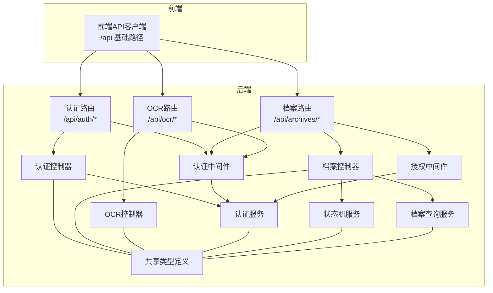
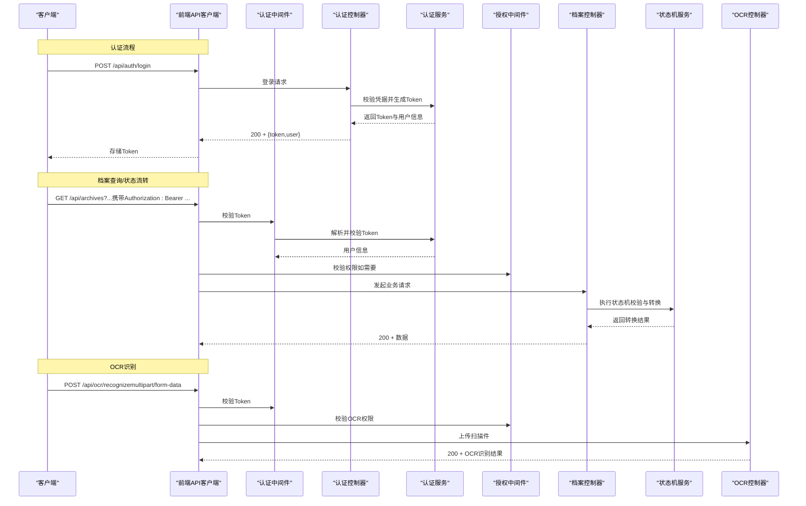
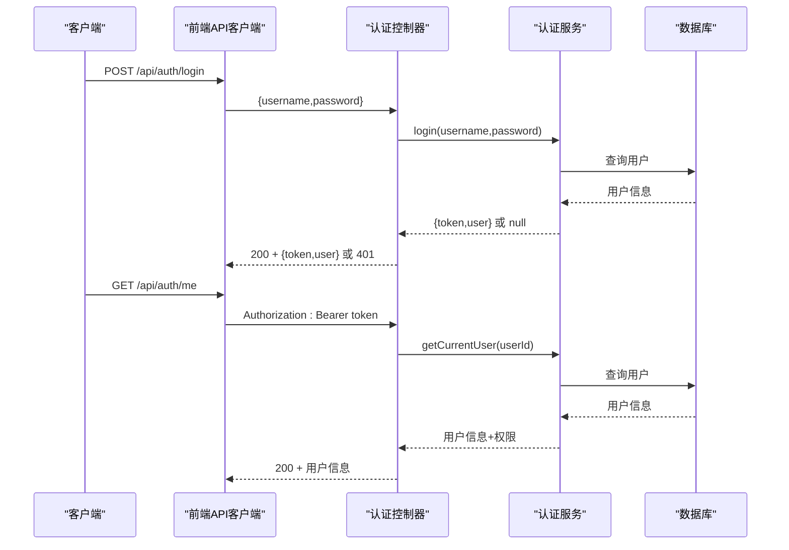
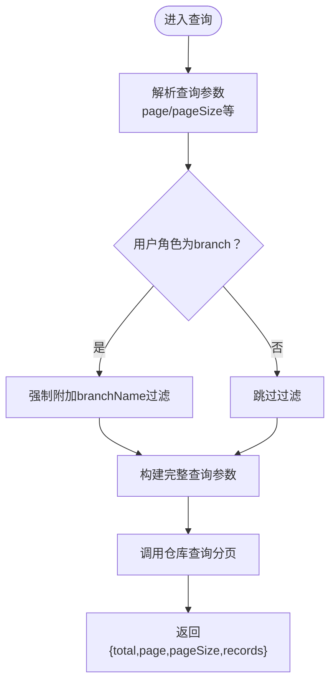
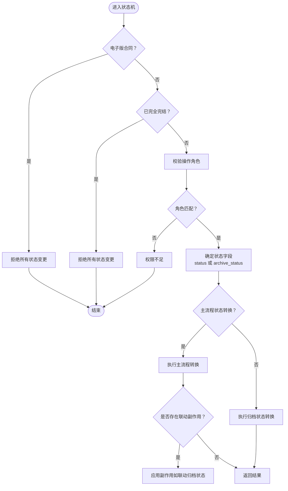
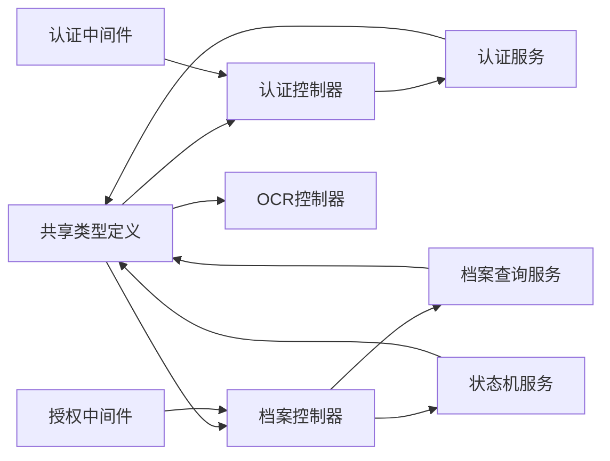

# API接口文档

<cite>
**本文引用的文件**
- [backend/src/routes/auth.ts](file://backend/src/routes/auth.ts)
- [backend/src/controllers/authController.ts](file://backend/src/controllers/authController.ts)
- [backend/src/middlewares/auth.ts](file://backend/src/middlewares/auth.ts)
- [backend/src/services/AuthService.ts](file://backend/src/services/AuthService.ts)
- [backend/src/routes/archive.ts](file://backend/src/routes/archive.ts)
- [backend/src/controllers/archiveController.ts](file://backend/src/controllers/archiveController.ts)
- [backend/src/middlewares/authorize.ts](file://backend/src/middlewares/authorize.ts)
- [backend/src/services/StateMachineService.ts](file://backend/src/services/StateMachineService.ts)
- [backend/src/services/ArchiveService.ts](file://backend/src/services/ArchiveService.ts)
- [backend/src/routes/ocr.ts](file://backend/src/routes/ocr.ts)
- [backend/src/controllers/ocrController.ts](file://backend/src/controllers/ocrController.ts)
- [shared/types.ts](file://shared/types.ts)
- [backend/package.json](file://backend/package.json)
- [frontend/src/api/client.ts](file://frontend/src/api/client.ts)
- [frontend/src/hooks/useAuth.tsx](file://frontend/src/hooks/useAuth.tsx)
</cite>

## 目录
1. [简介](#简介)
2. [项目结构](#项目结构)
3. [核心组件](#核心组件)
4. [架构总览](#架构总览)
5. [详细组件分析](#详细组件分析)
6. [依赖关系分析](#依赖关系分析)
7. [性能考量](#性能考量)
8. [故障排除指南](#故障排除指南)
9. [结论](#结论)
10. [附录](#附录)

## 简介
本文件为档案管理系统后端提供的RESTful API接口规范文档，覆盖认证接口、档案管理接口、状态流转接口与OCR识别接口。文档详细说明每个接口的HTTP方法、URL模式、请求参数、响应格式与状态码；解释JWT认证机制与权限要求；提供请求与响应示例的路径指引；给出错误处理策略、API版本控制与向后兼容性说明，并包含速率限制、安全考虑与性能优化建议。

## 项目结构
后端采用Express + TypeScript架构，路由层负责URL映射，控制器层处理业务请求，中间件层负责认证与授权，服务层封装业务逻辑，共享类型定义位于shared目录，前端通过axios统一客户端访问后端API。

图表来源
- [backend/src/routes/auth.ts:1-19](file://backend/src/routes/auth.ts#L1-L19)
- [backend/src/routes/archive.ts:1-42](file://backend/src/routes/archive.ts#L1-L42)
- [backend/src/routes/ocr.ts:1-21](file://backend/src/routes/ocr.ts#L1-L21)
- [backend/src/controllers/authController.ts:1-77](file://backend/src/controllers/authController.ts#L1-L77)
- [backend/src/controllers/archiveController.ts:1-448](file://backend/src/controllers/archiveController.ts#L1-L448)
- [backend/src/controllers/ocrController.ts:1-94](file://backend/src/controllers/ocrController.ts#L1-L94)
- [backend/src/middlewares/auth.ts:1-56](file://backend/src/middlewares/auth.ts#L1-L56)
- [backend/src/middlewares/authorize.ts:1-47](file://backend/src/middlewares/authorize.ts#L1-L47)
- [backend/src/services/AuthService.ts:1-126](file://backend/src/services/AuthService.ts#L1-L126)
- [backend/src/services/StateMachineService.ts:1-253](file://backend/src/services/StateMachineService.ts#L1-L253)
- [backend/src/services/ArchiveService.ts:1-71](file://backend/src/services/ArchiveService.ts#L1-L71)
- [shared/types.ts:1-289](file://shared/types.ts#L1-L289)

章节来源
- [backend/src/routes/auth.ts:1-19](file://backend/src/routes/auth.ts#L1-L19)
- [backend/src/routes/archive.ts:1-42](file://backend/src/routes/archive.ts#L1-L42)
- [backend/src/routes/ocr.ts:1-21](file://backend/src/routes/ocr.ts#L1-L21)
- [shared/types.ts:1-289](file://shared/types.ts#L1-L289)

## 核心组件
- 认证与授权
  - JWT认证：后端使用jsonwebtoken生成与校验Token，默认有效期8小时，密钥可由环境变量配置。
  - 权限模型：基于角色的角色-权限映射，支持import/search/review等细粒度权限。
  - 中间件链：authenticate（提取并校验Token）+ authorize（角色权限校验）。
- 业务服务
  - 状态机服务：严格控制主流程状态与归档状态的合法转换，内置自动联动与完结判定。
  - 档案查询服务：支持分页与分支机构数据隔离。
- 共享类型：前后端共用的实体、枚举、请求/响应接口与常量集合，确保契约一致性。

章节来源
- [backend/src/services/AuthService.ts:1-126](file://backend/src/services/AuthService.ts#L1-L126)
- [backend/src/middlewares/auth.ts:1-56](file://backend/src/middlewares/auth.ts#L1-L56)
- [backend/src/middlewares/authorize.ts:1-47](file://backend/src/middlewares/authorize.ts#L1-L47)
- [backend/src/services/StateMachineService.ts:1-253](file://backend/src/services/StateMachineService.ts#L1-L253)
- [backend/src/services/ArchiveService.ts:1-71](file://backend/src/services/ArchiveService.ts#L1-L71)
- [shared/types.ts:1-289](file://shared/types.ts#L1-L289)

## 架构总览
下图展示认证、档案与OCR三大模块的端到端交互流程。

图表来源
- [backend/src/controllers/authController.ts:1-77](file://backend/src/controllers/authController.ts#L1-L77)
- [backend/src/services/AuthService.ts:1-126](file://backend/src/services/AuthService.ts#L1-L126)
- [backend/src/middlewares/auth.ts:1-56](file://backend/src/middlewares/auth.ts#L1-L56)
- [backend/src/middlewares/authorize.ts:1-47](file://backend/src/middlewares/authorize.ts#L1-L47)
- [backend/src/controllers/archiveController.ts:1-448](file://backend/src/controllers/archiveController.ts#L1-L448)
- [backend/src/services/StateMachineService.ts:1-253](file://backend/src/services/StateMachineService.ts#L1-L253)
- [backend/src/controllers/ocrController.ts:1-94](file://backend/src/controllers/ocrController.ts#L1-L94)

## 详细组件分析

### 认证接口
- 接口概览
  - POST /api/auth/login
    - 功能：用户登录，返回JWT Token与用户基本信息。
    - 请求体：用户名与密码。
    - 成功响应：包含token与user对象。
    - 失败响应：用户名或密码错误。
  - GET /api/auth/me
    - 功能：获取当前登录用户信息（含权限列表）。
    - 鉴权：需要有效的Bearer Token。
    - 成功响应：用户信息与权限列表。
    - 失败响应：未认证或用户不存在。

- 认证流程序列图

图表来源
- [backend/src/controllers/authController.ts:1-77](file://backend/src/controllers/authController.ts#L1-L77)
- [backend/src/services/AuthService.ts:1-126](file://backend/src/services/AuthService.ts#L1-L126)
- [backend/src/middlewares/auth.ts:1-56](file://backend/src/middlewares/auth.ts#L1-L56)

- 请求与响应示例（路径）
  - 登录请求示例：[POST /api/auth/login:16-43](file://backend/src/controllers/authController.ts#L16-L43)
  - 登录响应示例：[LoginResponse:112-121](file://shared/types.ts#L112-L121)
  - 获取当前用户请求示例：[GET /api/auth/me:50-76](file://backend/src/controllers/authController.ts#L50-L76)
  - 当前用户响应示例：[CurrentUserResponse:123-130](file://shared/types.ts#L123-L130)

- 错误处理策略
  - 400：请求参数缺失或格式错误。
  - 401：未提供或无效的认证令牌。
  - 404：用户不存在。
  - 429：超出速率限制（见“性能考量”）。

章节来源
- [backend/src/routes/auth.ts:1-19](file://backend/src/routes/auth.ts#L1-L19)
- [backend/src/controllers/authController.ts:1-77](file://backend/src/controllers/authController.ts#L1-L77)
- [backend/src/middlewares/auth.ts:1-56](file://backend/src/middlewares/auth.ts#L1-L56)
- [backend/src/services/AuthService.ts:1-126](file://backend/src/services/AuthService.ts#L1-L126)
- [shared/types.ts:106-130](file://shared/types.ts#L106-L130)

### 档案管理接口
- 接口概览
  - GET /api/archives
    - 功能：查询档案列表，支持多条件组合查询与分页；分支机构用户自动过滤本营业部数据。
    - 鉴权：需要有效Token。
    - 成功响应：分页列表。
  - POST /api/archives
    - 功能：创建新档案记录（仅运营人员可操作）。
    - 鉴权：需要有效Token + review权限。
    - 成功响应：创建后的记录。
  - POST /api/archives/import
    - 功能：Excel批量导入（仅导入权限）。
    - 鉴权：需要有效Token + import权限。
    - 成功响应：导入统计结果。
  - GET /api/archives/template
    - 功能：下载导入模板。
    - 鉴权：需要有效Token。
  - GET /api/archives/:id
    - 功能：获取档案详情（含状态变更历史）。
    - 鉴权：需要有效Token。
  - POST /api/archives/:id/transition
    - 功能：单条状态流转。
    - 鉴权：需要有效Token；角色校验由状态机内部完成。
  - POST /api/archives/batch-transition
    - 功能：批量状态流转。
    - 鉴权：需要有效Token；角色校验由状态机内部完成。
  - PUT /api/archives/:id
    - 功能：编辑档案基础信息（仅运营人员可操作，完全完结记录不可编辑）。
    - 鉴权：需要有效Token + review权限。

- 档案查询流程图

图表来源
- [backend/src/controllers/archiveController.ts:99-147](file://backend/src/controllers/archiveController.ts#L99-L147)
- [backend/src/services/ArchiveService.ts:33-69](file://backend/src/services/ArchiveService.ts#L33-L69)

- 请求与响应示例（路径）
  - 查询请求示例：[GET /api/archives:99-147](file://backend/src/controllers/archiveController.ts#L99-L147)
  - 查询响应示例：[ArchiveListResponse:158-164](file://shared/types.ts#L158-L164)
  - 创建请求示例：[POST /api/archives:330-396](file://backend/src/controllers/archiveController.ts#L330-L396)
  - 创建响应示例：[CreateArchiveResponse:176-181](file://shared/types.ts#L176-L181)
  - 详情请求示例：[GET /api/archives/:id:153-188](file://backend/src/controllers/archiveController.ts#L153-L188)
  - 详情响应示例：[ArchiveDetailResponse:183-187](file://shared/types.ts#L183-L187)
  - 单条流转请求示例：[POST /api/archives/:id/transition:208-258](file://backend/src/controllers/archiveController.ts#L208-L258)
  - 单条流转响应示例：[TransitionResponse:194-199](file://shared/types.ts#L194-L199)
  - 批量流转请求示例：[POST /api/archives/batch-transition:279-324](file://backend/src/controllers/archiveController.ts#L279-L324)
  - 批量流转响应示例：[BatchTransitionResponse:207-216](file://shared/types.ts#L207-L216)
  - 编辑请求示例：[PUT /api/archives/:id:403-447](file://backend/src/controllers/archiveController.ts#L403-L447)

- 错误处理策略
  - 400：参数无效、状态流转不合法、文件格式不支持等。
  - 401：未提供或无效的认证令牌。
  - 403：权限不足。
  - 404：资源不存在。
  - 409：业务冲突（如资金账号重复）。
  - 500：服务器内部错误（如OCR失败）。

章节来源
- [backend/src/routes/archive.ts:1-42](file://backend/src/routes/archive.ts#L1-L42)
- [backend/src/controllers/archiveController.ts:1-448](file://backend/src/controllers/archiveController.ts#L1-L448)
- [backend/src/middlewares/authorize.ts:1-47](file://backend/src/middlewares/authorize.ts#L1-L47)
- [backend/src/services/ArchiveService.ts:1-71](file://backend/src/services/ArchiveService.ts#L1-L71)
- [shared/types.ts:143-216](file://shared/types.ts#L143-L216)

### 状态流转接口
- 接口概览
  - POST /api/archives/:id/transition
    - 功能：执行单条档案记录的状态流转。
    - 请求体：action（状态流转操作）。
    - 成功响应：包含success与更新后的记录。
  - POST /api/archives/batch-transition
    - 功能：批量执行状态流转。
    - 请求体：archiveIds数组与action。
    - 成功响应：汇总成功/失败计数与明细。

- 状态机流程图

图表来源
- [backend/src/services/StateMachineService.ts:96-252](file://backend/src/services/StateMachineService.ts#L96-L252)
- [backend/src/controllers/archiveController.ts:208-324](file://backend/src/controllers/archiveController.ts#L208-L324)

- 请求与响应示例（路径）
  - 单条流转请求示例：[POST /api/archives/:id/transition:208-258](file://backend/src/controllers/archiveController.ts#L208-L258)
  - 单条流转响应示例：[TransitionResponse:194-199](file://shared/types.ts#L194-L199)
  - 批量流转请求示例：[POST /api/archives/batch-transition:279-324](file://backend/src/controllers/archiveController.ts#L279-L324)
  - 批量流转响应示例：[BatchTransitionResponse:207-216](file://shared/types.ts#L207-L216)

- 错误处理策略
  - 400：无效的操作、状态流转不合法、业务冲突。
  - 401：未提供或无效的认证令牌。
  - 403：权限不足。
  - 404：资源不存在。
  - 500：服务器内部错误。

章节来源
- [backend/src/controllers/archiveController.ts:190-324](file://backend/src/controllers/archiveController.ts#L190-L324)
- [backend/src/services/StateMachineService.ts:1-253](file://backend/src/services/StateMachineService.ts#L1-L253)
- [shared/types.ts:32-42](file://shared/types.ts#L32-L42)

### OCR识别接口
- 接口概览
  - POST /api/ocr/recognize
    - 功能：上传扫描件并进行OCR识别。
    - 鉴权：需要有效Token + ocr权限。
    - 请求体：multipart/form-data，字段名为file。
    - 成功响应：结构化识别结果（包含字段置信度与原始文本）。
    - 失败响应：文件格式不支持、文件过大、识别失败等。

- 请求与响应示例（路径）
  - 识别请求示例：[POST /api/ocr/recognize:43-93](file://backend/src/controllers/ocrController.ts#L43-L93)
  - 识别响应示例：[OcrResponse:226-238](file://shared/types.ts#L226-L238)

- 错误处理策略
  - 400：文件格式不支持、文件过大。
  - 401：未提供或无效的认证令牌。
  - 403：权限不足。
  - 500：OCR识别失败。

章节来源
- [backend/src/routes/ocr.ts:1-21](file://backend/src/routes/ocr.ts#L1-L21)
- [backend/src/controllers/ocrController.ts:1-94](file://backend/src/controllers/ocrController.ts#L1-L94)
- [shared/types.ts:218-238](file://shared/types.ts#L218-L238)

## 依赖关系分析
- 组件耦合
  - 控制器依赖中间件（认证/授权）与服务层；服务层进一步依赖仓库与共享类型。
  - 状态机服务独立于控制器，提供纯逻辑校验与转换，便于测试与复用。
- 外部依赖
  - jsonwebtoken：JWT生成与校验。
  - bcryptjs：密码哈希。
  - multer：文件上传（内存存储）。
  - xlsx：Excel模板生成与解析。
- 前后端契约
  - 共享类型定义确保请求/响应结构一致，避免版本漂移导致的兼容问题。

图表来源
- [shared/types.ts:1-289](file://shared/types.ts#L1-L289)
- [backend/src/controllers/authController.ts:1-77](file://backend/src/controllers/authController.ts#L1-L77)
- [backend/src/controllers/archiveController.ts:1-448](file://backend/src/controllers/archiveController.ts#L1-L448)
- [backend/src/controllers/ocrController.ts:1-94](file://backend/src/controllers/ocrController.ts#L1-L94)
- [backend/src/middlewares/auth.ts:1-56](file://backend/src/middlewares/auth.ts#L1-L56)
- [backend/src/middlewares/authorize.ts:1-47](file://backend/src/middlewares/authorize.ts#L1-L47)
- [backend/src/services/AuthService.ts:1-126](file://backend/src/services/AuthService.ts#L1-L126)
- [backend/src/services/ArchiveService.ts:1-71](file://backend/src/services/ArchiveService.ts#L1-L71)
- [backend/src/services/StateMachineService.ts:1-253](file://backend/src/services/StateMachineService.ts#L1-L253)

章节来源
- [shared/types.ts:1-289](file://shared/types.ts#L1-L289)
- [backend/src/services/AuthService.ts:1-126](file://backend/src/services/AuthService.ts#L1-L126)
- [backend/src/services/ArchiveService.ts:1-71](file://backend/src/services/ArchiveService.ts#L1-L71)
- [backend/src/services/StateMachineService.ts:1-253](file://backend/src/services/StateMachineService.ts#L1-L253)

## 性能考量
- 速率限制
  - 建议在网关或反向代理层对敏感接口（如登录、OCR识别）实施IP级限流，防止暴力破解与资源滥用。
  - 可参考：登录接口每IP每分钟不超过10次；OCR识别接口每IP每分钟不超过5次。
- 安全考虑
  - JWT密钥建议通过环境变量配置，定期轮换。
  - 前端统一通过Authorization头传递Token，避免明文存储。
  - 文件上传限制大小与类型，防止大文件DoS与恶意文件。
- 性能优化
  - 档案查询默认分页（每页20条），建议前端合理使用分页与缓存。
  - OCR识别建议异步化，接口改为提交任务后轮询结果。
  - 状态机转换逻辑尽量内聚，减少跨服务调用。

## 故障排除指南
- 401 未认证
  - 检查请求头Authorization是否为Bearer Token。
  - 检查Token是否过期或被篡改。
  - 前端拦截器会自动清除本地Token并跳转登录页。
- 403 权限不足
  - 确认当前用户角色是否具备所需权限。
  - 档案导入/创建/编辑等接口需review权限；OCR需ocr权限。
- 400 参数错误
  - 确认请求体字段类型与枚举值符合共享类型定义。
  - 状态流转action需在合法集合内。
- 404 资源不存在
  - 档案详情或用户信息不存在时返回。
- 409 冲突
  - 资金账号重复导致创建/编辑失败。
- 500 服务器错误
  - OCR识别失败或数据库异常，建议重试或联系管理员。

章节来源
- [frontend/src/api/client.ts:19-52](file://frontend/src/api/client.ts#L19-L52)
- [backend/src/middlewares/auth.ts:26-55](file://backend/src/middlewares/auth.ts#L26-L55)
- [backend/src/middlewares/authorize.ts:16-46](file://backend/src/middlewares/authorize.ts#L16-L46)
- [backend/src/controllers/archiveController.ts:208-324](file://backend/src/controllers/archiveController.ts#L208-L324)
- [backend/src/controllers/ocrController.ts:43-93](file://backend/src/controllers/ocrController.ts#L43-L93)

## 结论
本API文档系统性地梳理了认证、档案管理、状态流转与OCR识别四大模块的接口规范，明确了JWT认证机制、权限模型与错误处理策略。通过共享类型定义与状态机服务，确保了前后端契约一致与业务规则的严谨执行。建议在生产环境中配合速率限制、文件安全校验与异步化处理，持续提升系统的安全性与稳定性。

## 附录
- API版本控制与兼容性
  - 版本号：1.0.0（来自后端package.json）。
  - 兼容性：当前版本为初始发布，遵循语义化版本；新增字段以向后兼容为主，删除字段将标注废弃并在后续版本移除。
- 常用枚举与类型
  - 用户角色：operator、branch、general_affairs。
  - 合同版本类型：electronic、paper。
  - 主流程状态：pending_shipment、in_transit、hq_received、review_passed、review_rejected、pending_return、return_in_transit、branch_received、completed、null。
  - 归档状态：archive_not_started、pending_transfer、pending_archive、archived。
  - 状态流转操作：confirm_shipment、confirm_received、review_pass、review_reject、return_branch、confirm_shipped_back、confirm_return_received、transfer_general、confirm_archive。

章节来源
- [backend/package.json:1-41](file://backend/package.json#L1-L41)
- [shared/types.ts:8-289](file://shared/types.ts#L8-L289)