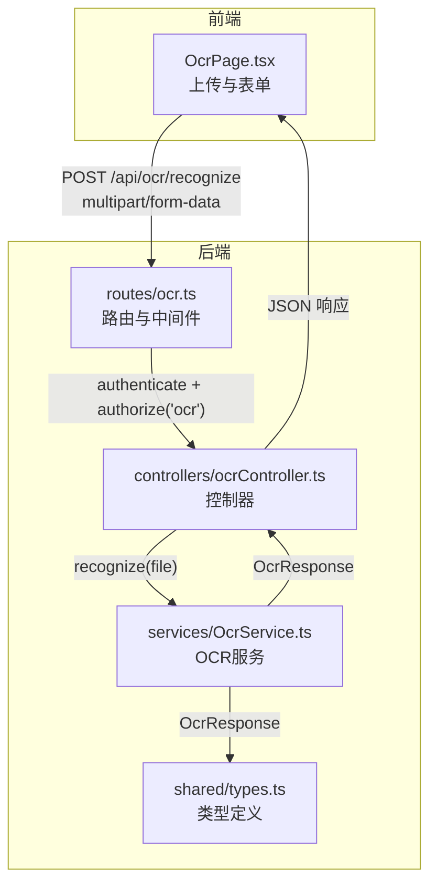
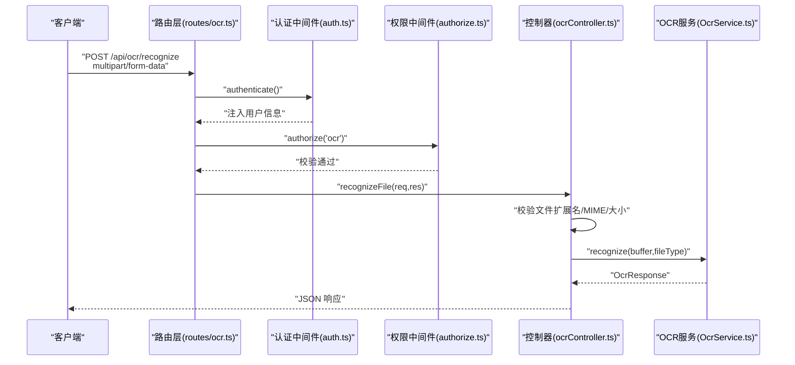
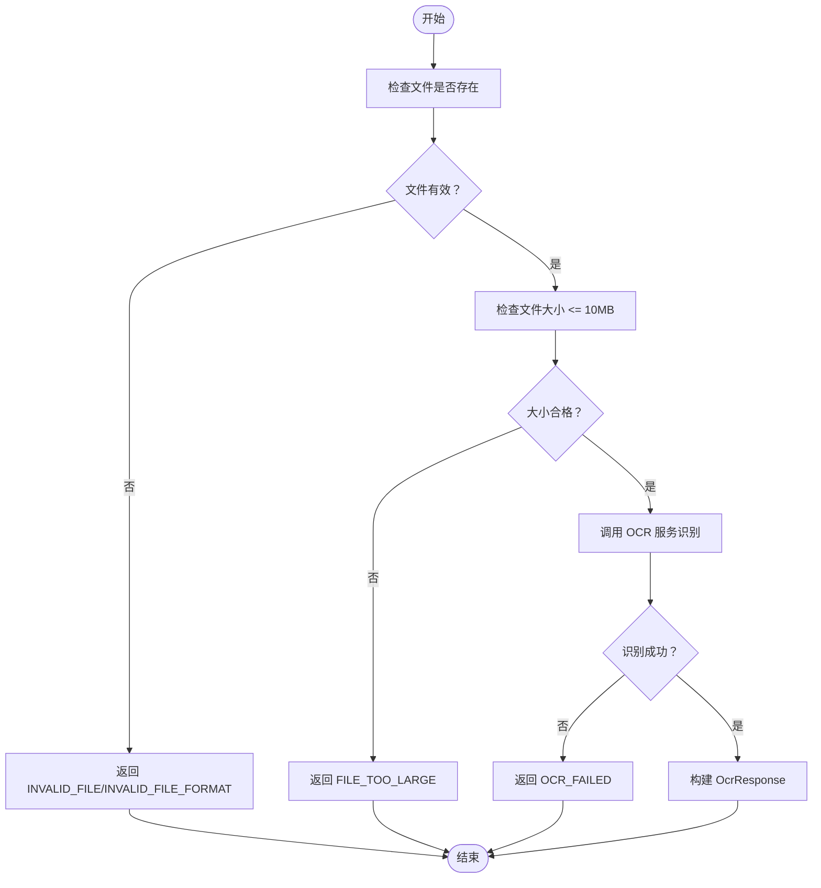
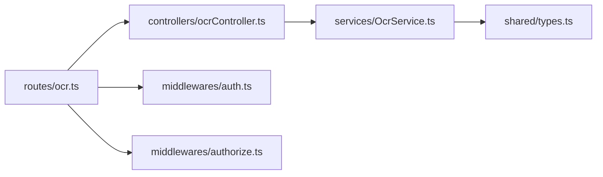

# OCR识别接口

<cite>
**本文引用的文件**
- [backend/src/controllers/ocrController.ts](file://backend/src/controllers/ocrController.ts)
- [backend/src/routes/ocr.ts](file://backend/src/routes/ocr.ts)
- [backend/src/services/OcrService.ts](file://backend/src/services/OcrService.ts)
- [shared/types.ts](file://shared/types.ts)
- [backend/src/middlewares/auth.ts](file://backend/src/middlewares/auth.ts)
- [backend/src/middlewares/authorize.ts](file://backend/src/middlewares/authorize.ts)
- [frontend/src/pages/OcrPage.tsx](file://frontend/src/pages/OcrPage.tsx)
- [.kiro/specs/archive-management-system/design.md](file://.kiro/specs/archive-management-system/design.md)
</cite>

## 目录
1. [简介](#简介)
2. [项目结构](#项目结构)
3. [核心组件](#核心组件)
4. [架构总览](#架构总览)
5. [详细组件分析](#详细组件分析)
6. [依赖关系分析](#依赖关系分析)
7. [性能考虑](#性能考虑)
8. [故障排查指南](#故障排查指南)
9. [结论](#结论)
10. [附录](#附录)

## 简介
本文件面向OCR识别相关API接口，重点记录后端接口“POST /api/ocr/recognize”的完整规范，包括：
- 上传文件格式要求（支持类型、大小限制）
- 请求参数与响应结构
- OCR服务调用流程、错误处理与重试策略
- 识别结果的文本提取与结构化输出
- 文件预处理、质量检查与异常处理
- 性能优化建议与并发能力、监控指标

## 项目结构
与OCR识别接口直接相关的后端模块组织如下：
- 路由层：注册“/api/ocr/recognize”端点，绑定认证与权限中间件，并配置文件上传中间件
- 控制器层：接收上传文件，进行格式与大小校验，调用OCR服务并返回结果
- 服务层：封装OCR引擎与字段提取器，提供统一识别流程
- 类型定义：前后端共享的OCR响应结构
- 前端页面：提供上传、识别、展示与保存为档案记录的交互

图表来源
- [backend/src/routes/ocr.ts:1-21](file://backend/src/routes/ocr.ts#L1-L21)
- [backend/src/controllers/ocrController.ts:1-94](file://backend/src/controllers/ocrController.ts#L1-L94)
- [backend/src/services/OcrService.ts:1-192](file://backend/src/services/OcrService.ts#L1-L192)
- [shared/types.ts:218-238](file://shared/types.ts#L218-L238)

章节来源
- [backend/src/routes/ocr.ts:1-21](file://backend/src/routes/ocr.ts#L1-L21)
- [backend/src/controllers/ocrController.ts:1-94](file://backend/src/controllers/ocrController.ts#L1-L94)
- [backend/src/services/OcrService.ts:1-192](file://backend/src/services/OcrService.ts#L1-L192)
- [shared/types.ts:218-238](file://shared/types.ts#L218-L238)

## 核心组件
- 路由与中间件
  - 路由注册“POST /api/ocr/recognize”，使用内存存储的文件上传中间件
  - 需要认证中间件与权限中间件（权限标识为“ocr”）
- 控制器
  - 校验上传文件是否存在、扩展名与MIME类型、文件大小
  - 调用OCR服务执行识别，返回结构化结果或错误
- OCR服务
  - 组合“引擎”与“字段提取器”，默认提供Mock引擎与默认字段提取器
  - 支持自定义替换真实OCR引擎
- 类型定义
  - 定义OCR字段与响应结构，包含字段值与置信度

章节来源
- [backend/src/routes/ocr.ts:14-18](file://backend/src/routes/ocr.ts#L14-L18)
- [backend/src/controllers/ocrController.ts:10-21](file://backend/src/controllers/ocrController.ts#L10-L21)
- [backend/src/controllers/ocrController.ts:43-92](file://backend/src/controllers/ocrController.ts#L43-L92)
- [backend/src/services/OcrService.ts:157-191](file://backend/src/services/OcrService.ts#L157-L191)
- [shared/types.ts:220-238](file://shared/types.ts#L220-L238)

## 架构总览
下图展示了从客户端发起上传到返回OCR识别结果的端到端流程，以及中间件与服务层的协作关系。

图表来源
- [backend/src/routes/ocr.ts:14-18](file://backend/src/routes/ocr.ts#L14-L18)
- [backend/src/middlewares/auth.ts:26-55](file://backend/src/middlewares/auth.ts#L26-L55)
- [backend/src/middlewares/authorize.ts:16-45](file://backend/src/middlewares/authorize.ts#L16-L45)
- [backend/src/controllers/ocrController.ts:43-92](file://backend/src/controllers/ocrController.ts#L43-L92)
- [backend/src/services/OcrService.ts:157-191](file://backend/src/services/OcrService.ts#L157-L191)

## 详细组件分析

### 接口规范：POST /api/ocr/recognize
- 方法与路径
  - POST /api/ocr/recognize
- 认证与权限
  - 需要认证中间件（从Authorization头提取Bearer Token）
  - 需要权限“ocr”
- 内容类型
  - multipart/form-data
- 请求体字段
  - file: 二进制文件流（JPG/JPEG、PNG、PDF）
- 成功响应
  - JSON对象，包含success标志与fields字段集合
  - fields中的每个字段包含value与confidence
- 错误响应
  - JSON对象，包含code与message
  - 常见错误码：INVALID_FILE、INVALID_FILE_FORMAT、FILE_TOO_LARGE、OCR_FAILED

章节来源
- [backend/src/routes/ocr.ts:17-18](file://backend/src/routes/ocr.ts#L17-L18)
- [backend/src/middlewares/auth.ts:26-55](file://backend/src/middlewares/auth.ts#L26-L55)
- [backend/src/middlewares/authorize.ts:16-45](file://backend/src/middlewares/authorize.ts#L16-L45)
- [backend/src/controllers/ocrController.ts:43-92](file://backend/src/controllers/ocrController.ts#L43-L92)
- [shared/types.ts:220-238](file://shared/types.ts#L220-L238)

### 文件上传与校验
- 支持的文件类型
  - JPG/JPEG、PNG、PDF
- 文件大小限制
  - 最大10MB
- 校验逻辑
  - 检查是否存在文件
  - 校验扩展名与MIME类型
  - 校验文件大小

章节来源
- [backend/src/controllers/ocrController.ts:10-21](file://backend/src/controllers/ocrController.ts#L10-L21)
- [backend/src/controllers/ocrController.ts:46-71](file://backend/src/controllers/ocrController.ts#L46-L71)

### OCR服务调用流程
- 流程概述
  - 控制器接收文件后，调用OCR服务
  - OCR服务内部调用引擎识别，再由字段提取器解析结构化字段
  - 返回统一的OcrResponse结构
- 异常处理
  - 引擎抛错或识别失败时，服务返回success=false且字段置信度为0
- 结果结构
  - success: boolean
  - fields: 包含customerName、fundAccount、branchName、contractType、openDate、contractVersionType
  - rawText: 原始识别文本（可选）

图表来源
- [backend/src/controllers/ocrController.ts:43-92](file://backend/src/controllers/ocrController.ts#L43-L92)
- [backend/src/services/OcrService.ts:172-191](file://backend/src/services/OcrService.ts#L172-L191)

章节来源
- [backend/src/controllers/ocrController.ts:43-92](file://backend/src/controllers/ocrController.ts#L43-L92)
- [backend/src/services/OcrService.ts:157-191](file://backend/src/services/OcrService.ts#L157-L191)

### 字段提取与置信度计算
- 字段提取器默认行为
  - 从原始文本按行匹配，提取指定字段
  - 未匹配到的字段置信度为0
- 置信度调整规则
  - 基于字段值的合理性进行因子调整
  - 示例规则：资金账号必须为纯数字；开户日期需符合YYYY-MM-DD格式；合同版本类型限定为“电子版/纸质版”
- 低置信度阈值
  - 前端阈值为0.8；字段置信度低于阈值时会提示人工复核

章节来源
- [backend/src/services/OcrService.ts:78-149](file://backend/src/services/OcrService.ts#L78-L149)
- [frontend/src/pages/OcrPage.tsx:9-11](file://frontend/src/pages/OcrPage.tsx#L9-L11)

### 前端交互与集成
- 上传与识别
  - 前端使用Ant Design Upload组件，限制文件类型与大小
  - 上传后自动触发识别，识别完成后填充表单并显示置信度
- 保存为档案记录
  - 将识别结果转换为Excel并调用导入接口创建档案记录

章节来源
- [frontend/src/pages/OcrPage.tsx:38-85](file://frontend/src/pages/OcrPage.tsx#L38-L85)
- [frontend/src/pages/OcrPage.tsx:103-154](file://frontend/src/pages/OcrPage.tsx#L103-L154)

## 依赖关系分析
- 组件耦合
  - 路由层依赖控制器；控制器依赖OCR服务；服务依赖类型定义
  - 中间件独立于业务逻辑，提供横切关注点（认证、授权）
- 外部依赖
  - express、multer（文件上传）、jsonwebtoken（JWT）、bcryptjs（密码加密）、better-sqlite3（数据库）
- 接口契约
  - 控制器与服务之间通过OcrResponse接口解耦，便于替换真实OCR引擎

图表来源
- [backend/src/routes/ocr.ts:1-21](file://backend/src/routes/ocr.ts#L1-L21)
- [backend/src/controllers/ocrController.ts:1-94](file://backend/src/controllers/ocrController.ts#L1-L94)
- [backend/src/services/OcrService.ts:1-192](file://backend/src/services/OcrService.ts#L1-L192)
- [shared/types.ts:218-238](file://shared/types.ts#L218-L238)
- [backend/src/middlewares/auth.ts:1-56](file://backend/src/middlewares/auth.ts#L1-L56)
- [backend/src/middlewares/authorize.ts:1-47](file://backend/src/middlewares/authorize.ts#L1-L47)

章节来源
- [backend/src/routes/ocr.ts:1-21](file://backend/src/routes/ocr.ts#L1-L21)
- [backend/src/controllers/ocrController.ts:1-94](file://backend/src/controllers/ocrController.ts#L1-L94)
- [backend/src/services/OcrService.ts:1-192](file://backend/src/services/OcrService.ts#L1-L192)
- [shared/types.ts:218-238](file://shared/types.ts#L218-L238)
- [backend/src/middlewares/auth.ts:1-56](file://backend/src/middlewares/auth.ts#L1-L56)
- [backend/src/middlewares/authorize.ts:1-47](file://backend/src/middlewares/authorize.ts#L1-L47)

## 性能考虑
- 并发与吞吐
  - 当前实现为同步调用，未内置队列与并发控制
  - 建议引入任务队列（如Redis+Worker）与限流策略，以提升高并发场景下的稳定性
- 存储与I/O
  - 使用内存存储上传文件，适合小文件；大文件可能导致内存压力
  - 建议改为临时磁盘存储或云存储预签名URL，减少内存占用
- 识别耗时
  - Mock引擎仅作演示；真实OCR引擎可能耗时较长
  - 建议采用异步识别+轮询或WebSocket推送结果
- 缓存与预热
  - 对常用模板字段的正则可做缓存
  - OCR引擎初始化可做预热，避免首次请求延迟

## 故障排查指南
- 常见错误与处理
  - 文件格式不支持：检查扩展名与MIME类型是否为JPG/JPEG/PNG/PDF
  - 文件过大：确保文件小于10MB
  - 识别失败：检查图片清晰度、角度与对比度
  - 权限不足：确认用户角色具备“ocr”权限
  - 令牌无效：确认Authorization头格式与有效期
- 前端提示
  - 低置信度字段会以黄色边框与警告图标提示，建议人工复核
- 日志与监控
  - 建议记录请求ID、用户ID、文件大小、识别耗时、错误码等指标
  - 监控识别成功率、平均耗时、失败率与超时率

章节来源
- [backend/src/controllers/ocrController.ts:46-71](file://backend/src/controllers/ocrController.ts#L46-L71)
- [backend/src/middlewares/auth.ts:26-55](file://backend/src/middlewares/auth.ts#L26-L55)
- [backend/src/middlewares/authorize.ts:16-45](file://backend/src/middlewares/authorize.ts#L16-L45)
- [frontend/src/pages/OcrPage.tsx:156-175](file://frontend/src/pages/OcrPage.tsx#L156-L175)
- [.kiro/specs/archive-management-system/design.md:846-865](file://.kiro/specs/archive-management-system/design.md#L846-L865)

## 结论
本接口提供了从文件上传到OCR识别再到结构化输出的完整链路，具备明确的格式与大小限制、完善的错误处理与前端可视化提示。建议在生产环境中替换Mock引擎为真实OCR服务，并引入异步处理、队列与限流机制，以满足高并发与稳定性需求。

## 附录

### 请求与响应规范
- 请求
  - 方法：POST
  - 路径：/api/ocr/recognize
  - 头部：Content-Type: multipart/form-data
  - 参数：file（二进制文件）
- 成功响应
  - 结构：包含success与fields
  - fields：customerName、fundAccount、branchName、contractType、openDate、contractVersionType
  - 每个字段包含value与confidence
- 失败响应
  - 结构：包含code与message
  - 常见错误码：INVALID_FILE、INVALID_FILE_FORMAT、FILE_TOO_LARGE、OCR_FAILED

章节来源
- [backend/src/routes/ocr.ts:17-18](file://backend/src/routes/ocr.ts#L17-L18)
- [backend/src/controllers/ocrController.ts:43-92](file://backend/src/controllers/ocrController.ts#L43-L92)
- [shared/types.ts:220-238](file://shared/types.ts#L220-L238)

### 支持的语言与模板
- 当前实现基于中文字段模板（如“客户姓名”、“资金账号”等），未显式支持多语言
- 如需国际化，可在字段提取器中增加多语言正则映射与模板切换逻辑

章节来源
- [backend/src/services/OcrService.ts:65-72](file://backend/src/services/OcrService.ts#L65-L72)

### 文件预处理与质量检查
- 建议在上传前进行预处理（如压缩、去噪、矫正角度），以提升识别准确率
- 前端可对图片尺寸与分辨率进行提示，避免过小或模糊导致识别失败

章节来源
- [frontend/src/pages/OcrPage.tsx:88-101](file://frontend/src/pages/OcrPage.tsx#L88-L101)

### 重试机制
- 当前未实现自动重试；建议在前端或网关层对网络抖动与超时进行指数退避重试
- 对于识别失败但可人工复核的场景，建议提供“重新识别”按钮

章节来源
- [backend/src/services/OcrService.ts:172-191](file://backend/src/services/OcrService.ts#L172-L191)
- [.kiro/specs/archive-management-system/design.md:846-865](file://.kiro/specs/archive-management-system/design.md#L846-L865)