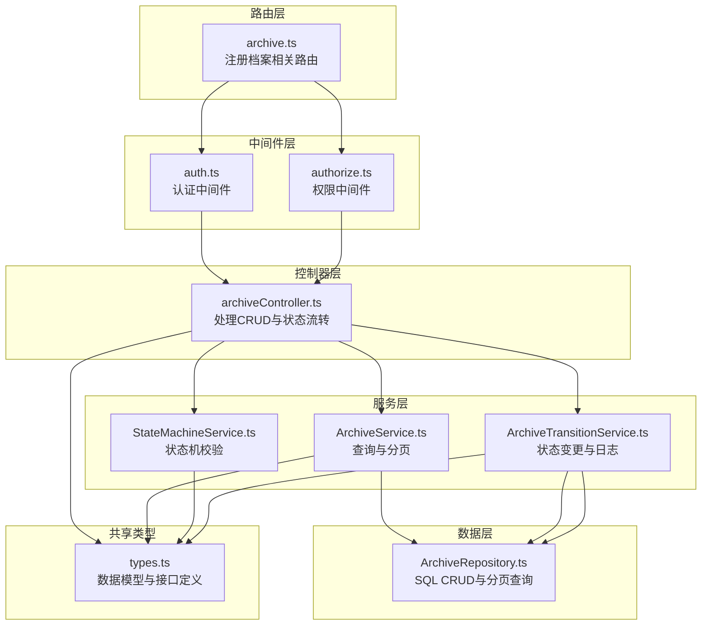
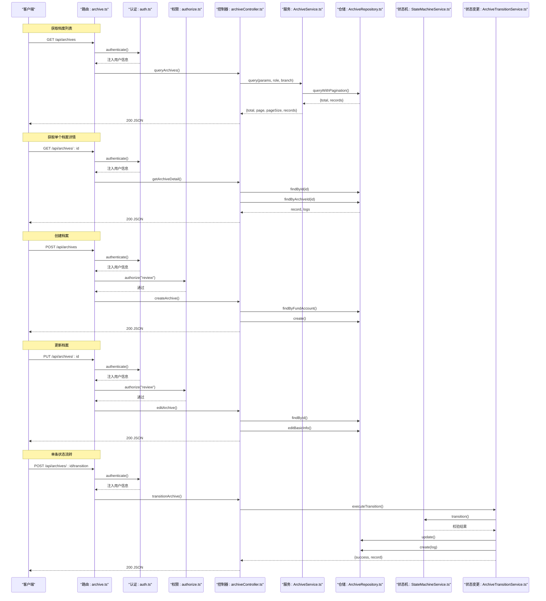
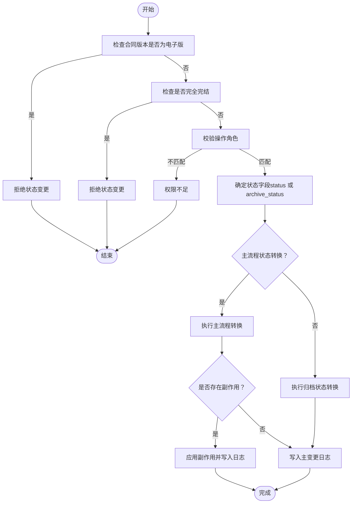
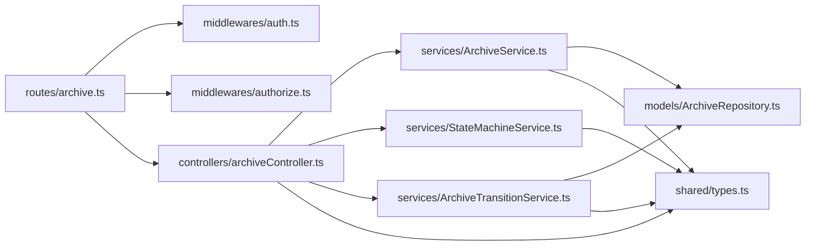

# 档案管理接口

<cite>
**本文引用的文件**
- [backend/src/routes/archive.ts](file://backend/src/routes/archive.ts)
- [backend/src/controllers/archiveController.ts](file://backend/src/controllers/archiveController.ts)
- [backend/src/services/ArchiveService.ts](file://backend/src/services/ArchiveService.ts)
- [backend/src/models/ArchiveRepository.ts](file://backend/src/models/ArchiveRepository.ts)
- [backend/src/middlewares/auth.ts](file://backend/src/middlewares/auth.ts)
- [backend/src/middlewares/authorize.ts](file://backend/src/middlewares/authorize.ts)
- [backend/src/services/StateMachineService.ts](file://backend/src/services/StateMachineService.ts)
- [backend/src/services/ArchiveTransitionService.ts](file://backend/src/services/ArchiveTransitionService.ts)
- [shared/types.ts](file://shared/types.ts)
- [backend/tests/unit/archiveController.test.ts](file://backend/tests/unit/archiveController.test.ts)
- [backend/tests/unit/archiveDetail.test.ts](file://backend/tests/unit/archiveDetail.test.ts)
- [backend/tests/unit/archiveQuery.test.ts](file://backend/tests/unit/archiveQuery.test.ts)
</cite>

## 目录
1. [简介](#简介)
2. [项目结构](#项目结构)
3. [核心组件](#核心组件)
4. [架构总览](#架构总览)
5. [详细组件分析](#详细组件分析)
6. [依赖关系分析](#依赖关系分析)
7. [性能考虑](#性能考虑)
8. [故障排查指南](#故障排查指南)
9. [结论](#结论)
10. [附录](#附录)

## 简介
本文件面向档案管理相关API接口，提供完整的技术文档，涵盖以下CRUD与状态流转能力：
- 获取档案列表（GET /api/archives）
- 获取单个档案（GET /api/archives/:id）
- 创建档案（POST /api/archives）
- 更新档案（PUT /api/archives/:id）
- 删除档案（DELETE /api/archives/:id）

文档内容包括：请求参数与查询条件、响应格式与状态码、数据模型字段定义与验证规则、分页查询与筛选、档案状态字段说明、权限控制机制、批量操作支持、请求与响应示例以及常见错误处理策略。

## 项目结构
后端采用分层架构：路由层负责HTTP路由注册与中间件装配；控制器层处理业务入口与错误响应；服务层封装查询与状态机逻辑；仓储层负责SQLite数据访问；共享类型定义前后端一致的数据契约。

图表来源
- [backend/src/routes/archive.ts:1-42](file://backend/src/routes/archive.ts#L1-L42)
- [backend/src/controllers/archiveController.ts:1-448](file://backend/src/controllers/archiveController.ts#L1-L448)
- [backend/src/services/ArchiveService.ts:1-71](file://backend/src/services/ArchiveService.ts#L1-L71)
- [backend/src/services/StateMachineService.ts:1-253](file://backend/src/services/StateMachineService.ts#L1-L253)
- [backend/src/services/ArchiveTransitionService.ts:1-156](file://backend/src/services/ArchiveTransitionService.ts#L1-L156)
- [backend/src/models/ArchiveRepository.ts:1-307](file://backend/src/models/ArchiveRepository.ts#L1-L307)
- [shared/types.ts:1-289](file://shared/types.ts#L1-L289)

章节来源
- [backend/src/routes/archive.ts:1-42](file://backend/src/routes/archive.ts#L1-L42)
- [backend/src/controllers/archiveController.ts:1-448](file://backend/src/controllers/archiveController.ts#L1-L448)
- [shared/types.ts:1-289](file://shared/types.ts#L1-L289)

## 核心组件
- 路由层：集中注册档案相关路由，绑定认证与权限中间件。
- 控制器层：实现具体API逻辑，进行参数校验、调用服务层并返回统一响应。
- 服务层：
  - ArchiveService：处理分页、默认值与分支机构数据隔离。
  - StateMachineService：校验状态流转合法性与角色权限。
  - ArchiveTransitionService：整合状态机、更新记录与写入状态变更日志。
- 数据层：ArchiveRepository提供CRUD与分页查询。
- 共享类型：统一定义数据模型、枚举与接口。

章节来源
- [backend/src/routes/archive.ts:1-42](file://backend/src/routes/archive.ts#L1-L42)
- [backend/src/controllers/archiveController.ts:1-448](file://backend/src/controllers/archiveController.ts#L1-L448)
- [backend/src/services/ArchiveService.ts:1-71](file://backend/src/services/ArchiveService.ts#L1-L71)
- [backend/src/services/StateMachineService.ts:1-253](file://backend/src/services/StateMachineService.ts#L1-L253)
- [backend/src/services/ArchiveTransitionService.ts:1-156](file://backend/src/services/ArchiveTransitionService.ts#L1-L156)
- [backend/src/models/ArchiveRepository.ts:1-307](file://backend/src/models/ArchiveRepository.ts#L1-L307)
- [shared/types.ts:1-289](file://shared/types.ts#L1-L289)

## 架构总览
下图展示档案CRUD与状态流转的关键交互序列：

图表来源
- [backend/src/routes/archive.ts:17-41](file://backend/src/routes/archive.ts#L17-L41)
- [backend/src/middlewares/auth.ts:26-55](file://backend/src/middlewares/auth.ts#L26-L55)
- [backend/src/middlewares/authorize.ts:16-46](file://backend/src/middlewares/authorize.ts#L16-L46)
- [backend/src/controllers/archiveController.ts:94-188](file://backend/src/controllers/archiveController.ts#L94-L188)
- [backend/src/controllers/archiveController.ts:326-396](file://backend/src/controllers/archiveController.ts#L326-L396)
- [backend/src/controllers/archiveController.ts:398-447](file://backend/src/controllers/archiveController.ts#L398-L447)
- [backend/src/controllers/archiveController.ts:203-258](file://backend/src/controllers/archiveController.ts#L203-L258)
- [backend/src/services/ArchiveService.ts:33-69](file://backend/src/services/ArchiveService.ts#L33-L69)
- [backend/src/models/ArchiveRepository.ts:222-305](file://backend/src/models/ArchiveRepository.ts#L222-L305)
- [backend/src/services/StateMachineService.ts:96-142](file://backend/src/services/StateMachineService.ts#L96-L142)
- [backend/src/services/ArchiveTransitionService.ts:46-125](file://backend/src/services/ArchiveTransitionService.ts#L46-L125)

## 详细组件分析

### 数据模型与字段定义
- 档案记录字段（ArchiveRecord）
  - id: string（主键）
  - customerName: string（客户姓名）
  - fundAccount: string（资金账号，唯一）
  - branchName: string（营业部）
  - contractType: string（合同类型）
  - openDate: string（开户日期 YYYY-MM-DD）
  - contractVersionType: ContractVersionType（合同版本类型：electronic/paper）
  - status: MainStatus | 'completed' | null（主流程状态，电子版为null，完全完结为completed）
  - archiveStatus: ArchiveSubStatus（综合部归档状态）
  - scanFileUrl?: string（扫描件URL）
  - createdAt: string（创建时间）
  - updatedAt: string（更新时间）

- 状态枚举
  - MainStatus：待分支机构寄出、在途、总部已收到、审核通过、审核不通过、待回寄、回寄在途、分支已收到
  - ArchiveSubStatus：归档待启动、待转交、待综合部入库、已归档-完结
  - TransitionAction：确认寄出、确认收到、审核通过、审核不通过、回寄分支、确认已寄出、确认收到回寄、转交综合部、确认入库

- 必填字段与验证规则
  - 创建档案必填：customerName、fundAccount、branchName、contractType、openDate、contractVersionType
  - 资金账号唯一性：创建与编辑均校验唯一
  - 合同版本类型仅允许：electronic、paper
  - 电子版合同：禁止除创建外的所有状态变更
  - 完全完结记录：禁止任何状态变更

章节来源
- [shared/types.ts:46-60](file://shared/types.ts#L46-L60)
- [shared/types.ts:14-43](file://shared/types.ts#L14-L43)
- [backend/src/controllers/archiveController.ts:340-396](file://backend/src/controllers/archiveController.ts#L340-L396)
- [backend/src/controllers/archiveController.ts:403-447](file://backend/src/controllers/archiveController.ts#L403-L447)
- [backend/src/services/StateMachineService.ts:106-131](file://backend/src/services/StateMachineService.ts#L106-L131)

### 权限控制机制
- 认证中间件 authenticate：从Authorization头提取Bearer Token，校验并注入用户信息到req.user
- 权限中间件 authorize：基于用户角色计算权限集合，校验是否具备所需权限
- 档案CRUD与状态流转的权限要求
  - 查询列表：需认证（所有角色可查询）
  - 创建/编辑档案：需认证 + review 权限
  - 单条/批量状态流转：需认证（角色校验由状态机内部完成）

章节来源
- [backend/src/middlewares/auth.ts:26-55](file://backend/src/middlewares/auth.ts#L26-L55)
- [backend/src/middlewares/authorize.ts:16-46](file://backend/src/middlewares/authorize.ts#L16-L46)
- [backend/src/routes/archive.ts:17-41](file://backend/src/routes/archive.ts#L17-L41)

### 获取档案列表（GET /api/archives）
- 功能概述
  - 支持多条件组合查询与分页
  - 分支机构用户自动过滤为本营业部数据
- 请求参数（查询字符串）
  - customerName: string（客户姓名，模糊匹配）
  - fundAccount: string（资金账号，精确匹配）
  - branchName: string（营业部，精确匹配）
  - contractType: string（合同类型，精确匹配）
  - status: MainStatus（主流程状态，精确匹配）
  - archiveStatus: ArchiveSubStatus（归档状态，精确匹配）
  - contractVersionType: ContractVersionType（合同版本类型，精确匹配）
  - openDateStart: string（开户日期起始，YYYY-MM-DD）
  - openDateEnd: string（开户日期结束，YYYY-MM-DD）
  - page: number（页码，默认1）
  - pageSize: number（每页数量，默认20）
- 响应格式
  - total: number（总记录数）
  - page: number（当前页）
  - pageSize: number（每页数量）
  - records: ArchiveRecord[]（档案列表）
- 状态码
  - 200 成功
  - 401 未提供认证令牌
- 示例
  - 请求：GET /api/archives?page=1&pageSize=20&branchName=北京营业部&status=in_transit
  - 响应：包含total、page、pageSize与records

章节来源
- [backend/src/controllers/archiveController.ts:94-147](file://backend/src/controllers/archiveController.ts#L94-L147)
- [backend/src/services/ArchiveService.ts:33-69](file://backend/src/services/ArchiveService.ts#L33-L69)
- [backend/src/models/ArchiveRepository.ts:222-305](file://backend/src/models/ArchiveRepository.ts#L222-L305)
- [backend/tests/unit/archiveQuery.test.ts:70-124](file://backend/tests/unit/archiveQuery.test.ts#L70-L124)

### 获取单个档案（GET /api/archives/:id）
- 功能概述
  - 返回档案详情与状态变更历史（按时间倒序）
- 请求参数
  - 路径参数：id（档案ID）
- 响应格式
  - record: ArchiveRecord
  - statusHistory: StatusChangeLog[]（状态变更历史）
- 状态码
  - 200 成功
  - 401 未提供认证令牌
  - 404 档案记录不存在
- 示例
  - 请求：GET /api/archives/:id
  - 响应：包含record与statusHistory

章节来源
- [backend/src/controllers/archiveController.ts:149-188](file://backend/src/controllers/archiveController.ts#L149-L188)
- [backend/src/models/ArchiveRepository.ts:122-138](file://backend/src/models/ArchiveRepository.ts#L122-L138)
- [backend/tests/unit/archiveDetail.test.ts:118-196](file://backend/tests/unit/archiveDetail.test.ts#L118-L196)

### 创建档案（POST /api/archives）
- 功能概述
  - 仅运营人员可创建
  - 电子版合同：status=null，archiveStatus=archived
  - 纸质版合同：status=pending_shipment，archiveStatus=archive_not_started
- 请求体
  - customerName、fundAccount、branchName、contractType、openDate、contractVersionType
- 响应格式
  - success: boolean
  - record: ArchiveRecord
- 状态码
  - 200 成功
  - 400 缺少必填字段/合同版本类型无效
  - 401 未提供认证令牌
  - 403 权限不足
  - 409 资金账号已存在
- 示例
  - 请求：POST /api/archives（携带上述字段）
  - 响应：success与record

章节来源
- [backend/src/controllers/archiveController.ts:326-396](file://backend/src/controllers/archiveController.ts#L326-L396)
- [backend/src/middlewares/authorize.ts:16-46](file://backend/src/middlewares/authorize.ts#L16-L46)
- [backend/tests/unit/archiveController.test.ts:142-183](file://backend/tests/unit/archiveController.test.ts#L142-L183)

### 更新档案（PUT /api/archives/:id）
- 功能概述
  - 仅运营人员可编辑
  - 完全完结记录不可编辑
  - 资金账号唯一性校验
- 请求体（可选字段）
  - customerName、fundAccount、branchName、contractType、openDate、contractVersionType
- 响应格式
  - success: boolean
  - record: ArchiveRecord
- 状态码
  - 200 成功
  - 400 完全完结/资金账号已存在
  - 401 未提供认证令牌
  - 403 权限不足
  - 404 档案记录不存在
- 示例
  - 请求：PUT /api/archives/:id（携带需要更新的字段）
  - 响应：success与record

章节来源
- [backend/src/controllers/archiveController.ts:398-447](file://backend/src/controllers/archiveController.ts#L398-L447)
- [backend/src/middlewares/authorize.ts:16-46](file://backend/src/middlewares/authorize.ts#L16-L46)
- [backend/tests/unit/archiveController.test.ts:142-183](file://backend/tests/unit/archiveController.test.ts#L142-L183)

### 删除档案（DELETE /api/archives/:id）
- 功能概述
  - 当前代码未实现删除接口
- 建议
  - 若需支持删除，建议在路由层新增DELETE /api/archives/:id，并在控制器与仓储层实现
  - 删除前需校验权限与记录状态，防止破坏数据完整性

章节来源
- [backend/src/routes/archive.ts:17-41](file://backend/src/routes/archive.ts#L17-L41)

### 状态流转（POST /api/archives/:id/transition 与 POST /api/archives/batch-transition）
- 单条状态流转
  - 请求体：action（TransitionAction）
  - 校验：电子版合同禁止状态变更；完全完结记录禁止；角色权限校验；状态转换合法性
  - 响应：success与record
  - 状态码：200 成功；400/404/401/403 错误
- 批量状态流转
  - 请求体：archiveIds（string[]）、action（仅支持特定操作）
  - 响应：successCount、failureCount与results明细
- 状态机规则要点
  - review_pass 联动：当archiveStatus为archive_not_started时，自动将archive_status设为pending_transfer
  - confirm_return_received 自动判断：根据archive_status决定后续状态（退回或完结）

图表来源
- [backend/src/services/StateMachineService.ts:96-252](file://backend/src/services/StateMachineService.ts#L96-L252)
- [backend/src/services/ArchiveTransitionService.ts:46-125](file://backend/src/services/ArchiveTransitionService.ts#L46-L125)
- [backend/src/controllers/archiveController.ts:203-258](file://backend/src/controllers/archiveController.ts#L203-L258)

章节来源
- [backend/src/controllers/archiveController.ts:203-258](file://backend/src/controllers/archiveController.ts#L203-L258)
- [backend/src/controllers/archiveController.ts:279-324](file://backend/src/controllers/archiveController.ts#L279-L324)
- [backend/src/services/StateMachineService.ts:96-252](file://backend/src/services/StateMachineService.ts#L96-L252)
- [backend/src/services/ArchiveTransitionService.ts:46-156](file://backend/src/services/ArchiveTransitionService.ts#L46-L156)

## 依赖关系分析
- 路由依赖中间件：authenticate与authorize
- 控制器依赖服务层与仓储层
- 服务层依赖共享类型定义
- 状态机与状态变更服务共同保证状态流转的合法性与一致性

图表来源
- [backend/src/routes/archive.ts:1-42](file://backend/src/routes/archive.ts#L1-L42)
- [backend/src/controllers/archiveController.ts:1-448](file://backend/src/controllers/archiveController.ts#L1-L448)
- [backend/src/services/ArchiveService.ts:1-71](file://backend/src/services/ArchiveService.ts#L1-L71)
- [backend/src/services/StateMachineService.ts:1-253](file://backend/src/services/StateMachineService.ts#L1-L253)
- [backend/src/services/ArchiveTransitionService.ts:1-156](file://backend/src/services/ArchiveTransitionService.ts#L1-L156)
- [backend/src/models/ArchiveRepository.ts:1-307](file://backend/src/models/ArchiveRepository.ts#L1-L307)
- [shared/types.ts:1-289](file://shared/types.ts#L1-L289)

章节来源
- [backend/src/routes/archive.ts:1-42](file://backend/src/routes/archive.ts#L1-L42)
- [backend/src/controllers/archiveController.ts:1-448](file://backend/src/controllers/archiveController.ts#L1-L448)
- [shared/types.ts:1-289](file://shared/types.ts#L1-L289)

## 性能考虑
- 分页查询默认每页20条，避免一次性加载过多数据
- SQL查询使用索引友好的条件（精确匹配字段优先）
- 状态变更日志按时间倒序查询，建议对operated_at建立索引以提升排序性能
- 批量状态流转逐条执行，建议前端控制批次大小并结合进度反馈

## 故障排查指南
- 400 错误
  - 缺少必填字段：检查创建/编辑请求体
  - 合同版本类型无效：确保为electronic或paper
  - 批量请求参数非法：archiveIds需为非空数组，action需在允许范围内
- 401 错误
  - 未提供认证令牌或令牌无效：检查Authorization头格式与签名
- 403 错误
  - 权限不足：确认用户角色与所需权限匹配
- 404 错误
  - 档案记录不存在：确认ID有效
- 409 错误
  - 资金账号已存在：检查唯一性约束

章节来源
- [backend/src/controllers/archiveController.ts:43-71](file://backend/src/controllers/archiveController.ts#L43-L71)
- [backend/src/controllers/archiveController.ts:340-396](file://backend/src/controllers/archiveController.ts#L340-L396)
- [backend/src/controllers/archiveController.ts:403-447](file://backend/src/controllers/archiveController.ts#L403-L447)
- [backend/src/middlewares/auth.ts:26-55](file://backend/src/middlewares/auth.ts#L26-L55)
- [backend/src/middlewares/authorize.ts:16-46](file://backend/src/middlewares/authorize.ts#L16-L46)

## 结论
本接口体系通过清晰的分层设计与严格的权限控制，实现了档案的全生命周期管理。查询支持灵活筛选与分页，状态流转遵循明确的状态机规则并具备完善的日志追踪。建议后续补充删除接口与扫描件上传能力，进一步完善档案管理闭环。

## 附录
- 统一错误响应结构
  - code: string（错误码）
  - message: string（用户可读错误信息）
  - details?: unknown（可选详细信息）

章节来源
- [shared/types.ts:242-247](file://shared/types.ts#L242-L247)