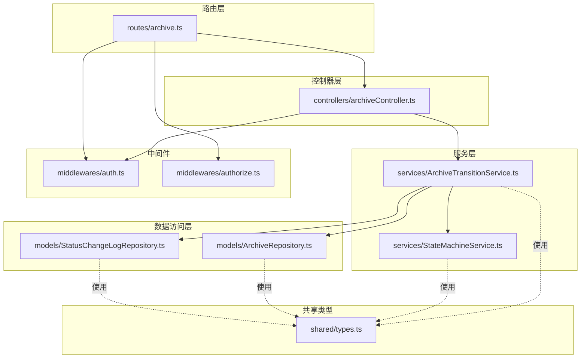
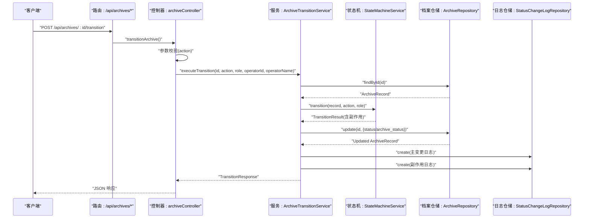
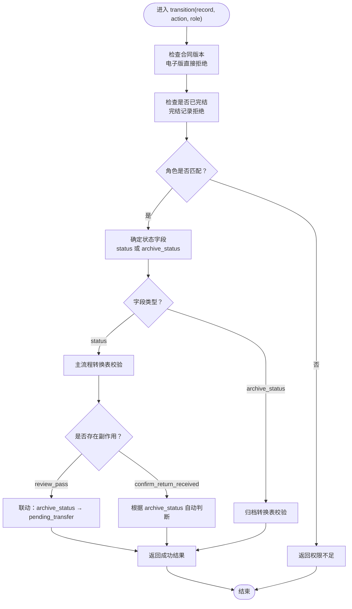
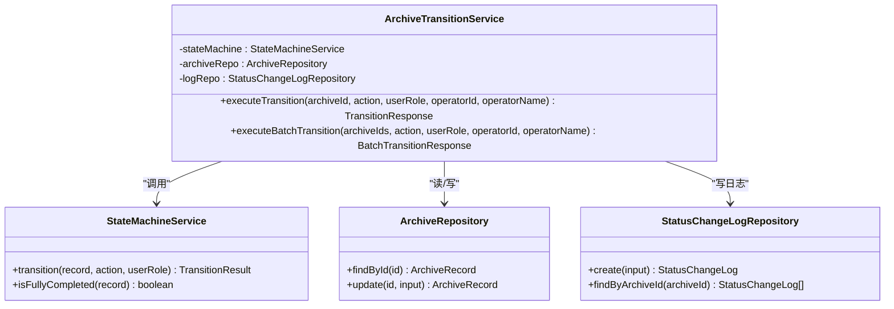
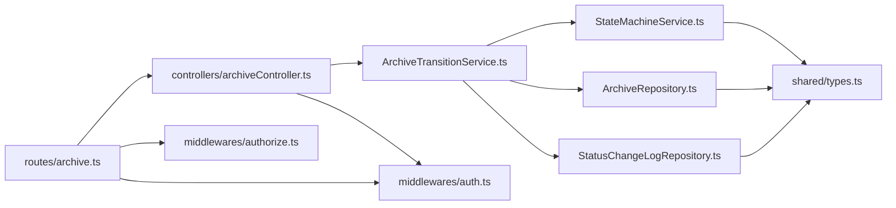

# 状态流转接口

<cite>
**本文引用的文件**
- [backend/src/routes/archive.ts](file://backend/src/routes/archive.ts)
- [backend/src/controllers/archiveController.ts](file://backend/src/controllers/archiveController.ts)
- [backend/src/services/ArchiveTransitionService.ts](file://backend/src/services/ArchiveTransitionService.ts)
- [backend/src/services/StateMachineService.ts](file://backend/src/services/StateMachineService.ts)
- [backend/src/models/ArchiveRepository.ts](file://backend/src/models/ArchiveRepository.ts)
- [backend/src/models/StatusChangeLogRepository.ts](file://backend/src/models/StatusChangeLogRepository.ts)
- [shared/types.ts](file://shared/types.ts)
- [backend/tests/unit/archiveTransition.test.ts](file://backend/tests/unit/archiveTransition.test.ts)
- [backend/src/middlewares/auth.ts](file://backend/src/middlewares/auth.ts)
- [backend/src/middlewares/authorize.ts](file://backend/src/middlewares/authorize.ts)
</cite>

## 目录
1. [简介](#简介)
2. [项目结构](#项目结构)
3. [核心组件](#核心组件)
4. [架构总览](#架构总览)
5. [详细组件分析](#详细组件分析)
6. [依赖关系分析](#依赖关系分析)
7. [性能考量](#性能考量)
8. [故障排查指南](#故障排查指南)
9. [结论](#结论)
10. [附录](#附录)

## 简介
本文件面向“状态流转相关API接口”的使用者与维护者，系统化地文档化以下两类接口：
- 单个档案状态流转接口：POST /api/archives/:id/transition
- 批量状态流转接口：POST /api/archives/batch-transition

内容涵盖：
- 触发条件与权限要求
- 业务规则与状态机校验
- 合法状态转移路径与前置条件检查
- 请求参数与响应结构
- 审计日志记录策略
- 不同角色的权限矩阵与典型业务场景
- 异常处理与调试方法
- 状态变更历史查询与并发控制建议

## 项目结构
围绕状态流转的核心模块如下：
- 路由层：注册状态流转相关路由
- 控制器层：接收请求、参数校验、调用服务层
- 服务层：整合状态机校验、档案更新、日志写入
- 数据访问层：档案记录与状态变更日志的持久化
- 类型定义：统一的实体、枚举与接口定义
- 中间件：认证与权限校验
- 测试：覆盖成功/失败路径与日志行为

图表来源
- [backend/src/routes/archive.ts:1-42](file://backend/src/routes/archive.ts#L1-L42)
- [backend/src/controllers/archiveController.ts:190-324](file://backend/src/controllers/archiveController.ts#L190-L324)
- [backend/src/services/ArchiveTransitionService.ts:24-156](file://backend/src/services/ArchiveTransitionService.ts#L24-L156)
- [backend/src/services/StateMachineService.ts:96-253](file://backend/src/services/StateMachineService.ts#L96-L253)
- [backend/src/models/ArchiveRepository.ts:85-307](file://backend/src/models/ArchiveRepository.ts#L85-L307)
- [backend/src/models/StatusChangeLogRepository.ts:49-99](file://backend/src/models/StatusChangeLogRepository.ts#L49-L99)
- [shared/types.ts:46-216](file://shared/types.ts#L46-L216)
- [backend/src/middlewares/auth.ts:26-55](file://backend/src/middlewares/auth.ts#L26-L55)
- [backend/src/middlewares/authorize.ts:16-46](file://backend/src/middlewares/authorize.ts#L16-L46)

章节来源
- [backend/src/routes/archive.ts:1-42](file://backend/src/routes/archive.ts#L1-L42)
- [backend/src/controllers/archiveController.ts:190-324](file://backend/src/controllers/archiveController.ts#L190-L324)

## 核心组件
- 路由与控制器
  - 单条流转：POST /api/archives/:id/transition
  - 批量流转：POST /api/archives/batch-transition
- 状态机服务
  - 校验电子版合同保护、完结保护、角色权限
  - 根据动作确定状态字段（主流程或归档）
  - 生成主变更与副作用变更（如 review_pass 联动 archive_status）
- 状态变更服务
  - 组合状态机校验、档案更新、日志写入
  - 批量模式逐条执行并汇总结果
- 数据访问层
  - 档案记录：查询、更新、编辑基础信息
  - 状态变更日志：写入与按档案 ID 查询（倒序）

章节来源
- [backend/src/controllers/archiveController.ts:190-324](file://backend/src/controllers/archiveController.ts#L190-L324)
- [backend/src/services/StateMachineService.ts:96-253](file://backend/src/services/StateMachineService.ts#L96-L253)
- [backend/src/services/ArchiveTransitionService.ts:24-156](file://backend/src/services/ArchiveTransitionService.ts#L24-L156)
- [backend/src/models/ArchiveRepository.ts:85-307](file://backend/src/models/ArchiveRepository.ts#L85-L307)
- [backend/src/models/StatusChangeLogRepository.ts:49-99](file://backend/src/models/StatusChangeLogRepository.ts#L49-L99)

## 架构总览
状态流转的端到端调用序列如下：

图表来源
- [backend/src/routes/archive.ts:35-36](file://backend/src/routes/archive.ts#L35-L36)
- [backend/src/controllers/archiveController.ts:208-258](file://backend/src/controllers/archiveController.ts#L208-L258)
- [backend/src/services/ArchiveTransitionService.ts:46-125](file://backend/src/services/ArchiveTransitionService.ts#L46-L125)
- [backend/src/services/StateMachineService.ts:106-142](file://backend/src/services/StateMachineService.ts#L106-L142)
- [backend/src/models/ArchiveRepository.ts:140-174](file://backend/src/models/ArchiveRepository.ts#L140-L174)
- [backend/src/models/StatusChangeLogRepository.ts:56-79](file://backend/src/models/StatusChangeLogRepository.ts#L56-L79)

## 详细组件分析

### 单个档案状态流转接口：POST /api/archives/:id/transition
- 功能概述
  - 对指定档案执行一次状态流转，返回更新后的记录
  - 若存在副作用（如 review_pass 联动 archive_status），会写入多条日志
- 请求参数
  - 路径参数
    - id：字符串，档案记录 ID
  - 请求体
    - action：枚举，取值来自状态流转动作集合
- 响应结构
  - 成功：success=true，record=更新后的档案记录
  - 失败：HTTP 400/404，包含统一错误码与消息
- 前置校验与业务规则
  - 电子版合同：禁止任何状态变更
  - 已完结记录：禁止任何状态变更
  - 角色校验：每个动作绑定特定角色
  - 合法路径：依据状态机转换表进行校验
- 审计日志
  - 成功时写入主变更日志；若存在副作用，再写入副作用日志
  - 日志包含状态字段、前后值、动作、操作人信息与时间戳
- 并发与事务
  - 服务层在单次调用内完成查询、状态机校验、更新与日志写入
  - 建议在数据库层面使用事务以保证一致性（见“性能考量”）

章节来源
- [backend/src/routes/archive.ts:35-36](file://backend/src/routes/archive.ts#L35-L36)
- [backend/src/controllers/archiveController.ts:208-258](file://backend/src/controllers/archiveController.ts#L208-L258)
- [shared/types.ts:189-199](file://shared/types.ts#L189-L199)
- [backend/src/services/ArchiveTransitionService.ts:46-125](file://backend/src/services/ArchiveTransitionService.ts#L46-L125)
- [backend/src/models/StatusChangeLogRepository.ts:56-79](file://backend/src/models/StatusChangeLogRepository.ts#L56-L79)

### 批量状态流转接口：POST /api/archives/batch-transition
- 功能概述
  - 对多个档案 ID 执行相同动作的状态流转
  - 逐条执行状态机校验，汇总成功/失败结果
- 请求参数
  - 请求体
    - archiveIds：字符串数组，至少包含一个 ID
    - action：枚举，取值来自状态流转动作集合
- 响应结构
  - successCount：整数，成功条数
  - failureCount：整数，失败条数
  - results：数组，每项包含 archiveId、success 与可选 message
- 前置校验与业务规则
  - 与单条一致：电子版合同、完结记录、角色校验、合法路径
  - 批量模式下，每个 ID 的校验独立进行
- 审计日志
  - 成功的每条记录都会写入相应日志
- 并发与事务
  - 逐条执行，无跨记录事务
  - 建议在批量入口处引入事务以确保原子性（见“性能考量”）

章节来源
- [backend/src/routes/archive.ts:26-27](file://backend/src/routes/archive.ts#L26-L27)
- [backend/src/controllers/archiveController.ts:279-324](file://backend/src/controllers/archiveController.ts#L279-L324)
- [shared/types.ts:201-216](file://shared/types.ts#L201-L216)
- [backend/src/services/ArchiveTransitionService.ts:131-154](file://backend/src/services/ArchiveTransitionService.ts#L131-L154)

### 状态机服务：StateMachineService
- 核心职责
  - 根据动作判断操作状态字段（主流程 status 或归档 archive_status）
  - 执行前置校验：电子版保护、完结保护、角色匹配
  - 依据状态转换表进行合法性校验，并在需要时生成副作用
- 关键映射
  - 动作到角色映射：ACTION_ROLE_MAP
  - 动作到状态字段映射：ACTION_STATUS_FIELD_MAP
  - 主流程状态转换表：MAIN_STATUS_TRANSITIONS
  - 归档状态转换表：ARCHIVE_STATUS_TRANSITIONS
- 副作用逻辑
  - review_pass：当 archive_status 为 archive_not_started 时，联动将 archive_status 变更为 pending_transfer
  - confirm_return_received：根据 archive_status 自动判断
    - 若为 archive_not_started：自动回退至 pending_shipment
    - 若为 archived：自动完结（status 变更为 completed）
    - 若为 pending_transfer/pending_archive：保持 branch_received
- 完结判定
  - isFullyCompleted：当 status === 'completed' 时视为完全完结

图表来源
- [backend/src/services/StateMachineService.ts:106-203](file://backend/src/services/StateMachineService.ts#L106-L203)
- [backend/src/services/StateMachineService.ts:205-243](file://backend/src/services/StateMachineService.ts#L205-L243)

章节来源
- [backend/src/services/StateMachineService.ts:96-253](file://backend/src/services/StateMachineService.ts#L96-L253)

### 状态变更服务：ArchiveTransitionService
- 核心职责
  - 组合状态机校验、档案记录更新、状态变更日志写入
  - 批量模式逐条执行并汇总结果
- 处理流程
  - 查询档案记录
  - 调用状态机校验，得到 TransitionResult
  - 构造更新输入（status 或 archive_status）
  - 处理副作用（如有）
  - 更新档案记录
  - 写入主变更日志与副作用日志
- 响应
  - 单条：返回 TransitionResponse
  - 批量：返回 BatchTransitionResponse

图表来源
- [backend/src/services/ArchiveTransitionService.ts:24-156](file://backend/src/services/ArchiveTransitionService.ts#L24-L156)
- [backend/src/services/StateMachineService.ts:96-253](file://backend/src/services/StateMachineService.ts#L96-L253)
- [backend/src/models/ArchiveRepository.ts:140-174](file://backend/src/models/ArchiveRepository.ts#L140-L174)
- [backend/src/models/StatusChangeLogRepository.ts:56-79](file://backend/src/models/StatusChangeLogRepository.ts#L56-L79)

章节来源
- [backend/src/services/ArchiveTransitionService.ts:24-156](file://backend/src/services/ArchiveTransitionService.ts#L24-L156)

### 数据访问层：ArchiveRepository 与 StatusChangeLogRepository
- ArchiveRepository
  - 提供 create、findById、findByFundAccount、update、editBasicInfo、queryWithPagination 等能力
  - 支持部分字段更新并自动更新 updated_at
- StatusChangeLogRepository
  - 提供 create、findById、findByArchiveId（按时间倒序）等能力
  - 用于状态变更历史查询

章节来源
- [backend/src/models/ArchiveRepository.ts:85-307](file://backend/src/models/ArchiveRepository.ts#L85-L307)
- [backend/src/models/StatusChangeLogRepository.ts:49-99](file://backend/src/models/StatusChangeLogRepository.ts#L49-L99)

### 权限与认证
- 认证中间件 authenticate
  - 从 Authorization 头提取 Bearer Token
  - 校验通过后将用户信息注入 req.user
- 权限中间件 authorize
  - 校验用户角色是否具备所需权限
  - 仅用于需要权限控制的路由（如创建档案）
- 状态流转接口
  - 单条与批量流转路由均使用 authenticate
  - 角色校验由状态机内部完成，不在路由层重复校验

章节来源
- [backend/src/middlewares/auth.ts:26-55](file://backend/src/middlewares/auth.ts#L26-L55)
- [backend/src/middlewares/authorize.ts:16-46](file://backend/src/middlewares/authorize.ts#L16-L46)
- [backend/src/routes/archive.ts:8-9](file://backend/src/routes/archive.ts#L8-L9)

### 类型定义与约束
- 角色与动作
  - UserRole：operator、branch、general_affairs
  - TransitionAction：9 种动作
- 状态
  - MainStatus：8 个主流程状态
  - ArchiveSubStatus：4 个归档状态
- 请求/响应
  - TransitionRequest、TransitionResponse
  - BatchTransitionRequest、BatchTransitionResponse
- 常量集合
  - USER_ROLES、CONTRACT_VERSION_TYPES、MAIN_STATUSES、ARCHIVE_SUB_STATUSES、TRANSITION_ACTIONS

章节来源
- [shared/types.ts:8-43](file://shared/types.ts#L8-L43)
- [shared/types.ts:189-216](file://shared/types.ts#L189-L216)

## 依赖关系分析
- 控制器依赖服务层，服务层依赖状态机与数据访问层
- 状态机依赖类型定义中的状态与动作枚举
- 路由层依赖控制器，控制器依赖中间件
- 日志仓储被服务层用于审计追踪

图表来源
- [backend/src/routes/archive.ts:1-42](file://backend/src/routes/archive.ts#L1-L42)
- [backend/src/controllers/archiveController.ts:190-324](file://backend/src/controllers/archiveController.ts#L190-L324)
- [backend/src/services/ArchiveTransitionService.ts:24-156](file://backend/src/services/ArchiveTransitionService.ts#L24-L156)
- [backend/src/services/StateMachineService.ts:96-253](file://backend/src/services/StateMachineService.ts#L96-L253)
- [backend/src/models/ArchiveRepository.ts:85-307](file://backend/src/models/ArchiveRepository.ts#L85-L307)
- [backend/src/models/StatusChangeLogRepository.ts:49-99](file://backend/src/models/StatusChangeLogRepository.ts#L49-L99)
- [shared/types.ts:46-216](file://shared/types.ts#L46-L216)
- [backend/src/middlewares/auth.ts:26-55](file://backend/src/middlewares/auth.ts#L26-L55)
- [backend/src/middlewares/authorize.ts:16-46](file://backend/src/middlewares/authorize.ts#L16-L46)

## 性能考量
- 单条流转
  - 服务层在单次调用内完成查询、校验、更新与日志写入
  - 建议在数据库层面使用事务包裹，确保一致性
- 批量流转
  - 逐条执行，无跨记录事务
  - 建议在批量入口处引入事务，或在数据库层启用批处理优化
- 查询与日志
  - 状态变更历史按时间倒序查询，注意索引优化
  - 日志写入为插入操作，建议批量写入或异步化以降低延迟

[本节为通用性能建议，不直接分析具体文件]

## 故障排查指南
- 常见错误与原因
  - 未提供认证令牌：HTTP 401
  - 权限不足：HTTP 400/403（状态机内部返回）
  - 档案记录不存在：HTTP 404
  - 电子版合同：禁止状态变更
  - 已完结记录：禁止状态变更
  - 非法状态跳转：状态机校验失败
- 审计日志定位
  - 使用 GET /api/archives/:id 查询详情，查看 statusHistory
  - 每条日志包含状态字段、前后值、动作、操作人与时间
- 调试方法
  - 在控制器与服务层增加日志输出
  - 使用单元测试覆盖关键路径（参考测试文件）
  - 验证状态机转换表与角色映射是否符合预期

章节来源
- [backend/src/controllers/archiveController.ts:208-258](file://backend/src/controllers/archiveController.ts#L208-L258)
- [backend/src/controllers/archiveController.ts:279-324](file://backend/src/controllers/archiveController.ts#L279-L324)
- [backend/src/models/StatusChangeLogRepository.ts:90-97](file://backend/src/models/StatusChangeLogRepository.ts#L90-L97)
- [backend/tests/unit/archiveTransition.test.ts:365-447](file://backend/tests/unit/archiveTransition.test.ts#L365-L447)

## 结论
- 状态流转接口通过清晰的路由、严格的参数校验、完备的状态机校验与审计日志，实现了可追溯、可控制的业务流程管理
- 单条与批量接口分别满足精细化与规模化操作需求
- 建议在生产环境中为关键路径引入事务与索引优化，以提升一致性与性能

[本节为总结性内容，不直接分析具体文件]

## 附录

### 权限矩阵（角色与动作）
- operator：confirm_received、review_pass、review_reject、return_branch、confirm_shipped_back、transfer_general
- branch：confirm_shipment、confirm_return_received
- general_affairs：confirm_archive

章节来源
- [backend/src/services/StateMachineService.ts:70-81](file://backend/src/services/StateMachineService.ts#L70-L81)

### 合法状态转移路径（主流程）
- pending_shipment → confirm_shipment → in_transit → confirm_received → hq_received
- hq_received → review_pass → review_passed → return_branch → pending_return → confirm_shipped_back → return_in_transit → confirm_return_received → branch_received
- branch_received → 根据 archive_status 自动判断：退回或完结

章节来源
- [backend/src/services/StateMachineService.ts:29-54](file://backend/src/services/StateMachineService.ts#L29-L54)

### 合法状态转移路径（归档）
- archive_not_started → review_pass（联动）→ pending_transfer → transfer_general → pending_archive → confirm_archive → archived

章节来源
- [backend/src/services/StateMachineService.ts:56-68](file://backend/src/services/StateMachineService.ts#L56-L68)

### 请求与响应示例（路径）
- 单条流转请求体：[TransitionRequest:189-192](file://shared/types.ts#L189-L192)
- 单条流转响应体：[TransitionResponse:194-199](file://shared/types.ts#L194-L199)
- 批量流转请求体：[BatchTransitionRequest:201-205](file://shared/types.ts#L201-L205)
- 批量流转响应体：[BatchTransitionResponse:207-216](file://shared/types.ts#L207-L216)

### 状态变更历史查询
- 接口：GET /api/archives/:id
- 返回：record + statusHistory（按时间倒序）
- 日志仓储：[StatusChangeLogRepository.findByArchiveId:90-97](file://backend/src/models/StatusChangeLogRepository.ts#L90-L97)

章节来源
- [backend/src/controllers/archiveController.ts:153-188](file://backend/src/controllers/archiveController.ts#L153-L188)
- [backend/src/models/StatusChangeLogRepository.ts:90-97](file://backend/src/models/StatusChangeLogRepository.ts#L90-L97)

### 并发控制与事务建议
- 单条流转：建议在服务层使用数据库事务包裹查询、校验、更新与日志写入
- 批量流转：建议在批量入口处开启事务，逐条提交或回滚
- 索引优化：为状态字段与时间戳建立索引，提升日志查询效率

[本节为通用建议，不直接分析具体文件]