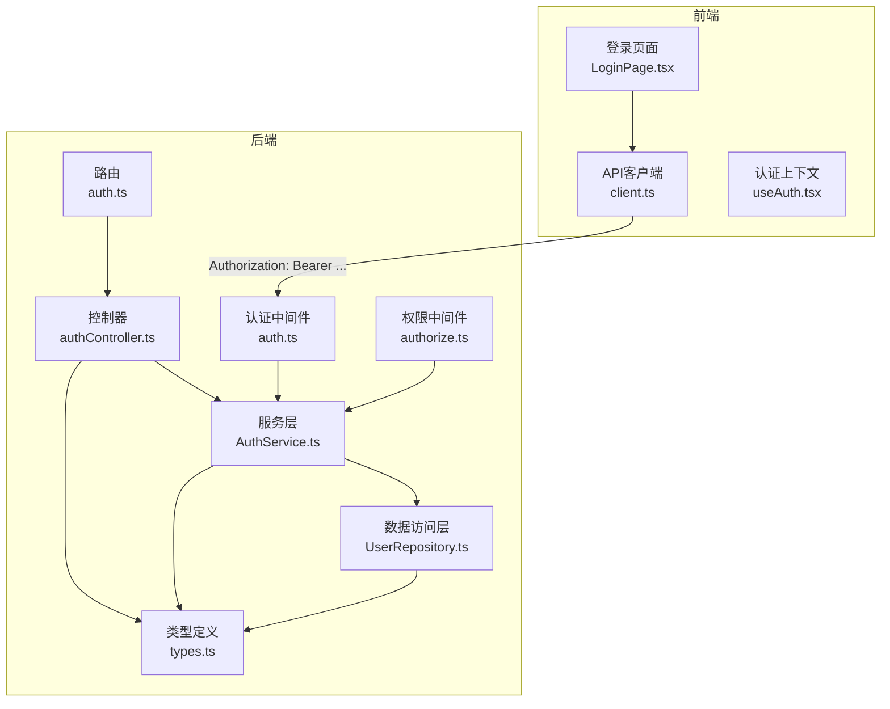
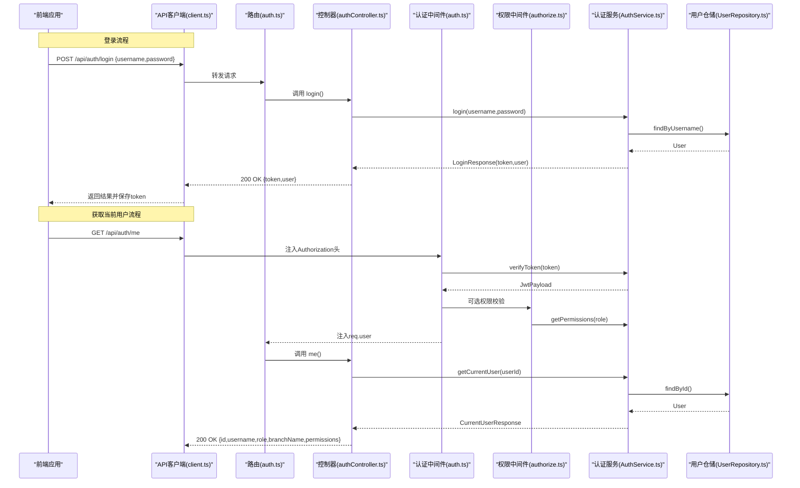
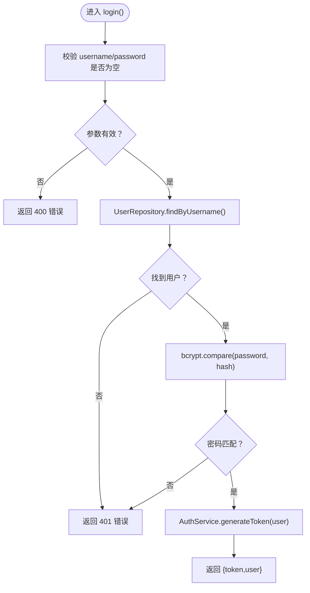
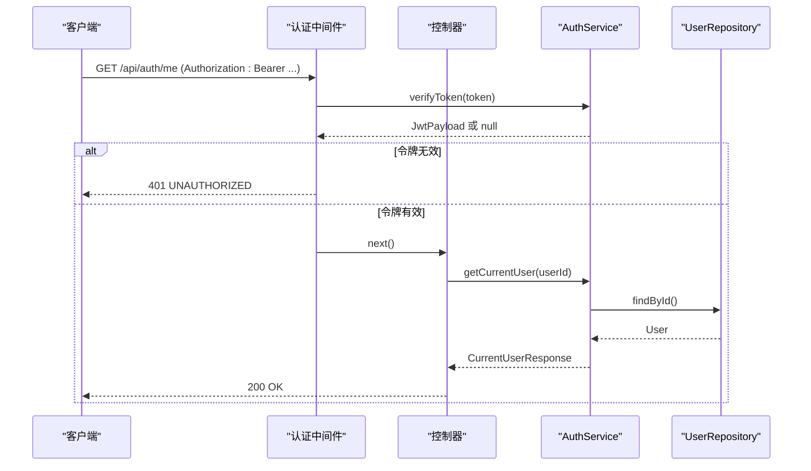
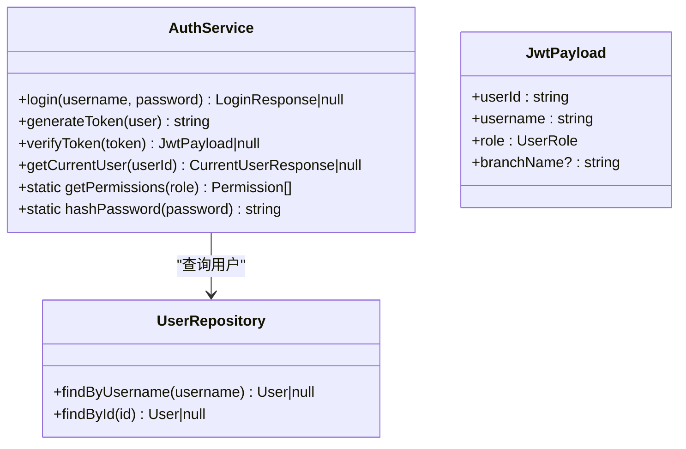
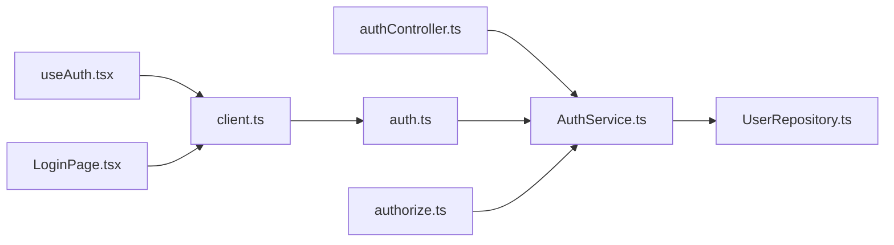

# 认证接口

<cite>
**本文引用的文件**
- [backend/src/controllers/authController.ts](file://backend/src/controllers/authController.ts)
- [backend/src/routes/auth.ts](file://backend/src/routes/auth.ts)
- [backend/src/middlewares/auth.ts](file://backend/src/middlewares/auth.ts)
- [backend/src/middlewares/authorize.ts](file://backend/src/middlewares/authorize.ts)
- [backend/src/services/AuthService.ts](file://backend/src/services/AuthService.ts)
- [backend/src/models/UserRepository.ts](file://backend/src/models/UserRepository.ts)
- [shared/types.ts](file://shared/types.ts)
- [backend/tests/unit/auth.test.ts](file://backend/tests/unit/auth.test.ts)
- [frontend/src/api/client.ts](file://frontend/src/api/client.ts)
- [frontend/src/hooks/useAuth.tsx](file://frontend/src/hooks/useAuth.tsx)
- [frontend/src/pages/LoginPage.tsx](file://frontend/src/pages/LoginPage.tsx)
- [backend/src/index.ts](file://backend/src/index.ts)
</cite>

## 目录
1. [简介](#简介)
2. [项目结构](#项目结构)
3. [核心组件](#核心组件)
4. [架构总览](#架构总览)
5. [详细组件分析](#详细组件分析)
6. [依赖关系分析](#依赖关系分析)
7. [性能考量](#性能考量)
8. [故障排查指南](#故障排查指南)
9. [结论](#结论)
10. [附录](#附录)

## 简介
本文件面向认证相关API接口，系统性记录以下能力：
- 用户登录接口：POST /api/auth/login
- 获取当前用户信息接口：GET /api/auth/me
- JWT认证中间件使用方式、令牌验证流程与权限检查机制
- 登录请求参数、响应结构、错误状态码与错误信息格式
- 认证头部设置方法、令牌刷新策略建议与安全最佳实践
- 常见认证问题排查与解决方案

## 项目结构
认证相关代码主要分布在后端控制器、路由、中间件、服务与模型层，并在前端通过统一API客户端自动注入认证头。

图表来源
- [backend/src/controllers/authController.ts:1-77](file://backend/src/controllers/authController.ts#L1-L77)
- [backend/src/routes/auth.ts:1-19](file://backend/src/routes/auth.ts#L1-L19)
- [backend/src/middlewares/auth.ts:1-56](file://backend/src/middlewares/auth.ts#L1-L56)
- [backend/src/middlewares/authorize.ts:1-47](file://backend/src/middlewares/authorize.ts#L1-L47)
- [backend/src/services/AuthService.ts:1-126](file://backend/src/services/AuthService.ts#L1-L126)
- [backend/src/models/UserRepository.ts:1-56](file://backend/src/models/UserRepository.ts#L1-L56)
- [shared/types.ts:106-130](file://shared/types.ts#L106-L130)
- [frontend/src/api/client.ts:1-55](file://frontend/src/api/client.ts#L1-L55)
- [frontend/src/hooks/useAuth.tsx:1-90](file://frontend/src/hooks/useAuth.tsx#L1-L90)
- [frontend/src/pages/LoginPage.tsx:1-81](file://frontend/src/pages/LoginPage.tsx#L1-L81)

章节来源
- [backend/src/index.ts:10-26](file://backend/src/index.ts#L10-L26)
- [backend/src/routes/auth.ts:6-18](file://backend/src/routes/auth.ts#L6-L18)

## 核心组件
- 认证控制器：处理登录与“当前用户”查询
- 认证中间件：从请求头提取并校验JWT，注入用户信息
- 权限中间件：基于角色的权限校验
- 认证服务：登录校验、JWT签发与校验、权限映射
- 用户仓储：基于better-sqlite3的用户查询
- 类型定义：统一的请求/响应与权限枚举
- 前端API客户端：自动注入Authorization头，统一处理401

章节来源
- [backend/src/controllers/authController.ts:12-76](file://backend/src/controllers/authController.ts#L12-L76)
- [backend/src/middlewares/auth.ts:26-55](file://backend/src/middlewares/auth.ts#L26-L55)
- [backend/src/middlewares/authorize.ts:16-46](file://backend/src/middlewares/authorize.ts#L16-L46)
- [backend/src/services/AuthService.ts:32-125](file://backend/src/services/AuthService.ts#L32-L125)
- [backend/src/models/UserRepository.ts:31-54](file://backend/src/models/UserRepository.ts#L31-L54)
- [shared/types.ts:106-130](file://shared/types.ts#L106-L130)
- [frontend/src/api/client.ts:10-17](file://frontend/src/api/client.ts#L10-L17)

## 架构总览
下图展示登录与“当前用户”接口的端到端流程，包括认证中间件与权限中间件的协作。

图表来源
- [backend/src/routes/auth.ts:12-16](file://backend/src/routes/auth.ts#L12-L16)
- [backend/src/controllers/authController.ts:16-43](file://backend/src/controllers/authController.ts#L16-L43)
- [backend/src/controllers/authController.ts:50-76](file://backend/src/controllers/authController.ts#L50-L76)
- [backend/src/middlewares/auth.ts:26-55](file://backend/src/middlewares/auth.ts#L26-L55)
- [backend/src/middlewares/authorize.ts:16-46](file://backend/src/middlewares/authorize.ts#L16-L46)
- [backend/src/services/AuthService.ts:43-65](file://backend/src/services/AuthService.ts#L43-L65)
- [backend/src/services/AuthService.ts:85-92](file://backend/src/services/AuthService.ts#L85-L92)
- [backend/src/services/AuthService.ts:97-110](file://backend/src/services/AuthService.ts#L97-L110)
- [backend/src/models/UserRepository.ts:39-54](file://backend/src/models/UserRepository.ts#L39-L54)

## 详细组件分析

### 登录接口：POST /api/auth/login
- 请求方法与路径：POST /api/auth/login
- 功能概述：接收用户名与密码，校验通过后返回JWT令牌与用户基本信息
- 请求体参数
  - username: string（必填）
  - password: string（必填）
- 成功响应
  - token: string（JWT）
  - user: 对象
    - id: string
    - username: string
    - role: 'operator' | 'branch' | 'general_affairs'
    - branchName?: string（仅当用户属于分支角色时存在）
- 失败响应
  - 400：请求参数缺失
  - 401：用户名或密码错误
  - 通用错误格式：{ code: string, message: string, details?: unknown }

图表来源
- [backend/src/controllers/authController.ts:16-43](file://backend/src/controllers/authController.ts#L16-L43)
- [backend/src/services/AuthService.ts:43-65](file://backend/src/services/AuthService.ts#L43-L65)
- [backend/src/models/UserRepository.ts:39-44](file://backend/src/models/UserRepository.ts#L39-L44)

章节来源
- [backend/src/controllers/authController.ts:12-43](file://backend/src/controllers/authController.ts#L12-L43)
- [backend/src/services/AuthService.ts:70-79](file://backend/src/services/AuthService.ts#L70-L79)
- [shared/types.ts:106-121](file://shared/types.ts#L106-L121)

### 获取当前用户信息：GET /api/auth/me
- 请求方法与路径：GET /api/auth/me
- 认证要求：必须携带有效的Authorization: Bearer <token>
- 成功响应
  - id: string
  - username: string
  - role: 'operator' | 'branch' | 'general_affairs'
  - branchName?: string
  - permissions: string[]（基于角色映射的权限列表）
- 失败响应
  - 401：未提供认证令牌或令牌无效/过期
  - 404：用户不存在
- 注意：此接口需要认证中间件前置

图表来源
- [backend/src/middlewares/auth.ts:26-55](file://backend/src/middlewares/auth.ts#L26-L55)
- [backend/src/controllers/authController.ts:50-76](file://backend/src/controllers/authController.ts#L50-L76)
- [backend/src/services/AuthService.ts:97-110](file://backend/src/services/AuthService.ts#L97-L110)
- [backend/src/models/UserRepository.ts:47-54](file://backend/src/models/UserRepository.ts#L47-L54)

章节来源
- [backend/src/controllers/authController.ts:45-76](file://backend/src/controllers/authController.ts#L45-L76)
- [backend/src/middlewares/auth.ts:26-55](file://backend/src/middlewares/auth.ts#L26-L55)
- [shared/types.ts:123-130](file://shared/types.ts#L123-L130)

### JWT认证中间件与权限检查
- 认证中间件
  - 从Authorization头提取Bearer Token
  - 调用AuthService.verifyToken进行校验
  - 校验通过后将JwtPayload注入req.user，继续后续处理
- 权限中间件
  - 基于角色-权限映射表进行权限校验
  - 需在authenticate中间件之后使用
  - 未提供令牌返回401，权限不足返回403

图表来源
- [backend/src/services/AuthService.ts:32-125](file://backend/src/services/AuthService.ts#L32-L125)
- [backend/src/models/UserRepository.ts:31-54](file://backend/src/models/UserRepository.ts#L31-L54)
- [shared/types.ts:17-23](file://shared/types.ts#L17-L23)

章节来源
- [backend/src/middlewares/auth.ts:26-55](file://backend/src/middlewares/auth.ts#L26-L55)
- [backend/src/middlewares/authorize.ts:16-46](file://backend/src/middlewares/authorize.ts#L16-L46)
- [backend/src/services/AuthService.ts:25-31](file://backend/src/services/AuthService.ts#L25-L31)

## 依赖关系分析
- 控制器依赖服务层与仓储层，实现业务逻辑
- 认证中间件依赖服务层进行令牌校验
- 权限中间件依赖服务层的角色-权限映射
- 前端API客户端依赖localStorage存储token，并在请求中自动注入Authorization头

图表来源
- [backend/src/controllers/authController.ts:6-10](file://backend/src/controllers/authController.ts#L6-L10)
- [backend/src/middlewares/auth.ts:6-9](file://backend/src/middlewares/auth.ts#L6-L9)
- [backend/src/middlewares/authorize.ts:6-8](file://backend/src/middlewares/authorize.ts#L6-L8)
- [frontend/src/api/client.ts:10-17](file://frontend/src/api/client.ts#L10-L17)
- [frontend/src/hooks/useAuth.tsx:13-20](file://frontend/src/hooks/useAuth.tsx#L13-L20)
- [frontend/src/pages/LoginPage.tsx:24-59](file://frontend/src/pages/LoginPage.tsx#L24-L59)

章节来源
- [backend/src/routes/auth.ts:7-8](file://backend/src/routes/auth.ts#L7-L8)
- [backend/src/index.ts:10-12](file://backend/src/index.ts#L10-L12)

## 性能考量
- 密码哈希成本：bcrypt默认成本为10，平衡安全性与性能
- 令牌有效期：默认8小时，建议结合刷新策略降低频繁登录
- 数据库查询：用户查询走单条索引查询，复杂度O(1)，性能稳定
- 建议
  - 在高并发场景下考虑连接池与缓存用户信息
  - 对频繁调用的受保护接口，可在内存中短期缓存用户权限以减少重复计算

[本节为通用性能讨论，无需特定文件来源]

## 故障排查指南
- 常见错误与处理
  - 400 INVALID_REQUEST：请求体缺少username或password
  - 401 UNAUTHORIZED：未提供Authorization头、令牌无效或已过期
  - 401 LOGIN_FAILED：用户名或密码错误
  - 404 USER_NOT_FOUND：用户不存在
  - 403 PERMISSION_DENIED：权限不足
- 前端自动处理
  - 401响应时自动清除本地token与用户信息，并跳转至登录页
- 单元测试覆盖点
  - 登录成功/失败、令牌生成与校验、权限映射、用户不存在等边界场景

章节来源
- [backend/src/controllers/authController.ts:20-40](file://backend/src/controllers/authController.ts#L20-L40)
- [backend/src/middlewares/auth.ts:29-50](file://backend/src/middlewares/auth.ts#L29-L50)
- [backend/src/middlewares/authorize.ts:17-42](file://backend/src/middlewares/authorize.ts#L17-L42)
- [frontend/src/api/client.ts:20-52](file://frontend/src/api/client.ts#L20-L52)
- [backend/tests/unit/auth.test.ts:46-162](file://backend/tests/unit/auth.test.ts#L46-L162)

## 结论
本认证体系以JWT为核心，结合认证中间件与权限中间件，提供了清晰的登录与权限控制流程。登录接口返回标准的JWT与用户信息；获取当前用户接口在认证中间件保护下返回权限列表。前后端协同通过统一API客户端自动注入Authorization头，简化了集成成本。建议在生产环境中配置强密钥与短令牌过期时间，并结合刷新策略提升用户体验与安全性。

[本节为总结性内容，无需特定文件来源]

## 附录

### API规范摘要
- 登录接口
  - 方法：POST
  - 路径：/api/auth/login
  - 请求体：{ username: string, password: string }
  - 成功响应：{ token: string, user: { id, username, role, branchName? } }
  - 失败响应：400/401（见上）
- 获取当前用户
  - 方法：GET
  - 路径：/api/auth/me
  - 认证：Bearer Token
  - 成功响应：{ id, username, role, branchName?, permissions: string[] }
  - 失败响应：401/404（见上）

章节来源
- [backend/src/routes/auth.ts:12-16](file://backend/src/routes/auth.ts#L12-L16)
- [backend/src/controllers/authController.ts:16-43](file://backend/src/controllers/authController.ts#L16-L43)
- [backend/src/controllers/authController.ts:50-76](file://backend/src/controllers/authController.ts#L50-L76)

### 认证头部设置与令牌刷新
- 认证头部设置
  - 前端通过API客户端自动注入：Authorization: Bearer <token>
- 令牌刷新策略
  - 当前实现未提供刷新接口，建议采用短期令牌（如15-60分钟）+后端登出/重新登录的方式
  - 如需长期令牌，可扩展后端提供refresh token机制并在前端实现静默刷新

章节来源
- [frontend/src/api/client.ts:10-17](file://frontend/src/api/client.ts#L10-L17)
- [backend/src/services/AuthService.ts:14-15](file://backend/src/services/AuthService.ts#L14-L15)

### 安全最佳实践
- 使用HTTPS传输
- 强制要求JWT密钥来自环境变量，避免硬编码
- 限制令牌有效期，定期轮换密钥
- 对敏感操作使用权限中间件进行二次校验
- 前端仅在内存/安全存储中保存令牌，避免持久化泄露

章节来源
- [backend/src/services/AuthService.ts:11-12](file://backend/src/services/AuthService.ts#L11-L12)
- [frontend/src/api/client.ts:32-37](file://frontend/src/api/client.ts#L32-L37)