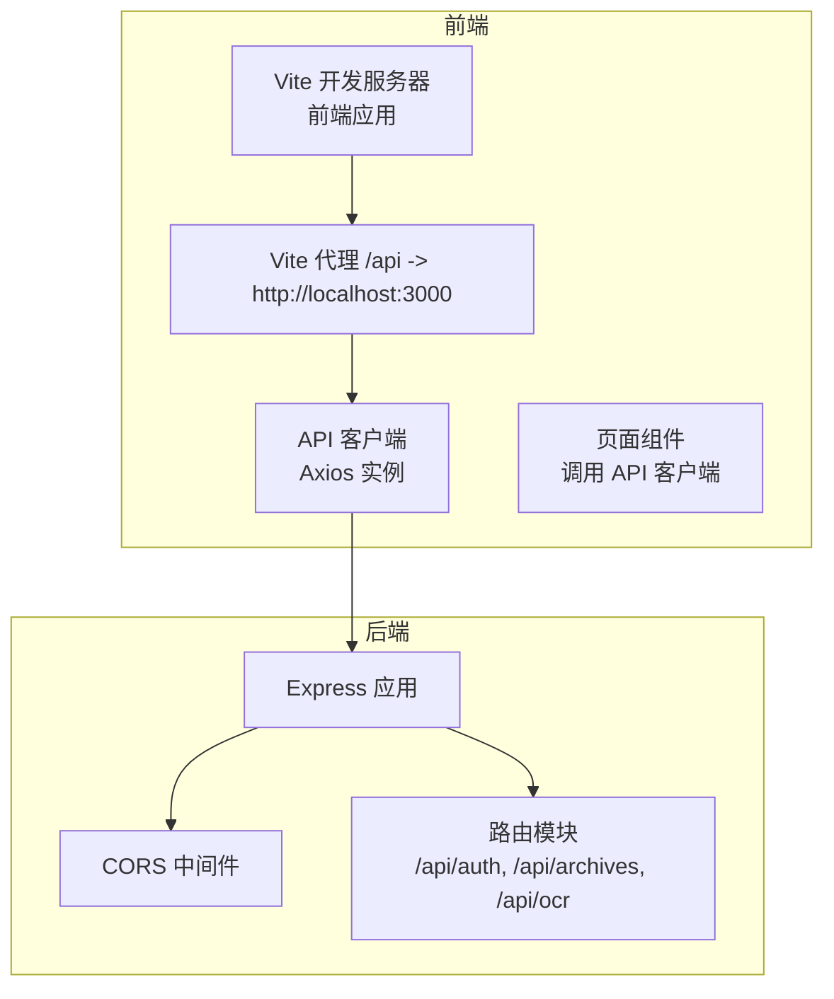
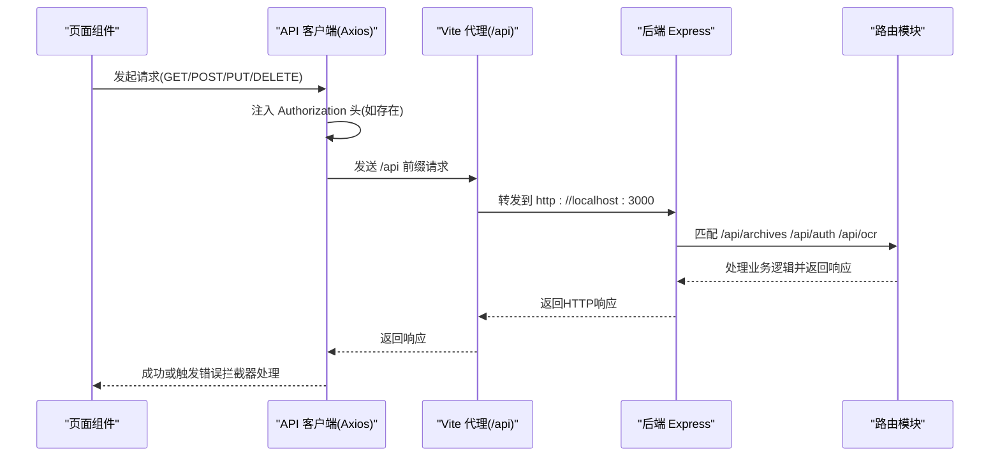
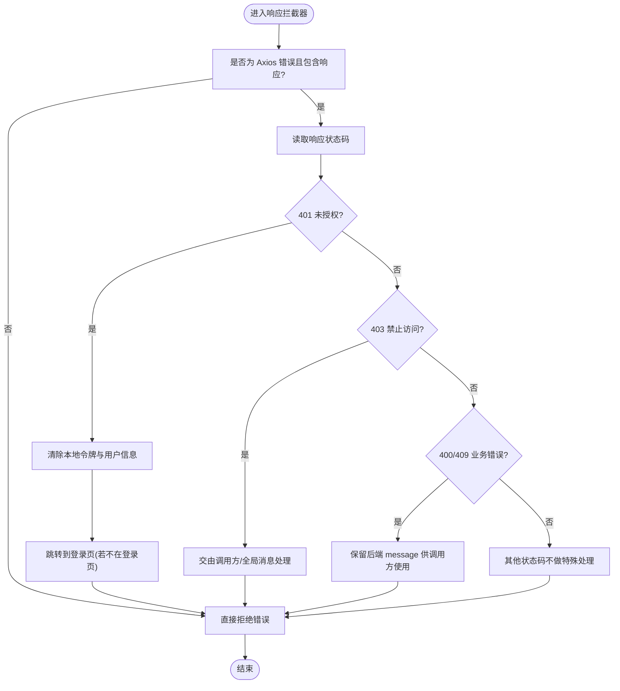
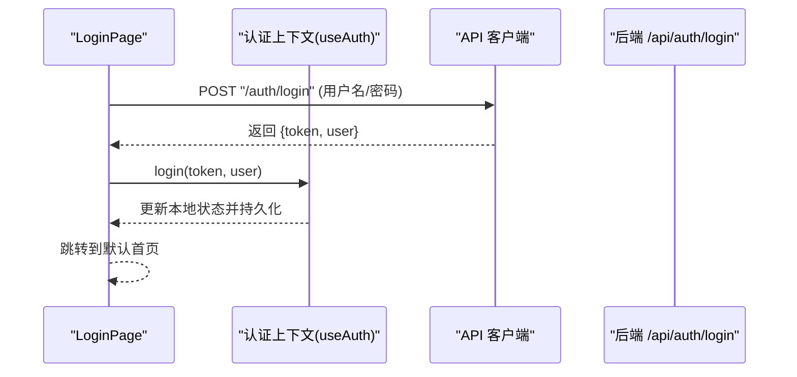
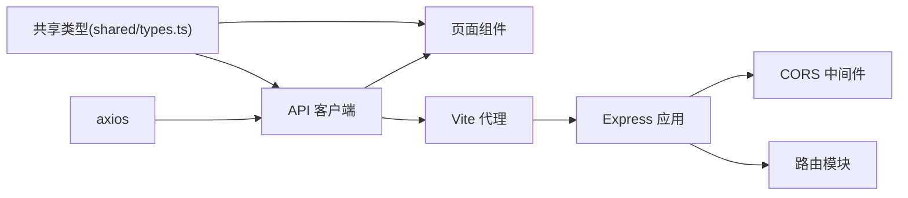

# API客户端

<cite>
**本文引用的文件**
- [frontend/src/api/client.ts](file://frontend/src/api/client.ts)
- [frontend/src/hooks/useAuth.tsx](file://frontend/src/hooks/useAuth.tsx)
- [frontend/src/pages/LoginPage.tsx](file://frontend/src/pages/LoginPage.tsx)
- [frontend/src/pages/ArchivePage.tsx](file://frontend/src/pages/ArchivePage.tsx)
- [frontend/src/pages/ImportPage.tsx](file://frontend/src/pages/ImportPage.tsx)
- [frontend/src/pages/OcrPage.tsx](file://frontend/src/pages/OcrPage.tsx)
- [frontend/src/pages/ReviewPage.tsx](file://frontend/src/pages/ReviewPage.tsx)
- [frontend/vite.config.ts](file://frontend/vite.config.ts)
- [backend/src/index.ts](file://backend/src/index.ts)
- [backend/src/routes/archive.ts](file://backend/src/routes/archive.ts)
- [shared/types.ts](file://shared/types.ts)
- [frontend/package.json](file://frontend/package.json)
</cite>

## 目录
1. [简介](#简介)
2. [项目结构](#项目结构)
3. [核心组件](#核心组件)
4. [架构总览](#架构总览)
5. [详细组件分析](#详细组件分析)
6. [依赖关系分析](#依赖关系分析)
7. [性能考量](#性能考量)
8. [故障排查指南](#故障排查指南)
9. [结论](#结论)
10. [附录](#附录)

## 简介
本文件面向前端开发与产品/测试同学，系统性说明本项目的API客户端设计与实现，涵盖以下主题：
- Axios实例配置与拦截器策略
- API端点定义与调用方式（GET/POST/PUT/DELETE）
- 错误处理机制（网络错误、HTTP状态码、业务错误）
- 请求头配置、认证令牌传递与CORS处理
- 类型安全与接口定义
- 请求缓存、重试与超时最佳实践

## 项目结构
前端通过统一的API客户端发起对后端的REST请求，开发服务器通过Vite代理将以“/api”开头的请求转发至后端服务；后端使用Express提供REST接口，并开启CORS。

图表来源
- [frontend/vite.config.ts:14-20](file://frontend/vite.config.ts#L14-L20)
- [frontend/src/api/client.ts:6-8](file://frontend/src/api/client.ts#L6-L8)
- [backend/src/index.ts:17-26](file://backend/src/index.ts#L17-L26)

章节来源
- [frontend/vite.config.ts:1-22](file://frontend/vite.config.ts#L1-L22)
- [frontend/src/api/client.ts:1-55](file://frontend/src/api/client.ts#L1-L55)
- [backend/src/index.ts:1-39](file://backend/src/index.ts#L1-L39)

## 核心组件
- 统一Axios实例：配置baseURL为“/api”，自动注入Authorization头，集中处理401/403/400/409等常见HTTP状态码错误。
- 页面级调用：各页面通过API客户端发起GET/POST/PUT等请求，结合共享类型进行类型安全调用。
- 认证上下文：负责登录态持久化与令牌注入，配合拦截器实现无感知鉴权。
- 开发代理与CORS：Vite代理将/api转发到后端；后端启用CORS中间件，允许跨域访问。

章节来源
- [frontend/src/api/client.ts:5-55](file://frontend/src/api/client.ts#L5-L55)
- [frontend/src/hooks/useAuth.tsx:24-73](file://frontend/src/hooks/useAuth.tsx#L24-L73)
- [frontend/vite.config.ts:14-20](file://frontend/vite.config.ts#L14-L20)
- [backend/src/index.ts:17-17](file://backend/src/index.ts#L17-L17)

## 架构总览
下图展示从前端页面到API客户端、开发代理再到后端路由的整体调用链路与错误处理策略。

图表来源
- [frontend/src/api/client.ts:11-17](file://frontend/src/api/client.ts#L11-L17)
- [frontend/vite.config.ts:14-20](file://frontend/vite.config.ts#L14-L20)
- [backend/src/index.ts:24-26](file://backend/src/index.ts#L24-L26)
- [backend/src/routes/archive.ts:17-41](file://backend/src/routes/archive.ts#L17-L41)

## 详细组件分析

### Axios实例与拦截器
- 实例配置
  - baseURL设为“/api”，所有请求路径以相对路径形式书写，便于代理与部署切换。
- 请求拦截器
  - 从localStorage读取令牌并在请求头添加Authorization: Bearer <token>。
- 响应拦截器
  - 对非Axios错误或无响应的错误直接透传。
  - 针对HTTP状态码进行分类处理：
    - 401：清除本地凭证并跳转登录页（避免重复跳转）。
    - 403：权限不足，交由调用方或全局消息提示处理。
    - 400/409：业务错误，保留后端返回的message供调用方使用。
    - 其他：不做特殊处理，透传错误。

图表来源
- [frontend/src/api/client.ts:19-52](file://frontend/src/api/client.ts#L19-L52)

章节来源
- [frontend/src/api/client.ts:5-55](file://frontend/src/api/client.ts#L5-L55)

### API端点定义与调用方式
- 端点概览（后端路由）
  - 档案管理：GET /api/archives、POST /api/archives、POST /api/archives/import、POST /api/archives/batch-transition、GET /api/archives/template、GET /api/archives/:id、POST /api/archives/:id/transition、PUT /api/archives/:id。
  - 认证：POST /api/auth/login。
  - OCR：POST /api/ocr/recognize。
- 前端调用示例
  - 登录：POST /api/auth/login，返回token与用户信息，写入localStorage并更新认证上下文。
  - 查询：GET /api/archives，携带分页与筛选参数。
  - 批量流转：POST /api/archives/batch-transition，提交archiveIds与action。
  - 创建/编辑：POST /api/archives、PUT /api/archives/:id。
  - 导入模板下载：GET /api/archives/template，设置responseType为blob。
  - Excel批量导入：POST /api/archives/import，multipart/form-data。
  - OCR识别：POST /api/ocr/recognize，multipart/form-data。

图表来源
- [frontend/src/pages/LoginPage.tsx:36-59](file://frontend/src/pages/LoginPage.tsx#L36-L59)
- [frontend/src/hooks/useAuth.tsx:59-73](file://frontend/src/hooks/useAuth.tsx#L59-L73)
- [backend/src/routes/archive.ts:17-41](file://backend/src/routes/archive.ts#L17-L41)

章节来源
- [backend/src/routes/archive.ts:17-41](file://backend/src/routes/archive.ts#L17-L41)
- [frontend/src/pages/LoginPage.tsx:36-59](file://frontend/src/pages/LoginPage.tsx#L36-L59)
- [frontend/src/pages/ArchivePage.tsx:47-58](file://frontend/src/pages/ArchivePage.tsx#L47-L58)
- [frontend/src/pages/ImportPage.tsx:25-59](file://frontend/src/pages/ImportPage.tsx#L25-L59)
- [frontend/src/pages/OcrPage.tsx:42-85](file://frontend/src/pages/OcrPage.tsx#L42-L85)
- [frontend/src/pages/ReviewPage.tsx:60-75](file://frontend/src/pages/ReviewPage.tsx#L60-L75)

### 错误处理机制
- 网络错误与Axios错误
  - 通过axios.isAxiosError判断并提取后端message，向用户展示友好提示。
- HTTP状态码错误
  - 401：自动清理本地凭证并跳转登录页。
  - 403：权限不足，交由调用方处理。
  - 400/409：业务错误，保留后端message。
- 业务逻辑错误
  - 在调用方页面中捕获错误，结合共享类型中的ErrorResponse结构读取code/message/details。

章节来源
- [frontend/src/api/client.ts:22-51](file://frontend/src/api/client.ts#L22-L51)
- [frontend/src/pages/LoginPage.tsx:50-55](file://frontend/src/pages/LoginPage.tsx#L50-L55)
- [frontend/src/pages/ArchivePage.tsx:53-58](file://frontend/src/pages/ArchivePage.tsx#L53-L58)
- [frontend/src/pages/ImportPage.tsx:52-57](file://frontend/src/pages/ImportPage.tsx#L52-L57)
- [frontend/src/pages/OcrPage.tsx:76-81](file://frontend/src/pages/OcrPage.tsx#L76-L81)
- [frontend/src/pages/ReviewPage.tsx:116-125](file://frontend/src/pages/ReviewPage.tsx#L116-L125)
- [shared/types.ts:242-247](file://shared/types.ts#L242-L247)

### 请求头配置、认证令牌与CORS
- 请求头与认证
  - 请求拦截器自动为每个请求附加Authorization: Bearer <token>，令牌来自localStorage。
- CORS
  - 后端在应用启动时启用CORS中间件，允许跨域访问。
- 开发环境代理
  - Vite将/api前缀请求代理到http://localhost:3000，解决开发期跨域问题。

章节来源
- [frontend/src/api/client.ts:11-17](file://frontend/src/api/client.ts#L11-L17)
- [backend/src/index.ts:17-17](file://backend/src/index.ts#L17-L17)
- [frontend/vite.config.ts:14-20](file://frontend/vite.config.ts#L14-L20)

### 类型安全与接口定义
- 共享类型
  - 用户角色、权限、状态枚举、档案记录、状态变更日志、登录/导入/OCR等请求/响应接口均在shared/types.ts中定义。
- 页面调用
  - 页面通过泛型参数指定响应类型，确保返回数据结构的类型安全。
- 示例
  - 登录响应类型LoginResponse、档案列表ArchiveListResponse、批量流转BatchTransitionResponse、OCR识别OcrResponse等。

章节来源
- [shared/types.ts:6-289](file://shared/types.ts#L6-L289)
- [frontend/src/pages/LoginPage.tsx:6-7](file://frontend/src/pages/LoginPage.tsx#L6-L7)
- [frontend/src/pages/ArchivePage.tsx:4-5](file://frontend/src/pages/ArchivePage.tsx#L4-L5)
- [frontend/src/pages/ImportPage.tsx:5-6](file://frontend/src/pages/ImportPage.tsx#L5-L6)
- [frontend/src/pages/OcrPage.tsx:5-7](file://frontend/src/pages/OcrPage.tsx#L5-L7)
- [frontend/src/pages/ReviewPage.tsx:4-6](file://frontend/src/pages/ReviewPage.tsx#L4-L6)

### 请求缓存、重试与超时
- 缓存
  - 当前实现未内置缓存策略，建议在调用方按页面维度缓存查询结果，或在需要时引入轻量缓存库。
- 重试
  - 当前实现未内置自动重试，可在调用方对幂等请求（如查询）增加指数退避重试。
- 超时
  - Axios实例未显式设置timeout，建议在生产环境为关键请求配置合理超时时间，避免长时间挂起。

章节来源
- [frontend/src/api/client.ts:6-8](file://frontend/src/api/client.ts#L6-L8)

## 依赖关系分析
- 前端依赖
  - axios：HTTP客户端。
  - react/react-router-dom/antd/xlsx：UI与工具库。
- 开发代理与CORS
  - Vite代理将/api转发至后端；后端启用CORS中间件。
- 前后端接口契约
  - 前端通过共享类型约束请求/响应结构，降低耦合风险。

图表来源
- [frontend/package.json:12-18](file://frontend/package.json#L12-L18)
- [frontend/src/api/client.ts:1-2](file://frontend/src/api/client.ts#L1-L2)
- [frontend/vite.config.ts:14-20](file://frontend/vite.config.ts#L14-L20)
- [backend/src/index.ts:7-8](file://backend/src/index.ts#L7-L8)
- [backend/src/routes/archive.ts:10-10](file://backend/src/routes/archive.ts#L10-L10)
- [shared/types.ts:1-4](file://shared/types.ts#L1-L4)

章节来源
- [frontend/package.json:1-35](file://frontend/package.json#L1-L35)
- [frontend/src/api/client.ts:1-2](file://frontend/src/api/client.ts#L1-L2)
- [backend/src/index.ts:7-8](file://backend/src/index.ts#L7-L8)
- [shared/types.ts:1-4](file://shared/types.ts#L1-L4)

## 性能考量
- 减少不必要的请求：对高频查询使用防抖/节流与本地缓存。
- 合理分页：避免一次性加载过多数据，提升首屏性能。
- 并发控制：对批量操作采用分批提交，避免后端压力过大。
- 超时与重试：为关键请求设置超时与有限重试，提升稳定性。
- 体积优化：按需引入xlsx等大体积库，避免打包体积膨胀。

## 故障排查指南
- 登录后仍被重定向到登录页
  - 检查localStorage中是否存在令牌与用户信息；确认拦截器是否正确注入Authorization头。
- 401未授权频繁出现
  - 检查令牌是否过期或被清理；确认后端路由鉴权中间件是否正常工作。
- 403禁止访问
  - 检查当前用户角色与所需权限是否匹配；确认后端authorize中间件逻辑。
- 400/409业务错误
  - 查看后端返回的message，结合页面提示引导用户修正输入。
- 导入/OCR上传失败
  - 检查文件类型与大小限制；确认multipart/form-data头是否正确设置。
- 跨域问题
  - 确认Vite代理配置与后端CORS中间件均已启用。

章节来源
- [frontend/src/api/client.ts:29-48](file://frontend/src/api/client.ts#L29-L48)
- [frontend/src/pages/ImportPage.tsx:88-101](file://frontend/src/pages/ImportPage.tsx#L88-L101)
- [frontend/src/pages/OcrPage.tsx:92-101](file://frontend/src/pages/OcrPage.tsx#L92-L101)
- [frontend/vite.config.ts:14-20](file://frontend/vite.config.ts#L14-L20)
- [backend/src/index.ts:17-17](file://backend/src/index.ts#L17-L17)

## 结论
本API客户端以Axios为核心，通过统一实例与拦截器实现了认证、错误处理与开发期代理/CORS支持。结合共享类型，前端在多页面中以类型安全的方式调用后端REST接口。建议后续在调用方层面完善缓存、重试与超时策略，进一步提升用户体验与系统稳定性。

## 附录
- 常用HTTP方法与端点
  - GET：/api/archives、/api/archives/template、/api/archives/:id
  - POST：/api/auth/login、/api/archives、/api/archives/import、/api/archives/batch-transition、/api/archives/:id/transition、/api/ocr/recognize
  - PUT：/api/archives/:id
- 关键类型参考
  - 登录请求/响应、档案查询参数/列表、批量流转请求/响应、OCR识别响应、统一错误响应等。

章节来源
- [backend/src/routes/archive.ts:17-41](file://backend/src/routes/archive.ts#L17-L41)
- [shared/types.ts:106-247](file://shared/types.ts#L106-L247)