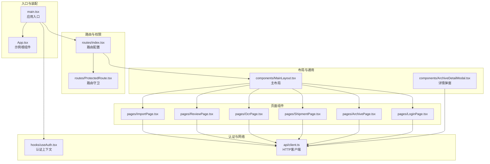
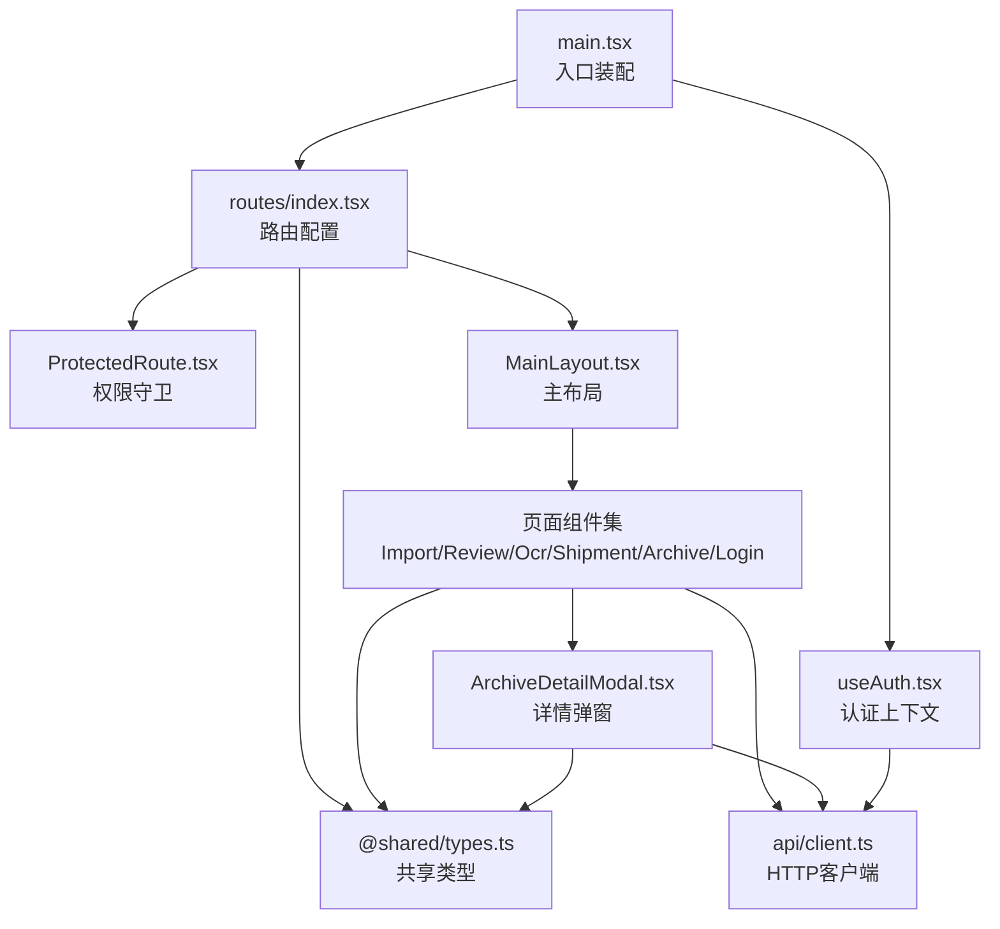
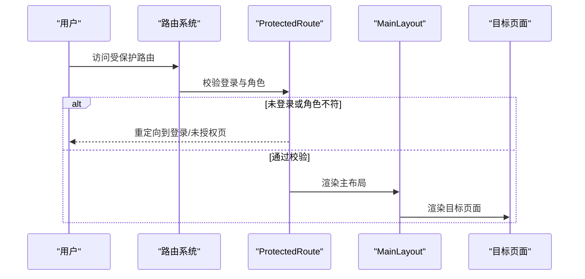
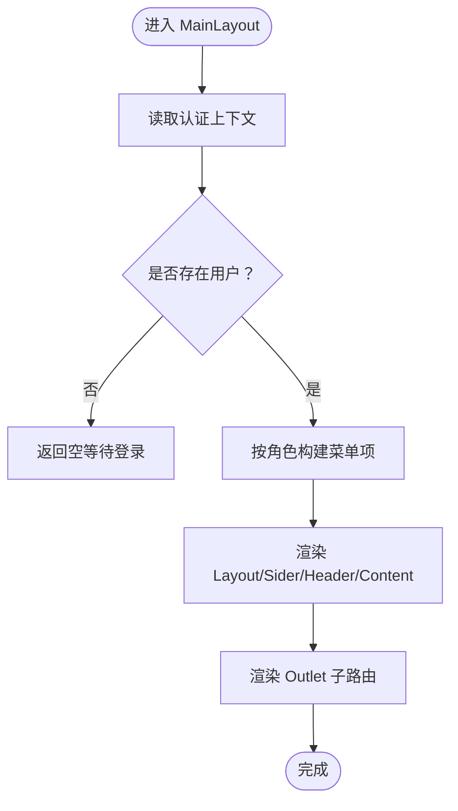
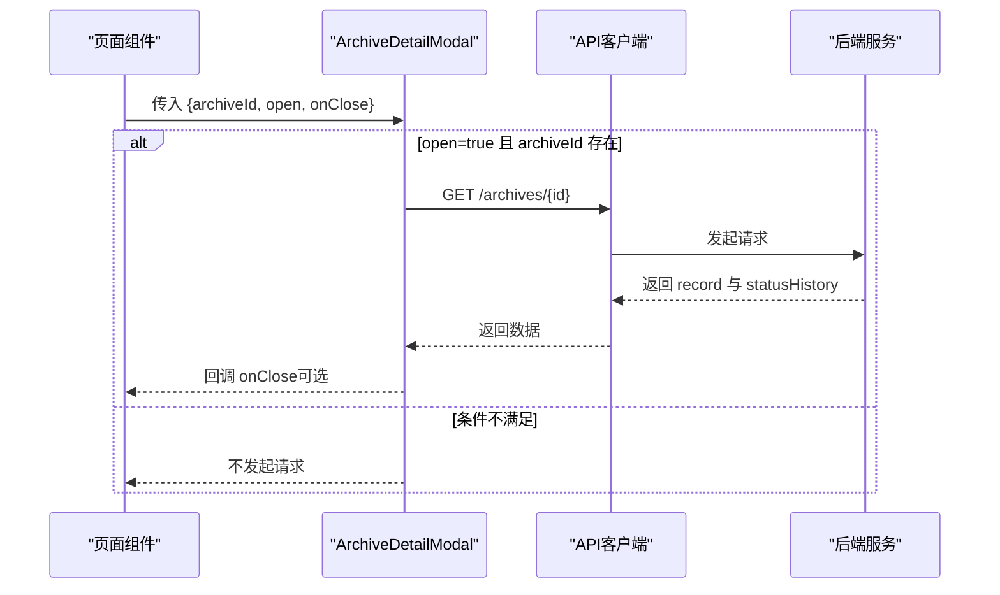
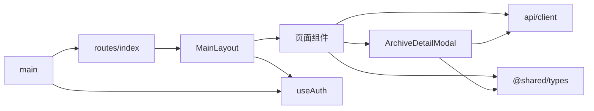

# React组件结构

<cite>
**本文引用的文件**
- [frontend/src/main.tsx](file://frontend/src/main.tsx)
- [frontend/src/App.tsx](file://frontend/src/App.tsx)
- [frontend/src/routes/index.tsx](file://frontend/src/routes/index.tsx)
- [frontend/src/routes/ProtectedRoute.tsx](file://frontend/src/routes/ProtectedRoute.tsx)
- [frontend/src/hooks/useAuth.tsx](file://frontend/src/hooks/useAuth.tsx)
- [frontend/src/api/client.ts](file://frontend/src/api/client.ts)
- [frontend/src/components/MainLayout.tsx](file://frontend/src/components/MainLayout.tsx)
- [frontend/src/components/ArchiveDetailModal.tsx](file://frontend/src/components/ArchiveDetailModal.tsx)
- [frontend/src/pages/LoginPage.tsx](file://frontend/src/pages/LoginPage.tsx)
- [frontend/src/pages/ImportPage.tsx](file://frontend/src/pages/ImportPage.tsx)
- [frontend/src/pages/ArchivePage.tsx](file://frontend/src/pages/ArchivePage.tsx)
- [frontend/src/pages/ReviewPage.tsx](file://frontend/src/pages/ReviewPage.tsx)
- [frontend/src/pages/OcrPage.tsx](file://frontend/src/pages/OcrPage.tsx)
- [frontend/src/pages/ShipmentPage.tsx](file://frontend/src/pages/ShipmentPage.tsx)
- [shared/types.ts](file://shared/types.ts)
</cite>

## 目录
1. [引言](#引言)
2. [项目结构](#项目结构)
3. [核心组件](#核心组件)
4. [架构总览](#架构总览)
5. [详细组件分析](#详细组件分析)
6. [依赖关系分析](#依赖关系分析)
7. [性能考虑](#性能考虑)
8. [故障排查指南](#故障排查指南)
9. [结论](#结论)
10. [附录](#附录)

## 引言
本文件系统性梳理前端React组件结构，围绕组件化设计理念与层级关系展开，重点覆盖以下方面：
- 根组件与应用入口的职责与装配方式
- 页面组件的组织与职责边界
- 布局组件MainLayout的设计与复用策略
- 模态框组件ArchiveDetailModal的实现与交互
- 组件间通信（props、状态提升、事件处理）
- 生命周期管理与性能优化策略

## 项目结构
前端采用按“页面/组件/路由/工具”分层组织，核心入口负责装配认证上下文、UI框架与路由；页面组件围绕业务角色分工，布局组件统一承载导航与内容区；共享类型定义贯穿前后端。

图表来源
- [frontend/src/main.tsx:1-18](file://frontend/src/main.tsx#L1-L18)
- [frontend/src/routes/index.tsx:1-98](file://frontend/src/routes/index.tsx#L1-L98)
- [frontend/src/routes/ProtectedRoute.tsx:1-31](file://frontend/src/routes/ProtectedRoute.tsx#L1-L31)
- [frontend/src/hooks/useAuth.tsx:1-90](file://frontend/src/hooks/useAuth.tsx#L1-L90)
- [frontend/src/api/client.ts:1-55](file://frontend/src/api/client.ts#L1-L55)
- [frontend/src/components/MainLayout.tsx:1-95](file://frontend/src/components/MainLayout.tsx#L1-L95)
- [frontend/src/components/ArchiveDetailModal.tsx:1-153](file://frontend/src/components/ArchiveDetailModal.tsx#L1-L153)
- [frontend/src/pages/LoginPage.tsx:1-81](file://frontend/src/pages/LoginPage.tsx#L1-L81)
- [frontend/src/pages/ImportPage.tsx:1-127](file://frontend/src/pages/ImportPage.tsx#L1-L127)
- [frontend/src/pages/ReviewPage.tsx:1-406](file://frontend/src/pages/ReviewPage.tsx#L1-L406)
- [frontend/src/pages/OcrPage.tsx:1-232](file://frontend/src/pages/OcrPage.tsx#L1-L232)
- [frontend/src/pages/ShipmentPage.tsx:1-212](file://frontend/src/pages/ShipmentPage.tsx#L1-L212)

章节来源
- [frontend/src/main.tsx:1-18](file://frontend/src/main.tsx#L1-L18)
- [frontend/src/routes/index.tsx:1-98](file://frontend/src/routes/index.tsx#L1-L98)

## 核心组件
- 应用入口与装配
  - main.tsx：渲染Ant Design全局容器、认证Provider与RouterProvider，完成应用挂载。
  - App.tsx：当前仓库包含一个示例根组件，演示基础状态与渲染，非业务主入口。
- 路由与权限
  - routes/index.tsx：集中定义登录页、受保护路由、角色子路由与未授权页，并统一包裹MainLayout。
  - ProtectedRoute.tsx：基于角色白名单进行路由级权限校验。
- 认证与状态
  - hooks/useAuth.tsx：提供认证上下文，封装token与用户信息持久化、权限映射与登录/登出逻辑。
- 网络层
  - api/client.ts：统一axios实例，注入Authorization头与401/403等响应拦截处理。
- 布局与通用
  - components/MainLayout.tsx：侧边菜单（按角色动态生成）、顶部用户信息与退出、内容区Outlet。
  - components/ArchiveDetailModal.tsx：档案详情弹窗，加载状态、描述信息与状态变更时间线。

章节来源
- [frontend/src/main.tsx:1-18](file://frontend/src/main.tsx#L1-L18)
- [frontend/src/App.tsx:1-122](file://frontend/src/App.tsx#L1-L122)
- [frontend/src/routes/index.tsx:1-98](file://frontend/src/routes/index.tsx#L1-L98)
- [frontend/src/routes/ProtectedRoute.tsx:1-31](file://frontend/src/routes/ProtectedRoute.tsx#L1-L31)
- [frontend/src/hooks/useAuth.tsx:1-90](file://frontend/src/hooks/useAuth.tsx#L1-L90)
- [frontend/src/api/client.ts:1-55](file://frontend/src/api/client.ts#L1-L55)
- [frontend/src/components/MainLayout.tsx:1-95](file://frontend/src/components/MainLayout.tsx#L1-L95)
- [frontend/src/components/ArchiveDetailModal.tsx:1-153](file://frontend/src/components/ArchiveDetailModal.tsx#L1-L153)

## 架构总览
整体采用“入口装配—路由守卫—布局—页面”的分层结构，页面组件通过共享类型与API客户端与后端交互，认证上下文贯穿全局。

图表来源
- [frontend/src/main.tsx:1-18](file://frontend/src/main.tsx#L1-L18)
- [frontend/src/routes/index.tsx:1-98](file://frontend/src/routes/index.tsx#L1-L98)
- [frontend/src/routes/ProtectedRoute.tsx:1-31](file://frontend/src/routes/ProtectedRoute.tsx#L1-L31)
- [frontend/src/components/MainLayout.tsx:1-95](file://frontend/src/components/MainLayout.tsx#L1-L95)
- [frontend/src/components/ArchiveDetailModal.tsx:1-153](file://frontend/src/components/ArchiveDetailModal.tsx#L1-L153)
- [frontend/src/hooks/useAuth.tsx:1-90](file://frontend/src/hooks/useAuth.tsx#L1-L90)
- [frontend/src/api/client.ts:1-55](file://frontend/src/api/client.ts#L1-L55)
- [shared/types.ts:1-289](file://shared/types.ts#L1-L289)

## 详细组件分析

### 根组件与入口（App.tsx 与 main.tsx）
- 设计理念
  - main.tsx作为应用挂载点，负责装配AntD全局容器、认证Provider与RouterProvider，确保后续组件树具备统一主题与路由能力。
  - App.tsx当前为示例根组件，演示基础状态与渲染，实际业务主入口由路由系统接管。
- 关键点
  - Provider链路：AuthProvider在RouterProvider外层，保证路由切换时认证状态不丢失。
  - 全局样式：AntD App容器提供全局消息与通知能力，便于页面组件统一使用。

章节来源
- [frontend/src/main.tsx:1-18](file://frontend/src/main.tsx#L1-L18)
- [frontend/src/App.tsx:1-122](file://frontend/src/App.tsx#L1-L122)

### 路由与权限（routes/index.tsx 与 ProtectedRoute.tsx）
- 设计理念
  - 使用React Router v6的嵌套路由与元素组合，统一在MainLayout下组织业务路由。
  - ProtectedRoute基于角色白名单进行权限校验，未登录或角色不符分别重定向至登录页或未授权页。
- 关键点
  - 角色路由分组：运营人员、分支机构、综合部各自专属页面，避免交叉访问。
  - 顶层重定向：根路径自动跳转登录页，提升用户体验。

图表来源
- [frontend/src/routes/index.tsx:1-98](file://frontend/src/routes/index.tsx#L1-L98)
- [frontend/src/routes/ProtectedRoute.tsx:1-31](file://frontend/src/routes/ProtectedRoute.tsx#L1-L31)

章节来源
- [frontend/src/routes/index.tsx:1-98](file://frontend/src/routes/index.tsx#L1-L98)
- [frontend/src/routes/ProtectedRoute.tsx:1-31](file://frontend/src/routes/ProtectedRoute.tsx#L1-L31)

### 布局组件（MainLayout.tsx）
- 设计理念
  - 采用AntD Layout容器，左侧Sider按用户角色动态生成菜单项，顶部Header显示用户信息与退出按钮，右侧Content通过Outlet承载子路由页面。
  - 使用useMemo稳定菜单项，减少不必要的重渲染。
- 关键点
  - 菜单配置：通过角色映射生成菜单，结合selectedKeys与onClick实现导航。
  - 退出流程：调用logout并提示成功，随后navigate到登录页。

图表来源
- [frontend/src/components/MainLayout.tsx:1-95](file://frontend/src/components/MainLayout.tsx#L1-L95)
- [frontend/src/hooks/useAuth.tsx:1-90](file://frontend/src/hooks/useAuth.tsx#L1-L90)

章节来源
- [frontend/src/components/MainLayout.tsx:1-95](file://frontend/src/components/MainLayout.tsx#L1-L95)

### 模态框组件（ArchiveDetailModal.tsx）
- 设计理念
  - 作为通用详情弹窗，接收档案ID与开关状态，内部通过API拉取详情与状态历史，展示基本信息与状态变更时间线。
  - 使用destroyOnClose在关闭时清理状态，避免内存泄漏。
- 关键点
  - 中文映射：状态字段、状态值、操作、版本类型均提供中文标签映射，提升可读性。
  - 加载与错误：统一loading与错误提示，异常时提示“获取档案详情失败”。

图表来源
- [frontend/src/components/ArchiveDetailModal.tsx:1-153](file://frontend/src/components/ArchiveDetailModal.tsx#L1-L153)
- [frontend/src/api/client.ts:1-55](file://frontend/src/api/client.ts#L1-L55)

章节来源
- [frontend/src/components/ArchiveDetailModal.tsx:1-153](file://frontend/src/components/ArchiveDetailModal.tsx#L1-L153)

### 页面组件组织（以核心页面为例）

#### 登录页（LoginPage.tsx）
- 设计理念
  - 基于AntD表单与图标，提交后调用鉴权接口，成功后写入token与用户信息并按角色跳转默认首页。
  - 已登录用户直接根据角色重定向，避免重复登录。
- 关键点
  - 默认路径：根据角色返回不同首页路径。
  - 错误处理：统一捕获Axios错误并提示。

章节来源
- [frontend/src/pages/LoginPage.tsx:1-81](file://frontend/src/pages/LoginPage.tsx#L1-L81)

#### 数据导入（ImportPage.tsx）
- 设计理念
  - 支持Excel模板下载与拖拽上传，导入后弹窗展示结果统计与错误明细。
  - 使用beforeUpload阻断自动上传，手动触发导入流程。
- 关键点
  - 模板下载：通过blob下载指定文件名。
  - 结果弹窗：展示总数、成功/失败数量与错误行明细。

章节来源
- [frontend/src/pages/ImportPage.tsx:1-127](file://frontend/src/pages/ImportPage.tsx#L1-L127)

#### 审核分发（ReviewPage.tsx）
- 设计理念
  - 支持多条件搜索、批量状态流转、编辑与新增档案记录，同时提供详情弹窗与状态校验。
  - 按状态禁用批量操作按钮，确保业务合规。
- 关键点
  - 批量动作：封装常用动作集合，统一处理成功/失败反馈。
  - 表单校验：编辑与新增表单均使用AntD Form，日期格式化与必填校验。

章节来源
- [frontend/src/pages/ReviewPage.tsx:1-406](file://frontend/src/pages/ReviewPage.tsx#L1-L406)

#### OCR识别（OcrPage.tsx）
- 设计理念
  - 支持扫描件上传与识别，自动填充表单字段并标注低置信度字段，最终通过导入接口创建档案记录。
  - 上传前进行文件大小校验，识别后启用表单提交。
- 关键点
  - 置信度阈值：低于阈值字段高亮并提示人工复核。
  - 保存流程：将表单数据转换为单行Excel并通过导入接口创建记录。

章节来源
- [frontend/src/pages/OcrPage.tsx:1-232](file://frontend/src/pages/OcrPage.tsx#L1-L232)

#### 寄送确认（ShipmentPage.tsx）
- 设计理念
  - 展示当前营业部下的档案列表，支持批量“确认寄出”“确认收到回寄”，并提供详情弹窗。
  - 按状态启用相应批量操作，保障流程正确性。
- 关键点
  - 状态映射：主流程状态与归档状态的中文展示。
  - 分页与选择：支持分页变更与多选批量操作。

章节来源
- [frontend/src/pages/ShipmentPage.tsx:1-212](file://frontend/src/pages/ShipmentPage.tsx#L1-L212)

#### 归档确认（ArchivePage.tsx）
- 设计理念
  - 仅展示“待综合部入库”状态的档案，支持批量“确认入库”，并提供详情弹窗。
  - 使用useCallback缓存查询函数，减少重复请求。
- 关键点
  - 查询参数：限定archiveStatus=pending_archive。
  - 成功反馈：根据成功/失败数量给出不同提示。

章节来源
- [frontend/src/pages/ArchivePage.tsx:1-181](file://frontend/src/pages/ArchivePage.tsx#L1-L181)

### 组件间通信与状态管理
- props传递
  - 页面组件向通用弹窗传递archiveId/open/onClose，实现“打开/关闭/数据加载”的解耦。
  - 布局组件向子路由传递Outlet，实现内容区动态渲染。
- 状态提升
  - 详情弹窗的open与archiveId由页面组件持有，实现“父组件控制、子组件消费”的模式。
- 事件处理
  - 菜单点击、表单提交、批量操作均通过回调函数在父组件处理，子组件只负责UI与数据收集。
- 共享类型
  - shared/types.ts提供统一的实体、状态、权限与API接口定义，确保前后端契约一致。

章节来源
- [frontend/src/components/ArchiveDetailModal.tsx:1-153](file://frontend/src/components/ArchiveDetailModal.tsx#L1-L153)
- [frontend/src/components/MainLayout.tsx:1-95](file://frontend/src/components/MainLayout.tsx#L1-L95)
- [shared/types.ts:1-289](file://shared/types.ts#L1-L289)

## 依赖关系分析
- 组件耦合
  - 页面组件与API客户端存在直接依赖，通过统一的axios实例与拦截器实现认证与错误处理。
  - 布局组件依赖认证上下文与AntD组件库，承担导航与内容区职责。
- 外部依赖
  - AntD提供UI与表单、消息、时间线等组件。
  - dayjs用于日期格式化。
  - xlsx用于将表单数据导出为Excel并走导入流程。
- 潜在循环依赖
  - 当前结构未见直接循环依赖，但页面组件与弹窗组件通过props形成单向依赖，属于健康的设计。

图表来源
- [frontend/src/pages/ReviewPage.tsx:1-406](file://frontend/src/pages/ReviewPage.tsx#L1-L406)
- [frontend/src/pages/OcrPage.tsx:1-232](file://frontend/src/pages/OcrPage.tsx#L1-L232)
- [frontend/src/pages/ShipmentPage.tsx:1-212](file://frontend/src/pages/ShipmentPage.tsx#L1-L212)
- [frontend/src/pages/ArchivePage.tsx:1-181](file://frontend/src/pages/ArchivePage.tsx#L1-L181)
- [frontend/src/components/ArchiveDetailModal.tsx:1-153](file://frontend/src/components/ArchiveDetailModal.tsx#L1-L153)
- [frontend/src/api/client.ts:1-55](file://frontend/src/api/client.ts#L1-L55)
- [frontend/src/components/MainLayout.tsx:1-95](file://frontend/src/components/MainLayout.tsx#L1-L95)
- [frontend/src/hooks/useAuth.tsx:1-90](file://frontend/src/hooks/useAuth.tsx#L1-L90)
- [frontend/src/routes/index.tsx:1-98](file://frontend/src/routes/index.tsx#L1-L98)
- [frontend/src/main.tsx:1-18](file://frontend/src/main.tsx#L1-L18)
- [shared/types.ts:1-289](file://shared/types.ts#L1-L289)

章节来源
- [frontend/src/api/client.ts:1-55](file://frontend/src/api/client.ts#L1-L55)
- [frontend/src/hooks/useAuth.tsx:1-90](file://frontend/src/hooks/useAuth.tsx#L1-L90)
- [frontend/src/components/MainLayout.tsx:1-95](file://frontend/src/components/MainLayout.tsx#L1-L95)
- [frontend/src/components/ArchiveDetailModal.tsx:1-153](file://frontend/src/components/ArchiveDetailModal.tsx#L1-L153)
- [frontend/src/pages/ReviewPage.tsx:1-406](file://frontend/src/pages/ReviewPage.tsx#L1-L406)
- [frontend/src/pages/OcrPage.tsx:1-232](file://frontend/src/pages/OcrPage.tsx#L1-L232)
- [frontend/src/pages/ShipmentPage.tsx:1-212](file://frontend/src/pages/ShipmentPage.tsx#L1-L212)
- [frontend/src/pages/ArchivePage.tsx:1-181](file://frontend/src/pages/ArchivePage.tsx#L1-L181)
- [frontend/src/routes/index.tsx:1-98](file://frontend/src/routes/index.tsx#L1-L98)
- [frontend/src/main.tsx:1-18](file://frontend/src/main.tsx#L1-L18)
- [shared/types.ts:1-289](file://shared/types.ts#L1-L289)

## 性能考虑
- 渲染优化
  - 使用useMemo稳定菜单项，避免角色切换时重复构建菜单。
  - 页面组件使用useCallback缓存查询函数，减少无效请求。
- 网络优化
  - 统一请求拦截器注入token，响应拦截器处理401/403，降低重复判断成本。
- UI体验
  - 弹窗destroyOnClose在关闭时清理状态，避免内存占用。
  - 表格与弹窗内使用局部loading，避免整页闪烁。
- 资源控制
  - 上传前进行文件大小校验，防止超大文件导致内存压力。
  - 详情弹窗在open=false时不发起请求，减少无效调用。

## 故障排查指南
- 登录失败
  - 检查登录表单字段与后端接口契约，确认错误信息来自后端响应。
  - 若出现401，确认本地token是否被清除以及是否被重定向到登录页。
- 权限不足
  - 路由守卫会将无权限用户重定向到未授权页，确认角色与allowedRoles配置。
- 导入失败
  - 检查文件格式与大小限制，查看错误明细弹窗中的具体原因。
- OCR识别失败
  - 确认扫描件清晰度与格式，关注低置信度字段提示。
- 详情弹窗空白
  - 确认archiveId与open状态，检查API返回与错误提示。

章节来源
- [frontend/src/pages/LoginPage.tsx:1-81](file://frontend/src/pages/LoginPage.tsx#L1-L81)
- [frontend/src/routes/ProtectedRoute.tsx:1-31](file://frontend/src/routes/ProtectedRoute.tsx#L1-L31)
- [frontend/src/pages/ImportPage.tsx:1-127](file://frontend/src/pages/ImportPage.tsx#L1-L127)
- [frontend/src/pages/OcrPage.tsx:1-232](file://frontend/src/pages/OcrPage.tsx#L1-L232)
- [frontend/src/components/ArchiveDetailModal.tsx:1-153](file://frontend/src/components/ArchiveDetailModal.tsx#L1-L153)
- [frontend/src/api/client.ts:1-55](file://frontend/src/api/client.ts#L1-L55)

## 结论
该React组件结构以“入口装配—路由守卫—布局—页面”为主线，配合认证上下文与统一API客户端，实现了清晰的职责分离与良好的扩展性。页面组件围绕角色分工，通用弹窗与布局组件提升了复用效率。通过useMemo/useCallback等优化手段与拦截器机制，兼顾了性能与可靠性。建议后续持续完善权限细化与埋点监控，进一步增强可观测性与可维护性。

## 附录
- 共享类型概览
  - 角色、状态、权限、实体与API接口均在shared/types.ts中定义，确保前后端一致性。
- 最佳实践
  - 将UI组件与业务组件分离，保持页面组件的薄逻辑。
  - 使用受控组件与表单库，统一校验与错误提示。
  - 对高频请求进行防抖/节流与缓存策略设计。