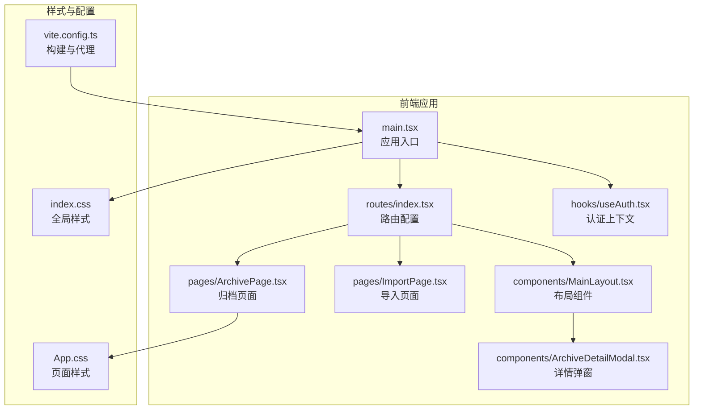
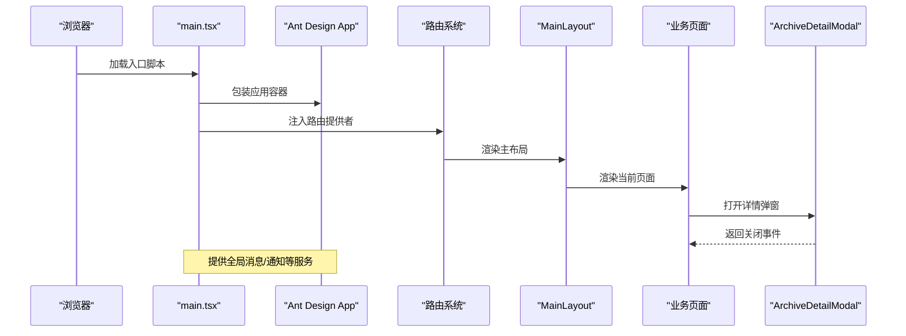
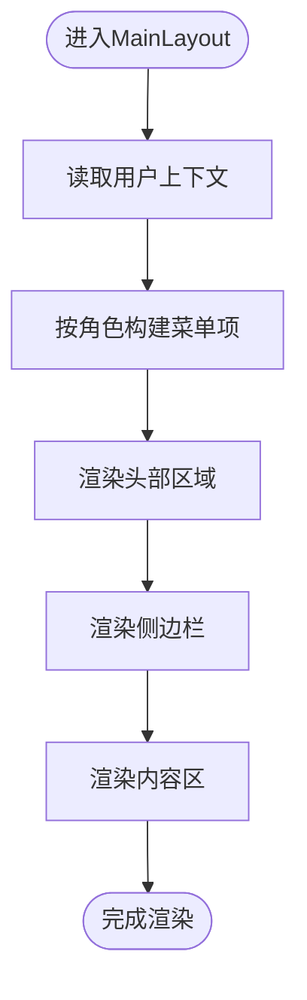
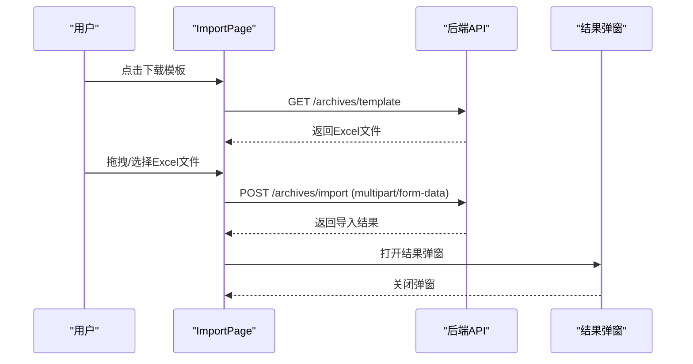
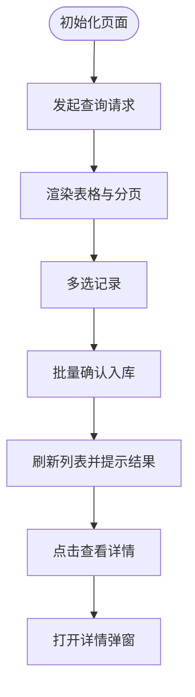
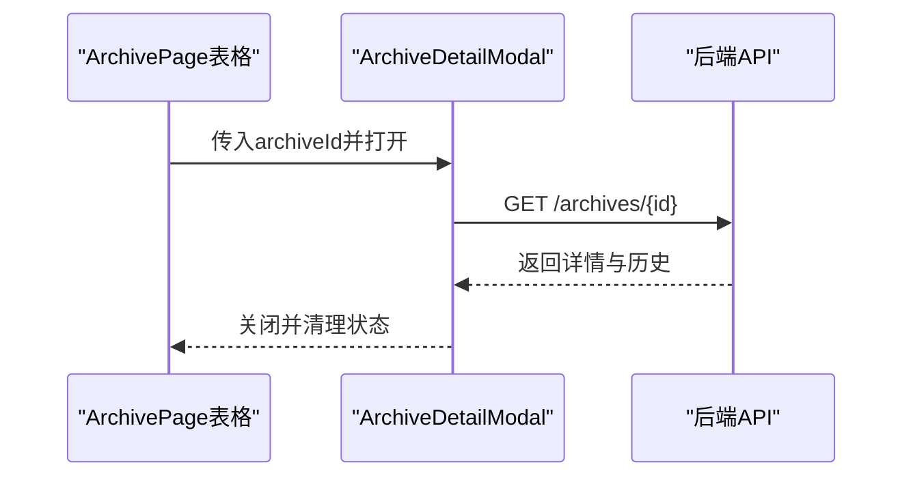
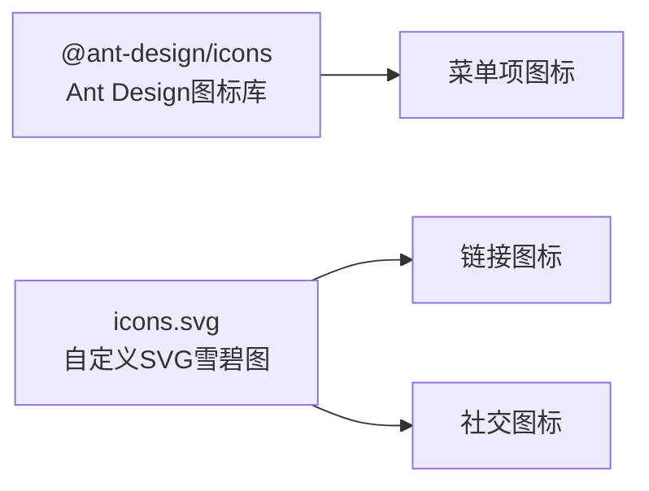
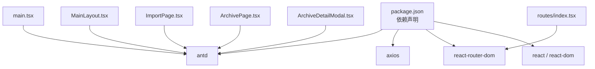

# UI组件库集成

<cite>
**本文引用的文件**
- [frontend/package.json](file://frontend/package.json)
- [frontend/src/main.tsx](file://frontend/src/main.tsx)
- [frontend/vite.config.ts](file://frontend/vite.config.ts)
- [frontend/src/components/MainLayout.tsx](file://frontend/src/components/MainLayout.tsx)
- [frontend/src/components/ArchiveDetailModal.tsx](file://frontend/src/components/ArchiveDetailModal.tsx)
- [frontend/src/pages/ArchivePage.tsx](file://frontend/src/pages/ArchivePage.tsx)
- [frontend/src/pages/ImportPage.tsx](file://frontend/src/pages/ImportPage.tsx)
- [frontend/src/index.css](file://frontend/src/index.css)
- [frontend/src/App.css](file://frontend/src/App.css)
- [frontend/src/routes/index.tsx](file://frontend/src/routes/index.tsx)
- [frontend/src/hooks/useAuth.tsx](file://frontend/src/hooks/useAuth.tsx)
- [shared/types.ts](file://shared/types.ts)
</cite>

## 目录
1. [简介](#简介)
2. [项目结构](#项目结构)
3. [核心组件](#核心组件)
4. [架构概览](#架构概览)
5. [详细组件分析](#详细组件分析)
6. [依赖分析](#依赖分析)
7. [性能考虑](#性能考虑)
8. [故障排除指南](#故障排除指南)
9. [结论](#结论)
10. [附录](#附录)

## 简介
本文件面向UI组件库集成场景，聚焦Ant Design在本项目中的集成配置与按需引入策略，系统性说明布局组件、表单组件、数据表格与模态框的使用方式；同时涵盖主题定制与样式覆盖（CSS变量与Less变量）、响应式设计与移动端适配、图标系统与自定义图标集成、无障碍访问与国际化配置等主题。文档以实际源码为依据，提供可视化架构图与流程图，帮助开发者快速理解并高效扩展UI能力。

## 项目结构
前端采用Vite + React + TypeScript技术栈，Ant Design作为UI基础库，配合路由与状态管理实现业务页面。关键目录与文件如下：
- 组件层：布局组件MainLayout、详情弹窗ArchiveDetailModal、业务页面ImportPage/ArchivePage等
- 页面层：路由组织与页面入口，统一在主容器中渲染
- 样式层：全局样式与页面级样式，结合CSS变量实现主题化
- 配置层：Vite别名与代理配置，Ant Design按需引入与图标使用

**图表来源**
- [frontend/src/main.tsx:1-18](file://frontend/src/main.tsx#L1-L18)
- [frontend/src/routes/index.tsx:1-98](file://frontend/src/routes/index.tsx#L1-L98)
- [frontend/src/components/MainLayout.tsx:1-95](file://frontend/src/components/MainLayout.tsx#L1-L95)
- [frontend/src/components/ArchiveDetailModal.tsx:1-153](file://frontend/src/components/ArchiveDetailModal.tsx#L1-L153)
- [frontend/src/pages/ImportPage.tsx:1-127](file://frontend/src/pages/ImportPage.tsx#L1-L127)
- [frontend/src/pages/ArchivePage.tsx:1-181](file://frontend/src/pages/ArchivePage.tsx#L1-L181)
- [frontend/src/hooks/useAuth.tsx:1-90](file://frontend/src/hooks/useAuth.tsx#L1-L90)
- [frontend/src/index.css:1-12](file://frontend/src/index.css#L1-L12)
- [frontend/src/App.css:1-185](file://frontend/src/App.css#L1-L185)
- [frontend/vite.config.ts:1-22](file://frontend/vite.config.ts#L1-L22)

**章节来源**
- [frontend/src/main.tsx:1-18](file://frontend/src/main.tsx#L1-L18)
- [frontend/vite.config.ts:1-22](file://frontend/vite.config.ts#L1-L22)

## 核心组件
- Ant Design集成与按需引入
  - 依赖声明：在依赖清单中引入Ant Design核心包，确保组件与样式可用
  - 按需引入：通过工具链按需加载组件与样式，减少打包体积
  - 图标系统：使用Ant Design图标库，支持按需引入具体图标组件
- 应用根容器：在应用入口使用Ant Design提供的App容器，以便全局消息、通知等服务可用
- 路由与布局：统一的主布局组件承载侧边栏、头部与内容区，配合受保护路由实现权限控制

**章节来源**
- [frontend/package.json:12-18](file://frontend/package.json#L12-L18)
- [frontend/src/main.tsx:4-16](file://frontend/src/main.tsx#L4-L16)
- [frontend/src/components/MainLayout.tsx:1-95](file://frontend/src/components/MainLayout.tsx#L1-L95)
- [frontend/src/routes/index.tsx:1-98](file://frontend/src/routes/index.tsx#L1-L98)

## 架构概览
下图展示应用启动到页面渲染的关键交互，体现Ant Design在布局、弹窗、表格与表单中的协作关系：

**图表来源**
- [frontend/src/main.tsx:1-18](file://frontend/src/main.tsx#L1-L18)
- [frontend/src/components/MainLayout.tsx:1-95](file://frontend/src/components/MainLayout.tsx#L1-L95)
- [frontend/src/components/ArchiveDetailModal.tsx:1-153](file://frontend/src/components/ArchiveDetailModal.tsx#L1-L153)
- [frontend/src/pages/ArchivePage.tsx:1-181](file://frontend/src/pages/ArchivePage.tsx#L1-L181)
- [frontend/src/routes/index.tsx:1-98](file://frontend/src/routes/index.tsx#L1-L98)

## 详细组件分析

### 布局组件：MainLayout
- 功能要点
  - 响应式侧边栏：基于断点折叠，移动端体验更佳
  - 动态菜单：根据用户角色动态生成菜单项与图标
  - 头部区域：显示当前用户信息与登出按钮
  - 内容区：Outlet承载子路由页面
- 无障碍与国际化
  - 使用Ant Design组件的默认可访问性属性
  - 菜单项标签与图标语义明确，便于屏幕阅读器识别
- 样式与主题
  - 使用Ant Design内置主题与颜色体系
  - 结合全局CSS变量实现品牌色统一

**图表来源**
- [frontend/src/components/MainLayout.tsx:1-95](file://frontend/src/components/MainLayout.tsx#L1-L95)
- [frontend/src/hooks/useAuth.tsx:1-90](file://frontend/src/hooks/useAuth.tsx#L1-L90)

**章节来源**
- [frontend/src/components/MainLayout.tsx:1-95](file://frontend/src/components/MainLayout.tsx#L1-L95)
- [frontend/src/hooks/useAuth.tsx:1-90](file://frontend/src/hooks/useAuth.tsx#L1-L90)

### 表单组件：ImportPage（Excel导入）
- 功能要点
  - 拖拽上传：使用Ant Design Upload.Dragger实现拖拽上传
  - 模板下载：提供Excel模板下载功能
  - 导入结果：弹窗展示导入统计与错误明细
- 交互与反馈
  - 导入过程禁用上传区域，避免重复提交
  - 使用消息组件提示导入状态与错误
- 最佳实践
  - 限制文件类型与大小，提升安全性
  - 对错误进行分类汇总，便于用户定位问题

**图表来源**
- [frontend/src/pages/ImportPage.tsx:1-127](file://frontend/src/pages/ImportPage.tsx#L1-L127)

**章节来源**
- [frontend/src/pages/ImportPage.tsx:1-127](file://frontend/src/pages/ImportPage.tsx#L1-L127)

### 数据表格：ArchivePage（归档确认）
- 功能要点
  - 列定义：包含客户姓名、资金账号、营业部、主流程状态、归档状态等列
  - 状态渲染：使用标签组件展示不同状态的颜色与文本
  - 分页与选择：支持分页切换与多选批量操作
  - 详情查看：点击客户姓名打开详情弹窗
- 性能优化
  - 表格滚动：设置横向滚动，避免列过多导致布局异常
  - 异步加载：分页与查询均异步执行，避免阻塞UI

**图表来源**
- [frontend/src/pages/ArchivePage.tsx:1-181](file://frontend/src/pages/ArchivePage.tsx#L1-L181)
- [frontend/src/components/ArchiveDetailModal.tsx:1-153](file://frontend/src/components/ArchiveDetailModal.tsx#L1-L153)

**章节来源**
- [frontend/src/pages/ArchivePage.tsx:1-181](file://frontend/src/pages/ArchivePage.tsx#L1-L181)
- [frontend/src/components/ArchiveDetailModal.tsx:1-153](file://frontend/src/components/ArchiveDetailModal.tsx#L1-L153)

### 模态框：ArchiveDetailModal（档案详情）
- 功能要点
  - 动态加载：根据传入的档案ID异步获取详情与历史
  - 信息展示：使用描述列表展示基本信息，时间线展示状态变更历史
  - 错误处理：请求失败时提示错误消息
- 交互细节
  - 销毁策略：destroyOnClose确保每次关闭后释放资源
  - 宽度与布局：设置合理宽度与间距，提升可读性

**图表来源**
- [frontend/src/pages/ArchivePage.tsx:172-178](file://frontend/src/pages/ArchivePage.tsx#L172-L178)
- [frontend/src/components/ArchiveDetailModal.tsx:1-153](file://frontend/src/components/ArchiveDetailModal.tsx#L1-L153)

**章节来源**
- [frontend/src/components/ArchiveDetailModal.tsx:1-153](file://frontend/src/components/ArchiveDetailModal.tsx#L1-L153)

### 图标系统与自定义图标
- 图标使用
  - 通过Ant Design图标库引入常用图标，如上传、审计、扫描、发送、收件箱、登出等
  - 在菜单与按钮中直接使用图标组件，保持界面一致性
- 自定义图标
  - 项目中通过SVG雪碧图方式引入自定义图标，适用于品牌或业务特定图标
  - 使用<use>元素引用雪碧图中的图标符号，实现统一管理与复用

**图表来源**
- [frontend/src/components/MainLayout.tsx:1-95](file://frontend/src/components/MainLayout.tsx#L1-L95)
- [frontend/src/App.tsx:36-107](file://frontend/src/App.tsx#L36-L107)

**章节来源**
- [frontend/src/components/MainLayout.tsx:1-95](file://frontend/src/components/MainLayout.tsx#L1-L95)
- [frontend/src/App.tsx:36-107](file://frontend/src/App.tsx#L36-L107)

### 主题定制与样式覆盖
- CSS变量
  - 全局样式中使用CSS变量统一品牌色与边框色，便于主题切换与维护
  - 页面样式中通过媒体查询实现响应式布局
- Less变量
  - Ant Design支持Less变量覆盖，可在构建阶段通过样式预处理实现主题定制
  - 建议在开发环境集中管理变量，避免散落的内联样式影响一致性
- 样式组织
  - 全局样式与页面样式分离，避免样式冲突
  - 使用Ant Design组件自带的主题与颜色体系，减少自定义样式负担

**章节来源**
- [frontend/src/index.css:1-12](file://frontend/src/index.css#L1-L12)
- [frontend/src/App.css:1-185](file://frontend/src/App.css#L1-L185)

### 响应式设计与移动端适配
- 断点策略
  - 布局组件使用响应式断点，侧边栏在小屏设备上自动折叠
  - 页面样式通过媒体查询调整间距、字号与布局方向
- 移动端体验
  - 列表与表格在小屏设备上启用横向滚动，保证信息可读性
  - 按钮与输入控件尺寸适配触摸操作，提升易用性

**章节来源**
- [frontend/src/components/MainLayout.tsx:65-76](file://frontend/src/components/MainLayout.tsx#L65-L76)
- [frontend/src/App.css:67-104](file://frontend/src/App.css#L67-L104)
- [frontend/src/App.css:139-153](file://frontend/src/App.css#L139-L153)

### 无障碍访问与国际化
- 无障碍访问
  - 使用Ant Design组件的默认可访问性属性，确保键盘导航与屏幕阅读器友好
  - 为图标与装饰性元素设置适当的ARIA属性，避免冗余信息干扰
- 国际化
  - Ant Design提供多语言支持，可通过配置切换语言
  - 项目中使用中文文案，确保用户理解成本最低

**章节来源**
- [frontend/src/components/MainLayout.tsx:78-87](file://frontend/src/components/MainLayout.tsx#L78-L87)
- [frontend/src/App.tsx:14-16](file://frontend/src/App.tsx#L14-L16)

## 依赖分析
- 组件耦合
  - 页面组件与弹窗组件通过props传递数据与回调，解耦清晰
  - 布局组件与路由系统通过Outlet组合，形成稳定的页面骨架
- 外部依赖
  - Ant Design为核心UI库，提供布局、表单、表格、模态框等组件
  - Axios用于HTTP请求，统一处理错误与响应
  - React Router DOM负责路由导航与权限控制

**图表来源**
- [frontend/package.json:12-18](file://frontend/package.json#L12-L18)
- [frontend/src/main.tsx:1-18](file://frontend/src/main.tsx#L1-L18)
- [frontend/src/routes/index.tsx:1-98](file://frontend/src/routes/index.tsx#L1-L98)
- [frontend/src/components/MainLayout.tsx:1-95](file://frontend/src/components/MainLayout.tsx#L1-L95)
- [frontend/src/pages/ImportPage.tsx:1-127](file://frontend/src/pages/ImportPage.tsx#L1-L127)
- [frontend/src/pages/ArchivePage.tsx:1-181](file://frontend/src/pages/ArchivePage.tsx#L1-L181)
- [frontend/src/components/ArchiveDetailModal.tsx:1-153](file://frontend/src/components/ArchiveDetailModal.tsx#L1-L153)

**章节来源**
- [frontend/package.json:12-18](file://frontend/package.json#L12-L18)
- [frontend/src/main.tsx:1-18](file://frontend/src/main.tsx#L1-L18)

## 性能考虑
- 按需引入
  - 通过工具链按需加载Ant Design组件与样式，降低首屏体积
- 资源管理
  - 弹窗组件使用销毁策略，避免内存泄漏
  - 表格启用横向滚动，减少DOM节点数量
- 网络与缓存
  - 上传与下载接口使用合理的超时与错误处理
  - 利用浏览器缓存与CDN加速静态资源

[本节为通用指导，无需列出具体文件来源]

## 故障排除指南
- 常见问题
  - 登录后页面空白：检查应用容器包裹与路由配置是否正确
  - 图标不显示：确认Ant Design图标库版本与按需引入配置
  - 表格列错位：检查横向滚动与列宽设置
  - 弹窗无法关闭：确认回调函数与状态管理逻辑
- 排查步骤
  - 查看控制台错误与网络请求状态
  - 核对组件props与上下文状态
  - 验证样式变量与主题配置

**章节来源**
- [frontend/src/main.tsx:9-17](file://frontend/src/main.tsx#L9-L17)
- [frontend/src/components/MainLayout.tsx:63-93](file://frontend/src/components/MainLayout.tsx#L63-L93)
- [frontend/src/components/ArchiveDetailModal.tsx:77-81](file://frontend/src/components/ArchiveDetailModal.tsx#L77-L81)

## 结论
本项目以Ant Design为核心UI库，结合Vite与React实现了清晰的组件层次与良好的用户体验。通过按需引入、主题变量与响应式设计，兼顾了性能与可维护性。建议在后续迭代中进一步完善国际化与无障碍访问配置，并持续优化交互细节与错误处理流程。

[本节为总结性内容，无需列出具体文件来源]

## 附录
- 类型定义参考：共享类型文件提供了完整的业务类型与接口定义，便于前后端协同开发
- 路由与权限：受保护路由与角色权限映射确保页面访问安全可控

**章节来源**
- [shared/types.ts:1-289](file://shared/types.ts#L1-L289)
- [frontend/src/routes/index.tsx:21-97](file://frontend/src/routes/index.tsx#L21-L97)