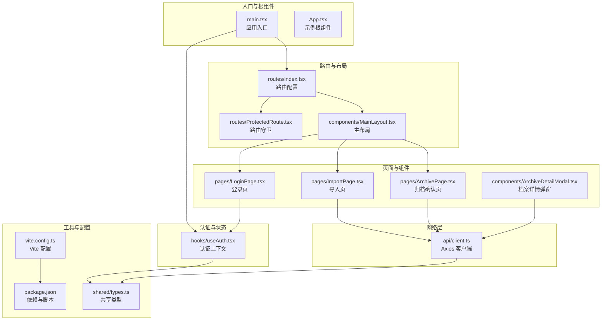
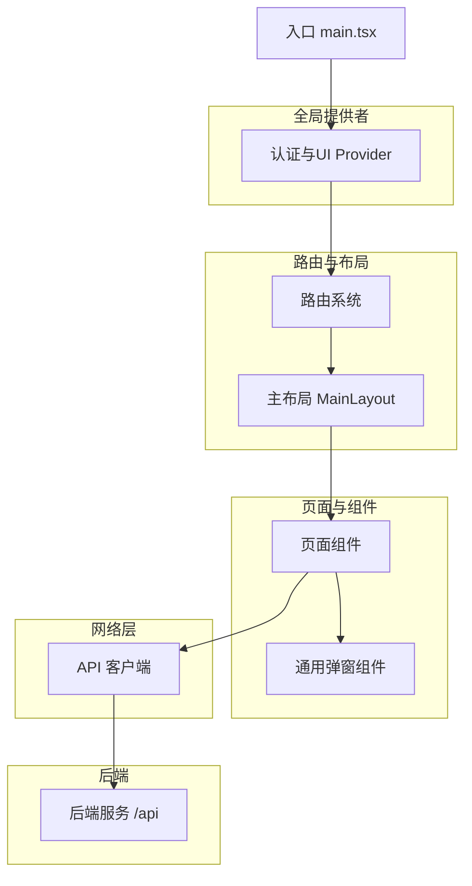
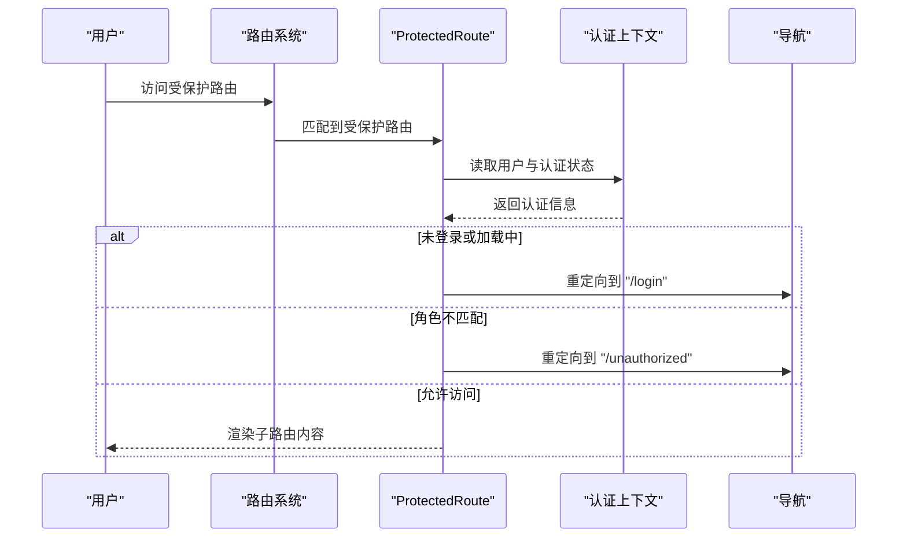
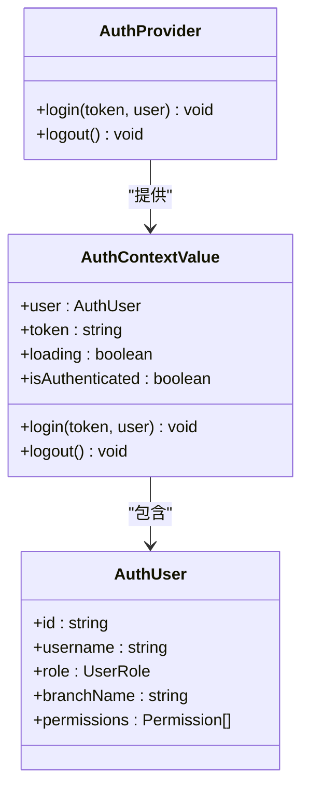
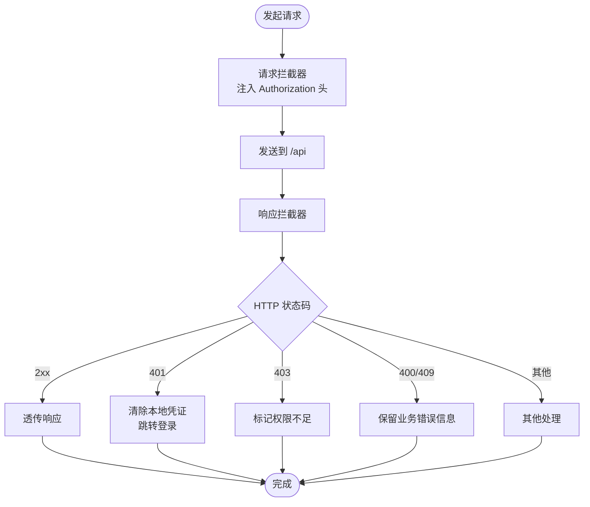
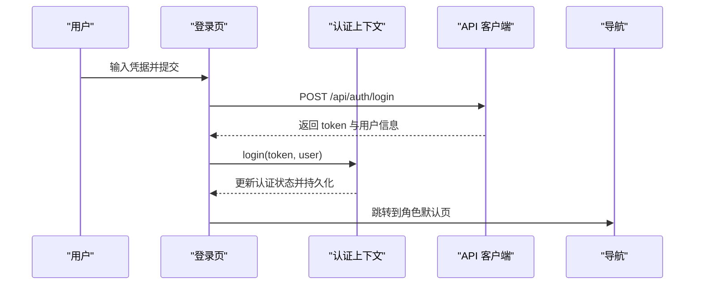
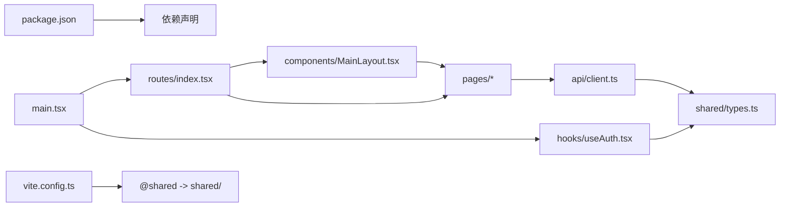

# 前端应用架构

<cite>
**本文引用的文件**
- [frontend/src/main.tsx](file://frontend/src/main.tsx)
- [frontend/src/App.tsx](file://frontend/src/App.tsx)
- [frontend/src/routes/index.tsx](file://frontend/src/routes/index.tsx)
- [frontend/src/routes/ProtectedRoute.tsx](file://frontend/src/routes/ProtectedRoute.tsx)
- [frontend/src/hooks/useAuth.tsx](file://frontend/src/hooks/useAuth.tsx)
- [frontend/src/api/client.ts](file://frontend/src/api/client.ts)
- [frontend/src/components/MainLayout.tsx](file://frontend/src/components/MainLayout.tsx)
- [frontend/src/pages/LoginPage.tsx](file://frontend/src/pages/LoginPage.tsx)
- [frontend/src/pages/ArchivePage.tsx](file://frontend/src/pages/ArchivePage.tsx)
- [frontend/src/pages/ImportPage.tsx](file://frontend/src/pages/ImportPage.tsx)
- [frontend/src/components/ArchiveDetailModal.tsx](file://frontend/src/components/ArchiveDetailModal.tsx)
- [frontend/package.json](file://frontend/package.json)
- [frontend/vite.config.ts](file://frontend/vite.config.ts)
- [shared/types.ts](file://shared/types.ts)
</cite>

## 目录
1. [引言](#引言)
2. [项目结构](#项目结构)
3. [核心组件](#核心组件)
4. [架构总览](#架构总览)
5. [详细组件分析](#详细组件分析)
6. [依赖关系分析](#依赖关系分析)
7. [性能考虑](#性能考虑)
8. [故障排查指南](#故障排查指南)
9. [结论](#结论)
10. [附录](#附录)

## 引言
本文件系统性梳理前端应用的整体架构，覆盖组件化设计、路由管理、状态管理、Ant Design UI 集成、API 客户端设计、自定义 Hook（尤其是认证 Hook）、页面组件组织与复用策略、组件间通信与状态提升模式，以及开发工具链与构建优化策略。目标是帮助开发者快速理解并高效扩展该档案管理系统前端。

## 项目结构
前端采用 React 19 + TypeScript + Vite 技术栈，配合 Ant Design 6 提供丰富的 UI 能力。项目按功能域划分目录，核心入口、路由、页面、组件、API 客户端、自定义 Hook、共享类型等模块职责清晰。

**图表来源**
- [frontend/src/main.tsx:1-18](file://frontend/src/main.tsx#L1-L18)
- [frontend/src/routes/index.tsx:1-98](file://frontend/src/routes/index.tsx#L1-L98)
- [frontend/src/routes/ProtectedRoute.tsx:1-31](file://frontend/src/routes/ProtectedRoute.tsx#L1-L31)
- [frontend/src/components/MainLayout.tsx:1-95](file://frontend/src/components/MainLayout.tsx#L1-L95)
- [frontend/src/hooks/useAuth.tsx:1-90](file://frontend/src/hooks/useAuth.tsx#L1-L90)
- [frontend/src/pages/LoginPage.tsx:1-81](file://frontend/src/pages/LoginPage.tsx#L1-L81)
- [frontend/src/pages/ImportPage.tsx:1-127](file://frontend/src/pages/ImportPage.tsx#L1-L127)
- [frontend/src/pages/ArchivePage.tsx:1-181](file://frontend/src/pages/ArchivePage.tsx#L1-L181)
- [frontend/src/components/ArchiveDetailModal.tsx:1-153](file://frontend/src/components/ArchiveDetailModal.tsx#L1-L153)
- [frontend/src/api/client.ts:1-55](file://frontend/src/api/client.ts#L1-L55)
- [frontend/package.json:1-35](file://frontend/package.json#L1-L35)
- [frontend/vite.config.ts:1-22](file://frontend/vite.config.ts#L1-L22)
- [shared/types.ts:1-289](file://shared/types.ts#L1-L289)

**章节来源**
- [frontend/src/main.tsx:1-18](file://frontend/src/main.tsx#L1-L18)
- [frontend/src/App.tsx:1-122](file://frontend/src/App.tsx#L1-L122)
- [frontend/src/routes/index.tsx:1-98](file://frontend/src/routes/index.tsx#L1-L98)
- [frontend/src/routes/ProtectedRoute.tsx:1-31](file://frontend/src/routes/ProtectedRoute.tsx#L1-L31)
- [frontend/src/components/MainLayout.tsx:1-95](file://frontend/src/components/MainLayout.tsx#L1-L95)
- [frontend/src/hooks/useAuth.tsx:1-90](file://frontend/src/hooks/useAuth.tsx#L1-L90)
- [frontend/src/pages/LoginPage.tsx:1-81](file://frontend/src/pages/LoginPage.tsx#L1-L81)
- [frontend/src/pages/ImportPage.tsx:1-127](file://frontend/src/pages/ImportPage.tsx#L1-L127)
- [frontend/src/pages/ArchivePage.tsx:1-181](file://frontend/src/pages/ArchivePage.tsx#L1-L181)
- [frontend/src/components/ArchiveDetailModal.tsx:1-153](file://frontend/src/components/ArchiveDetailModal.tsx#L1-L153)
- [frontend/src/api/client.ts:1-55](file://frontend/src/api/client.ts#L1-L55)
- [frontend/package.json:1-35](file://frontend/package.json#L1-L35)
- [frontend/vite.config.ts:1-22](file://frontend/vite.config.ts#L1-L22)
- [shared/types.ts:1-289](file://shared/types.ts#L1-L289)

## 核心组件
- 应用入口与根组件
  - 入口文件负责挂载应用，包裹认证 Provider、Ant Design App 与 RouterProvider，确保全局样式与路由可用。
  - 示例根组件用于演示 HMR 与静态资源展示，实际业务以页面组件为主。
- 路由与权限控制
  - 使用 createBrowserRouter 定义路由表，结合 ProtectedRoute 实现角色级权限守卫。
- 认证上下文
  - useAuth 提供登录、登出、用户信息与认证状态管理，并持久化到 localStorage。
- API 客户端
  - 基于 axios 的统一实例，内置请求/响应拦截器，集中处理鉴权头与错误码。
- 页面与通用组件
  - 登录页、导入页、归档确认页与档案详情弹窗，均通过 Ant Design 组件组合实现。

**章节来源**
- [frontend/src/main.tsx:1-18](file://frontend/src/main.tsx#L1-L18)
- [frontend/src/App.tsx:1-122](file://frontend/src/App.tsx#L1-L122)
- [frontend/src/routes/index.tsx:1-98](file://frontend/src/routes/index.tsx#L1-L98)
- [frontend/src/routes/ProtectedRoute.tsx:1-31](file://frontend/src/routes/ProtectedRoute.tsx#L1-L31)
- [frontend/src/hooks/useAuth.tsx:1-90](file://frontend/src/hooks/useAuth.tsx#L1-L90)
- [frontend/src/api/client.ts:1-55](file://frontend/src/api/client.ts#L1-L55)

## 架构总览
应用采用“入口 -> 路由 -> 布局 -> 页面/组件 -> API”的单向数据流，认证状态贯穿全局，页面通过 API 客户端与后端交互，Ant Design 提供一致的 UI 体验与工具能力。

**图表来源**
- [frontend/src/main.tsx:1-18](file://frontend/src/main.tsx#L1-L18)
- [frontend/src/routes/index.tsx:1-98](file://frontend/src/routes/index.tsx#L1-L98)
- [frontend/src/components/MainLayout.tsx:1-95](file://frontend/src/components/MainLayout.tsx#L1-L95)
- [frontend/src/api/client.ts:1-55](file://frontend/src/api/client.ts#L1-L55)

## 详细组件分析

### 路由与权限守卫
- 路由配置
  - 登录页、无权限页、各角色专属页面与档案详情页统一在路由表中声明。
  - 根路径重定向至登录页，保证初始访问正确性。
- 权限守卫
  - ProtectedRoute 在渲染子路由前校验登录状态与角色权限，不满足条件时重定向至相应页面。
  - 支持多角色白名单，便于精细化权限控制。

**图表来源**
- [frontend/src/routes/index.tsx:1-98](file://frontend/src/routes/index.tsx#L1-L98)
- [frontend/src/routes/ProtectedRoute.tsx:1-31](file://frontend/src/routes/ProtectedRoute.tsx#L1-L31)
- [frontend/src/hooks/useAuth.tsx:1-90](file://frontend/src/hooks/useAuth.tsx#L1-L90)

**章节来源**
- [frontend/src/routes/index.tsx:1-98](file://frontend/src/routes/index.tsx#L1-L98)
- [frontend/src/routes/ProtectedRoute.tsx:1-31](file://frontend/src/routes/ProtectedRoute.tsx#L1-L31)
- [frontend/src/hooks/useAuth.tsx:1-90](file://frontend/src/hooks/useAuth.tsx#L1-L90)

### 认证上下文与 useAuth Hook
- 设计要点
  - 使用 React Context 暴露用户信息、令牌、加载状态与登录/登出方法。
  - 初始化时从 localStorage 恢复登录状态，确保刷新后仍保持登录态。
  - 登录时根据角色补全权限列表，并持久化存储。
- 数据模型
  - 用户信息包含角色与权限数组；权限与角色映射表集中维护。
- 错误处理
  - 缺失或异常的本地存储会在初始化阶段清理并进入未登录状态。

**图表来源**
- [frontend/src/hooks/useAuth.tsx:1-90](file://frontend/src/hooks/useAuth.tsx#L1-L90)
- [shared/types.ts:8-102](file://shared/types.ts#L8-L102)

**章节来源**
- [frontend/src/hooks/useAuth.tsx:1-90](file://frontend/src/hooks/useAuth.tsx#L1-L90)
- [shared/types.ts:8-102](file://shared/types.ts#L8-L102)

### API 客户端设计与实现
- 统一实例
  - 基于 axios 创建客户端，设置基础路径为 /api。
- 请求拦截器
  - 自动从 localStorage 注入 Authorization 头，简化页面调用。
- 响应拦截器
  - 针对不同状态码执行差异化处理：401 清理本地凭证并跳转登录；403 交由调用方处理；400/409 保留业务错误信息。
- 类型安全
  - 通过共享类型定义请求/响应接口，确保前后端契约一致。

**图表来源**
- [frontend/src/api/client.ts:1-55](file://frontend/src/api/client.ts#L1-L55)
- [shared/types.ts:104-216](file://shared/types.ts#L104-L216)

**章节来源**
- [frontend/src/api/client.ts:1-55](file://frontend/src/api/client.ts#L1-L55)
- [shared/types.ts:104-216](file://shared/types.ts#L104-L216)

### Ant Design 集成与使用
- 全局包裹
  - 在入口处使用 Ant Design App 包裹，启用全局消息与通知能力。
- 布局与导航
  - MainLayout 使用 Layout/Sider/Header/Content 组织侧边菜单与头部信息，菜单项按角色动态渲染。
- 表单与反馈
  - 登录页使用 Form/FormItem/Button/Input 等组件，结合 App.useApp() 展示消息。
- 列表与弹窗
  - 归档确认页使用 Table/Card/Button，档案详情弹窗使用 Modal/Descriptions/Timeline/Spin 等。

**章节来源**
- [frontend/src/main.tsx:1-18](file://frontend/src/main.tsx#L1-L18)
- [frontend/src/components/MainLayout.tsx:1-95](file://frontend/src/components/MainLayout.tsx#L1-L95)
- [frontend/src/pages/LoginPage.tsx:1-81](file://frontend/src/pages/LoginPage.tsx#L1-L81)
- [frontend/src/pages/ArchivePage.tsx:1-181](file://frontend/src/pages/ArchivePage.tsx#L1-L181)
- [frontend/src/components/ArchiveDetailModal.tsx:1-153](file://frontend/src/components/ArchiveDetailModal.tsx#L1-L153)

### 页面组件组织与复用策略
- 登录页
  - 通过 useAuth 与 apiClient 完成登录流程，根据角色计算默认跳转路径。
- 导入页
  - 使用 Upload.Dragger 实现 Excel 导入，支持模板下载与结果弹窗展示。
- 归档确认页
  - 使用 Table 展示档案列表，支持分页、勾选与批量操作；点击客户名打开详情弹窗。
- 档案详情弹窗
  - 作为通用组件，接收档案 ID 并异步加载详情与状态历史，支持销毁时清理状态。

**图表来源**
- [frontend/src/pages/LoginPage.tsx:1-81](file://frontend/src/pages/LoginPage.tsx#L1-L81)
- [frontend/src/hooks/useAuth.tsx:1-90](file://frontend/src/hooks/useAuth.tsx#L1-L90)
- [frontend/src/api/client.ts:1-55](file://frontend/src/api/client.ts#L1-L55)

**章节来源**
- [frontend/src/pages/LoginPage.tsx:1-81](file://frontend/src/pages/LoginPage.tsx#L1-L81)
- [frontend/src/pages/ImportPage.tsx:1-127](file://frontend/src/pages/ImportPage.tsx#L1-L127)
- [frontend/src/pages/ArchivePage.tsx:1-181](file://frontend/src/pages/ArchivePage.tsx#L1-L181)
- [frontend/src/components/ArchiveDetailModal.tsx:1-153](file://frontend/src/components/ArchiveDetailModal.tsx#L1-L153)

### 组件间通信、Props 传递与状态提升
- 通信方式
  - 父子组件：通过 props 传递数据与回调（如 ArchiveDetailModal 的 open/onClose）。
  - 跨层级：通过全局认证上下文 useAuth 提供共享状态。
- 状态提升
  - 列表页维护分页与选中项状态，弹窗关闭后刷新列表，避免重复请求。
- 事件处理
  - 使用 useCallback 与 useMemo 优化渲染与副作用触发频率。

**章节来源**
- [frontend/src/pages/ArchivePage.tsx:1-181](file://frontend/src/pages/ArchivePage.tsx#L1-L181)
- [frontend/src/components/ArchiveDetailModal.tsx:1-153](file://frontend/src/components/ArchiveDetailModal.tsx#L1-L153)
- [frontend/src/hooks/useAuth.tsx:1-90](file://frontend/src/hooks/useAuth.tsx#L1-L90)

## 依赖关系分析
- 依赖层次
  - 入口依赖路由与认证；路由依赖布局与页面；页面依赖 API 客户端；认证依赖共享类型；API 客户端依赖共享类型。
- 外部依赖
  - React 19、React Router DOM 7、Ant Design 6、Axios、XLSX、Vite 与 TypeScript 生态。

**图表来源**
- [frontend/src/main.tsx:1-18](file://frontend/src/main.tsx#L1-L18)
- [frontend/src/routes/index.tsx:1-98](file://frontend/src/routes/index.tsx#L1-L98)
- [frontend/src/hooks/useAuth.tsx:1-90](file://frontend/src/hooks/useAuth.tsx#L1-L90)
- [frontend/src/components/MainLayout.tsx:1-95](file://frontend/src/components/MainLayout.tsx#L1-L95)
- [frontend/src/api/client.ts:1-55](file://frontend/src/api/client.ts#L1-L55)
- [frontend/package.json:1-35](file://frontend/package.json#L1-L35)
- [frontend/vite.config.ts:1-22](file://frontend/vite.config.ts#L1-L22)
- [shared/types.ts:1-289](file://shared/types.ts#L1-L289)

**章节来源**
- [frontend/src/main.tsx:1-18](file://frontend/src/main.tsx#L1-L18)
- [frontend/src/routes/index.tsx:1-98](file://frontend/src/routes/index.tsx#L1-L98)
- [frontend/src/hooks/useAuth.tsx:1-90](file://frontend/src/hooks/useAuth.tsx#L1-L90)
- [frontend/src/api/client.ts:1-55](file://frontend/src/api/client.ts#L1-L55)
- [frontend/package.json:1-35](file://frontend/package.json#L1-L35)
- [frontend/vite.config.ts:1-22](file://frontend/vite.config.ts#L1-L22)
- [shared/types.ts:1-289](file://shared/types.ts#L1-L289)

## 性能考虑
- 渲染优化
  - 使用 useMemo 缓存菜单项等计算结果，减少不必要的重渲染。
  - 使用 useCallback 包装回调函数，避免子组件因引用变化而重新渲染。
- 网络优化
  - Axios 客户端集中处理鉴权头与错误，减少页面重复逻辑。
  - 代理配置仅在开发环境生效，生产环境通过反向代理或 CDN 提升访问速度。
- 构建优化
  - Vite 默认启用按需编译与热更新；可通过插件与别名提升开发体验。
  - TypeScript 严格模式有助于提前发现潜在问题，降低运行时开销。

[本节为通用指导，无需特定文件来源]

## 故障排查指南
- 登录失败
  - 检查登录页消息提示与 API 响应错误；确认凭据正确且后端服务正常。
- 无权限访问
  - 确认用户角色与路由允许角色是否匹配；查看 ProtectedRoute 重定向行为。
- 401 未授权
  - 检查本地存储的 token 是否存在；确认响应拦截器是否正确清除并跳转登录。
- 导入失败
  - 确认文件格式与大小限制；查看导入结果弹窗中的错误明细。
- 列表为空或加载缓慢
  - 检查分页参数与筛选条件；确认网络请求是否超时。

**章节来源**
- [frontend/src/pages/LoginPage.tsx:1-81](file://frontend/src/pages/LoginPage.tsx#L1-L81)
- [frontend/src/routes/ProtectedRoute.tsx:1-31](file://frontend/src/routes/ProtectedRoute.tsx#L1-L31)
- [frontend/src/api/client.ts:1-55](file://frontend/src/api/client.ts#L1-L55)
- [frontend/src/pages/ImportPage.tsx:1-127](file://frontend/src/pages/ImportPage.tsx#L1-L127)
- [frontend/src/pages/ArchivePage.tsx:1-181](file://frontend/src/pages/ArchivePage.tsx#L1-L181)

## 结论
该前端应用以 React 19 为核心，结合 React Router DOM 7 实现细粒度路由与权限控制，Ant Design 6 提供一致的 UI 体验，Axios 客户端统一处理鉴权与错误，useAuth Hook 将认证状态全局化。页面组件围绕共享类型进行强类型约束，形成高内聚、低耦合的架构。通过合理的工具链与构建配置，能够支撑业务持续演进与团队协作。

[本节为总结，无需特定文件来源]

## 附录
- 开发工具链
  - Vite：开发服务器、代理与构建工具；通过别名 @shared 快速引用共享类型。
  - ESLint + TypeScript ESlint：代码规范与类型检查。
  - React DevTools：调试组件树与状态。
- 构建与预览
  - dev/build/preview 脚本分别用于开发、构建与本地预览。
- 代理配置
  - 开发环境将 /api 代理到后端服务地址，便于前后端联调。

**章节来源**
- [frontend/package.json:1-35](file://frontend/package.json#L1-L35)
- [frontend/vite.config.ts:1-22](file://frontend/vite.config.ts#L1-L22)