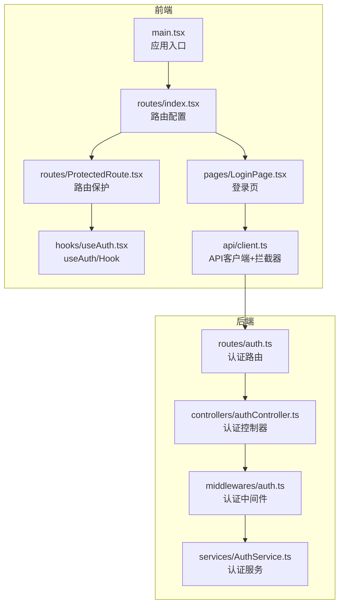
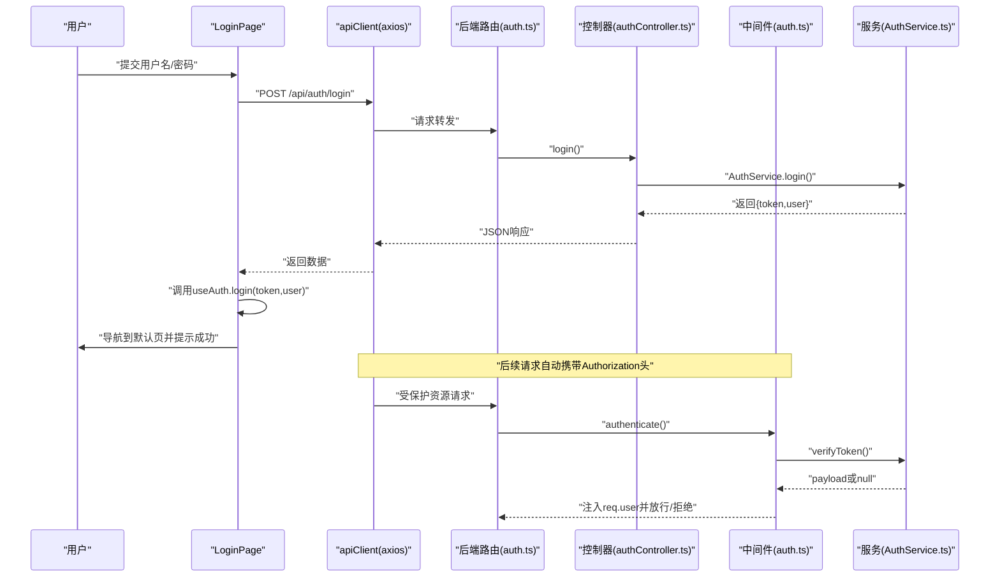
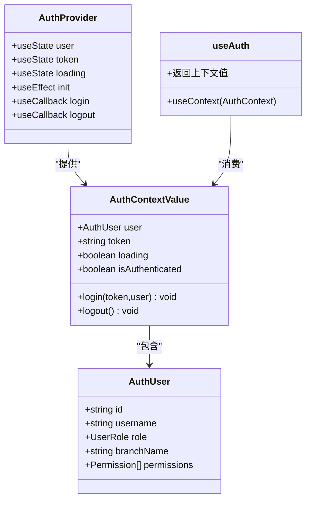
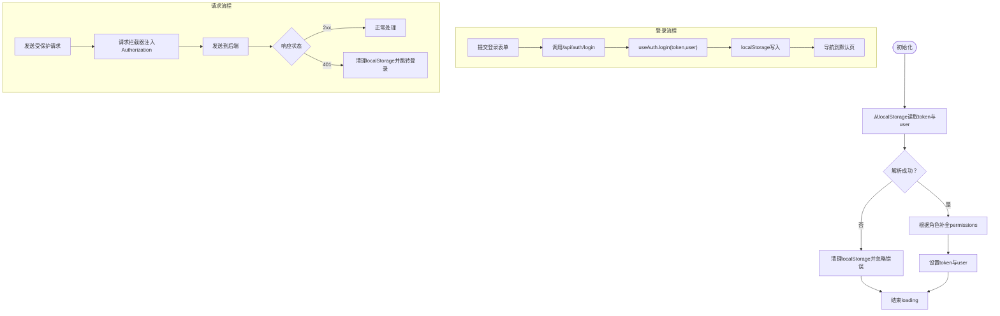
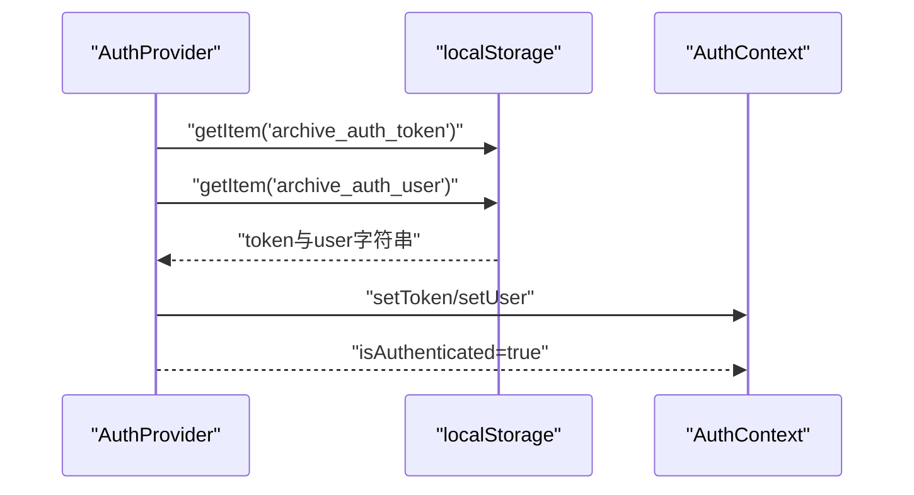
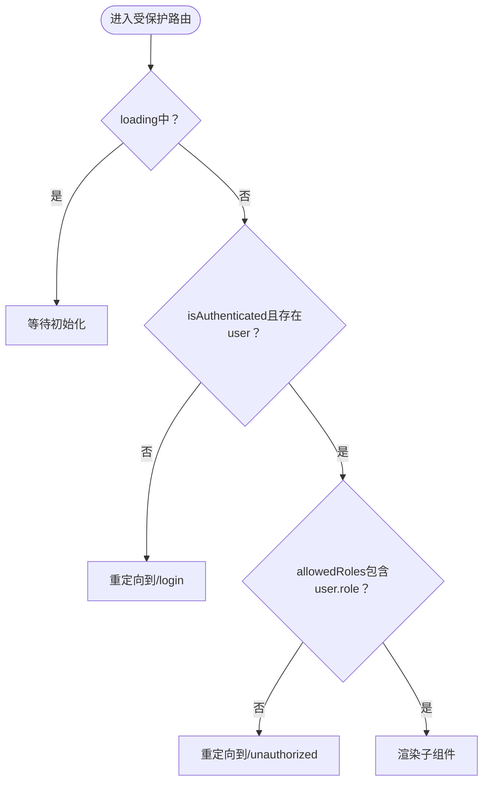
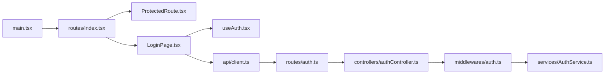

# 认证与Hooks

<cite>
**本文引用的文件**
- [frontend/src/hooks/useAuth.tsx](file://frontend/src/hooks/useAuth.tsx)
- [frontend/src/api/client.ts](file://frontend/src/api/client.ts)
- [frontend/src/pages/LoginPage.tsx](file://frontend/src/pages/LoginPage.tsx)
- [frontend/src/routes/ProtectedRoute.tsx](file://frontend/src/routes/ProtectedRoute.tsx)
- [frontend/src/main.tsx](file://frontend/src/main.tsx)
- [frontend/src/routes/index.tsx](file://frontend/src/routes/index.tsx)
- [backend/src/controllers/authController.ts](file://backend/src/controllers/authController.ts)
- [backend/src/middlewares/auth.ts](file://backend/src/middlewares/auth.ts)
- [backend/src/services/AuthService.ts](file://backend/src/services/AuthService.ts)
- [backend/src/routes/auth.ts](file://backend/src/routes/auth.ts)
- [shared/types.ts](file://shared/types.ts)
</cite>

## 目录
1. [简介](#简介)
2. [项目结构](#项目结构)
3. [核心组件](#核心组件)
4. [架构总览](#架构总览)
5. [详细组件分析](#详细组件分析)
6. [依赖关系分析](#依赖关系分析)
7. [性能考量](#性能考量)
8. [故障排查指南](#故障排查指南)
9. [结论](#结论)
10. [附录](#附录)

## 简介
本文件系统性地文档化前端认证与Hooks体系，重点围绕自定义Hook useAuth的设计与实现，涵盖认证状态管理、登录/登出流程、用户信息获取、JWT令牌的存储与验证、认证上下文Provider与状态提升策略、权限检查与角色验证、依赖管理与副作用处理、认证状态持久化与页面刷新恢复、以及错误处理与用户体验优化的最佳实践。

## 项目结构
前端采用React + TypeScript + Ant Design，认证相关代码集中在以下模块：
- 认证上下文与Hook：frontend/src/hooks/useAuth.tsx
- API客户端与拦截器：frontend/src/api/client.ts
- 登录页面：frontend/src/pages/LoginPage.tsx
- 路由保护：frontend/src/routes/ProtectedRoute.tsx 与路由配置
- 应用入口：frontend/src/main.tsx
后端采用Express + TypeScript，认证相关模块：
- 控制器：backend/src/controllers/authController.ts
- 中间件：backend/src/middlewares/auth.ts
- 服务：backend/src/services/AuthService.ts
- 路由：backend/src/routes/auth.ts
- 共享类型：shared/types.ts

**图表来源**
- [frontend/src/main.tsx:1-18](file://frontend/src/main.tsx#L1-L18)
- [frontend/src/routes/index.tsx:1-98](file://frontend/src/routes/index.tsx#L1-L98)
- [frontend/src/routes/ProtectedRoute.tsx:1-31](file://frontend/src/routes/ProtectedRoute.tsx#L1-L31)
- [frontend/src/pages/LoginPage.tsx:1-81](file://frontend/src/pages/LoginPage.tsx#L1-L81)
- [frontend/src/hooks/useAuth.tsx:1-90](file://frontend/src/hooks/useAuth.tsx#L1-L90)
- [frontend/src/api/client.ts:1-55](file://frontend/src/api/client.ts#L1-L55)
- [backend/src/routes/auth.ts:1-19](file://backend/src/routes/auth.ts#L1-L19)
- [backend/src/controllers/authController.ts:1-77](file://backend/src/controllers/authController.ts#L1-L77)
- [backend/src/middlewares/auth.ts:1-56](file://backend/src/middlewares/auth.ts#L1-L56)
- [backend/src/services/AuthService.ts:1-126](file://backend/src/services/AuthService.ts#L1-L126)

**章节来源**
- [frontend/src/main.tsx:1-18](file://frontend/src/main.tsx#L1-L18)
- [frontend/src/routes/index.tsx:1-98](file://frontend/src/routes/index.tsx#L1-L98)
- [frontend/src/hooks/useAuth.tsx:1-90](file://frontend/src/hooks/useAuth.tsx#L1-L90)
- [frontend/src/api/client.ts:1-55](file://frontend/src/api/client.ts#L1-L55)
- [backend/src/controllers/authController.ts:1-77](file://backend/src/controllers/authController.ts#L1-L77)
- [backend/src/middlewares/auth.ts:1-56](file://backend/src/middlewares/auth.ts#L1-L56)
- [backend/src/services/AuthService.ts:1-126](file://backend/src/services/AuthService.ts#L1-L126)
- [backend/src/routes/auth.ts:1-19](file://backend/src/routes/auth.ts#L1-L19)
- [shared/types.ts:1-289](file://shared/types.ts#L1-L289)

## 核心组件
- useAuth自定义Hook：提供认证上下文值，包括用户信息、令牌、加载状态、登录/登出方法与认证态标识；负责从localStorage恢复状态并在登录/登出时同步更新。
- API客户端与拦截器：统一创建axios实例，自动在请求头注入Authorization Bearer令牌；在响应拦截中处理401等错误，触发本地凭证清理与跳转登录。
- 登录页面：发起登录请求，接收后调用useAuth.login完成状态写入与持久化，并根据角色导航至默认页。
- 路由保护：ProtectedRoute基于useAuth判断是否已认证及角色是否允许，未认证或无权限时重定向。
- 认证服务（后端）：提供JWT签发、校验、当前用户信息查询与权限映射。

**章节来源**
- [frontend/src/hooks/useAuth.tsx:1-90](file://frontend/src/hooks/useAuth.tsx#L1-L90)
- [frontend/src/api/client.ts:1-55](file://frontend/src/api/client.ts#L1-L55)
- [frontend/src/pages/LoginPage.tsx:1-81](file://frontend/src/pages/LoginPage.tsx#L1-L81)
- [frontend/src/routes/ProtectedRoute.tsx:1-31](file://frontend/src/routes/ProtectedRoute.tsx#L1-L31)
- [backend/src/services/AuthService.ts:1-126](file://backend/src/services/AuthService.ts#L1-L126)

## 架构总览
下图展示从前端登录到后端认证再到API拦截器处理的完整链路，以及useAuth如何在前端维护认证状态。

**图表来源**
- [frontend/src/pages/LoginPage.tsx:36-59](file://frontend/src/pages/LoginPage.tsx#L36-L59)
- [frontend/src/api/client.ts:10-17](file://frontend/src/api/client.ts#L10-L17)
- [backend/src/routes/auth.ts:12-16](file://backend/src/routes/auth.ts#L12-L16)
- [backend/src/controllers/authController.ts:16-43](file://backend/src/controllers/authController.ts#L16-L43)
- [backend/src/middlewares/auth.ts:26-55](file://backend/src/middlewares/auth.ts#L26-L55)
- [backend/src/services/AuthService.ts:43-65](file://backend/src/services/AuthService.ts#L43-L65)

## 详细组件分析

### useAuth自定义Hook设计与实现
- 设计模式
  - Provider/Consumer模式：通过React Context暴露认证上下文值，子树内任意组件可通过useAuth获取状态与方法。
  - 状态提升：将认证状态提升至应用根节点AuthProvider，避免多处分散状态。
  - 依赖注入：login/logout方法作为上下文的一部分，便于在任意组件中调用。
- 数据结构
  - AuthUser：包含用户标识、用户名、角色、可选营业部名称、权限列表。
  - AuthContextValue：包含user、token、loading、login、logout、isAuthenticated。
- 生命周期与副作用
  - 初始化副作用：在首次渲染时从localStorage恢复token与user，确保刷新后状态不丢失；同时保证permissions与角色一致。
  - 登录副作用：写入token与user，持久化到localStorage。
  - 登出副作用：清空token与user，移除localStorage条目。
- 权限与角色
  - 前端与后端均维护角色到权限的映射，登录时由前端根据角色补全权限列表，后端在生成token时也包含角色信息，确保前后一致。
- 错误处理
  - 初始化阶段异常清理localStorage并结束loading。
  - 登录失败通过消息提示反馈给用户。
- 依赖管理
  - login/logout使用useCallback稳定引用，避免子组件不必要的重渲染。
  - 初始化useEffect仅在挂载时执行一次。

**图表来源**
- [frontend/src/hooks/useAuth.tsx:4-20](file://frontend/src/hooks/useAuth.tsx#L4-L20)
- [frontend/src/hooks/useAuth.tsx:34-80](file://frontend/src/hooks/useAuth.tsx#L34-L80)
- [frontend/src/hooks/useAuth.tsx:82-89](file://frontend/src/hooks/useAuth.tsx#L82-L89)

**章节来源**
- [frontend/src/hooks/useAuth.tsx:1-90](file://frontend/src/hooks/useAuth.tsx#L1-L90)
- [shared/types.ts:8-102](file://shared/types.ts#L8-L102)

### JWT令牌的存储、刷新与验证机制
- 存储
  - 前端：localStorage保存令牌与用户信息，初始化时恢复；登录成功后写入；登出时清除。
  - 后端：使用对称密钥（可配置）签发JWT，设置过期时间。
- 刷新
  - 当前实现未包含令牌刷新逻辑；建议在需要时引入“刷新令牌”或“静默续期”策略（例如：新增refresh接口与定时器轮询，或在请求拦截器中捕获特定401场景触发刷新）。
- 验证
  - 前端：请求拦截器自动附加Authorization头；响应拦截器处理401，清理本地凭证并跳转登录。
  - 后端：中间件从Authorization头提取Bearer Token，调用服务verifyToken校验；校验失败返回401。

**图表来源**
- [frontend/src/hooks/useAuth.tsx:39-57](file://frontend/src/hooks/useAuth.tsx#L39-L57)
- [frontend/src/hooks/useAuth.tsx:59-73](file://frontend/src/hooks/useAuth.tsx#L59-L73)
- [frontend/src/api/client.ts:10-17](file://frontend/src/api/client.ts#L10-L17)
- [frontend/src/api/client.ts:19-52](file://frontend/src/api/client.ts#L19-L52)
- [backend/src/middlewares/auth.ts:26-55](file://backend/src/middlewares/auth.ts#L26-L55)
- [backend/src/services/AuthService.ts:85-92](file://backend/src/services/AuthService.ts#L85-L92)

**章节来源**
- [frontend/src/hooks/useAuth.tsx:24-25](file://frontend/src/hooks/useAuth.tsx#L24-L25)
- [frontend/src/api/client.ts:3-3](file://frontend/src/api/client.ts#L3-L3)
- [backend/src/services/AuthService.ts:11-15](file://backend/src/services/AuthService.ts#L11-L15)
- [backend/src/middlewares/auth.ts:27-37](file://backend/src/middlewares/auth.ts#L27-L37)
- [backend/src/services/AuthService.ts:85-92](file://backend/src/services/AuthService.ts#L85-L92)

### 认证上下文Provider实现与状态提升策略
- Provider职责
  - 在应用根节点包裹，向子树提供认证上下文值。
  - 管理token、user、loading三类状态。
  - 提供login与logout方法，统一处理状态变更与持久化。
- 状态提升策略
  - 将认证状态提升至根组件，避免在多处重复管理；子组件通过useAuth按需消费。
  - 使用useCallback稳定login/logout引用，减少子组件重渲染。
- 初始化恢复
  - 在useEffect中一次性恢复状态，避免在渲染期间产生副作用。

**图表来源**
- [frontend/src/hooks/useAuth.tsx:34-80](file://frontend/src/hooks/useAuth.tsx#L34-L80)

**章节来源**
- [frontend/src/hooks/useAuth.tsx:34-80](file://frontend/src/hooks/useAuth.tsx#L34-L80)

### 权限检查与角色验证
- 角色与权限
  - 前端与后端均维护角色到权限映射；登录时前端根据角色补全权限列表；后端在生成token时包含角色信息。
- 路由级权限
  - ProtectedRoute根据useAuth提供的user.role与allowedRoles进行匹配，未认证或无权限时重定向至登录或无权限页。
- 组件级权限
  - 可在组件内部通过useAuth.user.permissions与共享类型中的Permission集合进行细粒度控制（例如按钮显隐、操作可用性）。

**图表来源**
- [frontend/src/routes/ProtectedRoute.tsx:10-30](file://frontend/src/routes/ProtectedRoute.tsx#L10-L30)
- [shared/types.ts:8-102](file://shared/types.ts#L8-L102)

**章节来源**
- [frontend/src/routes/ProtectedRoute.tsx:1-31](file://frontend/src/routes/ProtectedRoute.tsx#L1-L31)
- [shared/types.ts:8-102](file://shared/types.ts#L8-L102)

### Hook的依赖管理与副作用处理
- 依赖管理
  - login/logout使用useCallback，避免因每次渲染产生新引用导致子组件重渲染。
  - 初始化useEffect依赖为空数组，确保只在挂载时执行一次。
- 副作用处理
  - 初始化：读取localStorage、解析并补全权限、设置状态、结束loading。
  - 登录：写入token与user、持久化、触发导航。
  - 登出：清空状态与localStorage。
- 错误处理
  - 初始化异常时清理localStorage并结束loading，避免阻塞应用。
  - 登录失败通过消息提示反馈，避免抛出未捕获异常。

**章节来源**
- [frontend/src/hooks/useAuth.tsx:39-57](file://frontend/src/hooks/useAuth.tsx#L39-L57)
- [frontend/src/hooks/useAuth.tsx:59-73](file://frontend/src/hooks/useAuth.tsx#L59-L73)

### 认证状态持久化与页面刷新后的状态恢复
- 持久化
  - localStorage保存令牌与用户信息，确保跨标签页与刷新后仍可恢复。
- 恢复
  - 初始化时读取localStorage，解析用户信息并补全权限，设置token与user，结束loading。
- 一致性
  - 若localStorage中存在但格式异常，清理localStorage并忽略错误，避免污染后续状态。

**章节来源**
- [frontend/src/hooks/useAuth.tsx:39-57](file://frontend/src/hooks/useAuth.tsx#L39-L57)

### 错误处理与用户体验优化
- 401处理
  - API拦截器在响应拦截中检测401，清理localStorage并跳转登录，避免重复跳转。
- 登录失败
  - 登录页捕获错误，显示友好提示信息，避免抛出未处理异常。
- 加载态
  - 初始化loading避免在恢复过程中出现闪烁或错误渲染。
- 导航优化
  - 登录成功后根据角色导航到对应默认页，提升首屏体验。

**章节来源**
- [frontend/src/api/client.ts:19-52](file://frontend/src/api/client.ts#L19-L52)
- [frontend/src/pages/LoginPage.tsx:36-59](file://frontend/src/pages/LoginPage.tsx#L36-L59)
- [frontend/src/hooks/useAuth.tsx:37-37](file://frontend/src/hooks/useAuth.tsx#L37-L37)

## 依赖关系分析
- 前端依赖
  - main.tsx依赖AuthProvider包裹RouterProvider，形成认证上下文根。
  - LoginPage依赖useAuth与apiClient，完成登录与状态写入。
  - ProtectedRoute依赖useAuth进行路由级权限校验。
  - apiClient依赖localStorage进行令牌读取与请求头注入。
- 后端依赖
  - auth路由注册login与/me接口，前者无需认证，后者前置authenticate中间件。
  - authenticate中间件依赖AuthService.verifyToken校验JWT。
  - authController依赖AuthService.login与getCurrentUser，结合UserRepository与数据库交互。

**图表来源**
- [frontend/src/main.tsx:9-17](file://frontend/src/main.tsx#L9-L17)
- [frontend/src/routes/index.tsx:21-97](file://frontend/src/routes/index.tsx#L21-L97)
- [frontend/src/routes/ProtectedRoute.tsx:11-30](file://frontend/src/routes/ProtectedRoute.tsx#L11-L30)
- [frontend/src/pages/LoginPage.tsx:24-59](file://frontend/src/pages/LoginPage.tsx#L24-L59)
- [frontend/src/hooks/useAuth.tsx:34-80](file://frontend/src/hooks/useAuth.tsx#L34-L80)
- [frontend/src/api/client.ts:6-55](file://frontend/src/api/client.ts#L6-L55)
- [backend/src/routes/auth.ts:10-18](file://backend/src/routes/auth.ts#L10-L18)
- [backend/src/controllers/authController.ts:16-76](file://backend/src/controllers/authController.ts#L16-L76)
- [backend/src/middlewares/auth.ts:26-55](file://backend/src/middlewares/auth.ts#L26-L55)
- [backend/src/services/AuthService.ts:32-92](file://backend/src/services/AuthService.ts#L32-L92)

**章节来源**
- [frontend/src/main.tsx:1-18](file://frontend/src/main.tsx#L1-L18)
- [frontend/src/routes/index.tsx:1-98](file://frontend/src/routes/index.tsx#L1-L98)
- [frontend/src/pages/LoginPage.tsx:1-81](file://frontend/src/pages/LoginPage.tsx#L1-L81)
- [frontend/src/api/client.ts:1-55](file://frontend/src/api/client.ts#L1-L55)
- [backend/src/controllers/authController.ts:1-77](file://backend/src/controllers/authController.ts#L1-L77)
- [backend/src/middlewares/auth.ts:1-56](file://backend/src/middlewares/auth.ts#L1-L56)
- [backend/src/services/AuthService.ts:1-126](file://backend/src/services/AuthService.ts#L1-L126)
- [backend/src/routes/auth.ts:1-19](file://backend/src/routes/auth.ts#L1-L19)

## 性能考量
- 渲染优化
  - login/logout使用useCallback稳定引用，降低子组件重渲染频率。
  - 初始化useEffect仅在挂载时执行，避免重复IO。
- IO优化
  - localStorage读写为同步操作，数量少、体积小，影响可忽略；如需进一步优化可在登录后延迟写入或批量写入。
- 网络优化
  - 请求拦截器统一注入Authorization头，避免重复设置；响应拦截器集中处理401，减少重复逻辑。

## 故障排查指南
- 登录后立即跳转到登录页
  - 检查useAuth.login是否被正确调用，以及getDefaultPath逻辑是否返回预期路径。
  - 确认ProtectedRoute在loading期间不进行跳转。
- 页面刷新后未保持登录
  - 检查localStorage中是否存在令牌与用户信息；初始化useEffect是否执行。
  - 如解析异常，localStorage会被清理，需重新登录。
- 401频繁出现
  - 检查请求头Authorization是否正确注入；后端JWT密钥与过期时间配置是否一致。
  - 确认响应拦截器是否在401时清理localStorage并跳转登录。
- 权限不足
  - 检查角色到权限映射是否与后端一致；组件内权限判断逻辑是否正确。

**章节来源**
- [frontend/src/pages/LoginPage.tsx:31-34](file://frontend/src/pages/LoginPage.tsx#L31-L34)
- [frontend/src/routes/ProtectedRoute.tsx:14-17](file://frontend/src/routes/ProtectedRoute.tsx#L14-L17)
- [frontend/src/hooks/useAuth.tsx:39-57](file://frontend/src/hooks/useAuth.tsx#L39-L57)
- [frontend/src/api/client.ts:19-52](file://frontend/src/api/client.ts#L19-L52)
- [backend/src/middlewares/auth.ts:26-55](file://backend/src/middlewares/auth.ts#L26-L55)

## 结论
该认证与Hooks系统以useAuth为核心，结合Provider与上下文实现了清晰的状态管理与权限控制；前端通过localStorage实现状态持久化，配合API拦截器统一处理认证与错误；后端通过JWT与中间件保障安全访问。整体架构简洁、职责明确，具备良好的扩展性与可维护性。建议后续引入令牌刷新与更细粒度的权限控制以进一步增强安全性与用户体验。

## 附录
- 角色与权限映射
  - 前端与后端均维护角色到权限的映射，确保登录时权限列表与角色一致。
- 默认导航路径
  - 根据角色返回登录后的默认首页路径，避免重复登录后停留在登录页。

**章节来源**
- [frontend/src/pages/LoginPage.tsx:10-22](file://frontend/src/pages/LoginPage.tsx#L10-L22)
- [shared/types.ts:8-102](file://shared/types.ts#L8-L102)