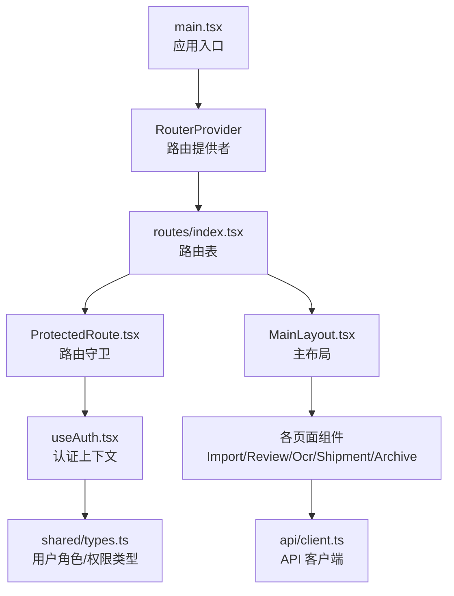
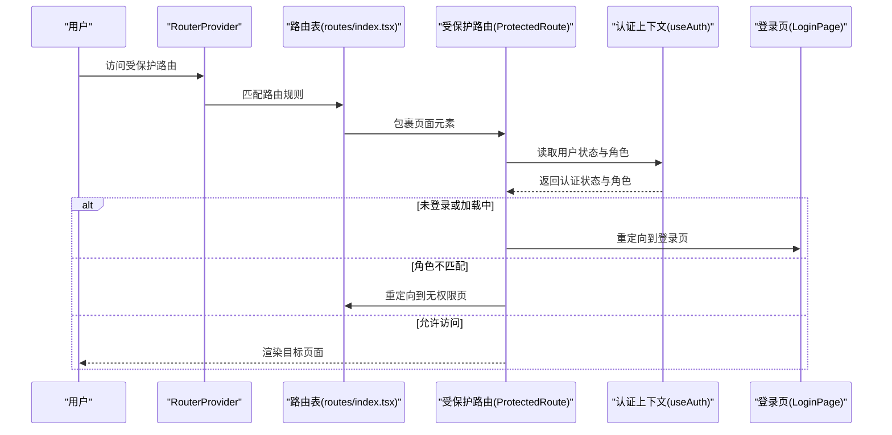
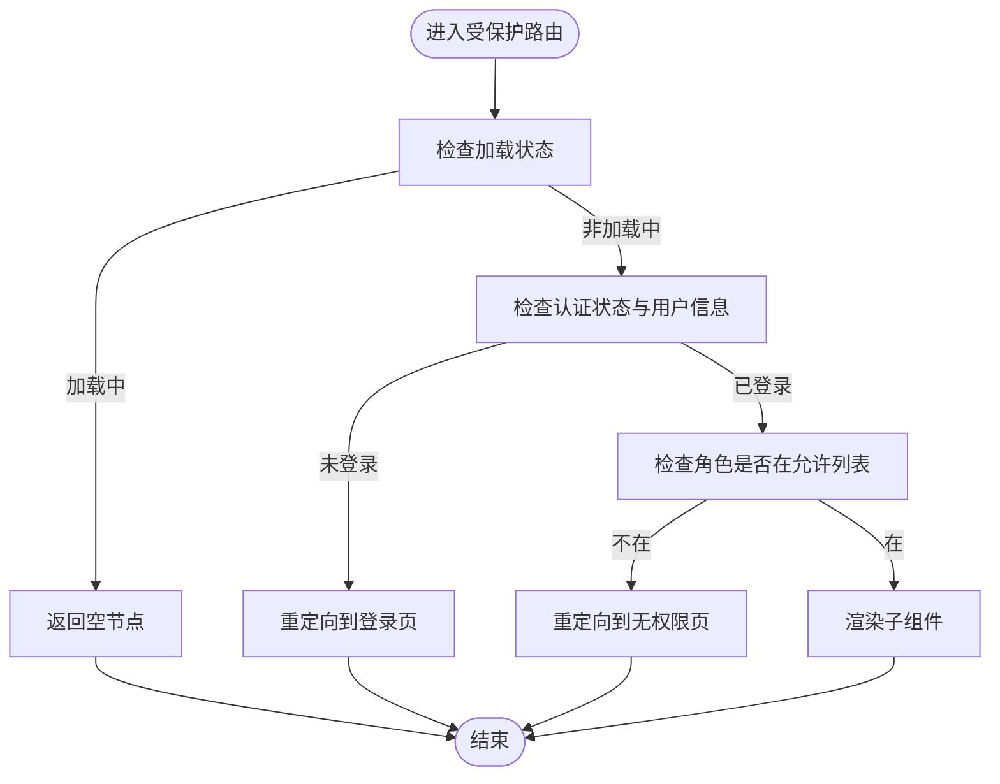
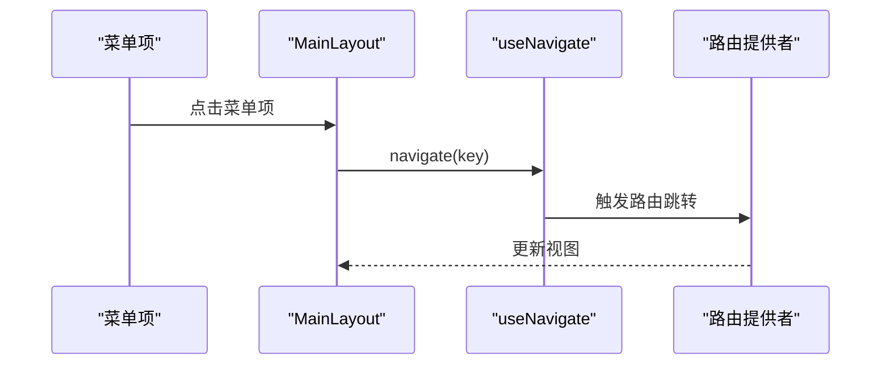
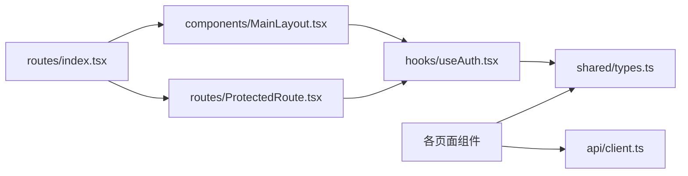

# 路由与导航

<cite>
**本文引用的文件**
- [frontend/src/routes/index.tsx](file://frontend/src/routes/index.tsx)
- [frontend/src/routes/ProtectedRoute.tsx](file://frontend/src/routes/ProtectedRoute.tsx)
- [frontend/src/main.tsx](file://frontend/src/main.tsx)
- [frontend/src/hooks/useAuth.tsx](file://frontend/src/hooks/useAuth.tsx)
- [frontend/src/components/MainLayout.tsx](file://frontend/src/components/MainLayout.tsx)
- [frontend/src/pages/LoginPage.tsx](file://frontend/src/pages/LoginPage.tsx)
- [frontend/src/pages/ArchivePage.tsx](file://frontend/src/pages/ArchivePage.tsx)
- [frontend/src/pages/ImportPage.tsx](file://frontend/src/pages/ImportPage.tsx)
- [frontend/src/pages/ReviewPage.tsx](file://frontend/src/pages/ReviewPage.tsx)
- [frontend/src/pages/OcrPage.tsx](file://frontend/src/pages/OcrPage.tsx)
- [frontend/src/pages/ShipmentPage.tsx](file://frontend/src/pages/ShipmentPage.tsx)
- [frontend/src/components/ArchiveDetailModal.tsx](file://frontend/src/components/ArchiveDetailModal.tsx)
- [frontend/src/api/client.ts](file://frontend/src/api/client.ts)
- [shared/types.ts](file://shared/types.ts)
</cite>

## 目录
1. [简介](#简介)
2. [项目结构](#项目结构)
3. [核心组件](#核心组件)
4. [架构总览](#架构总览)
5. [详细组件分析](#详细组件分析)
6. [依赖关系分析](#依赖关系分析)
7. [性能考虑](#性能考虑)
8. [故障排查指南](#故障排查指南)
9. [结论](#结论)
10. [附录](#附录)

## 简介
本文件系统性地文档化前端路由与导航体系，涵盖 React Router DOM 的配置与路由表设计、受保护路由的实现机制、路由守卫与条件渲染策略、程序化导航与编程式跳转、路由参数解析与查询字符串处理、以及动态路由匹配与懒加载优化策略。目标是帮助开发者快速理解并维护该路由系统。

## 项目结构
前端路由与导航相关的关键文件组织如下：
- 路由定义与表：frontend/src/routes/index.tsx
- 受保护路由守卫：frontend/src/routes/ProtectedRoute.tsx
- 应用入口与路由提供者：frontend/src/main.tsx
- 认证上下文与权限映射：frontend/src/hooks/useAuth.tsx
- 主布局与菜单导航：frontend/src/components/MainLayout.tsx
- 页面组件：Login、Import、Review、Ocr、Shipment、Archive 等
- 档案详情弹窗：frontend/src/components/ArchiveDetailModal.tsx
- API 客户端与拦截器：frontend/src/api/client.ts
- 共享类型定义：shared/types.ts

图表来源
- [frontend/src/main.tsx:1-18](file://frontend/src/main.tsx#L1-L18)
- [frontend/src/routes/index.tsx:1-98](file://frontend/src/routes/index.tsx#L1-L98)
- [frontend/src/routes/ProtectedRoute.tsx:1-31](file://frontend/src/routes/ProtectedRoute.tsx#L1-L31)
- [frontend/src/hooks/useAuth.tsx:1-90](file://frontend/src/hooks/useAuth.tsx#L1-L90)
- [frontend/src/components/MainLayout.tsx:1-95](file://frontend/src/components/MainLayout.tsx#L1-L95)
- [frontend/src/api/client.ts:1-55](file://frontend/src/api/client.ts#L1-L55)
- [shared/types.ts:1-289](file://shared/types.ts#L1-L289)

章节来源
- [frontend/src/main.tsx:1-18](file://frontend/src/main.tsx#L1-L18)
- [frontend/src/routes/index.tsx:1-98](file://frontend/src/routes/index.tsx#L1-L98)

## 核心组件
- 路由表与嵌套路由：集中定义在路由表中，包含登录页、无权限页、根路径重定向、以及按角色划分的子路由。
- 受保护路由守卫：在进入受保护路由前进行认证与角色校验，不满足条件时进行重定向。
- 主布局：承载侧边菜单与内容区，提供程序化导航能力。
- 页面组件：各功能页面均在受保护路由下渲染，部分页面支持动态路由参数与查询字符串。
- 认证上下文：提供登录、登出、用户信息与权限映射，支撑路由守卫判断。
- API 客户端：统一注入 Token 并处理 401 等错误，保障路由守卫与页面交互的一致性。

章节来源
- [frontend/src/routes/index.tsx:21-97](file://frontend/src/routes/index.tsx#L21-L97)
- [frontend/src/routes/ProtectedRoute.tsx:10-30](file://frontend/src/routes/ProtectedRoute.tsx#L10-L30)
- [frontend/src/components/MainLayout.tsx:42-94](file://frontend/src/components/MainLayout.tsx#L42-L94)
- [frontend/src/hooks/useAuth.tsx:34-89](file://frontend/src/hooks/useAuth.tsx#L34-L89)
- [frontend/src/api/client.ts:10-52](file://frontend/src/api/client.ts#L10-L52)

## 架构总览
路由系统采用 React Router DOM 的 createBrowserRouter，结合自定义受保护路由守卫与认证上下文，实现“按角色可见”的导航体系。主布局负责菜单与程序化导航；页面组件通过 API 客户端与后端交互；API 客户端拦截器统一处理鉴权错误。

图表来源
- [frontend/src/main.tsx:9-17](file://frontend/src/main.tsx#L9-L17)
- [frontend/src/routes/index.tsx:21-97](file://frontend/src/routes/index.tsx#L21-L97)
- [frontend/src/routes/ProtectedRoute.tsx:11-29](file://frontend/src/routes/ProtectedRoute.tsx#L11-L29)
- [frontend/src/hooks/useAuth.tsx:83-89](file://frontend/src/hooks/useAuth.tsx#L83-L89)
- [frontend/src/pages/LoginPage.tsx:24-34](file://frontend/src/pages/LoginPage.tsx#L24-L34)

## 详细组件分析

### 路由表与路由表设计
- 登录页与无权限页：分别定义独立路由，便于直接访问与重定向。
- 根路径重定向：将根路径重定向至登录页，提升用户体验。
- 主布局与受保护路由：统一包裹 MainLayout，并在 MainLayout 外层设置角色白名单，确保所有子路由均受保护。
- 角色化子路由：
  - 运营人员：数据导入、审核分发、OCR 识别。
  - 分支机构：寄送确认。
  - 综合部：归档确认。
- 动态路由：档案详情页使用动态参数，允许所有已登录角色访问。

章节来源
- [frontend/src/routes/index.tsx:21-97](file://frontend/src/routes/index.tsx#L21-L97)

### 受保护路由实现机制
- 加载中状态：初始化阶段返回空节点，避免闪烁与错误跳转。
- 认证检查：未登录或用户信息缺失时，重定向至登录页。
- 角色验证：若当前用户角色不在 allowedRoles 列表内，则重定向至无权限页。
- 正常渲染：满足条件时渲染子组件。

图表来源
- [frontend/src/routes/ProtectedRoute.tsx:11-29](file://frontend/src/routes/ProtectedRoute.tsx#L11-L29)

章节来源
- [frontend/src/routes/ProtectedRoute.tsx:10-30](file://frontend/src/routes/ProtectedRoute.tsx#L10-L30)

### 路由守卫与条件渲染策略
- 路由级守卫：在路由表中以高阶组件形式包裹，确保所有子路由均受控。
- 组件级守卫：登录页在组件内部再次检查已登录状态，避免已登录用户重复访问登录页。
- 条件渲染：根据用户角色动态生成菜单项与页面可用操作，减少无效渲染。

章节来源
- [frontend/src/routes/ProtectedRoute.tsx:11-29](file://frontend/src/routes/ProtectedRoute.tsx#L11-L29)
- [frontend/src/pages/LoginPage.tsx:30-34](file://frontend/src/pages/LoginPage.tsx#L30-L34)
- [frontend/src/components/MainLayout.tsx:48-51](file://frontend/src/components/MainLayout.tsx#L48-L51)

### 程序化导航与编程式路由跳转
- 主布局菜单：通过 useNavigate 与菜单点击事件实现编程式跳转。
- 登录成功：根据用户角色计算默认首页路径并跳转。
- 退出登录：清理本地状态并跳转至登录页。

图表来源
- [frontend/src/components/MainLayout.tsx:53-61](file://frontend/src/components/MainLayout.tsx#L53-L61)

章节来源
- [frontend/src/components/MainLayout.tsx:44-61](file://frontend/src/components/MainLayout.tsx#L44-L61)
- [frontend/src/pages/LoginPage.tsx:10-22](file://frontend/src/pages/LoginPage.tsx#L10-L22)
- [frontend/src/pages/LoginPage.tsx:30-59](file://frontend/src/pages/LoginPage.tsx#L30-L59)

### 路由参数解析、查询字符串处理与动态路由匹配
- 动态路由：档案详情页使用动态参数，允许所有已登录角色访问。
- 查询字符串：审核分发页在查询时将搜索参数拼接到请求 URL 中，实现条件筛选。
- 菜单与路由路径：菜单项的 key 与路由 path 对齐，保证点击即跳转。

章节来源
- [frontend/src/routes/index.tsx:82-89](file://frontend/src/routes/index.tsx#L82-L89)
- [frontend/src/pages/ReviewPage.tsx:60-75](file://frontend/src/pages/ReviewPage.tsx#L60-L75)
- [frontend/src/components/MainLayout.tsx:21-33](file://frontend/src/components/MainLayout.tsx#L21-L33)

### 路由懒加载与代码分割优化策略
- 当前实现：路由表中直接引入页面组件，未见动态 import 的懒加载写法。
- 优化建议：
  - 将页面组件改为动态 import，利用浏览器原生的代码分割能力。
  - 在路由表中使用 React.lazy 与 Suspense 包裹，按需加载模块。
  - 对于大型页面（如审核分发、归档确认），优先实施懒加载以降低首屏体积。

章节来源
- [frontend/src/routes/index.tsx:3-9](file://frontend/src/routes/index.tsx#L3-L9)

### 页面组件与路由职责
- 登录页：负责认证与默认首页跳转，避免重复登录。
- 数据导入：Excel 模板下载与导入结果展示。
- 审核分发：多条件查询、批量状态流转与编辑/新增弹窗。
- OCR 识别：扫描件上传、识别结果填充与低置信度提示。
- 寄送确认：分支机构视角的批量状态流转。
- 归档确认：综合部视角的入库确认与分页查询。
- 档案详情：弹窗展示记录详情与状态变更历史。

章节来源
- [frontend/src/pages/LoginPage.tsx:24-59](file://frontend/src/pages/LoginPage.tsx#L24-L59)
- [frontend/src/pages/ImportPage.tsx:18-61](file://frontend/src/pages/ImportPage.tsx#L18-L61)
- [frontend/src/pages/ReviewPage.tsx:41-125](file://frontend/src/pages/ReviewPage.tsx#L41-L125)
- [frontend/src/pages/OcrPage.tsx:29-154](file://frontend/src/pages/OcrPage.tsx#L29-L154)
- [frontend/src/pages/ShipmentPage.tsx:39-99](file://frontend/src/pages/ShipmentPage.tsx#L39-L99)
- [frontend/src/pages/ArchivePage.tsx:33-93](file://frontend/src/pages/ArchivePage.tsx#L33-L93)
- [frontend/src/components/ArchiveDetailModal.tsx:58-81](file://frontend/src/components/ArchiveDetailModal.tsx#L58-L81)

## 依赖关系分析
- 路由表依赖受保护路由守卫与主布局。
- 受保护路由守卫依赖认证上下文。
- 页面组件依赖 API 客户端与共享类型。
- 主布局依赖认证上下文与菜单配置。

图表来源
- [frontend/src/routes/index.tsx:1-98](file://frontend/src/routes/index.tsx#L1-L98)
- [frontend/src/routes/ProtectedRoute.tsx:1-31](file://frontend/src/routes/ProtectedRoute.tsx#L1-L31)
- [frontend/src/hooks/useAuth.tsx:1-90](file://frontend/src/hooks/useAuth.tsx#L1-L90)
- [frontend/src/components/MainLayout.tsx:1-95](file://frontend/src/components/MainLayout.tsx#L1-L95)
- [frontend/src/api/client.ts:1-55](file://frontend/src/api/client.ts#L1-L55)
- [shared/types.ts:1-289](file://shared/types.ts#L1-L289)

章节来源
- [frontend/src/routes/index.tsx:1-98](file://frontend/src/routes/index.tsx#L1-L98)
- [frontend/src/hooks/useAuth.tsx:1-90](file://frontend/src/hooks/useAuth.tsx#L1-L90)

## 性能考虑
- 首屏体积：页面组件较多且功能复杂，建议对大型页面实施懒加载与代码分割。
- 渲染开销：主布局中菜单项与 Outlet 的切换较为频繁，建议保持菜单项数量与层级合理。
- 网络请求：页面组件普遍依赖 API 客户端，建议在组件内增加请求去抖与缓存策略，减少重复请求。
- 认证状态：useAuth 在初始化时从本地存储恢复状态，避免重复网络请求；建议在路由守卫中合理利用 loading 状态，减少不必要的重定向。

## 故障排查指南
- 401 未授权：API 客户端拦截器检测到 401 时清除本地凭证并强制跳转登录页。若出现循环跳转，检查当前路径与拦截器逻辑。
- 403 权限不足：页面组件应结合受保护路由与角色权限进行二次校验，必要时显示无权限提示。
- 登录后未跳转：确认登录页在已登录状态下直接跳转至对应角色首页；检查 getDefaultPath 与路由路径一致性。
- 菜单不可点：确认菜单项的 key 与路由 path 一致，且受保护路由允许当前角色访问。

章节来源
- [frontend/src/api/client.ts:20-52](file://frontend/src/api/client.ts#L20-L52)
- [frontend/src/pages/LoginPage.tsx:10-22](file://frontend/src/pages/LoginPage.tsx#L10-L22)
- [frontend/src/components/MainLayout.tsx:21-33](file://frontend/src/components/MainLayout.tsx#L21-L33)
- [frontend/src/routes/ProtectedRoute.tsx:24-26](file://frontend/src/routes/ProtectedRoute.tsx#L24-L26)

## 结论
该路由与导航系统通过受保护路由守卫与认证上下文实现了清晰的角色化访问控制，配合主布局与程序化导航提供了良好的用户体验。建议后续引入路由懒加载与代码分割，进一步优化首屏性能与资源利用率。同时，强化页面组件的错误处理与权限提示，提升系统的健壮性与可维护性。

## 附录
- 用户角色与权限映射：运营人员、分支机构、综合部三类角色及其权限集合。
- 状态与动作枚举：主流程状态、归档状态、状态流转动作等，用于页面交互与权限判断。

章节来源
- [shared/types.ts:8-102](file://shared/types.ts#L8-L102)
- [frontend/src/hooks/useAuth.tsx:27-32](file://frontend/src/hooks/useAuth.tsx#L27-L32)