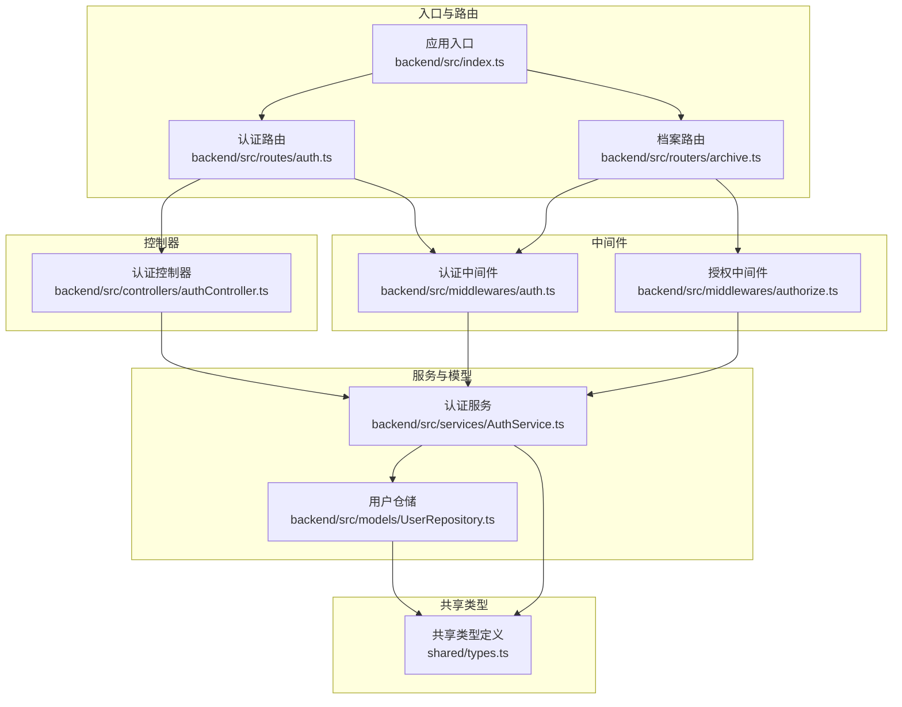
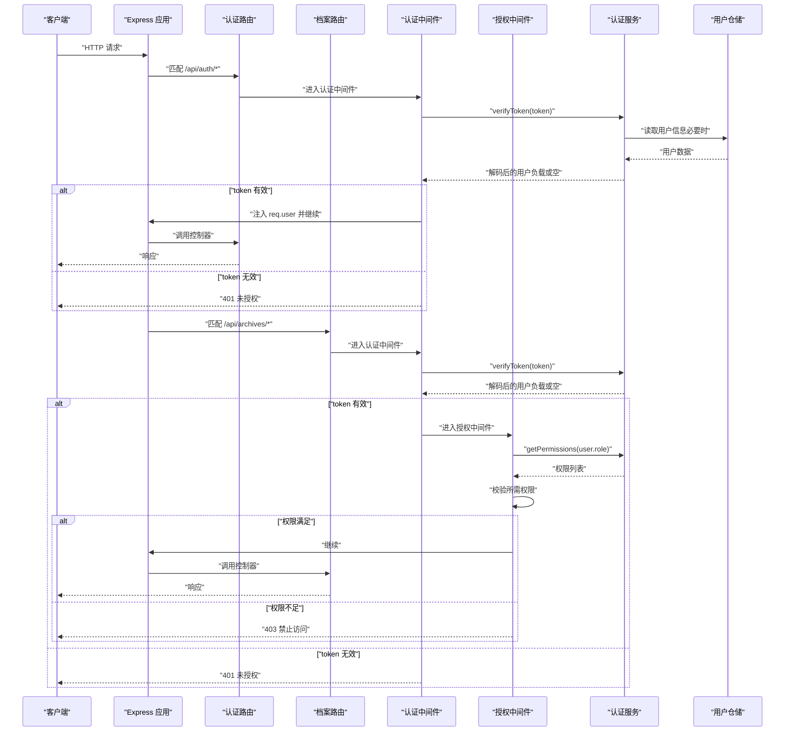
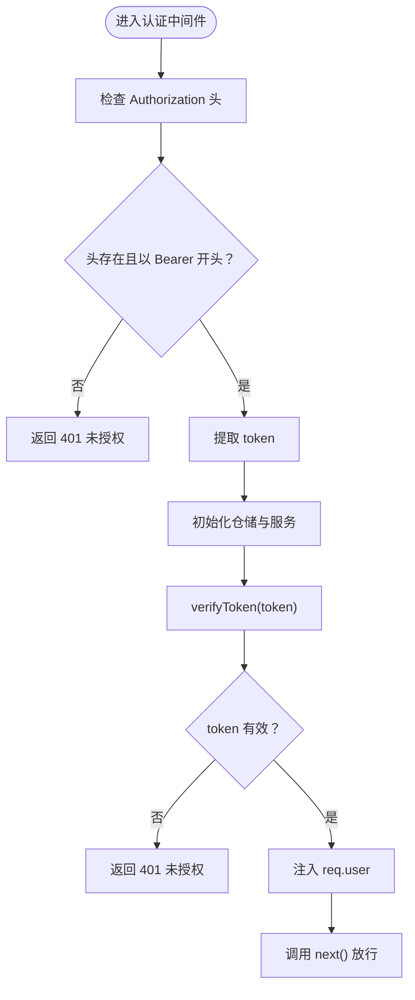
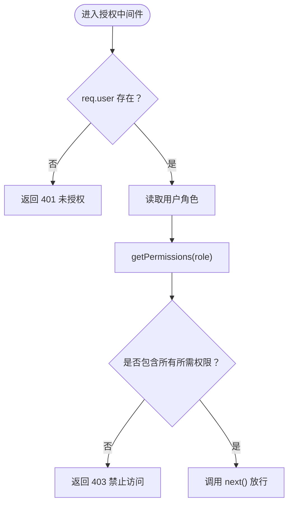
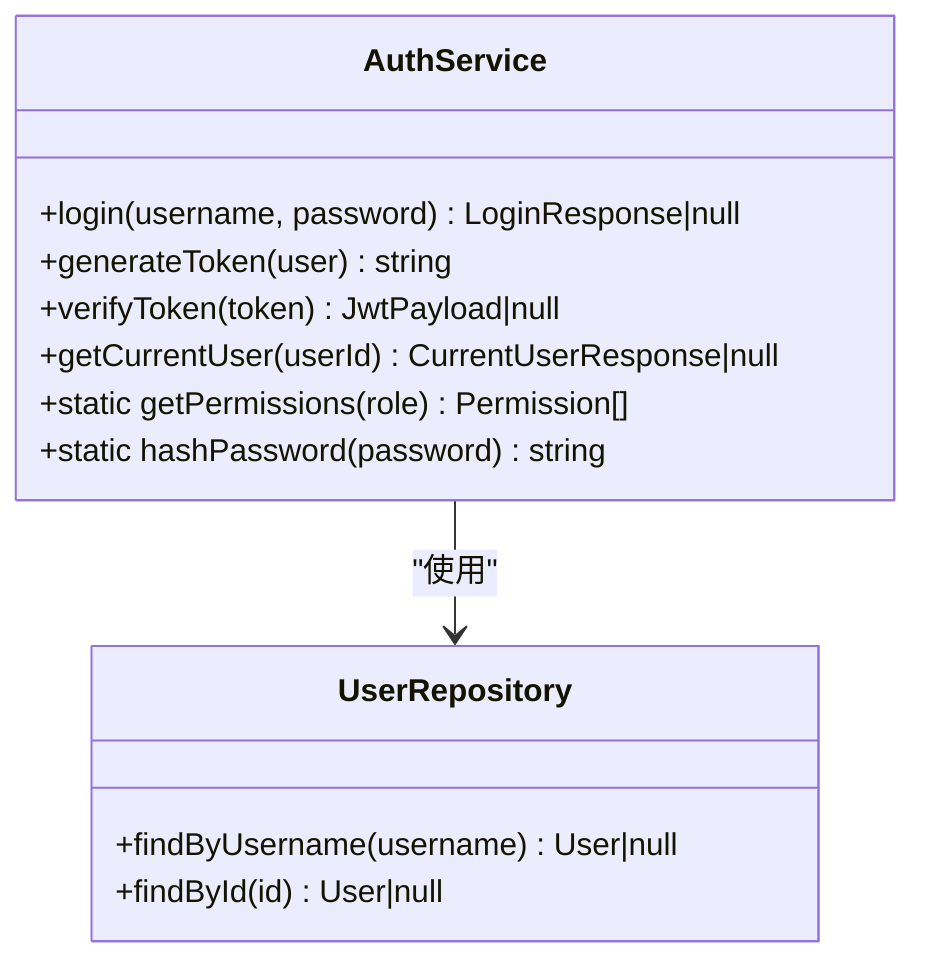
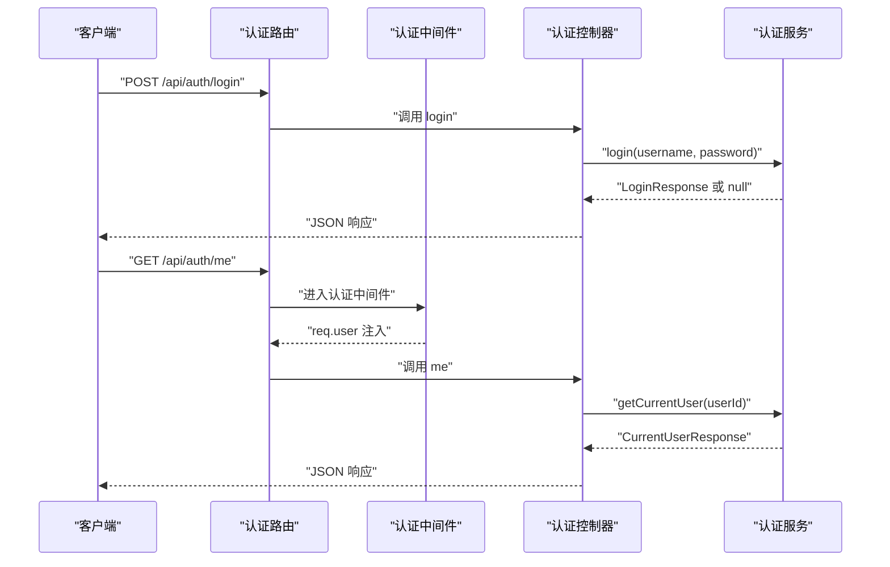
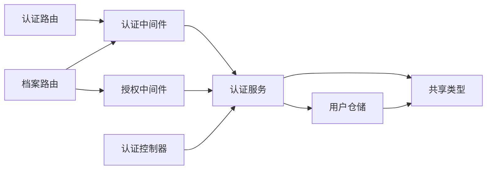

# 中间件系统

<cite>
**本文引用的文件**
- [backend/src/middlewares/auth.ts](file://backend/src/middlewares/auth.ts)
- [backend/src/middlewares/authorize.ts](file://backend/src/middlewares/authorize.ts)
- [backend/src/services/AuthService.ts](file://backend/src/services/AuthService.ts)
- [backend/src/models/UserRepository.ts](file://backend/src/models/UserRepository.ts)
- [backend/src/controllers/authController.ts](file://backend/src/controllers/authController.ts)
- [backend/src/routers/auth.ts](file://backend/src/routes/auth.ts)
- [backend/src/routers/archive.ts](file://backend/src/routers/archive.ts)
- [backend/src/utils/seedUsers.ts](file://backend/src/utils/seedUsers.ts)
- [shared/types.ts](file://shared/types.ts)
- [backend/src/index.ts](file://backend/src/index.ts)
- [backend/tests/unit/auth.test.ts](file://backend/tests/unit/auth.test.ts)
- [backend/tests/unit/authorize.test.ts](file://backend/tests/unit/authorize.test.ts)
- [backend/package.json](file://backend/package.json)
</cite>

## 目录
1. [简介](#简介)
2. [项目结构](#项目结构)
3. [核心组件](#核心组件)
4. [架构总览](#架构总览)
5. [详细组件分析](#详细组件分析)
6. [依赖关系分析](#依赖关系分析)
7. [性能考虑](#性能考虑)
8. [故障排查指南](#故障排查指南)
9. [结论](#结论)
10. [附录](#附录)

## 简介
本文件面向中间件系统，重点阐述以下内容：
- Express 中间件的工作原理与执行顺序：请求拦截、响应处理、错误传播。
- 认证中间件（auth）的 JWT 令牌验证流程：token 提取、解码、验证、用户信息注入。
- 授权中间件（authorize）的角色权限检查机制：角色验证、权限矩阵、访问控制列表。
- 中间件组合使用方法与自定义中间件开发指南。
- 中间件的错误处理策略与性能优化技巧。

## 项目结构
后端采用分层架构，中间件位于中间层，负责在控制器之前对请求进行认证与授权校验，并通过服务层与数据访问层协作完成业务逻辑。

图表来源
- [backend/src/index.ts:1-39](file://backend/src/index.ts#L1-L39)
- [backend/src/routes/auth.ts:1-19](file://backend/src/routes/auth.ts#L1-L19)
- [backend/src/routers/archive.ts:1-42](file://backend/src/routers/archive.ts#L1-L42)
- [backend/src/middlewares/auth.ts:1-56](file://backend/src/middlewares/auth.ts#L1-L56)
- [backend/src/middlewares/authorize.ts:1-47](file://backend/src/middlewares/authorize.ts#L1-L47)
- [backend/src/controllers/authController.ts:1-77](file://backend/src/controllers/authController.ts#L1-L77)
- [backend/src/services/AuthService.ts:1-126](file://backend/src/services/AuthService.ts#L1-L126)
- [backend/src/models/UserRepository.ts:1-56](file://backend/src/models/UserRepository.ts#L1-L56)
- [shared/types.ts:1-289](file://shared/types.ts#L1-L289)

章节来源
- [backend/src/index.ts:1-39](file://backend/src/index.ts#L1-L39)
- [backend/src/routes/auth.ts:1-19](file://backend/src/routes/auth.ts#L1-L19)
- [backend/src/routers/archive.ts:1-42](file://backend/src/routers/archive.ts#L1-L42)

## 核心组件
- 认证中间件（authenticate）
  - 功能：从请求头提取 Bearer Token，调用认证服务验证 JWT，成功则将用户信息注入请求上下文，失败返回 401。
  - 关键点：请求头格式校验、token 解析与验证、错误响应格式统一。
- 授权中间件（authorize）
  - 功能：基于用户角色计算权限集合，校验是否满足全部所需权限，不满足返回 403。
  - 关键点：中间件工厂函数、权限矩阵、与认证中间件的先后顺序要求。
- 认证服务（AuthService）
  - 功能：登录校验、JWT 生成与验证、根据角色获取权限列表、当前用户信息查询。
  - 关键点：JWT 密钥配置、角色-权限映射表、密码哈希工具。
- 用户仓储（UserRepository）
  - 功能：基于 better-sqlite3 提供用户查询能力。
  - 关键点：数据库行到领域对象的映射。
- 控制器（authController）
  - 功能：处理登录与“获取当前用户”请求；“获取当前用户”依赖认证中间件。
  - 关键点：参数校验、错误码与消息统一、调用认证服务获取权限列表。

章节来源
- [backend/src/middlewares/auth.ts:26-55](file://backend/src/middlewares/auth.ts#L26-L55)
- [backend/src/middlewares/authorize.ts:16-46](file://backend/src/middlewares/authorize.ts#L16-L46)
- [backend/src/services/AuthService.ts:32-125](file://backend/src/services/AuthService.ts#L32-L125)
- [backend/src/models/UserRepository.ts:31-55](file://backend/src/models/UserRepository.ts#L31-L55)
- [backend/src/controllers/authController.ts:16-76](file://backend/src/controllers/authController.ts#L16-L76)

## 架构总览
下图展示认证与授权在请求生命周期中的位置与交互：

图表来源
- [backend/src/middlewares/auth.ts:26-55](file://backend/src/middlewares/auth.ts#L26-L55)
- [backend/src/middlewares/authorize.ts:16-46](file://backend/src/middlewares/authorize.ts#L16-L46)
- [backend/src/services/AuthService.ts:85-117](file://backend/src/services/AuthService.ts#L85-L117)
- [backend/src/models/UserRepository.ts:39-54](file://backend/src/models/UserRepository.ts#L39-L54)
- [backend/src/routes/auth.ts:12-16](file://backend/src/routes/auth.ts#L12-L16)
- [backend/src/routers/archive.ts:17-40](file://backend/src/routers/archive.ts#L17-L40)

## 详细组件分析

### 认证中间件（JWT 验证流程）
- 输入输出
  - 输入：HTTP 请求头中的 Authorization: Bearer <token>
  - 输出：成功时在请求上下文中注入用户负载，失败时返回 401
- 执行步骤
  1) 校验请求头是否存在且以 Bearer 开头
  2) 提取 token
  3) 初始化仓储与服务实例
  4) 调用服务验证 token
  5) 若有效，将用户负载写入 req.user 并放行；否则返回 401
- 错误传播
  - 未提供或格式错误的 Authorization 头 → 401
  - token 无效或过期 → 401
- 与控制器的关系
  - 控制器通过 req.user 获取当前用户信息

图表来源
- [backend/src/middlewares/auth.ts:26-55](file://backend/src/middlewares/auth.ts#L26-L55)
- [backend/src/services/AuthService.ts:85-92](file://backend/src/services/AuthService.ts#L85-L92)

章节来源
- [backend/src/middlewares/auth.ts:26-55](file://backend/src/middlewares/auth.ts#L26-L55)
- [backend/src/services/AuthService.ts:85-92](file://backend/src/services/AuthService.ts#L85-L92)

### 授权中间件（角色权限检查）
- 设计要点
  - 中间件工厂：authorize(...) 返回实际中间件函数
  - 依赖认证中间件：从 req.user 获取用户角色
  - 权限矩阵：AuthService.getPermissions(role) 返回角色对应权限集合
  - 校验策略：必须满足所有所需权限（AND）
- 执行步骤
  1) 校验 req.user 是否存在（依赖认证中间件）
  2) 读取用户角色并获取其权限列表
  3) 校验是否包含所有所需权限
  4) 满足则放行，否则返回 403
- 与控制器的关系
  - 在路由层组合使用，如 require('import') 或 require('review')

图表来源
- [backend/src/middlewares/authorize.ts:16-46](file://backend/src/middlewares/authorize.ts#L16-L46)
- [backend/src/services/AuthService.ts:115-117](file://backend/src/services/AuthService.ts#L115-L117)

章节来源
- [backend/src/middlewares/authorize.ts:16-46](file://backend/src/middlewares/authorize.ts#L16-L46)
- [backend/src/services/AuthService.ts:115-117](file://backend/src/services/AuthService.ts#L115-L117)

### 认证服务与权限矩阵
- 角色-权限映射
  - operator：多项业务操作权限
  - branch：查看与确认类权限
  - general_affairs：归档确认权限
- 关键方法
  - login：校验凭据并签发 token
  - generateToken / verifyToken：JWT 生命周期管理
  - getCurrentUser：返回用户及权限列表
  - getPermissions：静态查询权限集合
- 与仓储协作
  - UserRepository 提供用户查询能力，认证服务据此决定权限

图表来源
- [backend/src/services/AuthService.ts:32-125](file://backend/src/services/AuthService.ts#L32-L125)
- [backend/src/models/UserRepository.ts:31-55](file://backend/src/models/UserRepository.ts#L31-L55)

章节来源
- [backend/src/services/AuthService.ts:25-31](file://backend/src/services/AuthService.ts#L25-L31)
- [backend/src/services/AuthService.ts:115-117](file://backend/src/services/AuthService.ts#L115-L117)
- [backend/src/models/UserRepository.ts:39-54](file://backend/src/models/UserRepository.ts#L39-L54)

### 控制器与中间件的协作
- 认证控制器
  - login：接收用户名与密码，调用认证服务登录并返回 token 与用户信息
  - me：在认证中间件注入用户信息后，返回当前用户及权限列表
- 路由注册
  - 认证路由：/api/auth/login（无需认证）、/api/auth/me（需认证）
  - 档案路由：多处组合 authenticate 与 authorize

图表来源
- [backend/src/controllers/authController.ts:16-76](file://backend/src/controllers/authController.ts#L16-L76)
- [backend/src/middlewares/auth.ts:26-55](file://backend/src/middlewares/auth.ts#L26-L55)
- [backend/src/services/AuthService.ts:97-110](file://backend/src/services/AuthService.ts#L97-L110)

章节来源
- [backend/src/controllers/authController.ts:16-76](file://backend/src/controllers/authController.ts#L16-L76)
- [backend/src/routes/auth.ts:12-16](file://backend/src/routes/auth.ts#L12-L16)

### 自定义中间件开发指南
- 设计原则
  - 明确职责：单一职责，避免在中间件中编写业务逻辑
  - 保持幂等：中间件应尽量无副作用
  - 统一错误：使用一致的错误码与消息结构
- 开发步骤
  1) 定义中间件函数签名：(req, res, next) => void
  2) 在函数内进行前置校验（如鉴权、参数校验）
  3) 成功时调用 next()，失败时 res.status(...).json(...)
  4) 在路由中按顺序注册中间件
- 示例路径
  - 参考现有中间件实现与路由组合方式

章节来源
- [backend/src/middlewares/auth.ts:26-55](file://backend/src/middlewares/auth.ts#L26-L55)
- [backend/src/middlewares/authorize.ts:16-46](file://backend/src/middlewares/authorize.ts#L16-L46)
- [backend/src/routers/archive.ts:17-40](file://backend/src/routers/archive.ts#L17-L40)

## 依赖关系分析
- 组件耦合
  - 中间件依赖认证服务；认证服务依赖用户仓储
  - 控制器依赖认证服务；路由依赖中间件
- 外部依赖
  - jsonwebtoken：JWT 生成与验证
  - bcryptjs：密码哈希
  - better-sqlite3：本地数据库
  - uuid：生成用户 ID
- 版本与脚本
  - 详见后端包管理文件

图表来源
- [backend/src/middlewares/auth.ts:6-9](file://backend/src/middlewares/auth.ts#L6-L9)
- [backend/src/middlewares/authorize.ts:6-8](file://backend/src/middlewares/authorize.ts#L6-L8)
- [backend/src/services/AuthService.ts:8-9](file://backend/src/services/AuthService.ts#L8-L9)
- [backend/src/models/UserRepository.ts:6-7](file://backend/src/models/UserRepository.ts#L6-L7)
- [backend/src/controllers/authController.ts:7-10](file://backend/src/controllers/authController.ts#L7-L10)
- [backend/src/routes/auth.ts:7-8](file://backend/src/routes/auth.ts#L7-L8)
- [backend/src/routers/archive.ts:8-9](file://backend/src/routers/archive.ts#L8-L9)

章节来源
- [backend/package.json:14-22](file://backend/package.json#L14-L22)

## 性能考虑
- 中间件链路短而清晰：仅在必要时进行数据库查询（例如获取当前用户信息）
- JWT 验证为纯内存计算，成本低；建议合理设置过期时间
- 避免在中间件中重复初始化服务实例；可考虑在应用启动时注入或缓存
- 对于频繁访问的接口，可在网关或反向代理层做缓存与限流
- 日志与监控：在中间件中埋点统计耗时与错误率，便于定位瓶颈

## 故障排查指南
- 常见问题与定位
  - 401 未授权：检查 Authorization 头格式是否为 Bearer <token>，token 是否过期或无效
  - 403 禁止访问：检查用户角色与所需权限是否匹配；确认权限矩阵配置
  - 404 用户不存在：确认用户 ID 是否正确；检查数据库种子数据
- 单元测试参考
  - 认证服务与控制器行为可通过单元测试覆盖，包括登录、token 校验、权限查询等
  - 授权中间件测试覆盖了多种权限组合与边界条件

章节来源
- [backend/tests/unit/auth.test.ts:47-95](file://backend/tests/unit/auth.test.ts#L47-L95)
- [backend/tests/unit/auth.test.ts:97-133](file://backend/tests/unit/auth.test.ts#L97-L133)
- [backend/tests/unit/authorize.test.ts:35-101](file://backend/tests/unit/authorize.test.ts#L35-L101)
- [backend/tests/unit/authorize.test.ts:103-146](file://backend/tests/unit/authorize.test.ts#L103-L146)

## 结论
本中间件系统通过“认证 + 授权”的双层中间件，结合服务层与仓储层，实现了清晰的请求拦截与访问控制。认证中间件负责 JWT 校验与用户注入，授权中间件基于角色权限矩阵进行细粒度控制。配合路由层的中间件组合与统一错误响应，整体具备良好的可维护性与扩展性。

## 附录
- 种子用户
  - 提供三个角色的示例用户，便于快速测试
- 共享类型
  - 定义了角色、权限、请求/响应接口等，确保前后端一致性

章节来源
- [backend/src/utils/seedUsers.ts:11-19](file://backend/src/utils/seedUsers.ts#L11-L19)
- [shared/types.ts:8-102](file://shared/types.ts#L8-L102)