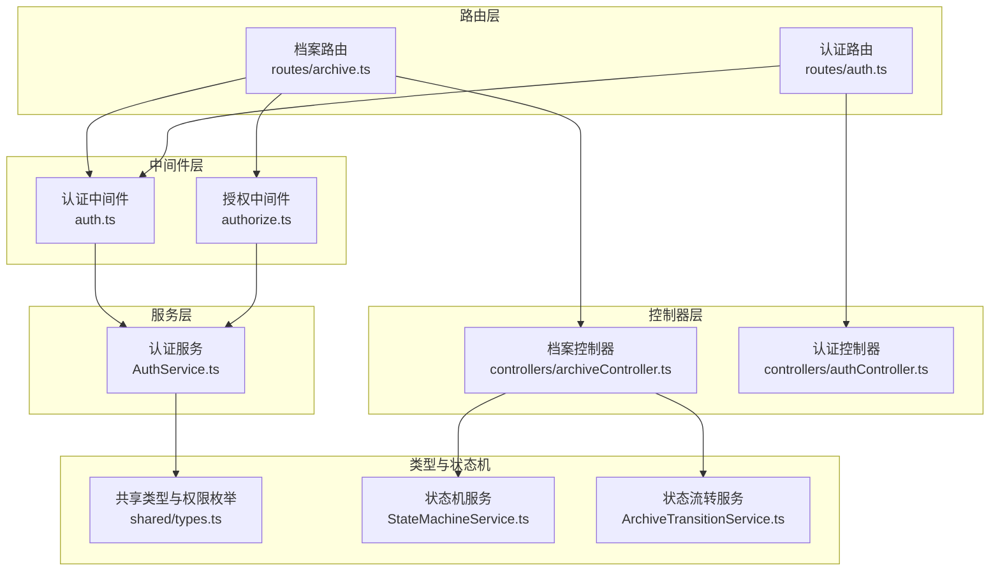
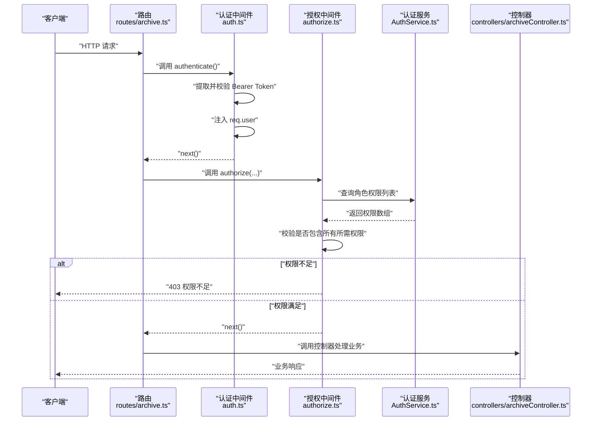
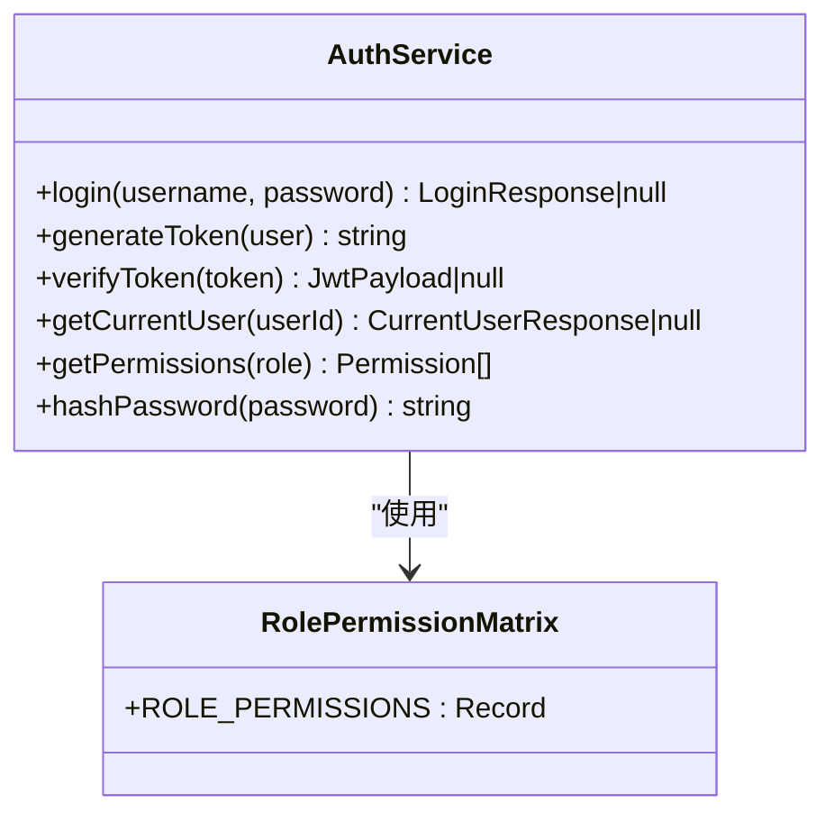
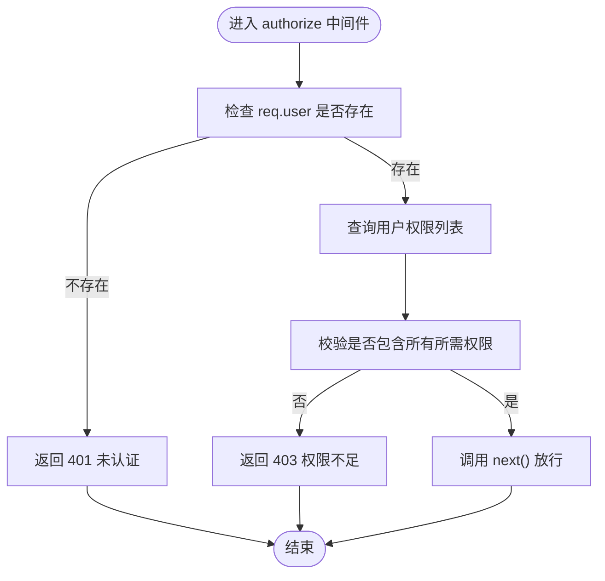
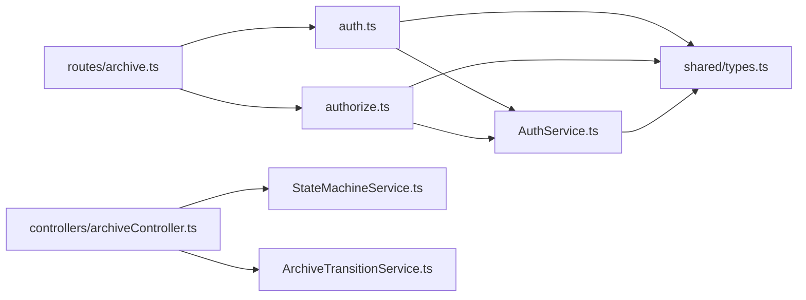

# 授权中间件

<cite>
**本文引用的文件**
- [authorize.ts](file://backend/src/middlewares/authorize.ts)
- [auth.ts](file://backend/src/middlewares/auth.ts)
- [AuthService.ts](file://backend/src/services/AuthService.ts)
- [types.ts](file://shared/types.ts)
- [archive.ts](file://backend/src/routes/archive.ts)
- [auth.ts](file://backend/src/routes/auth.ts)
- [archiveController.ts](file://backend/src/controllers/archiveController.ts)
- [authController.ts](file://backend/src/controllers/authController.ts)
- [StateMachineService.ts](file://backend/src/services/StateMachineService.ts)
- [ArchiveTransitionService.ts](file://backend/src/services/ArchiveTransitionService.ts)
- [authorize.test.ts](file://backend/tests/unit/authorize.test.ts)
- [auth.test.ts](file://backend/tests/unit/auth.test.ts)
- [seedUsers.ts](file://backend/src/utils/seedUsers.ts)
</cite>

## 目录
1. [简介](#简介)
2. [项目结构](#项目结构)
3. [核心组件](#核心组件)
4. [架构总览](#架构总览)
5. [详细组件分析](#详细组件分析)
6. [依赖分析](#依赖分析)
7. [性能考量](#性能考量)
8. [故障排查指南](#故障排查指南)
9. [结论](#结论)
10. [附录](#附录)

## 简介
本文件围绕授权中间件展开，系统性阐述基于角色的访问控制（RBAC）机制与实现细节，覆盖角色权限矩阵设计、authorize 中间件的权限验证流程（角色检查、权限匹配与访问控制决策）、角色常量与权限映射关系、路由级权限控制用法与最佳实践、授权失败的错误处理与安全注意事项，并提供权限管理扩展与自定义权限验证的实现指南。

## 项目结构
授权相关的代码主要分布在以下模块：
- 中间件层：认证中间件负责提取与验证 JWT 并注入用户信息；授权中间件负责基于角色的权限校验。
- 服务层：认证服务提供登录、签发与校验 JWT、角色到权限的映射等能力。
- 路由层：在路由注册处串联认证与授权中间件，实现细粒度的权限控制。
- 控制器层：在控制器内也保留必要的二次校验与错误处理，确保安全边界。
- 类型层：统一定义用户角色、权限、状态等枚举与接口，保证前后端一致。

图表来源
- [auth.ts:26-55](file://backend/src/middlewares/auth.ts#L26-L55)
- [authorize.ts:16-45](file://backend/src/middlewares/authorize.ts#L16-L45)
- [AuthService.ts:32-125](file://backend/src/services/AuthService.ts#L32-L125)
- [archive.ts:8-41](file://backend/src/routes/archive.ts#L8-L41)
- [auth.ts:6-18](file://backend/src/routes/auth.ts#L6-L18)
- [archiveController.ts:99-147](file://backend/src/controllers/archiveController.ts#L99-L147)
- [authController.ts:16-76](file://backend/src/controllers/authController.ts#L16-L76)
- [StateMachineService.ts:96-142](file://backend/src/services/StateMachineService.ts#L96-L142)
- [ArchiveTransitionService.ts:46-125](file://backend/src/services/ArchiveTransitionService.ts#L46-L125)
- [types.ts:87-102](file://shared/types.ts#L87-L102)

章节来源
- [auth.ts:26-55](file://backend/src/middlewares/auth.ts#L26-L55)
- [authorize.ts:16-45](file://backend/src/middlewares/authorize.ts#L16-L45)
- [AuthService.ts:32-125](file://backend/src/services/AuthService.ts#L32-L125)
- [archive.ts:8-41](file://backend/src/routes/archive.ts#L8-L41)
- [auth.ts:6-18](file://backend/src/routes/auth.ts#L6-L18)
- [archiveController.ts:99-147](file://backend/src/controllers/archiveController.ts#L99-L147)
- [authController.ts:16-76](file://backend/src/controllers/authController.ts#L16-L76)
- [StateMachineService.ts:96-142](file://backend/src/services/StateMachineService.ts#L96-L142)
- [ArchiveTransitionService.ts:46-125](file://backend/src/services/ArchiveTransitionService.ts#L46-L125)
- [types.ts:87-102](file://shared/types.ts#L87-L102)

## 核心组件
- 认证中间件：从请求头提取 Bearer Token，校验有效性，将用户信息注入 req.user。
- 授权中间件：在认证通过后，基于用户角色查询权限列表，校验是否具备全部所需权限，否则返回 403。
- 认证服务：提供登录、签发/校验 JWT、角色到权限映射、当前用户信息（含权限列表）查询。
- 路由与控制器：在路由注册处串联中间件，在控制器内补充业务级校验与错误处理。
- 共享类型：统一定义用户角色、权限枚举与接口，保障一致性。

章节来源
- [auth.ts:26-55](file://backend/src/middlewares/auth.ts#L26-L55)
- [authorize.ts:16-45](file://backend/src/middlewares/authorize.ts#L16-L45)
- [AuthService.ts:32-125](file://backend/src/services/AuthService.ts#L32-L125)
- [archive.ts:8-41](file://backend/src/routes/archive.ts#L8-L41)
- [archiveController.ts:99-147](file://backend/src/controllers/archiveController.ts#L99-L147)
- [types.ts:87-102](file://shared/types.ts#L87-L102)

## 架构总览
授权流程分为两阶段：
- 认证阶段：校验 JWT 有效性，注入用户身份信息。
- 授权阶段：根据用户角色查询权限集合，逐一比对所需权限，满足则放行，否则拒绝。

图表来源
- [archive.ts:8-41](file://backend/src/routes/archive.ts#L8-L41)
- [auth.ts:26-55](file://backend/src/middlewares/auth.ts#L26-L55)
- [authorize.ts:16-45](file://backend/src/middlewares/authorize.ts#L16-L45)
- [AuthService.ts:115-117](file://backend/src/services/AuthService.ts#L115-L117)
- [archiveController.ts:99-147](file://backend/src/controllers/archiveController.ts#L99-L147)

## 详细组件分析

### RBAC 角色与权限矩阵
- 角色枚举：operator（运营）、branch（分支机构）、general_affairs（综合部）。
- 权限枚举：import、search、review、return_branch、confirm_received、review_reject、confirm_shipped_back、transfer_general、upload_scan、ocr、view_own_archives、confirm_shipment、confirm_return_received、confirm_archive。
- 角色到权限映射：通过静态映射表集中维护，便于扩展与审计。

图表来源
- [AuthService.ts:25-30](file://backend/src/services/AuthService.ts#L25-L30)
- [AuthService.ts:115-117](file://backend/src/services/AuthService.ts#L115-L117)
- [types.ts:87-102](file://shared/types.ts#L87-L102)

章节来源
- [AuthService.ts:25-30](file://backend/src/services/AuthService.ts#L25-L30)
- [AuthService.ts:115-117](file://backend/src/services/AuthService.ts#L115-L117)
- [types.ts:87-102](file://shared/types.ts#L87-L102)

### 授权中间件 authorize 流程
- 输入：所需权限列表（权限枚举的变长参数）。
- 步骤：
  1) 校验 req.user 是否存在（依赖认证中间件前置）。
  2) 通过 AuthService.getPermissions 获取用户权限集合。
  3) 使用 every 确保用户权限包含所有所需权限。
  4) 若不满足，返回 403；满足则放行。
- 特殊情况：若未传入任何权限参数，则视为“仅需认证”，直接放行。

图表来源
- [authorize.ts:16-45](file://backend/src/middlewares/authorize.ts#L16-L45)
- [AuthService.ts:115-117](file://backend/src/services/AuthService.ts#L115-L117)

章节来源
- [authorize.ts:16-45](file://backend/src/middlewares/authorize.ts#L16-L45)
- [authorize.test.ts:35-146](file://backend/tests/unit/authorize.test.ts#L35-L146)

### 路由级权限控制用法与最佳实践
- 在路由注册处串联 authenticate 与 authorize 中间件，实现“先认证再授权”。
- 常见模式：
  - 需要认证且具备 import 权限时：authenticate, authorize('import')
  - 需要 review 权限时：authenticate, authorize('review')
  - 仅需认证：authenticate
- 最佳实践：
  - 将权限需求显式声明在路由层，避免在控制器内重复校验。
  - 对于复杂业务（如状态流转），在控制器内仍保留必要的二次校验与错误处理。
  - 对于分支用户的数据访问，可在服务层结合用户所属机构进行过滤。

章节来源
- [archive.ts:17-41](file://backend/src/routes/archive.ts#L17-L41)
- [archiveController.ts:99-147](file://backend/src/controllers/archiveController.ts#L99-L147)

### 授权失败的错误处理与安全考虑
- 401 未认证：当请求头缺失或无效时返回。
- 403 权限不足：当用户不具备所需权限时返回。
- 安全建议：
  - 严格要求 authenticate 在 authorize 之前执行。
  - JWT 密钥应来自环境变量，避免硬编码。
  - 对关键操作（如创建、编辑、状态流转）在控制器内补充业务规则校验。
  - 对外暴露的路由尽量最小化权限，遵循“最小权限原则”。

章节来源
- [authorize.ts:20-42](file://backend/src/middlewares/authorize.ts#L20-L42)
- [auth.ts:29-50](file://backend/src/middlewares/auth.ts#L29-L50)
- [authController.ts:50-76](file://backend/src/controllers/authController.ts#L50-L76)
- [AuthService.ts:11-15](file://backend/src/services/AuthService.ts#L11-L15)

### 权限管理扩展与自定义权限验证
- 新增权限：在共享类型 Permission 枚举中添加新值，并在 AuthService 的角色映射表中赋予相应角色。
- 新增角色：在共享类型 UserRole 中添加新角色，并在映射表中配置其权限集合。
- 自定义权限验证：
  - 可在 authorize 中间件基础上扩展为“任一权限满足”策略。
  - 可引入动态权限源（如数据库存储），在 AuthService 中扩展查询逻辑。
  - 可结合业务上下文（如机构、数据范围）进行更细粒度的访问控制。

章节来源
- [types.ts:87-102](file://shared/types.ts#L87-L102)
- [AuthService.ts:25-30](file://backend/src/services/AuthService.ts#L25-L30)
- [authorize.ts:16-45](file://backend/src/middlewares/authorize.ts#L16-L45)

## 依赖分析
- authorize 依赖 AuthService 进行权限查询。
- 认证中间件依赖 AuthService 进行 JWT 校验并将用户信息注入请求对象。
- 路由层依赖中间件与控制器，控制器依赖状态机与仓储进行业务处理。
- 共享类型为前后端一致性的基础。

图表来源
- [auth.ts:26-55](file://backend/src/middlewares/auth.ts#L26-L55)
- [authorize.ts:16-45](file://backend/src/middlewares/authorize.ts#L16-L45)
- [AuthService.ts:32-125](file://backend/src/services/AuthService.ts#L32-L125)
- [archive.ts:8-41](file://backend/src/routes/archive.ts#L8-L41)
- [archiveController.ts:99-147](file://backend/src/controllers/archiveController.ts#L99-L147)
- [StateMachineService.ts:96-142](file://backend/src/services/StateMachineService.ts#L96-L142)
- [ArchiveTransitionService.ts:46-125](file://backend/src/services/ArchiveTransitionService.ts#L46-L125)
- [types.ts:87-102](file://shared/types.ts#L87-L102)

章节来源
- [auth.ts:26-55](file://backend/src/middlewares/auth.ts#L26-L55)
- [authorize.ts:16-45](file://backend/src/middlewares/authorize.ts#L16-L45)
- [AuthService.ts:32-125](file://backend/src/services/AuthService.ts#L32-L125)
- [archive.ts:8-41](file://backend/src/routes/archive.ts#L8-L41)
- [archiveController.ts:99-147](file://backend/src/controllers/archiveController.ts#L99-L147)
- [StateMachineService.ts:96-142](file://backend/src/services/StateMachineService.ts#L96-L142)
- [ArchiveTransitionService.ts:46-125](file://backend/src/services/ArchiveTransitionService.ts#L46-L125)
- [types.ts:87-102](file://shared/types.ts#L87-L102)

## 性能考量
- 权限查询为内存查找，复杂度 O(k)，k 为角色权限数量，通常很小，开销可忽略。
- JWT 校验为本地验证，成本较低；建议合理设置过期时间以平衡安全性与性能。
- 对于高并发场景，建议在网关或入口层缓存用户权限清单，减少重复计算。

## 故障排查指南
- 401 未认证：
  - 检查请求头 Authorization 是否为 Bearer Token。
  - 检查 JWT 是否过期或签名无效。
  - 确认 authenticate 中间件已在 authorize 之前执行。
- 403 权限不足：
  - 确认用户角色是否正确。
  - 确认所需权限是否在角色映射表中。
  - 检查 authorize(...requiredPermissions) 传参是否正确。
- 控制器内二次校验：
  - 对于分支用户的数据访问，确认服务层是否按机构过滤。
  - 对于状态流转，确认状态机与控制器的业务规则是否一致。

章节来源
- [authorize.test.ts:58-101](file://backend/tests/unit/authorize.test.ts#L58-L101)
- [auth.test.ts:112-135](file://backend/tests/unit/auth.test.ts#L112-L135)
- [archiveController.ts:99-147](file://backend/src/controllers/archiveController.ts#L99-L147)
- [StateMachineService.ts:106-142](file://backend/src/services/StateMachineService.ts#L106-L142)

## 结论
本授权体系采用“认证 + 授权”的双层防护，通过集中式的角色到权限映射与中间件化的权限校验，实现了清晰、可扩展、可测试的访问控制。配合路由级权限声明与控制器内的业务校验，既保证了安全边界，又兼顾了灵活性与可维护性。建议在生产环境中强化密钥管理、完善日志审计，并持续评估权限矩阵的合理性与完整性。

## 附录

### 角色与权限对照表
- 运营（operator）：拥有导入、查询、审核、退回、确认接收、确认退回、转交综合部、上传扫描件、OCR、确认入库等权限。
- 分支机构（branch）：拥有查看自身档案、确认寄出、确认回寄等权限。
- 综合部（general_affairs）：仅拥有确认入库权限。

章节来源
- [AuthService.ts:25-30](file://backend/src/services/AuthService.ts#L25-L30)
- [auth.test.ts:112-127](file://backend/tests/unit/auth.test.ts#L112-L127)

### 示例：在路由中应用授权中间件
- 需要导入权限：authenticate, authorize('import')
- 需要审核权限：authenticate, authorize('review')
- 仅需认证：authenticate

章节来源
- [archive.ts:20-39](file://backend/src/routes/archive.ts#L20-L39)

### 示例：用户初始化与角色分配
- 提供示例用户：operator、branch（带机构）、general_affairs。
- 初始化脚本会插入用户并生成密码哈希。

章节来源
- [seedUsers.ts:5-19](file://backend/src/utils/seedUsers.ts#L5-L19)