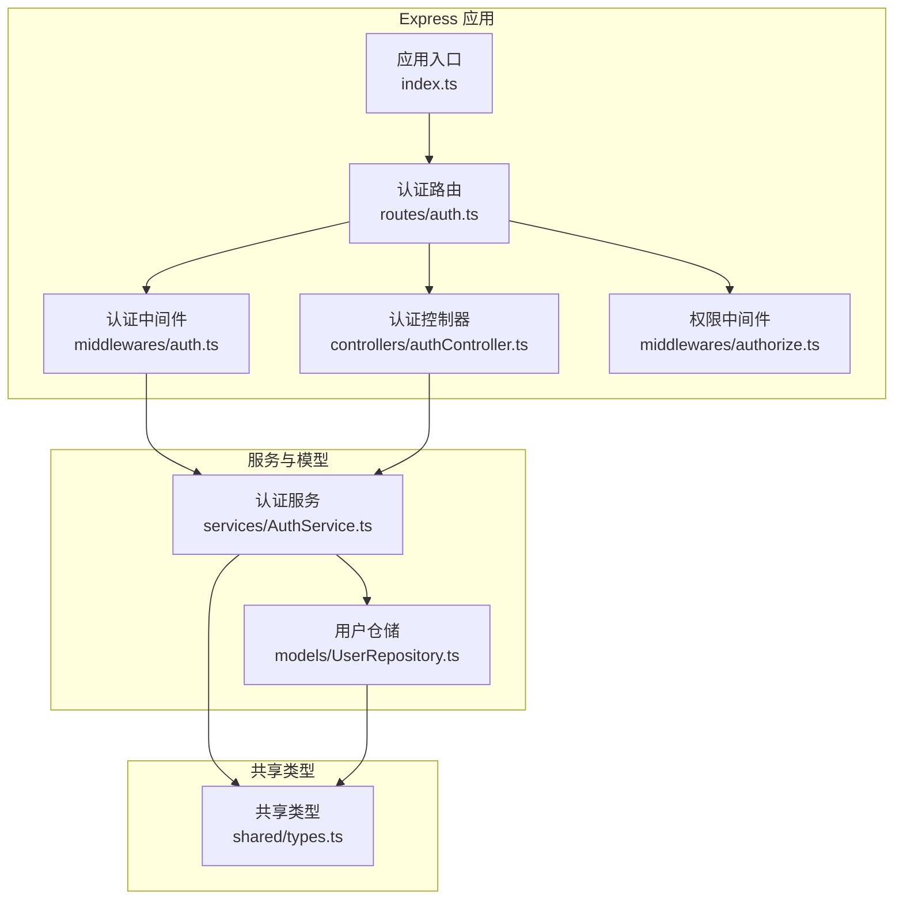
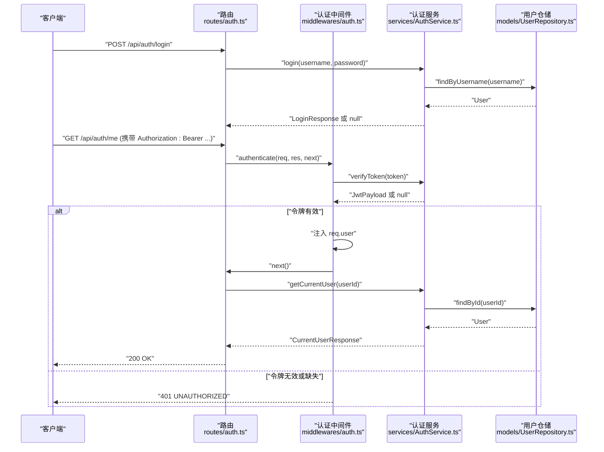
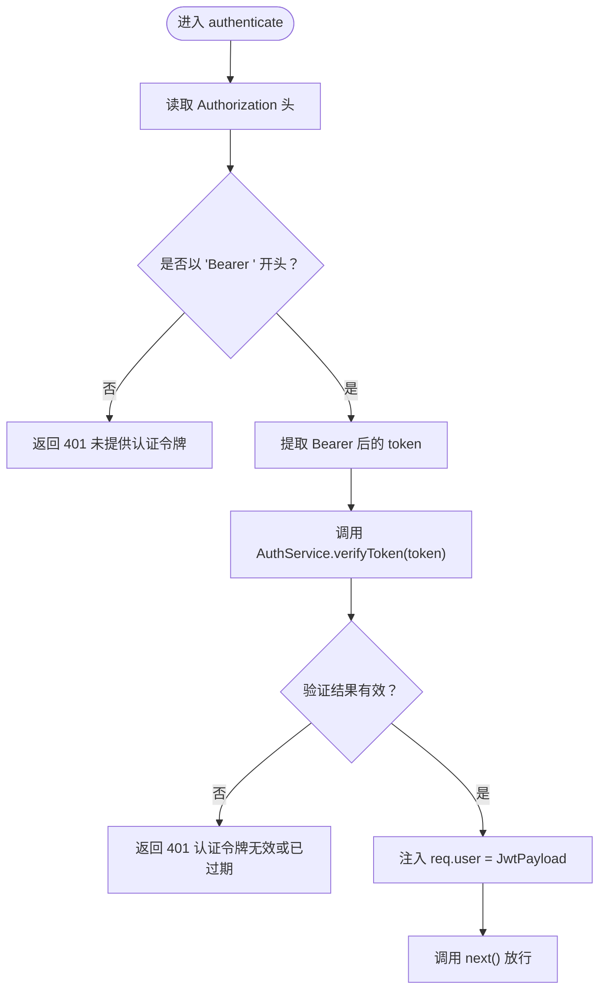
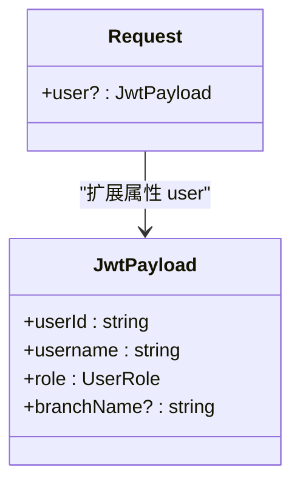
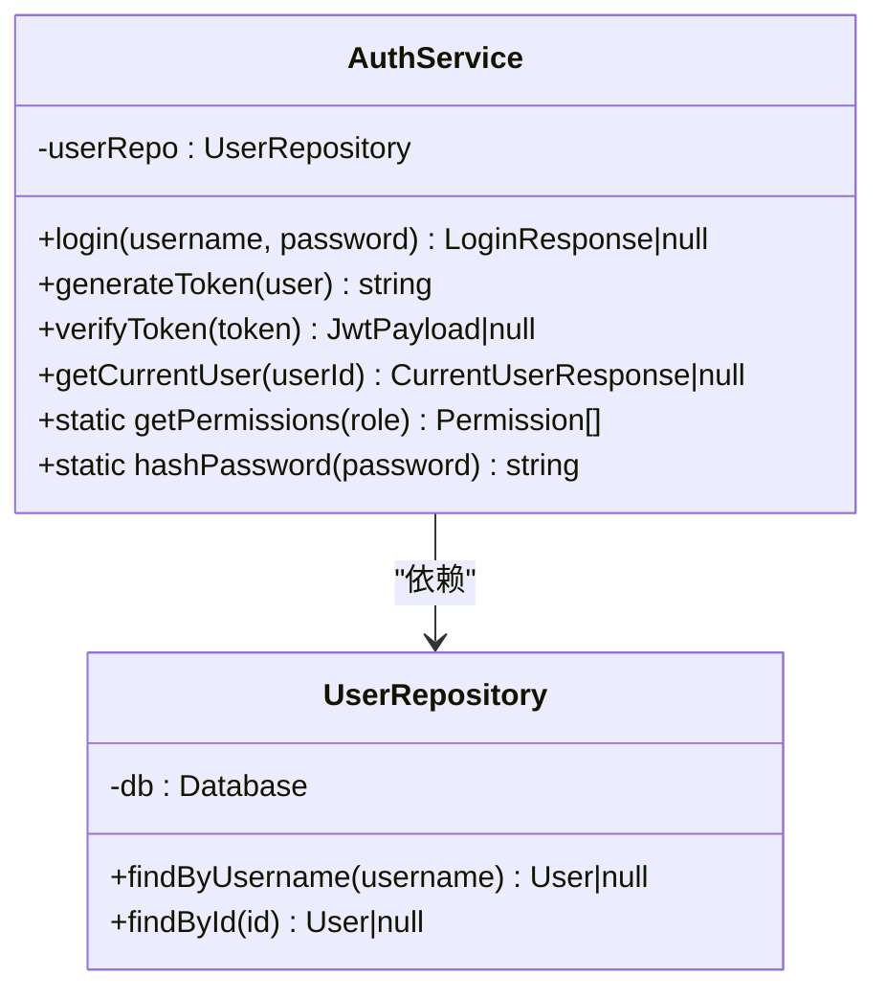
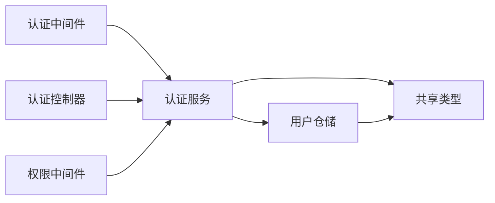

# 认证中间件

<cite>
**本文引用的文件**
- [backend/src/middlewares/auth.ts](file://backend/src/middlewares/auth.ts)
- [backend/src/services/AuthService.ts](file://backend/src/services/AuthService.ts)
- [backend/src/models/UserRepository.ts](file://backend/src/models/UserRepository.ts)
- [backend/src/controllers/authController.ts](file://backend/src/controllers/authController.ts)
- [backend/src/routes/auth.ts](file://backend/src/routes/auth.ts)
- [backend/src/index.ts](file://backend/src/index.ts)
- [backend/src/middlewares/authorize.ts](file://backend/src/middlewares/authorize.ts)
- [shared/types.ts](file://shared/types.ts)
- [backend/package.json](file://backend/package.json)
- [backend/tests/unit/auth.test.ts](file://backend/tests/unit/auth.test.ts)
</cite>

## 目录
1. [简介](#简介)
2. [项目结构](#项目结构)
3. [核心组件](#核心组件)
4. [架构总览](#架构总览)
5. [详细组件分析](#详细组件分析)
6. [依赖关系分析](#依赖关系分析)
7. [性能考虑](#性能考虑)
8. [故障排查指南](#故障排查指南)
9. [结论](#结论)
10. [附录](#附录)

## 简介
本文件面向“认证中间件”的技术文档，围绕基于 JWT 的令牌认证流程展开，系统性阐述以下内容：
- Authorization 请求头解析与 Bearer 令牌提取
- 令牌验证机制与有效期检查
- 用户信息注入到请求上下文的过程
- authenticate 函数的实现原理与错误处理
- 全局类型扩展机制（通过 Request 接口扩展用户信息）
- 在 Express 应用中的注册与使用示例，以及与权限中间件的组合使用
- 常见认证错误场景与调试技巧

## 项目结构
认证相关代码主要分布在以下模块：
- 中间件层：认证中间件与权限中间件
- 控制器层：认证相关路由处理
- 服务层：认证服务（登录、签发与校验 JWT、权限映射）
- 数据访问层：用户仓储（SQLite）
- 路由层：认证路由注册
- 共享类型：统一的用户、角色、权限等类型定义

图表来源
- [backend/src/index.ts:1-39](file://backend/src/index.ts#L1-L39)
- [backend/src/routes/auth.ts:1-19](file://backend/src/routes/auth.ts#L1-L19)
- [backend/src/controllers/authController.ts:1-77](file://backend/src/controllers/authController.ts#L1-L77)
- [backend/src/middlewares/auth.ts:1-56](file://backend/src/middlewares/auth.ts#L1-L56)
- [backend/src/middlewares/authorize.ts:1-47](file://backend/src/middlewares/authorize.ts#L1-L47)
- [backend/src/services/AuthService.ts:1-126](file://backend/src/services/AuthService.ts#L1-L126)
- [backend/src/models/UserRepository.ts:1-56](file://backend/src/models/UserRepository.ts#L1-L56)
- [shared/types.ts:1-289](file://shared/types.ts#L1-L289)

章节来源
- [backend/src/index.ts:1-39](file://backend/src/index.ts#L1-L39)
- [backend/src/routes/auth.ts:1-19](file://backend/src/routes/auth.ts#L1-L19)

## 核心组件
- 认证中间件 authenticate：负责从 Authorization 请求头提取 Bearer 令牌，调用认证服务验证令牌，失败时返回 401；成功则将用户信息注入 req.user 并放行
- 认证服务 AuthService：封装登录、JWT 签发与校验、当前用户信息查询、角色到权限映射
- 用户仓储 UserRepository：提供基于 better-sqlite3 的用户查询能力
- 认证控制器 authController：处理登录与获取当前用户信息的请求
- 权限中间件 authorize：在 authenticate 之后校验用户是否具备所需权限
- 共享类型 shared/types：统一定义用户、角色、权限、登录/当前用户响应等类型

章节来源
- [backend/src/middlewares/auth.ts:21-56](file://backend/src/middlewares/auth.ts#L21-L56)
- [backend/src/services/AuthService.ts:32-126](file://backend/src/services/AuthService.ts#L32-L126)
- [backend/src/models/UserRepository.ts:31-56](file://backend/src/models/UserRepository.ts#L31-L56)
- [backend/src/controllers/authController.ts:16-77](file://backend/src/controllers/authController.ts#L16-L77)
- [backend/src/middlewares/authorize.ts:16-47](file://backend/src/middlewares/authorize.ts#L16-L47)
- [shared/types.ts:75-130](file://shared/types.ts#L75-L130)

## 架构总览
下图展示了认证流程在 Express 应用中的整体交互：

图表来源
- [backend/src/routes/auth.ts:12-16](file://backend/src/routes/auth.ts#L12-L16)
- [backend/src/middlewares/auth.ts:26-55](file://backend/src/middlewares/auth.ts#L26-L55)
- [backend/src/services/AuthService.ts:43-92](file://backend/src/services/AuthService.ts#L43-L92)
- [backend/src/models/UserRepository.ts:39-54](file://backend/src/models/UserRepository.ts#L39-L54)
- [backend/src/controllers/authController.ts:50-76](file://backend/src/controllers/authController.ts#L50-L76)

## 详细组件分析

### 认证中间件 authenticate 实现原理
- 请求头验证：读取 Authorization 头，要求以 "Bearer " 开头，否则直接返回 401
- 令牌提取：截取 "Bearer " 后的部分作为 token
- 令牌验证：通过认证服务 AuthService.verifyToken 校验 token，失败返回 401
- 用户信息注入：校验通过后将解码后的 JwtPayload 写入 req.user
- 放行：调用 next() 继续后续中间件/控制器逻辑

图表来源
- [backend/src/middlewares/auth.ts:26-55](file://backend/src/middlewares/auth.ts#L26-L55)
- [backend/src/services/AuthService.ts:85-92](file://backend/src/services/AuthService.ts#L85-L92)

章节来源
- [backend/src/middlewares/auth.ts:26-55](file://backend/src/middlewares/auth.ts#L26-L55)

### 全局类型扩展机制
- 通过在全局命名空间中扩展 Express.Request 接口，新增可选属性 user，类型为 JwtPayload
- 该扩展使得后续中间件（如认证中间件）可以安全地向 req.user 注入用户信息，并在控制器中直接使用

图表来源
- [backend/src/middlewares/auth.ts:11-19](file://backend/src/middlewares/auth.ts#L11-L19)
- [backend/src/services/AuthService.ts:18-23](file://backend/src/services/AuthService.ts#L18-L23)
- [shared/types.ts:8-9](file://shared/types.ts#L8-L9)

章节来源
- [backend/src/middlewares/auth.ts:11-19](file://backend/src/middlewares/auth.ts#L11-L19)

### 认证服务 AuthService
- 登录流程：根据用户名查询用户，比对密码哈希，成功则生成 JWT 返回 token 与用户信息
- JWT 生成：使用密钥与过期时间签发 token
- JWT 校验：使用相同密钥验证 token，异常时返回 null
- 当前用户：根据 userId 查询用户并附加权限列表
- 权限映射：根据角色返回对应的权限数组

图表来源
- [backend/src/services/AuthService.ts:32-126](file://backend/src/services/AuthService.ts#L32-L126)
- [backend/src/models/UserRepository.ts:31-56](file://backend/src/models/UserRepository.ts#L31-L56)

章节来源
- [backend/src/services/AuthService.ts:32-126](file://backend/src/services/AuthService.ts#L32-L126)
- [backend/src/models/UserRepository.ts:31-56](file://backend/src/models/UserRepository.ts#L31-L56)

### 认证控制器 authController
- 登录接口：接收用户名与密码，调用认证服务登录，返回 token 与用户信息，失败返回 401
- 获取当前用户接口：依赖认证中间件，从 req.user 中读取 userId，查询当前用户并返回，包含权限列表

章节来源
- [backend/src/controllers/authController.ts:16-77](file://backend/src/controllers/authController.ts#L16-L77)

### 权限中间件 authorize
- 作用：在 authenticate 之后校验用户是否具备所需权限
- 实现：读取 req.user 的角色，查得对应权限列表，判断是否包含所有必需权限，否则返回 403

章节来源
- [backend/src/middlewares/authorize.ts:16-47](file://backend/src/middlewares/authorize.ts#L16-L47)

### 路由与应用注册
- 路由：认证路由包含登录与获取当前用户两个端点，其中获取当前用户需要前置认证中间件
- 应用：Express 应用初始化后注册认证路由，并提供健康检查端点

章节来源
- [backend/src/routes/auth.ts:12-16](file://backend/src/routes/auth.ts#L12-L16)
- [backend/src/index.ts:20-36](file://backend/src/index.ts#L20-L36)

## 依赖关系分析
- 认证中间件依赖认证服务进行令牌校验
- 认证服务依赖用户仓储进行用户查询
- 控制器依赖认证服务进行登录与当前用户查询
- 权限中间件依赖认证服务进行权限映射
- 共享类型贯穿服务与控制器，确保前后端一致

图表来源
- [backend/src/middlewares/auth.ts:6-9](file://backend/src/middlewares/auth.ts#L6-L9)
- [backend/src/services/AuthService.ts:6-9](file://backend/src/services/AuthService.ts#L6-L9)
- [backend/src/models/UserRepository.ts:6-7](file://backend/src/models/UserRepository.ts#L6-L7)
- [backend/src/middlewares/authorize.ts:6-8](file://backend/src/middlewares/authorize.ts#L6-L8)
- [shared/types.ts:1-4](file://shared/types.ts#L1-L4)

章节来源
- [backend/src/middlewares/auth.ts:6-9](file://backend/src/middlewares/auth.ts#L6-L9)
- [backend/src/services/AuthService.ts:6-9](file://backend/src/services/AuthService.ts#L6-L9)
- [backend/src/models/UserRepository.ts:6-7](file://backend/src/models/UserRepository.ts#L6-L7)
- [backend/src/middlewares/authorize.ts:6-8](file://backend/src/middlewares/authorize.ts#L6-L8)
- [shared/types.ts:1-4](file://shared/types.ts#L1-L4)

## 性能考虑
- 令牌校验：使用内存中的密钥进行验证，避免网络往返，开销极低
- 用户查询：每次获取当前用户时进行一次数据库查询，建议在控制器层缓存当前用户信息，减少重复查询
- 密钥与过期时间：密钥来自环境变量，过期时间为 8 小时，可根据业务调整
- 中间件链路：认证中间件仅做必要校验与注入，尽量保持轻量，避免在 next() 之前执行重逻辑

## 故障排查指南
常见错误与定位要点：
- 401 未提供认证令牌
  - 现象：Authorization 头缺失或格式非 "Bearer ..."
  - 排查：确认前端是否正确设置 Authorization 头，值是否以 "Bearer " 开头
  - 参考路径：[backend/src/middlewares/auth.ts:29-35](file://backend/src/middlewares/auth.ts#L29-L35)
- 401 认证令牌无效或已过期
  - 现象：令牌无法通过 AuthService.verifyToken 校验
  - 排查：确认密钥一致、过期时间合理、令牌未被篡改；检查环境变量 JWT_SECRET 是否正确
  - 参考路径：[backend/src/middlewares/auth.ts:44-50](file://backend/src/middlewares/auth.ts#L44-L50)，[backend/src/services/AuthService.ts:85-92](file://backend/src/services/AuthService.ts#L85-L92)
- 401 未认证（获取当前用户）
  - 现象：控制器读取 req.user 为空
  - 排查：确认认证中间件已在路由上启用且未被其他中间件覆盖
  - 参考路径：[backend/src/controllers/authController.ts:53-59](file://backend/src/controllers/authController.ts#L53-L59)
- 403 权限不足
  - 现象：权限中间件校验失败
  - 排查：确认用户角色与所需权限匹配，检查角色到权限映射
  - 参考路径：[backend/src/middlewares/authorize.ts:32-42](file://backend/src/middlewares/authorize.ts#L32-L42)
- 登录失败
  - 现象：用户名或密码错误返回 401
  - 排查：确认用户名存在、密码哈希匹配
  - 参考路径：[backend/src/controllers/authController.ts:34-40](file://backend/src/controllers/authController.ts#L34-L40)，[backend/src/services/AuthService.ts:43-65](file://backend/src/services/AuthService.ts#L43-L65)

调试技巧：
- 使用单元测试覆盖关键路径，参考测试用例对登录、令牌生成与校验、权限映射的断言
  - 参考路径：[backend/tests/unit/auth.test.ts:47-95](file://backend/tests/unit/auth.test.ts#L47-L95)，[backend/tests/unit/auth.test.ts:97-133](file://backend/tests/unit/auth.test.ts#L97-L133)，[backend/tests/unit/auth.test.ts:135-153](file://backend/tests/unit/auth.test.ts#L135-L153)
- 在开发环境中打印 req.user 与 token 解析结果，便于快速定位问题
- 使用健康检查端点确认服务可用性
  - 参考路径：[backend/src/index.ts:28-30](file://backend/src/index.ts#L28-L30)

## 结论
认证中间件通过简洁的职责划分与清晰的类型扩展，实现了从请求头解析、令牌验证到用户信息注入的完整流程。配合权限中间件，可在路由层面实现细粒度的权限控制。建议在生产环境中关注密钥管理、令牌过期策略与数据库查询优化，以提升安全性与性能。

## 附录

### Express 应用中的注册与使用示例
- 注册路由：在应用启动后注册认证路由
  - 参考路径：[backend/src/index.ts:24-26](file://backend/src/index.ts#L24-L26)
- 路由使用：在路由中挂载认证中间件
  - 参考路径：[backend/src/routes/auth.ts:16](file://backend/src/routes/auth.ts#L16)
- 与其他中间件组合：先认证再授权
  - 参考路径：[backend/src/middlewares/authorize.ts:16-47](file://backend/src/middlewares/authorize.ts#L16-L47)

### 依赖声明
- 关键依赖：express、jsonwebtoken、bcryptjs、better-sqlite3
  - 参考路径：[backend/package.json:14-22](file://backend/package.json#L14-L22)