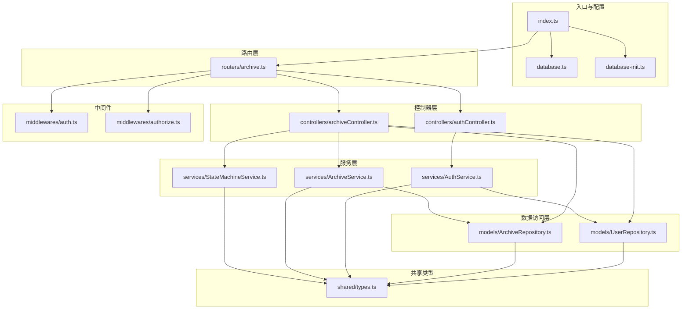
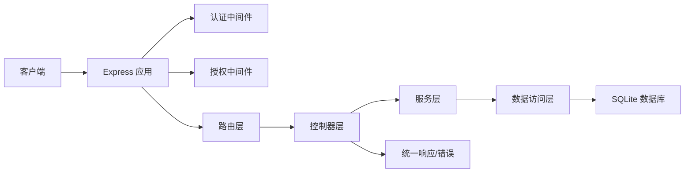
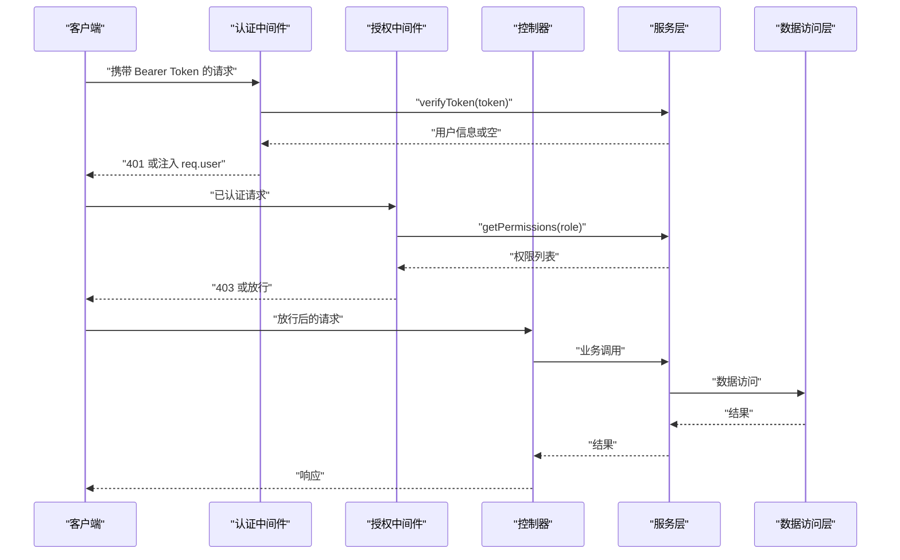
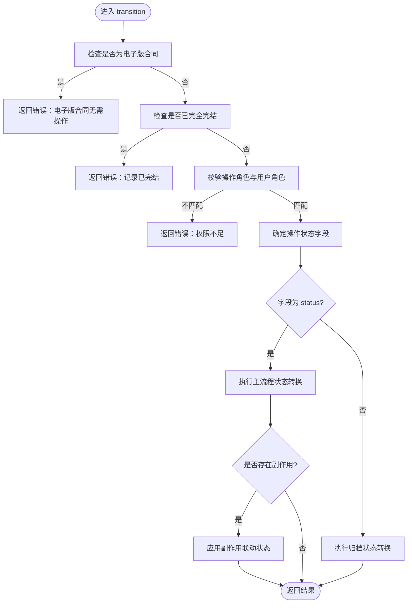
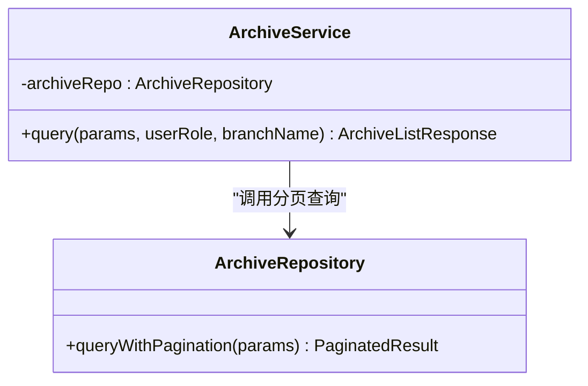
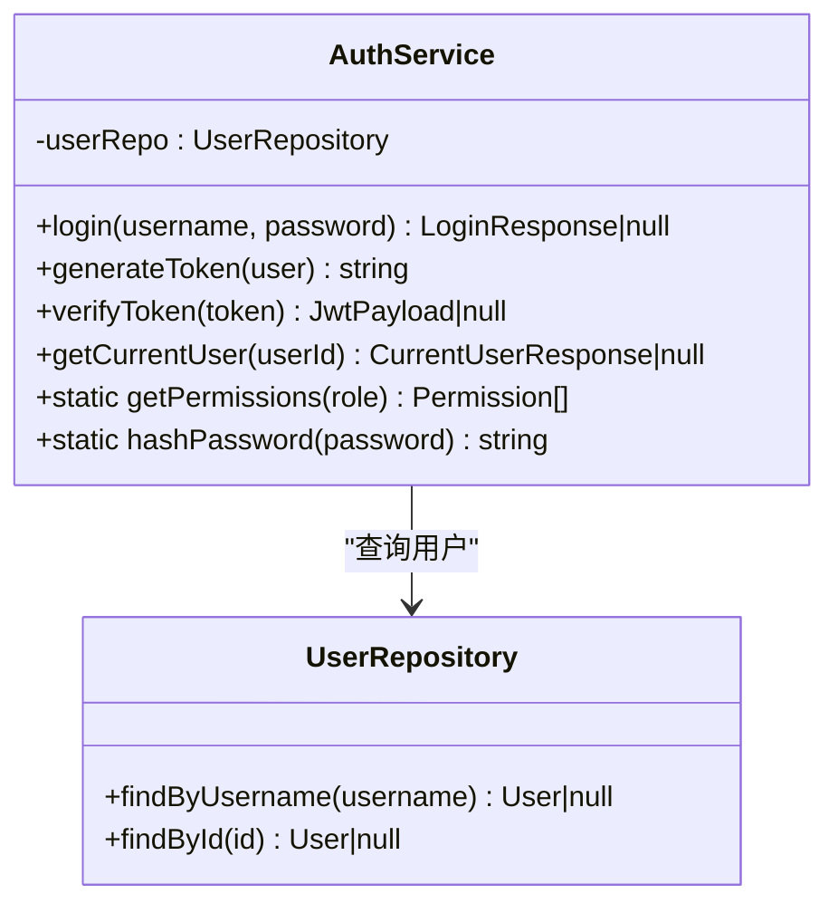
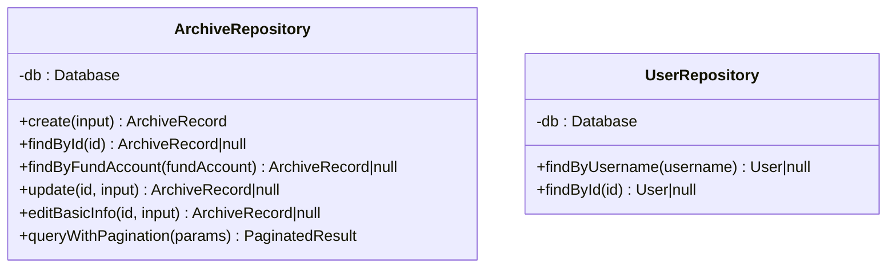
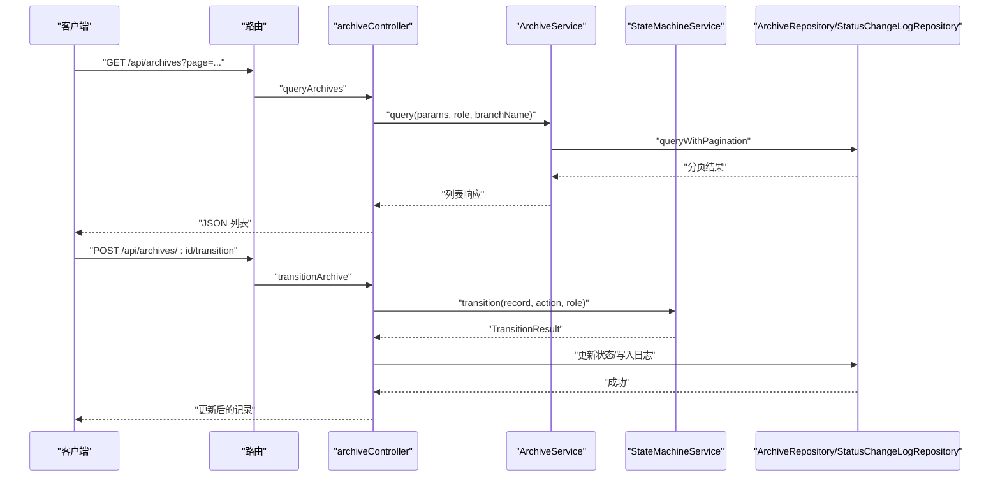
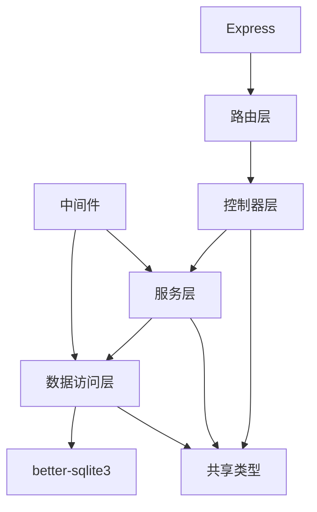

# 后端服务架构

<cite>
**本文引用的文件**
- [backend/src/index.ts](file://backend/src/index.ts)
- [backend/src/database.ts](file://backend/src/database.ts)
- [backend/src/database-init.ts](file://backend/src/database-init.ts)
- [backend/package.json](file://backend/package.json)
- [shared/types.ts](file://shared/types.ts)
- [backend/src/controllers/archiveController.ts](file://backend/src/controllers/archiveController.ts)
- [backend/src/controllers/authController.ts](file://backend/src/controllers/authController.ts)
- [backend/src/middlewares/auth.ts](file://backend/src/middlewares/auth.ts)
- [backend/src/middlewares/authorize.ts](file://backend/src/middlewares/authorize.ts)
- [backend/src/models/ArchiveRepository.ts](file://backend/src/models/ArchiveRepository.ts)
- [backend/src/models/UserRepository.ts](file://backend/src/models/UserRepository.ts)
- [backend/src/routers/archive.ts](file://backend/src/routers/archive.ts)
- [backend/src/services/ArchiveService.ts](file://backend/src/services/ArchiveService.ts)
- [backend/src/services/AuthService.ts](file://backend/src/services/AuthService.ts)
- [backend/src/services/StateMachineService.ts](file://backend/src/services/StateMachineService.ts)
</cite>

## 目录
1. [简介](#简介)
2. [项目结构](#项目结构)
3. [核心组件](#核心组件)
4. [架构总览](#架构总览)
5. [详细组件分析](#详细组件分析)
6. [依赖分析](#依赖分析)
7. [性能考量](#性能考量)
8. [故障排查指南](#故障排查指南)
9. [结论](#结论)
10. [附录](#附录)

## 简介
本项目是一个基于 Express.js 的档案管理系统后端，采用 MVC 分层架构与职责分离设计，结合状态机驱动的状态流转控制、JWT 认证与基于角色的权限控制、SQLite 数据持久化与索引优化，以及统一的错误响应格式。系统围绕“档案记录”这一核心实体，提供导入、查询、详情、状态流转、批量操作、基础信息维护等功能。

## 项目结构
后端代码位于 backend/src 目录，按关注点分层组织：
- 入口与配置：入口文件负责初始化 Express、CORS、JSON 解析、数据库与种子用户、路由注册与健康检查
- 路由层：按业务域划分路由，集中注册控制器方法
- 控制器层：处理 HTTP 请求与响应，编排服务层与仓储层
- 服务层：封装业务规则与流程（认证、状态机、导入、归档查询等）
- 数据访问层：封装数据库操作（better-sqlite3），提供 CRUD 与分页查询
- 中间件：认证与授权中间件，注入用户上下文与权限校验
- 共享类型：前后端共享的类型、枚举与接口定义

图表来源
- [backend/src/index.ts:1-39](file://backend/src/index.ts#L1-L39)
- [backend/src/database.ts:1-87](file://backend/src/database.ts#L1-L87)
- [backend/src/database-init.ts:1-65](file://backend/src/database-init.ts#L1-L65)
- [backend/src/routers/archive.ts:1-42](file://backend/src/routers/archive.ts#L1-L42)
- [backend/src/controllers/archiveController.ts:1-448](file://backend/src/controllers/archiveController.ts#L1-L448)
- [backend/src/controllers/authController.ts:1-77](file://backend/src/controllers/authController.ts#L1-L77)
- [backend/src/services/ArchiveService.ts:1-71](file://backend/src/services/ArchiveService.ts#L1-L71)
- [backend/src/services/AuthService.ts:1-126](file://backend/src/services/AuthService.ts#L1-L126)
- [backend/src/services/StateMachineService.ts:1-253](file://backend/src/services/StateMachineService.ts#L1-L253)
- [backend/src/models/ArchiveRepository.ts:1-307](file://backend/src/models/ArchiveRepository.ts#L1-L307)
- [backend/src/models/UserRepository.ts:1-56](file://backend/src/models/UserRepository.ts#L1-L56)
- [backend/src/middlewares/auth.ts:1-56](file://backend/src/middlewares/auth.ts#L1-L56)
- [backend/src/middlewares/authorize.ts:1-47](file://backend/src/middlewares/authorize.ts#L1-L47)
- [shared/types.ts:1-289](file://shared/types.ts#L1-L289)

章节来源
- [backend/src/index.ts:1-39](file://backend/src/index.ts#L1-L39)
- [backend/src/database.ts:1-87](file://backend/src/database.ts#L1-L87)
- [backend/src/database-init.ts:1-65](file://backend/src/database-init.ts#L1-L65)
- [backend/src/routers/archive.ts:1-42](file://backend/src/routers/archive.ts#L1-L42)
- [shared/types.ts:1-289](file://shared/types.ts#L1-L289)

## 核心组件
- Express 应用与中间件
  - CORS 与 JSON 解析中间件在入口处统一配置
  - 认证中间件从 Authorization 头解析 Bearer Token，校验后注入用户信息
  - 授权中间件基于角色权限映射进行细粒度权限校验
- 数据库与初始化
  - better-sqlite3 单例连接，启用 WAL 与外键约束
  - 表结构初始化脚本包含三张核心表及索引
- 路由与控制器
  - 档案路由集中注册导入、模板下载、查询、详情、状态流转、批量流转、创建、编辑等端点
  - 认证路由提供登录与当前用户信息查询
- 服务层
  - ArchiveService：封装查询与分页，内置分支机构数据隔离
  - AuthService：登录、JWT 签发与校验、权限映射、密码哈希
  - StateMachineService：主流程与归档状态机，含联动副作用与完全完结保护
- 数据访问层
  - ArchiveRepository：CRUD、分页查询、多条件过滤、唯一性校验
  - UserRepository：用户查询（按用户名与 ID）

章节来源
- [backend/src/index.ts:14-39](file://backend/src/index.ts#L14-L39)
- [backend/src/middlewares/auth.ts:26-55](file://backend/src/middlewares/auth.ts#L26-L55)
- [backend/src/middlewares/authorize.ts:16-46](file://backend/src/middlewares/authorize.ts#L16-L46)
- [backend/src/database.ts:25-52](file://backend/src/database.ts#L25-L52)
- [backend/src/database-init.ts:8-64](file://backend/src/database-init.ts#L8-L64)
- [backend/src/routers/archive.ts:17-39](file://backend/src/routers/archive.ts#L17-L39)
- [backend/src/controllers/archiveController.ts:43-447](file://backend/src/controllers/archiveController.ts#L43-L447)
- [backend/src/controllers/authController.ts:16-76](file://backend/src/controllers/authController.ts#L16-L76)
- [backend/src/services/ArchiveService.ts:19-70](file://backend/src/services/ArchiveService.ts#L19-L70)
- [backend/src/services/AuthService.ts:32-125](file://backend/src/services/AuthService.ts#L32-L125)
- [backend/src/services/StateMachineService.ts:96-252](file://backend/src/services/StateMachineService.ts#L96-L252)
- [backend/src/models/ArchiveRepository.ts:85-306](file://backend/src/models/ArchiveRepository.ts#L85-L306)
- [backend/src/models/UserRepository.ts:31-55](file://backend/src/models/UserRepository.ts#L31-L55)

## 架构总览
系统遵循 MVC 分层与职责分离：
- 控制器仅负责请求解析、参数校验、调用服务与返回响应
- 服务层封装业务规则与跨仓储操作
- 仓储层封装数据库访问与查询构建
- 中间件负责认证与授权，贯穿路由层
- 共享类型确保前后端一致的数据契约

图表来源
- [backend/src/index.ts:14-39](file://backend/src/index.ts#L14-L39)
- [backend/src/middlewares/auth.ts:26-55](file://backend/src/middlewares/auth.ts#L26-L55)
- [backend/src/middlewares/authorize.ts:16-46](file://backend/src/middlewares/authorize.ts#L16-L46)
- [backend/src/routers/archive.ts:17-39](file://backend/src/routers/archive.ts#L17-L39)
- [backend/src/controllers/archiveController.ts:43-447](file://backend/src/controllers/archiveController.ts#L43-L447)
- [backend/src/services/ArchiveService.ts:19-70](file://backend/src/services/ArchiveService.ts#L19-L70)
- [backend/src/models/ArchiveRepository.ts:85-306](file://backend/src/models/ArchiveRepository.ts#L85-L306)
- [backend/src/database.ts:25-52](file://backend/src/database.ts#L25-L52)

## 详细组件分析

### 认证与授权中间件
- 认证中间件
  - 从 Authorization 头提取 Bearer Token
  - 通过 AuthService 校验 Token 并注入用户信息到请求上下文
- 授权中间件
  - 基于角色权限映射，校验用户是否具备所需权限
  - 需在认证中间件之后使用

图表来源
- [backend/src/middlewares/auth.ts:26-55](file://backend/src/middlewares/auth.ts#L26-L55)
- [backend/src/middlewares/authorize.ts:16-46](file://backend/src/middlewares/authorize.ts#L16-L46)
- [backend/src/services/AuthService.ts:85-117](file://backend/src/services/AuthService.ts#L85-L117)
- [backend/src/controllers/archiveController.ts:99-147](file://backend/src/controllers/archiveController.ts#L99-L147)

章节来源
- [backend/src/middlewares/auth.ts:26-55](file://backend/src/middlewares/auth.ts#L26-L55)
- [backend/src/middlewares/authorize.ts:16-46](file://backend/src/middlewares/authorize.ts#L16-L46)
- [backend/src/services/AuthService.ts:32-125](file://backend/src/services/AuthService.ts#L32-L125)

### 状态机服务（StateMachineService）
- 功能概述
  - 控制主流程状态（status）与综合部归档状态（archive_status）的合法转换
  - 内置前置保护：电子版合同与完全完结记录禁止状态变更
  - 角色权限校验：每个操作绑定特定角色
  - 联动副作用：如 review_pass 自动激活归档状态；回寄完成后的自动判断
- 关键数据结构
  - 主流程状态转换表与归档状态转换表
  - 操作-角色映射与操作-状态字段映射
- 流程要点
  - transition -> 根据 action 判断状态字段 -> 校验当前状态与角色 -> 生成结果与副作用

图表来源
- [backend/src/services/StateMachineService.ts:106-203](file://backend/src/services/StateMachineService.ts#L106-L203)
- [backend/src/services/StateMachineService.ts:205-243](file://backend/src/services/StateMachineService.ts#L205-L243)

章节来源
- [backend/src/services/StateMachineService.ts:96-252](file://backend/src/services/StateMachineService.ts#L96-L252)

### 档案查询服务（ArchiveService）
- 职责
  - 组装查询参数（含分页默认值）
  - 分支机构用户强制按营业部过滤
  - 委托仓储层执行分页查询
- 关键点
  - 分页默认值与边界校验
  - 数据隔离：branch 角色自动附加 branchName 条件

图表来源
- [backend/src/services/ArchiveService.ts:19-70](file://backend/src/services/ArchiveService.ts#L19-L70)
- [backend/src/models/ArchiveRepository.ts:228-305](file://backend/src/models/ArchiveRepository.ts#L228-L305)

章节来源
- [backend/src/services/ArchiveService.ts:19-70](file://backend/src/services/ArchiveService.ts#L19-L70)
- [backend/src/models/ArchiveRepository.ts:228-305](file://backend/src/models/ArchiveRepository.ts#L228-L305)

### 认证服务（AuthService）
- 职责
  - 登录：校验用户名与密码，成功签发 JWT
  - Token：签发与校验
  - 权限：基于角色的权限映射
  - 密码：哈希处理
- 关键点
  - JWT 密钥与过期时间配置
  - 角色-权限映射表

图表来源
- [backend/src/services/AuthService.ts:32-125](file://backend/src/services/AuthService.ts#L32-L125)
- [backend/src/models/UserRepository.ts:31-55](file://backend/src/models/UserRepository.ts#L31-L55)

章节来源
- [backend/src/services/AuthService.ts:32-125](file://backend/src/services/AuthService.ts#L32-L125)
- [backend/src/models/UserRepository.ts:31-55](file://backend/src/models/UserRepository.ts#L31-L55)

### 数据访问层（ArchiveRepository 与 UserRepository）
- ArchiveRepository
  - 提供 create、findById、findByFundAccount、update、editBasicInfo、queryWithPagination
  - 支持多条件组合查询与分页，包含索引优化
- UserRepository
  - 提供 findByUsername、findById

图表来源
- [backend/src/models/ArchiveRepository.ts:85-306](file://backend/src/models/ArchiveRepository.ts#L85-L306)
- [backend/src/models/UserRepository.ts:31-55](file://backend/src/models/UserRepository.ts#L31-L55)

章节来源
- [backend/src/models/ArchiveRepository.ts:85-306](file://backend/src/models/ArchiveRepository.ts#L85-L306)
- [backend/src/models/UserRepository.ts:31-55](file://backend/src/models/UserRepository.ts#L31-L55)

### 控制器层（archiveController 与 authController）
- archiveController
  - 导入：Excel 解析与批量导入
  - 模板：标准列头模板下载
  - 查询：多条件分页查询，内置数据隔离
  - 详情：档案详情与状态变更历史
  - 状态流转：单条与批量，委派状态机与事务型服务
  - 创建与编辑：字段校验、唯一性校验、状态初始化
- authController
  - 登录：参数校验、调用认证服务
  - 当前用户：返回用户信息与权限列表

图表来源
- [backend/src/controllers/archiveController.ts:99-147](file://backend/src/controllers/archiveController.ts#L99-L147)
- [backend/src/controllers/archiveController.ts:208-258](file://backend/src/controllers/archiveController.ts#L208-L258)
- [backend/src/services/ArchiveService.ts:33-69](file://backend/src/services/ArchiveService.ts#L33-L69)
- [backend/src/services/StateMachineService.ts:106-142](file://backend/src/services/StateMachineService.ts#L106-L142)
- [backend/src/models/ArchiveRepository.ts:228-305](file://backend/src/models/ArchiveRepository.ts#L228-L305)

章节来源
- [backend/src/controllers/archiveController.ts:43-447](file://backend/src/controllers/archiveController.ts#L43-L447)
- [backend/src/controllers/authController.ts:16-76](file://backend/src/controllers/authController.ts#L16-L76)

### 路由层（archive 路由）
- 集中注册与鉴权绑定
  - GET /api/archives：查询（认证）
  - POST /api/archives：创建（认证 + review 权限）
  - POST /api/archives/import：导入（认证 + import 权限）
  - POST /api/archives/batch-transition：批量流转（认证）
  - GET /api/archives/template：模板下载（认证）
  - GET /api/archives/:id：详情（认证）
  - POST /api/archives/:id/transition：单条流转（认证）
  - PUT /api/archives/:id：编辑（认证 + review 权限）

章节来源
- [backend/src/routers/archive.ts:17-39](file://backend/src/routers/archive.ts#L17-L39)

## 依赖分析
- 外部依赖
  - Express、CORS、better-sqlite3、bcryptjs、jsonwebtoken、multer、uuid、xlsx
- 内部依赖
  - 控制器依赖服务层与仓储层
  - 服务层依赖仓储层与共享类型
  - 路由层依赖控制器与中间件
  - 中间件依赖服务层与仓储层

图表来源
- [backend/package.json:14-22](file://backend/package.json#L14-L22)
- [backend/src/controllers/archiveController.ts:1-24](file://backend/src/controllers/archiveController.ts#L1-L24)
- [backend/src/services/ArchiveService.ts:6](file://backend/src/services/ArchiveService.ts#L6)
- [backend/src/models/ArchiveRepository.ts:6](file://backend/src/models/ArchiveRepository.ts#L6)
- [backend/src/middlewares/auth.ts:7-9](file://backend/src/middlewares/auth.ts#L7-L9)
- [shared/types.ts:1-289](file://shared/types.ts#L1-L289)

章节来源
- [backend/package.json:14-22](file://backend/package.json#L14-L22)
- [backend/src/controllers/archiveController.ts:1-24](file://backend/src/controllers/archiveController.ts#L1-L24)
- [backend/src/services/ArchiveService.ts:6](file://backend/src/services/ArchiveService.ts#L6)
- [backend/src/models/ArchiveRepository.ts:6](file://backend/src/models/ArchiveRepository.ts#L6)
- [backend/src/middlewares/auth.ts:7-9](file://backend/src/middlewares/auth.ts#L7-L9)
- [shared/types.ts:1-289](file://shared/types.ts#L1-L289)

## 性能考量
- 数据库
  - WAL 模式提升并发读写性能
  - 外键约束保证数据一致性
  - 为关键查询字段建立索引（资金账号、营业部、状态、归档状态、合同版本类型）
- 查询优化
  - 分页查询与条件拼接，避免一次性加载大量数据
  - 精确匹配与范围查询结合，减少全表扫描
- 传输与解析
  - 导入使用内存存储（multer memoryStorage），避免磁盘 IO
  - Excel 解析与入库批处理，降低事务开销
- 缓存与幂等
  - 可在高频查询上引入缓存（如状态统计）
  - 状态流转应具备幂等性与重复提交防护

## 故障排查指南
- 认证与授权
  - 401 未提供认证令牌：检查 Authorization 头与 Bearer Token
  - 401 认证令牌无效或已过期：检查 JWT 密钥与过期时间
  - 403 权限不足：检查用户角色与所需权限映射
- 状态流转
  - 400 状态流转不合法：检查当前状态与操作是否匹配
  - 电子版合同无法变更：确认合同版本类型
  - 已完结记录不可变更：确认 record.status 是否为 completed
- 数据查询
  - 404 档案记录不存在：确认 ID 与唯一性约束
  - 分支机构数据隔离：确认 branch 角色是否附加 branchName 条件
- 导入与模板
  - 400 文件格式不正确：确认扩展名为 .xlsx 或 .xls
  - 模板下载：确认已认证且路由正确

章节来源
- [backend/src/middlewares/auth.ts:29-50](file://backend/src/middlewares/auth.ts#L29-L50)
- [backend/src/middlewares/authorize.ts:17-44](file://backend/src/middlewares/authorize.ts#L17-L44)
- [backend/src/controllers/archiveController.ts:222-251](file://backend/src/controllers/archiveController.ts#L222-L251)
- [backend/src/services/StateMachineService.ts:108-121](file://backend/src/services/StateMachineService.ts#L108-L121)
- [backend/src/controllers/archiveController.ts:170-177](file://backend/src/controllers/archiveController.ts#L170-L177)
- [backend/src/controllers/archiveController.ts:56-62](file://backend/src/controllers/archiveController.ts#L56-L62)

## 结论
本项目以清晰的分层架构与严格的职责分离实现了档案管理的核心业务，配合状态机驱动的状态流转、JWT 认证与基于角色的权限控制、SQLite 的高效数据持久化与索引优化，形成了高内聚、低耦合、可扩展的后端服务。建议在生产环境中进一步完善缓存策略、监控与日志体系，并对导入与状态流转等关键路径增加重试与幂等保障。

## 附录
- 数据库初始化脚本包含三张核心表与索引，确保查询性能与数据一致性
- 共享类型定义了完整的领域模型、状态枚举与 API 接口契约，前后端一致

章节来源
- [backend/src/database-init.ts:8-64](file://backend/src/database-init.ts#L8-L64)
- [shared/types.ts:46-289](file://shared/types.ts#L46-L289)