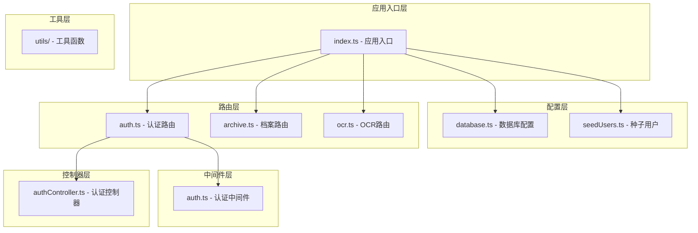
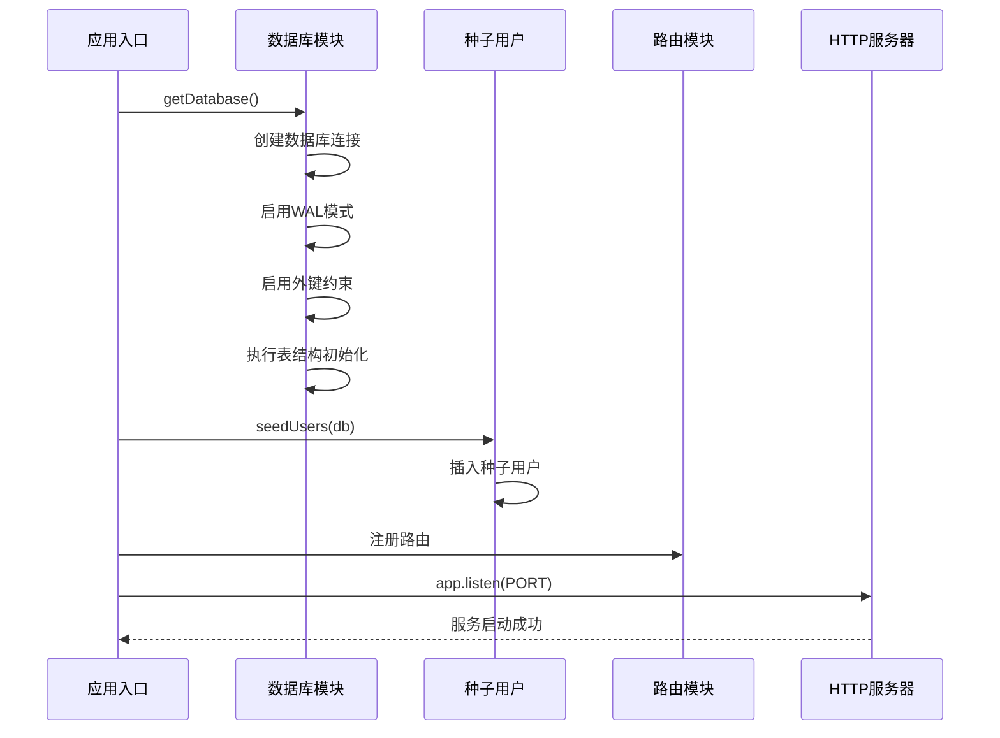
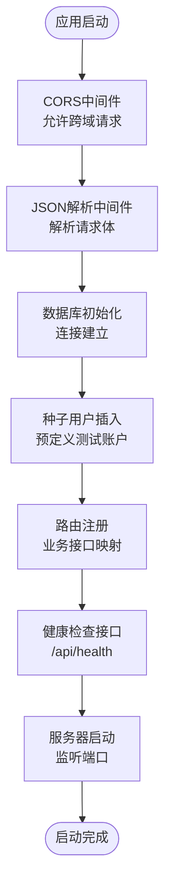
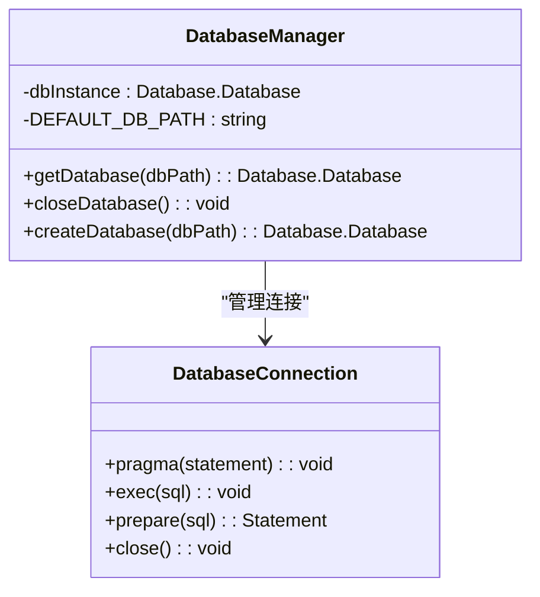
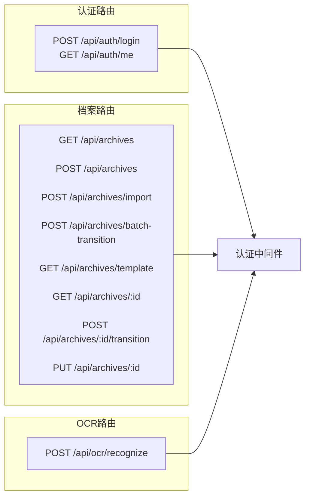
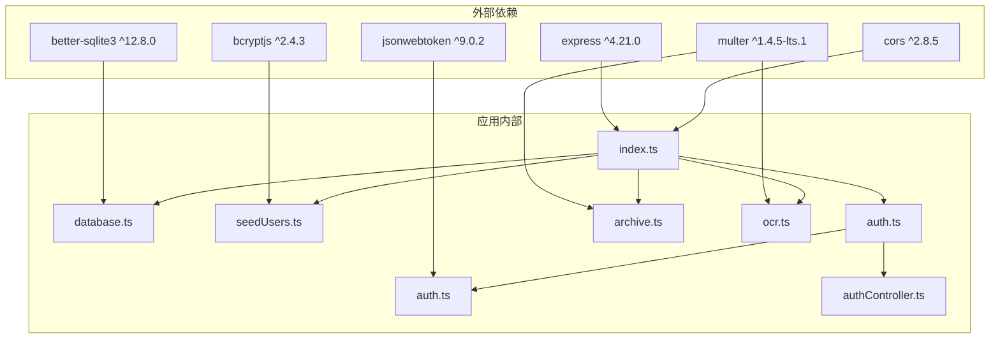

# 应用入口与初始化

<cite>
**本文档引用的文件**
- [index.ts](file://backend/src/index.ts)
- [database.ts](file://backend/src/database.ts)
- [database-init.ts](file://backend/src/database-init.ts)
- [seedUsers.ts](file://backend/src/utils/seedUsers.ts)
- [auth.ts](file://backend/src/middlewares/auth.ts)
- [authController.ts](file://backend/src/controllers/authController.ts)
- [auth.ts](file://backend/src/routes/auth.ts)
- [archive.ts](file://backend/src/routes/archive.ts)
- [ocr.ts](file://backend/src/routes/ocr.ts)
- [package.json](file://backend/package.json)
- [start.sh](file://start.sh)
- [start.ps1](file://start.ps1)
</cite>

## 目录
1. [简介](#简介)
2. [项目结构](#项目结构)
3. [核心组件](#核心组件)
4. [架构概览](#架构概览)
5. [详细组件分析](#详细组件分析)
6. [依赖关系分析](#依赖关系分析)
7. [性能考虑](#性能考虑)
8. [故障排除指南](#故障排除指南)
9. [结论](#结论)

## 简介

本文档详细介绍了档案管理系统后端的应用入口与初始化模块。该系统基于Express框架构建，使用better-sqlite3作为数据库引擎，实现了完整的应用启动生命周期管理。文档涵盖了从Express应用启动、中间件配置、CORS设置、JSON解析等基础配置，到数据库初始化过程（包括连接建立、表结构创建和种子用户插入机制），以及应用启动的完整生命周期管理。

## 项目结构

档案管理系统采用典型的分层架构设计，主要分为以下几个层次：



**图表来源**
- [index.ts:1-39](file://backend/src/index.ts#L1-L39)
- [database.ts:1-87](file://backend/src/database.ts#L1-L87)
- [seedUsers.ts:1-20](file://backend/src/utils/seedUsers.ts#L1-L20)

**章节来源**
- [index.ts:1-39](file://backend/src/index.ts#L1-L39)
- [database.ts:1-87](file://backend/src/database.ts#L1-L87)
- [package.json:1-41](file://backend/package.json#L1-L41)

## 核心组件

### Express应用入口

应用入口位于`backend/src/index.ts`，负责协调整个应用的启动流程。该文件定义了Express应用实例、端口配置、中间件设置以及路由注册。

### 数据库初始化模块

数据库初始化模块位于`backend/src/database.ts`，实现了better-sqlite3连接管理和表结构初始化功能。该模块采用单例模式确保数据库连接的唯一性，并提供了多种数据库操作模式。

### 种子用户管理

种子用户管理位于`backend/src/utils/seedUsers.ts`，负责在数据库首次初始化时创建预定义的测试用户账户。

**章节来源**
- [index.ts:14-36](file://backend/src/index.ts#L14-L36)
- [database.ts:25-52](file://backend/src/database.ts#L25-L52)
- [seedUsers.ts:11-19](file://backend/src/utils/seedUsers.ts#L11-L19)

## 架构概览

应用启动采用异步初始化模式，确保数据库完全就绪后再启动HTTP服务器：



**图表来源**
- [index.ts:20-36](file://backend/src/index.ts#L20-L36)
- [database.ts:25-52](file://backend/src/database.ts#L25-L52)
- [seedUsers.ts:11-19](file://backend/src/utils/seedUsers.ts#L11-L19)

## 详细组件分析

### 应用入口组件分析

应用入口组件是整个系统的启动核心，负责协调各个子系统的初始化工作。

#### 核心初始化流程

应用入口的初始化流程严格按照以下顺序执行：

1. **Express应用实例创建**：创建Express应用实例并配置基础中间件
2. **数据库连接建立**：获取数据库连接实例，确保数据库文件存在
3. **种子用户插入**：在数据库就绪后插入预定义的测试用户
4. **路由注册**：注册所有业务路由
5. **健康检查接口**：提供系统健康状态检查
6. **服务器启动**：启动HTTP服务器监听指定端口

#### 中间件配置详解

应用入口配置了两个核心中间件：



**图表来源**
- [index.ts:17-36](file://backend/src/index.ts#L17-L36)

**章节来源**
- [index.ts:14-36](file://backend/src/index.ts#L14-L36)

### 数据库初始化组件分析

数据库初始化组件实现了完整的SQLite数据库管理功能，采用better-sqlite3作为底层驱动。

#### 数据库连接管理

数据库连接管理采用了单例模式设计，确保在整个应用生命周期内只有一个数据库连接实例：



**图表来源**
- [database.ts:16-52](file://backend/src/database.ts#L16-L52)

#### 表结构初始化机制

数据库初始化脚本定义了三个核心表结构：

1. **用户表(users)**：存储系统用户信息，包含用户名、密码哈希、角色等字段
2. **档案记录表(archive_records)**：存储档案管理的核心数据，包含客户信息、合同类型、状态等字段
3. **状态变更日志表(status_change_logs)**：跟踪档案状态的变更历史

每个表都包含了适当的索引优化，以提升查询性能。

**章节来源**
- [database.ts:25-52](file://backend/src/database.ts#L25-L52)
- [database-init.ts:8-64](file://backend/src/database-init.ts#L8-L64)

### 种子用户组件分析

种子用户组件负责在数据库首次初始化时创建预定义的测试账户，便于开发和测试使用。

#### 种子用户配置

系统预定义了三个测试用户：
- **operator**：运营人员，拥有最高权限
- **branch**：分支机构用户，关联"上海营业部"
- **general**：综合部用户，普通权限

每个用户都使用相同的明文密码"123456"，系统会自动进行密码哈希处理。

#### 用户插入机制

种子用户插入采用了原子性操作，使用`INSERT OR IGNORE`确保重复运行时不会产生冲突。

**章节来源**
- [seedUsers.ts:5-19](file://backend/src/utils/seedUsers.ts#L5-L19)

### 路由注册组件分析

应用启动完成后，会注册所有业务相关的路由模块：



**图表来源**
- [auth.ts:12-16](file://backend/src/routes/auth.ts#L12-L16)
- [archive.ts:17-39](file://backend/src/routes/archive.ts#L17-L39)
- [ocr.ts:17-18](file://backend/src/routes/ocr.ts#L17-L18)

**章节来源**
- [auth.ts:12-18](file://backend/src/routes/auth.ts#L12-L18)
- [archive.ts:17-41](file://backend/src/routes/archive.ts#L17-L41)
- [ocr.ts:17-20](file://backend/src/routes/ocr.ts#L17-L20)

## 依赖关系分析

应用的依赖关系体现了清晰的分层架构设计：



**图表来源**
- [package.json:14-23](file://backend/package.json#L14-L23)
- [index.ts:6-12](file://backend/src/index.ts#L6-L12)

**章节来源**
- [package.json:14-23](file://backend/package.json#L14-L23)
- [index.ts:6-12](file://backend/src/index.ts#L6-L12)

## 性能考虑

### 数据库性能优化

系统采用了多项性能优化措施：

1. **WAL模式启用**：通过`journal_mode = WAL`提升并发读写性能
2. **外键约束**：启用外键约束确保数据完整性
3. **索引优化**：为常用查询字段创建索引
4. **单例连接**：避免重复创建数据库连接的开销

### 启动性能优化

应用启动流程经过精心设计以确保最佳性能：

1. **异步初始化**：数据库初始化完成后才启动HTTP服务器
2. **延迟路由注册**：确保所有依赖项准备就绪后再注册路由
3. **内存存储配置**：Multer使用内存存储减少磁盘I/O

## 故障排除指南

### 常见启动问题及解决方案

#### 数据库连接失败

**问题症状**：应用启动时报数据库连接错误

**可能原因**：
1. 数据库文件权限不足
2. 数据库目录不存在
3. better-sqlite3依赖未正确安装

**解决步骤**：
1. 检查`backend/data/`目录是否存在且可写
2. 确认Node.js具有足够的文件系统权限
3. 重新安装依赖：`npm install`

#### 种子用户插入失败

**问题症状**：应用启动正常但无法看到预定义用户

**可能原因**：
1. 数据库表结构初始化失败
2. 用户名冲突导致插入被忽略
3. 密码哈希过程中出现异常

**解决步骤**：
1. 检查数据库连接是否正常
2. 验证INIT_SQL脚本执行情况
3. 查看控制台输出的错误信息

#### 路由访问异常

**问题症状**：API接口返回404或500错误

**可能原因**：
1. 路由注册顺序错误
2. 中间件配置问题
3. 认证令牌无效

**解决步骤**：
1. 确认所有路由都在数据库初始化后注册
2. 检查CORS配置是否正确
3. 验证JWT令牌格式和有效期

### 调试方法

#### 开发环境调试

使用开发模式启动应用：
```bash
npm run dev
```

开发模式的优势：
- 支持TypeScript直接运行
- 自动重启功能
- 更详细的错误堆栈信息

#### 生产环境调试

生产环境启动命令：
```bash
npm run build
npm run start
```

生产环境注意事项：
- 确保环境变量正确配置
- 检查日志输出
- 监控系统资源使用情况

**章节来源**
- [index.ts:32-35](file://backend/src/index.ts#L32-L35)
- [start.sh:8-17](file://start.sh#L8-L17)
- [start.ps1:10-17](file://start.ps1#L10-L17)

## 结论

档案管理系统后端的应用入口与初始化模块展现了良好的架构设计和实现质量。通过采用异步初始化模式、单例数据库连接管理、完善的种子用户机制以及清晰的分层架构，系统实现了可靠的启动流程和稳定的运行表现。

关键优势包括：
- **可靠的启动流程**：严格的初始化顺序确保系统各组件协调工作
- **灵活的配置管理**：支持环境变量和自定义数据库路径
- **完善的错误处理**：提供详细的错误信息和调试支持
- **清晰的架构分离**：各层职责明确，便于维护和扩展

该模块为整个档案管理系统的稳定运行奠定了坚实的基础，为后续的功能扩展和性能优化提供了良好的技术支撑。