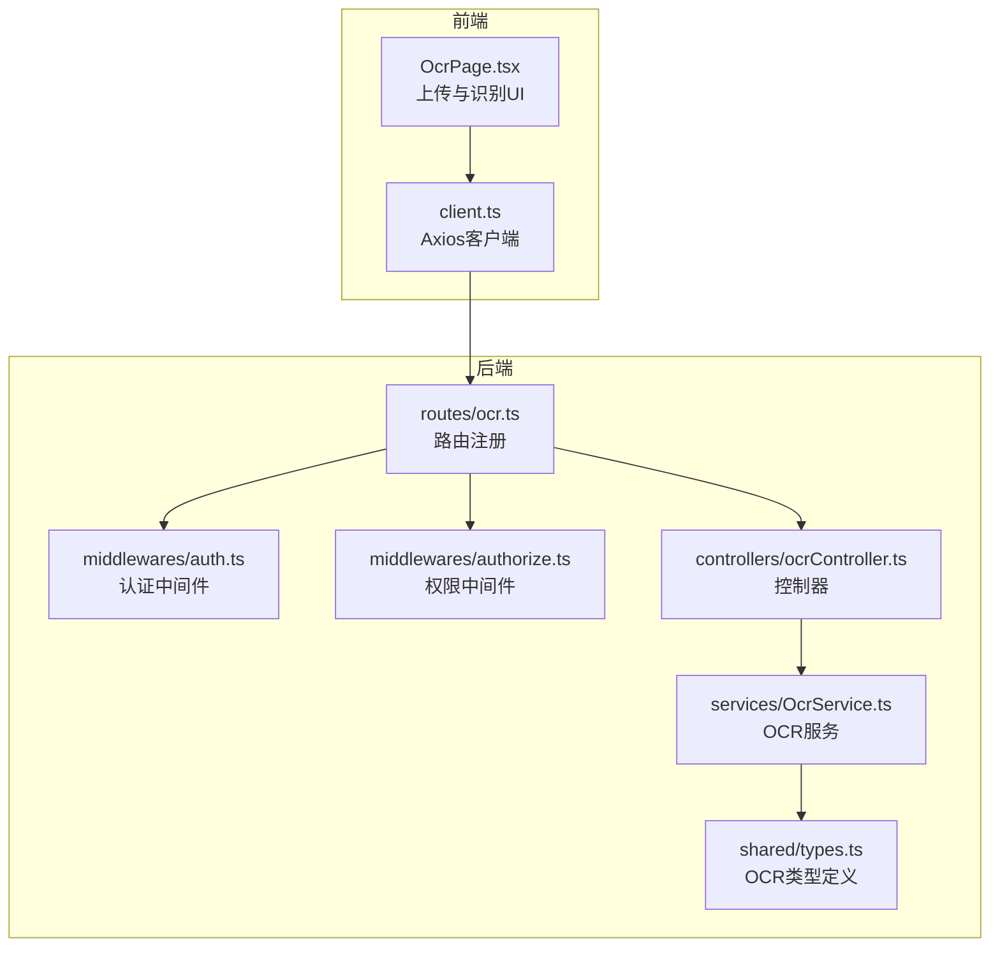
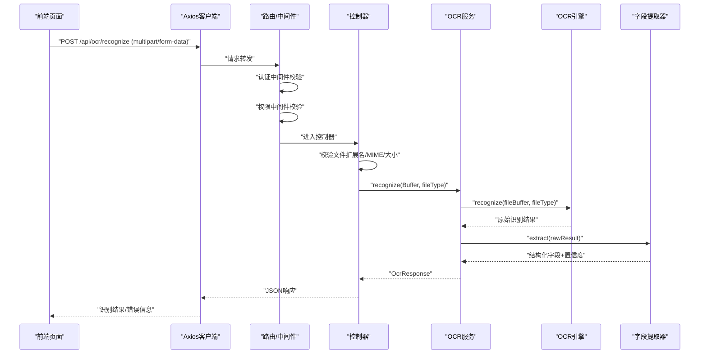
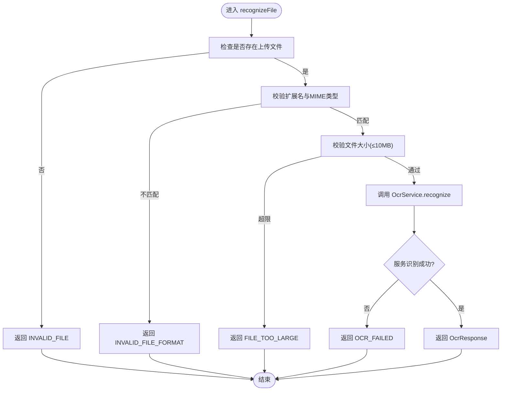
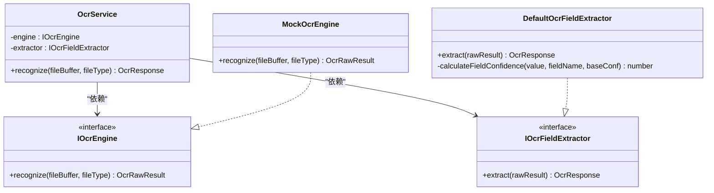
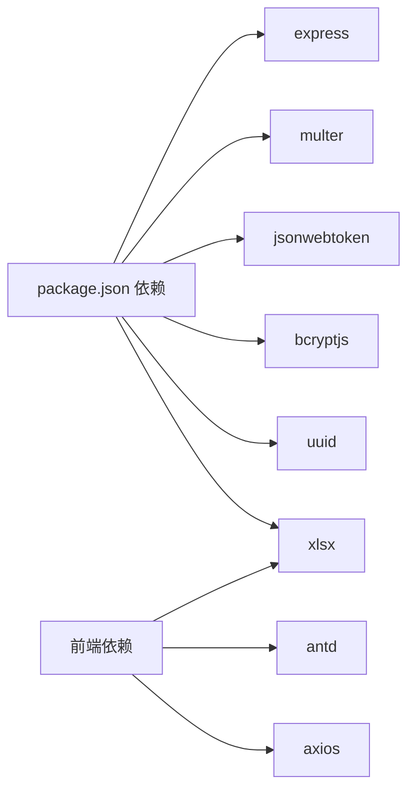
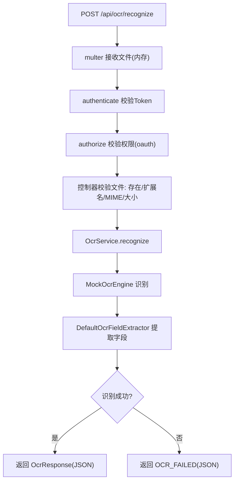

# OCR识别控制器

<cite>
**本文引用的文件**
- [ocrController.ts](file://backend/src/controllers/ocrController.ts)
- [OcrService.ts](file://backend/src/services/OcrService.ts)
- [ocr.ts](file://backend/src/routes/ocr.ts)
- [types.ts](file://shared/types.ts)
- [auth.ts](file://backend/src/middlewares/auth.ts)
- [authorize.ts](file://backend/src/middlewares/authorize.ts)
- [OcrPage.tsx](file://frontend/src/pages/OcrPage.tsx)
- [client.ts](file://frontend/src/api/client.ts)
- [package.json](file://backend/package.json)
</cite>

## 目录
1. [简介](#简介)
2. [项目结构](#项目结构)
3. [核心组件](#核心组件)
4. [架构总览](#架构总览)
5. [详细组件分析](#详细组件分析)
6. [依赖关系分析](#依赖关系分析)
7. [性能考虑](#性能考虑)
8. [故障排查指南](#故障排查指南)
9. [结论](#结论)
10. [附录](#附录)

## 简介
本文件面向OCR识别控制器的技术文档，聚焦于后端控制器、服务层与前端页面的协作流程，涵盖图片上传、OCR处理、结果返回、格式与大小校验、权限控制、错误恢复策略、结果格式化与置信度控制、以及性能优化与测试方法。文档旨在帮助开发者快速理解并维护OCR识别功能，同时为后续接入真实OCR引擎提供清晰的扩展路径。

## 项目结构
后端采用分层架构：
- 路由层：注册OCR识别路由，绑定认证与权限中间件，并配置文件上传中间件
- 控制器层：接收请求、执行输入校验、调用服务层并返回标准化响应
- 服务层：封装OCR引擎与字段提取器，提供统一识别流程与错误兜底
- 类型定义：前后端共享的OCR响应结构与字段定义
- 前端页面：提供上传界面、识别结果展示与置信度提示，并将结果提交为档案记录

图表来源
- [ocr.ts:1-21](file://backend/src/routes/ocr.ts#L1-L21)
- [ocrController.ts:1-94](file://backend/src/controllers/ocrController.ts#L1-L94)
- [OcrService.ts:1-192](file://backend/src/services/OcrService.ts#L1-L192)
- [types.ts:218-238](file://shared/types.ts#L218-L238)
- [auth.ts:1-56](file://backend/src/middlewares/auth.ts#L1-L56)
- [authorize.ts:1-47](file://backend/src/middlewares/authorize.ts#L1-L47)
- [OcrPage.tsx:1-232](file://frontend/src/pages/OcrPage.tsx#L1-L232)
- [client.ts:1-55](file://frontend/src/api/client.ts#L1-L55)

章节来源
- [ocr.ts:1-21](file://backend/src/routes/ocr.ts#L1-L21)
- [ocrController.ts:1-94](file://backend/src/controllers/ocrController.ts#L1-L94)
- [OcrService.ts:1-192](file://backend/src/services/OcrService.ts#L1-L192)
- [types.ts:218-238](file://shared/types.ts#L218-L238)
- [auth.ts:1-56](file://backend/src/middlewares/auth.ts#L1-L56)
- [authorize.ts:1-47](file://backend/src/middlewares/authorize.ts#L1-L47)
- [OcrPage.tsx:1-232](file://frontend/src/pages/OcrPage.tsx#L1-L232)
- [client.ts:1-55](file://frontend/src/api/client.ts#L1-L55)

## 核心组件
- 路由与中间件
  - 路由注册：POST /api/ocr/recognize，使用内存存储的multer接收单文件上传
  - 认证中间件：从Authorization头提取Bearer Token，校验并注入用户信息
  - 权限中间件：校验用户角色是否具备“ocr”权限
- 控制器
  - 输入校验：文件存在性、扩展名与MIME类型、文件大小（10MB）
  - 调用服务：将Buffer与文件类型传入服务层进行识别
  - 结果返回：根据服务层返回的结构化结果或错误码返回JSON
- 服务层
  - 接口抽象：IOcrEngine（识别）、IOcrFieldExtractor（字段提取）
  - 默认实现：MockOcrEngine（模拟识别）、DefaultOcrFieldExtractor（基于正则的字段提取）
  - 错误兜底：识别异常时返回success=false的空字段结构
- 类型系统
  - OcrResponse：统一的OCR响应结构，包含字段值与置信度
  - OcrField：字段值与置信度对象
- 前端页面
  - 支持JPG/PNG/PDF上传，最大10MB
  - 识别完成后自动填充表单并显示置信度，低置信度字段高亮提示
  - 将识别结果转换为Excel并通过导入接口保存为档案记录

章节来源
- [ocr.ts:14-18](file://backend/src/routes/ocr.ts#L14-L18)
- [auth.ts:26-55](file://backend/src/middlewares/auth.ts#L26-L55)
- [authorize.ts:16-46](file://backend/src/middlewares/authorize.ts#L16-L46)
- [ocrController.ts:43-93](file://backend/src/controllers/ocrController.ts#L43-L93)
- [OcrService.ts:21-29](file://backend/src/services/OcrService.ts#L21-L29)
- [OcrService.ts:38-57](file://backend/src/services/OcrService.ts#L38-L57)
- [OcrService.ts:78-149](file://backend/src/services/OcrService.ts#L78-L149)
- [OcrService.ts:157-191](file://backend/src/services/OcrService.ts#L157-L191)
- [types.ts:220-238](file://shared/types.ts#L220-L238)
- [OcrPage.tsx:38-85](file://frontend/src/pages/OcrPage.tsx#L38-L85)
- [OcrPage.tsx:87-101](file://frontend/src/pages/OcrPage.tsx#L87-L101)
- [OcrPage.tsx:156-175](file://frontend/src/pages/OcrPage.tsx#L156-L175)

## 架构总览
OCR识别端到端流程如下：
- 前端上传文件至后端
- 后端路由层进行认证与权限校验
- 控制器执行输入校验并调用服务层
- 服务层通过引擎识别并由字段提取器解析结构化字段
- 控制器将结果返回给前端；若识别失败则返回统一错误码

图表来源
- [ocr.ts:14-18](file://backend/src/routes/ocr.ts#L14-L18)
- [auth.ts:26-55](file://backend/src/middlewares/auth.ts#L26-L55)
- [authorize.ts:16-46](file://backend/src/middlewares/authorize.ts#L16-L46)
- [ocrController.ts:43-93](file://backend/src/controllers/ocrController.ts#L43-L93)
- [OcrService.ts:157-191](file://backend/src/services/OcrService.ts#L157-L191)
- [OcrService.ts:38-57](file://backend/src/services/OcrService.ts#L38-L57)
- [OcrService.ts:78-149](file://backend/src/services/OcrService.ts#L78-L149)
- [OcrPage.tsx:42-46](file://frontend/src/pages/OcrPage.tsx#L42-L46)

## 详细组件分析

### 控制器：ocrController
职责与流程
- 接收单文件上传（来自multer内存存储）
- 校验文件存在性、扩展名（.jpg/.jpeg/.png/.pdf）、MIME类型（image/jpeg、image/png、application/pdf）、大小（≤10MB）
- 识别流程：实例化服务层，调用recognize，处理失败场景并返回统一错误码
- 返回结构：成功时返回OcrResponse，失败时返回包含错误码与消息的JSON

关键点
- 错误码设计：INVALID_FILE、INVALID_FILE_FORMAT、FILE_TOO_LARGE、OCR_FAILED
- 与服务层解耦：通过OcrService统一入口，便于替换真实OCR引擎
- 前端一致性：返回结构与共享类型一致，便于前端消费

图表来源
- [ocrController.ts:43-93](file://backend/src/controllers/ocrController.ts#L43-L93)

章节来源
- [ocrController.ts:10-21](file://backend/src/controllers/ocrController.ts#L10-L21)
- [ocrController.ts:26-37](file://backend/src/controllers/ocrController.ts#L26-L37)
- [ocrController.ts:43-93](file://backend/src/controllers/ocrController.ts#L43-L93)

### 服务层：OcrService
职责与设计
- 接口抽象：IOcrEngine负责识别，IOcrFieldExtractor负责字段提取
- 默认实现：MockOcrEngine（模拟识别），DefaultOcrFieldExtractor（基于正则的字段提取）
- 错误兜底：识别异常时返回success=false且字段置零的结构化响应
- 置信度控制：基础置信度×字段合理性因子，取两位小数

字段提取逻辑
- 逐字段匹配正则，命中即记录字段值与置信度，未命中置空且置信度为0
- 不同字段采用不同合理性因子：资金账号要求纯数字、开户日期要求YYYY-MM-DD、合同版本类型限定“电子版/纸质版”

图表来源
- [OcrService.ts:21-29](file://backend/src/services/OcrService.ts#L21-L29)
- [OcrService.ts:38-57](file://backend/src/services/OcrService.ts#L38-L57)
- [OcrService.ts:78-149](file://backend/src/services/OcrService.ts#L78-L149)
- [OcrService.ts:157-191](file://backend/src/services/OcrService.ts#L157-L191)

章节来源
- [OcrService.ts:11-17](file://backend/src/services/OcrService.ts#L11-L17)
- [OcrService.ts:21-29](file://backend/src/services/OcrService.ts#L21-L29)
- [OcrService.ts:38-57](file://backend/src/services/OcrService.ts#L38-L57)
- [OcrService.ts:64-72](file://backend/src/services/OcrService.ts#L64-L72)
- [OcrService.ts:78-149](file://backend/src/services/OcrService.ts#L78-L149)
- [OcrService.ts:157-191](file://backend/src/services/OcrService.ts#L157-L191)

### 路由与中间件：ocr.ts、auth.ts、authorize.ts
- 路由：使用memoryStorage的multer接收单文件，绑定authenticate与authorize('ocr')，最终调用recognizeFile
- 认证：从Authorization头提取Bearer Token，校验失败返回401
- 权限：校验用户角色是否具备“ocr”权限，缺失则返回403

章节来源
- [ocr.ts:14-18](file://backend/src/routes/ocr.ts#L14-L18)
- [auth.ts:26-55](file://backend/src/middlewares/auth.ts#L26-L55)
- [authorize.ts:16-46](file://backend/src/middlewares/authorize.ts#L16-L46)

### 前端页面：OcrPage.tsx
- 上传：支持JPG/PNG/PDF，最大10MB，自动触发识别
- 识别：调用后端OCR接口，成功后自动填充表单并记录字段置信度
- 置信度提示：低于阈值（0.8）的字段高亮并提示人工复核
- 保存：将识别结果转换为Excel并通过导入接口保存为档案记录

章节来源
- [OcrPage.tsx:38-85](file://frontend/src/pages/OcrPage.tsx#L38-L85)
- [OcrPage.tsx:87-101](file://frontend/src/pages/OcrPage.tsx#L87-L101)
- [OcrPage.tsx:156-175](file://frontend/src/pages/OcrPage.tsx#L156-L175)

## 依赖关系分析
- 后端依赖
  - express：Web框架
  - multer：文件上传中间件（内存存储）
  - jsonwebtoken：JWT校验（认证中间件）
  - bcryptjs：密码加密（与OCR无关，但用于用户模型）
  - uuid：ID生成（与OCR无关）
- 前端依赖
  - antd：UI组件库
  - xlsx：Excel读写（前端用于构造导入数据）
  - axios：HTTP客户端（统一拦截器）

图表来源
- [package.json:14-22](file://backend/package.json#L14-L22)
- [package.json:24-38](file://backend/package.json#L24-L38)

章节来源
- [package.json:14-22](file://backend/package.json#L14-L22)
- [package.json:24-38](file://backend/package.json#L24-L38)

## 性能考虑
- 内存存储上传：使用multer.memoryStorage，适合小文件（≤10MB）。对于大文件或高并发场景，建议：
  - 采用临时磁盘存储并配合流式处理
  - 引入队列与异步任务（如Redis+Worker）实现异步OCR处理
- 并发与资源管理：
  - 控制并发请求数，避免内存峰值过高
  - 识别引擎应支持连接池与超时控制
  - 对识别结果进行缓存（按文件哈希），减少重复计算
- 前端优化：
  - 上传前进行本地预览与压缩
  - 识别过程中显示进度与取消能力
- 可观测性：
  - 记录识别耗时、成功率、失败原因
  - 对低置信度字段进行统计与人工复核追踪

## 故障排查指南
常见问题与定位
- 400错误：INVALID_FILE/INVALID_FILE_FORMAT/FILE_TOO_LARGE
  - 检查文件扩展名与MIME类型是否在允许列表内
  - 确认文件大小未超过10MB
- 401/403错误：认证或权限不足
  - 确认请求头携带有效Bearer Token
  - 确认用户角色具备“ocr”权限
- 500错误：OCR_FAILED
  - 检查服务层识别异常捕获与返回结构
  - 若接入真实引擎，关注引擎可用性与网络超时

调试技巧
- 后端
  - 在控制器与服务层增加日志，记录文件类型、大小、识别耗时
  - 使用单元测试覆盖边界条件（空文件、超大文件、非法格式）
- 前端
  - 使用浏览器开发者工具查看请求与响应
  - 对低置信度字段进行高亮提示，便于人工复核

章节来源
- [ocrController.ts:47-71](file://backend/src/controllers/ocrController.ts#L47-L71)
- [auth.ts:29-50](file://backend/src/middlewares/auth.ts#L29-L50)
- [authorize.ts:17-42](file://backend/src/middlewares/authorize.ts#L17-L42)
- [OcrService.ts:172-189](file://backend/src/services/OcrService.ts#L172-L189)

## 结论
OCR识别控制器通过清晰的分层设计实现了从文件上传到结构化结果返回的完整链路。控制器负责输入校验与错误码标准化，服务层提供可替换的识别与字段提取能力，默认实现满足演示需求，同时为接入真实OCR引擎预留了扩展点。前端页面提供了直观的交互与置信度提示，结合导入接口可无缝衔接档案记录创建流程。建议在生产环境中引入异步处理、缓存与可观测性，以提升稳定性与用户体验。

## 附录

### OCR识别流程图（代码级）

图表来源
- [ocr.ts:14-18](file://backend/src/routes/ocr.ts#L14-L18)
- [auth.ts:26-55](file://backend/src/middlewares/auth.ts#L26-L55)
- [authorize.ts:16-46](file://backend/src/middlewares/authorize.ts#L16-L46)
- [ocrController.ts:43-93](file://backend/src/controllers/ocrController.ts#L43-L93)
- [OcrService.ts:157-191](file://backend/src/services/OcrService.ts#L157-L191)
- [OcrService.ts:38-57](file://backend/src/services/OcrService.ts#L38-L57)
- [OcrService.ts:78-149](file://backend/src/services/OcrService.ts#L78-L149)

### 测试编写建议
- 单元测试
  - 模拟multer上传文件，覆盖文件存在性、格式、大小校验
  - 模拟服务层识别成功/失败，断言控制器返回的JSON结构与状态码
- 集成测试
  - 端到端验证从上传到识别再到导入的完整流程
  - 使用测试数据库或内存数据库隔离环境
- 调试技巧
  - 使用Vitest的覆盖率报告定位未覆盖的分支
  - 对异常路径进行断言，确保错误码与消息一致

章节来源
- [archiveController.test.ts:22-88](file://backend/tests/unit/archiveController.test.ts#L22-L88)
- [client.ts:10-52](file://frontend/src/api/client.ts#L10-L52)