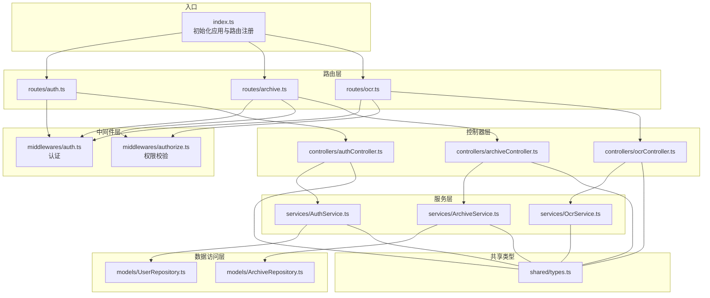
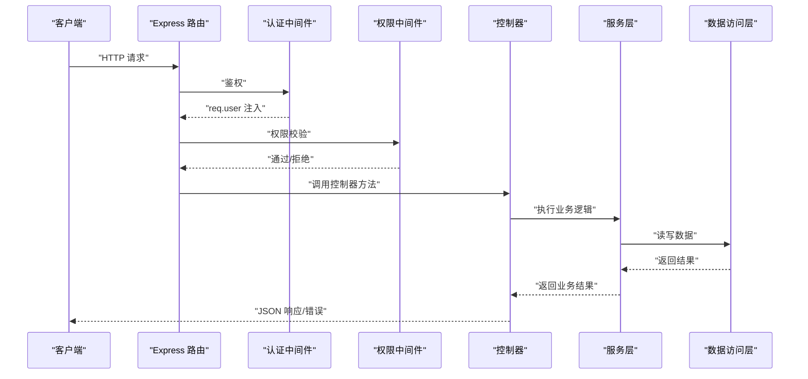
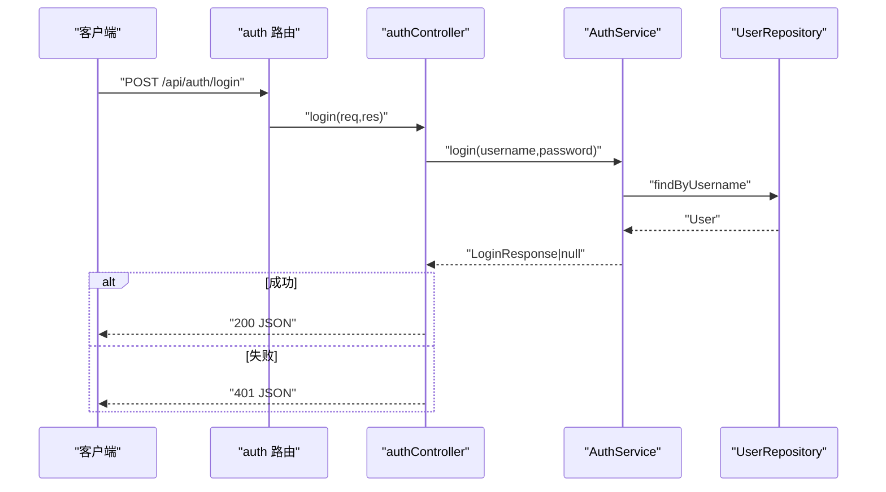
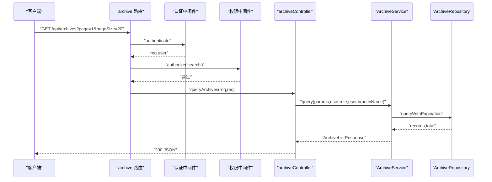
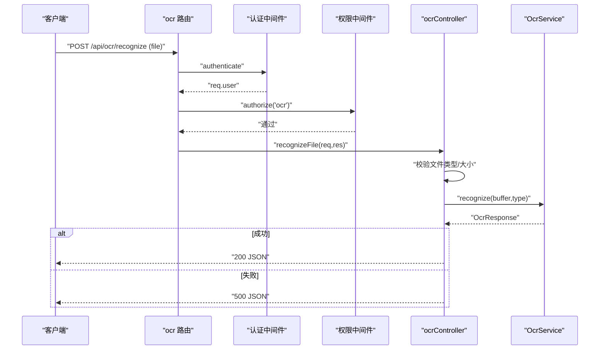
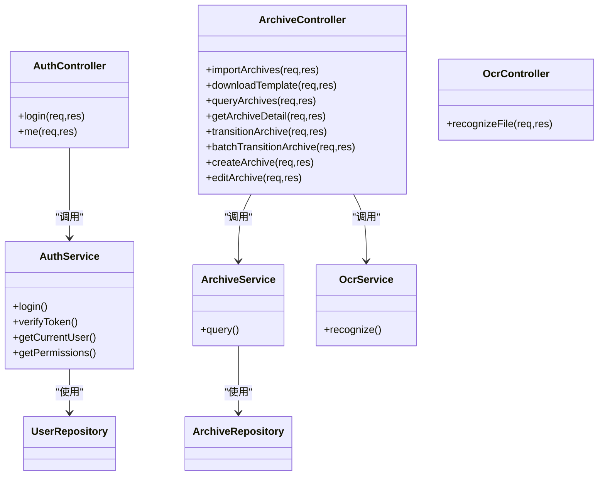

# 控制器层

<cite>
**本文引用的文件**
- [backend/src/index.ts](file://backend/src/index.ts)
- [backend/src/controllers/archiveController.ts](file://backend/src/controllers/archiveController.ts)
- [backend/src/controllers/authController.ts](file://backend/src/controllers/authController.ts)
- [backend/src/controllers/ocrController.ts](file://backend/src/controllers/ocrController.ts)
- [backend/src/middlewares/auth.ts](file://backend/src/middlewares/auth.ts)
- [backend/src/middlewares/authorize.ts](file://backend/src/middlewares/authorize.ts)
- [backend/src/routes/archive.ts](file://backend/src/routes/archive.ts)
- [backend/src/routes/auth.ts](file://backend/src/routes/auth.ts)
- [backend/src/routes/ocr.ts](file://backend/src/routes/ocr.ts)
- [backend/src/services/ArchiveService.ts](file://backend/src/services/ArchiveService.ts)
- [backend/src/services/AuthService.ts](file://backend/src/services/AuthService.ts)
- [backend/src/services/OcrService.ts](file://backend/src/services/OcrService.ts)
- [backend/src/models/ArchiveRepository.ts](file://backend/src/models/ArchiveRepository.ts)
- [backend/src/models/UserRepository.ts](file://backend/src/models/UserRepository.ts)
- [shared/types.ts](file://shared/types.ts)
- [backend/tests/unit/archiveController.test.ts](file://backend/tests/unit/archiveController.test.ts)
- [backend/tests/unit/auth.test.ts](file://backend/tests/unit/auth.test.ts)
</cite>

## 目录
1. [简介](#简介)
2. [项目结构](#项目结构)
3. [核心组件](#核心组件)
4. [架构总览](#架构总览)
5. [详细组件分析](#详细组件分析)
6. [依赖关系分析](#依赖关系分析)
7. [性能考量](#性能考量)
8. [故障排查指南](#故障排查指南)
9. [结论](#结论)
10. [附录](#附录)

## 简介
本文件聚焦于控制器层（Controller Layer）在 MVC 架构中的职责与实现，涵盖以下方面：
- HTTP 请求处理：路由注册、请求参数解析、文件上传与校验
- 响应格式化：统一错误响应结构、业务响应结构
- 错误捕获与状态码策略：鉴权、权限、参数、业务规则等场景下的状态码与错误码
- 控制器与服务层交互模式：依赖注入、异步处理、事务与数据访问层协作
- 请求验证与错误处理标准模式：参数校验、文件格式/大小校验、权限校验
- 控制器单元测试编写指南与最佳实践：断言策略、Mock 设计、边界条件覆盖

## 项目结构
控制器层位于后端工程的 src/controllers 目录，配合路由层（routes）、中间件层（middlewares）、服务层（services）与数据访问层（models），共同构成清晰的分层架构。

图表来源
- [backend/src/index.ts:14-36](file://backend/src/index.ts#L14-L36)
- [backend/src/routes/auth.ts:10-18](file://backend/src/routes/auth.ts#L10-L18)
- [backend/src/routes/archive.ts:10-41](file://backend/src/routes/archive.ts#L10-L41)
- [backend/src/routes/ocr.ts:10-20](file://backend/src/routes/ocr.ts#L10-L20)
- [backend/src/middlewares/auth.ts:26-55](file://backend/src/middlewares/auth.ts#L26-L55)
- [backend/src/middlewares/authorize.ts:16-46](file://backend/src/middlewares/authorize.ts#L16-L46)
- [backend/src/controllers/authController.ts:16-76](file://backend/src/controllers/authController.ts#L16-L76)
- [backend/src/controllers/archiveController.ts:43-447](file://backend/src/controllers/archiveController.ts#L43-L447)
- [backend/src/controllers/ocrController.ts:43-93](file://backend/src/controllers/ocrController.ts#L43-L93)
- [backend/src/services/AuthService.ts:32-125](file://backend/src/services/AuthService.ts#L32-L125)
- [backend/src/services/ArchiveService.ts:19-70](file://backend/src/services/ArchiveService.ts#L19-L70)
- [backend/src/services/OcrService.ts:157-191](file://backend/src/services/OcrService.ts#L157-L191)
- [backend/src/models/UserRepository.ts:31-55](file://backend/src/models/UserRepository.ts#L31-L55)
- [backend/src/models/ArchiveRepository.ts:85-306](file://backend/src/models/ArchiveRepository.ts#L85-L306)
- [shared/types.ts:6-289](file://shared/types.ts#L6-L289)

章节来源
- [backend/src/index.ts:14-36](file://backend/src/index.ts#L14-L36)
- [backend/src/routes/auth.ts:10-18](file://backend/src/routes/auth.ts#L10-L18)
- [backend/src/routes/archive.ts:10-41](file://backend/src/routes/archive.ts#L10-L41)
- [backend/src/routes/ocr.ts:10-20](file://backend/src/routes/ocr.ts#L10-L20)

## 核心组件
- 认证控制器（authController）
  - 职责：处理登录与获取当前用户信息；调用 AuthService 完成登录校验与用户信息查询
  - 关键点：参数校验、鉴权中间件前置、统一错误响应
- 档案控制器（archiveController）
  - 职责：Excel 导入、模板下载、档案查询、详情获取、状态流转（单条/批量）、创建与编辑档案
  - 关键点：文件格式/大小校验、权限中间件、状态机与日志仓库协作、统一响应结构
- OCR 控制器（ocrController）
  - 职责：扫描件上传与 OCR 识别；调用 OcrService 完成识别与字段抽取
  - 关键点：文件类型/大小校验、异步识别、统一错误响应

章节来源
- [backend/src/controllers/authController.ts:16-76](file://backend/src/controllers/authController.ts#L16-L76)
- [backend/src/controllers/archiveController.ts:43-447](file://backend/src/controllers/archiveController.ts#L43-L447)
- [backend/src/controllers/ocrController.ts:43-93](file://backend/src/controllers/ocrController.ts#L43-L93)

## 架构总览
控制器层遵循“薄控制器、厚服务”的设计原则，控制器仅负责：
- 请求参数解析与校验
- 调用服务层执行业务逻辑
- 组织响应数据与错误处理
服务层封装业务规则与领域模型，数据访问层负责持久化细节。

图表来源
- [backend/src/routes/archive.ts:17-39](file://backend/src/routes/archive.ts#L17-L39)
- [backend/src/routes/auth.ts:12-16](file://backend/src/routes/auth.ts#L12-L16)
- [backend/src/routes/ocr.ts:17-18](file://backend/src/routes/ocr.ts#L17-L18)
- [backend/src/middlewares/auth.ts:26-55](file://backend/src/middlewares/auth.ts#L26-L55)
- [backend/src/middlewares/authorize.ts:16-46](file://backend/src/middlewares/authorize.ts#L16-L46)
- [backend/src/controllers/archiveController.ts:99-147](file://backend/src/controllers/archiveController.ts#L99-L147)
- [backend/src/controllers/authController.ts:16-76](file://backend/src/controllers/authController.ts#L16-L76)
- [backend/src/controllers/ocrController.ts:43-93](file://backend/src/controllers/ocrController.ts#L43-L93)

## 详细组件分析

### 认证控制器（authController）
- 功能要点
  - 登录：校验用户名/密码，调用 AuthService 生成 JWT 并返回用户信息
  - 获取当前用户：基于 req.user 调用 AuthService 查询用户并返回权限列表
- 错误处理与状态码
  - 缺少参数：400
  - 登录失败：401
  - 未认证：401
  - 用户不存在：404
- 与服务层交互
  - AuthService.login：密码比对、Token 生成
  - AuthService.getCurrentUser：查询用户并附加权限列表
- 与中间件协作
  - authenticate：确保 req.user 存在
- 与数据访问层协作
  - UserRepository：按用户名/ID 查询用户

图表来源
- [backend/src/routes/auth.ts:12-16](file://backend/src/routes/auth.ts#L12-L16)
- [backend/src/controllers/authController.ts:16-43](file://backend/src/controllers/authController.ts#L16-L43)
- [backend/src/services/AuthService.ts:43-65](file://backend/src/services/AuthService.ts#L43-L65)
- [backend/src/models/UserRepository.ts:39-44](file://backend/src/models/UserRepository.ts#L39-L44)

章节来源
- [backend/src/controllers/authController.ts:16-76](file://backend/src/controllers/authController.ts#L16-L76)
- [backend/src/services/AuthService.ts:32-125](file://backend/src/services/AuthService.ts#L32-L125)
- [backend/src/models/UserRepository.ts:31-55](file://backend/src/models/UserRepository.ts#L31-L55)

### 档案控制器（archiveController）
- 功能要点
  - Excel 导入：校验文件类型与存在性，调用 ImportService 批量导入
  - 模板下载：生成标准列头的 Excel 文件流
  - 档案查询：多条件组合查询与分页，分支机构用户自动过滤
  - 详情获取：返回档案记录与状态变更历史
  - 状态流转：单条与批量流转，调用状态机与日志仓库
  - 创建/编辑：参数校验、唯一性约束、初始状态设置
- 错误处理与状态码
  - 未提供认证令牌：401
  - 资源不存在：404
  - 参数无效：400
  - 冲突（重复资金账号）：409
  - 权限不足：403
- 与服务层交互
  - ArchiveService.query：构建查询参数、分页与数据隔离
  - ArchiveTransitionService/StateMachineService：状态机校验与执行
- 与数据访问层协作
  - ArchiveRepository：CRUD、分页查询、唯一性校验
  - StatusChangeLogRepository：状态变更历史查询

图表来源
- [backend/src/routes/archive.ts:17-18](file://backend/src/routes/archive.ts#L17-L18)
- [backend/src/middlewares/auth.ts:26-55](file://backend/src/middlewares/auth.ts#L26-L55)
- [backend/src/middlewares/authorize.ts:16-46](file://backend/src/middlewares/authorize.ts#L16-L46)
- [backend/src/controllers/archiveController.ts:99-147](file://backend/src/controllers/archiveController.ts#L99-L147)
- [backend/src/services/ArchiveService.ts:33-69](file://backend/src/services/ArchiveService.ts#L33-L69)
- [backend/src/models/ArchiveRepository.ts:228-305](file://backend/src/models/ArchiveRepository.ts#L228-L305)

章节来源
- [backend/src/controllers/archiveController.ts:43-447](file://backend/src/controllers/archiveController.ts#L43-L447)
- [backend/src/services/ArchiveService.ts:19-70](file://backend/src/services/ArchiveService.ts#L19-L70)
- [backend/src/models/ArchiveRepository.ts:85-306](file://backend/src/models/ArchiveRepository.ts#L85-L306)

### OCR 控制器（ocrController）
- 功能要点
  - 扫描件上传：校验文件类型（扩展名/MIME）、大小上限
  - OCR 识别：调用 OcrService 异步识别，返回结构化字段与置信度
- 错误处理与状态码
  - 缺少文件/格式不支持/文件过大：400
  - 识别失败：500
- 与服务层交互
  - OcrService.recognize：组合引擎与字段提取器，返回统一结构化结果

图表来源
- [backend/src/routes/ocr.ts:17-18](file://backend/src/routes/ocr.ts#L17-L18)
- [backend/src/middlewares/auth.ts:26-55](file://backend/src/middlewares/auth.ts#L26-L55)
- [backend/src/middlewares/authorize.ts:16-46](file://backend/src/middlewares/authorize.ts#L16-L46)
- [backend/src/controllers/ocrController.ts:43-93](file://backend/src/controllers/ocrController.ts#L43-L93)
- [backend/src/services/OcrService.ts:172-191](file://backend/src/services/OcrService.ts#L172-L191)

章节来源
- [backend/src/controllers/ocrController.ts:43-93](file://backend/src/controllers/ocrController.ts#L43-L93)
- [backend/src/services/OcrService.ts:157-191](file://backend/src/services/OcrService.ts#L157-L191)

## 依赖关系分析
- 控制器到服务层
  - authController -> AuthService
  - archiveController -> ArchiveService、StateMachineService、ArchiveTransitionService、ArchiveRepository、StatusChangeLogRepository
  - ocrController -> OcrService
- 服务层到数据访问层
  - AuthService -> UserRepository
  - ArchiveService -> ArchiveRepository
- 中间件到服务层
  - authenticate -> AuthService
  - authorize -> AuthService（权限查询）

图表来源
- [backend/src/controllers/authController.ts:16-76](file://backend/src/controllers/authController.ts#L16-L76)
- [backend/src/controllers/archiveController.ts:43-447](file://backend/src/controllers/archiveController.ts#L43-L447)
- [backend/src/controllers/ocrController.ts:43-93](file://backend/src/controllers/ocrController.ts#L43-L93)
- [backend/src/services/AuthService.ts:32-125](file://backend/src/services/AuthService.ts#L32-L125)
- [backend/src/services/ArchiveService.ts:19-70](file://backend/src/services/ArchiveService.ts#L19-L70)
- [backend/src/services/OcrService.ts:157-191](file://backend/src/services/OcrService.ts#L157-L191)
- [backend/src/models/UserRepository.ts:31-55](file://backend/src/models/UserRepository.ts#L31-L55)
- [backend/src/models/ArchiveRepository.ts:85-306](file://backend/src/models/ArchiveRepository.ts#L85-L306)

章节来源
- [backend/src/controllers/authController.ts:16-76](file://backend/src/controllers/authController.ts#L16-L76)
- [backend/src/controllers/archiveController.ts:43-447](file://backend/src/controllers/archiveController.ts#L43-L447)
- [backend/src/controllers/ocrController.ts:43-93](file://backend/src/controllers/ocrController.ts#L43-L93)

## 性能考量
- 文件上传与解析
  - 使用内存存储（multer.memoryStorage）适合小文件快速处理；大文件建议落盘或流式处理以降低内存峰值
- 数据库连接与事务
  - 控制器内直接创建仓库实例，建议在应用启动时集中初始化数据库连接，避免频繁创建连接
- 状态机与日志
  - 批量状态流转逐条校验，建议评估批量优化策略（如合并事务/批处理）
- OCR 识别
  - 异步识别可能阻塞事件循环，建议引入队列或外部任务系统处理耗时识别

## 故障排查指南
- 鉴权失败（401）
  - 检查请求头 Authorization 是否为 Bearer Token
  - 校验 Token 是否过期或签名无效
- 权限不足（403）
  - 确认用户角色与所需权限映射
  - 检查路由是否正确挂载 authorize 中间件
- 参数校验失败（400）
  - 校验必填字段与格式（如资金账号唯一性、合同版本类型）
  - 文件上传：扩展名、MIME 类型、大小限制
- 资源不存在（404）
  - 档案记录、用户信息查询失败
- 业务错误（400/409）
  - 状态流转失败、重复资金账号

章节来源
- [backend/src/middlewares/auth.ts:26-55](file://backend/src/middlewares/auth.ts#L26-L55)
- [backend/src/middlewares/authorize.ts:16-46](file://backend/src/middlewares/authorize.ts#L16-L46)
- [backend/src/controllers/archiveController.ts:342-371](file://backend/src/controllers/archiveController.ts#L342-L371)
- [backend/src/controllers/ocrController.ts:46-71](file://backend/src/controllers/ocrController.ts#L46-L71)

## 结论
控制器层通过清晰的职责划分与中间件协作，实现了统一的请求处理、参数校验与错误响应机制。结合服务层的业务封装与数据访问层的持久化能力，形成高内聚、低耦合的分层架构。建议在后续迭代中进一步优化文件处理与状态流转性能，并完善控制器单元测试覆盖。

## 附录

### 请求验证、响应状态码与错误处理标准模式
- 统一错误响应结构
  - 字段：code（错误码）、message（用户可读信息）、details（可选）
- 常见状态码
  - 400：参数无效、文件格式/大小不合法、业务规则违反
  - 401：未提供或无效认证令牌
  - 403：权限不足
  - 404：资源不存在
  - 409：冲突（如重复资金账号）
  - 500：服务异常（如 OCR 识别失败）
- 验证清单
  - 必填字段校验
  - 枚举值校验（角色、状态、版本类型）
  - 文件类型与大小校验
  - 权限与角色校验

章节来源
- [shared/types.ts:242-247](file://shared/types.ts#L242-L247)
- [backend/src/controllers/archiveController.ts:46-62](file://backend/src/controllers/archiveController.ts#L46-L62)
- [backend/src/controllers/ocrController.ts:46-71](file://backend/src/controllers/ocrController.ts#L46-L71)

### 控制器单元测试编写指南与最佳实践
- 测试策略
  - 行为驱动：围绕控制器行为编写用例，覆盖正常路径与异常路径
  - Mock 设计：对第三方依赖（如 Multer、XLSX、OCR 引擎）进行 Mock，确保测试稳定
  - 边界条件：空文件、非法扩展名、超大文件、缺失必填字段、重复唯一键
- 断言建议
  - 状态码断言：expect(res.status).toHaveBeenCalledWith(XXX)
  - 响应体断言：expect(res.json).toHaveBeenCalledWith(expect.objectContaining({ message }))
  - 文件流断言：解析返回的 Excel/Buffer，验证内容与结构
- 示例参考
  - 档案导入文件格式校验与模板下载
  - 创建档案记录的必填字段与版本类型校验

章节来源
- [backend/tests/unit/archiveController.test.ts:22-88](file://backend/tests/unit/archiveController.test.ts#L22-L88)
- [backend/tests/unit/archiveController.test.ts:90-140](file://backend/tests/unit/archiveController.test.ts#L90-L140)
- [backend/tests/unit/archiveController.test.ts:142-183](file://backend/tests/unit/archiveController.test.ts#L142-L183)
- [backend/tests/unit/auth.test.ts:45-95](file://backend/tests/unit/auth.test.ts#L45-L95)
- [backend/tests/unit/auth.test.ts:97-133](file://backend/tests/unit/auth.test.ts#L97-L133)