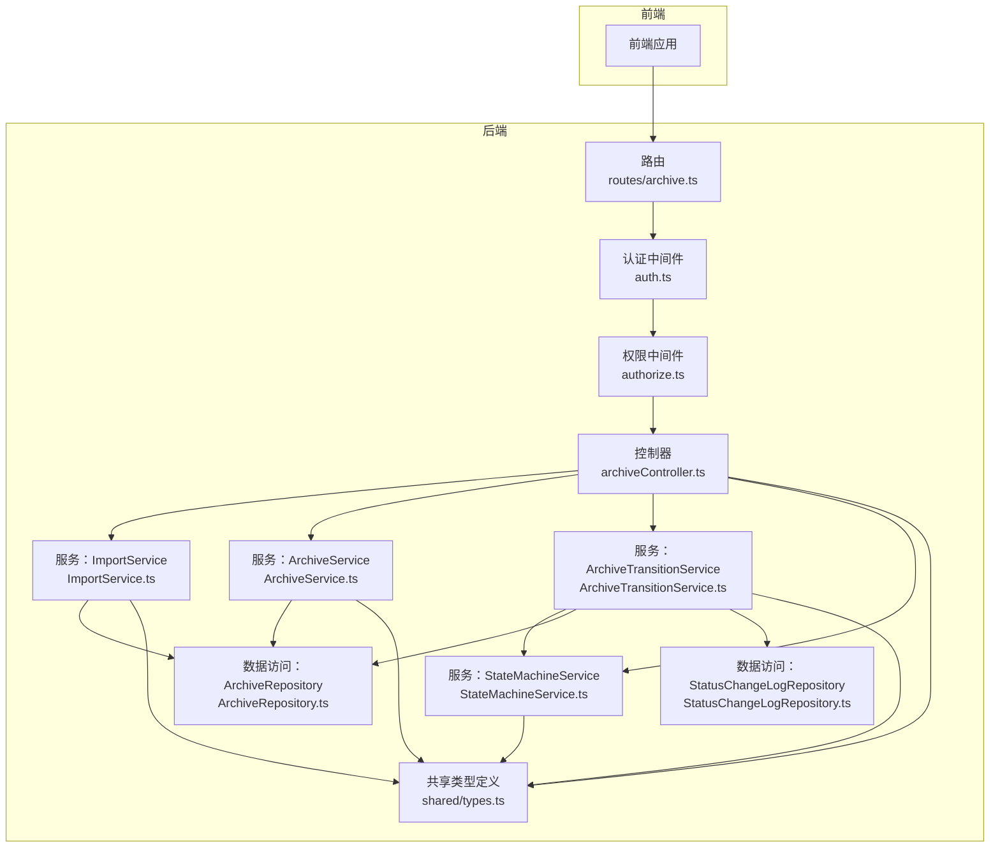
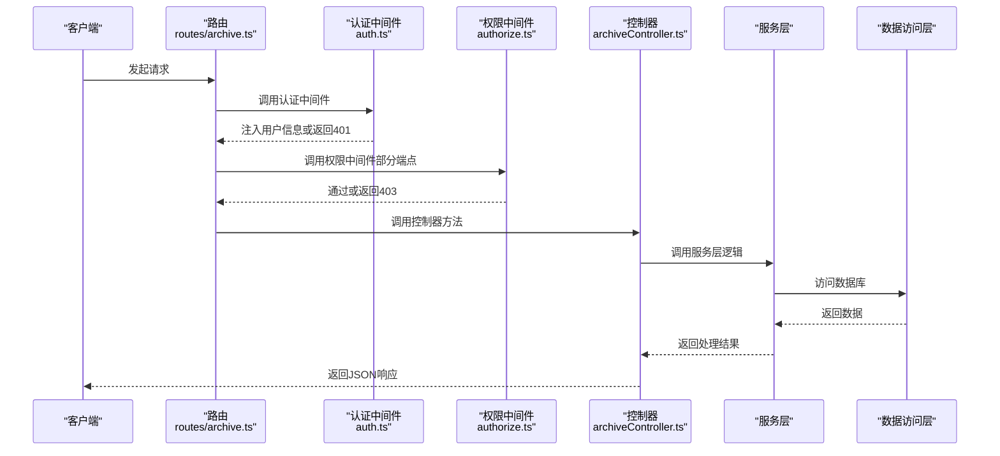
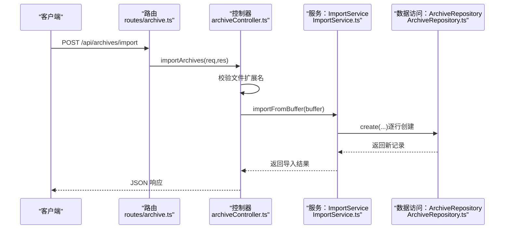
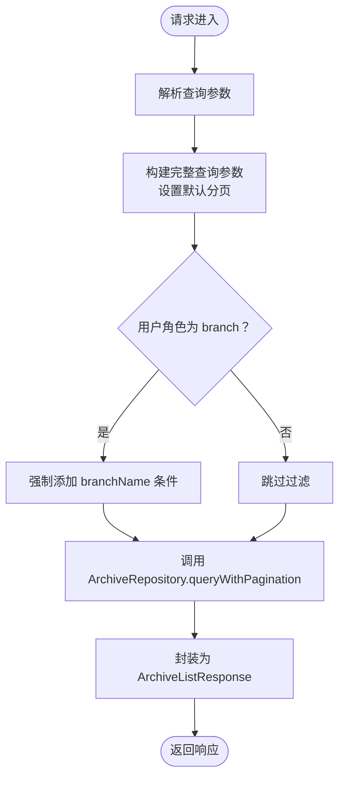
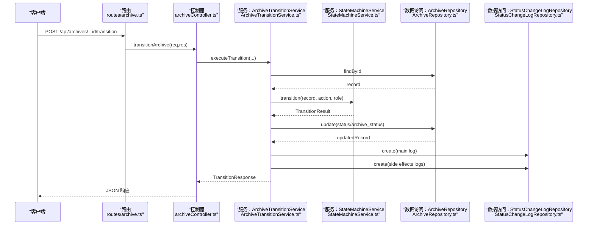
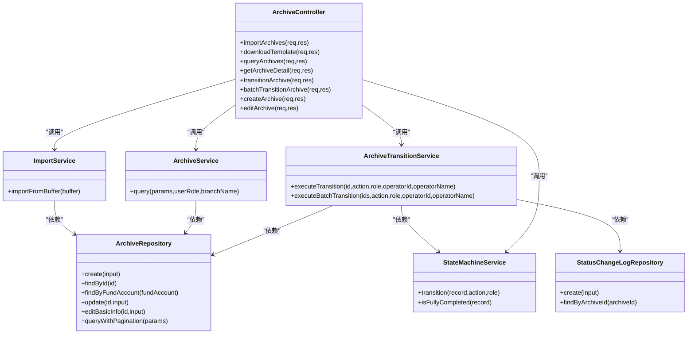

# 档案控制器

<cite>
**本文引用的文件**
- [archiveController.ts](file://backend/src/controllers/archiveController.ts)
- [ArchiveService.ts](file://backend/src/services/ArchiveService.ts)
- [ImportService.ts](file://backend/src/services/ImportService.ts)
- [ArchiveTransitionService.ts](file://backend/src/services/ArchiveTransitionService.ts)
- [StateMachineService.ts](file://backend/src/services/StateMachineService.ts)
- [ArchiveRepository.ts](file://backend/src/models/ArchiveRepository.ts)
- [StatusChangeLogRepository.ts](file://backend/src/models/StatusChangeLogRepository.ts)
- [archive.ts](file://backend/src/routes/archive.ts)
- [types.ts](file://shared/types.ts)
- [auth.ts](file://backend/src/middlewares/auth.ts)
- [authorize.ts](file://backend/src/middlewares/authorize.ts)
- [archiveController.test.ts](file://backend/tests/unit/archiveController.test.ts)
- [archiveTransition.test.ts](file://backend/tests/unit/archiveTransition.test.ts)
- [import.test.ts](file://backend/tests/unit/import.test.ts)
</cite>

## 目录
1. [简介](#简介)
2. [项目结构](#项目结构)
3. [核心组件](#核心组件)
4. [架构总览](#架构总览)
5. [详细组件分析](#详细组件分析)
6. [依赖关系分析](#依赖关系分析)
7. [性能考量](#性能考量)
8. [故障排查指南](#故障排查指南)
9. [结论](#结论)
10. [附录](#附录)

## 简介
本技术文档围绕档案控制器（archiveController）展开，系统性阐述其核心功能实现，包括：
- Excel 文件批量导入与模板下载
- 档案查询与分页
- 档案详情获取（含状态变更历史）
- 单条与批量状态流转（含权限校验、业务规则校验与日志记录）

文档还详细说明控制器与服务层的协作关系，涵盖 ImportService、ArchiveService、StateMachineService、ArchiveTransitionService 的职责边界与调用链路，并提供单元测试编写示例与最佳实践建议。

## 项目结构
档案控制器位于后端工程的控制器层，配合路由层、中间件层、服务层与数据访问层共同构成完整的业务闭环。关键文件与职责如下：
- 控制器层：archiveController.ts
- 路由层：routes/archive.ts
- 中间件层：auth.ts、authorize.ts
- 服务层：ArchiveService.ts、ImportService.ts、ArchiveTransitionService.ts、StateMachineService.ts
- 数据访问层：ArchiveRepository.ts、StatusChangeLogRepository.ts
- 类型定义：shared/types.ts

图表来源
- [archive.ts:1-42](file://backend/src/routes/archive.ts#L1-L42)
- [archiveController.ts:1-448](file://backend/src/controllers/archiveController.ts#L1-L448)
- [ArchiveService.ts:1-71](file://backend/src/services/ArchiveService.ts#L1-L71)
- [ImportService.ts:1-146](file://backend/src/services/ImportService.ts#L1-L146)
- [ArchiveTransitionService.ts:1-156](file://backend/src/services/ArchiveTransitionService.ts#L1-L156)
- [StateMachineService.ts:1-253](file://backend/src/services/StateMachineService.ts#L1-L253)
- [ArchiveRepository.ts:1-307](file://backend/src/models/ArchiveRepository.ts#L1-L307)
- [StatusChangeLogRepository.ts:1-99](file://backend/src/models/StatusChangeLogRepository.ts#L1-L99)
- [types.ts:1-289](file://shared/types.ts#L1-L289)

章节来源
- [archive.ts:1-42](file://backend/src/routes/archive.ts#L1-L42)
- [archiveController.ts:1-448](file://backend/src/controllers/archiveController.ts#L1-L448)

## 核心组件
- 档案控制器（archiveController.ts）
  - 提供导入、模板下载、查询、详情、单条状态流转、批量状态流转、创建、编辑等接口
  - 负责请求参数校验、响应格式化与错误处理
- 服务层
  - ImportService：Excel 解析、字段校验、唯一性检查、批量创建
  - ArchiveService：查询与分页、数据隔离（分支机构用户自动过滤）
  - ArchiveTransitionService：整合状态机校验、记录更新、日志写入
  - StateMachineService：主流程与归档状态的合法转换、角色权限校验、联动副作用
- 数据访问层
  - ArchiveRepository：CRUD、分页查询、唯一性校验
  - StatusChangeLogRepository：日志写入与按档案 ID 查询
- 中间件
  - 认证中间件：从请求头提取 JWT，注入用户信息
  - 权限中间件：基于角色的权限校验

章节来源
- [archiveController.ts:1-448](file://backend/src/controllers/archiveController.ts#L1-L448)
- [ArchiveService.ts:1-71](file://backend/src/services/ArchiveService.ts#L1-L71)
- [ImportService.ts:1-146](file://backend/src/services/ImportService.ts#L1-L146)
- [ArchiveTransitionService.ts:1-156](file://backend/src/services/ArchiveTransitionService.ts#L1-L156)
- [StateMachineService.ts:1-253](file://backend/src/services/StateMachineService.ts#L1-L253)
- [ArchiveRepository.ts:1-307](file://backend/src/models/ArchiveRepository.ts#L1-L307)
- [StatusChangeLogRepository.ts:1-99](file://backend/src/models/StatusChangeLogRepository.ts#L1-L99)
- [auth.ts:1-56](file://backend/src/middlewares/auth.ts#L1-L56)
- [authorize.ts:1-47](file://backend/src/middlewares/authorize.ts#L1-L47)

## 架构总览
档案控制器的调用链遵循“路由 -> 控制器 -> 服务 -> 数据访问”的分层设计，状态流转通过状态机服务进行业务规则与权限校验，成功后写入状态变更日志。

图表来源
- [archive.ts:1-42](file://backend/src/routes/archive.ts#L1-L42)
- [auth.ts:1-56](file://backend/src/middlewares/auth.ts#L1-L56)
- [authorize.ts:1-47](file://backend/src/middlewares/authorize.ts#L1-L47)
- [archiveController.ts:1-448](file://backend/src/controllers/archiveController.ts#L1-L448)

## 详细组件分析

### Excel 批量导入与模板下载
- 导入接口
  - 端点：POST /api/archives/import
  - 功能：接收 Excel 文件，解析并批量导入档案记录
  - 参数：multipart/form-data，字段名为 file；文件名需为 .xlsx 或 .xls
  - 响应：ImportResponse，包含总行数、成功数、失败数与错误明细
  - 错误处理：未上传文件、文件格式不正确返回 400；导入过程中的字段缺失、值域不合法、资金账号重复或已存在均计入失败并记录错误行号
- 模板下载接口
  - 端点：GET /api/archives/template
  - 功能：返回包含标准列头的 Excel 模板文件流
  - 响应：application/vnd.openxmlformats-officedocument.spreadsheetml.sheet，文件名为 archive_import_template.xlsx
  - 标准列头：客户姓名、资金账号、营业部、合同类型、开户日期、合同版本类型

图表来源
- [archive.ts:23-24](file://backend/src/routes/archive.ts#L23-L24)
- [archiveController.ts:43-71](file://backend/src/controllers/archiveController.ts#L43-L71)
- [ImportService.ts:52-144](file://backend/src/services/ImportService.ts#L52-L144)
- [ArchiveRepository.ts:93-120](file://backend/src/models/ArchiveRepository.ts#L93-L120)

章节来源
- [archiveController.ts:43-92](file://backend/src/controllers/archiveController.ts#L43-L92)
- [ImportService.ts:1-146](file://backend/src/services/ImportService.ts#L1-L146)
- [archive.ts:23-30](file://backend/src/routes/archive.ts#L23-L30)

### 档案查询与分页
- 端点：GET /api/archives
- 功能：支持多条件组合查询与分页，分支机构用户自动过滤为本营业部数据
- 查询参数（req.query）：
  - customerName、fundAccount、branchName、contractType、status、archiveStatus、contractVersionType、openDateStart、openDateEnd、page、pageSize
- 响应：ArchiveListResponse，包含 total、page、pageSize、records
- 数据隔离：当用户角色为 branch 时，自动将 branchName 作为查询条件

图表来源
- [archiveController.ts:99-147](file://backend/src/controllers/archiveController.ts#L99-L147)
- [ArchiveService.ts:33-69](file://backend/src/services/ArchiveService.ts#L33-L69)
- [ArchiveRepository.ts:228-305](file://backend/src/models/ArchiveRepository.ts#L228-L305)

章节来源
- [archiveController.ts:99-147](file://backend/src/controllers/archiveController.ts#L99-L147)
- [ArchiveService.ts:1-71](file://backend/src/services/ArchiveService.ts#L1-L71)

### 档案详情与状态变更历史
- 端点：GET /api/archives/:id
- 功能：获取档案记录完整详情，包含状态变更历史（按时间倒序）
- 响应：ArchiveDetailResponse，包含 record 与 statusHistory
- 错误处理：记录不存在返回 404

章节来源
- [archiveController.ts:153-188](file://backend/src/controllers/archiveController.ts#L153-L188)
- [StatusChangeLogRepository.ts:90-97](file://backend/src/models/StatusChangeLogRepository.ts#L90-L97)

### 单条状态流转
- 端点：POST /api/archives/:id/transition
- 功能：执行单条档案记录的状态流转
- 请求体：TransitionRequest，包含 action
- 支持的操作：confirm_shipment、confirm_received、review_pass、review_reject、return_branch、confirm_shipped_back、confirm_return_received、transfer_general、confirm_archive
- 校验顺序：
  1) 电子版合同禁止任何状态变更
  2) 已完全完结记录禁止任何状态变更
  3) 角色权限校验（ACTION_ROLE_MAP）
  4) 状态转换表校验（MAIN_STATUS_TRANSITIONS / ARCHIVE_STATUS_TRANSITIONS）
  5) 联动副作用（如 review_pass 联动 archive_status，confirm_return_received 自动判断）
- 成功：返回 TransitionResponse，包含 success 与 record
- 失败：返回 400 或 404，message 为具体错误

图表来源
- [archive.ts:35-36](file://backend/src/routes/archive.ts#L35-L36)
- [archiveController.ts:208-258](file://backend/src/controllers/archiveController.ts#L208-L258)
- [ArchiveTransitionService.ts:46-125](file://backend/src/services/ArchiveTransitionService.ts#L46-L125)
- [StateMachineService.ts:106-142](file://backend/src/services/StateMachineService.ts#L106-L142)
- [ArchiveRepository.ts:140-174](file://backend/src/models/ArchiveRepository.ts#L140-L174)
- [StatusChangeLogRepository.ts:56-79](file://backend/src/models/StatusChangeLogRepository.ts#L56-L79)

章节来源
- [archiveController.ts:208-258](file://backend/src/controllers/archiveController.ts#L208-L258)
- [ArchiveTransitionService.ts:1-156](file://backend/src/services/ArchiveTransitionService.ts#L1-L156)
- [StateMachineService.ts:1-253](file://backend/src/services/StateMachineService.ts#L1-L253)

### 批量状态流转
- 端点：POST /api/archives/batch-transition
- 功能：批量执行状态流转，逐条调用状态机校验，汇总结果
- 请求体：BatchTransitionRequest，包含 archiveIds（数组）与 action
- 支持的操作：confirm_shipment、confirm_archive（批量限制）
- 响应：BatchTransitionResponse，包含 successCount、failureCount 与 results 数组

章节来源
- [archiveController.ts:279-324](file://backend/src/controllers/archiveController.ts#L279-L324)
- [ArchiveTransitionService.ts:131-154](file://backend/src/services/ArchiveTransitionService.ts#L131-L154)

### 创建与编辑档案记录
- 创建接口（仅运营人员可操作）
  - 端点：POST /api/archives
  - 校验：必填字段完整性、合同版本类型合法性、资金账号唯一性
  - 电子版：status=null、archive_status=archived
  - 纸质版：status=pending_shipment、archive_status=archive_not_started
- 编辑接口（仅运营人员可操作）
  - 端点：PUT /api/archives/:id
  - 校验：记录存在性、非完全完结状态、资金账号唯一性
  - 支持编辑字段：客户姓名、资金账号、营业部、合同类型、开户日期、合同版本类型

章节来源
- [archiveController.ts:330-447](file://backend/src/controllers/archiveController.ts#L330-L447)

### 权限验证与业务规则
- 认证中间件：从 Authorization 头提取 Bearer Token，校验失败返回 401
- 权限中间件：基于角色的权限校验，需具备所需权限才可通过
- 状态机服务：
  - 电子版合同禁止状态变更
  - 已完全完结记录禁止状态变更
  - 角色权限映射（ACTION_ROLE_MAP）
  - 主流程与归档状态转换表（MAIN_STATUS_TRANSITIONS、ARCHIVE_STATUS_TRANSITIONS）
  - 联动副作用（review_pass、confirm_return_received）

章节来源
- [auth.ts:1-56](file://backend/src/middlewares/auth.ts#L1-L56)
- [authorize.ts:1-47](file://backend/src/middlewares/authorize.ts#L1-L47)
- [StateMachineService.ts:71-94](file://backend/src/services/StateMachineService.ts#L71-L94)
- [StateMachineService.ts:106-251](file://backend/src/services/StateMachineService.ts#L106-L251)

## 依赖关系分析
- 控制器依赖服务层，服务层依赖数据访问层
- 状态流转服务依赖状态机服务与数据访问层
- 路由层统一注册控制器方法，并在需要时应用认证与权限中间件
- 共享类型定义贯穿前后端，确保接口一致性

图表来源
- [archiveController.ts:1-448](file://backend/src/controllers/archiveController.ts#L1-L448)
- [ArchiveService.ts:1-71](file://backend/src/services/ArchiveService.ts#L1-L71)
- [ImportService.ts:1-146](file://backend/src/services/ImportService.ts#L1-L146)
- [ArchiveTransitionService.ts:1-156](file://backend/src/services/ArchiveTransitionService.ts#L1-L156)
- [StateMachineService.ts:1-253](file://backend/src/services/StateMachineService.ts#L1-L253)
- [ArchiveRepository.ts:1-307](file://backend/src/models/ArchiveRepository.ts#L1-L307)
- [StatusChangeLogRepository.ts:1-99](file://backend/src/models/StatusChangeLogRepository.ts#L1-L99)

## 性能考量
- Excel 导入采用逐行解析与逐行创建，适合中小规模数据；对于大规模导入建议：
  - 分批处理（分页读取 Excel）
  - 使用事务批量插入（当前实现逐条插入，可考虑批量 SQL）
  - 异步任务队列（后台导入）
- 查询分页默认值合理，避免一次性加载过多数据
- 状态流转日志写入为每次操作一次写入，建议在高并发场景下评估日志表索引与写入策略

## 故障排查指南
- 导入失败
  - 缺少必填字段：检查 Excel 列头与数据是否完整
  - 资金账号重复：数据库与文件内重复都会导致失败
  - 合同版本类型不合法：仅支持“电子版”、“纸质版”
- 模板下载异常
  - 确认响应头 Content-Type 与 Content-Disposition 是否正确设置
  - 验证返回 Buffer 可被 Excel 正确解析
- 状态流转失败
  - 电子版合同无法执行任何状态变更
  - 角色不匹配：确认用户角色与操作要求一致
  - 非法状态跳转：检查状态转换表与当前状态
  - 已完全完结记录无法修改
- 查询结果异常
  - 分支机构用户会自动过滤为本营业部数据，确认 branchName 参数是否传入

章节来源
- [archiveController.test.ts:1-185](file://backend/tests/unit/archiveController.test.ts#L1-L185)
- [import.test.ts:1-117](file://backend/tests/unit/import.test.ts#L1-L117)
- [archiveTransition.test.ts:1-608](file://backend/tests/unit/archiveTransition.test.ts#L1-L608)

## 结论
档案控制器通过清晰的分层设计与完善的错误处理机制，实现了从 Excel 导入、档案查询、详情展示到状态流转的完整业务闭环。状态机服务确保业务规则与权限约束得到严格执行，日志记录保障了审计与追踪能力。建议在生产环境中结合异步导入、批量写入与索引优化进一步提升性能与稳定性。

## 附录

### API 端点一览与参数说明
- POST /api/archives/import
  - 请求：multipart/form-data，file 字段
  - 响应：ImportResponse
- GET /api/archives/template
  - 响应：application/vnd.openxmlformats-officedocument.spreadsheetml.sheet
- GET /api/archives
  - 查询参数：customerName、fundAccount、branchName、contractType、status、archiveStatus、contractVersionType、openDateStart、openDateEnd、page、pageSize
  - 响应：ArchiveListResponse
- GET /api/archives/:id
  - 响应：ArchiveDetailResponse
- POST /api/archives/:id/transition
  - 请求体：action ∈ {confirm_shipment, confirm_received, review_pass, review_reject, return_branch, confirm_shipped_back, confirm_return_received, transfer_general, confirm_archive}
  - 响应：TransitionResponse
- POST /api/archives/batch-transition
  - 请求体：archiveIds[]、action
  - 响应：BatchTransitionResponse
- POST /api/archives
  - 请求体：必填字段与合同版本类型校验
  - 响应：CreateArchiveResponse
- PUT /api/archives/:id
  - 请求体：可编辑字段
  - 响应：编辑后的记录

章节来源
- [archiveController.ts:43-447](file://backend/src/controllers/archiveController.ts#L43-L447)
- [archive.ts:17-39](file://backend/src/routes/archive.ts#L17-L39)
- [types.ts:132-216](file://shared/types.ts#L132-L216)

### 单元测试编写示例与最佳实践
- 测试导入接口的文件格式校验与模板下载响应头
- 测试创建档案记录的必填字段与合同版本类型校验
- 测试状态流转服务的成功路径与失败路径（电子版、角色不匹配、非法跳转、已完结）
- 测试批量状态流转的汇总结果与日志写入
- 最佳实践：
  - 使用内存数据库（如 better-sqlite3 的 :memory:）隔离测试环境
  - 为每个测试场景准备最小化的前置数据
  - 断言响应状态码与响应体结构
  - 对于文件处理场景，断言 Buffer 可被正确解析

章节来源
- [archiveController.test.ts:1-185](file://backend/tests/unit/archiveController.test.ts#L1-L185)
- [import.test.ts:1-117](file://backend/tests/unit/import.test.ts#L1-L117)
- [archiveTransition.test.ts:1-608](file://backend/tests/unit/archiveTransition.test.ts#L1-L608)