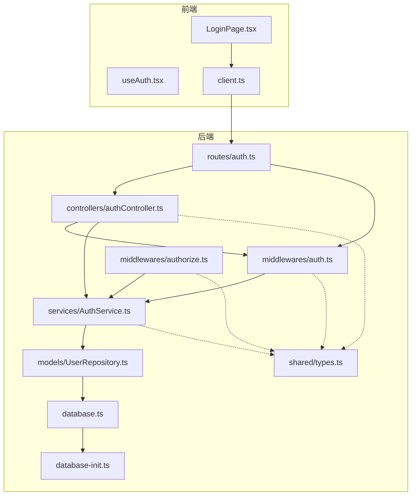
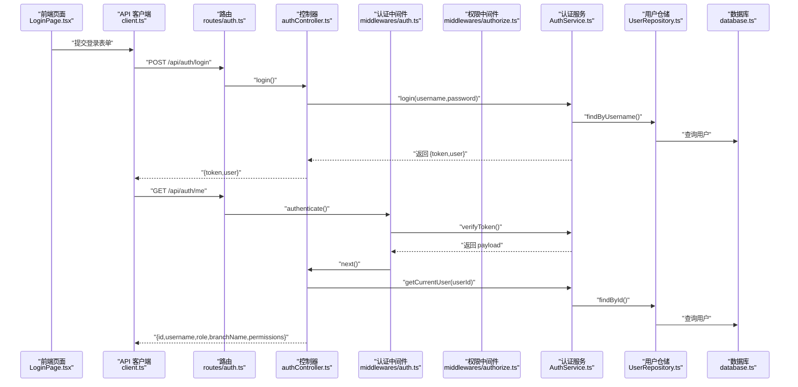
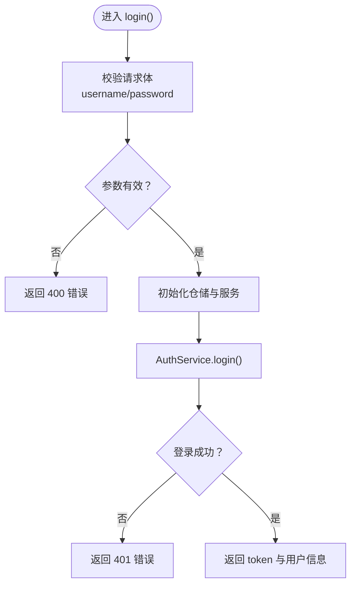
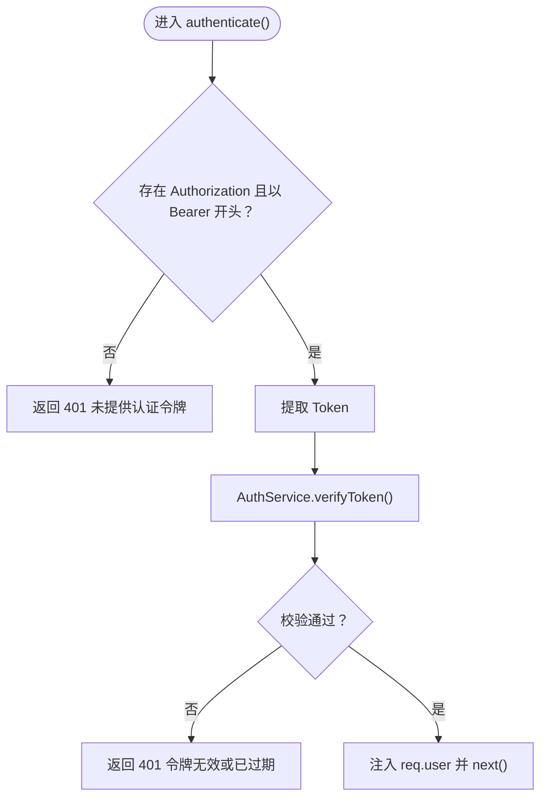
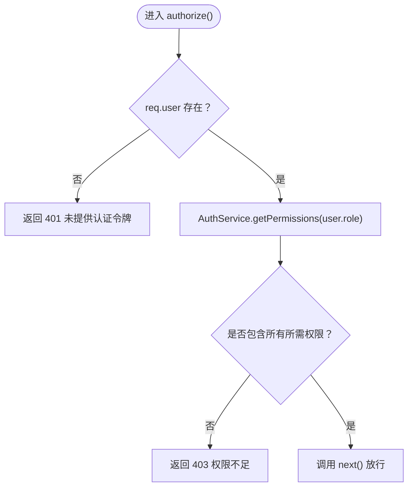
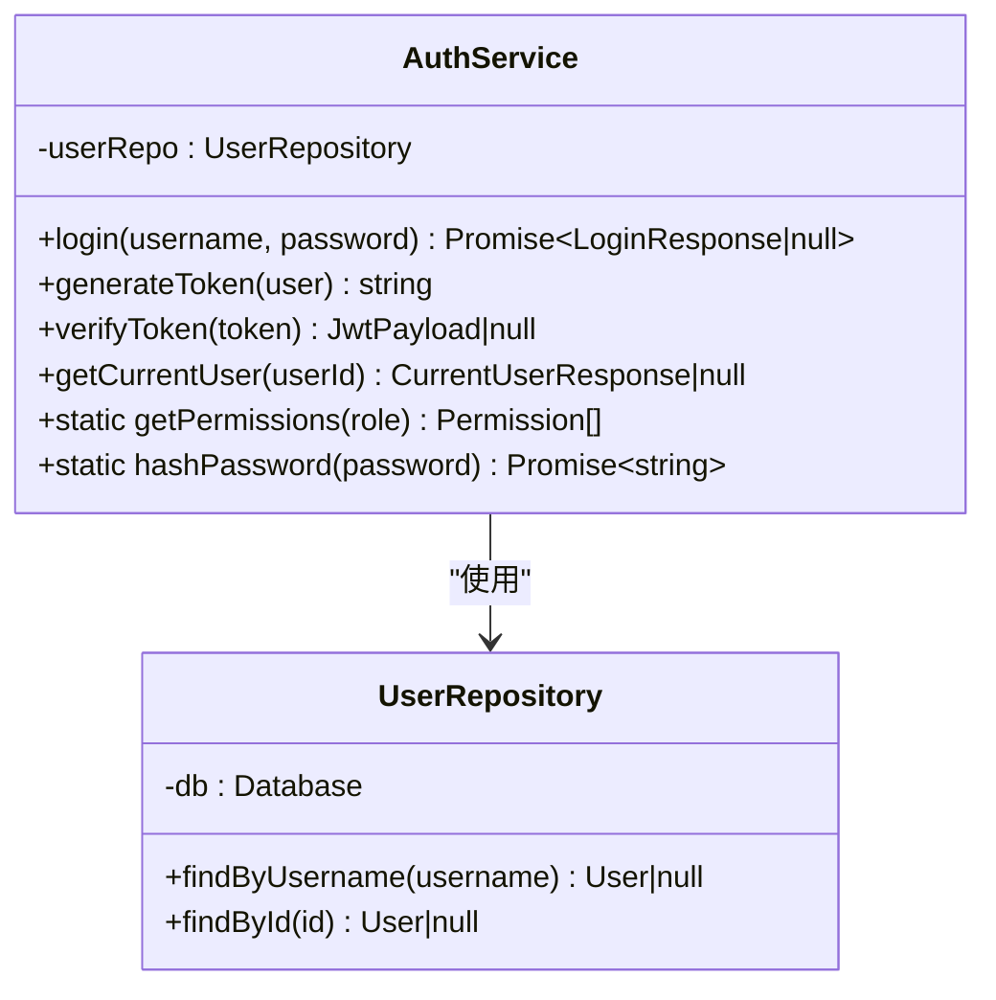
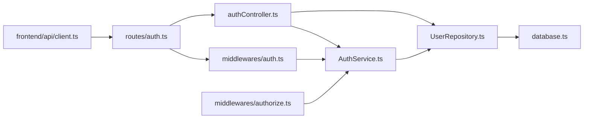

# 认证控制器

<cite>
**本文引用的文件**
- [backend/src/controllers/authController.ts](file://backend/src/controllers/authController.ts)
- [backend/src/middlewares/auth.ts](file://backend/src/middlewares/auth.ts)
- [backend/src/middlewares/authorize.ts](file://backend/src/middlewares/authorize.ts)
- [backend/src/services/AuthService.ts](file://backend/src/services/AuthService.ts)
- [backend/src/models/UserRepository.ts](file://backend/src/models/UserRepository.ts)
- [backend/src/routes/auth.ts](file://backend/src/routes/auth.ts)
- [backend/src/database.ts](file://backend/src/database.ts)
- [backend/src/database-init.ts](file://backend/src/database-init.ts)
- [shared/types.ts](file://shared/types.ts)
- [backend/tests/unit/auth.test.ts](file://backend/tests/unit/auth.test.ts)
- [backend/tests/unit/authorize.test.ts](file://backend/tests/unit/authorize.test.ts)
- [frontend/src/hooks/useAuth.tsx](file://frontend/src/hooks/useAuth.tsx)
- [frontend/src/pages/LoginPage.tsx](file://frontend/src/pages/LoginPage.tsx)
- [frontend/src/api/client.ts](file://frontend/src/api/client.ts)
</cite>

## 目录
1. [简介](#简介)
2. [项目结构](#项目结构)
3. [核心组件](#核心组件)
4. [架构总览](#架构总览)
5. [详细组件分析](#详细组件分析)
6. [依赖关系分析](#依赖关系分析)
7. [性能考量](#性能考量)
8. [故障排查指南](#故障排查指南)
9. [结论](#结论)
10. [附录](#附录)

## 简介
本文件面向认证控制器与相关中间件、服务、仓储及前端集成的整体技术文档，重点覆盖以下内容：
- authController 的登录与“获取当前用户”能力
- JWT 令牌的生成、验证与刷新策略
- 认证中间件 authenticate 与权限中间件 authorize 的工作原理
- 用户凭据验证流程、密码加密处理与会话管理策略
- 错误处理机制、安全考虑与性能优化建议
- 控制器测试用例编写指南与常见问题解决方案

## 项目结构
后端采用分层架构：路由层负责注册端点；控制器层处理请求与响应；中间件层负责认证与授权；服务层封装业务逻辑；仓储层负责数据访问；共享类型定义前后端共用。

图表来源
- [backend/src/routes/auth.ts:1-19](file://backend/src/routes/auth.ts#L1-L19)
- [backend/src/controllers/authController.ts:1-77](file://backend/src/controllers/authController.ts#L1-L77)
- [backend/src/middlewares/auth.ts:1-56](file://backend/src/middlewares/auth.ts#L1-L56)
- [backend/src/middlewares/authorize.ts:1-47](file://backend/src/middlewares/authorize.ts#L1-L47)
- [backend/src/services/AuthService.ts:1-126](file://backend/src/services/AuthService.ts#L1-L126)
- [backend/src/models/UserRepository.ts:1-56](file://backend/src/models/UserRepository.ts#L1-L56)
- [backend/src/database.ts:1-87](file://backend/src/database.ts#L1-L87)
- [backend/src/database-init.ts:1-65](file://backend/src/database-init.ts#L1-L65)
- [shared/types.ts:1-289](file://shared/types.ts#L1-L289)

章节来源
- [backend/src/routes/auth.ts:1-19](file://backend/src/routes/auth.ts#L1-L19)
- [backend/src/controllers/authController.ts:1-77](file://backend/src/controllers/authController.ts#L1-L77)
- [backend/src/middlewares/auth.ts:1-56](file://backend/src/middlewares/auth.ts#L1-L56)
- [backend/src/middlewares/authorize.ts:1-47](file://backend/src/middlewares/authorize.ts#L1-L47)
- [backend/src/services/AuthService.ts:1-126](file://backend/src/services/AuthService.ts#L1-L126)
- [backend/src/models/UserRepository.ts:1-56](file://backend/src/models/UserRepository.ts#L1-L56)
- [backend/src/database.ts:1-87](file://backend/src/database.ts#L1-L87)
- [backend/src/database-init.ts:1-65](file://backend/src/database-init.ts#L1-L65)
- [shared/types.ts:1-289](file://shared/types.ts#L1-L289)

## 核心组件
- 认证控制器（authController）
  - 登录接口：接收用户名与密码，校验后返回 JWT 与用户信息
  - 获取当前用户接口：基于已认证用户上下文，返回用户信息与权限列表
- 认证中间件（authenticate）
  - 从 Authorization 请求头解析 Bearer Token，验证后将用户信息注入请求上下文
- 权限中间件（authorize）
  - 在 authenticate 之后使用，校验当前用户角色是否具备所需权限
- 认证服务（AuthService）
  - 登录验证、JWT 生成与校验、当前用户信息与权限查询、密码哈希
- 用户仓储（UserRepository）
  - 基于 better-sqlite3 的用户查询（按用户名与 ID）
- 路由（auth.ts）
  - 注册登录与“当前用户”端点，绑定中间件

章节来源
- [backend/src/controllers/authController.ts:12-76](file://backend/src/controllers/authController.ts#L12-L76)
- [backend/src/middlewares/auth.ts:21-55](file://backend/src/middlewares/auth.ts#L21-L55)
- [backend/src/middlewares/authorize.ts:16-46](file://backend/src/middlewares/authorize.ts#L16-L46)
- [backend/src/services/AuthService.ts:32-125](file://backend/src/services/AuthService.ts#L32-L125)
- [backend/src/models/UserRepository.ts:31-55](file://backend/src/models/UserRepository.ts#L31-L55)
- [backend/src/routes/auth.ts:10-18](file://backend/src/routes/auth.ts#L10-L18)

## 架构总览
下图展示从前端到后端的完整认证链路，包括登录、令牌携带、认证与授权校验、以及错误处理。

图表来源
- [frontend/src/pages/LoginPage.tsx:36-59](file://frontend/src/pages/LoginPage.tsx#L36-L59)
- [frontend/src/api/client.ts:10-17](file://frontend/src/api/client.ts#L10-L17)
- [backend/src/routes/auth.ts:12-16](file://backend/src/routes/auth.ts#L12-L16)
- [backend/src/controllers/authController.ts:16-76](file://backend/src/controllers/authController.ts#L16-L76)
- [backend/src/middlewares/auth.ts:26-55](file://backend/src/middlewares/auth.ts#L26-L55)
- [backend/src/middlewares/authorize.ts:16-46](file://backend/src/middlewares/authorize.ts#L16-L46)
- [backend/src/services/AuthService.ts:43-110](file://backend/src/services/AuthService.ts#L43-L110)
- [backend/src/models/UserRepository.ts:38-54](file://backend/src/models/UserRepository.ts#L38-L54)
- [backend/src/database.ts:25-52](file://backend/src/database.ts#L25-L52)

## 详细组件分析

### 认证控制器（authController）
- 登录接口
  - 输入：用户名与密码
  - 校验：必填参数校验
  - 业务：通过 AuthService 执行登录，返回 token 与用户基础信息
  - 错误：参数缺失返回 400；登录失败返回 401
- 获取当前用户接口
  - 输入：已由 authenticate 中间件注入的用户上下文
  - 业务：通过 AuthService.getCurrentUser 返回用户信息与权限列表
  - 错误：未认证返回 401；用户不存在返回 404

图表来源
- [backend/src/controllers/authController.ts:16-43](file://backend/src/controllers/authController.ts#L16-L43)
- [backend/src/services/AuthService.ts:43-65](file://backend/src/services/AuthService.ts#L43-L65)

章节来源
- [backend/src/controllers/authController.ts:12-76](file://backend/src/controllers/authController.ts#L12-L76)

### 认证中间件（authenticate）
- 功能：从 Authorization 头解析 Bearer Token，调用 AuthService.verifyToken 校验，成功后将用户信息注入 req.user 并放行
- 错误：未提供或格式不正确返回 401；校验失败返回 401

图表来源
- [backend/src/middlewares/auth.ts:26-55](file://backend/src/middlewares/auth.ts#L26-L55)
- [backend/src/services/AuthService.ts:85-92](file://backend/src/services/AuthService.ts#L85-L92)

章节来源
- [backend/src/middlewares/auth.ts:11-55](file://backend/src/middlewares/auth.ts#L11-L55)

### 权限中间件（authorize）
- 功能：在 authenticate 之后使用，根据用户角色计算权限集合，要求用户具备全部所需权限
- 错误：无用户上下文返回 401；缺少任一权限返回 403

图表来源
- [backend/src/middlewares/authorize.ts:16-46](file://backend/src/middlewares/authorize.ts#L16-L46)
- [backend/src/services/AuthService.ts:115-117](file://backend/src/services/AuthService.ts#L115-L117)

章节来源
- [backend/src/middlewares/authorize.ts:10-46](file://backend/src/middlewares/authorize.ts#L10-L46)

### 认证服务（AuthService）
- 登录验证：按用户名查询用户，使用 bcrypt 校验密码，成功后生成 JWT
- JWT 生成与校验：使用对称密钥（JWT_SECRET），默认过期时间为 8 小时
- 当前用户：按 ID 查询用户并附加权限列表
- 权限映射：静态映射不同角色对应的权限集合
- 密码哈希：提供静态方法用于创建用户时的密码哈希

图表来源
- [backend/src/services/AuthService.ts:32-125](file://backend/src/services/AuthService.ts#L32-L125)
- [backend/src/models/UserRepository.ts:31-55](file://backend/src/models/UserRepository.ts#L31-L55)

章节来源
- [backend/src/services/AuthService.ts:11-125](file://backend/src/services/AuthService.ts#L11-L125)

### 用户仓储（UserRepository）
- 提供按用户名与 ID 查询用户的方法，内部完成数据库行到领域对象的转换

章节来源
- [backend/src/models/UserRepository.ts:31-55](file://backend/src/models/UserRepository.ts#L31-L55)

### 路由（auth.ts）
- 注册登录与“当前用户”端点，其中“当前用户”端点绑定 authenticate 中间件

章节来源
- [backend/src/routes/auth.ts:10-18](file://backend/src/routes/auth.ts#L10-L18)

### 数据库与初始化
- 单例数据库连接，启用 WAL 模式与外键约束，首次访问时执行初始化 SQL
- 初始化脚本创建 users、archive_records、status_change_logs 表，并建立必要索引

章节来源
- [backend/src/database.ts:25-86](file://backend/src/database.ts#L25-L86)
- [backend/src/database-init.ts:8-64](file://backend/src/database-init.ts#L8-L64)

### 前端集成
- useAuth：提供认证上下文，持久化 token 与用户信息，按角色补全权限
- LoginPage：发起登录请求，接收 token 与用户信息，跳转至对应角色首页
- API 客户端：统一设置 baseURL，请求自动注入 Authorization 头，响应 401 自动清空本地凭证并跳转登录

章节来源
- [frontend/src/hooks/useAuth.tsx:34-90](file://frontend/src/hooks/useAuth.tsx#L34-L90)
- [frontend/src/pages/LoginPage.tsx:24-81](file://frontend/src/pages/LoginPage.tsx#L24-L81)
- [frontend/src/api/client.ts:5-55](file://frontend/src/api/client.ts#L5-L55)

## 依赖关系分析
- 控制器依赖服务与仓储，服务依赖仓储与数据库连接
- 认证中间件依赖服务进行令牌校验
- 权限中间件依赖服务进行权限映射
- 路由层串联控制器与中间件
- 前端通过 API 客户端与后端交互

图表来源
- [backend/src/controllers/authController.ts:6-9](file://backend/src/controllers/authController.ts#L6-L9)
- [backend/src/middlewares/auth.ts:6-9](file://backend/src/middlewares/auth.ts#L6-L9)
- [backend/src/middlewares/authorize.ts:6-8](file://backend/src/middlewares/authorize.ts#L6-L8)
- [backend/src/services/AuthService.ts:6-8](file://backend/src/services/AuthService.ts#L6-L8)
- [backend/src/models/UserRepository.ts:6](file://backend/src/models/UserRepository.ts#L6)
- [backend/src/database.ts:8](file://backend/src/database.ts#L8)
- [frontend/src/api/client.ts:1-8](file://frontend/src/api/client.ts#L1-L8)
- [backend/src/routes/auth.ts:6-8](file://backend/src/routes/auth.ts#L6-L8)

章节来源
- [backend/src/controllers/authController.ts:6-9](file://backend/src/controllers/authController.ts#L6-L9)
- [backend/src/middlewares/auth.ts:6-9](file://backend/src/middlewares/auth.ts#L6-L9)
- [backend/src/middlewares/authorize.ts:6-8](file://backend/src/middlewares/authorize.ts#L6-L8)
- [backend/src/services/AuthService.ts:6-8](file://backend/src/services/AuthService.ts#L6-L8)
- [backend/src/models/UserRepository.ts:6](file://backend/src/models/UserRepository.ts#L6)
- [backend/src/database.ts:8](file://backend/src/database.ts#L8)
- [frontend/src/api/client.ts:1-8](file://frontend/src/api/client.ts#L1-L8)
- [backend/src/routes/auth.ts:6-8](file://backend/src/routes/auth.ts#L6-L8)

## 性能考量
- 数据库
  - WAL 模式提升并发读写性能
  - 外键约束保障一致性
  - 初始化时一次性执行建表与索引创建
- 令牌
  - 默认 8 小时过期，平衡安全性与用户体验
  - 建议生产环境使用短有效期 + 刷新令牌策略（见“最佳实践”）
- 密码哈希
  - bcrypt 成本因子 10，在可用性与安全性之间取得平衡
- 建议
  - 对高频查询的用户信息可引入进程内缓存（如 LRU）
  - 对令牌校验失败的请求增加限流策略

[本节为通用指导，无需特定文件来源]

## 故障排查指南
- 登录失败
  - 现象：返回 401，消息提示用户名或密码错误
  - 排查：确认用户名存在、密码正确、数据库连接正常
- 未认证访问受保护资源
  - 现象：返回 401，消息提示未提供认证令牌或令牌无效
  - 排查：确认请求头包含有效的 Bearer Token，令牌未过期
- 权限不足
  - 现象：返回 403，消息提示权限不足
  - 排查：确认用户角色具备所需权限，权限映射正确
- 用户不存在
  - 现象：返回 404，消息提示用户不存在
  - 排查：确认用户 ID 正确，数据库中存在对应记录
- 前端 401 自动跳转
  - 现象：响应 401 后自动清除本地凭证并跳转登录页
  - 排查：确认 API 客户端拦截器配置正确

章节来源
- [backend/src/controllers/authController.ts:20-42](file://backend/src/controllers/authController.ts#L20-L42)
- [backend/src/middlewares/auth.ts:29-50](file://backend/src/middlewares/auth.ts#L29-L50)
- [backend/src/middlewares/authorize.ts:19-42](file://backend/src/middlewares/authorize.ts#L19-L42)
- [backend/src/services/AuthService.ts:85-92](file://backend/src/services/AuthService.ts#L85-L92)
- [frontend/src/api/client.ts:20-52](file://frontend/src/api/client.ts#L20-L52)

## 结论
本认证体系以清晰的分层设计实现了登录、令牌校验与权限控制，结合前端拦截器形成闭环。建议在生产环境中完善令牌刷新与黑名单机制、增强日志审计与异常监控，并持续优化数据库索引与缓存策略。

[本节为总结，无需特定文件来源]

## 附录

### JWT 令牌生成、验证与刷新机制
- 生成
  - 使用对称密钥（JWT_SECRET）与 8 小时过期时间生成 token
- 验证
  - 校验签名与过期时间，失败返回 null
- 刷新
  - 当前实现未提供刷新接口；建议引入短期 access token + 长期 refresh token 的组合方案，并在服务端维护 refresh token 黑名单

章节来源
- [backend/src/services/AuthService.ts:70-92](file://backend/src/services/AuthService.ts#L70-L92)
- [backend/src/services/AuthService.ts:11-15](file://backend/src/services/AuthService.ts#L11-L15)

### 用户凭据验证流程与密码加密
- 凭据验证
  - 控制器先做参数校验，再委托服务层执行登录
- 密码加密
  - bcrypt 对称哈希，成本因子 10
  - 创建用户时使用静态方法生成哈希

章节来源
- [backend/src/controllers/authController.ts:19-42](file://backend/src/controllers/authController.ts#L19-L42)
- [backend/src/services/AuthService.ts:49-52](file://backend/src/services/AuthService.ts#L49-L52)
- [backend/src/services/AuthService.ts:122-124](file://backend/src/services/AuthService.ts#L122-L124)

### 会话管理策略
- 无服务端会话：基于 JWT 无状态认证
- 前端持久化：localStorage 存储 token 与用户信息
- 请求注入：API 客户端自动在请求头添加 Authorization

章节来源
- [frontend/src/hooks/useAuth.tsx:24-73](file://frontend/src/hooks/useAuth.tsx#L24-L73)
- [frontend/src/api/client.ts:10-17](file://frontend/src/api/client.ts#L10-L17)

### 中间件使用模式与最佳实践
- 认证中间件
  - 仅用于需要鉴权的端点；确保在控制器之前注册
- 权限中间件
  - 必须在认证中间件之后使用；尽量在路由层集中声明
- 最佳实践
  - 明确区分“认证”与“授权”职责
  - 对关键操作使用多权限校验
  - 对令牌校验失败的请求实施限流

章节来源
- [backend/src/routes/auth.ts:12-16](file://backend/src/routes/auth.ts#L12-L16)
- [backend/src/middlewares/auth.ts:26-55](file://backend/src/middlewares/auth.ts#L26-L55)
- [backend/src/middlewares/authorize.ts:16-46](file://backend/src/middlewares/authorize.ts#L16-L46)

### 错误处理机制
- 统一错误响应结构：包含 code 与 message
- 常见状态码
  - 400：请求参数无效
  - 401：未认证或令牌无效
  - 403：权限不足
  - 404：资源不存在
- 前端拦截
  - 401 自动清理本地凭证并跳转登录页

章节来源
- [backend/src/controllers/authController.ts:20-42](file://backend/src/controllers/authController.ts#L20-L42)
- [backend/src/middlewares/auth.ts:29-50](file://backend/src/middlewares/auth.ts#L29-L50)
- [backend/src/middlewares/authorize.ts:19-42](file://backend/src/middlewares/authorize.ts#L19-L42)
- [frontend/src/api/client.ts:29-41](file://frontend/src/api/client.ts#L29-L41)

### 安全考虑
- 密钥管理
  - JWT_SECRET 建议来自环境变量，避免硬编码
- 传输安全
  - 建议仅在 HTTPS 下传输，防止中间人攻击
- 令牌泄露
  - 建议缩短过期时间并引入刷新令牌与黑名单
- 输入校验
  - 前端与后端均需进行参数校验与长度限制

章节来源
- [backend/src/services/AuthService.ts:11-12](file://backend/src/services/AuthService.ts#L11-L12)
- [backend/src/controllers/authController.ts:19-26](file://backend/src/controllers/authController.ts#L19-L26)

### 性能优化建议
- 数据库
  - 使用 WAL 模式与外键约束
  - 为高频查询字段建立索引
- 缓存
  - 对用户权限与常用查询结果进行缓存
- 令牌
  - 短有效期 + 刷新令牌，降低长期持有风险
- 日志与监控
  - 记录认证与授权事件，便于审计与异常追踪

章节来源
- [backend/src/database.ts:41-45](file://backend/src/database.ts#L41-L45)
- [backend/src/database.ts:47-48](file://backend/src/database.ts#L47-L48)
- [backend/src/database-init.ts:42-47](file://backend/src/database-init.ts#L42-L47)

### 控制器测试用例编写指南
- AuthService
  - 覆盖登录成功/失败、令牌生成与校验、当前用户信息、权限映射、密码哈希
- authorize 中间件
  - 覆盖权限满足/缺失、无用户上下文、多权限校验、不同角色权限差异
- 测试要点
  - 使用内存数据库进行隔离测试
  - 模拟请求与响应对象，断言状态码与响应体
  - 注意边界条件（空用户名、错误密码、无效角色）

章节来源
- [backend/tests/unit/auth.test.ts:45-162](file://backend/tests/unit/auth.test.ts#L45-L162)
- [backend/tests/unit/authorize.test.ts:34-204](file://backend/tests/unit/authorize.test.ts#L34-L204)

### 常见问题与解决方案
- 问题：登录成功但前端无法携带 token
  - 解决：确认 API 客户端请求拦截器已注入 Authorization 头
- 问题：受保护接口仍返回 401
  - 解决：确认路由已绑定 authenticate 中间件，且请求头格式为 Bearer
- 问题：权限校验总是失败
  - 解决：确认用户角色与权限映射一致，权限字符串大小写与顺序正确
- 问题：数据库连接失败
  - 解决：确认数据库文件路径与初始化 SQL 成功执行

章节来源
- [frontend/src/api/client.ts:10-17](file://frontend/src/api/client.ts#L10-L17)
- [backend/src/routes/auth.ts:15-16](file://backend/src/routes/auth.ts#L15-L16)
- [backend/src/middlewares/auth.ts:27-37](file://backend/src/middlewares/auth.ts#L27-L37)
- [backend/src/services/AuthService.ts:25-30](file://backend/src/services/AuthService.ts#L25-L30)
- [backend/src/database.ts:25-52](file://backend/src/database.ts#L25-L52)
- [backend/src/database-init.ts:8-64](file://backend/src/database-init.ts#L8-L64)