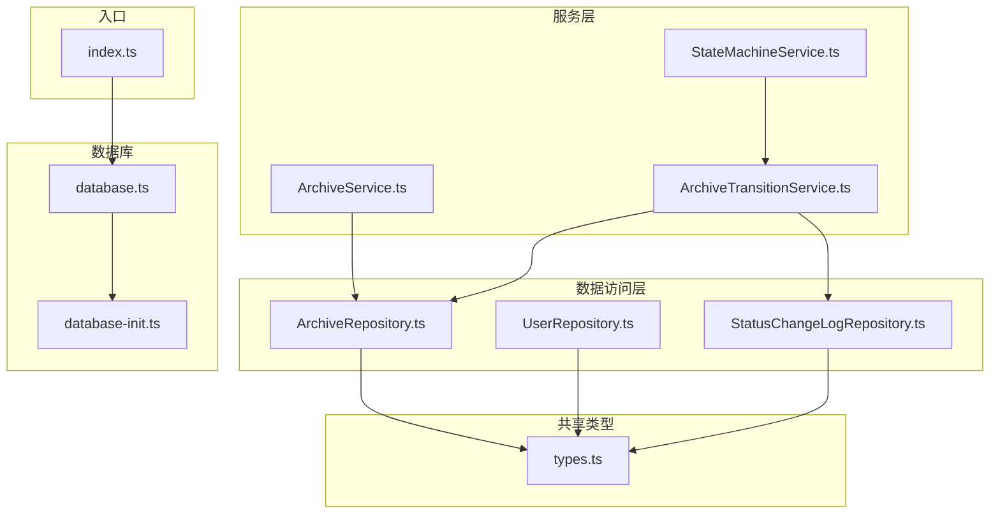
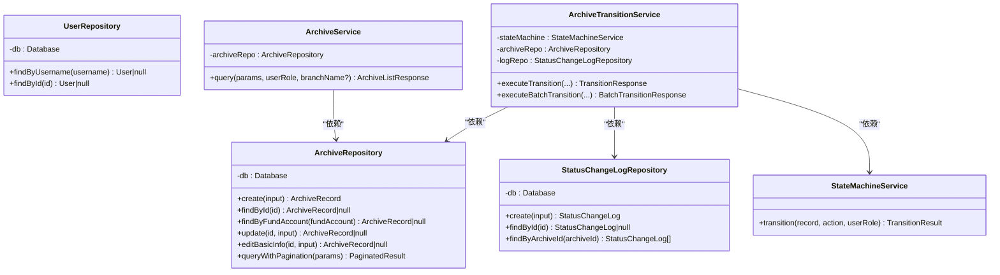
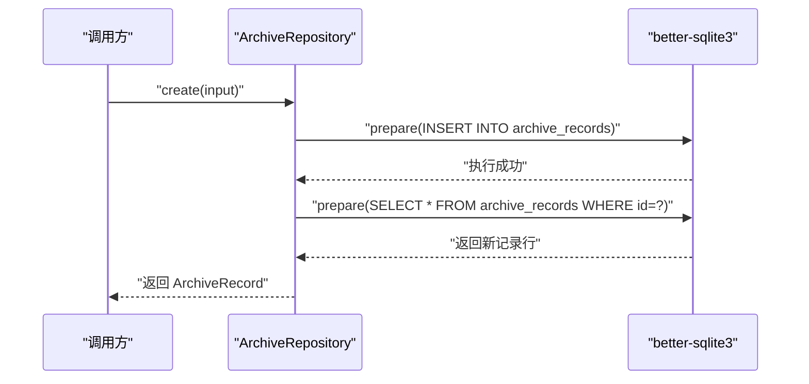
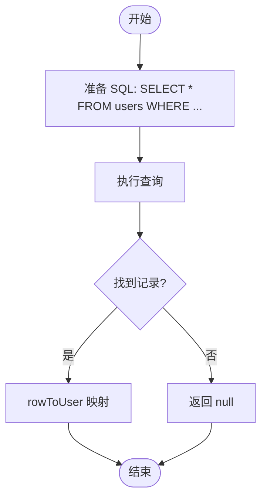
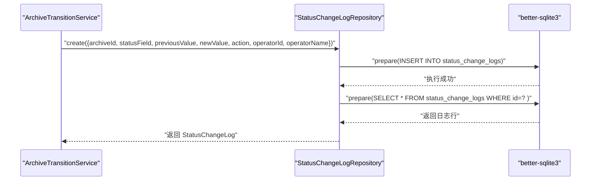
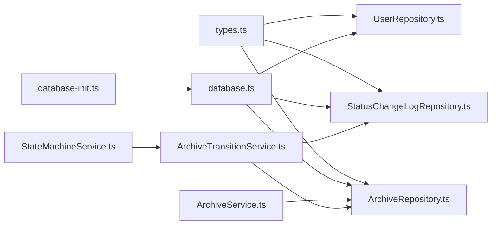

# 数据访问层

<cite>
**本文引用的文件**
- [ArchiveRepository.ts](file://backend/src/models/ArchiveRepository.ts)
- [UserRepository.ts](file://backend/src/models/UserRepository.ts)
- [StatusChangeLogRepository.ts](file://backend/src/models/StatusChangeLogRepository.ts)
- [database.ts](file://backend/src/database.ts)
- [database-init.ts](file://backend/src/database-init.ts)
- [types.ts](file://shared/types.ts)
- [ArchiveService.ts](file://backend/src/services/ArchiveService.ts)
- [ArchiveTransitionService.ts](file://backend/src/services/ArchiveTransitionService.ts)
- [StateMachineService.ts](file://backend/src/services/StateMachineService.ts)
- [repositories.test.ts](file://backend/tests/unit/repositories.test.ts)
- [index.ts](file://backend/src/index.ts)
- [package.json](file://backend/package.json)
</cite>

## 目录
1. [简介](#简介)
2. [项目结构](#项目结构)
3. [核心组件](#核心组件)
4. [架构总览](#架构总览)
5. [组件详解](#组件详解)
6. [依赖关系分析](#依赖关系分析)
7. [性能与优化](#性能与优化)
8. [故障排查指南](#故障排查指南)
9. [结论](#结论)
10. [附录](#附录)

## 简介
本文件聚焦于数据访问层（Repository Layer），系统性阐述 Repository 模式的理念与实现，覆盖数据访问抽象、数据库操作封装、查询方法、事务与连接管理现状、SQL 优化与索引设计建议、数据一致性保障机制，以及单元测试策略与 Mock 对象使用方法。重点文档化以下三个 Repository 的职责与能力：
- ArchiveRepository：档案数据的增删改查与分页查询
- UserRepository：用户信息的查询
- StatusChangeLogRepository：状态变更日志的写入与查询

## 项目结构
数据访问层位于后端工程的 models 目录，配合 shared/types 提供统一的数据模型与枚举；数据库连接与初始化位于 database.ts 与 database-init.ts；服务层通过 ArchiveService、ArchiveTransitionService、StateMachineService 与 Repository 协作。

**图表来源**
- [index.ts:20-36](file://backend/src/index.ts#L20-L36)
- [database.ts:25-52](file://backend/src/database.ts#L25-L52)
- [database-init.ts:8-64](file://backend/src/database-init.ts#L8-L64)
- [ArchiveRepository.ts:85-307](file://backend/src/models/ArchiveRepository.ts#L85-L307)
- [UserRepository.ts:31-56](file://backend/src/models/UserRepository.ts#L31-L56)
- [StatusChangeLogRepository.ts:49-99](file://backend/src/models/StatusChangeLogRepository.ts#L49-L99)
- [ArchiveService.ts:19-71](file://backend/src/services/ArchiveService.ts#L19-L71)
- [ArchiveTransitionService.ts:24-156](file://backend/src/services/ArchiveTransitionService.ts#L24-L156)
- [StateMachineService.ts:96-253](file://backend/src/services/StateMachineService.ts#L96-L253)

**章节来源**
- [index.ts:1-39](file://backend/src/index.ts#L1-L39)
- [database.ts:1-87](file://backend/src/database.ts#L1-L87)
- [database-init.ts:1-65](file://backend/src/database-init.ts#L1-L65)

## 核心组件
- ArchiveRepository：负责档案记录的创建、查询、部分更新、基础信息编辑、以及基于多条件的分页查询。
- UserRepository：负责用户按用户名与 ID 的查询。
- StatusChangeLogRepository：负责状态变更日志的创建、按 ID 查询与按档案 ID 查询历史。

这些 Repository 以 better-sqlite3 作为数据库驱动，通过 prepare/run 执行 SQL，返回与 shared/types 中一致的接口对象。

**章节来源**
- [ArchiveRepository.ts:85-307](file://backend/src/models/ArchiveRepository.ts#L85-L307)
- [UserRepository.ts:31-56](file://backend/src/models/UserRepository.ts#L31-L56)
- [StatusChangeLogRepository.ts:49-99](file://backend/src/models/StatusChangeLogRepository.ts#L49-L99)
- [types.ts:46-83](file://shared/types.ts#L46-L83)

## 架构总览
Repository 层与服务层解耦，服务层负责业务编排与权限校验，Repository 层专注数据持久化。数据库连接采用单例模式，初始化时启用 WAL 模式与外键约束，并创建表结构与索引。

**图表来源**
- [ArchiveRepository.ts:85-307](file://backend/src/models/ArchiveRepository.ts#L85-L307)
- [UserRepository.ts:31-56](file://backend/src/models/UserRepository.ts#L31-L56)
- [StatusChangeLogRepository.ts:49-99](file://backend/src/models/StatusChangeLogRepository.ts#L49-L99)
- [ArchiveService.ts:19-71](file://backend/src/services/ArchiveService.ts#L19-L71)
- [ArchiveTransitionService.ts:24-156](file://backend/src/services/ArchiveTransitionService.ts#L24-L156)
- [StateMachineService.ts:96-253](file://backend/src/services/StateMachineService.ts#L96-L253)

## 组件详解

### ArchiveRepository：档案数据访问
- 设计理念
  - 以“领域对象”为中心：对外暴露 ArchiveRecord 接口，内部使用 snake_case 的数据库行结构，通过 rowToRecord 映射。
  - 参数化 SQL：使用 prepare/run 防止注入，动态拼接 SET 子句实现部分更新。
  - 分页查询：支持多条件组合查询，先 COUNT 再 LIMIT/OFFSET，确保结果与总数一致。
- 关键方法
  - create：生成 UUID，填充时间戳，插入后立即查询返回最新记录。
  - findById/findByFundAccount：按主键与唯一键查询。
  - update：仅对传入的字段进行更新，自动更新 updated_at。
  - editBasicInfo：编辑基础信息字段，同样自动更新 updated_at。
  - queryWithPagination：支持客户名模糊匹配、资金账号精确匹配、营业部、合同类型、主流程状态、归档状态、合同版本类型、开户日期范围等多条件组合。
- 数据一致性
  - 使用 better-sqlite3 的单事务语义，每个 SQL 执行在当前连接上下文中原子完成。
  - 外键约束在初始化脚本中启用，确保日志表对档案记录的引用有效。

**图表来源**
- [ArchiveRepository.ts:93-120](file://backend/src/models/ArchiveRepository.ts#L93-L120)
- [database-init.ts:19-40](file://backend/src/database-init.ts#L19-L40)

**章节来源**
- [ArchiveRepository.ts:85-307](file://backend/src/models/ArchiveRepository.ts#L85-L307)
- [types.ts:46-60](file://shared/types.ts#L46-L60)

### UserRepository：用户信息查询
- 设计理念
  - 最小化查询面：仅提供按用户名与 ID 的查询，便于鉴权与权限控制。
  - 类型安全：返回 User 接口，字段名与数据库行一致，通过 rowToUser 映射。
- 关键方法
  - findByUsername：按唯一用户名查询。
  - findById：按主键查询。

**图表来源**
- [UserRepository.ts:38-54](file://backend/src/models/UserRepository.ts#L38-L54)

**章节来源**
- [UserRepository.ts:31-56](file://backend/src/models/UserRepository.ts#L31-L56)
- [types.ts:75-83](file://shared/types.ts#L75-L83)

### StatusChangeLogRepository：状态变更日志
- 设计理念
  - 记录每次状态变更的“变更字段、前值、新值、动作、操作人、时间”，支持按档案 ID 回溯历史。
  - 通过外键约束关联档案记录，保证日志与档案的强一致性。
- 关键方法
  - create：生成日志 ID，写入日志表，返回最新日志。
  - findById：按主键查询。
  - findByArchiveId：按档案 ID 查询并按时间倒序排列。

**图表来源**
- [StatusChangeLogRepository.ts:56-79](file://backend/src/models/StatusChangeLogRepository.ts#L56-L79)
- [database-init.ts:49-64](file://backend/src/database-init.ts#L49-L64)
- [ArchiveTransitionService.ts:95-119](file://backend/src/services/ArchiveTransitionService.ts#L95-L119)

**章节来源**
- [StatusChangeLogRepository.ts:49-99](file://backend/src/models/StatusChangeLogRepository.ts#L49-L99)
- [types.ts:62-73](file://shared/types.ts#L62-L73)

### 服务层协作与事务处理
- 事务处理现状
  - 当前未显式开启事务块；每个 Repository 方法内为单条 SQL 执行，具备单条语句的原子性。
  - 在状态流转场景中，ArchiveTransitionService 会先查询记录、再调用状态机校验、更新档案、写入日志，属于跨多个 Repository 的业务流程，但未包裹在同一事务中。
- 建议
  - 对于跨 Repository 的业务流程（如状态流转），可在服务层引入事务块，确保“校验—更新—记录日志”的原子性。
  - 使用 better-sqlite3 的事务 API 包裹关键流程，失败则回滚。

**章节来源**
- [ArchiveTransitionService.ts:46-125](file://backend/src/services/ArchiveTransitionService.ts#L46-L125)

## 依赖关系分析
- Repository 依赖 shared/types 的接口与枚举，确保前后端一致。
- 数据库连接由 database.ts 提供，采用单例模式；初始化脚本 database-init.ts 创建表与索引。
- 服务层依赖 Repository，实现业务规则与权限控制。

**图表来源**
- [types.ts:46-83](file://shared/types.ts#L46-L83)
- [database.ts:25-52](file://backend/src/database.ts#L25-L52)
- [database-init.ts:8-64](file://backend/src/database-init.ts#L8-L64)
- [ArchiveRepository.ts:85-307](file://backend/src/models/ArchiveRepository.ts#L85-L307)
- [UserRepository.ts:31-56](file://backend/src/models/UserRepository.ts#L31-L56)
- [StatusChangeLogRepository.ts:49-99](file://backend/src/models/StatusChangeLogRepository.ts#L49-L99)
- [ArchiveService.ts:19-71](file://backend/src/services/ArchiveService.ts#L19-L71)
- [ArchiveTransitionService.ts:24-156](file://backend/src/services/ArchiveTransitionService.ts#L24-L156)
- [StateMachineService.ts:96-253](file://backend/src/services/StateMachineService.ts#L96-L253)

**章节来源**
- [package.json:14-23](file://backend/package.json#L14-L23)

## 性能与优化
- 索引设计
  - 已创建 archive_records 上的 fund_account、branch_name、status、archive_status、contract_version_type 等索引，有利于高频查询。
  - 已创建 status_change_logs 上的 archive_id 索引，支持按档案 ID 快速检索日志。
- SQL 查询优化建议
  - 分页查询：已使用 LIMIT/OFFSET，建议在高频查询列上建立复合索引（如 branch_name+status）以减少排序成本。
  - LIKE 模糊匹配：customerName 的 LIKE '%keyword%' 无法使用索引，建议考虑全文检索或前缀索引策略。
  - 字段选择：尽量避免 SELECT *，明确列出所需列，减少网络与解析开销。
- 连接与并发
  - WAL 模式已启用，提升并发读写性能；生产环境建议配合只读连接池与连接数限制。
- 数据一致性
  - 外键约束已启用，确保日志对档案记录的引用有效；建议在关键业务流程中引入事务，保证多步操作原子性。

**章节来源**
- [database-init.ts:42-48](file://backend/src/database-init.ts#L42-L48)
- [database-init.ts:62-64](file://backend/src/database-init.ts#L62-L64)
- [database.ts:41-45](file://backend/src/database.ts#L41-L45)

## 故障排查指南
- 常见问题定位
  - 查询为空：确认查询条件是否正确，特别是资金账号唯一性与模糊匹配的边界。
  - 状态流转失败：检查状态机规则与用户角色是否匹配，电子版合同与完结状态的保护逻辑。
  - 日志缺失：确认外键是否存在，日志写入是否在状态变更成功后执行。
- 单元测试策略
  - 使用内存数据库（:memory:）进行隔离测试，避免相互污染。
  - Mock 外部依赖（如状态机）以验证 Repository 的行为。
  - 覆盖边界条件：空更新、无匹配记录、日期范围、多条件组合等。
- 测试文件参考
  - ArchiveRepository：创建、查询、更新、分页查询、多条件组合。
  - UserRepository：按用户名与 ID 查询。
  - StatusChangeLogRepository：创建、按 ID 与按档案 ID 查询。

**章节来源**
- [repositories.test.ts:13-243](file://backend/tests/unit/repositories.test.ts#L13-L243)
- [repositories.test.ts:245-303](file://backend/tests/unit/repositories.test.ts#L245-L303)
- [repositories.test.ts:305-403](file://backend/tests/unit/repositories.test.ts#L305-L403)

## 结论
本数据访问层以 Repository 模式清晰分离了数据持久化与业务逻辑，结合 better-sqlite3 的高效执行与 WAL 模式，在 SQLite 场景下提供了良好的性能与可靠性。通过完善的索引与类型安全的接口，提升了查询效率与开发体验。建议在关键业务流程中引入事务，进一步增强一致性与容错能力。

## 附录
- 数据库初始化脚本与表结构定义
- 服务层与状态机协作流程
- 单元测试示例与断言要点

**章节来源**
- [database-init.ts:8-64](file://backend/src/database-init.ts#L8-L64)
- [StateMachineService.ts:96-253](file://backend/src/services/StateMachineService.ts#L96-L253)
- [repositories.test.ts:1-404](file://backend/tests/unit/repositories.test.ts#L1-L404)