# 档案记录仓储

<cite>
**本文档引用的文件**
- [ArchiveRepository.ts](file://backend/src/models/ArchiveRepository.ts)
- [ArchiveService.ts](file://backend/src/services/ArchiveService.ts)
- [archiveController.ts](file://backend/src/controllers/archiveController.ts)
- [archive.ts](file://backend/src/routes/archive.ts)
- [types.ts](file://shared/types.ts)
- [database.ts](file://backend/src/database.ts)
- [database-init.ts](file://backend/src/database-init.ts)
- [repositories.test.ts](file://backend/tests/unit/repositories.test.ts)
- [archiveQuery.test.ts](file://backend/tests/unit/archiveQuery.test.ts)
</cite>

## 目录
1. [简介](#简介)
2. [项目结构](#项目结构)
3. [核心组件](#核心组件)
4. [架构概览](#架构概览)
5. [详细组件分析](#详细组件分析)
6. [依赖关系分析](#依赖关系分析)
7. [性能考虑](#性能考虑)
8. [故障排除指南](#故障排除指南)
9. [结论](#结论)
10. [附录](#附录)

## 简介
本文档深入分析档案记录仓储系统，重点解释ArchiveRepository类的设计与实现。该系统基于SQLite数据库，采用better-sqlite3作为ORM，实现了完整的档案记录CRUD操作、分页查询和复杂条件过滤功能。系统支持多种查询条件组合，包括模糊匹配、精确匹配和日期范围查询，并提供了完善的数据模型映射机制。

## 项目结构
档案记录仓储系统采用典型的三层架构设计，包含数据访问层、业务服务层和表现层：

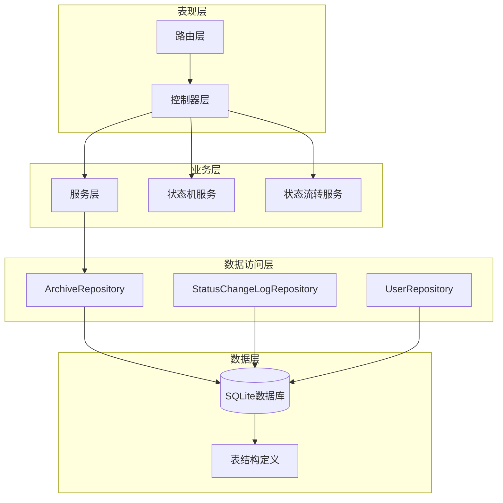

**图表来源**
- [archive.ts:1-42](file://backend/src/routes/archive.ts#L1-L42)
- [archiveController.ts:1-448](file://backend/src/controllers/archiveController.ts#L1-L448)
- [ArchiveRepository.ts:85-307](file://backend/src/models/ArchiveRepository.ts#L85-L307)

**章节来源**
- [archive.ts:1-42](file://backend/src/routes/archive.ts#L1-L42)
- [archiveController.ts:1-448](file://backend/src/controllers/archiveController.ts#L1-L448)
- [database.ts:1-87](file://backend/src/database.ts#L1-L87)

## 核心组件
档案记录仓储系统的核心组件包括：

### 数据模型映射
系统实现了完整的数据模型映射机制，将数据库行转换为强类型的JavaScript对象：

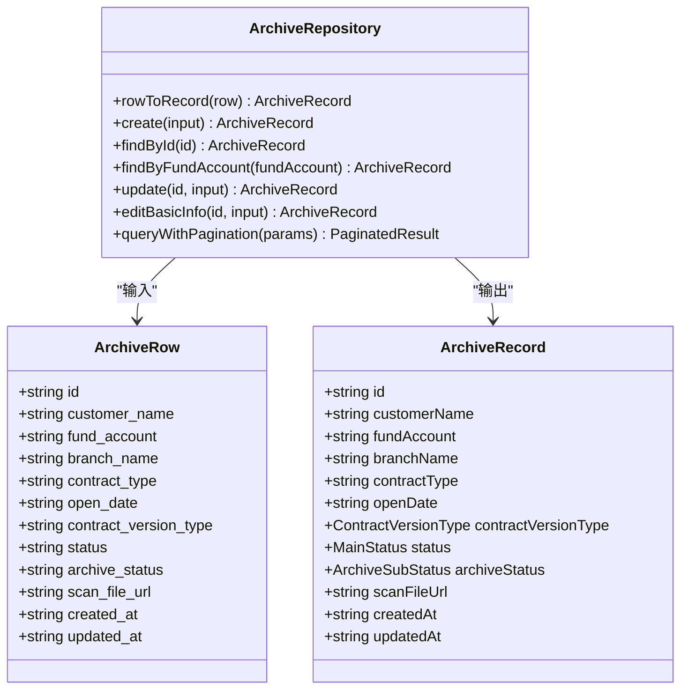

**图表来源**
- [ArchiveRepository.ts:17-48](file://backend/src/models/ArchiveRepository.ts#L17-L48)
- [ArchiveRepository.ts:32-48](file://backend/src/models/ArchiveRepository.ts#L32-L48)

### 查询参数接口
系统定义了完整的查询参数接口，支持多维度的条件筛选：

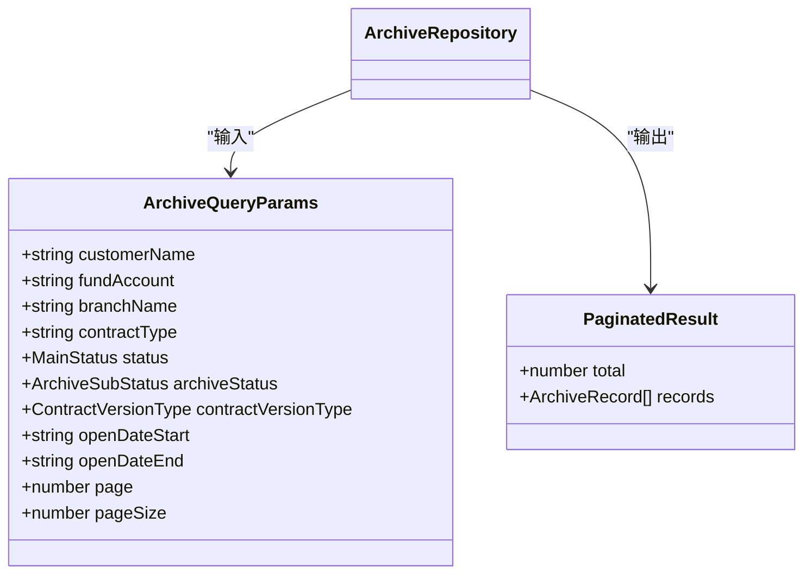

**图表来源**
- [types.ts:144-156](file://shared/types.ts#L144-L156)
- [ArchiveRepository.ts:79-83](file://backend/src/models/ArchiveRepository.ts#L79-L83)

**章节来源**
- [ArchiveRepository.ts:17-48](file://backend/src/models/ArchiveRepository.ts#L17-L48)
- [types.ts:46-60](file://shared/types.ts#L46-L60)
- [types.ts:144-156](file://shared/types.ts#L144-L156)

## 架构概览
档案记录仓储系统采用分层架构设计，各层职责清晰分离：

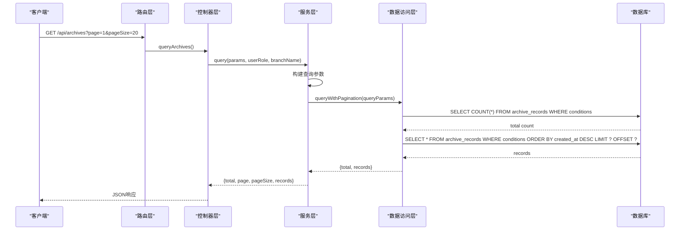

**图表来源**
- [archive.ts:17-18](file://backend/src/routes/archive.ts#L17-L18)
- [archiveController.ts:99-147](file://backend/src/controllers/archiveController.ts#L99-L147)
- [ArchiveService.ts:33-69](file://backend/src/services/ArchiveService.ts#L33-L69)
- [ArchiveRepository.ts:228-305](file://backend/src/models/ArchiveRepository.ts#L228-L305)

系统架构特点：
- **分层清晰**：路由层负责HTTP请求处理，控制器层处理业务逻辑，服务层协调数据访问，仓储层负责数据持久化
- **数据隔离**：服务层根据用户角色进行数据权限控制
- **参数验证**：控制器层进行输入参数验证和错误处理
- **事务管理**：使用SQLite的WAL模式提升并发性能

**章节来源**
- [archiveController.ts:99-147](file://backend/src/controllers/archiveController.ts#L99-L147)
- [ArchiveService.ts:33-69](file://backend/src/services/ArchiveService.ts#L33-L69)
- [database.ts:41-45](file://backend/src/database.ts#L41-L45)

## 详细组件分析

### ArchiveRepository类设计
ArchiveRepository是档案记录仓储的核心类，实现了完整的CRUD操作和查询功能：

#### 数据模型映射函数
`rowToRecord`函数负责将数据库行转换为强类型的数据模型：

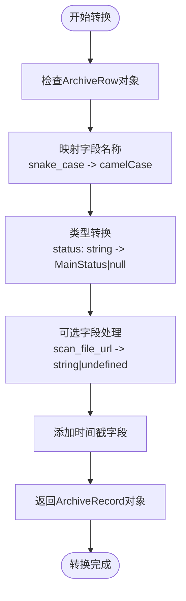

**图表来源**
- [ArchiveRepository.ts:32-48](file://backend/src/models/ArchiveRepository.ts#L32-L48)

#### CRUD操作实现

##### 创建档案记录
创建操作支持电子版和纸质版两种合同类型，自动设置初始状态：

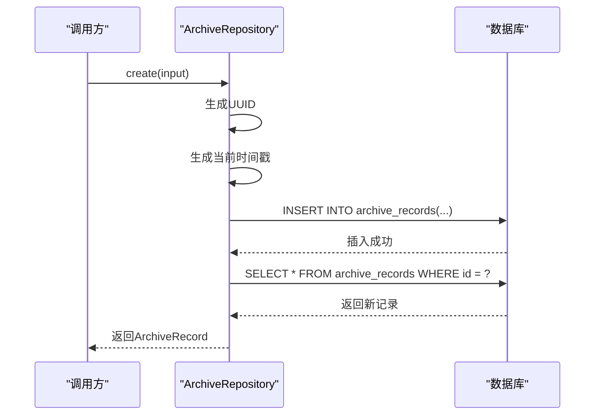

**图表来源**
- [ArchiveRepository.ts:93-120](file://backend/src/models/ArchiveRepository.ts#L93-L120)

##### 查询操作
系统提供多种查询方式：

1. **按ID查询**：使用精确匹配查询单条记录
2. **按资金账号查询**：基于唯一索引的快速查询
3. **分页查询**：支持复杂的多条件组合查询

**章节来源**
- [ArchiveRepository.ts:93-120](file://backend/src/models/ArchiveRepository.ts#L93-L120)
- [ArchiveRepository.ts:123-138](file://backend/src/models/ArchiveRepository.ts#L123-L138)
- [ArchiveRepository.ts:228-305](file://backend/src/models/ArchiveRepository.ts#L228-L305)

#### 动态查询构建机制
查询条件的动态构建是系统的核心特性之一：

```mermaid
flowchart TD
Start([开始查询]) --> InitVars["初始化条件数组和参数数组"]
InitVars --> CheckCustomerName{"customerName存在?"}
CheckCustomerName --> |是| AddLike["添加LIKE条件<br/>customer_name LIKE ?"]
CheckCustomerName --> |否| CheckFundAccount{"fundAccount存在?"}
AddLike --> CheckFundAccount
CheckFundAccount --> |是| AddEq["添加=条件<br/>fund_account = ?"]
CheckFundAccount --> |否| CheckBranchName{"branchName存在?"}
AddEq --> CheckBranchName
CheckBranchName --> |是| AddEq2["添加=条件<br/>branch_name = ?"]
CheckBranchName --> |否| CheckContractType{"contractType存在?"}
AddEq2 --> CheckContractType
CheckContractType --> |是| AddEq3["添加=条件<br/>contract_type = ?"]
CheckContractType --> |否| CheckStatus{"status存在?"}
AddEq3 --> CheckStatus
CheckStatus --> |是| AddEq4["添加=条件<br/>status = ?"]
CheckStatus --> |否| CheckArchiveStatus{"archiveStatus存在?"}
AddEq4 --> CheckArchiveStatus
CheckArchiveStatus --> |是| AddEq5["添加=条件<br/>archive_status = ?"]
CheckArchiveStatus --> |否| CheckContractVersion{"contractVersionType存在?"}
AddEq5 --> CheckContractVersion
CheckContractVersion --> |是| AddEq6["添加=条件<br/>contract_version_type = ?"]
CheckContractVersion --> |否| CheckOpenDateStart{"openDateStart存在?"}
AddEq6 --> CheckOpenDateStart
CheckOpenDateStart --> |是| AddGte["添加>=条件<br/>open_date >= ?"]
CheckOpenDateStart --> |否| CheckOpenDateEnd{"openDateEnd存在?"}
AddGte --> CheckOpenDateEnd
CheckOpenDateEnd --> |是| AddLte["添加<=条件<br/>open_date <= ?"]
CheckOpenDateEnd --> |否| BuildWhere["构建WHERE子句"]
AddLte --> BuildWhere
BuildWhere --> BuildCount["构建COUNT查询"]
BuildCount --> ExecuteCount["执行COUNT查询"]
ExecuteCount --> BuildSelect["构建SELECT查询"]
BuildSelect --> ExecuteSelect["执行SELECT查询"]
ExecuteSelect --> MapResults["映射结果到ArchiveRecord"]
MapResults --> ReturnResults["返回PaginatedResult"]
ReturnResults --> End([查询完成])
```

**图表来源**
- [ArchiveRepository.ts:228-305](file://backend/src/models/ArchiveRepository.ts#L228-L305)

**章节来源**
- [ArchiveRepository.ts:228-305](file://backend/src/models/ArchiveRepository.ts#L228-L305)

#### 更新操作实现
系统支持部分更新和完整更新两种模式：

1. **状态更新**：仅更新主流程状态和归档状态
2. **基本信息编辑**：更新客户姓名、资金账号、营业部等基础信息

更新操作的特点：
- 自动更新`updated_at`时间戳
- 支持单字段或多字段同时更新
- 返回更新后的完整记录

**章节来源**
- [ArchiveRepository.ts:140-174](file://backend/src/models/ArchiveRepository.ts#L140-L174)
- [ArchiveRepository.ts:176-220](file://backend/src/models/ArchiveRepository.ts#L176-L220)

### 查询条件详解

#### 模糊匹配实现
客户姓名的模糊匹配使用LIKE操作符，支持中间匹配：

```sql
customer_name LIKE '%张%'
```

这种设计允许用户通过部分姓名进行搜索，提高了查询的灵活性。

#### 精确匹配实现
除客户姓名外的所有条件都使用精确匹配：

```sql
fund_account = ?
branch_name = ?
contract_type = ?
status = ?
archive_status = ?
contract_version_type = ?
```

精确匹配确保查询结果的准确性，避免不必要的数据泄露。

#### 日期范围查询
开户日期范围查询支持灵活的时间筛选：

```sql
open_date >= ? AND open_date <= ?
```

系统支持只指定开始日期或结束日期，实现半开区间查询。

**章节来源**
- [ArchiveRepository.ts:232-282](file://backend/src/models/ArchiveRepository.ts#L232-L282)

## 依赖关系分析

### 外部依赖
系统主要依赖以下外部库：

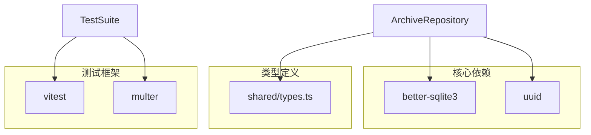

**图表来源**
- [ArchiveRepository.ts:6-14](file://backend/src/models/ArchiveRepository.ts#L6-L14)
- [repositories.test.ts:7-11](file://backend/tests/unit/repositories.test.ts#L7-L11)

### 内部依赖关系
系统内部组件之间的依赖关系：

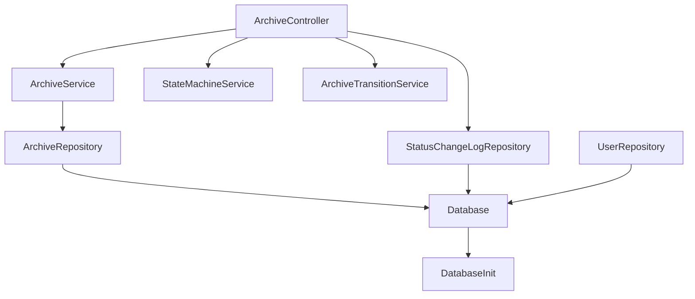

**图表来源**
- [archiveController.ts:8-23](file://backend/src/controllers/archiveController.ts#L8-L23)
- [ArchiveService.ts:6-24](file://backend/src/services/ArchiveService.ts#L6-L24)
- [database.ts:11](file://backend/src/database.ts#L11)

**章节来源**
- [archiveController.ts:8-23](file://backend/src/controllers/archiveController.ts#L8-L23)
- [ArchiveService.ts:6-24](file://backend/src/services/ArchiveService.ts#L6-L24)
- [database.ts:11](file://backend/src/database.ts#L11)

## 性能考虑

### 数据库优化策略
系统采用了多项数据库性能优化措施：

1. **WAL模式**：启用Write-Ahead Logging模式提升并发读写性能
2. **外键约束**：启用外键检查确保数据完整性
3. **索引优化**：为常用查询字段建立索引

### 查询性能优化
针对查询操作的性能优化：

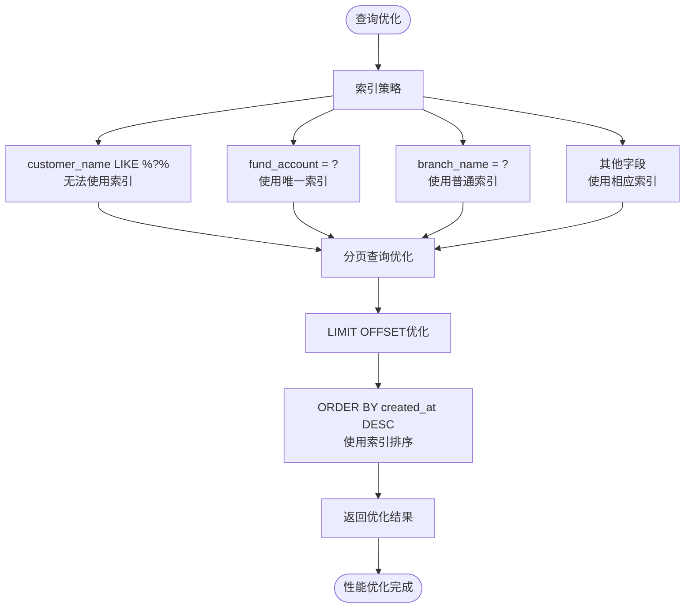

**图表来源**
- [database-init.ts:42-47](file://backend/src/database-init.ts#L42-L47)
- [ArchiveRepository.ts:297-299](file://backend/src/models/ArchiveRepository.ts#L297-L299)

### 内存数据库测试
系统使用内存数据库进行单元测试，提高测试速度：

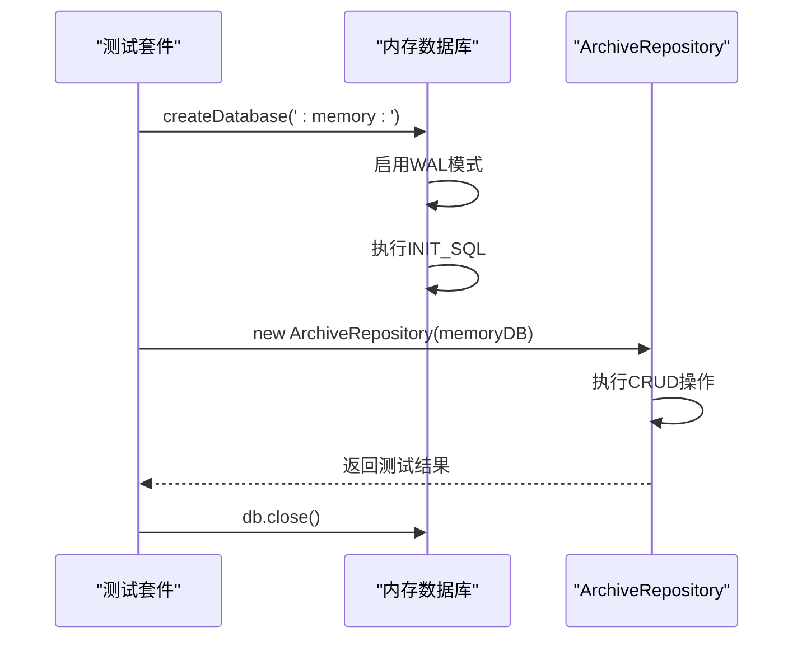

**图表来源**
- [repositories.test.ts:17-24](file://backend/tests/unit/repositories.test.ts#L17-L24)
- [archiveQuery.test.ts:12-18](file://backend/tests/unit/archiveQuery.test.ts#L12-L18)

**章节来源**
- [database.ts:41-45](file://backend/src/database.ts#L41-L45)
- [database-init.ts:42-47](file://backend/src/database-init.ts#L42-L47)
- [repositories.test.ts:17-24](file://backend/tests/unit/repositories.test.ts#L17-L24)

## 故障排除指南

### 常见错误类型
系统定义了多种错误类型用于处理不同场景：

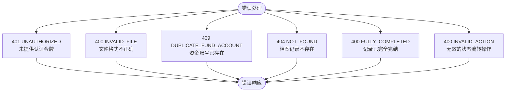

**图表来源**
- [archiveController.ts:43-71](file://backend/src/controllers/archiveController.ts#L43-L71)
- [archiveController.ts:330-396](file://backend/src/controllers/archiveController.ts#L330-L396)
- [archiveController.ts:403-447](file://backend/src/controllers/archiveController.ts#L403-L447)

### SQL注入防护
系统通过以下机制防止SQL注入攻击：

1. **参数化查询**：所有用户输入都通过参数绑定机制传递
2. **预编译语句**：使用prepare方法创建预编译语句
3. **输入验证**：控制器层对输入参数进行严格验证

### 数据一致性保证
系统通过以下方式保证数据一致性：

1. **原子性操作**：每个CRUD操作都是原子性的
2. **外键约束**：数据库层面的外键约束
3. **事务支持**：SQLite的ACID事务特性

**章节来源**
- [archiveController.ts:43-71](file://backend/src/controllers/archiveController.ts#L43-L71)
- [archiveController.ts:330-396](file://backend/src/controllers/archiveController.ts#L330-L396)
- [archiveController.ts:403-447](file://backend/src/controllers/archiveController.ts#L403-L447)

## 结论
档案记录仓储系统是一个设计良好、功能完整的数据访问层实现。系统的主要优势包括：

1. **清晰的架构设计**：分层架构使得代码职责明确，易于维护
2. **强大的查询能力**：支持复杂的多条件组合查询，满足多样化的业务需求
3. **完善的错误处理**：全面的错误类型定义和处理机制
4. **优秀的性能表现**：通过索引优化、WAL模式和内存数据库测试提升性能
5. **安全可靠**：参数化查询和输入验证有效防止SQL注入攻击

系统在实际应用中能够高效地处理档案记录的全生命周期管理，为上层业务提供了稳定可靠的数据访问服务。

## 附录

### 单元测试示例
系统提供了完整的单元测试套件，涵盖所有核心功能：

#### 仓库层测试
```typescript
// 测试创建电子版档案记录
it('应创建电子版档案记录，status 为 null', () => {
  const record = repo.create({
    customerName: '李四',
    fundAccount: 'FA002',
    branchName: '上海营业部',
    contractType: '开户合同',
    openDate: '2024-02-01',
    contractVersionType: 'electronic',
    status: null,
    archiveStatus: 'archived',
  });

  expect(record.status).toBeNull();
  expect(record.archiveStatus).toBe('archived');
});
```

#### 服务层测试
```typescript
// 测试分支机构数据隔离
it('分支机构用户应自动过滤为本营业部数据', () => {
  insertRecord(db, { fundAccount: 'FA-BJ-1', branchName: '北京营业部' });
  insertRecord(db, { fundAccount: 'FA-SH-1', branchName: '上海营业部' });
  insertRecord(db, { fundAccount: 'FA-BJ-2', branchName: '北京营业部' });

  const result = service.query({}, 'branch', '北京营业部');
  expect(result.total).toBe(2);
  expect(result.records.every(r => r.branchName === '北京营业部')).toBe(true);
});
```

**章节来源**
- [repositories.test.ts:56-70](file://backend/tests/unit/repositories.test.ts#L56-L70)
- [archiveQuery.test.ts:97-105](file://backend/tests/unit/archiveQuery.test.ts#L97-L105)

### Mock数据库使用方法
系统提供了灵活的数据库配置选项：

```typescript
// 生产环境使用文件数据库
const db = getDatabase();

// 测试环境使用内存数据库
const memoryDB = createDatabase(':memory:');

// 自定义数据库路径
const customDB = createDatabase('./custom/path/archive.db');
```

这些配置选项使得系统能够在不同环境中灵活部署，既保证了生产环境的稳定性，又便于测试环境的快速搭建。