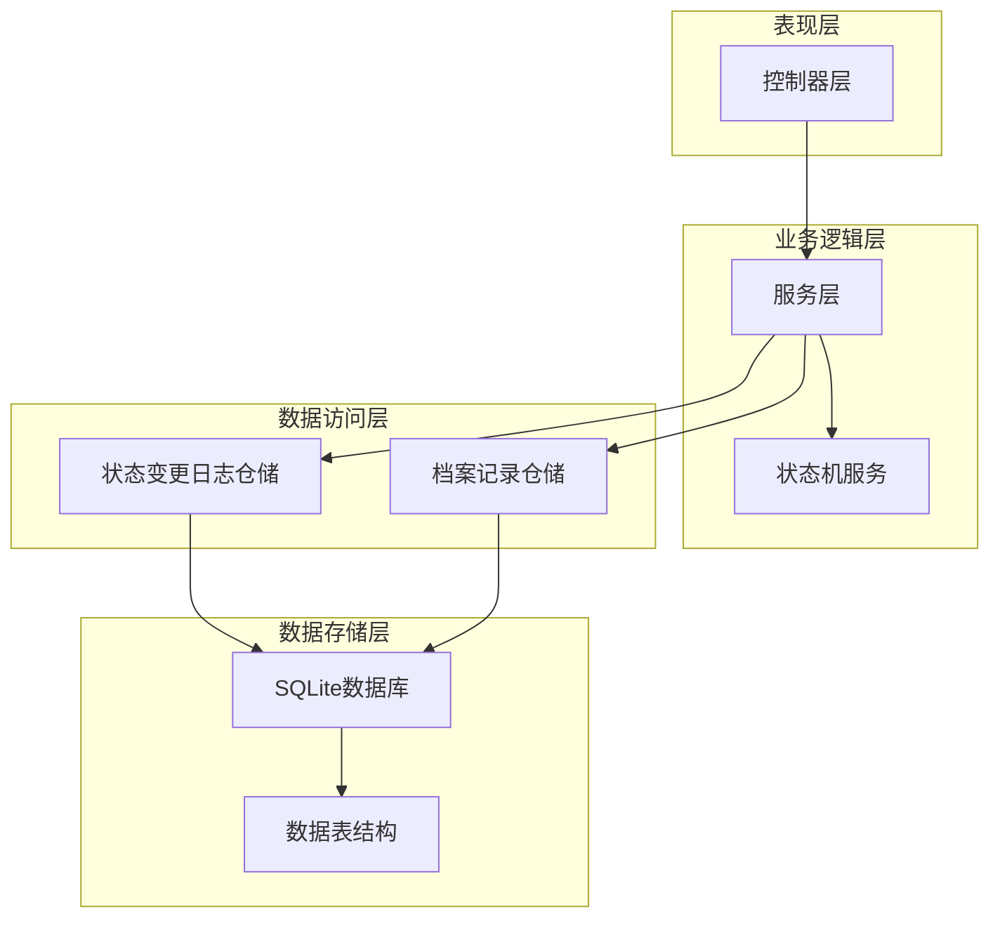
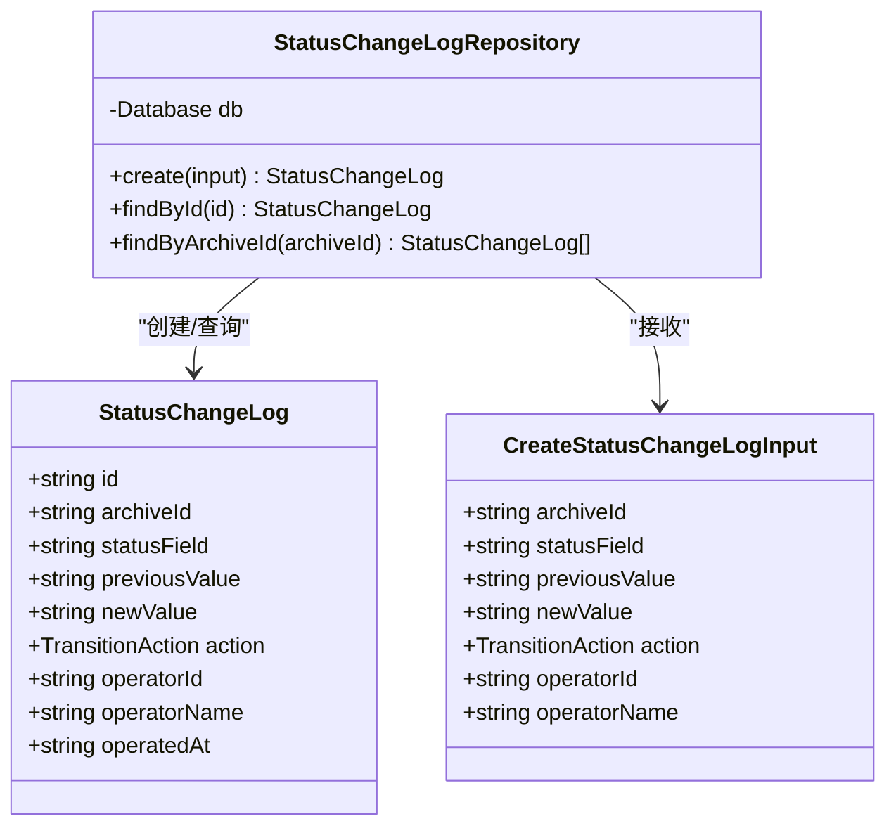
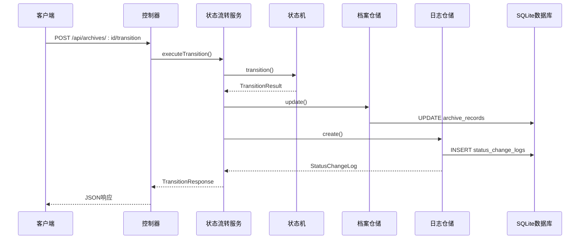
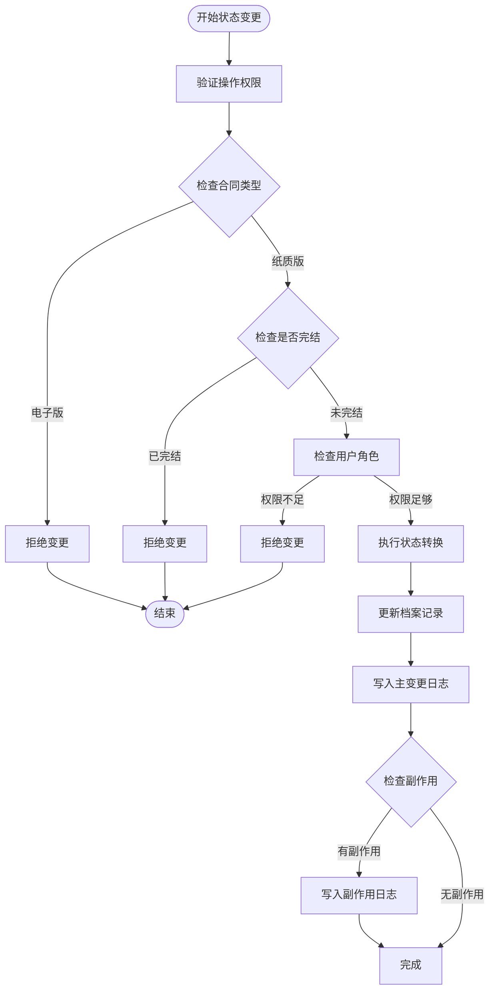
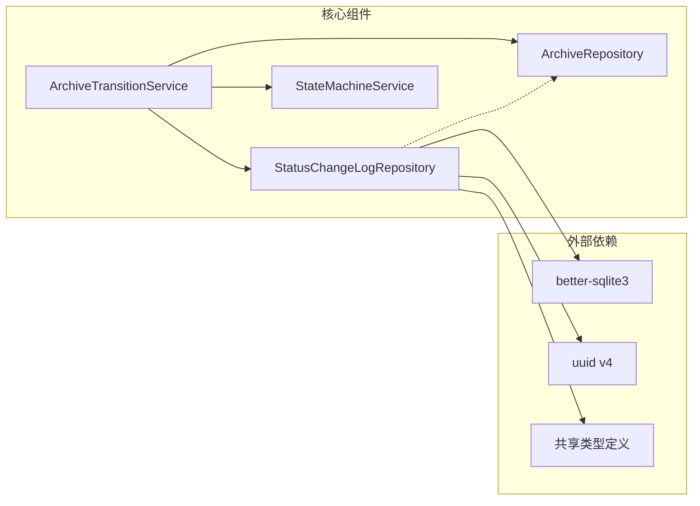
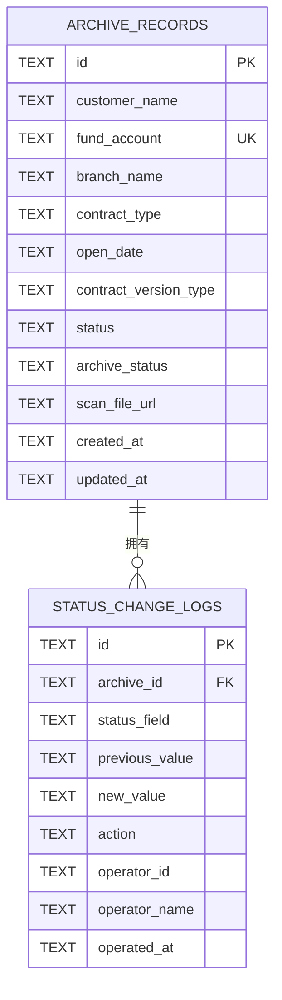

# 状态变更日志仓储

<cite>
**本文档引用的文件**
- [StatusChangeLogRepository.ts](file://backend/src/models/StatusChangeLogRepository.ts)
- [ArchiveRepository.ts](file://backend/src/models/ArchiveRepository.ts)
- [StateMachineService.ts](file://backend/src/services/StateMachineService.ts)
- [ArchiveTransitionService.ts](file://backend/src/services/ArchiveTransitionService.ts)
- [types.ts](file://shared/types.ts)
- [database-init.ts](file://backend/src/database-init.ts)
- [archiveController.ts](file://backend/src/controllers/archiveController.ts)
- [repositories.test.ts](file://backend/tests/unit/repositories.test.ts)
</cite>

## 目录
1. [简介](#简介)
2. [项目结构](#项目结构)
3. [核心组件](#核心组件)
4. [架构概览](#架构概览)
5. [详细组件分析](#详细组件分析)
6. [依赖关系分析](#依赖关系分析)
7. [性能考虑](#性能考虑)
8. [故障排除指南](#故障排除指南)
9. [结论](#结论)

## 简介

状态变更日志仓储（StatusChangeLogRepository）是档案管理系统中的关键组件，负责审计日志和状态追踪的核心功能。该组件实现了对档案记录状态变更的完整跟踪，包括主流程状态（status）和综合部归档状态（archive_status）的变更记录。

该仓储采用SQLite数据库作为存储引擎，通过better-sqlite3库提供高性能的数据访问能力。系统支持实时状态变更监控、历史追踪查询、批量操作审计等功能，为档案管理提供了完整的审计保障。

## 项目结构

档案管理系统采用清晰的分层架构，状态变更日志仓储位于数据访问层，与业务逻辑层和服务层紧密协作：

**图表来源**
- [archiveController.ts:150-188](file://backend/src/controllers/archiveController.ts#L150-L188)
- [ArchiveTransitionService.ts:24-37](file://backend/src/services/ArchiveTransitionService.ts#L24-L37)
- [StatusChangeLogRepository.ts:49-54](file://backend/src/models/StatusChangeLogRepository.ts#L49-L54)

**章节来源**
- [archiveController.ts:150-188](file://backend/src/controllers/archiveController.ts#L150-L188)
- [StatusChangeLogRepository.ts:1-99](file://backend/src/models/StatusChangeLogRepository.ts#L1-L99)

## 核心组件

### 状态变更日志仓储类

StatusChangeLogRepository是系统的核心数据访问组件，提供以下关键功能：

- **日志写入**：创建新的状态变更记录
- **日志查询**：按ID和档案ID查询状态变更历史
- **时间序列管理**：维护按时间排序的日志记录

该类采用单例模式设计，通过构造函数注入数据库连接实例，确保线程安全和资源管理。

### 数据模型定义

系统使用TypeScript接口定义数据结构，确保类型安全和开发效率：

**图表来源**
- [StatusChangeLogRepository.ts:24-36](file://backend/src/models/StatusChangeLogRepository.ts#L24-L36)
- [StatusChangeLogRepository.ts:39-47](file://backend/src/models/StatusChangeLogRepository.ts#L39-L47)
- [StatusChangeLogRepository.ts:49-98](file://backend/src/models/StatusChangeLogRepository.ts#L49-L98)

**章节来源**
- [StatusChangeLogRepository.ts:24-36](file://backend/src/models/StatusChangeLogRepository.ts#L24-L36)
- [StatusChangeLogRepository.ts:39-47](file://backend/src/models/StatusChangeLogRepository.ts#L39-L47)
- [StatusChangeLogRepository.ts:49-98](file://backend/src/models/StatusChangeLogRepository.ts#L49-L98)

## 架构概览

状态变更日志仓储在整个系统架构中扮演着审计和追踪的关键角色：

**图表来源**
- [archiveController.ts:208-258](file://backend/src/controllers/archiveController.ts#L208-L258)
- [ArchiveTransitionService.ts:46-125](file://backend/src/services/ArchiveTransitionService.ts#L46-L125)
- [StateMachineService.ts:106-142](file://backend/src/services/StateMachineService.ts#L106-L142)

该序列图展示了状态变更的完整流程，从用户请求到数据库持久化的全过程。

**章节来源**
- [archiveController.ts:208-258](file://backend/src/controllers/archiveController.ts#L208-L258)
- [ArchiveTransitionService.ts:46-125](file://backend/src/services/ArchiveTransitionService.ts#L46-L125)
- [StateMachineService.ts:106-142](file://backend/src/services/StateMachineService.ts#L106-L142)

## 详细组件分析

### 数据结构设计

#### 状态变更日志表结构

系统使用SQLite数据库存储状态变更信息，采用TEXT类型存储所有字段，通过CHECK约束确保数据完整性：

| 字段名 | 数据类型 | 约束条件 | 描述 |
|--------|----------|----------|------|
| id | TEXT | PRIMARY KEY | 日志主键，UUID格式 |
| archive_id | TEXT | NOT NULL, REFERENCES archive_records(id) | 关联档案记录ID |
| status_field | TEXT | NOT NULL | 状态字段名称（status/archive_status） |
| previous_value | TEXT | NULL | 变更前状态值 |
| new_value | TEXT | NOT NULL | 变更后状态值 |
| action | TEXT | NOT NULL | 触发操作类型 |
| operator_id | TEXT | NOT NULL | 操作员ID |
| operator_name | TEXT | NOT NULL | 操作员姓名 |
| operated_at | TEXT | DEFAULT datetime('now') | 操作时间 |

#### 索引优化策略

为了提升查询性能，系统建立了以下索引：

- **主索引**：基于主键的自动索引
- **archive_id索引**：加速按档案ID查询日志
- **operated_at索引**：支持时间序列查询

**章节来源**
- [database-init.ts:49-64](file://backend/src/database-init.ts#L49-L64)
- [StatusChangeLogRepository.ts:90-97](file://backend/src/models/StatusChangeLogRepository.ts#L90-L97)

### 持久化机制

#### 写入流程

状态变更日志的写入过程包含以下步骤：

1. **ID生成**：使用UUID v4算法生成唯一标识符
2. **时间戳记录**：获取当前UTC时间并格式化为字符串
3. **SQL执行**：通过预编译语句执行插入操作
4. **结果返回**：查询刚插入的记录并返回给调用者

#### 查询机制

系统提供两种主要查询方式：

1. **按ID查询**：用于获取特定日志记录的详细信息
2. **按档案ID查询**：获取指定档案的所有状态变更历史，按时间倒序排列

**章节来源**
- [StatusChangeLogRepository.ts:57-79](file://backend/src/models/StatusChangeLogRepository.ts#L57-L79)
- [StatusChangeLogRepository.ts:82-97](file://backend/src/models/StatusChangeLogRepository.ts#L82-L97)

### 日志格式规范

#### 时间序列管理

系统采用ISO 8601格式存储时间戳，确保全球时区兼容性和排序准确性：

- **格式**：YYYY-MM-DD HH:MM:SS
- **精度**：秒级精度
- **时区**：UTC时间存储

#### 状态字段映射

系统支持两种状态字段的变更追踪：

1. **主流程状态（status）**：8个状态值的完整生命周期
2. **综合部归档状态（archive_status）**：4个状态值的归档流程

**章节来源**
- [types.ts:14-42](file://shared/types.ts#L14-L42)
- [database-init.ts:28-36](file://backend/src/database-init.ts#L28-L36)

### 审计流程

#### 完整审计流程

**图表来源**
- [StateMachineService.ts:106-142](file://backend/src/services/StateMachineService.ts#L106-L142)
- [ArchiveTransitionService.ts:95-119](file://backend/src/services/ArchiveTransitionService.ts#L95-L119)

**章节来源**
- [StateMachineService.ts:106-142](file://backend/src/services/StateMachineService.ts#L106-L142)
- [ArchiveTransitionService.ts:95-119](file://backend/src/services/ArchiveTransitionService.ts#L95-L119)

## 依赖关系分析

### 组件耦合度

状态变更日志仓储与其他组件的依赖关系如下：

**图表来源**
- [StatusChangeLogRepository.ts:6-8](file://backend/src/models/StatusChangeLogRepository.ts#L6-L8)
- [ArchiveTransitionService.ts:18-22](file://backend/src/services/ArchiveTransitionService.ts#L18-L22)

### 外键关系设计

系统采用外键约束确保数据一致性：

**图表来源**
- [database-init.ts:20-40](file://backend/src/database-init.ts#L20-L40)
- [database-init.ts:49-60](file://backend/src/database-init.ts#L49-L60)

**章节来源**
- [database-init.ts:20-40](file://backend/src/database-init.ts#L20-L40)
- [database-init.ts:49-60](file://backend/src/database-init.ts#L49-L60)

## 性能考虑

### 查询性能优化

#### 索引策略

系统通过以下索引优化查询性能：

1. **主索引**：自动为PRIMARY KEY创建
2. **archive_id索引**：加速按档案ID查询
3. **operated_at索引**：支持时间序列查询

#### 查询优化建议

- **批量查询**：使用LIMIT和OFFSET实现分页
- **时间范围查询**：结合WHERE子句和ORDER BY优化
- **缓存策略**：对于频繁查询的结果可以考虑应用层缓存

### 大数据量处理

#### 存储优化

- **文本存储**：使用TEXT类型存储状态值，便于扩展
- **索引维护**：定期重建索引以保持查询性能
- **数据压缩**：考虑对历史数据进行归档存储

#### 清理策略

系统建议实施以下清理策略：

1. **时间限制**：保留最近N年的日志数据
2. **大小限制**：当日志表超过阈值时自动清理
3. **归档机制**：将历史数据移动到专门的归档表

**章节来源**
- [database-init.ts:63](file://backend/src/database-init.ts#L63)
- [StatusChangeLogRepository.ts:90-97](file://backend/src/models/StatusChangeLogRepository.ts#L90-L97)

## 故障排除指南

### 常见问题及解决方案

#### 外键约束错误

**问题描述**：尝试插入不存在的档案ID导致外键约束失败

**解决方案**：
1. 确保先创建档案记录再创建状态变更日志
2. 在事务中同时执行相关操作

#### 数据类型不匹配

**问题描述**：状态值不在允许的枚举范围内

**解决方案**：
1. 使用系统提供的状态转换表
2. 验证状态值的有效性

#### 性能问题

**问题描述**：大量日志查询导致性能下降

**解决方案**：
1. 实施适当的索引策略
2. 优化查询条件和分页参数
3. 考虑数据归档和清理

**章节来源**
- [repositories.test.ts:327-347](file://backend/tests/unit/repositories.test.ts#L327-L347)
- [repositories.test.ts:364-391](file://backend/tests/unit/repositories.test.ts#L364-L391)

### 异常处理机制

系统采用分层异常处理策略：

1. **业务层异常**：状态机校验失败时抛出明确的错误信息
2. **数据访问层异常**：数据库操作异常时提供详细的错误上下文
3. **控制器层异常**：统一处理HTTP响应和错误码

**章节来源**
- [StateMachineService.ts:106-142](file://backend/src/services/StateMachineService.ts#L106-L142)
- [archiveController.ts:244-252](file://backend/src/controllers/archiveController.ts#L244-L252)

## 结论

状态变更日志仓储作为档案管理系统的核心组件，通过以下关键特性确保了系统的可靠性和可追溯性：

### 技术优势

1. **完整的审计功能**：支持所有状态变更的完整追踪
2. **高性能设计**：基于SQLite的轻量级存储方案
3. **类型安全**：使用TypeScript确保开发时的类型安全
4. **灵活扩展**：支持自定义状态值和操作类型的扩展

### 最佳实践建议

1. **索引优化**：根据实际查询模式调整索引策略
2. **数据清理**：建立定期的数据清理和归档机制
3. **监控告警**：实施日志查询性能监控
4. **备份策略**：确保审计数据的安全备份

### 未来发展

系统具备良好的扩展性，可以进一步增强以下功能：
- 支持更复杂的状态转换规则
- 实现日志数据的可视化展示
- 提供审计报告的自动化生成功能
- 增强日志查询的搜索和过滤能力

通过持续优化和改进，状态变更日志仓储将成为档案管理系统中不可或缺的重要组成部分。