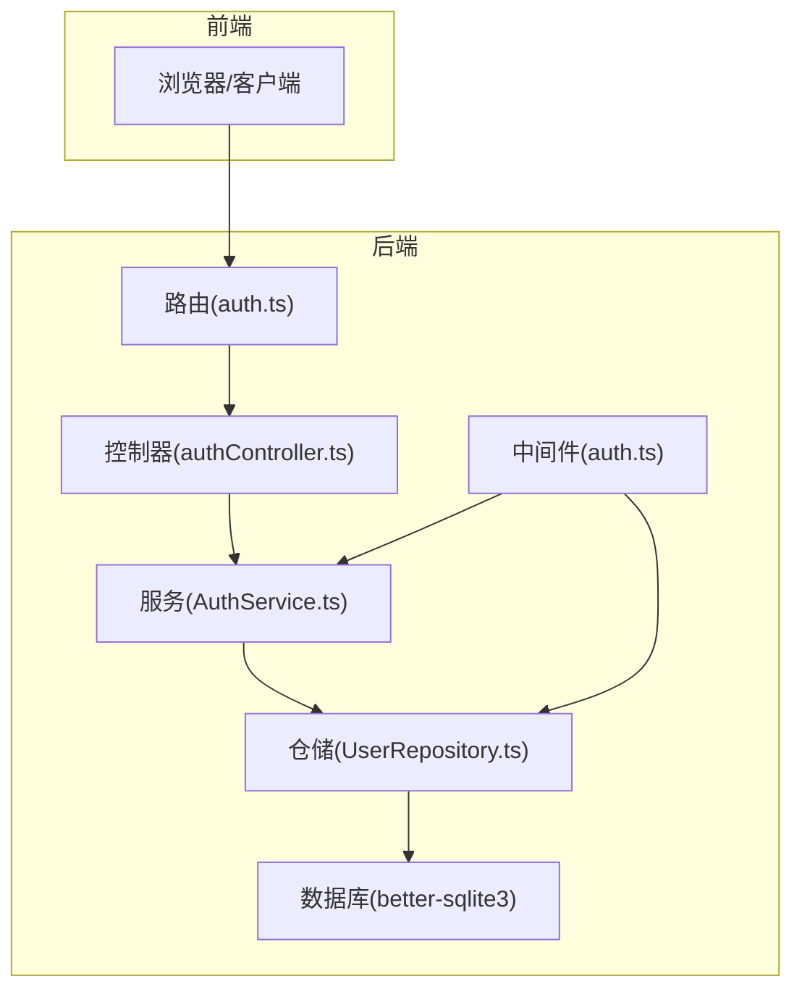
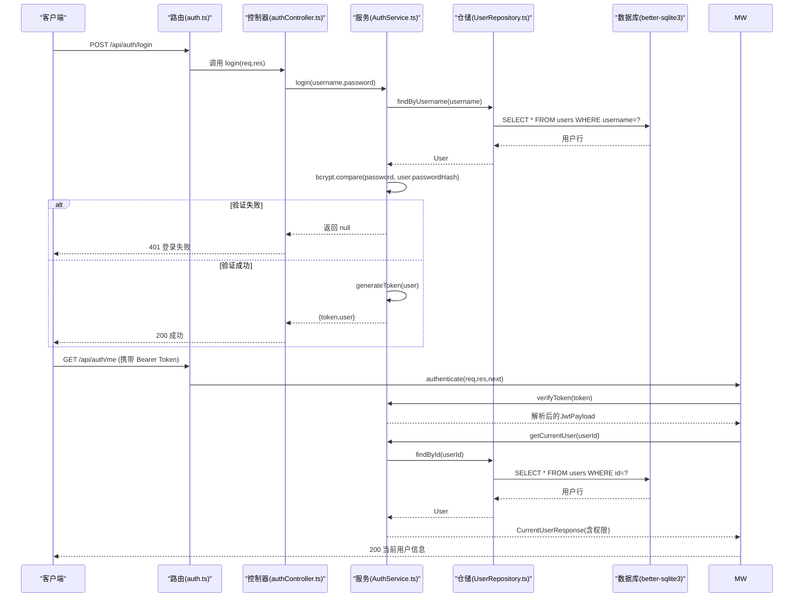
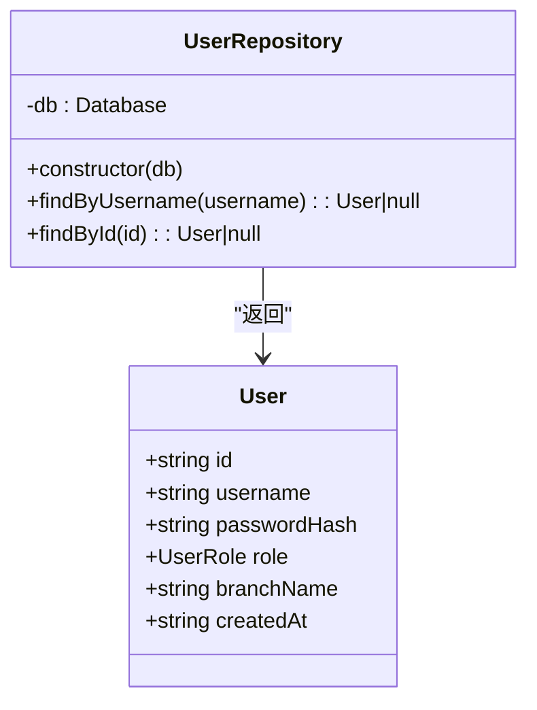
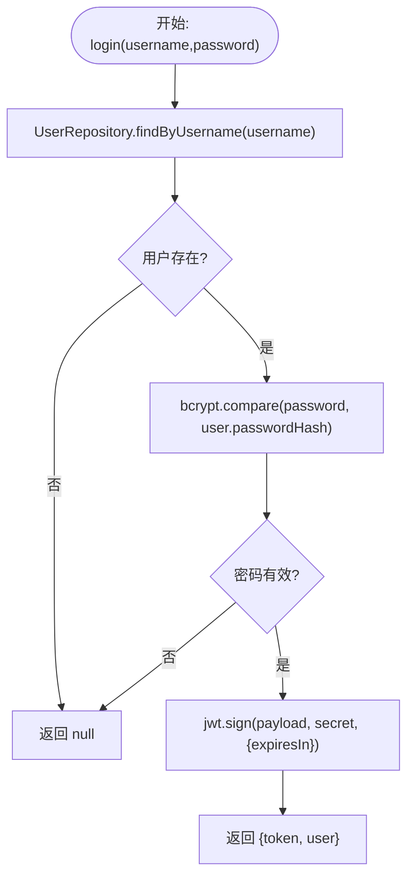
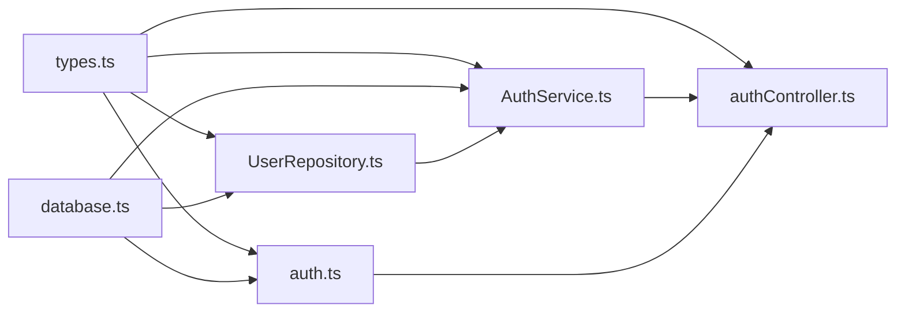

# 用户仓储

<cite>
**本文引用的文件**
- [UserRepository.ts](file://backend/src/models/UserRepository.ts)
- [AuthService.ts](file://backend/src/services/AuthService.ts)
- [authController.ts](file://backend/src/controllers/authController.ts)
- [auth.ts](file://backend/src/middlewares/auth.ts)
- [types.ts](file://shared/types.ts)
- [database.ts](file://backend/src/database.ts)
- [database-init.ts](file://backend/src/database-init.ts)
- [seedUsers.ts](file://backend/src/utils/seedUsers.ts)
- [repositories.test.ts](file://backend/tests/unit/repositories.test.ts)
- [auth.test.ts](file://backend/tests/unit/auth.test.ts)
- [auth.ts](file://backend/src/routes/auth.ts)
</cite>

## 目录
1. [简介](#简介)
2. [项目结构](#项目结构)
3. [核心组件](#核心组件)
4. [架构总览](#架构总览)
5. [详细组件分析](#详细组件分析)
6. [依赖关系分析](#依赖关系分析)
7. [性能考虑](#性能考虑)
8. [故障排查指南](#故障排查指南)
9. [结论](#结论)
10. [附录](#附录)

## 简介
本文件面向“用户仓储”（UserRepository）的技术文档，系统性阐述其在用户管理中的职责、实现细节与与周边模块的协作方式。重点包括：
- 用户数据的查询能力（按用户名、按ID）
- 用户认证信息管理（登录验证、密码哈希处理）
- 权限查询机制（基于角色的角色-权限映射）
- 用户表结构、字段映射与数据类型转换
- 登录验证流程、密码哈希策略与权限查询机制
- 用户注册流程、密码重置与账户状态管理的实现细节
- 用户数据安全保护措施、SQL查询优化与事务处理策略
- 单元测试覆盖范围与测试用例设计思路

## 项目结构
用户仓储位于后端模型层，配合认证服务、控制器与中间件共同完成用户认证与权限控制。数据库由SQLite驱动，采用better-sqlite3管理连接与初始化。

图表来源
- [auth.ts:1-19](file://backend/src/routes/auth.ts#L1-L19)
- [authController.ts:1-77](file://backend/src/controllers/authController.ts#L1-L77)
- [auth.ts:1-56](file://backend/src/middlewares/auth.ts#L1-L56)
- [AuthService.ts:1-126](file://backend/src/services/AuthService.ts#L1-L126)
- [UserRepository.ts:1-56](file://backend/src/models/UserRepository.ts#L1-L56)
- [database.ts:1-87](file://backend/src/database.ts#L1-L87)

章节来源
- [auth.ts:1-19](file://backend/src/routes/auth.ts#L1-L19)
- [authController.ts:1-77](file://backend/src/controllers/authController.ts#L1-L77)
- [auth.ts:1-56](file://backend/src/middlewares/auth.ts#L1-L56)
- [AuthService.ts:1-126](file://backend/src/services/AuthService.ts#L1-L126)
- [UserRepository.ts:1-56](file://backend/src/models/UserRepository.ts#L1-L56)
- [database.ts:1-87](file://backend/src/database.ts#L1-L87)

## 核心组件
- 用户仓储（UserRepository）：提供按用户名与按ID的用户查询能力，负责将数据库行转换为领域接口对象。
- 认证服务（AuthService）：负责登录验证、JWT签发与校验、权限查询、密码哈希处理。
- 认证中间件（auth.ts）：从请求头解析并校验JWT，将用户信息注入请求上下文。
- 控制器（authController.ts）：处理登录与获取当前用户信息的HTTP请求。
- 类型定义（types.ts）：统一前后端共享的用户、角色、权限等类型。
- 数据库（database.ts + database-init.ts）：提供数据库连接、WAL模式、外键约束与表结构初始化。
- 种子数据（seedUsers.ts）：提供初始用户数据的插入逻辑（含密码哈希）。

章节来源
- [UserRepository.ts:31-56](file://backend/src/models/UserRepository.ts#L31-L56)
- [AuthService.ts:32-126](file://backend/src/services/AuthService.ts#L32-L126)
- [auth.ts:26-55](file://backend/src/middlewares/auth.ts#L26-L55)
- [authController.ts:16-76](file://backend/src/controllers/authController.ts#L16-L76)
- [types.ts:75-130](file://shared/types.ts#L75-L130)
- [database.ts:25-52](file://backend/src/database.ts#L25-L52)
- [database-init.ts:8-64](file://backend/src/database-init.ts#L8-L64)
- [seedUsers.ts:11-19](file://backend/src/utils/seedUsers.ts#L11-L19)

## 架构总览
用户认证与权限控制的整体流程如下：

图表来源
- [auth.ts:12-16](file://backend/src/routes/auth.ts#L12-L16)
- [authController.ts:16-76](file://backend/src/controllers/authController.ts#L16-L76)
- [auth.ts:26-55](file://backend/src/middlewares/auth.ts#L26-L55)
- [AuthService.ts:43-110](file://backend/src/services/AuthService.ts#L43-L110)
- [UserRepository.ts:38-54](file://backend/src/models/UserRepository.ts#L38-L54)
- [database.ts:25-52](file://backend/src/database.ts#L25-L52)

## 详细组件分析

### 用户仓储（UserRepository）
- 职责
  - 提供按用户名查询用户（findByUsername）
  - 提供按ID查询用户（findById）
  - 将数据库行（snake_case字段）转换为领域接口对象（User）

- 数据结构与映射
  - 数据库行接口（UserRow）：包含id、username、password_hash、role、branch_name、created_at等字段
  - 领域接口（User）：包含id、username、passwordHash、role、branchName、createdAt
  - 字段映射：password_hash -> passwordHash；branch_name -> branchName（可为空）

- 查询实现要点
  - 使用better-sqlite3的prepare与get执行查询
  - 返回null表示未找到，否则转换为User对象

- 复杂度分析
  - 查询复杂度：O(1)（基于主键或唯一索引的查找）
  - 转换复杂度：O(1)

- 错误处理
  - 未找到用户返回null，调用方需进行空值检查

- 安全性
  - 仅暴露只读查询，不涉及密码修改或删除操作

图表来源
- [UserRepository.ts:31-56](file://backend/src/models/UserRepository.ts#L31-L56)
- [types.ts:75-83](file://shared/types.ts#L75-L83)

章节来源
- [UserRepository.ts:31-56](file://backend/src/models/UserRepository.ts#L31-L56)
- [types.ts:75-83](file://shared/types.ts#L75-L83)

### 认证服务（AuthService）
- 职责
  - 登录验证：校验用户名与密码，成功后签发JWT
  - JWT签发与校验：生成与验证JWT，返回解码后的载荷
  - 权限查询：根据角色返回权限列表
  - 密码哈希：对明文密码进行哈希处理

- 登录流程
  - 通过UserRepository按用户名查询用户
  - 使用bcrypt比较密码哈希
  - 通过jwt.sign签发token

- 权限映射
  - 运营人员：多项业务操作权限
  - 分支机构：查看自身档案与确认收寄等有限权限
  - 综合部：归档确认权限

- 密码哈希
  - 使用bcrypt，成本因子为10

图表来源
- [AuthService.ts:43-65](file://backend/src/services/AuthService.ts#L43-L65)
- [UserRepository.ts:38-44](file://backend/src/models/UserRepository.ts#L38-L44)

章节来源
- [AuthService.ts:32-126](file://backend/src/services/AuthService.ts#L32-L126)

### 认证中间件（auth.ts）
- 职责
  - 从Authorization头解析Bearer Token
  - 调用AuthService.verifyToken校验
  - 将用户信息注入req.user，继续后续处理

- 异常处理
  - 未提供令牌或格式不正确：401
  - 令牌无效或过期：401

章节来源
- [auth.ts:26-55](file://backend/src/middlewares/auth.ts#L26-L55)

### 控制器（authController.ts）
- 职责
  - 处理POST /api/auth/login：接收用户名与密码，调用AuthService.login，返回token与用户信息
  - 处理GET /api/auth/me：在认证中间件之后，调用AuthService.getCurrentUser返回当前用户及权限

- 参数校验
  - 登录接口要求用户名与密码均非空

章节来源
- [authController.ts:16-76](file://backend/src/controllers/authController.ts#L16-L76)

### 类型定义（types.ts）
- 用户接口（User）：id、username、passwordHash、role、branchName、createdAt
- 角色（UserRole）：operator、branch、general_affairs
- 权限（Permission）：导入、查询、审核、回寄、确认收寄、转交、上传扫描、OCR、查看自身档案、确认寄出、确认回寄、归档确认等
- 登录请求/响应、当前用户响应等接口

章节来源
- [types.ts:75-130](file://shared/types.ts#L75-L130)

### 数据库与表结构（database.ts + database-init.ts）
- 连接管理
  - 单例模式获取数据库连接
  - WAL模式提升并发读写性能
  - 外键约束开启
  - 初始化表结构（users、archive_records、status_change_logs）

- 表结构要点
  - users：id主键、username唯一、password_hash存储哈希、role使用CHECK约束限定取值、branch_name可空、created_at默认当前时间
  - archive_records：多状态字段与索引
  - status_change_logs：外键关联archive_records

- 索引
  - archive_records：fund_account、branch_name、status、archive_status、contract_version_type
  - status_change_logs：archive_id

章节来源
- [database.ts:25-52](file://backend/src/database.ts#L25-L52)
- [database-init.ts:8-64](file://backend/src/database-init.ts#L8-L64)

### 种子数据（seedUsers.ts）
- 用途：初始化演示用用户，包含运营、分支机构、综合部三类角色
- 实现：对明文密码进行bcrypt哈希后插入users表

章节来源
- [seedUsers.ts:11-19](file://backend/src/utils/seedUsers.ts#L11-L19)

## 依赖关系分析
- UserRepository依赖better-sqlite3数据库连接与types.ts中的User接口
- AuthService依赖UserRepository、bcrypt与jsonwebtoken
- 认证中间件依赖AuthService与UserRepository
- 控制器依赖AuthService与UserRepository
- 路由依赖控制器与认证中间件

图表来源
- [UserRepository.ts:6-7](file://backend/src/models/UserRepository.ts#L6-L7)
- [AuthService.ts:6-9](file://backend/src/services/AuthService.ts#L6-L9)
- [auth.ts:6-9](file://backend/src/middlewares/auth.ts#L6-L9)
- [authController.ts:6-9](file://backend/src/controllers/authController.ts#L6-L9)
- [database.ts:8-11](file://backend/src/database.ts#L8-L11)

章节来源
- [UserRepository.ts:6-7](file://backend/src/models/UserRepository.ts#L6-L7)
- [AuthService.ts:6-9](file://backend/src/services/AuthService.ts#L6-L9)
- [auth.ts:6-9](file://backend/src/middlewares/auth.ts#L6-L9)
- [authController.ts:6-9](file://backend/src/controllers/authController.ts#L6-L9)
- [database.ts:8-11](file://backend/src/database.ts#L8-L11)

## 性能考虑
- 查询优化
  - users表具备username唯一索引，按用户名查询为O(1)
  - 按ID查询为主键查询，O(1)
- 并发与一致性
  - WAL模式提升读写并发性能
  - 外键约束确保参照完整性
- 密码哈希
  - bcrypt成本因子10，平衡安全性与性能
- JWT
  - 无数据库查询，仅做签名验证，开销低

[本节为通用性能讨论，无需特定文件来源]

## 故障排查指南
- 登录失败
  - 用户名不存在或密码错误：AuthService.login返回null，控制器返回401
  - 建议：检查用户名大小写、密码是否正确、bcrypt哈希是否一致
- 未提供令牌或令牌无效
  - 中间件返回401，消息提示未提供或令牌无效
  - 建议：确认Authorization头格式为Bearer Token，检查JWT_SECRET配置
- 用户不存在
  - getCurrentUser返回null：检查用户ID是否正确
- 数据库问题
  - WAL模式与外键约束：如出现约束冲突，请检查数据一致性

章节来源
- [authController.ts:34-42](file://backend/src/controllers/authController.ts#L34-L42)
- [auth.ts:29-50](file://backend/src/middlewares/auth.ts#L29-L50)
- [AuthService.ts:97-110](file://backend/src/services/AuthService.ts#L97-L110)
- [database.ts:42-45](file://backend/src/database.ts#L42-L45)

## 结论
UserRepository作为用户数据访问层的核心，提供了简洁高效的用户查询能力，配合AuthService完成登录验证与权限查询，再由中间件与控制器形成完整的认证与授权链路。数据库层通过WAL模式与外键约束保障性能与一致性，类型系统确保前后端契约清晰。整体架构层次清晰、职责明确，便于扩展与维护。

[本节为总结性内容，无需特定文件来源]

## 附录

### 用户表结构与字段映射
- users表
  - id：TEXT主键
  - username：TEXT唯一
  - password_hash：TEXT存储哈希
  - role：TEXT，CHECK约束限定为operator、branch、general_affairs
  - branch_name：TEXT可空
  - created_at：TEXT默认当前时间

- 字段映射
  - 数据库行字段：id、username、password_hash、role、branch_name、created_at
  - 领域接口字段：id、username、passwordHash、role、branchName、createdAt

章节来源
- [database-init.ts:10-17](file://backend/src/database-init.ts#L10-L17)
- [types.ts:75-83](file://shared/types.ts#L75-L83)

### 用户注册流程
- 当前仓库未提供用户注册的仓储方法或控制器接口
- 建议方案
  - 在UserRepository中新增create方法，接收用户名、密码明文与角色
  - 在AuthService中新增register方法，调用UserRepository.create并返回用户信息
  - 在控制器中新增注册路由与参数校验
  - 密码使用AuthService.hashPassword进行哈希后再持久化

[本节为建议性内容，无需特定文件来源]

### 密码重置与账户状态管理
- 当前仓库未提供密码重置与账户状态管理的实现
- 建议方案
  - 密码重置：引入临时令牌与过期时间，重置后调用UserRepository.update更新password_hash
  - 账户状态：可在users表增加status字段与CHECK约束，配合业务逻辑进行状态迁移

[本节为建议性内容，无需特定文件来源]

### 事务处理策略
- 当前用户查询为单表读取，无需事务
- 若扩展用户注册与权限变更等写操作，建议使用事务保证原子性
- 对于批量操作，建议使用事务包裹以确保一致性

[本节为通用指导，无需特定文件来源]

### 单元测试覆盖范围与设计思路
- UserRepository测试
  - 覆盖findByUsername、findById的正向与负向用例
  - 验证返回对象的字段映射与可空字段处理
- AuthService测试
  - 覆盖login成功/失败、generateToken/verifyToken、getCurrentUser、getPermissions、hashPassword
  - 验证不同角色的权限集合
- 测试设计思路
  - 使用内存数据库（:memory:）隔离测试环境
  - 使用bcrypt同步/异步哈希确保测试稳定性
  - 通过断言返回值与异常路径，确保边界条件与错误处理

章节来源
- [repositories.test.ts:245-303](file://backend/tests/unit/repositories.test.ts#L245-L303)
- [auth.test.ts:45-162](file://backend/tests/unit/auth.test.ts#L45-L162)