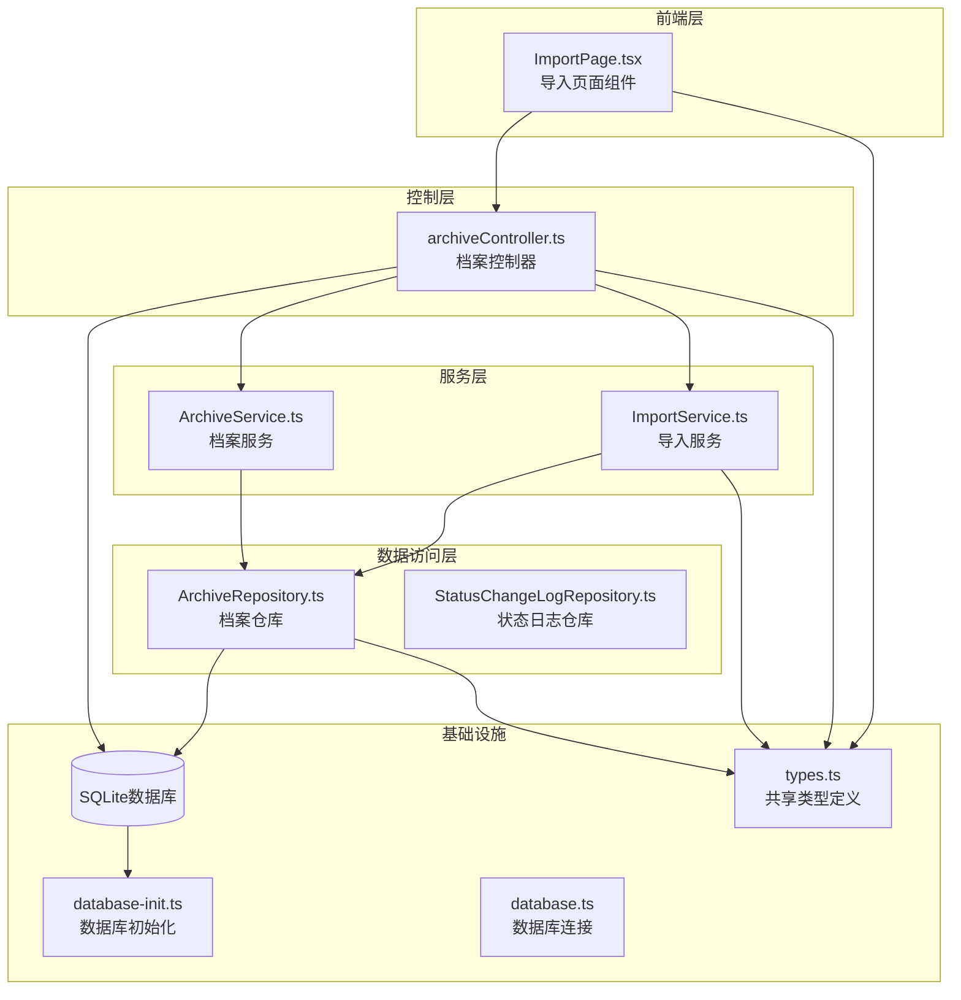
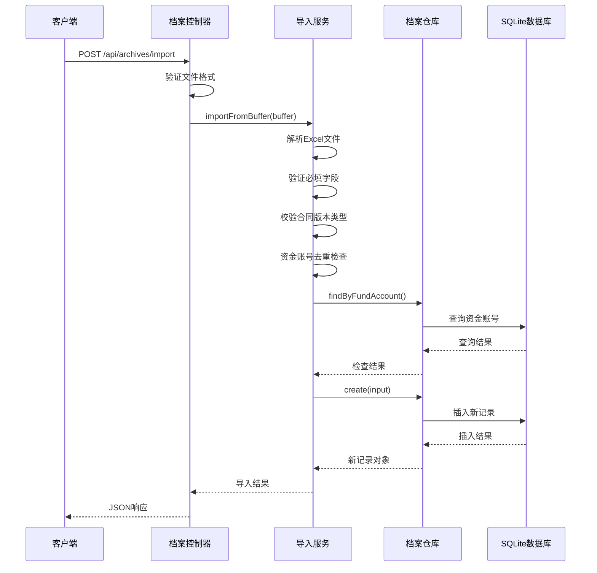
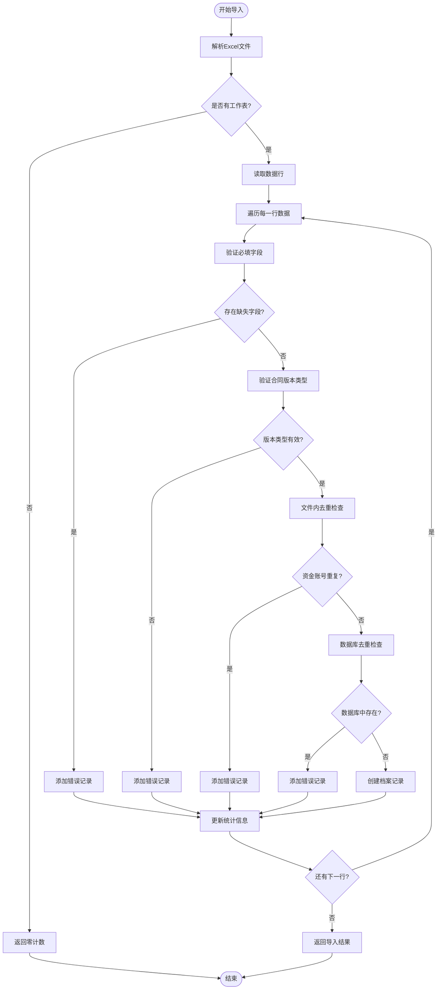
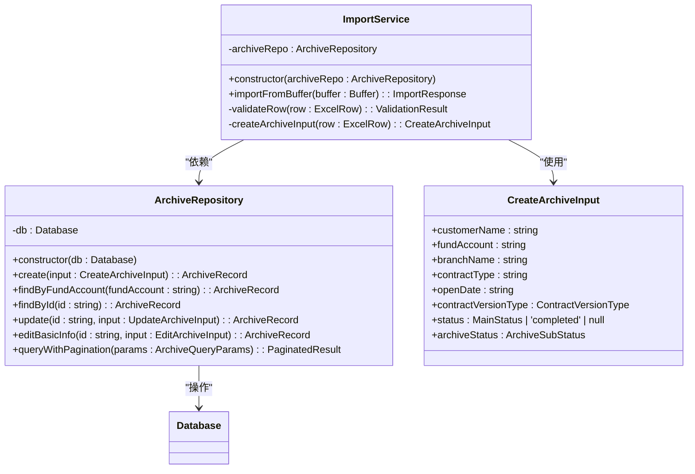
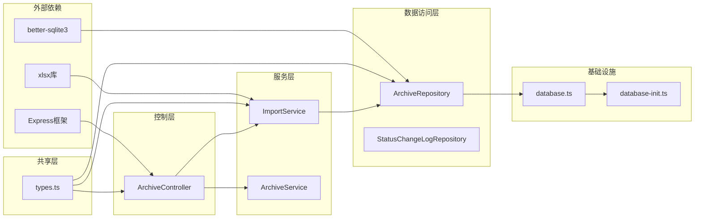
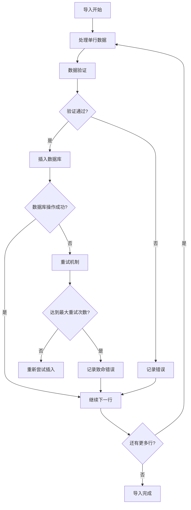

# Excel导入服务

<cite>
**本文档引用的文件**
- [ImportService.ts](file://backend/src/services/ImportService.ts)
- [ArchiveRepository.ts](file://backend/src/models/ArchiveRepository.ts)
- [archiveController.ts](file://backend/src/controllers/archiveController.ts)
- [types.ts](file://shared/types.ts)
- [database.ts](file://backend/src/database.ts)
- [database-init.ts](file://backend/src/database-init.ts)
- [import.test.ts](file://backend/tests/unit/import.test.ts)
- [ImportPage.tsx](file://frontend/src/pages/ImportPage.tsx)
</cite>

## 目录
1. [简介](#简介)
2. [项目结构](#项目结构)
3. [核心组件](#核心组件)
4. [架构概览](#架构概览)
5. [详细组件分析](#详细组件分析)
6. [依赖关系分析](#依赖关系分析)
7. [性能考虑](#性能考虑)
8. [故障排除指南](#故障排除指南)
9. [结论](#结论)

## 简介

Excel导入服务是档案管理系统的核心功能模块，负责批量处理Excel文件中的档案数据。该服务提供了完整的数据导入流程，包括文件上传、格式验证、数据转换和错误处理。系统采用分层架构设计，确保了良好的可维护性和扩展性。

主要功能特性：
- 支持Excel (.xlsx, .xls) 文件批量导入
- 完整的数据验证规则和错误处理机制
- 资金账号唯一性校验（数据库级和文件内级）
- 自动状态管理（纸质版和电子版不同流程）
- 详细的导入结果报告和错误追踪
- 前后端分离的用户界面集成

## 项目结构

系统采用清晰的分层架构，将业务逻辑、数据访问和用户界面有效分离：

**图表来源**
- [archiveController.ts:1-448](file://backend/src/controllers/archiveController.ts#L1-L448)
- [ImportService.ts:1-146](file://backend/src/services/ImportService.ts#L1-L146)
- [ArchiveRepository.ts:1-307](file://backend/src/models/ArchiveRepository.ts#L1-L307)
- [database.ts:1-87](file://backend/src/database.ts#L1-L87)

**章节来源**
- [archiveController.ts:1-448](file://backend/src/controllers/archiveController.ts#L1-L448)
- [ImportService.ts:1-146](file://backend/src/services/ImportService.ts#L1-L146)
- [ArchiveRepository.ts:1-307](file://backend/src/models/ArchiveRepository.ts#L1-L307)

## 核心组件

### ImportService - 导入服务

ImportService是导入功能的核心实现类，负责处理Excel文件的解析、验证和批量写入。该服务实现了完整的业务逻辑，包括数据格式转换、业务规则验证和错误处理。

**主要职责**：
- Excel文件解析和数据提取
- 必填字段验证和数据类型检查
- 资金账号唯一性校验
- 合同版本类型的业务规则处理
- 档案记录的批量创建

**数据结构**：
- `COLUMN_MAP`: Excel列名到内部字段名的映射关系
- `REQUIRED_COLUMNS`: 必填字段清单
- `VERSION_TYPE_MAP`: 合同版本类型映射表

**章节来源**
- [ImportService.ts:40-146](file://backend/src/services/ImportService.ts#L40-L146)

### ArchiveRepository - 档案仓库

ArchiveRepository提供档案记录的CRUD操作和查询功能。作为数据访问层的核心组件，它封装了所有数据库操作，确保了数据的一致性和完整性。

**核心功能**：
- 档案记录的创建、查询、更新和删除
- 资金账号唯一性检查
- 分页查询和条件过滤
- 数据库连接管理和事务处理

**数据库设计**：
- 使用better-sqlite3进行高性能SQLite操作
- 采用TEXT + CHECK约束替代ENUM类型
- 多个复合索引优化查询性能
- 外键约束确保数据完整性

**章节来源**
- [ArchiveRepository.ts:85-307](file://backend/src/models/ArchiveRepository.ts#L85-L307)

### 控制器层

控制器层负责HTTP请求的接收和响应处理，实现了RESTful API接口。

**主要接口**：
- `POST /api/archives/import`: 处理Excel文件导入
- `GET /api/archives/template`: 下载导入模板
- `GET /api/archives`: 查询档案记录列表

**章节来源**
- [archiveController.ts:43-92](file://backend/src/controllers/archiveController.ts#L43-L92)

## 架构概览

系统采用经典的三层架构模式，实现了关注点分离和职责明确的代码组织：

**图表来源**
- [archiveController.ts:43-71](file://backend/src/controllers/archiveController.ts#L43-L71)
- [ImportService.ts:52-144](file://backend/src/services/ImportService.ts#L52-L144)
- [ArchiveRepository.ts:93-120](file://backend/src/models/ArchiveRepository.ts#L93-L120)

## 详细组件分析

### 导入流程设计

导入流程严格按照预定义的步骤执行，确保数据处理的一致性和可靠性：

**图表来源**
- [ImportService.ts:52-144](file://backend/src/services/ImportService.ts#L52-L144)

### 数据验证规则

系统实现了多层次的数据验证机制，确保导入数据的质量和一致性：

#### 必填字段验证
- 客户姓名：必须存在且非空
- 资金账号：必须存在且唯一
- 营业部：必须存在且非空
- 合同类型：必须存在且非空
- 开户日期：必须存在且符合日期格式
- 合同版本类型：必须为"电子版"或"纸质版"

#### 业务规则检查
- **资金账号唯一性**：同时检查文件内重复和数据库中重复
- **合同版本类型映射**：中文到英文的标准化转换
- **状态自动设置**：根据合同版本类型自动分配初始状态

#### 数据类型和格式验证
- 所有字符串字段自动去除首尾空白
- 日期字段保持原始格式存储
- 数字字段转换为字符串存储

**章节来源**
- [ImportService.ts:75-141](file://backend/src/services/ImportService.ts#L75-L141)

### 导入模板标准格式

系统提供标准的Excel导入模板，确保用户能够正确准备数据：

| 字段名称 | 数据类型 | 必填 | 取值范围 | 示例 |
|---------|---------|------|---------|------|
| 客户姓名 | 文本 | 是 | 1-50字符 | 张三 |
| 资金账号 | 文本 | 是 | 6-20位数字 | FA001234 |
| 营业部 | 文本 | 是 | 1-100字符 | 北京营业部 |
| 合同类型 | 文本 | 是 | 1-100字符 | 开户合同 |
| 开户日期 | 日期 | 是 | YYYY-MM-DD格式 | 2024-01-15 |
| 合同版本类型 | 文本 | 是 | "电子版" 或 "纸质版" | 纸质版 |

**章节来源**
- [archiveController.ts:28-29](file://backend/src/controllers/archiveController.ts#L28-L29)

### 与ArchiveRepository的集成

导入服务与数据访问层的集成采用了依赖注入的设计模式，确保了良好的可测试性和可维护性：

**图表来源**
- [ImportService.ts:40-45](file://backend/src/services/ImportService.ts#L40-L45)
- [ArchiveRepository.ts:85-90](file://backend/src/models/ArchiveRepository.ts#L85-L90)
- [ArchiveRepository.ts:50-67](file://backend/src/models/ArchiveRepository.ts#L50-L67)

**章节来源**
- [ImportService.ts:13-14](file://backend/src/services/ImportService.ts#L13-L14)
- [ArchiveRepository.ts:93-120](file://backend/src/models/ArchiveRepository.ts#L93-L120)

## 依赖关系分析

系统各组件之间的依赖关系清晰明确，遵循了依赖倒置原则：

**图表来源**
- [ImportService.ts:7-14](file://backend/src/services/ImportService.ts#L7-L14)
- [ArchiveRepository.ts:6-14](file://backend/src/models/ArchiveRepository.ts#L6-L14)
- [archiveController.ts:6-23](file://backend/src/controllers/archiveController.ts#L6-L23)

**章节来源**
- [ImportService.ts:7-14](file://backend/src/services/ImportService.ts#L7-L14)
- [ArchiveRepository.ts:6-14](file://backend/src/models/ArchiveRepository.ts#L6-L14)

## 性能考虑

### 数据库优化策略

系统采用了多项数据库优化技术来提升导入性能：

1. **WAL模式启用**：提升并发读写的性能表现
2. **索引优化**：为常用查询字段建立复合索引
3. **批量插入**：使用prepared statements进行高效批量操作
4. **连接池管理**：采用单例模式管理数据库连接

### 内存管理

- 使用Set数据结构进行文件内重复检查，时间复杂度O(1)
- 逐行处理Excel数据，避免一次性加载大量数据到内存
- 及时释放临时变量和中间结果

### 错误处理和重试机制

虽然当前实现没有内置的自动重试机制，但提供了完善的错误报告和恢复指导：

**图表来源**
- [ImportService.ts:75-141](file://backend/src/services/ImportService.ts#L75-L141)

**章节来源**
- [database.ts:41-48](file://backend/src/database.ts#L41-L48)
- [database-init.ts:42-47](file://backend/src/database-init.ts#L42-L47)

## 故障排除指南

### 常见问题及解决方案

#### 文件格式错误
**问题**：上传的不是Excel文件或格式不支持
**解决方案**：检查文件扩展名是否为.xlsx或.xls，确保文件未被损坏

#### 数据验证失败
**问题**：导入结果显示大量错误
**解决方案**：
1. 下载最新模板文件重新填写
2. 检查必填字段是否完整
3. 验证数据格式是否正确
4. 确认资金账号唯一性

#### 数据库连接问题
**问题**：导入过程中出现数据库错误
**解决方案**：
1. 检查数据库文件权限
2. 确认磁盘空间充足
3. 重启应用程序服务

#### 性能问题
**问题**：大批量导入时响应缓慢
**解决方案**：
1. 分批导入数据（建议每批不超过1000行）
2. 确保服务器资源充足
3. 避免同时进行其他大数据操作

**章节来源**
- [archiveController.ts:43-71](file://backend/src/controllers/archiveController.ts#L43-L71)
- [import.test.ts:52-117](file://backend/tests/unit/import.test.ts#L52-L117)

## 结论

Excel导入服务通过精心设计的架构和严格的验证机制，为档案管理系统的数据导入提供了可靠的技术支撑。系统的主要优势包括：

1. **完整的数据验证**：多层级的验证规则确保数据质量
2. **清晰的错误报告**：详细的错误信息帮助用户快速定位问题
3. **高效的性能表现**：优化的数据库设计和内存管理
4. **良好的可维护性**：清晰的分层架构便于后续扩展

未来可以考虑的改进方向：
- 添加自动重试机制和断点续传功能
- 实现导入进度监控和实时反馈
- 增加数据预览和模拟导入功能
- 扩展支持更多文件格式（CSV、JSON等）

该服务为档案管理系统的数字化转型奠定了坚实的基础，能够有效提升工作效率和数据准确性。