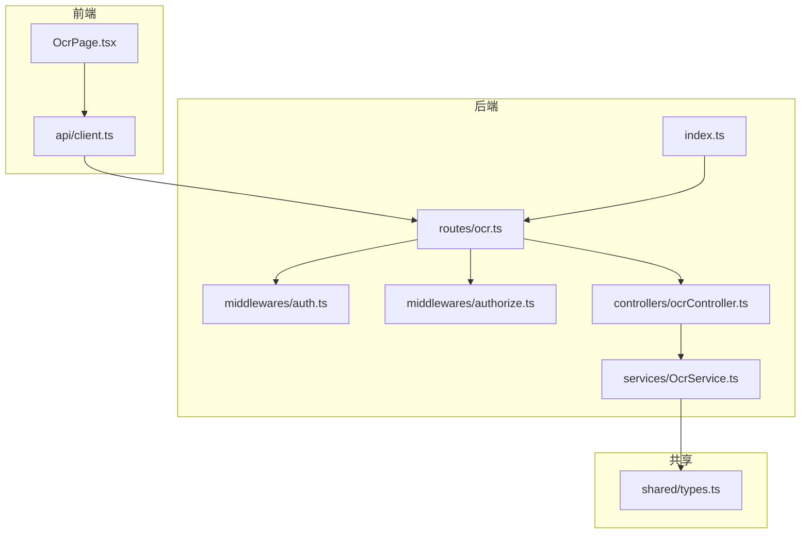
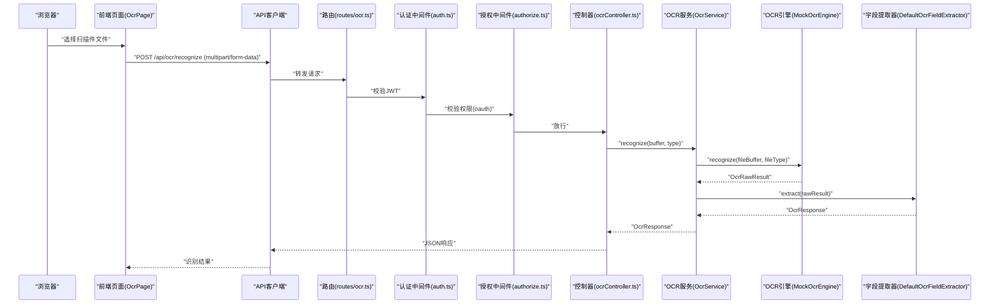
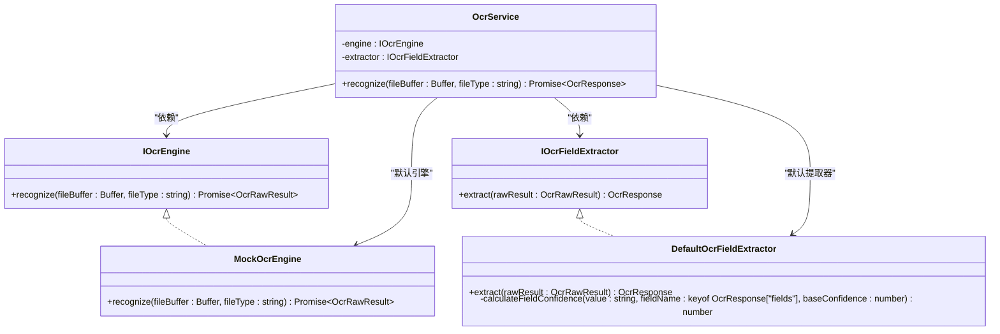
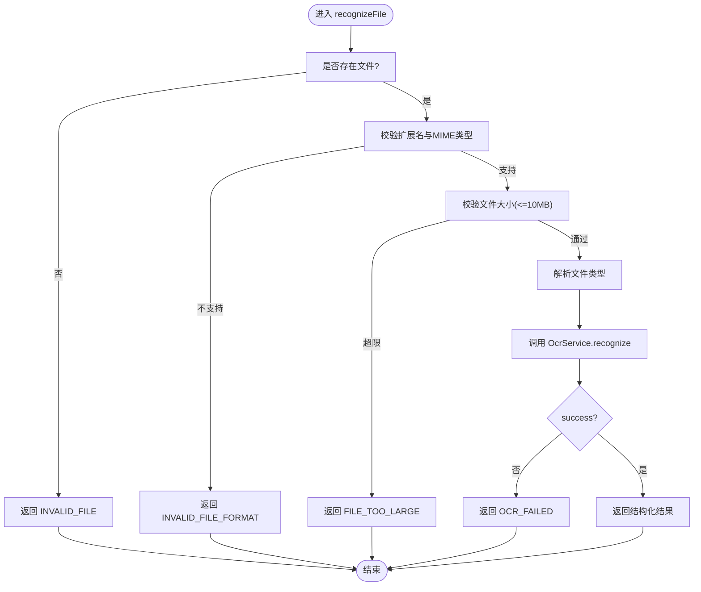
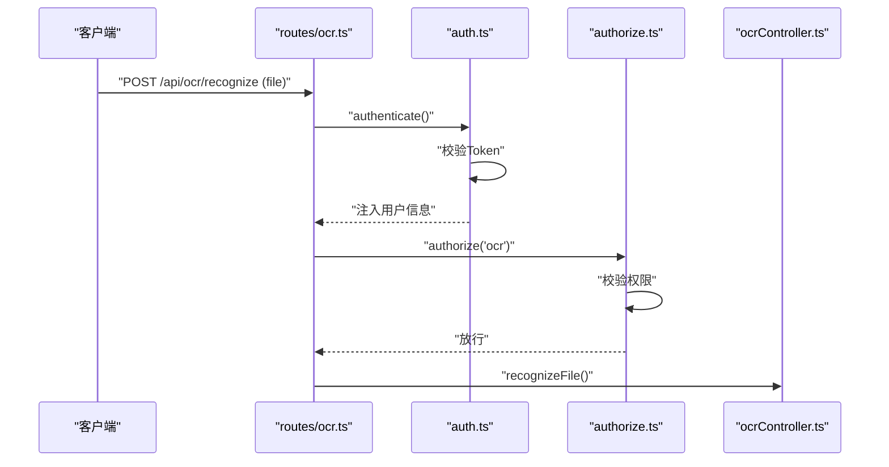
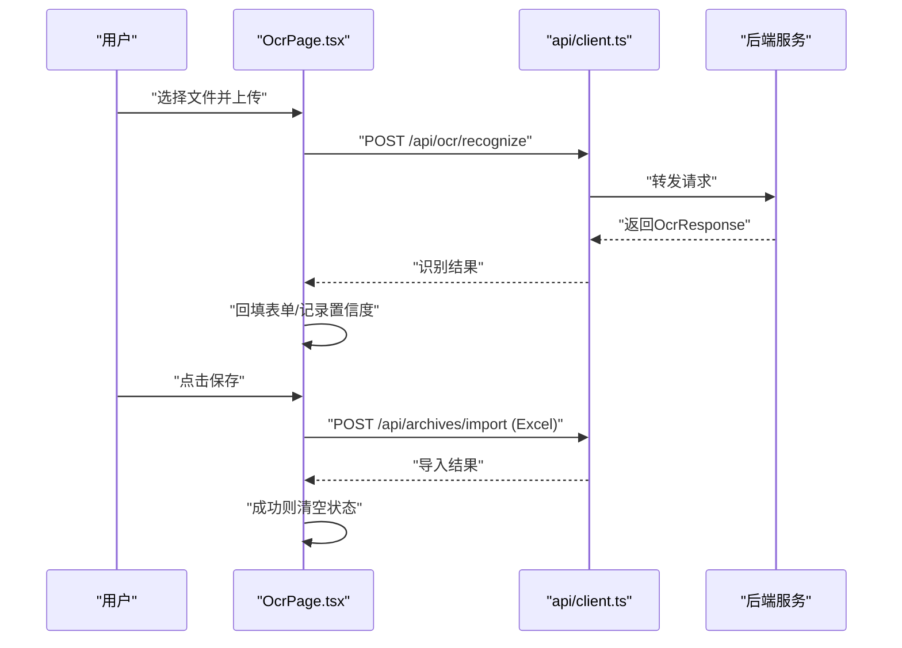
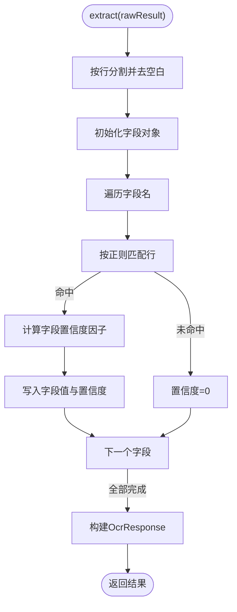
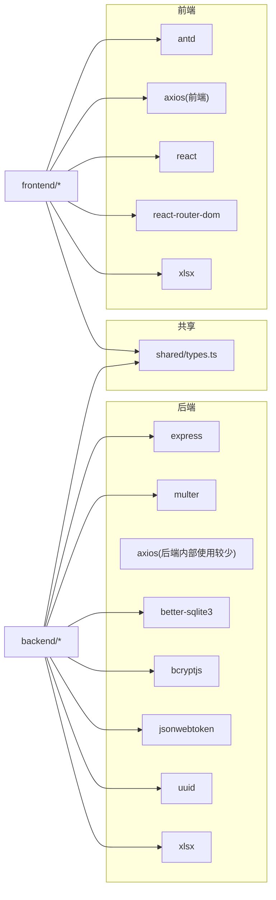

# OCR识别服务

<cite>
**本文引用的文件**
- [backend/src/services/OcrService.ts](file://backend/src/services/OcrService.ts)
- [backend/src/controllers/ocrController.ts](file://backend/src/controllers/ocrController.ts)
- [backend/src/routes/ocr.ts](file://backend/src/routes/ocr.ts)
- [backend/src/middlewares/auth.ts](file://backend/src/middlewares/auth.ts)
- [backend/src/middlewares/authorize.ts](file://backend/src/middlewares/authorize.ts)
- [backend/src/index.ts](file://backend/src/index.ts)
- [frontend/src/pages/OcrPage.tsx](file://frontend/src/pages/OcrPage.tsx)
- [frontend/src/api/client.ts](file://frontend/src/api/client.ts)
- [shared/types.ts](file://shared/types.ts)
- [backend/package.json](file://backend/package.json)
- [frontend/package.json](file://frontend/package.json)
</cite>

## 目录
1. [简介](#简介)
2. [项目结构](#项目结构)
3. [核心组件](#核心组件)
4. [架构总览](#架构总览)
5. [详细组件分析](#详细组件分析)
6. [依赖关系分析](#依赖关系分析)
7. [性能考虑](#性能考虑)
8. [故障排查指南](#故障排查指南)
9. [结论](#结论)
10. [附录](#附录)

## 简介
本文件面向OCR识别服务的技术文档，聚焦于文档智能识别中的图像预处理、文本提取与结果验证流程；阐述服务集成方式（本地模型、第三方API与云端服务）、文件上传处理（格式支持、大小限制与安全检查）、识别结果后处理（文本清洗、结构化提取与质量评估）、配置项（识别引擎选择、语言设置与精度调整）、前后端集成与用户体验优化策略，并总结性能优化、错误处理与成本控制的最佳实践。

## 项目结构
后端采用Express + TypeScript，前端基于React + Ant Design，共享类型定义位于shared目录。OCR能力以服务适配层形式实现，控制器负责文件上传与安全校验，路由聚合认证与授权中间件，前端页面负责上传、识别结果展示与提交。

图表来源
- [backend/src/routes/ocr.ts:1-21](file://backend/src/routes/ocr.ts#L1-L21)
- [backend/src/controllers/ocrController.ts:1-94](file://backend/src/controllers/ocrController.ts#L1-L94)
- [backend/src/services/OcrService.ts:1-192](file://backend/src/services/OcrService.ts#L1-L192)
- [backend/src/middlewares/auth.ts:1-56](file://backend/src/middlewares/auth.ts#L1-L56)
- [backend/src/middlewares/authorize.ts:1-47](file://backend/src/middlewares/authorize.ts#L1-L47)
- [backend/src/index.ts:1-38](file://backend/src/index.ts#L1-L38)
- [frontend/src/pages/OcrPage.tsx:1-232](file://frontend/src/pages/OcrPage.tsx#L1-L232)
- [frontend/src/api/client.ts:1-55](file://frontend/src/api/client.ts#L1-L55)
- [shared/types.ts:218-238](file://shared/types.ts#L218-L238)

章节来源
- [backend/src/index.ts:1-38](file://backend/src/index.ts#L1-L38)
- [backend/src/routes/ocr.ts:1-21](file://backend/src/routes/ocr.ts#L1-L21)
- [backend/src/controllers/ocrController.ts:1-94](file://backend/src/controllers/ocrController.ts#L1-L94)
- [backend/src/services/OcrService.ts:1-192](file://backend/src/services/OcrService.ts#L1-L192)
- [frontend/src/pages/OcrPage.tsx:1-232](file://frontend/src/pages/OcrPage.tsx#L1-L232)
- [frontend/src/api/client.ts:1-55](file://frontend/src/api/client.ts#L1-L55)
- [shared/types.ts:218-238](file://shared/types.ts#L218-L238)

## 核心组件
- OCR服务适配层：定义IOcrEngine与IOcrFieldExtractor接口，提供默认Mock实现与默认字段提取器，封装识别与结构化解析流程。
- OCR控制器：负责文件上传、格式与大小校验、调用OCR服务并返回结构化结果。
- 路由与中间件：注册OCR识别路由，应用认证与权限校验，使用内存存储处理多部分文件。
- 前端页面：提供上传控件、识别结果回填、低置信度字段高亮与提交为档案记录的能力。
- 共享类型：统一定义OCR响应结构、字段与置信度等类型。

章节来源
- [backend/src/services/OcrService.ts:11-29](file://backend/src/services/OcrService.ts#L11-L29)
- [backend/src/services/OcrService.ts:38-57](file://backend/src/services/OcrService.ts#L38-L57)
- [backend/src/services/OcrService.ts:78-149](file://backend/src/services/OcrService.ts#L78-L149)
- [backend/src/services/OcrService.ts:157-191](file://backend/src/services/OcrService.ts#L157-L191)
- [backend/src/controllers/ocrController.ts:10-21](file://backend/src/controllers/ocrController.ts#L10-L21)
- [backend/src/controllers/ocrController.ts:43-93](file://backend/src/controllers/ocrController.ts#L43-L93)
- [backend/src/routes/ocr.ts:14-18](file://backend/src/routes/ocr.ts#L14-L18)
- [backend/src/middlewares/auth.ts:26-55](file://backend/src/middlewares/auth.ts#L26-L55)
- [backend/src/middlewares/authorize.ts:16-46](file://backend/src/middlewares/authorize.ts#L16-L46)
- [frontend/src/pages/OcrPage.tsx:39-85](file://frontend/src/pages/OcrPage.tsx#L39-L85)
- [frontend/src/pages/OcrPage.tsx:104-154](file://frontend/src/pages/OcrPage.tsx#L104-L154)
- [shared/types.ts:226-238](file://shared/types.ts#L226-L238)

## 架构总览
下图展示了从浏览器到后端服务再到OCR服务的整体调用链路，以及中间件对请求的认证与授权控制。

图表来源
- [backend/src/routes/ocr.ts:14-18](file://backend/src/routes/ocr.ts#L14-L18)
- [backend/src/middlewares/auth.ts:26-55](file://backend/src/middlewares/auth.ts#L26-L55)
- [backend/src/middlewares/authorize.ts:16-46](file://backend/src/middlewares/authorize.ts#L16-L46)
- [backend/src/controllers/ocrController.ts:74-86](file://backend/src/controllers/ocrController.ts#L74-L86)
- [backend/src/services/OcrService.ts:157-191](file://backend/src/services/OcrService.ts#L157-L191)
- [backend/src/services/OcrService.ts:38-57](file://backend/src/services/OcrService.ts#L38-L57)
- [backend/src/services/OcrService.ts:78-149](file://backend/src/services/OcrService.ts#L78-L149)

## 详细组件分析

### OCR服务适配层（OcrService.ts）
- 接口设计
  - IOcrEngine：抽象识别引擎，输入二进制文件与类型，输出原始识别结果（文本+整体置信度）。
  - IOcrFieldExtractor：抽象字段提取器，输入原始识别结果，输出结构化OCR响应（含字段与置信度）。
- 默认实现
  - MockOcrEngine：在开发/演示场景下返回固定格式的模拟文本与置信度。
  - DefaultOcrFieldExtractor：按字段正则匹配提取，结合字段合理性规则计算字段置信度，最终生成OcrResponse。
- 组合服务
  - OcrService：组合引擎与提取器，提供统一的recognize方法；异常时返回失败结构化结果，保证上层健壮性。

图表来源
- [backend/src/services/OcrService.ts:21-29](file://backend/src/services/OcrService.ts#L21-L29)
- [backend/src/services/OcrService.ts:38-57](file://backend/src/services/OcrService.ts#L38-L57)
- [backend/src/services/OcrService.ts:78-149](file://backend/src/services/OcrService.ts#L78-L149)
- [backend/src/services/OcrService.ts:157-191](file://backend/src/services/OcrService.ts#L157-L191)

章节来源
- [backend/src/services/OcrService.ts:11-29](file://backend/src/services/OcrService.ts#L11-L29)
- [backend/src/services/OcrService.ts:38-57](file://backend/src/services/OcrService.ts#L38-L57)
- [backend/src/services/OcrService.ts:78-149](file://backend/src/services/OcrService.ts#L78-L149)
- [backend/src/services/OcrService.ts:157-191](file://backend/src/services/OcrService.ts#L157-L191)

### 文件上传与安全校验（ocrController.ts）
- 支持格式：JPG/JPEG、PNG、PDF（扩展名与MIME类型双重校验）。
- 大小限制：10MB。
- 控制器职责：接收单文件上传，进行格式与大小校验，调用OcrService并返回结构化结果；异常时统一返回错误信息。

图表来源
- [backend/src/controllers/ocrController.ts:43-93](file://backend/src/controllers/ocrController.ts#L43-L93)
- [backend/src/controllers/ocrController.ts:10-21](file://backend/src/controllers/ocrController.ts#L10-L21)
- [backend/src/controllers/ocrController.ts:26-37](file://backend/src/controllers/ocrController.ts#L26-L37)

章节来源
- [backend/src/controllers/ocrController.ts:10-21](file://backend/src/controllers/ocrController.ts#L10-L21)
- [backend/src/controllers/ocrController.ts:26-37](file://backend/src/controllers/ocrController.ts#L26-L37)
- [backend/src/controllers/ocrController.ts:43-93](file://backend/src/controllers/ocrController.ts#L43-L93)

### 路由与中间件（ocr.ts、auth.ts、authorize.ts）
- 路由：使用multer内存存储接收单文件，路径“/api/ocr/recognize”，要求认证并通过“ocr”权限。
- 认证中间件：从Authorization头解析Bearer Token，校验有效性并将用户信息注入请求上下文。
- 授权中间件：根据用户角色计算权限集合，校验是否具备所需权限。

图表来源
- [backend/src/routes/ocr.ts:14-18](file://backend/src/routes/ocr.ts#L14-L18)
- [backend/src/middlewares/auth.ts:26-55](file://backend/src/middlewares/auth.ts#L26-L55)
- [backend/src/middlewares/authorize.ts:16-46](file://backend/src/middlewares/authorize.ts#L16-L46)
- [backend/src/controllers/ocrController.ts:43-93](file://backend/src/controllers/ocrController.ts#L43-L93)

章节来源
- [backend/src/routes/ocr.ts:14-18](file://backend/src/routes/ocr.ts#L14-L18)
- [backend/src/middlewares/auth.ts:26-55](file://backend/src/middlewares/auth.ts#L26-L55)
- [backend/src/middlewares/authorize.ts:16-46](file://backend/src/middlewares/authorize.ts#L16-L46)

### 前端集成与用户体验（OcrPage.tsx、api/client.ts）
- 上传与识别：Ant Design Upload控件限制文件数量与大小，触发上传后通过API客户端发送multipart请求；识别完成后自动回填表单并记录字段置信度。
- 低置信度提示：当字段置信度低于阈值（0.8）时，标签显示警告图标并在Tooltip中提示人工复核。
- 提交为档案：将表单数据转换为Excel并调用导入接口创建档案记录，成功后清空表单状态。

图表来源
- [frontend/src/pages/OcrPage.tsx:39-85](file://frontend/src/pages/OcrPage.tsx#L39-L85)
- [frontend/src/pages/OcrPage.tsx:104-154](file://frontend/src/pages/OcrPage.tsx#L104-L154)
- [frontend/src/api/client.ts:11-52](file://frontend/src/api/client.ts#L11-L52)

章节来源
- [frontend/src/pages/OcrPage.tsx:39-85](file://frontend/src/pages/OcrPage.tsx#L39-L85)
- [frontend/src/pages/OcrPage.tsx:104-154](file://frontend/src/pages/OcrPage.tsx#L104-L154)
- [frontend/src/api/client.ts:11-52](file://frontend/src/api/client.ts#L11-L52)

### OCR结果后处理（DefaultOcrFieldExtractor）
- 文本清洗：按行分割并去除空白，仅保留非空行。
- 结构化提取：逐字段匹配正则，命中后计算字段置信度因子（基于字段类型与值合理性），最终输出OcrResponse。
- 质量评估：整体置信度与字段置信度共同决定是否需要人工复核。

图表来源
- [backend/src/services/OcrService.ts:78-149](file://backend/src/services/OcrService.ts#L78-L149)

章节来源
- [backend/src/services/OcrService.ts:78-149](file://backend/src/services/OcrService.ts#L78-L149)

## 依赖关系分析
- 后端依赖
  - express、cors、multer、bcryptjs、better-sqlite3、jsonwebtoken、uuid、xlsx等。
- 前端依赖
  - antd、axios、react、react-router-dom、xlsx等。
- 共享类型
  - 前后端共用的OCR响应结构、字段与置信度类型，确保契约一致。

图表来源
- [backend/package.json:14-22](file://backend/package.json#L14-L22)
- [frontend/package.json:12-18](file://frontend/package.json#L12-L18)
- [shared/types.ts:218-238](file://shared/types.ts#L218-L238)

章节来源
- [backend/package.json:14-22](file://backend/package.json#L14-L22)
- [frontend/package.json:12-18](file://frontend/package.json#L12-L18)
- [shared/types.ts:218-238](file://shared/types.ts#L218-L238)

## 性能考虑
- 内存存储：multer使用内存存储，适合中小文件（建议不超过10MB）。对于大文件或高并发场景，建议改为磁盘存储或云存储直传。
- 并发与吞吐：识别流程串行，建议在网关或反向代理层限制并发，避免内存峰值过高。
- 置信度阈值：前端阈值0.8，可在业务允许范围内动态调整，平衡自动化率与人工复核成本。
- 缓存与降级：可引入识别结果缓存与降级策略（如引擎不可用时返回历史结果或提示重试）。
- 日志与监控：为识别耗时、成功率、失败原因建立指标，便于容量规划与问题定位。

## 故障排查指南
- 常见错误与处理
  - 文件格式不支持：检查扩展名与MIME类型，确保为JPG/PNG/PDF。
  - 文件过大：压缩图片或拆分PDF，确保小于等于10MB。
  - 识别失败：提高图片清晰度、调整角度或更换图片源。
  - 认证/权限错误：确认Token有效、用户具备“ocr”权限。
- 前端提示
  - 基于响应状态与消息进行用户提示，必要时引导重新上传或联系管理员。
- 后端日志
  - 记录请求ID、文件类型、识别耗时与异常堆栈，便于追踪问题。

章节来源
- [backend/src/controllers/ocrController.ts:47-71](file://backend/src/controllers/ocrController.ts#L47-L71)
- [backend/src/middlewares/auth.ts:29-50](file://backend/src/middlewares/auth.ts#L29-L50)
- [backend/src/middlewares/authorize.ts:17-42](file://backend/src/middlewares/authorize.ts#L17-L42)
- [frontend/src/pages/OcrPage.tsx:76-81](file://frontend/src/pages/OcrPage.tsx#L76-L81)

## 结论
本OCR识别服务通过清晰的接口抽象与适配层设计，实现了从文件上传、安全校验到识别与结构化解析的完整闭环。默认Mock引擎便于快速演示，生产环境可通过替换IOcrEngine接入第三方API或本地模型。前端提供良好的交互体验与低置信度提示，配合后端统一的错误处理与阈值策略，能够有效提升识别效率与质量。

## 附录

### OCR服务集成方式与配置建议
- 第三方API/云端服务
  - 替换IOcrEngine实现，对接百度OCR、腾讯云OCR或其他云端服务；保持OcrRawResult与OcrResponse结构不变。
  - 在构造OcrService时注入新引擎实例，确保与现有控制器与前端契约兼容。
- 本地模型部署
  - 将本地OCR模型封装为IOcrEngine实现，注意I/O与内存管理，避免阻塞事件循环。
- 语言与精度
  - 引擎侧支持的语言与精度参数通过构造函数注入；前端可依据业务需求调整置信度阈值。
- 文件上传
  - 严格遵守格式与大小限制；对PDF进行预处理（如转图片）以提升识别效果。

章节来源
- [backend/src/services/OcrService.ts:21-29](file://backend/src/services/OcrService.ts#L21-L29)
- [backend/src/services/OcrService.ts:157-164](file://backend/src/services/OcrService.ts#L157-L164)
- [backend/src/controllers/ocrController.ts:10-21](file://backend/src/controllers/ocrController.ts#L10-L21)
- [frontend/src/pages/OcrPage.tsx:89-101](file://frontend/src/pages/OcrPage.tsx#L89-L101)

### 识别结果后处理清单
- 文本清洗：去除空行与多余空白。
- 结构化提取：按字段正则匹配，缺失字段置信度为0。
- 质量评估：字段置信度=基础置信度×字段合理性因子；整体success由识别流程决定。
- 前端展示：低置信度字段高亮并提示人工复核。

章节来源
- [backend/src/services/OcrService.ts:78-149](file://backend/src/services/OcrService.ts#L78-L149)
- [frontend/src/pages/OcrPage.tsx:156-175](file://frontend/src/pages/OcrPage.tsx#L156-L175)