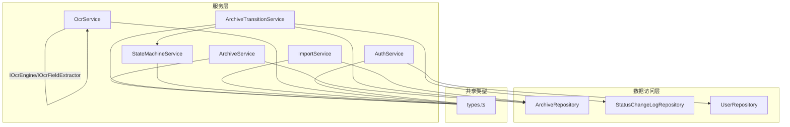
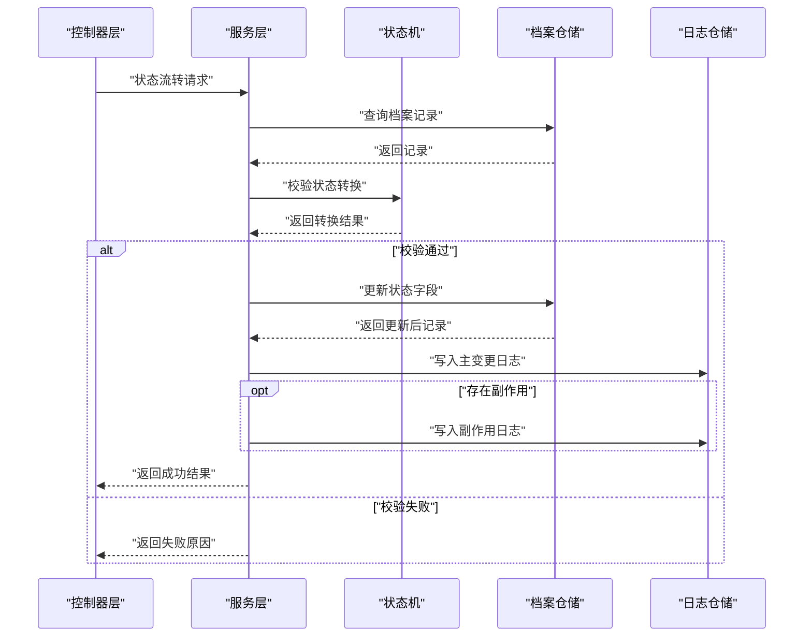
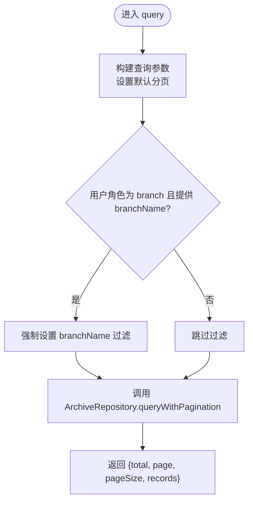
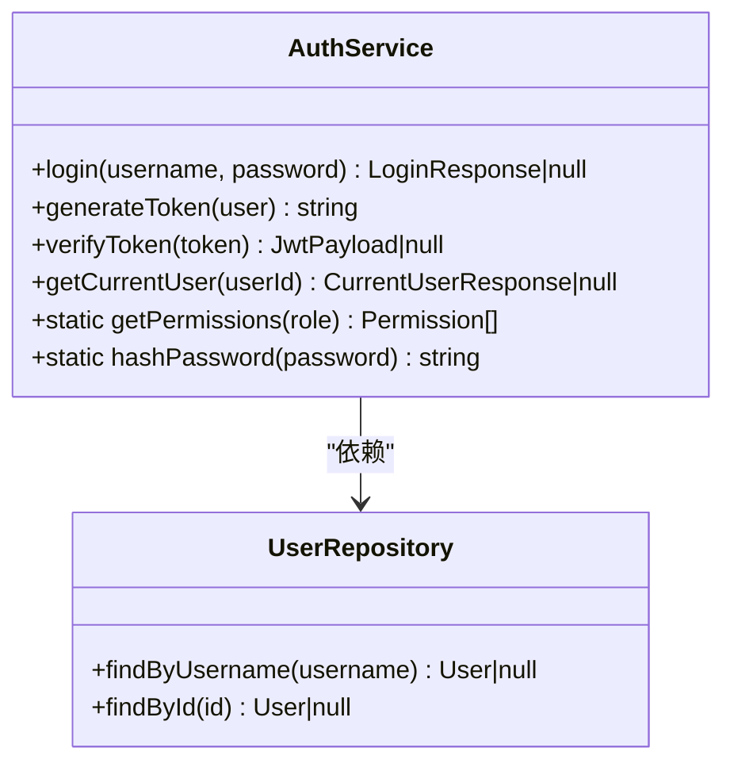
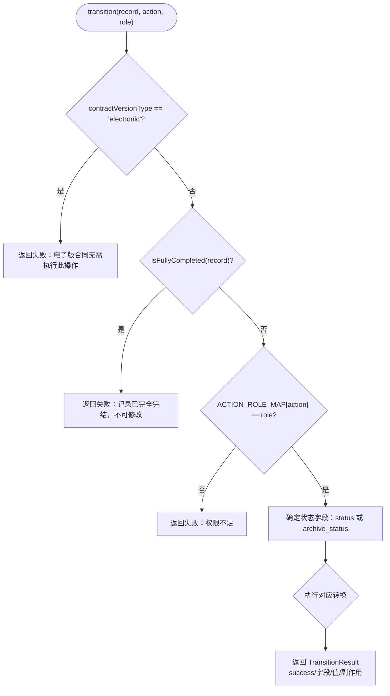
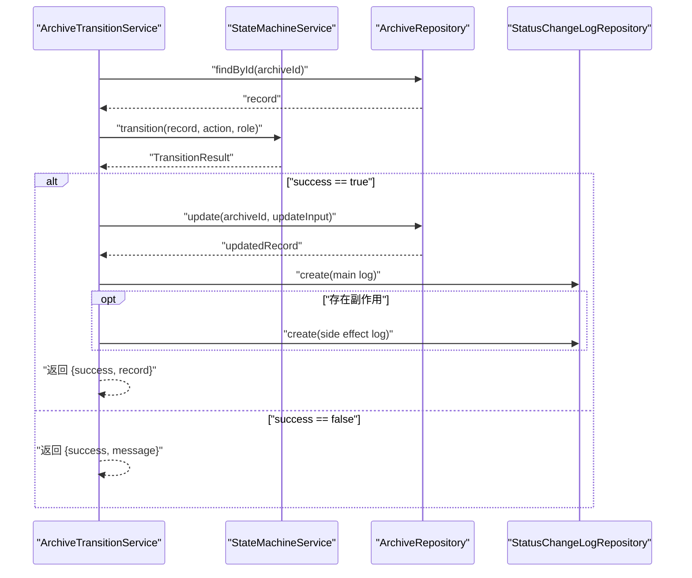
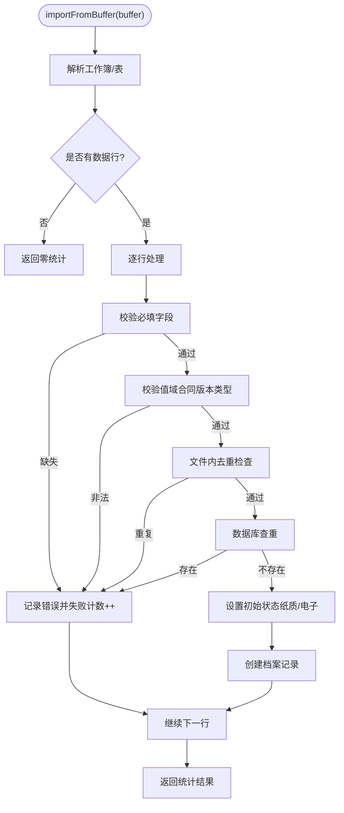
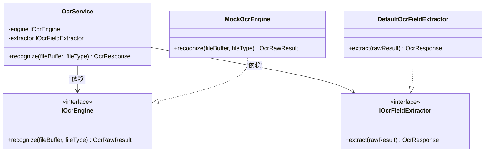
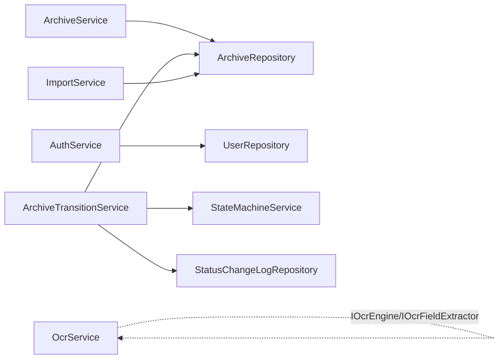

# 服务层

<cite>
**本文引用的文件**
- [ArchiveService.ts](file://backend/src/services/ArchiveService.ts)
- [AuthService.ts](file://backend/src/services/AuthService.ts)
- [StateMachineService.ts](file://backend/src/services/StateMachineService.ts)
- [ArchiveTransitionService.ts](file://backend/src/services/ArchiveTransitionService.ts)
- [ImportService.ts](file://backend/src/services/ImportService.ts)
- [OcrService.ts](file://backend/src/services/OcrService.ts)
- [ArchiveRepository.ts](file://backend/src/models/ArchiveRepository.ts)
- [UserRepository.ts](file://backend/src/models/UserRepository.ts)
- [StatusChangeLogRepository.ts](file://backend/src/models/StatusChangeLogRepository.ts)
- [types.ts](file://shared/types.ts)
- [stateMachine.test.ts](file://backend/tests/unit/stateMachine.test.ts)
- [archiveTransition.test.ts](file://backend/tests/unit/archiveTransition.test.ts)
- [import.test.ts](file://backend/tests/unit/import.test.ts)
- [auth.test.ts](file://backend/tests/unit/auth.test.ts)
</cite>

## 目录
1. [简介](#简介)
2. [项目结构](#项目结构)
3. [核心组件](#核心组件)
4. [架构总览](#架构总览)
5. [详细组件分析](#详细组件分析)
6. [依赖分析](#依赖分析)
7. [性能考虑](#性能考虑)
8. [故障排查指南](#故障排查指南)
9. [结论](#结论)
10. [附录](#附录)

## 简介
本文件系统性梳理服务层在档案管理子系统中的核心作用与实现细节，涵盖业务逻辑封装、事务一致性保障、跨领域协调与可观测性。服务层通过明确的职责边界与稳定的接口契约，向上承接控制器层的请求，向下协调数据访问层与外部能力，确保状态流转的合法性、可追溯与可扩展。

## 项目结构
服务层位于 backend/src/services，围绕五大核心服务展开：
- 档案查询与分页：ArchiveService
- 认证与授权：AuthService
- 状态机控制：StateMachineService
- 状态流转整合：ArchiveTransitionService
- 数据导入：ImportService
- 文档识别：OcrService

上述服务均以“面向接口”的方式协作，并通过共享类型定义保证前后端一致的契约。

图表来源
- [ArchiveService.ts:1-71](file://backend/src/services/ArchiveService.ts#L1-L71)
- [ArchiveTransitionService.ts:1-156](file://backend/src/services/ArchiveTransitionService.ts#L1-L156)
- [StateMachineService.ts:1-253](file://backend/src/services/StateMachineService.ts#L1-L253)
- [ImportService.ts:1-146](file://backend/src/services/ImportService.ts#L1-L146)
- [OcrService.ts:1-192](file://backend/src/services/OcrService.ts#L1-L192)
- [ArchiveRepository.ts:1-307](file://backend/src/models/ArchiveRepository.ts#L1-L307)
- [StatusChangeLogRepository.ts:1-99](file://backend/src/models/StatusChangeLogRepository.ts#L1-L99)
- [UserRepository.ts:1-56](file://backend/src/models/UserRepository.ts#L1-L56)
- [types.ts:1-289](file://shared/types.ts#L1-L289)

章节来源
- [ArchiveService.ts:1-71](file://backend/src/services/ArchiveService.ts#L1-L71)
- [AuthService.ts:1-126](file://backend/src/services/AuthService.ts#L1-L126)
- [StateMachineService.ts:1-253](file://backend/src/services/StateMachineService.ts#L1-L253)
- [ArchiveTransitionService.ts:1-156](file://backend/src/services/ArchiveTransitionService.ts#L1-L156)
- [ImportService.ts:1-146](file://backend/src/services/ImportService.ts#L1-L146)
- [OcrService.ts:1-192](file://backend/src/services/OcrService.ts#L1-L192)
- [ArchiveRepository.ts:1-307](file://backend/src/models/ArchiveRepository.ts#L1-L307)
- [StatusChangeLogRepository.ts:1-99](file://backend/src/models/StatusChangeLogRepository.ts#L1-L99)
- [UserRepository.ts:1-56](file://backend/src/models/UserRepository.ts#L1-L56)
- [types.ts:1-289](file://shared/types.ts#L1-L289)

## 核心组件
- 档案查询服务（ArchiveService）
  - 职责：封装查询参数构建、分页与分支机构数据隔离；委托数据访问层执行查询。
  - 关键点：默认分页参数、用户角色驱动的过滤、统一返回结构。
- 认证服务（AuthService）
  - 职责：登录校验、JWT 签发与校验、权限映射、密码哈希。
  - 关键点：角色-权限映射、Token 生命周期、安全密钥来源。
- 状态机服务（StateMachineService）
  - 职责：主流程状态与归档状态的合法转换判定、角色权限校验、前置保护（电子版/完结保护）。
  - 关键点：状态转换表、副作用联动（review_pass 联动 archive_status、return 回退/完结自动判断）。
- 状态流转整合（ArchiveTransitionService）
  - 职责：串联状态机校验、档案更新、日志写入；支持批量流转。
  - 关键点：副作用日志、失败不落盘、批量聚合结果。
- 数据导入（ImportService）
  - 职责：Excel 解析、字段映射、必填校验、值域校验、唯一性校验（文件内+数据库）、初始状态设定。
  - 关键点：列名映射、错误行号定位、成功/失败统计。
- OCR 服务（OcrService）
  - 职责：OCR 引擎与字段提取器的组合，提供默认 Mock 实现与可替换接口。
  - 关键点：引擎接口、字段提取器、置信度计算与容错。

章节来源
- [ArchiveService.ts:19-70](file://backend/src/services/ArchiveService.ts#L19-L70)
- [AuthService.ts:32-125](file://backend/src/services/AuthService.ts#L32-L125)
- [StateMachineService.ts:96-252](file://backend/src/services/StateMachineService.ts#L96-L252)
- [ArchiveTransitionService.ts:24-155](file://backend/src/services/ArchiveTransitionService.ts#L24-L155)
- [ImportService.ts:40-145](file://backend/src/services/ImportService.ts#L40-L145)
- [OcrService.ts:157-191](file://backend/src/services/OcrService.ts#L157-L191)

## 架构总览
服务层采用“单一职责 + 明确边界”的设计，围绕状态机与数据访问层形成闭环，配合日志仓库实现可审计性。认证服务独立于业务服务，通过中间件注入用户上下文。

图表来源
- [ArchiveTransitionService.ts:46-125](file://backend/src/services/ArchiveTransitionService.ts#L46-L125)
- [StateMachineService.ts:106-142](file://backend/src/services/StateMachineService.ts#L106-L142)
- [ArchiveRepository.ts:140-174](file://backend/src/models/ArchiveRepository.ts#L140-L174)
- [StatusChangeLogRepository.ts:56-79](file://backend/src/models/StatusChangeLogRepository.ts#L56-L79)

## 详细组件分析

### 档案查询服务（ArchiveService）
- 设计要点
  - 参数标准化：统一默认分页、字段裁剪与过滤。
  - 分支机构隔离：当用户角色为 branch 时，强制以当前营业部过滤。
  - 返回结构：总条数、页码、页大小与记录列表。
- 复杂度
  - 查询复杂度取决于 SQL 条件组合与分页偏移，建议在高频查询字段建立索引。
- 错误处理
  - 参数非法时使用默认值，避免抛出异常。
- 性能优化
  - 使用 LIMIT/OFFSET 分页，结合排序字段建立索引。
  - 模糊匹配使用 LIKE 时注意索引策略与前缀匹配。

图表来源
- [ArchiveService.ts:33-69](file://backend/src/services/ArchiveService.ts#L33-L69)
- [ArchiveRepository.ts:228-305](file://backend/src/models/ArchiveRepository.ts#L228-L305)

章节来源
- [ArchiveService.ts:19-70](file://backend/src/services/ArchiveService.ts#L19-L70)
- [ArchiveRepository.ts:228-305](file://backend/src/models/ArchiveRepository.ts#L228-L305)

### 认证服务（AuthService）
- 设计要点
  - 登录：用户名存在性校验 + 密码哈希比对 + JWT 签发。
  - Token：载荷包含用户标识、角色与可选营业部；过期时间固定。
  - 权限：基于角色的权限映射，动态返回当前用户权限列表。
  - 安全：密码哈希使用 bcrypt，密钥优先来自环境变量。
- 复杂度
  - 登录与权限查询均为 O(1)，整体开销极低。
- 错误处理
  - 用户不存在或密码错误返回空；Token 校验异常返回空。
- 性能优化
  - 用户名查询走索引；Token 校验为本地验证，成本可控。

图表来源
- [AuthService.ts:32-125](file://backend/src/services/AuthService.ts#L32-L125)
- [UserRepository.ts:31-55](file://backend/src/models/UserRepository.ts#L31-L55)

章节来源
- [AuthService.ts:32-125](file://backend/src/services/AuthService.ts#L32-L125)
- [UserRepository.ts:31-55](file://backend/src/models/UserRepository.ts#L31-L55)
- [types.ts:85-130](file://shared/types.ts#L85-L130)

### 状态机服务（StateMachineService）
- 设计要点
  - 两套状态转换表：主流程状态与归档状态。
  - 角色-动作映射：严格限制操作者角色。
  - 前置保护：电子版合同禁止主流程操作；完结记录禁止任何修改。
  - 副作用：review_pass 联动 archive_status；return 后根据 archive_status 自动回退或完结。
- 复杂度
  - 状态转换为常数时间查找，整体 O(1)。
- 错误处理
  - 非法转换、角色不符、完结保护等均返回带错误信息的结果。
- 性能优化
  - 转换表为内存查找，无需额外索引。

图表来源
- [StateMachineService.ts:106-142](file://backend/src/services/StateMachineService.ts#L106-L142)
- [StateMachineService.ts:144-203](file://backend/src/services/StateMachineService.ts#L144-L203)
- [StateMachineService.ts:205-243](file://backend/src/services/StateMachineService.ts#L205-L243)

章节来源
- [StateMachineService.ts:96-252](file://backend/src/services/StateMachineService.ts#L96-L252)
- [types.ts:32-42](file://shared/types.ts#L32-L42)

### 状态流转整合（ArchiveTransitionService）
- 设计要点
  - 单条流转：查询记录 → 状态机校验 → 更新字段 → 写日志（主+副作用）。
  - 批量流转：逐条执行，汇总成功/失败与明细。
  - 失败保护：失败时不写入日志，保证数据与审计一致。
- 复杂度
  - 单条：一次查询 + 一次更新 + 1~2 次日志写入。
  - 批量：N 条线性执行，适合小批量；大批量建议拆批或异步化。
- 错误处理
  - 记录不存在、角色不符、非法转换、完结保护等均短路返回。
- 性能优化
  - 批量时尽量减少重复查询；必要时引入事务包裹（当前实现为多次独立写入）。

图表来源
- [ArchiveTransitionService.ts:46-125](file://backend/src/services/ArchiveTransitionService.ts#L46-L125)
- [StateMachineService.ts:106-142](file://backend/src/services/StateMachineService.ts#L106-L142)
- [ArchiveRepository.ts:140-174](file://backend/src/models/ArchiveRepository.ts#L140-L174)
- [StatusChangeLogRepository.ts:56-79](file://backend/src/models/StatusChangeLogRepository.ts#L56-L79)

章节来源
- [ArchiveTransitionService.ts:24-155](file://backend/src/services/ArchiveTransitionService.ts#L24-L155)
- [ArchiveRepository.ts:140-174](file://backend/src/models/ArchiveRepository.ts#L140-L174)
- [StatusChangeLogRepository.ts:56-79](file://backend/src/models/StatusChangeLogRepository.ts#L56-L79)

### 数据导入（ImportService）
- 设计要点
  - 列名映射到内部字段，必填字段校验，值域校验（合同版本类型）。
  - 唯一性校验：文件内去重 + 数据库查重。
  - 初始状态：纸质版进入主流程，电子版直接完结。
  - 错误统计：总行数、成功数、失败数与错误明细（含行号）。
- 复杂度
  - 单行处理 O(1)，整体 O(n)；数据库查重为 O(1) 哈希集。
- 错误处理
  - 缺失字段、非法值域、重复、已存在等均计入失败并记录原因。
- 性能优化
  - 大文件建议分批读取与入库；唯一性集合使用 Set；数据库查重可批量预检。

图表来源
- [ImportService.ts:52-144](file://backend/src/services/ImportService.ts#L52-L144)
- [ArchiveRepository.ts:131-138](file://backend/src/models/ArchiveRepository.ts#L131-L138)

章节来源
- [ImportService.ts:40-145](file://backend/src/services/ImportService.ts#L40-L145)
- [ArchiveRepository.ts:131-138](file://backend/src/models/ArchiveRepository.ts#L131-L138)

### OCR 服务（OcrService）
- 设计要点
  - 接口抽象：IOcrEngine 与 IOcrFieldExtractor，便于替换实现。
  - 默认实现：Mock 引擎与默认字段提取器，支持置信度计算。
  - 容错：识别失败时返回空字段与错误标记。
- 复杂度
  - 字段提取为线性扫描与正则匹配，整体 O(m)（m 为文本行数）。
- 错误处理
  - 文件为空或识别异常时返回失败标记，避免中断流程。
- 性能优化
  - 正则匹配可缓存常用模式；大文本分块处理；置信度阈值可配置。

图表来源
- [OcrService.ts:157-191](file://backend/src/services/OcrService.ts#L157-L191)
- [OcrService.ts:38-57](file://backend/src/services/OcrService.ts#L38-L57)
- [OcrService.ts:78-149](file://backend/src/services/OcrService.ts#L78-L149)

章节来源
- [OcrService.ts:157-191](file://backend/src/services/OcrService.ts#L157-L191)
- [types.ts:220-238](file://shared/types.ts#L220-L238)

## 依赖分析
- 服务间耦合
  - ArchiveTransitionService 依赖 StateMachineService、ArchiveRepository、StatusChangeLogRepository，耦合度高但职责清晰。
  - 其余服务相对独立：ArchiveService 仅依赖 ArchiveRepository；AuthService 依赖 UserRepository；ImportService 依赖 ArchiveRepository；OcrService 为可插拔能力。
- 外部依赖
  - better-sqlite3：本地嵌入式数据库，事务与并发需谨慎设计。
  - bcrypt：密码哈希，成本可控。
  - xlsx：Excel 解析，注意大文件内存占用。
- 循环依赖
  - 未发现循环依赖，服务边界清晰。

图表来源
- [ArchiveService.ts:6-24](file://backend/src/services/ArchiveService.ts#L6-L24)
- [AuthService.ts:8-36](file://backend/src/services/AuthService.ts#L8-L36)
- [ArchiveTransitionService.ts:18-36](file://backend/src/services/ArchiveTransitionService.ts#L18-L36)
- [ImportService.ts:14-44](file://backend/src/services/ImportService.ts#L14-L44)
- [OcrService.ts:157-164](file://backend/src/services/OcrService.ts#L157-L164)

章节来源
- [ArchiveService.ts:6-24](file://backend/src/services/ArchiveService.ts#L6-L24)
- [AuthService.ts:8-36](file://backend/src/services/AuthService.ts#L8-L36)
- [ArchiveTransitionService.ts:18-36](file://backend/src/services/ArchiveTransitionService.ts#L18-L36)
- [ImportService.ts:14-44](file://backend/src/services/ImportService.ts#L14-L44)
- [OcrService.ts:157-164](file://backend/src/services/OcrService.ts#L157-L164)

## 性能考虑
- 状态机与查询
  - 状态转换为内存查找，成本极低；查询使用 LIKE 与多条件组合，建议在高频字段建立索引。
- 导入流程
  - 文件内去重使用 Set，数据库查重建议批量预检；大文件分批处理。
- OCR 识别
  - 正则匹配与置信度计算为 CPU 密集，可缓存常用模式；对大文件建议分块。
- 日志写入
  - 单条日志写入为原子操作；批量时建议评估事务与幂等性。

## 故障排查指南
- 状态流转失败
  - 检查角色是否匹配、是否为电子版或完结记录、是否存在非法跳转。
  - 参考单元测试用例定位问题场景。
- 日志缺失
  - 失败场景不会写入日志；确认是否触发了前置保护或角色校验。
- 导入异常
  - 核对必填字段、值域、资金账号唯一性；查看错误行号与原因。
- 认证问题
  - 校验用户名是否存在、密码是否正确、Token 是否过期或格式错误。

章节来源
- [stateMachine.test.ts:365-447](file://backend/tests/unit/stateMachine.test.ts#L365-L447)
- [archiveTransition.test.ts:365-447](file://backend/tests/unit/archiveTransition.test.ts#L365-L447)
- [import.test.ts:52-116](file://backend/tests/unit/import.test.ts#L52-L116)
- [auth.test.ts:46-95](file://backend/tests/unit/auth.test.ts#L46-L95)

## 结论
服务层通过清晰的职责划分与严格的契约约束，实现了业务逻辑的可维护性与可扩展性。状态机与日志机制共同保障了流程的合规与可审计；认证与授权体系提供了安全边界。建议在批量操作与大文件处理上进一步优化事务与资源管理，持续完善测试覆盖以提升稳定性。

## 附录
- 单元测试与集成测试方法
  - 状态机：覆盖主流程、归档流程、角色校验、前置保护与副作用联动。
  - 状态流转：验证成功/失败场景、日志写入、批量流转与自动回退/完结。
  - 导入：覆盖必填校验、值域校验、唯一性校验、初始状态与错误统计。
  - 认证：覆盖登录、Token 校验、权限映射与密码哈希。
  - 建议：为每个服务编写独立的单元测试，使用内存数据库模拟持久化；对关键流程补充集成测试，覆盖端到端调用链。

章节来源
- [stateMachine.test.ts:1-561](file://backend/tests/unit/stateMachine.test.ts#L1-L561)
- [archiveTransition.test.ts:1-608](file://backend/tests/unit/archiveTransition.test.ts#L1-L608)
- [import.test.ts:1-117](file://backend/tests/unit/import.test.ts#L1-L117)
- [auth.test.ts:1-163](file://backend/tests/unit/auth.test.ts#L1-L163)