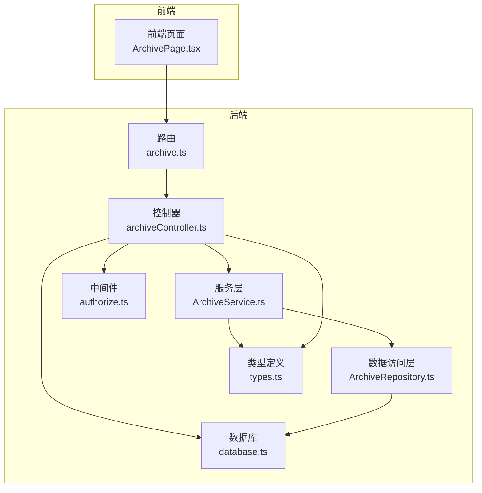
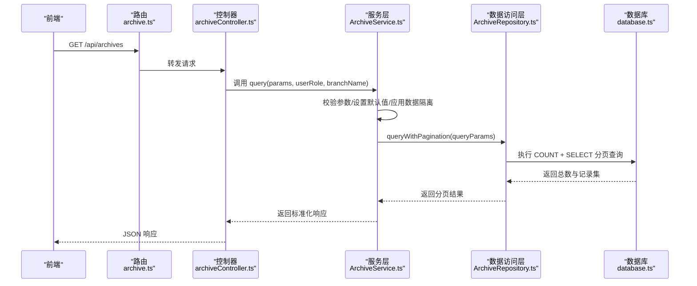
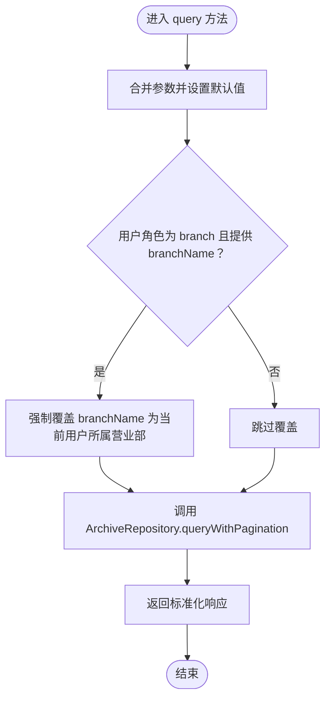
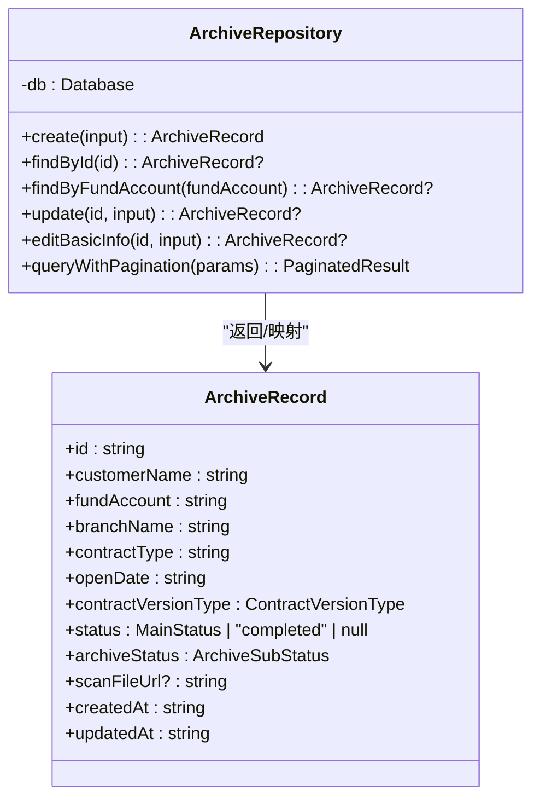
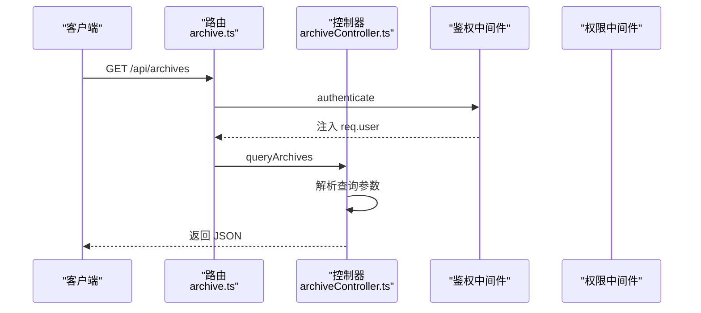
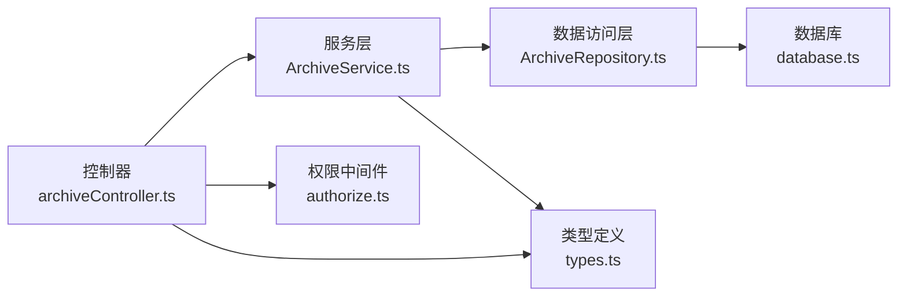

# 档案服务

<cite>
**本文引用的文件**
- [ArchiveService.ts](file://backend/src/services/ArchiveService.ts)
- [ArchiveRepository.ts](file://backend/src/models/ArchiveRepository.ts)
- [archiveController.ts](file://backend/src/controllers/archiveController.ts)
- [authorize.ts](file://backend/src/middlewares/authorize.ts)
- [types.ts](file://shared/types.ts)
- [archiveQuery.test.ts](file://backend/tests/unit/archiveQuery.test.ts)
- [archive.ts](file://backend/src/routes/archive.ts)
- [database.ts](file://backend/src/database.ts)
- [database-init.ts](file://backend/src/database-init.ts)
</cite>

## 目录
1. [简介](#简介)
2. [项目结构](#项目结构)
3. [核心组件](#核心组件)
4. [架构总览](#架构总览)
5. [详细组件分析](#详细组件分析)
6. [依赖关系分析](#依赖关系分析)
7. [性能考量](#性能考量)
8. [故障排查指南](#故障排查指南)
9. [结论](#结论)
10. [附录](#附录)

## 简介
本技术文档围绕档案服务（ArchiveService）展开，重点阐述其核心职责：
- 档案记录的查询逻辑与参数校验
- 数据分页处理与默认值设置
- 分支机构数据隔离机制
- 与数据访问层（ArchiveRepository）的协作关系
- 实际查询示例、最佳实践与安全注意事项

文档还提供了查询序列图、类图与流程图，帮助读者从不同维度理解系统设计与实现细节。

## 项目结构
档案服务位于后端工程的业务层与数据层之间，采用清晰的分层架构：
- 控制器层：负责 HTTP 请求解析与响应封装
- 服务层：负责业务逻辑编排与参数校验
- 数据访问层：负责数据库查询与结果映射
- 类型定义：前后端共享的类型与常量
- 路由与中间件：注册路由、鉴权与权限校验
- 测试：覆盖查询逻辑、分页与数据隔离

图表来源
- [archive.ts:1-42](file://backend/src/routes/archive.ts#L1-L42)
- [archiveController.ts:1-448](file://backend/src/controllers/archiveController.ts#L1-L448)
- [ArchiveService.ts:1-71](file://backend/src/services/ArchiveService.ts#L1-L71)
- [ArchiveRepository.ts:1-307](file://backend/src/models/ArchiveRepository.ts#L1-L307)
- [authorize.ts:1-47](file://backend/src/middlewares/authorize.ts#L1-L47)
- [database.ts:1-87](file://backend/src/database.ts#L1-L87)
- [types.ts:1-289](file://shared/types.ts#L1-L289)

章节来源
- [archive.ts:1-42](file://backend/src/routes/archive.ts#L1-L42)
- [archiveController.ts:1-448](file://backend/src/controllers/archiveController.ts#L1-L448)
- [ArchiveService.ts:1-71](file://backend/src/services/ArchiveService.ts#L1-L71)
- [ArchiveRepository.ts:1-307](file://backend/src/models/ArchiveRepository.ts#L1-L307)
- [authorize.ts:1-47](file://backend/src/middlewares/authorize.ts#L1-L47)
- [database.ts:1-87](file://backend/src/database.ts#L1-L87)
- [types.ts:1-289](file://shared/types.ts#L1-L289)

## 核心组件
- 档案查询服务（ArchiveService）
  - 负责接收查询参数、设置分页默认值、应用分支机构数据隔离、调用数据访问层并格式化返回结果
- 数据访问层（ArchiveRepository）
  - 提供分页查询、条件拼接、SQL 构造与结果映射
- 控制器（archiveController）
  - 解析 HTTP 请求参数、调用服务层、封装统一响应
- 权限中间件（authorize）
  - 对特定操作进行角色权限校验
- 类型定义（types）
  - 统一的查询参数、响应结构、状态枚举与权限常量

章节来源
- [ArchiveService.ts:19-71](file://backend/src/services/ArchiveService.ts#L19-L71)
- [ArchiveRepository.ts:85-307](file://backend/src/models/ArchiveRepository.ts#L85-L307)
- [archiveController.ts:99-147](file://backend/src/controllers/archiveController.ts#L99-L147)
- [authorize.ts:16-46](file://backend/src/middlewares/authorize.ts#L16-L46)
- [types.ts:143-164](file://shared/types.ts#L143-L164)

## 架构总览
档案查询的端到端流程如下：
- 前端发起 GET /api/archives 请求
- 路由与鉴权中间件处理请求
- 控制器解析查询参数并调用服务层
- 服务层进行参数校验与默认值设置，并应用数据隔离
- 服务层委托数据访问层执行分页查询
- 数据访问层构造 SQL 并返回结构化结果
- 控制器将结果以统一格式返回给前端

图表来源
- [archive.ts:17-18](file://backend/src/routes/archive.ts#L17-L18)
- [archiveController.ts:99-147](file://backend/src/controllers/archiveController.ts#L99-L147)
- [ArchiveService.ts:33-69](file://backend/src/services/ArchiveService.ts#L33-L69)
- [ArchiveRepository.ts:228-305](file://backend/src/models/ArchiveRepository.ts#L228-L305)
- [database.ts:25-52](file://backend/src/database.ts#L25-L52)

## 详细组件分析

### ArchiveService 查询方法实现原理
- 参数验证与默认值
  - page 与 pageSize 若为空或非正数，使用默认值（page=1，pageSize=20）
  - 将传入的 Partial<ArchiveQueryParams> 合并为完整参数对象
- 查询条件构建
  - 依据 customerName、fundAccount、branchName、contractType、status、archiveStatus、contractVersionType、openDateStart、openDateEnd 构建 WHERE 条件
  - 使用精确匹配与模糊匹配（LIKE %value%）相结合
- 分支机构数据隔离
  - 当用户角色为 branch 且提供 branchName 时，强制将查询参数中的 branchName 覆盖为当前用户所属营业部
- 结果格式化
  - 调用数据访问层返回的总数与记录集，组装为 ArchiveListResponse

图表来源
- [ArchiveService.ts:33-69](file://backend/src/services/ArchiveService.ts#L33-L69)

章节来源
- [ArchiveService.ts:13-17](file://backend/src/services/ArchiveService.ts#L13-L17)
- [ArchiveService.ts:33-69](file://backend/src/services/ArchiveService.ts#L33-L69)

### ArchiveRepository 分页查询与条件构建
- 条件拼接
  - 动态构建 WHERE 子句，支持多字段精确匹配与日期范围
- 分页实现
  - 先执行 COUNT 统计总数，再基于 LIMIT 与 OFFSET 获取分页记录
  - 使用 created_at 倒序排序保证最新记录优先
- 结果映射
  - 将数据库行（snake_case）映射为 ArchiveRecord（camelCase），并进行类型转换

图表来源
- [ArchiveRepository.ts:85-307](file://backend/src/models/ArchiveRepository.ts#L85-L307)
- [types.ts:46-60](file://shared/types.ts#L46-L60)

章节来源
- [ArchiveRepository.ts:228-305](file://backend/src/models/ArchiveRepository.ts#L228-L305)
- [ArchiveRepository.ts:32-48](file://backend/src/models/ArchiveRepository.ts#L32-L48)

### 控制器与路由集成
- 路由注册
  - GET /api/archives 由 authenticate 中间件保护，查询逻辑由 queryArchives 处理
- 控制器参数解析
  - 从 req.query 提取所有查询参数并转换为数字类型（如 page、pageSize）
  - 调用服务层并直接返回结果
- 权限控制
  - 对需要权限的操作（如创建、编辑）使用 authorize 中间件进行角色校验

图表来源
- [archive.ts:17-18](file://backend/src/routes/archive.ts#L17-L18)
- [archiveController.ts:99-147](file://backend/src/controllers/archiveController.ts#L99-L147)

章节来源
- [archive.ts:17-18](file://backend/src/routes/archive.ts#L17-L18)
- [archiveController.ts:99-147](file://backend/src/controllers/archiveController.ts#L99-L147)
- [authorize.ts:16-46](file://backend/src/middlewares/authorize.ts#L16-L46)

### 分支机构数据隔离机制与安全考虑
- 自动过滤
  - 当用户角色为 branch 时，服务层会强制将 branchName 覆盖为当前用户所属营业部，确保查询结果仅包含本营业部数据
- 安全边界
  - 控制器在处理查询请求时依赖用户上下文（req.user），权限中间件确保只有认证用户可访问
- 最佳实践
  - 不允许前端直接传递 branchName 参数绕过服务层过滤
  - 对于运营人员（operator）与综合部（general_affairs）开放跨营业部查询能力

章节来源
- [ArchiveService.ts:56-59](file://backend/src/services/ArchiveService.ts#L56-L59)
- [archiveController.ts:99-147](file://backend/src/controllers/archiveController.ts#L99-L147)
- [authorize.ts:16-46](file://backend/src/middlewares/authorize.ts#L16-L46)

### 查询示例与最佳实践
- 示例场景
  - 分页查询：page=2，pageSize=20，返回第一页记录
  - 模糊匹配：customerName="张"，返回包含“张”的客户
  - 精确匹配：fundAccount="FA-EXACT-1"，返回唯一资金账号
  - 日期范围：openDateStart='2024-03-01'，openDateEnd='2024-09-30'
  - 组合条件：customerName="王"、branchName="北京营业部"、status="in_transit"
- 最佳实践
  - 合理设置 pageSize，避免过大导致内存压力
  - 使用索引字段作为过滤条件（branchName、status、archiveStatus、contractVersionType）
  - 对高频查询建立合适的索引，减少 COUNT 与分页查询成本
  - 在前端实现分页控件时，严格限制最大页码与最大页大小

章节来源
- [archiveQuery.test.ts:78-95](file://backend/tests/unit/archiveQuery.test.ts#L78-L95)
- [archiveQuery.test.ts:125-141](file://backend/tests/unit/archiveQuery.test.ts#L125-L141)
- [archiveQuery.test.ts:181-192](file://backend/tests/unit/archiveQuery.test.ts#L181-L192)
- [archiveQuery.test.ts:194-205](file://backend/tests/unit/archiveQuery.test.ts#L194-L205)

## 依赖关系分析
- 组件耦合
  - 控制器依赖服务层；服务层依赖数据访问层；两者通过接口与类型解耦
  - 权限中间件与控制器解耦，仅通过 req.user 注入的用户信息进行校验
- 外部依赖
  - better-sqlite3 作为数据库驱动，WAL 模式提升并发性能
  - shared/types 提供前后端一致的类型定义
- 数据库索引
  - 档案表对 fund_account、branch_name、status、archive_status、contract_version_type 建立索引，优化查询性能

图表来源
- [archiveController.ts:1-24](file://backend/src/controllers/archiveController.ts#L1-L24)
- [ArchiveService.ts:6-11](file://backend/src/services/ArchiveService.ts#L6-L11)
- [ArchiveRepository.ts:6-14](file://backend/src/models/ArchiveRepository.ts#L6-L14)
- [authorize.ts:7-8](file://backend/src/middlewares/authorize.ts#L7-L8)
- [database.ts:8](file://backend/src/database.ts#L8)
- [types.ts:1-4](file://shared/types.ts#L1-L4)

章节来源
- [database-init.ts:42-47](file://backend/src/database-init.ts#L42-L47)
- [database.ts:42](file://backend/src/database.ts#L42)

## 性能考量
- 分页与排序
  - 使用 created_at 倒序排序，结合 LIMIT/OFFSET 实现分页；建议在高频查询场景下对排序字段建立索引
- 条件过滤
  - 精确匹配字段（如 fund_account、branch_name、status、archive_status、contract_version_type）具备索引，有利于快速过滤
- COUNT 与分页分离
  - 先 COUNT 再分页查询，避免一次性加载全部数据；对于超大结果集，建议引入游标分页或基于游标的增量拉取
- WAL 模式
  - 启用 WAL 模式提升并发读写性能，适合多用户并发查询场景
- 建议
  - 对高频组合查询（如 branchName+status+archiveStatus）评估复合索引
  - 控制 pageSize 上限，防止内存与网络压力过大
  - 对模糊查询（customerName）谨慎使用，必要时限制长度或增加前缀索引

章节来源
- [ArchiveRepository.ts:288-304](file://backend/src/models/ArchiveRepository.ts#L288-L304)
- [database.ts:42](file://backend/src/database.ts#L42)
- [database-init.ts:42-47](file://backend/src/database-init.ts#L42-L47)

## 故障排查指南
- 常见错误与处理
  - 未认证：控制器在缺少 req.user 时返回 401
  - 权限不足：authorize 中间件返回 403
  - 查询参数非法：控制器对 action、archiveIds 等参数进行校验并返回 400
  - 记录不存在：查询详情时返回 404
- 日志与追踪
  - 状态变更日志（status_change_logs）可用于审计与问题定位
- 建议
  - 在开发环境开启详细日志，记录 SQL 与参数
  - 对异常响应统一使用 ErrorResponse 结构，便于前端处理

章节来源
- [archiveController.ts:101-107](file://backend/src/controllers/archiveController.ts#L101-L107)
- [authorize.ts:20-26](file://backend/src/middlewares/authorize.ts#L20-L26)
- [archiveController.ts:221-228](file://backend/src/controllers/archiveController.ts#L221-L228)
- [archiveController.ts:170-177](file://backend/src/controllers/archiveController.ts#L170-L177)
- [types.ts:242-247](file://shared/types.ts#L242-L247)

## 结论
档案服务通过清晰的分层设计实现了：
- 稳健的查询逻辑与参数校验
- 合理的分页与默认值策略
- 强制的数据隔离保障
- 与数据访问层的紧密协作与类型一致性

配合完善的测试用例与索引策略，系统在性能与安全性方面均具备良好表现。建议在生产环境中持续监控查询性能，按需优化索引与分页策略。

## 附录
- 表结构与索引
  - 档案记录表（archive_records）包含主键、唯一资金账号、状态字段与索引
  - 状态变更日志表（status_change_logs）关联档案记录并建立索引
- 类型与枚举
  - 用户角色、合同版本类型、主流程状态、归档状态、权限等均在共享类型中定义

章节来源
- [database-init.ts:19-64](file://backend/src/database-init.ts#L19-L64)
- [types.ts:8-43](file://shared/types.ts#L8-L43)
- [types.ts:143-164](file://shared/types.ts#L143-L164)