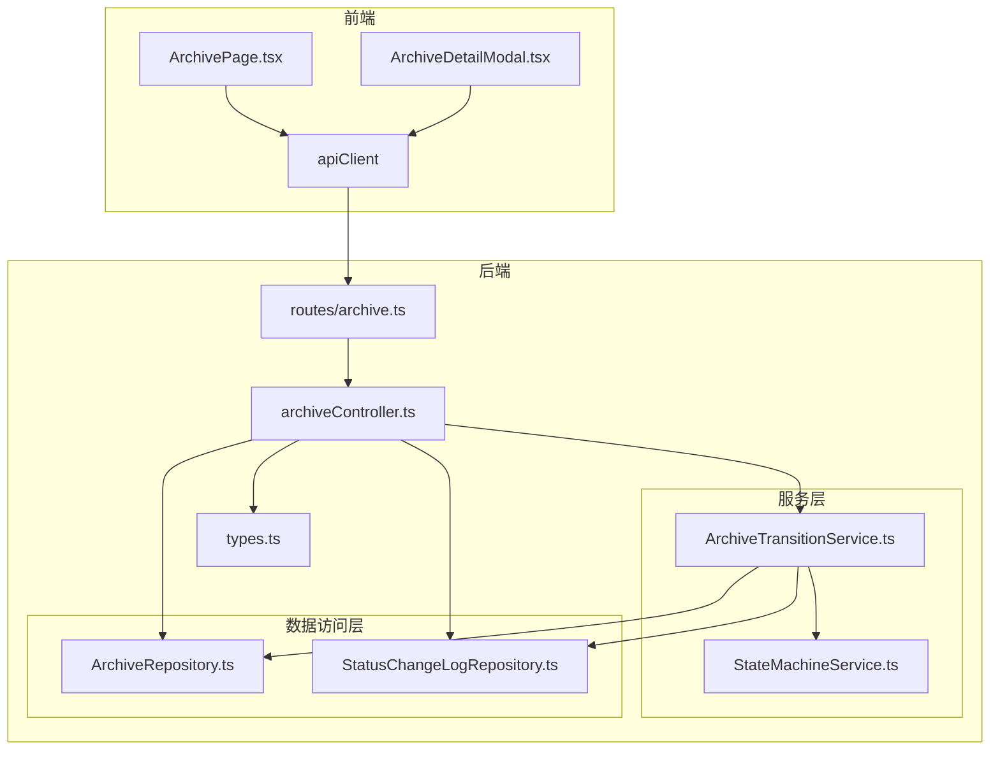
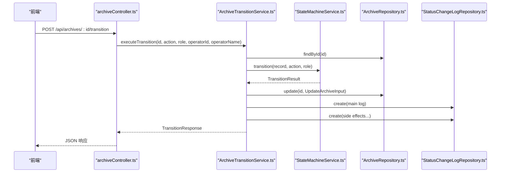
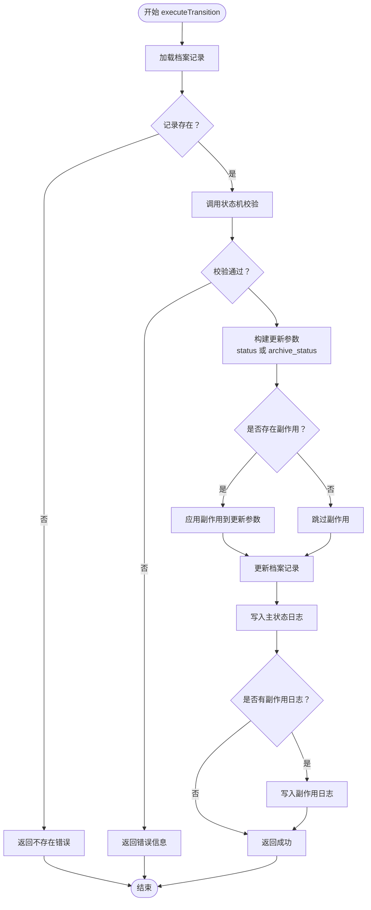
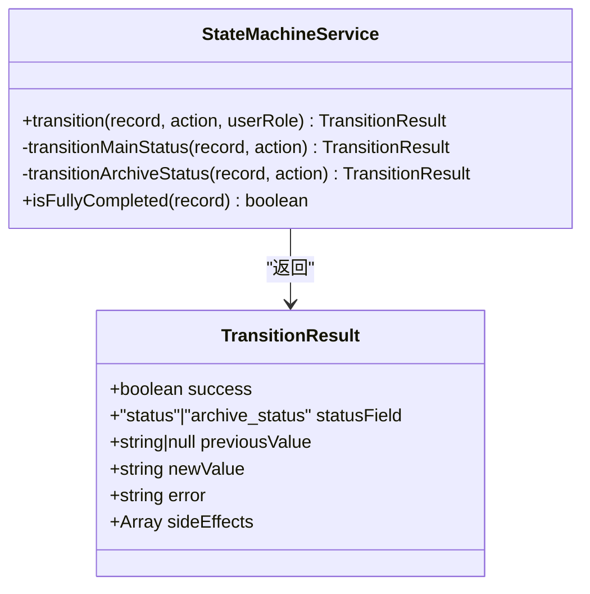
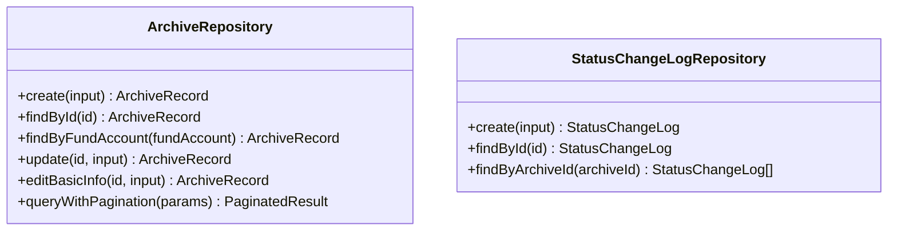
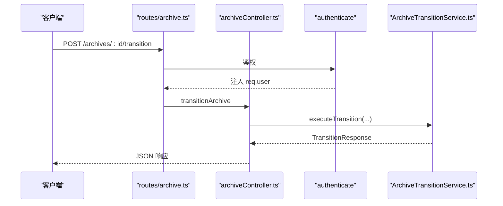
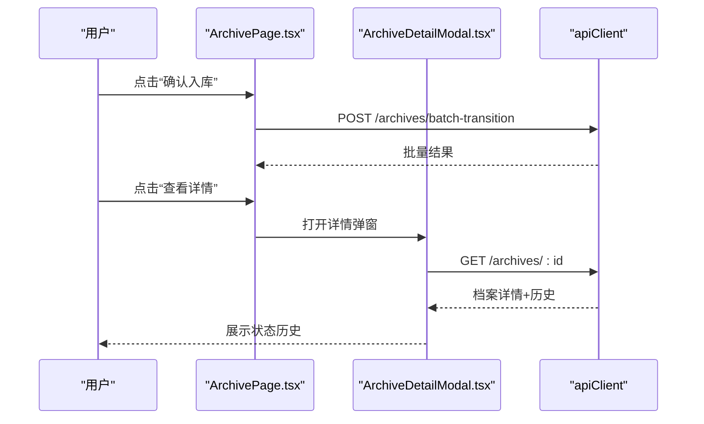
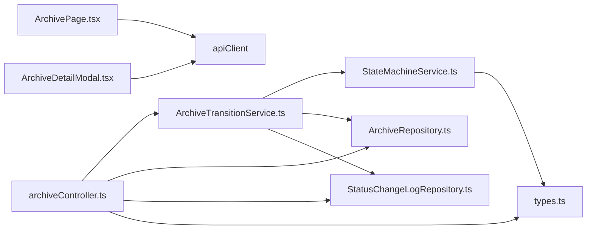

# 档案状态流转服务

<cite>
**本文引用的文件**
- [ArchiveTransitionService.ts](file://backend/src/services/ArchiveTransitionService.ts)
- [StateMachineService.ts](file://backend/src/services/StateMachineService.ts)
- [StatusChangeLogRepository.ts](file://backend/src/models/StatusChangeLogRepository.ts)
- [ArchiveRepository.ts](file://backend/src/models/ArchiveRepository.ts)
- [archiveController.ts](file://backend/src/controllers/archiveController.ts)
- [archive.ts](file://backend/src/routes/archive.ts)
- [types.ts](file://shared/types.ts)
- [archiveTransition.test.ts](file://backend/tests/unit/archiveTransition.test.ts)
- [stateMachine.test.ts](file://backend/tests/unit/stateMachine.test.ts)
- [ArchivePage.tsx](file://frontend/src/pages/ArchivePage.tsx)
- [ArchiveDetailModal.tsx](file://frontend/src/components/ArchiveDetailModal.tsx)
- [auth.ts](file://backend/src/middlewares/auth.ts)
</cite>

## 目录
1. [简介](#简介)
2. [项目结构](#项目结构)
3. [核心组件](#核心组件)
4. [架构总览](#架构总览)
5. [详细组件分析](#详细组件分析)
6. [依赖关系分析](#依赖关系分析)
7. [性能考虑](#性能考虑)
8. [故障排除指南](#故障排除指南)
9. [结论](#结论)
10. [附录](#附录)

## 简介
本文档围绕档案状态流转服务进行深入技术说明，重点阐述 ArchiveTransitionService 在状态机整合中的作用，包括：
- 状态转换协调：串联状态机校验、档案记录更新与状态变更日志记录
- 事务管理与审计：确保状态变更原子性与可追溯性
- 单个档案状态转换与批量状态处理的实现逻辑
- 与 StateMachineService 的协作关系：业务规则验证与状态约束检查
- 状态变更日志的生成与管理：StatusChangeLogRepository 的使用
- 完整流程示例：异常处理、回滚机制与并发控制策略
- 前端状态更新与用户体验优化策略

## 项目结构
后端采用分层架构，前端通过 API 客户端与后端交互。核心模块包括：
- 服务层：ArchiveTransitionService、StateMachineService
- 数据访问层：ArchiveRepository、StatusChangeLogRepository
- 控制器与路由：archiveController、routes/archive.ts
- 类型定义：shared/types.ts
- 前端页面与组件：ArchivePage、ArchiveDetailModal
- 中间件：认证中间件

图表来源
- [archive.ts:1-42](file://backend/src/routes/archive.ts#L1-L42)
- [archiveController.ts:1-448](file://backend/src/controllers/archiveController.ts#L1-L448)
- [ArchiveTransitionService.ts:1-156](file://backend/src/services/ArchiveTransitionService.ts#L1-L156)
- [StateMachineService.ts:1-253](file://backend/src/services/StateMachineService.ts#L1-L253)
- [ArchiveRepository.ts:1-307](file://backend/src/models/ArchiveRepository.ts#L1-L307)
- [StatusChangeLogRepository.ts:1-99](file://backend/src/models/StatusChangeLogRepository.ts#L1-L99)
- [types.ts:1-289](file://shared/types.ts#L1-L289)

章节来源
- [archive.ts:1-42](file://backend/src/routes/archive.ts#L1-L42)
- [archiveController.ts:1-448](file://backend/src/controllers/archiveController.ts#L1-L448)
- [types.ts:1-289](file://shared/types.ts#L1-L289)

## 核心组件
- ArchiveTransitionService：负责单条与批量状态流转的编排，整合状态机校验、档案记录更新与日志写入
- StateMachineService：提供主流程与归档状态的合法转换表、角色权限映射与前置保护（电子版合同、完结保护）
- ArchiveRepository：提供档案记录的查询、更新与分页查询
- StatusChangeLogRepository：提供状态变更日志的写入与按档案 ID 查询
- archiveController：暴露 HTTP 接口，调用服务层执行状态流转与批量流转，并返回统一响应
- 前端组件：ArchivePage、ArchiveDetailModal 展示状态与历史，触发批量确认入库等操作

章节来源
- [ArchiveTransitionService.ts:1-156](file://backend/src/services/ArchiveTransitionService.ts#L1-L156)
- [StateMachineService.ts:1-253](file://backend/src/services/StateMachineService.ts#L1-L253)
- [ArchiveRepository.ts:1-307](file://backend/src/models/ArchiveRepository.ts#L1-L307)
- [StatusChangeLogRepository.ts:1-99](file://backend/src/models/StatusChangeLogRepository.ts#L1-L99)
- [archiveController.ts:1-448](file://backend/src/controllers/archiveController.ts#L1-L448)
- [ArchivePage.tsx:1-181](file://frontend/src/pages/ArchivePage.tsx#L1-L181)
- [ArchiveDetailModal.tsx:1-153](file://frontend/src/components/ArchiveDetailModal.tsx#L1-L153)

## 架构总览
状态流转服务的整体流程如下：
- 前端发起状态流转请求（单条或批量）
- 控制器进行参数校验与鉴权
- 服务层调用状态机进行合法性校验
- 若通过，更新档案记录并写入状态变更日志
- 返回统一响应给前端

图表来源
- [archiveController.ts:208-258](file://backend/src/controllers/archiveController.ts#L208-L258)
- [ArchiveTransitionService.ts:46-125](file://backend/src/services/ArchiveTransitionService.ts#L46-L125)
- [StateMachineService.ts:106-142](file://backend/src/services/StateMachineService.ts#L106-L142)
- [ArchiveRepository.ts:140-174](file://backend/src/models/ArchiveRepository.ts#L140-L174)
- [StatusChangeLogRepository.ts:56-79](file://backend/src/models/StatusChangeLogRepository.ts#L56-L79)

## 详细组件分析

### ArchiveTransitionService：状态流转编排与审计
职责与流程要点：
- 单条流转：查询档案 → 状态机校验 → 构建更新参数（区分 status 与 archive_status）→ 处理联动副作用 → 更新档案 → 写入主日志与副作用日志
- 批量流转：逐条执行单条流程，汇总结果与计数
- 特殊联动：
  - review_pass：当 archive_status 为 archive_not_started 时，自动将 archive_status 联动更新为 pending_transfer，并产生两条日志
  - confirm_return_received：根据 archive_status 自动判断：
    - archive_not_started → 回退到 pending_shipment
    - archived → 完结为 completed
    - 其他中间状态 → 保持 branch_received

图表来源
- [ArchiveTransitionService.ts:46-125](file://backend/src/services/ArchiveTransitionService.ts#L46-L125)

章节来源
- [ArchiveTransitionService.ts:1-156](file://backend/src/services/ArchiveTransitionService.ts#L1-L156)
- [archiveTransition.test.ts:70-293](file://backend/tests/unit/archiveTransition.test.ts#L70-L293)

### StateMachineService：状态机与业务规则
- 合法转换表：
  - 主流程状态（8 个）：pending_shipment → in_transit → hq_received → review_passed/review_rejected → pending_return → return_in_transit → branch_received
  - 归档状态（4 个）：archive_not_started → pending_transfer → pending_archive → archived
- 角色权限映射：每个操作绑定特定角色（如 confirm_shipment 需 branch，confirm_archive 需 general_affairs）
- 前置保护：
  - 电子版合同：拒绝所有状态变更操作
  - 完全完结保护：status === 'completed' 的记录拒绝任何变更
- 联动与自动判断：
  - review_pass：archive_status 从 archive_not_started → pending_transfer
  - confirm_return_received：根据 archive_status 自动回退或完结

图表来源
- [StateMachineService.ts:96-252](file://backend/src/services/StateMachineService.ts#L96-L252)

章节来源
- [StateMachineService.ts:1-253](file://backend/src/services/StateMachineService.ts#L1-L253)
- [stateMachine.test.ts:1-561](file://backend/tests/unit/stateMachine.test.ts#L1-L561)

### 数据访问层：档案与日志
- ArchiveRepository：
  - 提供 create、findById、findByFundAccount、update、editBasicInfo、queryWithPagination 等方法
  - 支持部分字段更新与时间戳自动更新
- StatusChangeLogRepository：
  - 提供 create、findById、findByArchiveId 方法
  - 写入时自动生成 UUID 与当前时间

图表来源
- [ArchiveRepository.ts:85-307](file://backend/src/models/ArchiveRepository.ts#L85-L307)
- [StatusChangeLogRepository.ts:49-99](file://backend/src/models/StatusChangeLogRepository.ts#L49-L99)

章节来源
- [ArchiveRepository.ts:1-307](file://backend/src/models/ArchiveRepository.ts#L1-L307)
- [StatusChangeLogRepository.ts:1-99](file://backend/src/models/StatusChangeLogRepository.ts#L1-L99)

### 控制器与路由：接口与鉴权
- 路由注册：GET /archives、POST /archives/import、POST /archives/batch-transition、GET /archives/:id、POST /archives/:id/transition、PUT /archives/:id 等
- 鉴权中间件：authenticate 将用户信息注入 req.user
- 参数校验：控制器对 action、archiveIds、角色等进行校验
- 统一响应：错误码与消息标准化

图表来源
- [archive.ts:1-42](file://backend/src/routes/archive.ts#L1-L42)
- [archiveController.ts:208-258](file://backend/src/controllers/archiveController.ts#L208-L258)
- [auth.ts:26-55](file://backend/src/middlewares/auth.ts#L26-L55)

章节来源
- [archive.ts:1-42](file://backend/src/routes/archive.ts#L1-L42)
- [archiveController.ts:1-448](file://backend/src/controllers/archiveController.ts#L1-L448)
- [auth.ts:1-56](file://backend/src/middlewares/auth.ts#L1-L56)

### 前端：状态展示与用户交互
- ArchivePage：展示“待综合部入库”状态的档案列表，支持批量勾选与一键确认入库
- ArchiveDetailModal：展示档案详情与状态变更历史（Timeline）
- 用户体验优化：
  - 加载状态提示与禁用按钮
  - 成功/失败消息提示
  - 分页与筛选参数持久化

图表来源
- [ArchivePage.tsx:64-93](file://frontend/src/pages/ArchivePage.tsx#L64-L93)
- [ArchiveDetailModal.tsx:64-75](file://frontend/src/components/ArchiveDetailModal.tsx#L64-L75)

章节来源
- [ArchivePage.tsx:1-181](file://frontend/src/pages/ArchivePage.tsx#L1-L181)
- [ArchiveDetailModal.tsx:1-153](file://frontend/src/components/ArchiveDetailModal.tsx#L1-L153)

## 依赖关系分析
- ArchiveTransitionService 依赖：
  - StateMachineService：状态机校验与联动逻辑
  - ArchiveRepository：档案记录更新
  - StatusChangeLogRepository：日志写入
- StateMachineService 依赖：
  - 类型定义（共享类型）
  - 内置转换表与角色映射
- 控制器依赖：
  - 服务层与数据访问层
  - 鉴权中间件
- 前端依赖：
  - apiClient 与共享类型

图表来源
- [ArchiveTransitionService.ts:18-37](file://backend/src/services/ArchiveTransitionService.ts#L18-L37)
- [StateMachineService.ts:6-12](file://backend/src/services/StateMachineService.ts#L6-L12)
- [archiveController.ts:8-23](file://backend/src/controllers/archiveController.ts#L8-L23)
- [types.ts:1-289](file://shared/types.ts#L1-L289)

章节来源
- [ArchiveTransitionService.ts:1-156](file://backend/src/services/ArchiveTransitionService.ts#L1-L156)
- [StateMachineService.ts:1-253](file://backend/src/services/StateMachineService.ts#L1-L253)
- [archiveController.ts:1-448](file://backend/src/controllers/archiveController.ts#L1-L448)
- [types.ts:1-289](file://shared/types.ts#L1-L289)

## 性能考虑
- 数据库层面：
  - better-sqlite3 适合中小规模数据与高并发读写场景；建议在高频查询字段上建立索引（如 status、archive_status、fund_account）
  - 批量操作使用逐条执行，便于日志与错误隔离；若需要更高吞吐，可在事务内批量更新并一次性写入日志
- 服务层：
  - 单条与批量流程均进行状态机校验，避免重复计算
  - 日志写入为同步操作，保证一致性；若对延迟敏感，可考虑异步队列写入
- 前端：
  - 分页与懒加载减少首屏压力
  - 按钮禁用与加载指示提升交互体验

## 故障排除指南
常见问题与定位：
- 档案记录不存在：返回 404，message 为“档案记录不存在”
- 权限不足：返回 400，message 为“权限不足”
- 电子版合同或已完结记录：返回 400，message 为“电子版合同无需执行此操作”或“该记录已完全完结，不可修改”
- 非法状态跳转：返回 400，message 为“状态流转不合法”
- 批量操作部分失败：successCount 与 failureCount 记录分别成功/失败的条目，失败项包含具体 message

章节来源
- [archiveController.ts:244-252](file://backend/src/controllers/archiveController.ts#L244-L252)
- [archiveTransition.test.ts:365-447](file://backend/tests/unit/archiveTransition.test.ts#L365-L447)

## 结论
ArchiveTransitionService 通过与 StateMachineService 的深度整合，实现了严谨的业务规则与状态约束，配合 ArchiveRepository 与 StatusChangeLogRepository 提供了可靠的档案更新与审计能力。前端通过直观的表格与弹窗展示状态与历史，结合批量操作提升了运营效率。整体设计在一致性、可观测性与用户体验之间取得了良好平衡。

## 附录

### 状态流转完整流程示例（审核通过路径）
- pending_shipment → in_transit（review_pass 联动 archive_status：archive_not_started → pending_transfer）
- hq_received → review_passed
- review_passed → pending_return → return_in_transit → branch_received
- transfer_general：pending_transfer → pending_archive
- confirm_archive：pending_archive → archived
- 最终状态：branch_received（archive_status=archived），自动完结为 completed（由状态机内部逻辑决定）

章节来源
- [archiveTransition.test.ts:250-293](file://backend/tests/unit/archiveTransition.test.ts#L250-L293)
- [StateMachineService.ts:182-200](file://backend/src/services/StateMachineService.ts#L182-L200)

### 异常处理与回滚机制
- 异常处理：控制器根据错误类型返回不同 HTTP 状态码（404/400），并携带统一错误码与消息
- 回滚机制：当前实现为同步串行执行，若任一步骤失败（如状态机校验失败或数据库更新失败），不会写入日志；因此不存在跨步骤回滚
- 并发控制：建议在数据库层面增加唯一约束与乐观锁字段，或在服务层引入分布式锁以避免竞态

章节来源
- [archiveController.ts:244-252](file://backend/src/controllers/archiveController.ts#L244-L252)
- [ArchiveTransitionService.ts:63-71](file://backend/src/services/ArchiveTransitionService.ts#L63-L71)

### 前端状态更新与用户体验优化策略
- ArchivePage：批量勾选 + 一键确认入库，成功/失败提示，自动刷新列表
- ArchiveDetailModal：按时间倒序展示 Timeline，清晰呈现每次状态变更的触发者与字段
- 统一的消息提示与加载状态，减少用户等待焦虑

章节来源
- [ArchivePage.tsx:64-93](file://frontend/src/pages/ArchivePage.tsx#L64-L93)
- [ArchiveDetailModal.tsx:120-146](file://frontend/src/components/ArchiveDetailModal.tsx#L120-L146)