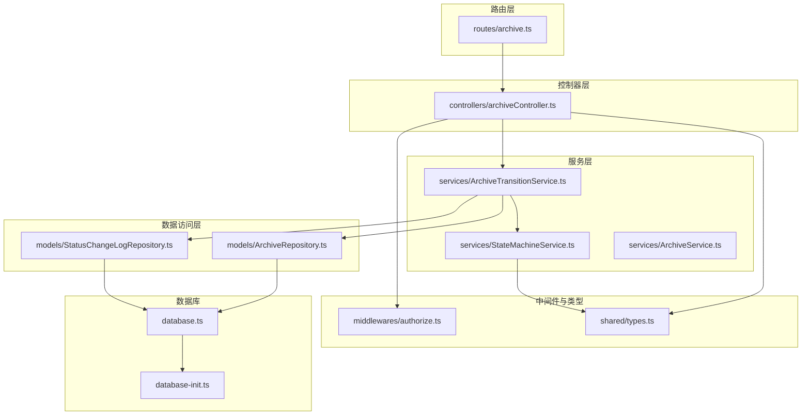
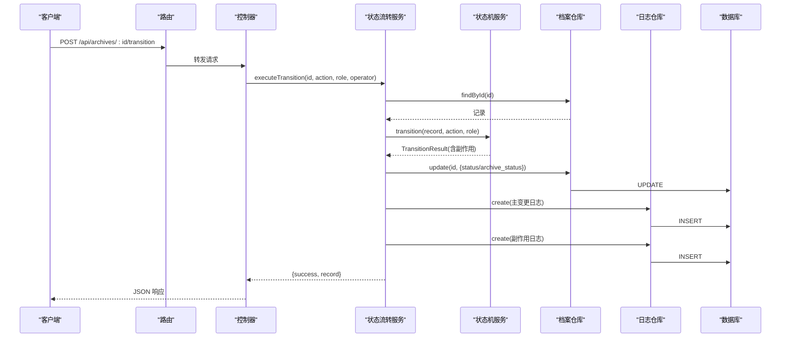
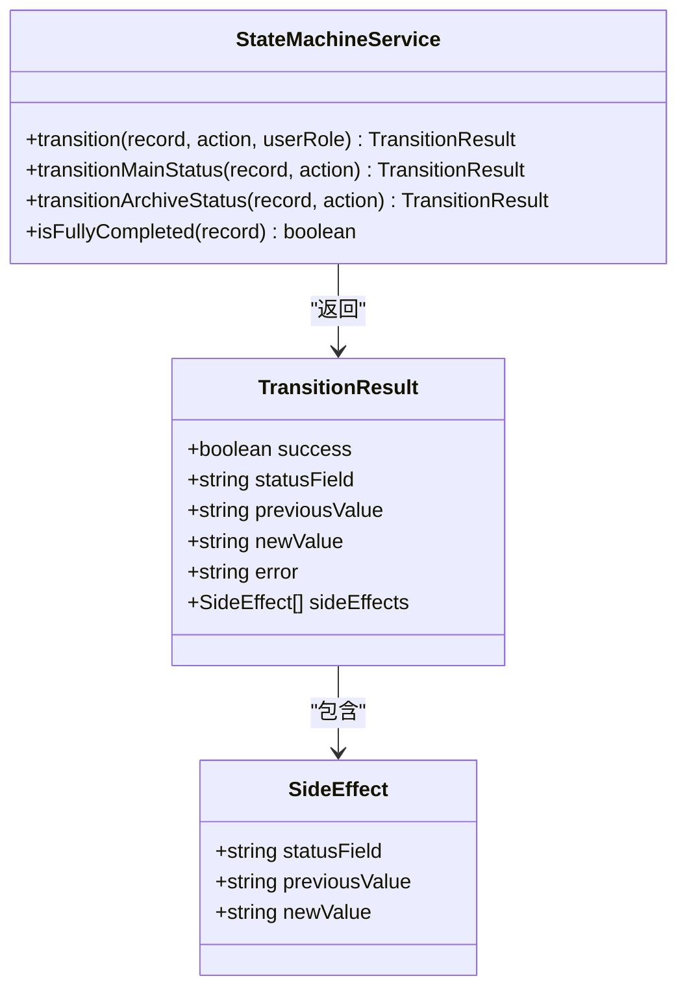
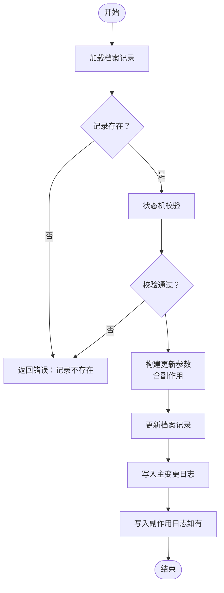
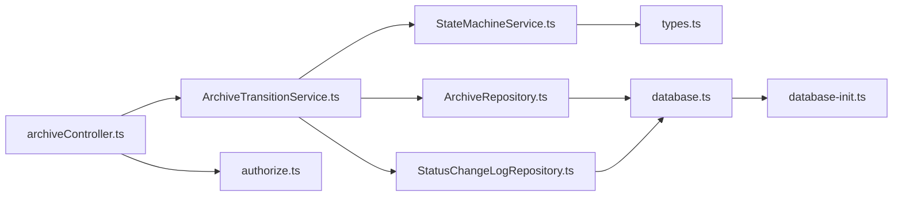
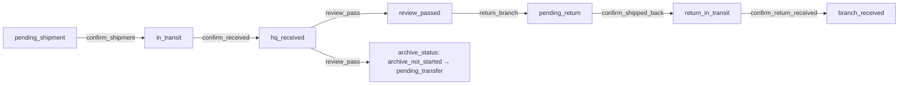
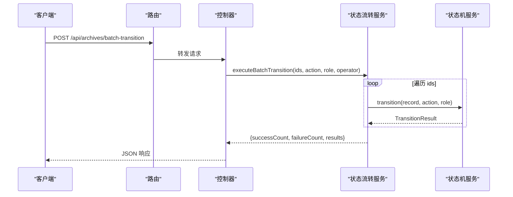

# 状态机服务

<cite>
**本文引用的文件**
- [StateMachineService.ts](file://backend/src/services/StateMachineService.ts)
- [ArchiveTransitionService.ts](file://backend/src/services/ArchiveTransitionService.ts)
- [ArchiveRepository.ts](file://backend/src/models/ArchiveRepository.ts)
- [StatusChangeLogRepository.ts](file://backend/src/models/StatusChangeLogRepository.ts)
- [archiveController.ts](file://backend/src/controllers/archiveController.ts)
- [authorize.ts](file://backend/src/middlewares/authorize.ts)
- [types.ts](file://shared/types.ts)
- [archive.ts](file://backend/src/routes/archive.ts)
- [database.ts](file://backend/src/database.ts)
- [database-init.ts](file://backend/src/database-init.ts)
- [stateMachine.test.ts](file://backend/tests/unit/stateMachine.test.ts)
</cite>

## 目录
1. [简介](#简介)
2. [项目结构](#项目结构)
3. [核心组件](#核心组件)
4. [架构总览](#架构总览)
5. [详细组件分析](#详细组件分析)
6. [依赖关系分析](#依赖关系分析)
7. [性能考量](#性能考量)
8. [故障排查指南](#故障排查指南)
9. [结论](#结论)
10. [附录](#附录)

## 简介
本文件围绕状态机服务（StateMachineService）进行深入技术文档化，重点阐述其在业务流程控制中的关键作用，包括：
- 状态转换规则与权限矩阵
- 业务约束验证（电子版合同保护、完全完结保护）
- 状态机设计原理（状态定义、转换条件、前置/后置条件）
- 单条记录状态变更与批量状态处理的实现
- 与权限系统的集成（基于角色的操作授权）
- 调试方法、错误处理策略与性能优化建议
- 完整的状态转换示例与业务流程图解

## 项目结构
状态机服务位于后端服务层，与控制器、数据访问层、中间件以及共享类型紧密协作，形成清晰的分层架构。

图表来源
- [archive.ts:1-42](file://backend/src/routes/archive.ts#L1-L42)
- [archiveController.ts:1-448](file://backend/src/controllers/archiveController.ts#L1-L448)
- [StateMachineService.ts:1-253](file://backend/src/services/StateMachineService.ts#L1-L253)
- [ArchiveTransitionService.ts:1-156](file://backend/src/services/ArchiveTransitionService.ts#L1-L156)
- [ArchiveRepository.ts:1-307](file://backend/src/models/ArchiveRepository.ts#L1-L307)
- [StatusChangeLogRepository.ts:1-99](file://backend/src/models/StatusChangeLogRepository.ts#L1-L99)
- [authorize.ts:1-47](file://backend/src/middlewares/authorize.ts#L1-L47)
- [types.ts:1-289](file://shared/types.ts#L1-L289)
- [database.ts:1-87](file://backend/src/database.ts#L1-L87)
- [database-init.ts:1-65](file://backend/src/database-init.ts#L1-L65)

章节来源
- [archive.ts:1-42](file://backend/src/routes/archive.ts#L1-L42)
- [archiveController.ts:1-448](file://backend/src/controllers/archiveController.ts#L1-L448)
- [StateMachineService.ts:1-253](file://backend/src/services/StateMachineService.ts#L1-L253)
- [ArchiveTransitionService.ts:1-156](file://backend/src/services/ArchiveTransitionService.ts#L1-L156)
- [ArchiveRepository.ts:1-307](file://backend/src/models/ArchiveRepository.ts#L1-L307)
- [StatusChangeLogRepository.ts:1-99](file://backend/src/models/StatusChangeLogRepository.ts#L1-L99)
- [authorize.ts:1-47](file://backend/src/middlewares/authorize.ts#L1-L47)
- [types.ts:1-289](file://shared/types.ts#L1-L289)
- [database.ts:1-87](file://backend/src/database.ts#L1-L87)
- [database-init.ts:1-65](file://backend/src/database-init.ts#L1-L65)

## 核心组件
- 状态机服务（StateMachineService）：负责状态转换校验、角色权限校验、业务约束检查与副作用联动。
- 状态流转服务（ArchiveTransitionService）：封装状态机校验、记录更新与日志写入的完整事务流程；支持单条与批量状态变更。
- 数据访问层（ArchiveRepository、StatusChangeLogRepository）：提供档案记录与状态变更日志的持久化能力。
- 控制器（archiveController）：暴露 REST API，接收请求参数，调用状态流转服务并返回结果。
- 权限中间件（authorize）：在路由层对操作进行权限拦截，结合状态机内部角色校验形成双重保障。
- 共享类型（types.ts）：统一定义状态、动作、角色、权限等类型，确保前后端一致性。

章节来源
- [StateMachineService.ts:96-253](file://backend/src/services/StateMachineService.ts#L96-L253)
- [ArchiveTransitionService.ts:24-156](file://backend/src/services/ArchiveTransitionService.ts#L24-L156)
- [ArchiveRepository.ts:85-307](file://backend/src/models/ArchiveRepository.ts#L85-L307)
- [StatusChangeLogRepository.ts:49-99](file://backend/src/models/StatusChangeLogRepository.ts#L49-L99)
- [archiveController.ts:208-324](file://backend/src/controllers/archiveController.ts#L208-L324)
- [authorize.ts:16-46](file://backend/src/middlewares/authorize.ts#L16-L46)
- [types.ts:6-289](file://shared/types.ts#L6-L289)

## 架构总览
状态机服务在“控制器 → 状态流转服务 → 状态机服务”的链路中承担核心校验职责，随后由状态流转服务协调数据更新与日志记录，最终通过数据库持久化。

图表来源
- [archiveController.ts:208-258](file://backend/src/controllers/archiveController.ts#L208-L258)
- [ArchiveTransitionService.ts:46-125](file://backend/src/services/ArchiveTransitionService.ts#L46-L125)
- [StateMachineService.ts:106-142](file://backend/src/services/StateMachineService.ts#L106-L142)
- [ArchiveRepository.ts:140-174](file://backend/src/models/ArchiveRepository.ts#L140-L174)
- [StatusChangeLogRepository.ts:56-79](file://backend/src/models/StatusChangeLogRepository.ts#L56-L79)

## 详细组件分析

### 状态机服务（StateMachineService）
- 设计原则
  - 双状态字段：主流程状态（status）与综合部归档状态（archive_status），分别维护各自的转换表。
  - 权限驱动：每个操作绑定固定角色，状态机内部进行角色校验。
  - 业务约束：电子版合同禁止所有状态变更；完全完结记录禁止任何变更。
  - 副作用联动：特定操作触发额外状态变更（如 review_pass 联动 archive_status，或 confirm_return_received 的自动判断）。
- 关键数据结构
  - 主流程状态转换表（8个状态值）
  - 综合部归档状态转换表（4个状态值）
  - 操作-角色映射表
  - 操作-状态字段映射表
- 前置校验顺序
  1) 电子版合同保护
  2) 完全完结保护
  3) 角色权限校验
- 核心方法
  - transition：统一入口，根据操作确定状态字段并执行相应转换逻辑。
  - transitionMainStatus：主流程状态转换与副作用处理。
  - transitionArchiveStatus：归档状态转换与错误细化。
  - isFullyCompleted：判断记录是否完全完结。

图表来源
- [StateMachineService.ts:14-27](file://backend/src/services/StateMachineService.ts#L14-L27)
- [StateMachineService.ts:96-253](file://backend/src/services/StateMachineService.ts#L96-L253)

章节来源
- [StateMachineService.ts:29-94](file://backend/src/services/StateMachineService.ts#L29-L94)
- [StateMachineService.ts:96-253](file://backend/src/services/StateMachineService.ts#L96-L253)

### 状态流转服务（ArchiveTransitionService）
- 职责
  - 单条状态变更：查询记录 → 状态机校验 → 更新记录 → 写入主变更日志 → 写入副作用日志。
  - 批量状态变更：逐条执行上述流程，汇总统计结果。
- 事务特性
  - 成功时保证记录更新与日志写入的一致性；失败时返回明确错误信息。
- 副作用处理
  - 对 review_pass 与 confirm_return_received 的联动逻辑进行补偿写入。

图表来源
- [ArchiveTransitionService.ts:46-125](file://backend/src/services/ArchiveTransitionService.ts#L46-L125)

章节来源
- [ArchiveTransitionService.ts:24-156](file://backend/src/services/ArchiveTransitionService.ts#L24-L156)

### 数据访问层
- ArchiveRepository
  - 提供创建、查询、更新、编辑基础信息与分页查询能力。
  - 支持多条件组合查询与索引优化。
- StatusChangeLogRepository
  - 提供日志创建、按 ID 查询与按档案 ID 查询历史的能力。

章节来源
- [ArchiveRepository.ts:85-307](file://backend/src/models/ArchiveRepository.ts#L85-L307)
- [StatusChangeLogRepository.ts:49-99](file://backend/src/models/StatusChangeLogRepository.ts#L49-L99)

### 控制器与路由
- 控制器
  - 单条状态变更：校验 action → 调用状态流转服务 → 返回结果。
  - 批量状态变更：校验参数 → 调用状态流转服务 → 返回汇总结果。
- 路由
  - 使用 authenticate 中间件进行鉴权，部分路由使用 authorize 中间件进行权限拦截。

章节来源
- [archiveController.ts:208-324](file://backend/src/controllers/archiveController.ts#L208-L324)
- [archive.ts:17-36](file://backend/src/routes/archive.ts#L17-L36)

### 权限系统集成
- 角色与权限
  - 用户角色：operator、branch、general_affairs。
  - 权限集合：包含导入、搜索、审核、回寄、确认收货、转交综合部、上传扫描件、OCR、查看本人档案、确认寄出、确认退回、确认入库等。
- 中间件 authorize
  - 在路由层对所需权限进行校验，与状态机内部的角色校验共同构成安全防线。
- 状态机内部角色映射
  - 每个 TransitionAction 映射到固定角色，确保操作者具备相应权限。

章节来源
- [types.ts:8-102](file://shared/types.ts#L8-L102)
- [authorize.ts:16-46](file://backend/src/middlewares/authorize.ts#L16-L46)
- [StateMachineService.ts:70-81](file://backend/src/services/StateMachineService.ts#L70-L81)

## 依赖关系分析
- 组件耦合
  - StateMachineService 与 ArchiveTransitionService：前者专注校验，后者负责事务编排。
  - ArchiveTransitionService 依赖 ArchiveRepository 与 StatusChangeLogRepository，形成稳定的仓储层依赖。
  - 控制器依赖状态流转服务与中间件，保持路由与业务逻辑分离。
- 外部依赖
  - better-sqlite3：数据库访问。
  - express：HTTP 路由与中间件。
  - shared/types：类型定义与常量集合。

图表来源
- [archiveController.ts:1-448](file://backend/src/controllers/archiveController.ts#L1-L448)
- [ArchiveTransitionService.ts:1-156](file://backend/src/services/ArchiveTransitionService.ts#L1-L156)
- [StateMachineService.ts:1-253](file://backend/src/services/StateMachineService.ts#L1-L253)
- [ArchiveRepository.ts:1-307](file://backend/src/models/ArchiveRepository.ts#L1-L307)
- [StatusChangeLogRepository.ts:1-99](file://backend/src/models/StatusChangeLogRepository.ts#L1-L99)
- [authorize.ts:1-47](file://backend/src/middlewares/authorize.ts#L1-L47)
- [types.ts:1-289](file://shared/types.ts#L1-L289)
- [database.ts:1-87](file://backend/src/database.ts#L1-L87)
- [database-init.ts:1-65](file://backend/src/database-init.ts#L1-L65)

## 性能考量
- 数据库层面
  - WAL 模式：提升并发读写性能，适合高并发场景。
  - 外键约束：保证数据一致性，避免脏数据。
  - 索引：对常用查询字段（资金账号、营业部、主状态、归档状态、合同版本类型）建立索引，加速分页与过滤。
- 代码层面
  - 状态转换表采用映射结构，查找复杂度为 O(1)，减少分支判断开销。
  - 批量处理逐条执行，便于错误隔离与重试策略。
- 建议
  - 对高频查询增加复合索引以进一步优化分页查询。
  - 批量处理时可考虑分批提交，平衡吞吐与资源占用。

章节来源
- [database.ts:41-45](file://backend/src/database.ts#L41-L45)
- [database-init.ts:42-47](file://backend/src/database-init.ts#L42-L47)
- [ArchiveRepository.ts:228-305](file://backend/src/models/ArchiveRepository.ts#L228-L305)

## 故障排查指南
- 常见错误与定位
  - 电子版合同：状态机直接拒绝所有状态变更，检查合同版本类型。
  - 完全完结：status=completed 的记录禁止任何变更，检查业务是否需要自动完结逻辑。
  - 权限不足：状态机内部角色校验失败，检查用户角色与操作映射。
  - 状态不合法：当前状态与目标状态不在转换表中，检查状态机转换表与业务流程。
  - 记录不存在：状态流转服务在更新前会先查询，确认 ID 是否正确。
- 日志与审计
  - 状态变更日志记录主变更与副作用变更，便于回溯与审计。
- 调试建议
  - 使用单元测试覆盖关键路径（状态转换、角色校验、电子版保护、完全完结保护、副作用联动）。
  - 在开发环境开启更详细的日志输出，定位具体失败点。

章节来源
- [stateMachine.test.ts:1-561](file://backend/tests/unit/stateMachine.test.ts#L1-L561)
- [ArchiveTransitionService.ts:53-71](file://backend/src/services/ArchiveTransitionService.ts#L53-L71)
- [StatusChangeLogRepository.ts:56-79](file://backend/src/models/StatusChangeLogRepository.ts#L56-L79)

## 结论
StateMachineService 通过清晰的状态定义、严格的权限矩阵与完善的业务约束，确保档案状态流转的合规性与可追溯性。配合 ArchiveTransitionService 的事务编排与日志记录，实现了从控制器到数据库的完整闭环。在性能方面，WAL 模式与索引优化提供了良好的基础，建议在生产环境中结合监控与压测持续优化。

## 附录

### 状态转换示例与业务流程图解
- 示例一：主流程状态变更（确认寄出 → 在途 → 总部签收 → 审核通过 → 待回寄 → 回寄在途 → 分支签收）
  - 步骤：confirm_shipment → confirm_received → review_pass → return_branch → confirm_shipped_back → confirm_return_received
  - 权限：branch → operator → operator → operator → operator → branch
- 示例二：归档状态变更（审核通过 → 待转交 → 待综合部入库 → 已归档）
  - 步骤：review_pass → transfer_general → confirm_archive
  - 权限：operator → operator → general_affairs
- 示例三：副作用联动
  - review_pass：主状态从“总部签收”变为“审核通过”，同时归档状态从“归档待启动”变为“待转交”。
  - confirm_return_received：根据归档状态自动判断后续动作（退回或完结）。

图表来源
- [StateMachineService.ts:29-54](file://backend/src/services/StateMachineService.ts#L29-L54)
- [StateMachineService.ts:173-200](file://backend/src/services/StateMachineService.ts#L173-L200)

### API 定义与调用序列
- 单条状态变更
  - 方法：POST /api/archives/:id/transition
  - 参数：action（TransitionAction）
  - 返回：TransitionResponse
- 批量状态变更
  - 方法：POST /api/archives/batch-transition
  - 参数：archiveIds（string[]）、action（TransitionAction）
  - 返回：BatchTransitionResponse

图表来源
- [archiveController.ts:279-324](file://backend/src/controllers/archiveController.ts#L279-L324)
- [ArchiveTransitionService.ts:131-154](file://backend/src/services/ArchiveTransitionService.ts#L131-L154)