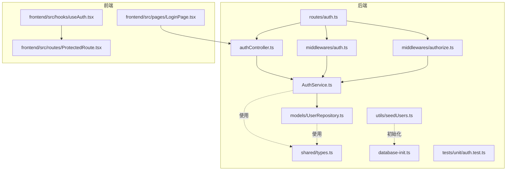
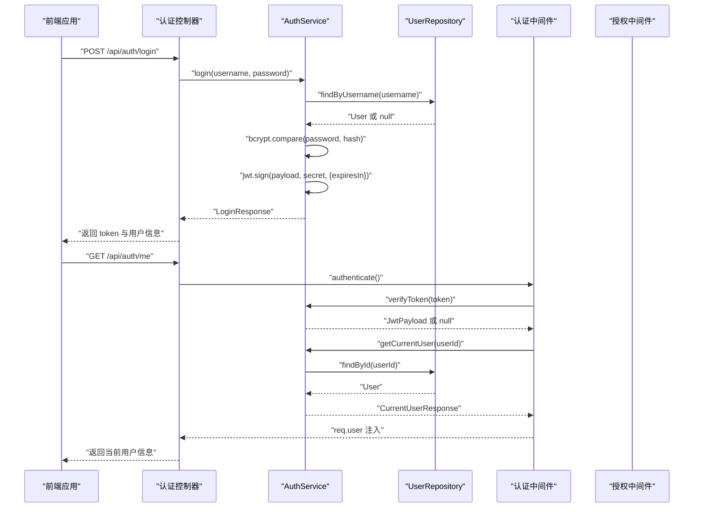
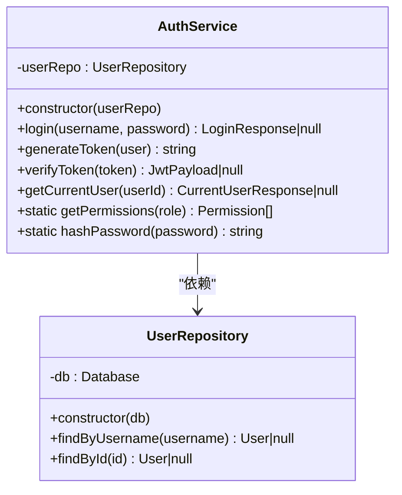
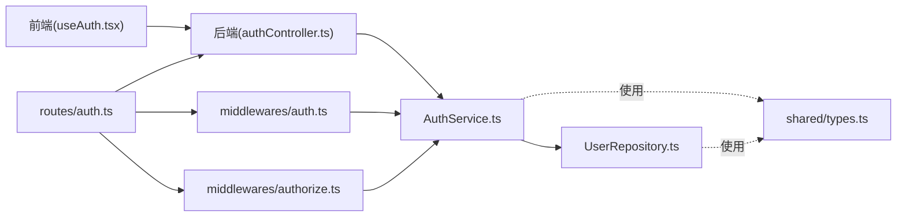
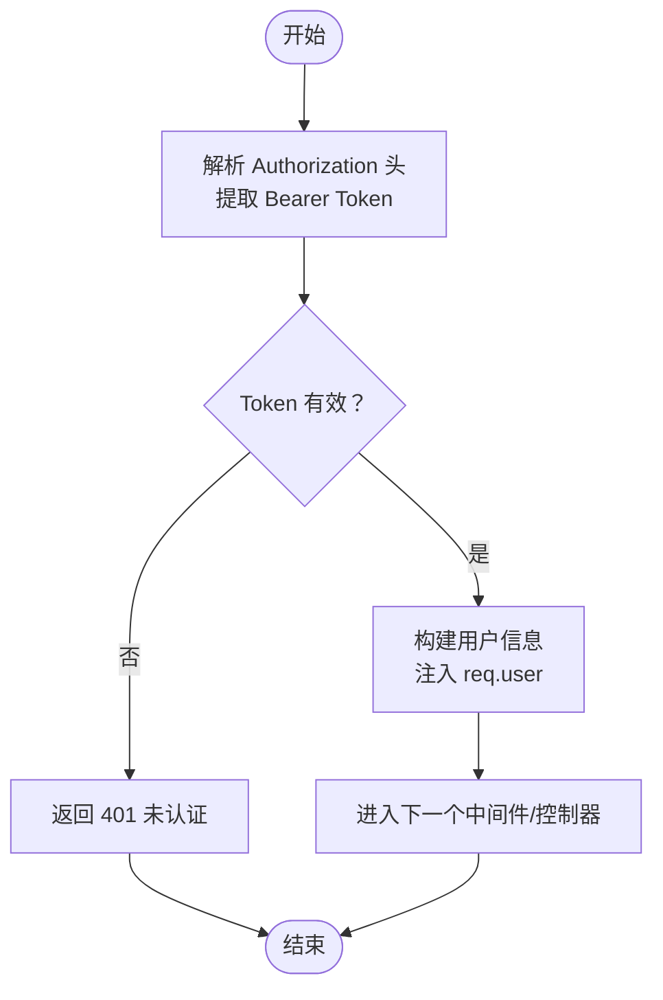

# 认证服务

<cite>
**本文引用的文件**
- [AuthService.ts](file://backend/src/services/AuthService.ts)
- [authController.ts](file://backend/src/controllers/authController.ts)
- [auth.ts](file://backend/src/middlewares/auth.ts)
- [authorize.ts](file://backend/src/middlewares/authorize.ts)
- [UserRepository.ts](file://backend/src/models/UserRepository.ts)
- [auth.ts](file://backend/src/routes/auth.ts)
- [types.ts](file://shared/types.ts)
- [seedUsers.ts](file://backend/src/utils/seedUsers.ts)
- [auth.test.ts](file://backend/tests/unit/auth.test.ts)
- [useAuth.tsx](file://frontend/src/hooks/useAuth.tsx)
- [LoginPage.tsx](file://frontend/src/pages/LoginPage.tsx)
- [ProtectedRoute.tsx](file://frontend/src/routes/ProtectedRoute.tsx)
- [database-init.ts](file://backend/src/database-init.ts)
- [index.ts](file://backend/src/index.ts)
</cite>

## 目录
1. [简介](#简介)
2. [项目结构](#项目结构)
3. [核心组件](#核心组件)
4. [架构总览](#架构总览)
5. [详细组件分析](#详细组件分析)
6. [依赖关系分析](#依赖关系分析)
7. [性能考量](#性能考量)
8. [故障排查指南](#故障排查指南)
9. [结论](#结论)
10. [附录](#附录)

## 简介
本文件为认证服务的全面技术文档，重点阐述 AuthService 在用户身份验证与授权中的核心职责，覆盖以下主题：
- JWT 令牌生成、验证与过期控制
- 密钥管理与安全策略
- 用户凭据验证流程与密码加密处理
- 会话管理与中间件集成（路由保护与权限检查）
- 与 UserRepository 的协作模式（用户查询与权限加载）
- 常见认证场景与安全最佳实践

## 项目结构
认证相关代码主要分布在后端的 service、controller、middleware、model、route 层，并与共享类型定义、数据库初始化脚本以及前端认证上下文协同工作。

图表来源
- [AuthService.ts:1-126](file://backend/src/services/AuthService.ts#L1-L126)
- [authController.ts:1-77](file://backend/src/controllers/authController.ts#L1-L77)
- [auth.ts:1-56](file://backend/src/middlewares/auth.ts#L1-L56)
- [authorize.ts:1-47](file://backend/src/middlewares/authorize.ts#L1-L47)
- [UserRepository.ts:1-56](file://backend/src/models/UserRepository.ts#L1-L56)
- [auth.ts:1-19](file://backend/src/routes/auth.ts#L1-L19)
- [types.ts:1-289](file://shared/types.ts#L1-L289)
- [database-init.ts:1-65](file://backend/src/database-init.ts#L1-L65)
- [seedUsers.ts:1-20](file://backend/src/utils/seedUsers.ts#L1-L20)
- [auth.test.ts:1-163](file://backend/tests/unit/auth.test.ts#L1-L163)
- [useAuth.tsx:1-90](file://frontend/src/hooks/useAuth.tsx#L1-L90)
- [LoginPage.tsx:1-81](file://frontend/src/pages/LoginPage.tsx#L1-L81)
- [ProtectedRoute.tsx:1-31](file://frontend/src/routes/ProtectedRoute.tsx#L1-L31)

章节来源
- [index.ts:1-39](file://backend/src/index.ts#L1-L39)
- [database-init.ts:1-65](file://backend/src/database-init.ts#L1-L65)

## 核心组件
- AuthService：负责登录验证、JWT 令牌生成与校验、权限映射、密码哈希等核心逻辑。
- UserRepository：封装用户数据访问，提供按用户名与 ID 查询用户的能力。
- 认证中间件 authenticate：从请求头解析 Bearer Token，校验有效性并将用户信息注入请求上下文。
- 权限中间件 authorize：基于用户角色与所需权限进行授权校验。
- 认证控制器 authController：处理登录与“获取当前用户”请求，调用 AuthService 完成业务处理。
- 路由 auth.ts：注册认证相关路由，串联控制器与中间件。
- 共享类型 types.ts：统一定义用户、角色、权限、登录/当前用户响应等接口。
- 前端 useAuth.tsx：维护本地 token 与用户信息，提供认证上下文；ProtectedRoute.tsx 实现前端路由级权限守卫。

章节来源
- [AuthService.ts:32-125](file://backend/src/services/AuthService.ts#L32-L125)
- [UserRepository.ts:31-55](file://backend/src/models/UserRepository.ts#L31-L55)
- [auth.ts:26-55](file://backend/src/middlewares/auth.ts#L26-L55)
- [authorize.ts:16-46](file://backend/src/middlewares/authorize.ts#L16-L46)
- [authController.ts:16-76](file://backend/src/controllers/authController.ts#L16-L76)
- [auth.ts:10-18](file://backend/src/routes/auth.ts#L10-L18)
- [types.ts:7-130](file://shared/types.ts#L7-L130)

## 架构总览
认证系统的端到端流程如下：
- 前端用户提交登录请求，后端控制器接收并调用认证服务。
- 认证服务通过用户仓库查找用户并使用 bcrypt 校验密码。
- 成功后生成 JWT，包含用户标识、角色与可选的分支机构名称。
- 前端保存 token 并发起后续受保护请求。
- 服务器端中间件从请求头提取并校验 JWT，注入用户信息。
- 授权中间件根据角色与所需权限决定是否放行。
- “获取当前用户”接口返回用户信息及权限列表，供前端渲染与权限控制。

图表来源
- [authController.ts:16-76](file://backend/src/controllers/authController.ts#L16-L76)
- [AuthService.ts:43-110](file://backend/src/services/AuthService.ts#L43-L110)
- [UserRepository.ts:38-54](file://backend/src/models/UserRepository.ts#L38-L54)
- [auth.ts:26-55](file://backend/src/middlewares/auth.ts#L26-L55)
- [authorize.ts:16-46](file://backend/src/middlewares/authorize.ts#L16-L46)

## 详细组件分析

### AuthService：认证与授权核心
- 职责
  - 登录验证：根据用户名查找用户，使用 bcrypt 校验密码，成功后生成 JWT。
  - JWT 签发与校验：使用对称密钥（可配置）签发与验证 token，支持过期时间设置。
  - 权限映射：根据用户角色返回对应的权限列表。
  - 密码哈希：提供静态方法对明文密码进行哈希处理。
  - 当前用户信息：结合用户仓库返回带权限的用户信息。
- 关键点
  - 密钥来源：优先从环境变量读取，否则使用默认密钥（开发用途）。
  - 过期时间：默认 8 小时。
  - 角色-权限映射：集中定义在类内部，便于统一维护与扩展。
- 复杂度
  - 登录与校验均为 O(1)（基于内存查找与哈希比较）。
  - 权限查询为 O(1) 映射表访问。
- 错误处理
  - 用户不存在或密码错误返回空结果，控制器侧转换为 401。
  - token 无效或过期返回空结果，中间件侧转换为 401。
- 安全建议
  - 生产环境务必设置强密钥并启用 HTTPS。
  - 考虑引入刷新令牌机制与黑名单管理（当前实现未包含）。

图表来源
- [AuthService.ts:32-125](file://backend/src/services/AuthService.ts#L32-L125)
- [UserRepository.ts:31-55](file://backend/src/models/UserRepository.ts#L31-L55)

章节来源
- [AuthService.ts:11-125](file://backend/src/services/AuthService.ts#L11-L125)
- [auth.test.ts:45-162](file://backend/tests/unit/auth.test.ts#L45-L162)

### 认证控制器：登录与当前用户
- 登录接口
  - 校验请求体必填字段，调用认证服务执行登录，返回 token 与用户信息。
  - 失败时返回标准化错误响应。
- 获取当前用户
  - 依赖认证中间件注入的用户信息，调用认证服务返回带权限的用户信息。
  - 用户不存在时返回 404。
- 设计要点
  - 控制器仅负责请求处理与响应，业务逻辑委托给服务层。
  - 与数据库连接通过工具函数获取，确保每次请求独立实例。

章节来源
- [authController.ts:16-76](file://backend/src/controllers/authController.ts#L16-L76)

### 认证中间件：请求头解析与校验
- 功能
  - 从 Authorization 请求头提取 Bearer Token。
  - 调用认证服务验证 token，失败返回 401。
  - 成功将解码后的用户信息注入 req.user，供后续中间件与控制器使用。
- 类型扩展
  - 通过全局命名空间扩展 Express Request 类型，声明 req.user 字段。
- 安全要点
  - 必须以 Bearer 前缀传递 token。
  - 未提供或格式错误直接拒绝。

章节来源
- [auth.ts:26-55](file://backend/src/middlewares/auth.ts#L26-L55)

### 授权中间件：基于角色的权限检查
- 功能
  - 作为中间件工厂，接收所需权限列表。
  - 从 req.user 获取用户角色，计算用户权限集合。
  - 若用户缺少任一所需权限，返回 403。
- 使用方式
  - 在路由上串联 authenticate 与 authorize 中间件，先认证再授权。
- 注意事项
  - 需在 authenticate 之后使用，否则 req.user 为空。

章节来源
- [authorize.ts:16-46](file://backend/src/middlewares/authorize.ts#L16-L46)

### UserRepository：用户数据访问
- 功能
  - 提供按用户名与 ID 查询用户的方法。
  - 将数据库行转换为统一的 User 接口对象。
- 数据库设计
  - users 表包含 id、username、password_hash、role、branch_name、created_at。
  - role 字段使用 CHECK 约束限定合法值。
- 复杂度
  - 查询为 O(1)（基于索引）。

章节来源
- [UserRepository.ts:38-54](file://backend/src/models/UserRepository.ts#L38-L54)
- [database-init.ts:9-17](file://backend/src/database-init.ts#L9-L17)

### 路由与集成
- 认证路由
  - POST /api/auth/login：登录接口。
  - GET /api/auth/me：需要认证的当前用户信息接口。
- 中间件串联
  - me 路由使用 authenticate 中间件保护。
  - 可进一步串联 authorize 中间件实现细粒度权限控制。

章节来源
- [auth.ts:10-18](file://backend/src/routes/auth.ts#L10-L18)

### 前端集成：认证上下文与路由守卫
- useAuth.tsx
  - 维护 token 与用户信息，支持登录、登出与状态恢复。
  - 本地持久化存储 token 与用户信息，初始化时尝试恢复。
  - 根据角色动态补全权限列表。
- LoginPage.tsx
  - 发起登录请求，成功后调用 useAuth 登录并跳转至对应角色首页。
- ProtectedRoute.tsx
  - 基于角色的前端路由级守卫，未登录或角色不符时重定向。

章节来源
- [useAuth.tsx:34-89](file://frontend/src/hooks/useAuth.tsx#L34-L89)
- [LoginPage.tsx:24-80](file://frontend/src/pages/LoginPage.tsx#L24-L80)
- [ProtectedRoute.tsx:10-30](file://frontend/src/routes/ProtectedRoute.tsx#L10-L30)

## 依赖关系分析
- 组件耦合
  - AuthService 依赖 UserRepository，形成清晰的分层。
  - 控制器依赖服务，中间件依赖服务，职责明确。
- 外部依赖
  - jsonwebtoken：JWT 签发与校验。
  - bcryptjs：密码哈希与比对。
  - better-sqlite3：SQLite 数据库访问。
- 接口契约
  - 共享类型定义了用户、角色、权限、登录/当前用户响应等接口，前后端一致。

图表来源
- [authController.ts:16-76](file://backend/src/controllers/authController.ts#L16-L76)
- [AuthService.ts:32-125](file://backend/src/services/AuthService.ts#L32-L125)
- [UserRepository.ts:31-55](file://backend/src/models/UserRepository.ts#L31-L55)
- [auth.ts:26-55](file://backend/src/middlewares/auth.ts#L26-L55)
- [authorize.ts:16-46](file://backend/src/middlewares/authorize.ts#L16-L46)
- [auth.ts:10-18](file://backend/src/routes/auth.ts#L10-L18)
- [types.ts:75-130](file://shared/types.ts#L75-L130)

## 性能考量
- 登录与校验
  - bcrypt 比对与 jwt 校验均为常数时间复杂度，性能开销极小。
- 数据库查询
  - UserRepository 查询基于索引，单次查询复杂度为 O(1)。
- 缓存建议
  - 可考虑在应用层缓存热点用户信息，减少数据库访问。
- 令牌过期
  - 默认 8 小时，可根据业务调整；过短影响用户体验，过长增加风险。

[本节为通用性能讨论，无需特定文件来源]

## 故障排查指南
- 登录失败
  - 检查用户名是否存在与密码是否正确。
  - 确认数据库中用户记录存在且密码哈希有效。
- 401 未认证
  - 确认请求头 Authorization 是否以 Bearer 开头。
  - 确认 token 未过期且密钥一致。
- 403 权限不足
  - 检查用户角色与所需权限是否匹配。
  - 确认授权中间件在认证中间件之后使用。
- 前端无法保持登录状态
  - 检查本地存储是否成功写入 token 与用户信息。
  - 确认初始化时的权限列表与角色一致。

章节来源
- [auth.test.ts:45-162](file://backend/tests/unit/auth.test.ts#L45-L162)
- [auth.ts:26-55](file://backend/src/middlewares/auth.ts#L26-L55)
- [authorize.ts:16-46](file://backend/src/middlewares/authorize.ts#L16-L46)
- [useAuth.tsx:34-89](file://frontend/src/hooks/useAuth.tsx#L34-L89)

## 结论
AuthService 作为认证与授权的核心，通过清晰的分层设计与严格的职责划分，提供了稳定可靠的认证能力。配合认证中间件与授权中间件，实现了从请求头解析到权限校验的完整链路。建议在生产环境中强化密钥管理、引入刷新令牌与黑名单机制，并持续完善权限模型以满足更复杂的业务需求。

[本节为总结性内容，无需特定文件来源]

## 附录

### JWT 令牌生成与验证流程

图表来源
- [auth.ts:26-55](file://backend/src/middlewares/auth.ts#L26-L55)

### 密钥管理与安全策略
- 密钥来源
  - 优先从环境变量读取，确保不同环境隔离。
  - 开发环境可使用默认密钥，但不应用于生产。
- 安全建议
  - 强制 HTTPS 传输，避免明文泄露。
  - 定期轮换密钥，配合灰度发布降低风险。
  - 限制 token 过期时间，结合刷新令牌策略。

章节来源
- [AuthService.ts:11-15](file://backend/src/services/AuthService.ts#L11-L15)

### 用户凭据验证与密码加密
- 验证流程
  - 通过用户名查询用户，若不存在返回失败。
  - 使用 bcrypt 比对密码哈希，失败返回失败。
  - 成功后生成 JWT 返回。
- 密码处理
  - 使用 bcrypt 对明文密码进行哈希，成本因子为 10。
  - 新建用户时应调用哈希方法，避免明文存储。

章节来源
- [AuthService.ts:43-65](file://backend/src/services/AuthService.ts#L43-L65)
- [AuthService.ts:122-124](file://backend/src/services/AuthService.ts#L122-L124)
- [seedUsers.ts:11-19](file://backend/src/utils/seedUsers.ts#L11-L19)

### 会话管理与中间件集成
- 登录后前端
  - 保存 token 与用户信息到本地存储。
  - 后续请求在拦截器中附加 Authorization 头。
- 服务端
  - authenticate 中间件负责解析与校验。
  - authorize 中间件负责权限校验。
  - 可在路由上串联多个中间件实现多层保护。

章节来源
- [useAuth.tsx:59-73](file://frontend/src/hooks/useAuth.tsx#L59-L73)
- [auth.ts:26-55](file://backend/src/middlewares/auth.ts#L26-L55)
- [authorize.ts:16-46](file://backend/src/middlewares/authorize.ts#L16-L46)

### 与 UserRepository 的协作模式
- 查询用户
  - findByUsername：按用户名精确查询，适合登录场景。
  - findById：按用户 ID 查询，适合获取当前用户信息。
- 数据一致性
  - 通过共享类型约束用户字段，保证前后端一致。
  - 数据库层通过 CHECK 约束限制角色值，防止脏数据。

章节来源
- [UserRepository.ts:38-54](file://backend/src/models/UserRepository.ts#L38-L54)
- [types.ts:75-83](file://shared/types.ts#L75-L83)
- [database-init.ts:9-17](file://backend/src/database-init.ts#L9-L17)

### 常见认证场景与最佳实践
- 场景一：登录并获取当前用户
  - 前端提交登录请求，后端返回 token 与用户信息。
  - 前端保存 token，后续请求携带 Authorization 头。
  - 调用“获取当前用户”接口，后端返回权限列表。
- 场景二：受保护路由与权限控制
  - 在路由上串联 authenticate 与 authorize 中间件。
  - authorize(...requiredPermissions) 指定所需权限。
- 最佳实践
  - 生产环境必须设置强密钥并启用 HTTPS。
  - 严格区分角色与权限，避免过度授权。
  - 对敏感操作增加二次确认或审计日志。

章节来源
- [authController.ts:16-76](file://backend/src/controllers/authController.ts#L16-L76)
- [auth.ts:26-55](file://backend/src/middlewares/auth.ts#L26-L55)
- [authorize.ts:16-46](file://backend/src/middlewares/authorize.ts#L16-L46)
- [types.ts:87-102](file://shared/types.ts#L87-L102)