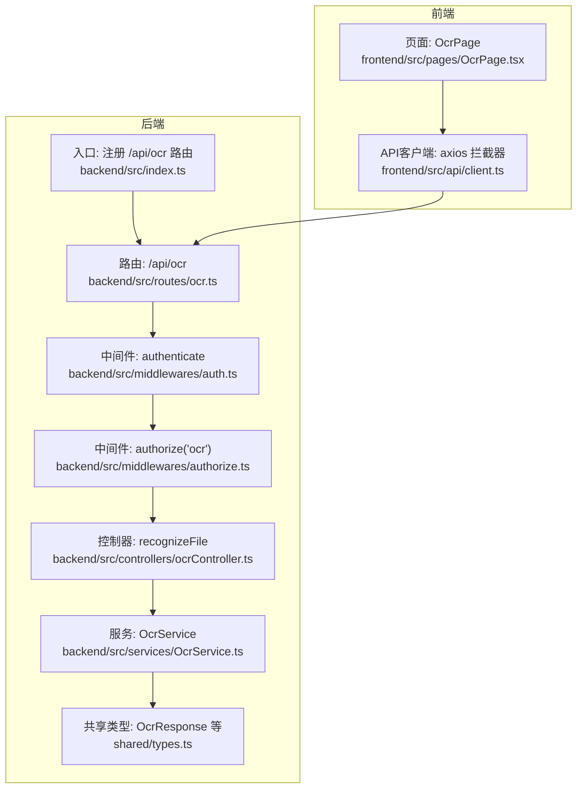
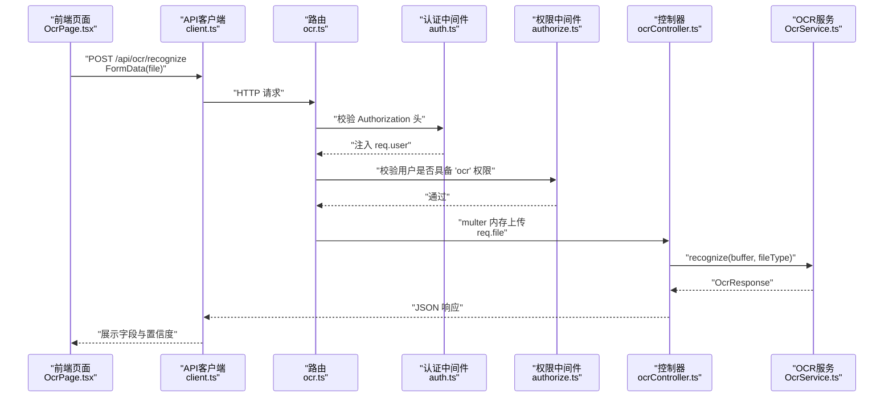
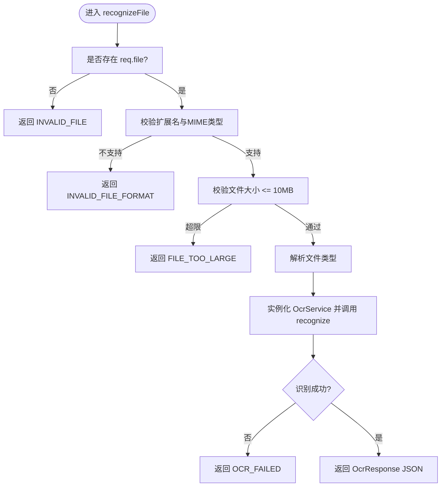
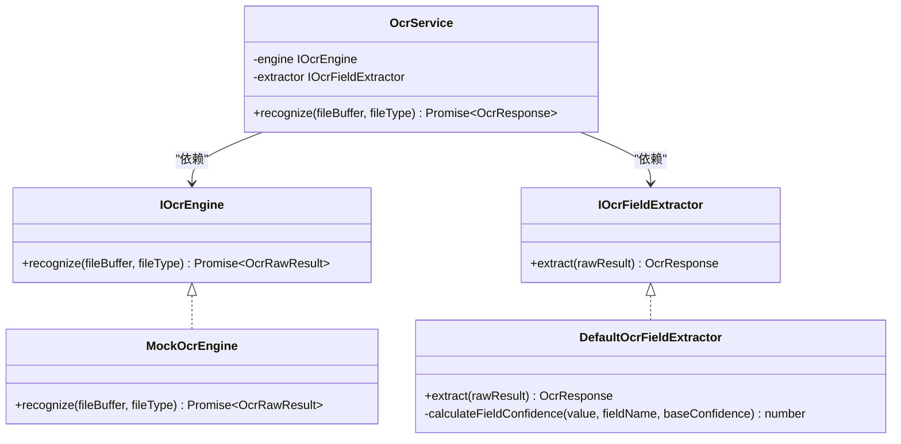

# OCR路由

<cite>
**本文引用的文件**
- [backend/src/routes/ocr.ts](file://backend/src/routes/ocr.ts)
- [backend/src/controllers/ocrController.ts](file://backend/src/controllers/ocrController.ts)
- [backend/src/services/OcrService.ts](file://backend/src/services/OcrService.ts)
- [backend/src/middlewares/auth.ts](file://backend/src/middlewares/auth.ts)
- [backend/src/middlewares/authorize.ts](file://backend/src/middlewares/authorize.ts)
- [shared/types.ts](file://shared/types.ts)
- [backend/src/index.ts](file://backend/src/index.ts)
- [frontend/src/pages/OcrPage.tsx](file://frontend/src/pages/OcrPage.tsx)
- [frontend/src/api/client.ts](file://frontend/src/api/client.ts)
</cite>

## 目录
1. [简介](#简介)
2. [项目结构](#项目结构)
3. [核心组件](#核心组件)
4. [架构总览](#架构总览)
5. [详细组件分析](#详细组件分析)
6. [依赖关系分析](#依赖关系分析)
7. [性能考虑](#性能考虑)
8. [故障排除指南](#故障排除指南)
9. [结论](#结论)
10. [附录](#附录)

## 简介
本文件面向OCR路由模块的技术文档，聚焦于“扫描件上传与OCR识别”的完整流程设计与实现，包括：
- 路由注册与访问控制
- 文件上传与格式校验
- OCR识别流程与结果返回
- 参数验证、错误处理与性能优化建议
- 前后端协作示例与故障排除

## 项目结构
后端采用Express + TypeScript，按职责分层组织：路由层负责HTTP入口与中间件编排；控制器层处理请求与响应；服务层封装OCR引擎与字段提取逻辑；共享类型定义前后端一致的数据契约。

图表来源
- [backend/src/index.ts:20-26](file://backend/src/index.ts#L20-L26)
- [backend/src/routes/ocr.ts:12-18](file://backend/src/routes/ocr.ts#L12-L18)
- [backend/src/controllers/ocrController.ts:43-93](file://backend/src/controllers/ocrController.ts#L43-L93)
- [backend/src/services/OcrService.ts:157-191](file://backend/src/services/OcrService.ts#L157-L191)
- [shared/types.ts:226-238](file://shared/types.ts#L226-L238)
- [frontend/src/pages/OcrPage.tsx:38-85](file://frontend/src/pages/OcrPage.tsx#L38-L85)
- [frontend/src/api/client.ts:10-17](file://frontend/src/api/client.ts#L10-L17)

章节来源
- [backend/src/index.ts:20-26](file://backend/src/index.ts#L20-L26)
- [backend/src/routes/ocr.ts:12-18](file://backend/src/routes/ocr.ts#L12-L18)

## 核心组件
- 路由层：注册OCR识别路由，绑定认证与权限中间件，并使用内存存储的multer处理单文件上传。
- 控制器层：集中执行文件格式与大小校验，调用OCR服务，统一返回结构化结果。
- 服务层：抽象出OCR引擎与字段提取器接口，提供默认Mock实现，便于替换真实OCR服务。
- 中间件层：认证中间件从Authorization头解析JWT，权限中间件校验用户是否具备“ocr”权限。
- 共享类型：定义OCR响应结构OcrResponse及其字段OcrField，确保前后端契约一致。

章节来源
- [backend/src/routes/ocr.ts:12-18](file://backend/src/routes/ocr.ts#L12-L18)
- [backend/src/controllers/ocrController.ts:10-21](file://backend/src/controllers/ocrController.ts#L10-L21)
- [backend/src/services/OcrService.ts:21-29](file://backend/src/services/OcrService.ts#L21-L29)
- [backend/src/middlewares/auth.ts:26-55](file://backend/src/middlewares/auth.ts#L26-L55)
- [backend/src/middlewares/authorize.ts:16-46](file://backend/src/middlewares/authorize.ts#L16-L46)
- [shared/types.ts:226-238](file://shared/types.ts#L226-L238)

## 架构总览
下图展示从浏览器到后端的端到端流程：前端上传扫描件，后端经认证与权限校验后，将文件载入内存并通过OCR服务识别，最终返回结构化字段与置信度。

图表来源
- [frontend/src/pages/OcrPage.tsx:38-85](file://frontend/src/pages/OcrPage.tsx#L38-L85)
- [frontend/src/api/client.ts:10-17](file://frontend/src/api/client.ts#L10-L17)
- [backend/src/routes/ocr.ts:12-18](file://backend/src/routes/ocr.ts#L12-L18)
- [backend/src/middlewares/auth.ts:26-55](file://backend/src/middlewares/auth.ts#L26-L55)
- [backend/src/middlewares/authorize.ts:16-46](file://backend/src/middlewares/authorize.ts#L16-L46)
- [backend/src/controllers/ocrController.ts:43-93](file://backend/src/controllers/ocrController.ts#L43-L93)
- [backend/src/services/OcrService.ts:157-191](file://backend/src/services/OcrService.ts#L157-L191)

## 详细组件分析

### 路由层：OCR识别路由
- 路由路径：POST /api/ocr/recognize
- 中间件链：
  - authenticate：校验Authorization头，注入用户信息
  - authorize('ocr')：校验用户是否具备“ocr”权限
- 文件上传：使用multer内存存储，仅接收名为“file”的单文件
- 控制器：recognizeFile

章节来源
- [backend/src/routes/ocr.ts:12-18](file://backend/src/routes/ocr.ts#L12-L18)

### 控制器层：文件校验与调用OCR服务
- 支持格式：JPG/JPEG、PNG、PDF（扩展名与MIME类型双重校验）
- 文件大小限制：10MB
- 流程：
  - 校验是否存在文件
  - 校验扩展名与MIME类型
  - 校验文件大小
  - 解析文件类型（jpeg归一化为jpg）
  - 实例化OcrService并调用recognize
  - 返回OcrResponse或标准化错误
- 错误码：
  - INVALID_FILE：未上传文件
  - INVALID_FILE_FORMAT：格式不支持
  - FILE_TOO_LARGE：文件过大
  - OCR_FAILED：识别失败

图表来源
- [backend/src/controllers/ocrController.ts:43-93](file://backend/src/controllers/ocrController.ts#L43-L93)

章节来源
- [backend/src/controllers/ocrController.ts:10-21](file://backend/src/controllers/ocrController.ts#L10-L21)
- [backend/src/controllers/ocrController.ts:43-93](file://backend/src/controllers/ocrController.ts#L43-L93)

### 服务层：OCR服务与接口抽象
- 接口定义：
  - IOcrEngine：recognize(fileBuffer, fileType) -> Promise<OcrRawResult>
  - IOcrFieldExtractor：extract(rawResult) -> OcrResponse
- 默认实现：
  - MockOcrEngine：返回固定文本与置信度
  - DefaultOcrFieldExtractor：基于正则从原始文本提取字段并计算字段级置信度
- OcrService：组合引擎与提取器，统一识别流程；异常时返回失败结构化结果

图表来源
- [backend/src/services/OcrService.ts:21-29](file://backend/src/services/OcrService.ts#L21-L29)
- [backend/src/services/OcrService.ts:38-57](file://backend/src/services/OcrService.ts#L38-L57)
- [backend/src/services/OcrService.ts:78-149](file://backend/src/services/OcrService.ts#L78-L149)
- [backend/src/services/OcrService.ts:157-191](file://backend/src/services/OcrService.ts#L157-L191)

章节来源
- [backend/src/services/OcrService.ts:21-29](file://backend/src/services/OcrService.ts#L21-L29)
- [backend/src/services/OcrService.ts:38-57](file://backend/src/services/OcrService.ts#L38-L57)
- [backend/src/services/OcrService.ts:78-149](file://backend/src/services/OcrService.ts#L78-L149)
- [backend/src/services/OcrService.ts:157-191](file://backend/src/services/OcrService.ts#L157-L191)

### 中间件层：认证与权限
- 认证中间件：
  - 从Authorization头提取Bearer Token
  - 校验失败返回401 UNAUTHORIZED
  - 成功则将用户信息注入req.user
- 权限中间件：
  - 校验用户角色是否具备所需权限
  - 未满足返回403 PERMISSION_DENIED

章节来源
- [backend/src/middlewares/auth.ts:26-55](file://backend/src/middlewares/auth.ts#L26-L55)
- [backend/src/middlewares/authorize.ts:16-46](file://backend/src/middlewares/authorize.ts#L16-L46)

### 共享类型：OCR响应结构
- OcrField：包含value与confidence（0-1）
- OcrResponse：success + fields（含6个字段）+ rawText（可选）

章节来源
- [shared/types.ts:220-238](file://shared/types.ts#L220-L238)

### 前后端协作示例
- 前端上传：FormData携带“file”，触发beforeUpload后立即调用后端识别
- 前端渲染：根据字段置信度高亮提示，低于阈值（0.8）显示警告图标
- 前端提交：将识别结果作为表单数据，通过导入接口保存为档案记录

章节来源
- [frontend/src/pages/OcrPage.tsx:38-85](file://frontend/src/pages/OcrPage.tsx#L38-L85)
- [frontend/src/pages/OcrPage.tsx:104-154](file://frontend/src/pages/OcrPage.tsx#L104-L154)
- [frontend/src/api/client.ts:10-17](file://frontend/src/api/client.ts#L10-L17)

## 依赖关系分析
- 路由依赖控制器与中间件
- 控制器依赖服务层
- 服务层依赖共享类型
- 前端依赖API客户端与共享类型

图表来源
- [frontend/src/pages/OcrPage.tsx:38-85](file://frontend/src/pages/OcrPage.tsx#L38-L85)
- [frontend/src/api/client.ts:10-17](file://frontend/src/api/client.ts#L10-L17)
- [backend/src/routes/ocr.ts:12-18](file://backend/src/routes/ocr.ts#L12-L18)
- [backend/src/controllers/ocrController.ts:43-93](file://backend/src/controllers/ocrController.ts#L43-L93)
- [backend/src/services/OcrService.ts:157-191](file://backend/src/services/OcrService.ts#L157-L191)
- [shared/types.ts:226-238](file://shared/types.ts#L226-L238)

章节来源
- [backend/src/index.ts:20-26](file://backend/src/index.ts#L20-L26)
- [backend/src/routes/ocr.ts:12-18](file://backend/src/routes/ocr.ts#L12-L18)
- [backend/src/controllers/ocrController.ts:43-93](file://backend/src/controllers/ocrController.ts#L43-L93)
- [backend/src/services/OcrService.ts:157-191](file://backend/src/services/OcrService.ts#L157-L191)
- [shared/types.ts:226-238](file://shared/types.ts#L226-L238)
- [frontend/src/pages/OcrPage.tsx:38-85](file://frontend/src/pages/OcrPage.tsx#L38-L85)
- [frontend/src/api/client.ts:10-17](file://frontend/src/api/client.ts#L10-L17)

## 性能考虑
- 内存上传：multer使用memoryStorage，适合小文件快速处理；大文件可能导致内存压力，建议：
  - 限制文件大小（当前10MB）
  - 对超大文件采用流式处理或临时文件落盘
- 并发与吞吐：多并发请求会增加CPU与内存占用，建议：
  - 在网关或反向代理层限流
  - 为OCR服务引入队列与异步处理（生产环境）
- 置信度阈值：前端默认阈值0.8，可根据业务调整；低置信度字段建议人工复核
- 缓存与预热：若替换真实OCR引擎，可考虑缓存热点识别结果

[本节为通用性能建议，无需特定文件引用]

## 故障排除指南
- 常见错误与排查
  - 401 未提供认证令牌/令牌无效或过期：检查Authorization头与JWT有效期
  - 403 权限不足：确认用户角色具备“ocr”权限
  - 400 文件格式不支持：确认扩展名与MIME类型为jpg/jpeg/png/pdf
  - 400 文件大小超出限制：压缩图片或拆分PDF
  - 500 扫描件识别失败：检查文件清晰度、角度与对比度
- 前端提示
  - 低置信度字段以黄色边框与警告图标提示，建议人工复核
  - 上传前已在前端做10MB大小校验，避免不必要的网络传输
- 后端日志
  - 建议在控制器与服务层增加结构化日志，记录文件大小、类型、耗时与错误堆栈

章节来源
- [backend/src/middlewares/auth.ts:26-55](file://backend/src/middlewares/auth.ts#L26-L55)
- [backend/src/middlewares/authorize.ts:16-46](file://backend/src/middlewares/authorize.ts#L16-L46)
- [backend/src/controllers/ocrController.ts:43-93](file://backend/src/controllers/ocrController.ts#L43-L93)
- [frontend/src/pages/OcrPage.tsx:88-101](file://frontend/src/pages/OcrPage.tsx#L88-L101)

## 结论
OCR路由模块通过清晰的分层设计与严格的参数校验，实现了从文件上传到结构化识别结果返回的完整闭环。服务层接口抽象使得替换真实OCR引擎成为可能；前端结合置信度阈值提供了良好的用户体验。建议在生产环境中引入异步队列、限流与缓存等机制以提升稳定性与性能。

[本节为总结性内容，无需特定文件引用]

## 附录

### 支持的文件格式与大小
- 格式：JPG/JPEG、PNG、PDF
- 大小：≤10MB
- 前端上传限制与提示：10MB内支持JPG/PNG/PDF

章节来源
- [backend/src/controllers/ocrController.ts:10-21](file://backend/src/controllers/ocrController.ts#L10-L21)
- [frontend/src/pages/OcrPage.tsx:88-101](file://frontend/src/pages/OcrPage.tsx#L88-L101)

### 参数与返回格式
- 请求
  - 方法：POST
  - 路径：/api/ocr/recognize
  - 头部：Authorization: Bearer <token>
  - 表单字段：file（二进制）
- 响应
  - 成功：OcrResponse（success=true，fields包含6个字段，rawText可选）
  - 失败：标准错误响应（code + message），常见code：INVALID_FILE、INVALID_FILE_FORMAT、FILE_TOO_LARGE、OCR_FAILED

章节来源
- [backend/src/routes/ocr.ts:12-18](file://backend/src/routes/ocr.ts#L12-L18)
- [backend/src/controllers/ocrController.ts:43-93](file://backend/src/controllers/ocrController.ts#L43-L93)
- [shared/types.ts:226-238](file://shared/types.ts#L226-L238)

### 完整示例（步骤说明）
- 步骤1：前端选择扫描件（JPG/PNG/PDF，≤10MB）
- 步骤2：前端自动上传并调用后端OCR识别
- 步骤3：后端返回结构化字段与置信度
- 步骤4：前端根据置信度高亮提示，人工复核低置信度字段
- 步骤5：确认无误后提交为档案记录

章节来源
- [frontend/src/pages/OcrPage.tsx:38-85](file://frontend/src/pages/OcrPage.tsx#L38-L85)
- [frontend/src/pages/OcrPage.tsx:104-154](file://frontend/src/pages/OcrPage.tsx#L104-L154)