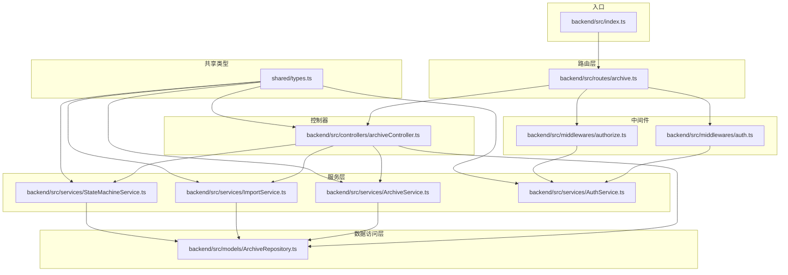
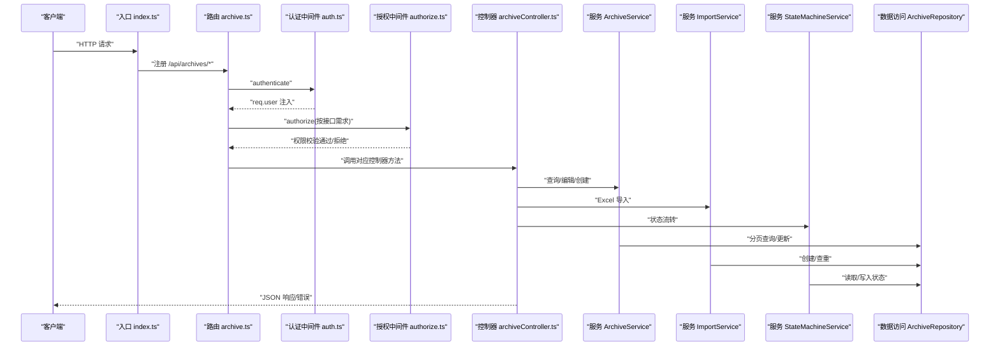
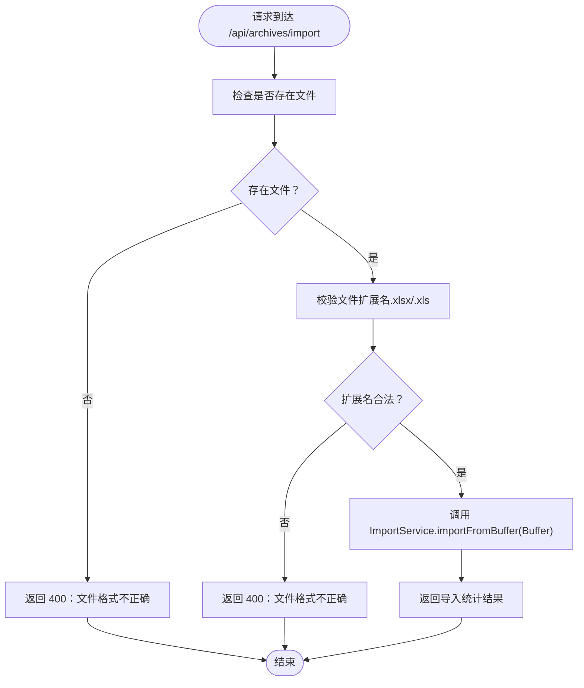
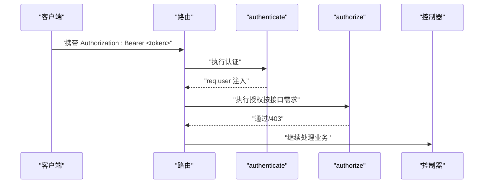
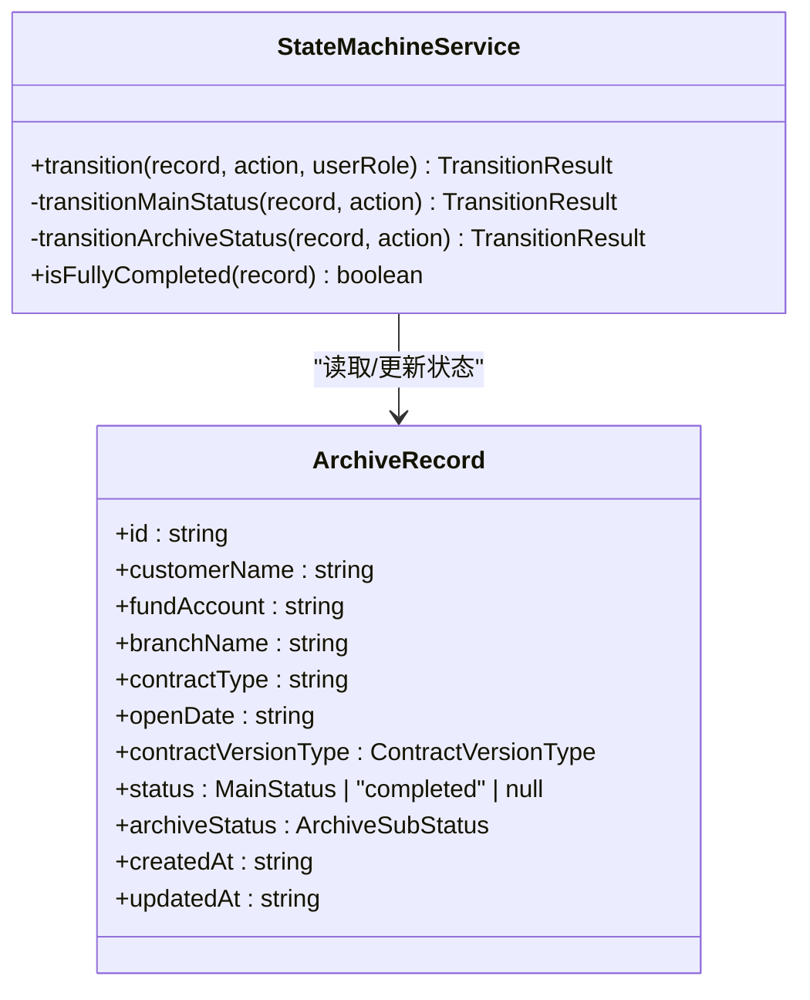
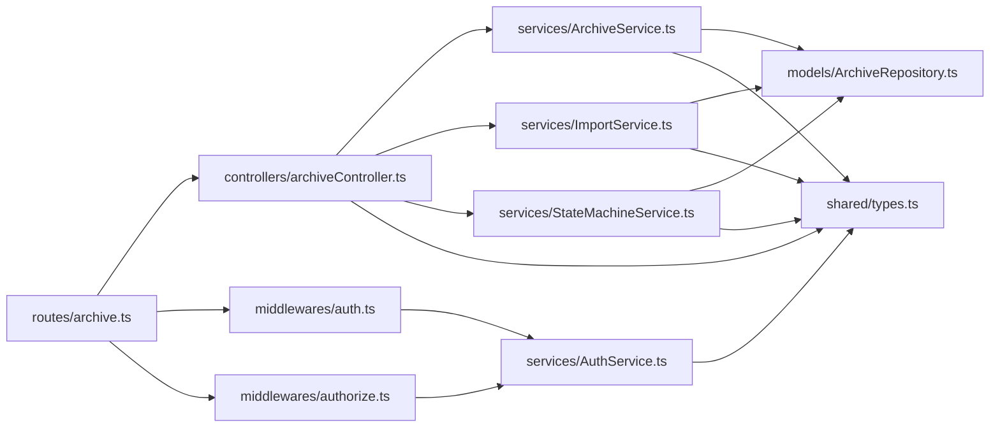

# 档案路由

<cite>
**本文引用的文件**
- [backend/src/route/archive.ts](file://backend/src/routes/archive.ts)
- [backend/src/controller/archiveController.ts](file://backend/src/controllers/archiveController.ts)
- [backend/src/middleware/auth.ts](file://backend/src/middlewares/auth.ts)
- [backend/src/middleware/authorize.ts](file://backend/src/middlewares/authorize.ts)
- [backend/src/service/ArchiveService.ts](file://backend/src/services/ArchiveService.ts)
- [backend/src/service/ImportService.ts](file://backend/src/services/ImportService.ts)
- [backend/src/model/ArchiveRepository.ts](file://backend/src/models/ArchiveRepository.ts)
- [backend/src/service/StateMachineService.ts](file://backend/src/services/StateMachineService.ts)
- [backend/src/service/AuthService.ts](file://backend/src/services/AuthService.ts)
- [shared/types.ts](file://shared/types.ts)
- [backend/src/index.ts](file://backend/src/index.ts)
- [backend/tests/unit/archiveController.test.ts](file://backend/tests/unit/archiveController.test.ts)
</cite>

## 目录
1. [简介](#简介)
2. [项目结构](#项目结构)
3. [核心组件](#核心组件)
4. [架构总览](#架构总览)
5. [详细组件分析](#详细组件分析)
6. [依赖关系分析](#依赖关系分析)
7. [性能考虑](#性能考虑)
8. [故障排查指南](#故障排查指南)
9. [结论](#结论)
10. [附录](#附录)

## 简介
本技术文档聚焦于档案路由模块，系统性阐述档案管理相关路由的组织结构与 URL 设计模式，覆盖以下核心接口：
- 查询档案列表：GET /api/archives
- 创建档案：POST /api/archives
- Excel 导入：POST /api/archives/import
- 批量状态流转：POST /api/archives/batch-transition
- 下载导入模板：GET /api/archives/template
- 获取档案详情：GET /api/archives/:id
- 单条状态流转：POST /api/archives/:id/transition
- 编辑档案基础信息：PUT /api/archives/:id

文档还深入解释了 multer 中间件的配置与文件上传处理机制，以及权限控制中间件 authenticate 与 authorize 的组合使用方式；提供每个接口的请求参数、响应格式与错误处理示例，并给出状态流转的业务规则与权限矩阵。

## 项目结构
档案路由位于后端工程的 routes 层，控制器位于 controllers 层，业务逻辑分布在 services 层，数据访问位于 models 层，共享类型定义位于 shared/types.ts。入口文件在 backend/src/index.ts 中注册路由。

图表来源
- [backend/src/index.ts:14-36](file://backend/src/index.ts#L14-L36)
- [backend/src/routes/archive.ts:6-41](file://backend/src/routes/archive.ts#L6-L41)
- [backend/src/middlewares/auth.ts:26-55](file://backend/src/middlewares/auth.ts#L26-L55)
- [backend/src/middlewares/authorize.ts:16-46](file://backend/src/middlewares/authorize.ts#L16-L46)
- [backend/src/controllers/archiveController.ts:43-71](file://backend/src/controllers/archiveController.ts#L43-L71)
- [backend/src/services/ArchiveService.ts:19-70](file://backend/src/services/ArchiveService.ts#L19-L70)
- [backend/src/services/ImportService.ts:40-145](file://backend/src/services/ImportService.ts#L40-L145)
- [backend/src/services/StateMachineService.ts:96-252](file://backend/src/services/StateMachineService.ts#L96-L252)
- [backend/src/models/ArchiveRepository.ts:85-306](file://backend/src/models/ArchiveRepository.ts#L85-L306)
- [shared/types.ts:46-289](file://shared/types.ts#L46-L289)

章节来源
- [backend/src/index.ts:14-36](file://backend/src/index.ts#L14-L36)
- [backend/src/routes/archive.ts:6-41](file://backend/src/routes/archive.ts#L6-L41)

## 核心组件
- 路由层：集中定义档案相关接口，统一挂载认证与授权中间件，配置 multer 内存存储以处理 Excel 导入。
- 控制器层：实现具体接口逻辑，负责参数校验、调用服务层、组装响应与错误处理。
- 服务层：
  - ArchiveService：封装查询逻辑，支持多条件组合查询、分页与分支机构数据隔离。
  - ImportService：解析 Excel、逐行校验、去重与创建档案记录。
  - StateMachineService：实现主流程状态与归档状态的合法转换规则及联动副作用。
- 数据访问层：ArchiveRepository 提供档案记录的 CRUD 与分页查询。
- 中间件层：
  - authenticate：从请求头提取并校验 JWT，将用户信息注入 req.user。
  - authorize：基于角色计算权限，校验用户是否具备所需权限。
- 共享类型：统一定义实体、枚举、请求/响应接口与常量集合。

章节来源
- [backend/src/routes/archive.ts:6-41](file://backend/src/routes/archive.ts#L6-L41)
- [backend/src/controllers/archiveController.ts:43-71](file://backend/src/controllers/archiveController.ts#L43-L71)
- [backend/src/services/ArchiveService.ts:19-70](file://backend/src/services/ArchiveService.ts#L19-L70)
- [backend/src/services/ImportService.ts:40-145](file://backend/src/services/ImportService.ts#L40-L145)
- [backend/src/services/StateMachineService.ts:96-252](file://backend/src/services/StateMachineService.ts#L96-L252)
- [backend/src/models/ArchiveRepository.ts:85-306](file://backend/src/models/ArchiveRepository.ts#L85-L306)
- [backend/src/middlewares/auth.ts:26-55](file://backend/src/middlewares/auth.ts#L26-L55)
- [backend/src/middlewares/authorize.ts:16-46](file://backend/src/middlewares/authorize.ts#L16-L46)
- [shared/types.ts:46-289](file://shared/types.ts#L46-L289)

## 架构总览
下图展示档案路由模块的端到端调用链路，从入口注册到控制器处理、服务层执行与数据访问层持久化。

图表来源
- [backend/src/index.ts:24-26](file://backend/src/index.ts#L24-L26)
- [backend/src/routes/archive.ts:17-41](file://backend/src/routes/archive.ts#L17-L41)
- [backend/src/middlewares/auth.ts:26-55](file://backend/src/middlewares/auth.ts#L26-L55)
- [backend/src/middlewares/authorize.ts:16-46](file://backend/src/middlewares/authorize.ts#L16-L46)
- [backend/src/controllers/archiveController.ts:99-147](file://backend/src/controllers/archiveController.ts#L99-L147)
- [backend/src/services/ArchiveService.ts:33-69](file://backend/src/services/ArchiveService.ts#L33-L69)
- [backend/src/services/ImportService.ts:52-144](file://backend/src/services/ImportService.ts#L52-L144)
- [backend/src/services/StateMachineService.ts:106-142](file://backend/src/services/StateMachineService.ts#L106-L142)
- [backend/src/models/ArchiveRepository.ts:228-305](file://backend/src/models/ArchiveRepository.ts#L228-L305)

## 详细组件分析

### 路由与 URL 设计模式
- 基础路径：/api/archives
- 设计原则：
  - 资源化命名：以名词“archives”作为资源根路径。
  - 动作后缀：对需要额外动作的资源采用“/:id/action”的形式，如“/transition”。
  - 批量操作：以“batch-transition”表达批量意图。
  - 模板下载：以“/template”提供静态资源类接口。
- 权限与认证：
  - 大多数接口需认证（authenticate）。
  - 部分接口需授权（authorize），例如创建、导入、编辑等。

章节来源
- [backend/src/routes/archive.ts:17-41](file://backend/src/routes/archive.ts#L17-L41)

### multer 配置与文件上传处理机制
- 存储策略：使用内存存储（memoryStorage），将上传文件读入 Buffer，便于后续解析与处理。
- 单文件上传：通过 upload.single('file') 中间件接收名为“file”的单文件字段。
- 控制器校验：控制器进一步校验是否存在文件与文件扩展名是否为 Excel 格式（.xlsx/.xls）。
- 服务层解析：ImportService 使用第三方库解析 Buffer，逐行读取并执行校验与创建。

图表来源
- [backend/src/routes/archive.ts:24](file://backend/src/routes/archive.ts#L24)
- [backend/src/controllers/archiveController.ts:43-71](file://backend/src/controllers/archiveController.ts#L43-L71)
- [backend/src/services/ImportService.ts:52-144](file://backend/src/services/ImportService.ts#L52-L144)

章节来源
- [backend/src/routes/archive.ts:14-15](file://backend/src/routes/archive.ts#L14-L15)
- [backend/src/routes/archive.ts:24](file://backend/src/routes/archive.ts#L24)
- [backend/src/controllers/archiveController.ts:43-71](file://backend/src/controllers/archiveController.ts#L43-L71)
- [backend/src/services/ImportService.ts:52-144](file://backend/src/services/ImportService.ts#L52-L144)

### 权限控制中间件使用
- authenticate：从 Authorization 请求头提取 Bearer Token，校验通过后将用户信息注入 req.user。
- authorize：基于用户角色计算权限集合，要求用户具备所有所需权限才可通过。
- 组合使用：路由层按需组合 authenticate 与 authorize，确保“先认证再授权”。

图表来源
- [backend/src/middlewares/auth.ts:26-55](file://backend/src/middlewares/auth.ts#L26-L55)
- [backend/src/middlewares/authorize.ts:16-46](file://backend/src/middlewares/authorize.ts#L16-L46)
- [backend/src/routes/archive.ts:18-21](file://backend/src/routes/archive.ts#L18-L21)

章节来源
- [backend/src/middlewares/auth.ts:26-55](file://backend/src/middlewares/auth.ts#L26-L55)
- [backend/src/middlewares/authorize.ts:16-46](file://backend/src/middlewares/authorize.ts#L16-L46)
- [backend/src/routes/archive.ts:18-21](file://backend/src/routes/archive.ts#L18-L21)

### 接口定义与参数说明

#### GET /api/archives
- 描述：查询档案列表，支持多条件组合查询与分页。
- 认证与权限：需认证；任意角色可查询。
- 查询参数（来自控制器参数解析）：
  - customerName：客户姓名（模糊匹配）
  - fundAccount：资金账号（精确匹配）
  - branchName：营业部（精确匹配）
  - contractType：合同类型（精确匹配）
  - status：主流程状态（精确匹配）
  - archiveStatus：归档状态（精确匹配）
  - contractVersionType：合同版本类型（精确匹配）
  - openDateStart/openDateEnd：开户日期范围
  - page/pageSize：分页参数
- 响应：ArchiveListResponse（包含 total、page、pageSize、records）
- 错误：
  - 401：未提供认证令牌
  - 400：查询参数非法（如分页参数小于等于0）

章节来源
- [backend/src/routes/archive.ts:17-18](file://backend/src/routes/archive.ts#L17-L18)
- [backend/src/controllers/archiveController.ts:99-147](file://backend/src/controllers/archiveController.ts#L99-L147)
- [backend/src/services/ArchiveService.ts:33-69](file://backend/src/services/ArchiveService.ts#L33-L69)
- [shared/types.ts:159-164](file://shared/types.ts#L159-L164)

#### POST /api/archives
- 描述：创建新档案记录。
- 认证与权限：需认证 + review 权限。
- 请求体参数：
  - customerName、fundAccount、branchName、contractType、openDate、contractVersionType
- 响应：CreateArchiveResponse（success、record）
- 错误：
  - 400：缺少必填字段或合同版本类型无效
  - 401：未提供认证令牌
  - 409：资金账号已存在
  - 403：权限不足

章节来源
- [backend/src/routes/archive.ts:20-21](file://backend/src/routes/archive.ts#L20-L21)
- [backend/src/controllers/archiveController.ts:330-396](file://backend/src/controllers/archiveController.ts#L330-L396)
- [shared/types.ts:167-181](file://shared/types.ts#L167-L181)

#### POST /api/archives/import
- 描述：Excel 批量导入档案记录。
- 认证与权限：需认证 + import 权限。
- 请求：
  - Content-Type：multipart/form-data
  - 字段：file（Excel 文件）
- 响应：ImportResponse（totalRows、successCount、failureCount、errors）
- 错误：
  - 400：未上传文件或文件格式不正确
  - 401：未提供认证令牌
  - 403：权限不足

章节来源
- [backend/src/routes/archive.ts:23-24](file://backend/src/routes/archive.ts#L23-L24)
- [backend/src/controllers/archiveController.ts:43-71](file://backend/src/controllers/archiveController.ts#L43-L71)
- [backend/src/services/ImportService.ts:52-144](file://backend/src/services/ImportService.ts#L52-L144)
- [shared/types.ts:133-141](file://shared/types.ts#L133-L141)

#### POST /api/archives/batch-transition
- 描述：批量执行状态流转。
- 认证与权限：需认证；角色校验由状态机内部完成。
- 请求体参数：
  - archiveIds：字符串数组（至少包含一个 ID）
  - action：状态流转操作（见“状态流转操作集合”）
- 响应：BatchTransitionResponse（successCount、failureCount、results）
- 错误：
  - 400：archiveIds 为空或 action 非法
  - 401：未提供认证令牌
  - 404：档案记录不存在（当某条记录不存在时，结果中会体现）

章节来源
- [backend/src/routes/archive.ts:26-27](file://backend/src/routes/archive.ts#L26-L27)
- [backend/src/controllers/archiveController.ts:279-324](file://backend/src/controllers/archiveController.ts#L279-L324)
- [shared/types.ts:202-216](file://shared/types.ts#L202-L216)

#### GET /api/archives/template
- 描述：下载导入模板。
- 认证与权限：需认证；任意角色可下载。
- 响应：application/vnd.openxmlformats-officedocument.spreadsheetml.sheet（Excel 文件流）
- 错误：
  - 401：未提供认证令牌

章节来源
- [backend/src/routes/archive.ts:29-30](file://backend/src/routes/archive.ts#L29-L30)
- [backend/src/controllers/archiveController.ts:77-92](file://backend/src/controllers/archiveController.ts#L77-L92)
- [shared/types.ts:277-289](file://shared/types.ts#L277-L289)

#### GET /api/archives/:id
- 描述：获取档案详情，包含状态变更历史。
- 认证与权限：需认证。
- 响应：ArchiveDetailResponse（record、statusHistory）
- 错误：
  - 401：未提供认证令牌
  - 404：档案记录不存在

章节来源
- [backend/src/routes/archive.ts:32-33](file://backend/src/routes/archive.ts#L32-L33)
- [backend/src/controllers/archiveController.ts:153-188](file://backend/src/controllers/archiveController.ts#L153-L188)
- [shared/types.ts:184-187](file://shared/types.ts#L184-L187)

#### POST /api/archives/:id/transition
- 描述：执行单条档案记录的状态流转。
- 认证与权限：需认证；角色校验由状态机内部完成。
- 请求体参数：
  - action：状态流转操作
- 响应：TransitionResponse（success、record）
- 错误：
  - 400：action 非法或记录状态不允许流转
  - 401：未提供认证令牌
  - 404：档案记录不存在
  - 403：权限不足（状态机内部校验）

章节来源
- [backend/src/routes/archive.ts:35-36](file://backend/src/routes/archive.ts#L35-L36)
- [backend/src/controllers/archiveController.ts:208-258](file://backend/src/controllers/archiveController.ts#L208-L258)
- [shared/types.ts:190-199](file://shared/types.ts#L190-L199)

#### PUT /api/archives/:id
- 描述：编辑档案基础信息。
- 认证与权限：需认证 + review 权限；完全完结记录不可编辑。
- 请求体参数：customerName、fundAccount、branchName、contractType、openDate、contractVersionType（部分字段可选）
- 响应：EditArchiveResponse（success、record）
- 错误：
  - 400：资金账号重复或记录已完全完结
  - 401：未提供认证令牌
  - 403：权限不足
  - 404：档案记录不存在

章节来源
- [backend/src/routes/archive.ts:38-39](file://backend/src/routes/archive.ts#L38-L39)
- [backend/src/controllers/archiveController.ts:403-447](file://backend/src/controllers/archiveController.ts#L403-L447)
- [shared/types.ts:167-181](file://shared/types.ts#L167-L181)

### 状态流转业务规则与权限矩阵
- 合法状态流转操作集合：confirm_shipment、confirm_received、review_pass、review_reject、return_branch、confirm_shipped_back、confirm_return_received、transfer_general、confirm_archive。
- 主流程状态（8 个）与归档状态（4 个）分别维护独立的转换表。
- 角色-操作映射：
  - branch：confirm_shipment、confirm_return_received
  - operator：confirm_received、review_pass、review_reject、return_branch、confirm_shipped_back、transfer_general、upload_scan、ocr
  - general_affairs：confirm_archive
- 特殊规则：
  - 电子版合同：禁止除创建外的所有状态变更。
  - 完全完结记录：禁止任何状态变更。
  - review_pass：当归档状态为“归档待启动”时，自动联动至“待转交”。
  - confirm_return_received：根据归档状态自动判断后续状态（退回或完结）。

图表来源
- [backend/src/services/StateMachineService.ts:96-252](file://backend/src/services/StateMachineService.ts#L96-L252)
- [shared/types.ts:47-60](file://shared/types.ts#L47-L60)

章节来源
- [backend/src/services/StateMachineService.ts:96-252](file://backend/src/services/StateMachineService.ts#L96-L252)
- [shared/types.ts:32-43](file://shared/types.ts#L32-L43)
- [shared/types.ts:8-12](file://shared/types.ts#L8-L12)

## 依赖关系分析
- 路由依赖中间件：authenticate、authorize。
- 控制器依赖服务层：ArchiveService、ImportService、StateMachineService。
- 服务层依赖数据访问层：ArchiveRepository。
- 中间件依赖认证服务：AuthService（用于权限映射与 Token 校验）。
- 共享类型贯穿前后端，确保接口契约一致。

图表来源
- [backend/src/routes/archive.ts:6-41](file://backend/src/routes/archive.ts#L6-L41)
- [backend/src/controllers/archiveController.ts:6-24](file://backend/src/controllers/archiveController.ts#L6-L24)
- [backend/src/services/ArchiveService.ts:6-11](file://backend/src/services/ArchiveService.ts#L6-L11)
- [backend/src/services/ImportService.ts:7-14](file://backend/src/services/ImportService.ts#L7-L14)
- [backend/src/services/StateMachineService.ts:6-12](file://backend/src/services/StateMachineService.ts#L6-L12)
- [backend/src/models/ArchiveRepository.ts:6-14](file://backend/src/models/ArchiveRepository.ts#L6-L14)
- [backend/src/middlewares/auth.ts:7-9](file://backend/src/middlewares/auth.ts#L7-L9)
- [backend/src/middlewares/authorize.ts:7-8](file://backend/src/middlewares/authorize.ts#L7-L8)
- [backend/src/services/AuthService.ts:9-25](file://backend/src/services/AuthService.ts#L9-L25)
- [shared/types.ts:6-12](file://shared/types.ts#L6-L12)

章节来源
- [backend/src/routes/archive.ts:6-41](file://backend/src/routes/archive.ts#L6-L41)
- [backend/src/controllers/archiveController.ts:6-24](file://backend/src/controllers/archiveController.ts#L6-L24)
- [backend/src/services/ArchiveService.ts:6-11](file://backend/src/services/ArchiveService.ts#L6-L11)
- [backend/src/services/ImportService.ts:7-14](file://backend/src/services/ImportService.ts#L7-L14)
- [backend/src/services/StateMachineService.ts:6-12](file://backend/src/services/StateMachineService.ts#L6-L12)
- [backend/src/models/ArchiveRepository.ts:6-14](file://backend/src/models/ArchiveRepository.ts#L6-L14)
- [backend/src/middlewares/auth.ts:7-9](file://backend/src/middlewares/auth.ts#L7-L9)
- [backend/src/middlewares/authorize.ts:7-8](file://backend/src/middlewares/authorize.ts#L7-L8)
- [backend/src/services/AuthService.ts:9-25](file://backend/src/services/AuthService.ts#L9-L25)
- [shared/types.ts:6-12](file://shared/types.ts#L6-L12)

## 性能考虑
- Excel 导入：使用内存存储（Buffer）解析，适合中小规模导入；若导入文件较大，建议评估磁盘临时文件方案以降低内存峰值。
- 分页查询：ArchiveRepository 实现了带条件的分页查询，注意合理设置 page 与 pageSize，避免超大偏移导致的性能问题。
- 状态流转：StateMachineService 为纯内存逻辑，性能开销极低；批量流转时建议前端分批提交，避免单次请求过大。
- 数据库连接：所有服务层均通过 getDatabase 获取连接，确保连接复用与事务一致性。

## 故障排查指南
- 401 未提供认证令牌
  - 检查请求头 Authorization 是否为 Bearer Token。
  - 确认 Token 未过期。
- 403 权限不足
  - 确认用户角色具备所需权限（review、import 等）。
  - 检查状态流转操作的角色限制。
- 400 参数错误
  - 导入：确保上传文件为 .xlsx 或 .xls。
  - 创建：检查必填字段与合同版本类型。
  - 批量流转：确保 archiveIds 非空且 action 合法。
- 404 记录不存在
  - 确认档案 ID 正确。
  - 确认用户角色与数据隔离（分支机构用户仅可见本营业部数据）。
- Excel 模板下载异常
  - 确认响应头 Content-Type 与 Content-Disposition 设置正确。
  - 测试用例验证模板列头与仅有表头行。

章节来源
- [backend/src/middlewares/auth.ts:26-55](file://backend/src/middlewares/auth.ts#L26-L55)
- [backend/src/middlewares/authorize.ts:16-46](file://backend/src/middlewares/authorize.ts#L16-L46)
- [backend/src/controllers/archiveController.ts:43-71](file://backend/src/controllers/archiveController.ts#L43-L71)
- [backend/src/controllers/archiveController.ts:330-396](file://backend/src/controllers/archiveController.ts#L330-L396)
- [backend/src/controllers/archiveController.ts:279-324](file://backend/src/controllers/archiveController.ts#L279-L324)
- [backend/tests/unit/archiveController.test.ts:22-88](file://backend/tests/unit/archiveController.test.ts#L22-L88)
- [backend/tests/unit/archiveController.test.ts:90-140](file://backend/tests/unit/archiveController.test.ts#L90-L140)

## 结论
档案路由模块通过清晰的资源化 URL 设计、严格的认证与授权中间件组合、完善的错误处理与状态机规则，实现了从查询、导入、创建到状态流转的完整档案生命周期管理。multer 内存存储配合 ImportService 的严格校验，保证了导入流程的可靠性。建议在生产环境中关注 Excel 导入的内存占用与分页查询的性能表现，并持续完善测试覆盖。

## 附录

### 接口一览与权限对照
- GET /api/archives：认证；任意角色
- POST /api/archives：认证 + review
- POST /api/archives/import：认证 + import
- POST /api/archives/batch-transition：认证
- GET /api/archives/template：认证
- GET /api/archives/:id：认证
- POST /api/archives/:id/transition：认证
- PUT /api/archives/:id：认证 + review

章节来源
- [backend/src/routes/archive.ts:17-39](file://backend/src/routes/archive.ts#L17-L39)

### 角色-权限映射（AuthService）
- operator：import、search、confirm_received、review、review_reject、return_branch、confirm_shipped_back、transfer_general、upload_scan、ocr
- branch：view_own_archives、confirm_shipment、confirm_return_received
- general_affairs：confirm_archive

章节来源
- [backend/src/services/AuthService.ts:25-30](file://backend/src/services/AuthService.ts#L25-L30)