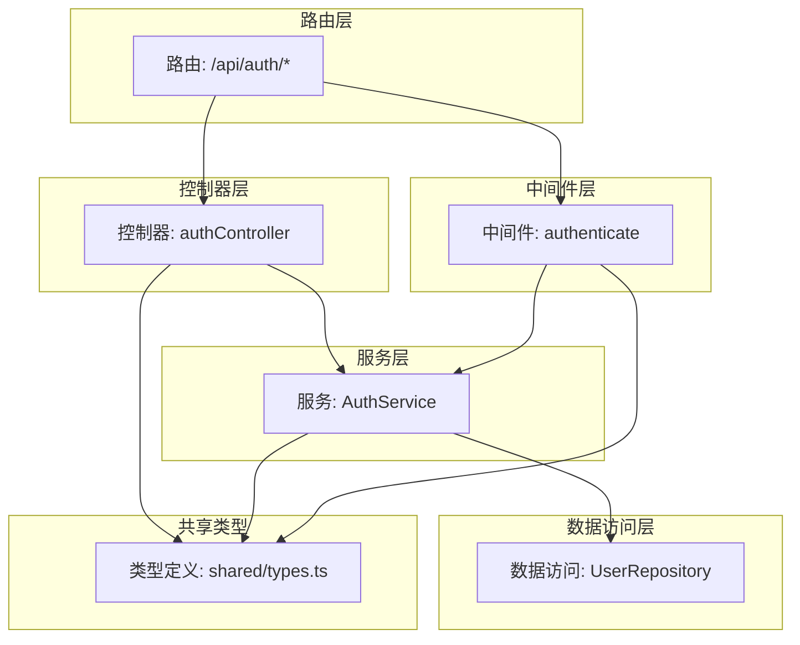
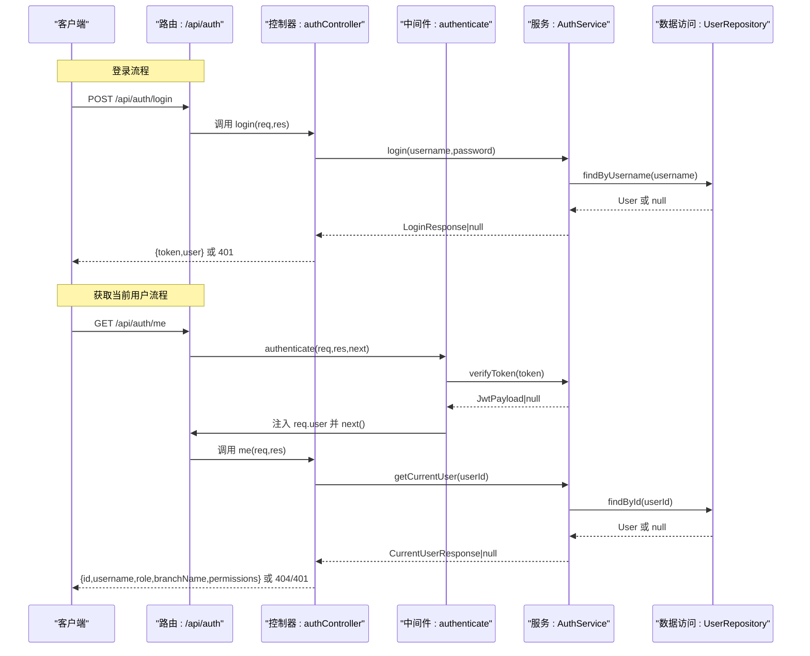
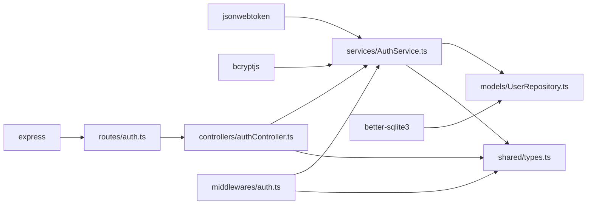

# 认证路由

<cite>
**本文引用的文件**
- [backend/src/routes/auth.ts](file://backend/src/routes/auth.ts)
- [backend/src/controllers/authController.ts](file://backend/src/controllers/authController.ts)
- [backend/src/middlewares/auth.ts](file://backend/src/middlewares/auth.ts)
- [backend/src/services/AuthService.ts](file://backend/src/services/AuthService.ts)
- [backend/src/models/UserRepository.ts](file://backend/src/models/UserRepository.ts)
- [shared/types.ts](file://shared/types.ts)
- [backend/src/index.ts](file://backend/src/index.ts)
- [backend/tests/unit/auth.test.ts](file://backend/tests/unit/auth.test.ts)
- [backend/src/database-init.ts](file://backend/src/database-init.ts)
- [backend/src/utils/seedUsers.ts](file://backend/src/utils/seedUsers.ts)
- [backend/package.json](file://backend/package.json)
</cite>

## 目录
1. [简介](#简介)
2. [项目结构](#项目结构)
3. [核心组件](#核心组件)
4. [架构总览](#架构总览)
5. [详细组件分析](#详细组件分析)
6. [依赖关系分析](#依赖关系分析)
7. [性能考量](#性能考量)
8. [故障排查指南](#故障排查指南)
9. [结论](#结论)
10. [附录](#附录)

## 简介
本文件为认证路由模块的技术文档，聚焦于以下目标：
- 解释认证路由的设计原理与实现细节
- 文档化登录接口（/api/auth/login）与用户信息获取接口（/api/auth/me）
- 说明 JWT 令牌的生成、验证与刷新机制
- 解释认证中间件（authenticate）的工作原理与使用方式
- 提供用户登录流程的完整示例（密码验证、令牌签发、响应格式）
- 总结认证失败的错误处理策略与安全注意事项

## 项目结构
认证模块采用分层架构，围绕路由、控制器、中间件、服务与数据访问层协同工作：
- 路由层：定义 /api/auth/login 与 /api/auth/me 的 HTTP 接口
- 控制器层：处理业务请求，调用服务层执行登录与用户信息查询
- 中间件层：认证中间件负责从请求头提取并校验 JWT，注入用户上下文
- 服务层：封装登录验证、JWT 生成与校验、权限映射等核心逻辑
- 数据访问层：基于 better-sqlite3 的 UserRepository 提供用户查询能力
- 共享类型：统一前后端交互的数据模型与错误响应格式

图表来源
- [backend/src/routes/auth.ts:1-19](file://backend/src/routes/auth.ts#L1-L19)
- [backend/src/controllers/authController.ts:1-77](file://backend/src/controllers/authController.ts#L1-L77)
- [backend/src/middlewares/auth.ts:1-56](file://backend/src/middlewares/auth.ts#L1-L56)
- [backend/src/services/AuthService.ts:1-126](file://backend/src/services/AuthService.ts#L1-L126)
- [backend/src/models/UserRepository.ts:1-56](file://backend/src/models/UserRepository.ts#L1-L56)
- [shared/types.ts:75-130](file://shared/types.ts#L75-L130)

章节来源
- [backend/src/routes/auth.ts:1-19](file://backend/src/routes/auth.ts#L1-L19)
- [backend/src/controllers/authController.ts:1-77](file://backend/src/controllers/authController.ts#L1-L77)
- [backend/src/middlewares/auth.ts:1-56](file://backend/src/middlewares/auth.ts#L1-L56)
- [backend/src/services/AuthService.ts:1-126](file://backend/src/services/AuthService.ts#L1-L126)
- [backend/src/models/UserRepository.ts:1-56](file://backend/src/models/UserRepository.ts#L1-L56)
- [shared/types.ts:75-130](file://shared/types.ts#L75-L130)

## 核心组件
- 路由定义：暴露登录与“当前用户”两个接口，并在“当前用户”接口上应用认证中间件
- 控制器：登录接口负责参数校验、调用服务层登录、返回令牌与用户信息；“当前用户”接口负责从请求上下文读取用户信息并查询最新状态
- 认证中间件：从 Authorization 头解析 Bearer Token，调用服务层校验，成功则将用户信息注入请求对象
- 服务层：提供登录验证（用户名存在性与密码哈希比对）、JWT 生成与校验、权限映射、当前用户信息查询
- 数据访问层：提供按用户名与 ID 查询用户的能力
- 共享类型：定义用户、角色、权限、登录/当前用户响应等接口，确保前后端一致

章节来源
- [backend/src/routes/auth.ts:10-16](file://backend/src/routes/auth.ts#L10-L16)
- [backend/src/controllers/authController.ts:16-76](file://backend/src/controllers/authController.ts#L16-L76)
- [backend/src/middlewares/auth.ts:26-55](file://backend/src/middlewares/auth.ts#L26-L55)
- [backend/src/services/AuthService.ts:32-125](file://backend/src/services/AuthService.ts#L32-L125)
- [backend/src/models/UserRepository.ts:38-54](file://backend/src/models/UserRepository.ts#L38-L54)
- [shared/types.ts:75-130](file://shared/types.ts#L75-L130)

## 架构总览
认证模块遵循“路由 -> 控制器 -> 中间件 -> 服务 -> 数据访问”的调用链路，同时通过共享类型保证数据契约一致性。

图表来源
- [backend/src/routes/auth.ts:12-16](file://backend/src/routes/auth.ts#L12-L16)
- [backend/src/controllers/authController.ts:16-76](file://backend/src/controllers/authController.ts#L16-L76)
- [backend/src/middlewares/auth.ts:26-55](file://backend/src/middlewares/auth.ts#L26-L55)
- [backend/src/services/AuthService.ts:43-110](file://backend/src/services/AuthService.ts#L43-L110)
- [backend/src/models/UserRepository.ts:38-54](file://backend/src/models/UserRepository.ts#L38-L54)

## 详细组件分析

### 路由层：认证路由
- 登录接口：POST /api/auth/login，直接绑定控制器方法
- 当前用户接口：GET /api/auth/me，前置认证中间件 authenticate，再绑定控制器方法
- 路由注册：在应用入口中挂载至 /api/auth 前缀

章节来源
- [backend/src/routes/auth.ts:10-18](file://backend/src/routes/auth.ts#L10-L18)
- [backend/src/index.ts:24-26](file://backend/src/index.ts#L24-L26)

### 控制器层：认证控制器
- 登录流程要点：
  - 参数校验：用户名与密码必填
  - 调用服务层登录：若失败返回 401 与错误码
  - 成功返回 { token, user }，其中 user 包含 id、username、role、branchName
- 获取当前用户流程要点：
  - 从请求上下文读取 req.user
  - 调用服务层 getCurrentUser 获取权限列表
  - 若用户不存在返回 404，未认证返回 401
  - 成功返回 { id, username, role, branchName, permissions }

章节来源
- [backend/src/controllers/authController.ts:16-76](file://backend/src/controllers/authController.ts#L16-L76)
- [shared/types.ts:106-130](file://shared/types.ts#L106-L130)

### 认证中间件：authenticate
- 功能职责：
  - 从 Authorization 请求头提取 Bearer Token
  - 调用服务层 verifyToken 校验令牌有效性
  - 校验通过后将用户信息注入 req.user，继续后续处理
- 错误处理：
  - 缺失或格式不正确（非 Bearer）返回 401
  - 令牌无效或过期返回 401

章节来源
- [backend/src/middlewares/auth.ts:26-55](file://backend/src/middlewares/auth.ts#L26-L55)
- [backend/src/services/AuthService.ts:85-92](file://backend/src/services/AuthService.ts#L85-L92)

### 服务层：AuthService
- 登录验证（login）：
  - 按用户名查询用户，不存在返回 null
  - 使用 bcrypt 比对密码哈希，失败返回 null
  - 成功生成 JWT 并返回 { token, user }
- JWT 生成与校验：
  - 生成：使用对称密钥（JWT_SECRET）与过期时间（默认 8 小时）
  - 校验：verify 返回解码后的 JwtPayload，异常则返回 null
- 当前用户信息（getCurrentUser）：
  - 按 ID 查询用户，不存在返回 null
  - 返回用户信息并附加权限列表（基于角色映射）
- 权限映射：
  - operator：导入、查询、审核、回寄、确认收货/寄出、转交、上传扫描、OCR 等
  - branch：查看自有档案、确认寄出、确认回寄
  - general_affairs：确认归档
- 密码哈希：
  - 提供静态方法对明文密码进行哈希，便于创建用户

章节来源
- [backend/src/services/AuthService.ts:32-125](file://backend/src/services/AuthService.ts#L32-L125)
- [shared/types.ts:87-102](file://shared/types.ts#L87-L102)

### 数据访问层：UserRepository
- findByUsername：按用户名查询用户，返回 User 或 null
- findById：按 ID 查询用户，返回 User 或 null
- 行到实体映射：将数据库行（snake_case）转换为 User 接口（camelCase）

章节来源
- [backend/src/models/UserRepository.ts:38-54](file://backend/src/models/UserRepository.ts#L38-L54)

### 共享类型：统一数据契约
- 用户接口（User）：id、username、passwordHash、role、branchName、createdAt
- 权限类型（Permission）：枚举集合，覆盖导入、查询、审核、回寄、确认收货/寄出、转交、上传扫描、OCR、查看自有档案、确认寄出、确认回寄、确认归档等
- 登录请求/响应（LoginRequest/LoginResponse）：登录接口的输入输出结构
- 当前用户响应（CurrentUserResponse）：包含权限列表
- 错误响应（ErrorResponse）：统一错误码与消息格式

章节来源
- [shared/types.ts:75-130](file://shared/types.ts#L75-L130)
- [shared/types.ts:87-102](file://shared/types.ts#L87-L102)
- [shared/types.ts:106-130](file://shared/types.ts#L106-L130)
- [shared/types.ts:242-247](file://shared/types.ts#L242-L247)

### 登录接口实现细节（/api/auth/login）
- 请求体：LoginRequest（username, password）
- 处理流程：
  - 参数校验（必填）
  - 通过 UserRepository 查找用户
  - 使用 bcrypt 比对密码哈希
  - 生成 JWT 并返回 LoginResponse
- 响应格式：包含 token 与 user（id、username、role、branchName）
- 失败场景：
  - 参数缺失：400
  - 用户不存在或密码错误：401

章节来源
- [backend/src/controllers/authController.ts:16-43](file://backend/src/controllers/authController.ts#L16-L43)
- [backend/src/services/AuthService.ts:43-65](file://backend/src/services/AuthService.ts#L43-L65)
- [backend/src/models/UserRepository.ts:38-44](file://backend/src/models/UserRepository.ts#L38-L44)
- [shared/types.ts:106-121](file://shared/types.ts#L106-L121)

### 用户信息获取接口实现细节（/api/auth/me）
- 请求路径：GET /api/auth/me
- 中间件要求：必须通过 authenticate 中间件
- 处理流程：
  - 从 req.user 读取用户标识
  - 通过 UserRepository 查询用户
  - 通过 AuthService.getCurrentUser 附加权限列表
- 响应格式：CurrentUserResponse（id、username、role、branchName、permissions）
- 失败场景：
  - 未提供认证令牌或格式不正确：401
  - 令牌无效或过期：401
  - 用户不存在：404

章节来源
- [backend/src/routes/auth.ts:15-16](file://backend/src/routes/auth.ts#L15-L16)
- [backend/src/middlewares/auth.ts:26-55](file://backend/src/middlewares/auth.ts#L26-L55)
- [backend/src/controllers/authController.ts:50-76](file://backend/src/controllers/authController.ts#L50-L76)
- [backend/src/services/AuthService.ts:97-110](file://backend/src/services/AuthService.ts#L97-L110)
- [backend/src/models/UserRepository.ts:47-54](file://backend/src/models/UserRepository.ts#L47-L54)
- [shared/types.ts:123-130](file://shared/types.ts#L123-L130)

### JWT 令牌生成、验证与刷新机制
- 生成：
  - 使用对称密钥（JWT_SECRET），默认过期时间为 8 小时
  - 载荷包含 userId、username、role、branchName（可选）
- 验证：
  - 使用相同密钥进行 verify，成功返回载荷，失败返回 null
- 刷新：
  - 代码中未实现专用的“刷新令牌”接口
  - 建议方案：引入 refresh_token 存储与校验，结合短期 access_token 与长期 refresh_token 实现自动续期

章节来源
- [backend/src/services/AuthService.ts:70-92](file://backend/src/services/AuthService.ts#L70-L92)
- [backend/src/services/AuthService.ts:11-15](file://backend/src/services/AuthService.ts#L11-L15)

### 认证中间件（authenticate）工作原理与使用方式
- 工作原理：
  - 从 Authorization 头提取 Bearer Token
  - 调用 AuthService.verifyToken 校验
  - 成功后将 JwtPayload 注入 req.user，继续执行后续处理器
- 使用方式：
  - 在需要认证的路由上挂载 authenticate 中间件
  - 在控制器中通过 req.user 获取用户信息

章节来源
- [backend/src/middlewares/auth.ts:26-55](file://backend/src/middlewares/auth.ts#L26-L55)
- [backend/src/routes/auth.ts](file://backend/src/routes/auth.ts#L16)

### 用户登录流程完整示例
- 步骤：
  1) 客户端向 POST /api/auth/login 发送用户名与密码
  2) 服务器通过 UserRepository 查找用户
  3) 使用 bcrypt 比对密码哈希
  4) 成功后 AuthService 生成 JWT
  5) 返回 { token, user }
  6) 客户端在后续请求的 Authorization 头中携带 Bearer token
  7) 服务器通过 authenticate 中间件校验 token，并在 /api/auth/me 获取当前用户信息

章节来源
- [backend/src/controllers/authController.ts:16-43](file://backend/src/controllers/authController.ts#L16-L43)
- [backend/src/middlewares/auth.ts:26-55](file://backend/src/middlewares/auth.ts#L26-L55)
- [backend/src/services/AuthService.ts:43-65](file://backend/src/services/AuthService.ts#L43-L65)

### 错误处理策略与安全考虑
- 错误处理策略：
  - 登录失败：返回 401 与错误码（如 LOGIN_FAILED）
  - 未认证：返回 401 与错误码（如 UNAUTHORIZED）
  - 用户不存在：返回 404 与错误码（如 USER_NOT_FOUND）
  - 参数缺失：返回 400 与错误码（如 INVALID_REQUEST）
- 安全考虑：
  - 使用 bcrypt 对密码进行哈希存储
  - 使用对称密钥（JWT_SECRET）签名与验证 JWT
  - 建议生产环境设置更强的密钥与更短的过期时间
  - 建议引入 refresh_token 机制实现令牌续期
  - 建议对敏感接口增加速率限制与防暴力破解策略

章节来源
- [backend/src/controllers/authController.ts:19-42](file://backend/src/controllers/authController.ts#L19-L42)
- [backend/src/middlewares/auth.ts:29-35](file://backend/src/middlewares/auth.ts#L29-L35)
- [backend/src/services/AuthService.ts:11-15](file://backend/src/services/AuthService.ts#L11-L15)

## 依赖关系分析
- 外部依赖：
  - jsonwebtoken：JWT 生成与校验
  - bcryptjs：密码哈希
  - better-sqlite3：SQLite 数据库访问
  - express：HTTP 服务器框架
- 内部依赖：
  - 路由依赖控制器
  - 控制器依赖服务层
  - 中间件依赖服务层
  - 服务层依赖数据访问层
  - 全部组件依赖共享类型

图表来源
- [backend/package.json:14-22](file://backend/package.json#L14-L22)
- [backend/src/routes/auth.ts:6-8](file://backend/src/routes/auth.ts#L6-L8)
- [backend/src/controllers/authController.ts:6-10](file://backend/src/controllers/authController.ts#L6-L10)
- [backend/src/middlewares/auth.ts:6-9](file://backend/src/middlewares/auth.ts#L6-L9)
- [backend/src/services/AuthService.ts:6-8](file://backend/src/services/AuthService.ts#L6-L8)
- [backend/src/models/UserRepository.ts](file://backend/src/models/UserRepository.ts#L6)

章节来源
- [backend/package.json:14-22](file://backend/package.json#L14-L22)
- [backend/src/routes/auth.ts:6-8](file://backend/src/routes/auth.ts#L6-L8)
- [backend/src/controllers/authController.ts:6-10](file://backend/src/controllers/authController.ts#L6-L10)
- [backend/src/middlewares/auth.ts:6-9](file://backend/src/middlewares/auth.ts#L6-L9)
- [backend/src/services/AuthService.ts:6-8](file://backend/src/services/AuthService.ts#L6-L8)
- [backend/src/models/UserRepository.ts](file://backend/src/models/UserRepository.ts#L6)

## 性能考量
- 数据库查询：
  - UserRepository 使用原生 SQL 查询，具备良好性能
  - 建议在高频查询字段上建立索引（如 users.username、archive_records.fund_account 等）
- 密码哈希成本：
  - bcrypt 默认成本为 10，平衡安全性与性能
  - 生产环境可根据硬件能力调整成本因子
- JWT 生成与校验：
  - 对称密钥算法开销较小，适合高并发场景
  - 建议避免在 JWT 中存放过多用户信息，减少负载
- 中间件链路：
  - 认证中间件仅做一次令牌校验与一次用户查询
  - 建议在控制器层缓存必要的用户权限信息（视业务需求）

[本节为通用建议，无需特定文件来源]

## 故障排查指南
- 登录失败（401）：
  - 检查用户名是否存在与密码是否正确
  - 确认 bcrypt 哈希匹配逻辑
- 未认证（401）：
  - 检查请求头 Authorization 是否为 Bearer 格式
  - 确认 JWT_SECRET 设置正确且与签发端一致
- 用户不存在（404）：
  - 检查用户 ID 是否正确
  - 确认数据库中用户记录存在
- 单元测试参考：
  - 登录与令牌校验：覆盖用户名不存在、密码错误、有效登录、无效令牌等场景
  - 权限映射：验证不同角色的权限集合
  - 密码哈希：验证哈希后密码可校验

章节来源
- [backend/tests/unit/auth.test.ts:46-95](file://backend/tests/unit/auth.test.ts#L46-L95)
- [backend/tests/unit/auth.test.ts:97-133](file://backend/tests/unit/auth.test.ts#L97-L133)
- [backend/tests/unit/auth.test.ts:135-161](file://backend/tests/unit/auth.test.ts#L135-L161)

## 结论
认证路由模块通过清晰的分层设计实现了登录与用户信息获取的核心能力，配合 JWT 令牌与认证中间件保障了接口的安全访问。当前实现具备良好的可维护性与扩展性，建议在生产环境中进一步完善令牌刷新机制、密钥管理与安全防护策略。

[本节为总结，无需特定文件来源]

## 附录

### 数据库初始化与种子用户
- 初始化 SQL：创建 users、archive_records、status_change_logs 表及必要索引
- 种子用户：提供 operator、branch、general 三个角色的测试账户，密码为 123456

章节来源
- [backend/src/database-init.ts:8-64](file://backend/src/database-init.ts#L8-L64)
- [backend/src/utils/seedUsers.ts:5-19](file://backend/src/utils/seedUsers.ts#L5-L19)

### 应用入口与路由注册
- 应用启动时初始化数据库并插入种子用户
- 注册 /api/auth、/api/archives、/api/ocr 路由前缀

章节来源
- [backend/src/index.ts:20-26](file://backend/src/index.ts#L20-L26)