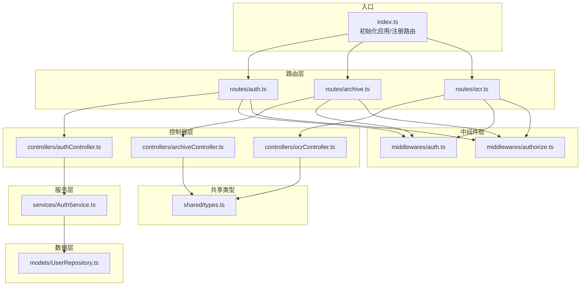
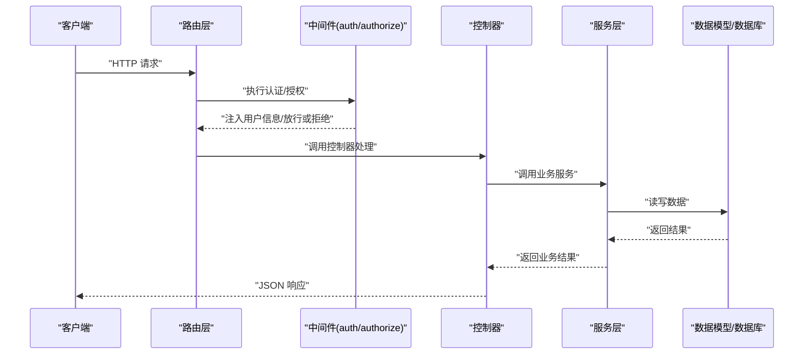
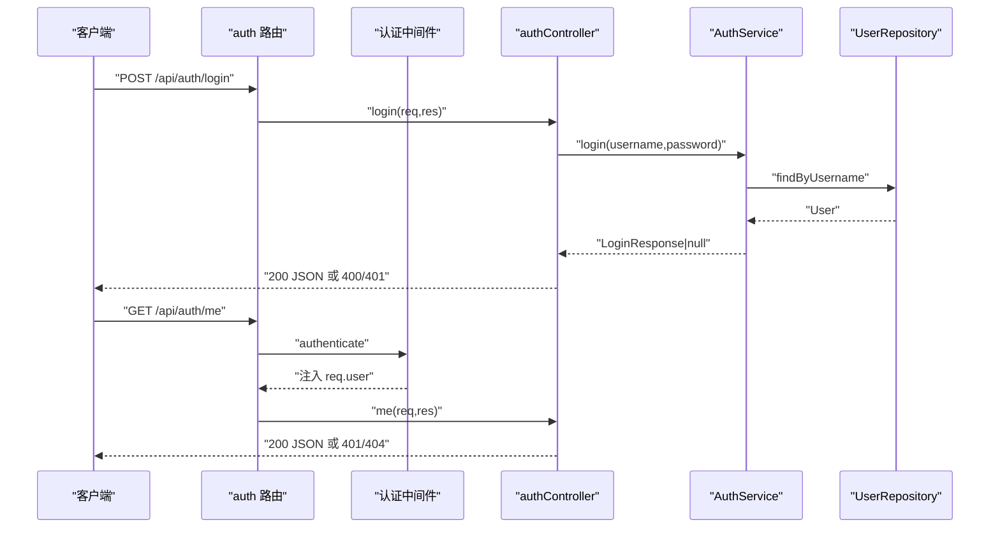
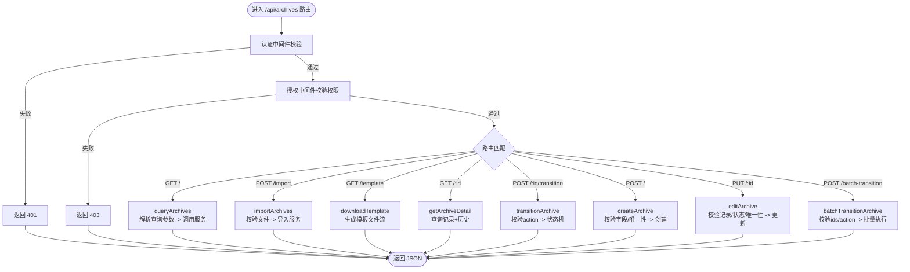
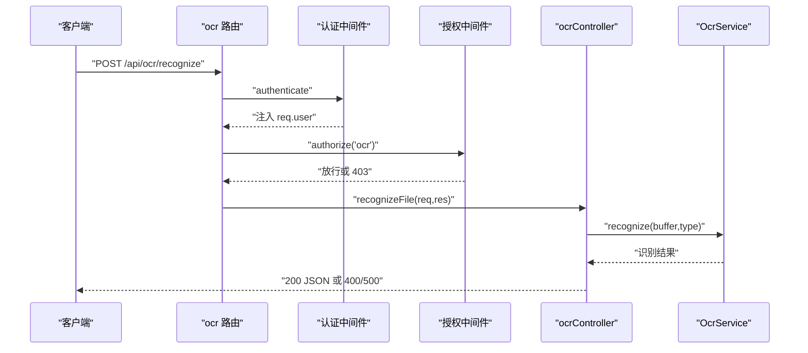
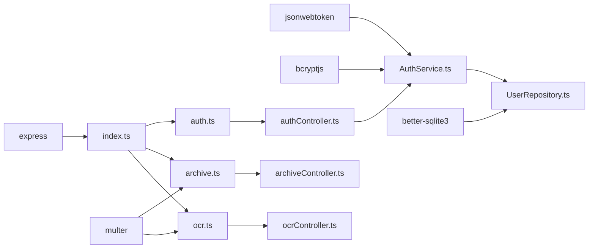

# 路由系统

<cite>
**本文引用的文件**
- [backend/src/index.ts](file://backend/src/index.ts)
- [backend/src/routes/auth.ts](file://backend/src/routes/auth.ts)
- [backend/src/routes/archive.ts](file://backend/src/routes/archive.ts)
- [backend/src/routes/ocr.ts](file://backend/src/routes/ocr.ts)
- [backend/src/controllers/authController.ts](file://backend/src/controllers/authController.ts)
- [backend/src/controllers/archiveController.ts](file://backend/src/controllers/archiveController.ts)
- [backend/src/controllers/ocrController.ts](file://backend/src/controllers/ocrController.ts)
- [backend/src/middlewares/auth.ts](file://backend/src/middlewares/auth.ts)
- [backend/src/middlewares/authorize.ts](file://backend/src/middlewares/authorize.ts)
- [backend/src/services/AuthService.ts](file://backend/src/services/AuthService.ts)
- [backend/src/models/UserRepository.ts](file://backend/src/models/UserRepository.ts)
- [shared/types.ts](file://shared/types.ts)
- [backend/package.json](file://backend/package.json)
</cite>

## 目录
1. [简介](#简介)
2. [项目结构](#项目结构)
3. [核心组件](#核心组件)
4. [架构总览](#架构总览)
5. [详细组件分析](#详细组件分析)
6. [依赖关系分析](#依赖关系分析)
7. [性能考虑](#性能考虑)
8. [故障排查指南](#故障排查指南)
9. [结论](#结论)
10. [附录](#附录)

## 简介
本文件对档案管理系统的路由系统进行全面技术文档化，重点覆盖：
- Express 路由的组织结构与 URL 模式设计
- RESTful API 的命名规范与资源组织方式
- 认证路由（/api/auth）、档案路由（/api/archives）、OCR 路由（/api/ocr）的具体实现
- 路由参数验证、查询参数处理与请求体解析机制
- 路由中间件的使用示例与错误处理策略
- 路由版本控制与 API 文档生成的最佳实践

## 项目结构
后端采用按职责分层的组织方式：
- 入口文件负责初始化应用、注册路由与健康检查
- 路由层定义 URL 模式与中间件链
- 控制器层处理业务逻辑与响应
- 中间件层提供认证与授权能力
- 服务层封装业务规则与状态机
- 数据模型层提供数据访问能力
- 共享类型定义前后端一致的数据契约

图表来源
- [backend/src/index.ts:14-36](file://backend/src/index.ts#L14-L36)
- [backend/src/routes/auth.ts:6-18](file://backend/src/routes/auth.ts#L6-L18)
- [backend/src/routes/archive.ts:6-41](file://backend/src/routes/archive.ts#L6-L41)
- [backend/src/routes/ocr.ts:6-20](file://backend/src/routes/ocr.ts#L6-L20)
- [backend/src/controllers/authController.ts:6-76](file://backend/src/controllers/authController.ts#L6-L76)
- [backend/src/controllers/archiveController.ts:6-447](file://backend/src/controllers/archiveController.ts#L6-L447)
- [backend/src/controllers/ocrController.ts:6-93](file://backend/src/controllers/ocrController.ts#L6-L93)
- [backend/src/middlewares/auth.ts:26-55](file://backend/src/middlewares/auth.ts#L26-L55)
- [backend/src/middlewares/authorize.ts:16-46](file://backend/src/middlewares/authorize.ts#L16-L46)
- [backend/src/services/AuthService.ts:32-125](file://backend/src/services/AuthService.ts#L32-L125)
- [backend/src/models/UserRepository.ts:31-54](file://backend/src/models/UserRepository.ts#L31-L54)
- [shared/types.ts:8-289](file://shared/types.ts#L8-L289)

章节来源
- [backend/src/index.ts:14-36](file://backend/src/index.ts#L14-L36)
- [backend/src/routes/auth.ts:6-18](file://backend/src/routes/auth.ts#L6-L18)
- [backend/src/routes/archive.ts:6-41](file://backend/src/routes/archive.ts#L6-L41)
- [backend/src/routes/ocr.ts:6-20](file://backend/src/routes/ocr.ts#L6-L20)

## 核心组件
- 应用入口与路由注册：在入口文件中初始化 Express、启用 CORS 与 JSON 解析，注册 /api/auth、/api/archives、/api/ocr 三个路由模块，并提供 /api/health 健康检查。
- 路由模块：每个模块以 Router 实例导出，定义具体 URL 模式与方法；部分路由使用 multer 内存存储处理文件上传。
- 控制器：实现具体的业务逻辑，统一返回结构化响应；对输入参数进行显式校验，必要时调用服务层。
- 中间件：认证中间件从 Authorization 头提取 Bearer Token 并注入用户信息；授权中间件根据角色权限列表校验所需权限。
- 服务与数据模型：AuthService 提供登录、Token 生成与校验、权限映射；UserRepository 提供用户查询；共享类型定义贯穿前后端契约。

章节来源
- [backend/src/index.ts:14-36](file://backend/src/index.ts#L14-L36)
- [backend/src/middlewares/auth.ts:26-55](file://backend/src/middlewares/auth.ts#L26-L55)
- [backend/src/middlewares/authorize.ts:16-46](file://backend/src/middlewares/authorize.ts#L16-L46)
- [backend/src/services/AuthService.ts:32-125](file://backend/src/services/AuthService.ts#L32-L125)
- [backend/src/models/UserRepository.ts:31-54](file://backend/src/models/UserRepository.ts#L31-L54)
- [shared/types.ts:8-289](file://shared/types.ts#L8-L289)

## 架构总览
下图展示路由到控制器、中间件与服务的整体交互流程。

图表来源
- [backend/src/routes/auth.ts:12-16](file://backend/src/routes/auth.ts#L12-L16)
- [backend/src/routes/archive.ts:17-39](file://backend/src/routes/archive.ts#L17-L39)
- [backend/src/routes/ocr.ts:17-18](file://backend/src/routes/ocr.ts#L17-L18)
- [backend/src/middlewares/auth.ts:26-55](file://backend/src/middlewares/auth.ts#L26-L55)
- [backend/src/middlewares/authorize.ts:16-46](file://backend/src/middlewares/authorize.ts#L16-L46)
- [backend/src/controllers/authController.ts:16-43](file://backend/src/controllers/authController.ts#L16-L43)
- [backend/src/controllers/archiveController.ts:99-147](file://backend/src/controllers/archiveController.ts#L99-L147)
- [backend/src/controllers/ocrController.ts:43-93](file://backend/src/controllers/ocrController.ts#L43-L93)
- [backend/src/services/AuthService.ts:39-65](file://backend/src/services/AuthService.ts#L39-L65)
- [backend/src/models/UserRepository.ts:38-54](file://backend/src/models/UserRepository.ts#L38-L54)

## 详细组件分析

### 认证路由（/api/auth）
- 路由定义
  - POST /api/auth/login：用户登录，返回 JWT Token 与用户信息
  - GET /api/auth/me：获取当前用户信息（需认证）
- 控制器逻辑
  - login：校验请求体必填字段，调用 AuthService.login，返回统一错误码或成功响应
  - me：从请求上下文读取用户信息，查询用户并返回含权限列表的当前用户信息
- 中间件
  - authenticate：从 Authorization 头提取 Bearer Token，校验并注入用户信息
- 错误处理
  - 未提供或无效 Token 返回 401
  - 登录失败返回 401
  - 用户不存在返回 404
- 请求体解析
  - 入口启用 express.json，login 使用 req.body 解析 JSON

图表来源
- [backend/src/routes/auth.ts:12-16](file://backend/src/routes/auth.ts#L12-L16)
- [backend/src/middlewares/auth.ts:26-55](file://backend/src/middlewares/auth.ts#L26-L55)
- [backend/src/controllers/authController.ts:16-76](file://backend/src/controllers/authController.ts#L16-L76)
- [backend/src/services/AuthService.ts:39-110](file://backend/src/services/AuthService.ts#L39-L110)
- [backend/src/models/UserRepository.ts:38-54](file://backend/src/models/UserRepository.ts#L38-L54)

章节来源
- [backend/src/routes/auth.ts:6-18](file://backend/src/routes/auth.ts#L6-L18)
- [backend/src/controllers/authController.ts:16-76](file://backend/src/controllers/authController.ts#L16-L76)
- [backend/src/middlewares/auth.ts:26-55](file://backend/src/middlewares/auth.ts#L26-L55)
- [backend/src/services/AuthService.ts:39-110](file://backend/src/services/AuthService.ts#L39-L110)
- [backend/src/models/UserRepository.ts:38-54](file://backend/src/models/UserRepository.ts#L38-L54)

### 档案路由（/api/archives）
- 路由定义
  - GET /api/archives：查询档案列表（需认证，支持多条件与分页）
  - POST /api/archives：创建新档案记录（需认证 + review 权限）
  - POST /api/archives/import：Excel 批量导入（需认证 + import 权限，multipart/form-data）
  - POST /api/archives/batch-transition：批量状态流转
  - GET /api/archives/template：下载导入模板（需认证）
  - GET /api/archives/:id：获取档案详情（含状态变更历史）
  - POST /api/archives/:id/transition：单条状态流转
  - PUT /api/archives/:id：编辑档案基础信息（需认证 + review 权限）
- 控制器逻辑
  - importArchives：校验文件存在与格式，调用 ImportService 导入
  - downloadTemplate：生成 Excel 模板并返回文件流
  - queryArchives：从查询参数提取条件，调用 ArchiveService 查询
  - getArchiveDetail：查询记录与状态变更历史
  - transitionArchive：校验 action，调用状态机服务执行流转
  - batchTransitionArchive：校验 ids 与 action，批量执行
  - createArchive：校验必填字段与合同版本类型，检查唯一性，设置初始状态
  - editArchive：校验记录存在与状态，检查唯一性，更新基础信息
- 中间件
  - authenticate：所有受保护路由均需认证
  - authorize('review','import')：特定路由需要相应权限
- 请求体/文件解析
  - multer 内存存储，支持单文件上传
  - express.json 用于 JSON 请求体
- 错误处理
  - 统一返回带 code 与 message 的错误响应
  - 不同错误场景返回不同 HTTP 状态码（如 400/401/403/404/409）

图表来源
- [backend/src/routes/archive.ts:17-39](file://backend/src/routes/archive.ts#L17-L39)
- [backend/src/middlewares/auth.ts:26-55](file://backend/src/middlewares/auth.ts#L26-L55)
- [backend/src/middlewares/authorize.ts:16-46](file://backend/src/middlewares/authorize.ts#L16-L46)
- [backend/src/controllers/archiveController.ts:43-71](file://backend/src/controllers/archiveController.ts#L43-L71)
- [backend/src/controllers/archiveController.ts:77-92](file://backend/src/controllers/archiveController.ts#L77-L92)
- [backend/src/controllers/archiveController.ts:99-147](file://backend/src/controllers/archiveController.ts#L99-L147)
- [backend/src/controllers/archiveController.ts:153-188](file://backend/src/controllers/archiveController.ts#L153-L188)
- [backend/src/controllers/archiveController.ts:208-258](file://backend/src/controllers/archiveController.ts#L208-L258)
- [backend/src/controllers/archiveController.ts:279-324](file://backend/src/controllers/archiveController.ts#L279-L324)
- [backend/src/controllers/archiveController.ts:330-396](file://backend/src/controllers/archiveController.ts#L330-L396)
- [backend/src/controllers/archiveController.ts:403-447](file://backend/src/controllers/archiveController.ts#L403-L447)

章节来源
- [backend/src/routes/archive.ts:6-41](file://backend/src/routes/archive.ts#L6-L41)
- [backend/src/controllers/archiveController.ts:43-447](file://backend/src/controllers/archiveController.ts#L43-L447)
- [backend/src/middlewares/auth.ts:26-55](file://backend/src/middlewares/auth.ts#L26-L55)
- [backend/src/middlewares/authorize.ts:16-46](file://backend/src/middlewares/authorize.ts#L16-L46)

### OCR 路由（/api/ocr）
- 路由定义
  - POST /api/ocr/recognize：上传扫描件并 OCR 识别（需认证 + ocr 权限）
- 控制器逻辑
  - recognizeFile：校验文件存在、格式（扩展名与 MIME）、大小，调用 OcrService 识别，返回结构化结果
- 中间件
  - authenticate + authorize('ocr')
- 请求体/文件解析
  - multer 内存存储，单文件上传
- 错误处理
  - 文件不支持、过大、识别失败等返回 400/500 与统一错误码

图表来源
- [backend/src/routes/ocr.ts:17-18](file://backend/src/routes/ocr.ts#L17-L18)
- [backend/src/middlewares/auth.ts:26-55](file://backend/src/middlewares/auth.ts#L26-L55)
- [backend/src/middlewares/authorize.ts:16-46](file://backend/src/middlewares/authorize.ts#L16-L46)
- [backend/src/controllers/ocrController.ts:43-93](file://backend/src/controllers/ocrController.ts#L43-L93)

章节来源
- [backend/src/routes/ocr.ts:6-20](file://backend/src/routes/ocr.ts#L6-L20)
- [backend/src/controllers/ocrController.ts:43-93](file://backend/src/controllers/ocrController.ts#L43-L93)
- [backend/src/middlewares/auth.ts:26-55](file://backend/src/middlewares/auth.ts#L26-L55)
- [backend/src/middlewares/authorize.ts:16-46](file://backend/src/middlewares/authorize.ts#L16-L46)

### 参数验证与请求体解析机制
- 查询参数处理
  - 档案查询使用 req.query 提取多条件与分页参数，控制器内进行类型断言与整数解析
- 路径参数处理
  - 使用 req.params['id'] 获取路径参数
- 请求体解析
  - 入口启用 express.json，login 与状态流转等使用 req.body 解析 JSON
- 文件上传
  - multer 内存存储，支持单文件上传；OCR 与导入路由均使用 upload.single('file')

章节来源
- [backend/src/controllers/archiveController.ts:109-144](file://backend/src/controllers/archiveController.ts#L109-L144)
- [backend/src/controllers/archiveController.ts:163](file://backend/src/controllers/archiveController.ts#L163)
- [backend/src/controllers/archiveController.ts:219](file://backend/src/controllers/archiveController.ts#L219)
- [backend/src/controllers/archiveController.ts:289](file://backend/src/controllers/archiveController.ts#L289)
- [backend/src/controllers/ocrController.ts:44](file://backend/src/controllers/ocrController.ts#L44)
- [backend/src/routes/archive.ts:15](file://backend/src/routes/archive.ts#L15)
- [backend/src/routes/ocr.ts:15](file://backend/src/routes/ocr.ts#L15)
- [backend/src/index.ts:18](file://backend/src/index.ts#L18)

### 中间件与权限控制
- 认证中间件
  - 从 Authorization 头提取 Bearer Token，调用 AuthService.verifyToken 校验，成功后注入 req.user
- 授权中间件
  - authorize(...) 工厂函数接收所需权限列表，基于用户角色权限集合进行校验
- 权限映射
  - operator：具备导入、搜索、审核、回寄、转交、上传扫描、OCR 等权限
  - branch：仅查看自身档案与确认寄出/回寄确认
  - general_affairs：仅确认入库

章节来源
- [backend/src/middlewares/auth.ts:26-55](file://backend/src/middlewares/auth.ts#L26-L55)
- [backend/src/middlewares/authorize.ts:16-46](file://backend/src/middlewares/authorize.ts#L16-L46)
- [backend/src/services/AuthService.ts:25-30](file://backend/src/services/AuthService.ts#L25-L30)

### 错误处理策略
- 统一错误响应结构：包含 code 与 message，便于前端处理
- 常见错误码
  - UNAUTHORIZED：未提供或无效 Token
  - PERMISSION_DENIED：权限不足
  - INVALID_REQUEST/INVALID_FILE/INVALID_FILE_FORMAT/FILE_TOO_LARGE：请求参数或文件校验失败
  - LOGIN_FAILED/USER_NOT_FOUND/NOT_FOUND/DUPLICATE_FUND_ACCOUNT：业务逻辑错误
  - TRANSITION_FAILED：状态流转失败
- HTTP 状态码选择
  - 400：参数/格式/大小/业务校验失败
  - 401：未认证
  - 403：权限不足
  - 404：资源不存在
  - 409：冲突（如重复）
  - 500：服务异常（如 OCR 失败）

章节来源
- [backend/src/controllers/authController.ts:20-42](file://backend/src/controllers/authController.ts#L20-L42)
- [backend/src/controllers/authController.ts:53-75](file://backend/src/controllers/authController.ts#L53-L75)
- [backend/src/controllers/archiveController.ts:46-62](file://backend/src/controllers/archiveController.ts#L46-L62)
- [backend/src/controllers/archiveController.ts:221-228](file://backend/src/controllers/archiveController.ts#L221-L228)
- [backend/src/controllers/archiveController.ts:291-307](file://backend/src/controllers/archiveController.ts#L291-L307)
- [backend/src/controllers/ocrController.ts:46-71](file://backend/src/controllers/ocrController.ts#L46-L71)

### 版本控制与 API 文档最佳实践
- 版本控制建议
  - 在 URL 中加入版本号：/api/v1/auth、/api/v1/archives、/api/v1/ocr
  - 通过 Accept-Version 请求头或路径参数控制版本
  - 保持向后兼容，新增字段时提供默认值
- API 文档生成
  - 使用 OpenAPI/Swagger 定义接口契约，结合注释自动生成文档
  - 为每个路由提供请求/响应示例与错误码说明
  - 为认证与权限提供统一的文档片段
- 代码层面的可维护性
  - 将共享类型集中于 shared/types.ts，前后端复用
  - 控制器与中间件职责单一，便于单元测试与集成测试

章节来源
- [shared/types.ts:8-289](file://shared/types.ts#L8-L289)
- [backend/src/index.ts:24-26](file://backend/src/index.ts#L24-L26)

## 依赖关系分析
- 组件耦合
  - 路由层仅依赖控制器，控制器依赖服务层，服务层依赖数据模型，降低耦合
  - 中间件独立于控制器，通过 req.user 注入用户上下文
- 外部依赖
  - Express 提供 Web 框架与中间件生态
  - Multer 提供文件上传能力
  - Better-SQLite3 提供轻量级数据库访问
  - Jsonwebtoken 与 bcryptjs 提供认证与加密
- 潜在循环依赖
  - 未发现直接循环依赖；路由 -> 控制器 -> 服务 -> 数据模型 的单向依赖链清晰

图表来源
- [backend/package.json:14-22](file://backend/package.json#L14-L22)
- [backend/src/index.ts:6-12](file://backend/src/index.ts#L6-L12)
- [backend/src/routes/archive.ts:7](file://backend/src/routes/archive.ts#L7)
- [backend/src/routes/ocr.ts:7](file://backend/src/routes/ocr.ts#L7)
- [backend/src/services/AuthService.ts:6-9](file://backend/src/services/AuthService.ts#L6-L9)
- [backend/src/models/UserRepository.ts:6](file://backend/src/models/UserRepository.ts#L6)

章节来源
- [backend/package.json:14-22](file://backend/package.json#L14-L22)
- [backend/src/index.ts:6-12](file://backend/src/index.ts#L6-L12)

## 性能考虑
- 文件上传
  - 使用内存存储适合小文件；大文件建议落盘或流式处理，避免内存压力
- 数据库访问
  - 查询参数分页与条件过滤有助于减少一次性加载数据量
- 中间件链
  - 认证与授权中间件应尽量短路失败请求，减少后续处理开销
- JSON 解析
  - 控制请求体大小，避免超大 JSON 导致解析耗时

## 故障排查指南
- 认证失败
  - 检查 Authorization 头是否以 Bearer 开头
  - 确认 Token 未过期且签名有效
- 权限不足
  - 确认用户角色具备所需权限
  - 检查授权中间件是否正确配置
- 文件上传失败
  - 检查文件扩展名、MIME 类型与大小限制
  - 确认 multipart/form-data 与单文件字段名一致
- 状态流转异常
  - 检查 action 是否在允许列表
  - 查看状态机服务返回的错误信息

章节来源
- [backend/src/middlewares/auth.ts:29-50](file://backend/src/middlewares/auth.ts#L29-L50)
- [backend/src/middlewares/authorize.ts:32-42](file://backend/src/middlewares/authorize.ts#L32-L42)
- [backend/src/controllers/ocrController.ts:55-71](file://backend/src/controllers/ocrController.ts#L55-L71)
- [backend/src/controllers/archiveController.ts:221-228](file://backend/src/controllers/archiveController.ts#L221-L228)

## 结论
该路由系统遵循 RESTful 设计原则，采用清晰的分层架构与中间件机制，实现了认证、授权、文件上传与业务逻辑的分离。通过共享类型定义确保前后端一致性，配合统一的错误响应与状态码策略，提升了系统的可维护性与可扩展性。建议在后续迭代中引入版本控制与自动化 API 文档，进一步完善演进路径。

## 附录
- 共享类型概览
  - 角色与权限、状态枚举、请求/响应接口、OCR 字段等
- 常用错误码
  - UNAUTHORIZED、PERMISSION_DENIED、INVALID_REQUEST、INVALID_FILE、INVALID_FILE_FORMAT、FILE_TOO_LARGE、LOGIN_FAILED、USER_NOT_FOUND、NOT_FOUND、DUPLICATE_FUND_ACCOUNT、TRANSITION_FAILED 等

章节来源
- [shared/types.ts:8-289](file://shared/types.ts#L8-L289)