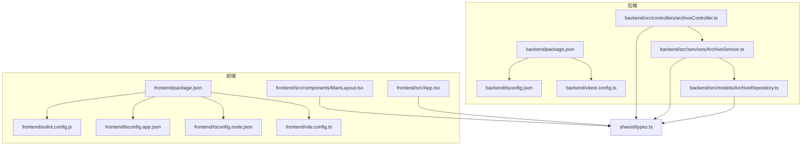
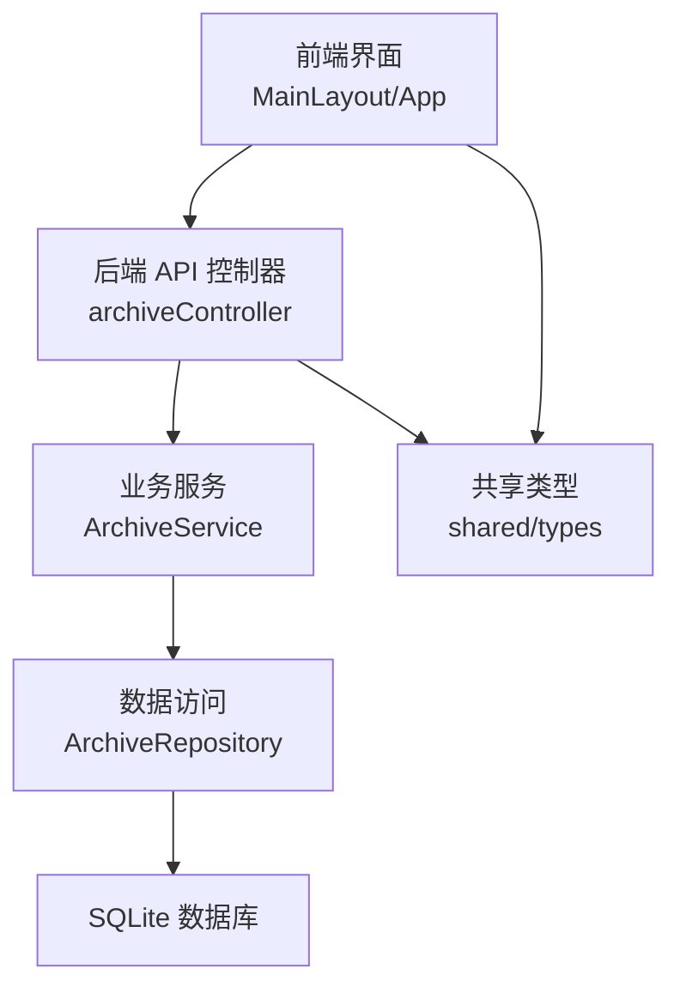
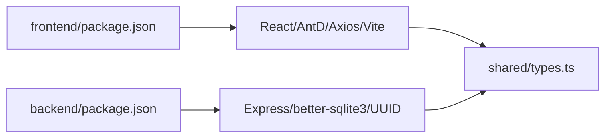
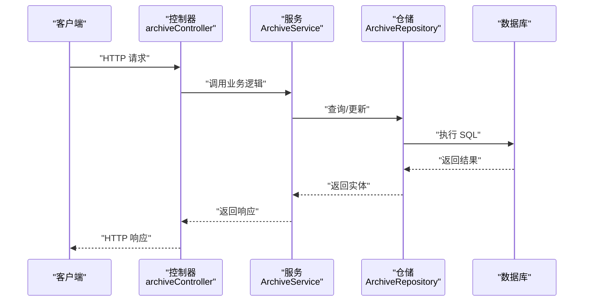

# 代码规范

<cite>
**本文引用的文件**
- [backend/package.json](file://backend/package.json)
- [backend/tsconfig.json](file://backend/tsconfig.json)
- [backend/vitest.config.ts](file://backend/vitest.config.ts)
- [backend/src/controllers/archiveController.ts](file://backend/src/controllers/archiveController.ts)
- [backend/src/services/ArchiveService.ts](file://backend/src/services/ArchiveService.ts)
- [backend/src/models/ArchiveRepository.ts](file://backend/src/models/ArchiveRepository.ts)
- [shared/types.ts](file://shared/types.ts)
- [frontend/package.json](file://frontend/package.json)
- [frontend/eslint.config.js](file://frontend/eslint.config.js)
- [frontend/tsconfig.json](file://frontend/tsconfig.json)
- [frontend/tsconfig.app.json](file://frontend/tsconfig.app.json)
- [frontend/tsconfig.node.json](file://frontend/tsconfig.node.json)
- [frontend/vite.config.ts](file://frontend/vite.config.ts)
- [frontend/src/components/MainLayout.tsx](file://frontend/src/components/MainLayout.tsx)
- [frontend/src/App.tsx](file://frontend/src/App.tsx)
- [backend/tests/unit/archiveController.test.ts](file://backend/tests/unit/archiveController.test.ts)
</cite>

## 目录
1. 引言
2. 项目结构
3. 核心组件
4. 架构总览
5. 详细组件分析
6. 依赖分析
7. 性能考虑
8. 故障排查指南
9. 结论
10. 附录

## 引言
本文件旨在制定并实施统一的代码规范标准，覆盖 TypeScript 编码规范、ESLint 规则与自定义规则、代码格式化标准、Git 提交信息与分支命名约定、单元测试编写规范与覆盖率要求、代码审查检查清单与质量门禁标准、错误处理模式与日志记录规范，以及性能优化最佳实践与安全编码指南。规范以现有仓库实现为依据，结合前后端工程化配置进行提炼与扩展。

## 项目结构
项目采用前后端分离架构，共享类型定义位于 shared 目录，便于前后端一致的数据契约与类型约束。前端使用 Vite + React + TypeScript，后端使用 Express + TypeScript + Vitest 测试框架；两者均通过 tsconfig 的路径别名实现模块化组织。

图示来源
- [frontend/package.json:1-35](file://frontend/package.json#L1-L35)
- [frontend/eslint.config.js:1-24](file://frontend/eslint.config.js#L1-L24)
- [frontend/tsconfig.app.json:1-33](file://frontend/tsconfig.app.json#L1-L33)
- [frontend/tsconfig.node.json:1-27](file://frontend/tsconfig.node.json#L1-L27)
- [frontend/vite.config.ts:1-22](file://frontend/vite.config.ts#L1-L22)
- [backend/package.json:1-41](file://backend/package.json#L1-L41)
- [backend/tsconfig.json:1-25](file://backend/tsconfig.json#L1-L25)
- [backend/vitest.config.ts:1-21](file://backend/vitest.config.ts#L1-L21)
- [backend/src/controllers/archiveController.ts:1-448](file://backend/src/controllers/archiveController.ts#L1-L448)
- [backend/src/services/ArchiveService.ts:1-71](file://backend/src/services/ArchiveService.ts#L1-L71)
- [backend/src/models/ArchiveRepository.ts:1-307](file://backend/src/models/ArchiveRepository.ts#L1-L307)
- [shared/types.ts:1-289](file://shared/types.ts#L1-L289)

章节来源
- [frontend/package.json:1-35](file://frontend/package.json#L1-L35)
- [backend/package.json:1-41](file://backend/package.json#L1-L41)
- [shared/types.ts:1-289](file://shared/types.ts#L1-L289)

## 核心组件
- 类型系统与共享契约：通过 shared/types.ts 定义用户角色、状态枚举、实体接口与 API 请求/响应接口，确保前后端一致的数据模型。
- 控制器层：后端控制器负责路由处理、参数校验与错误响应，典型如档案导入、模板下载、查询、详情、状态流转等。
- 服务层：封装业务逻辑，如 ArchiveService 负责查询与分页策略。
- 数据访问层：ArchiveRepository 提供 CRUD 与分页查询，SQL 构造遵循最小必要原则。
- 前端布局与路由：MainLayout 根据用户角色动态渲染菜单项，App.tsx 展示基础页面结构。

章节来源
- [shared/types.ts:1-289](file://shared/types.ts#L1-L289)
- [backend/src/controllers/archiveController.ts:1-448](file://backend/src/controllers/archiveController.ts#L1-L448)
- [backend/src/services/ArchiveService.ts:1-71](file://backend/src/services/ArchiveService.ts#L1-L71)
- [backend/src/models/ArchiveRepository.ts:1-307](file://backend/src/models/ArchiveRepository.ts#L1-L307)
- [frontend/src/components/MainLayout.tsx:1-95](file://frontend/src/components/MainLayout.tsx#L1-L95)
- [frontend/src/App.tsx:1-122](file://frontend/src/App.tsx#L1-L122)

## 架构总览
系统采用典型的三层架构：表现层（前端）、控制层（后端控制器）、业务层（服务）、数据层（仓库）。类型定义集中于 shared，前后端通过 API 协议交互。

图示来源
- [frontend/src/components/MainLayout.tsx:1-95](file://frontend/src/components/MainLayout.tsx#L1-L95)
- [frontend/src/App.tsx:1-122](file://frontend/src/App.tsx#L1-L122)
- [backend/src/controllers/archiveController.ts:1-448](file://backend/src/controllers/archiveController.ts#L1-L448)
- [backend/src/services/ArchiveService.ts:1-71](file://backend/src/services/ArchiveService.ts#L1-L71)
- [backend/src/models/ArchiveRepository.ts:1-307](file://backend/src/models/ArchiveRepository.ts#L1-L307)
- [shared/types.ts:1-289](file://shared/types.ts#L1-L289)

## 详细组件分析

### TypeScript 编码规范
- 命名约定
  - 类型与接口：采用名词短语或形容词+名词形式，如 ArchiveRecord、ArchiveQueryParams。
  - 枚举与常量：采用全大写加下划线或驼峰，如 UserRole、ContractVersionType；常量集合使用全大写加下划线并导出只读数组。
  - 函数与方法：动词+名词，如 queryWithPagination、findById。
  - 文件与模块：采用小写加连字符，模块别名使用 @/* 或 @shared/*。
- 接口定义
  - 使用 TypeScript 接口描述对象结构，避免在运行时使用类；对可选字段使用 ? 标记。
  - 对外暴露的请求/响应接口集中在 shared/types 中，保证前后端一致性。
- 类型注解
  - 显式标注函数参数与返回值类型，避免 any；对复杂嵌套结构使用工具类型辅助。
  - 使用字面量联合类型限制取值范围，如 TransitionAction。
- 模块组织
  - 使用路径别名 @/* 指向 src，@shared/* 指向 shared，提升可读性与可维护性。
  - tsconfig 中 baseUrl 与 paths 配置确保别名解析一致。

章节来源
- [shared/types.ts:1-289](file://shared/types.ts#L1-L289)
- [backend/tsconfig.json:17-20](file://backend/tsconfig.json#L17-L20)
- [frontend/tsconfig.app.json:27-29](file://frontend/tsconfig.app.json#L27-L29)
- [frontend/tsconfig.node.json:1-27](file://frontend/tsconfig.node.json#L1-L27)

### ESLint 规则配置与自定义规则
- 推荐配置
  - 使用 typescript-eslint 推荐规则集，启用严格模式与未使用变量/参数检查。
  - 在前端根目录配置 eslint.config.js，扩展 recommended、react-hooks、react-refresh 与 typescript-eslint。
  - 保持全局忽略 dist 目录，避免对构建产物进行 lint。
- 自定义规则建议
  - 固定导入顺序：标准库 → 第三方 → 内部模块；内部模块内按层级排序。
  - 禁止魔法数字与字符串，统一抽离为常量或枚举。
  - 禁止在组件中直接使用原生 fetch，统一使用封装的 API 客户端。
  - 禁止在控制器中直接操作数据库，必须通过服务层与仓储层。
  - 禁止在模板中使用内联样式，统一使用 CSS Modules 或主题变量。
  - 禁止在测试中使用 console，统一使用测试框架提供的断言与日志钩子。

章节来源
- [frontend/eslint.config.js:1-24](file://frontend/eslint.config.js#L1-L24)
- [frontend/package.json:20-32](file://frontend/package.json#L20-L32)

### 代码格式化标准与 Prettier 配置
- 统一格式化工具：推荐使用 Prettier，与 ESLint 集成，避免重复规则冲突。
- 配置要点
  - 保持缩进 2 空格，行尾分号关闭，单引号优先，尾随逗号仅在函数参数与多行对象中保留。
  - 与 ESLint 的 parserOptions 保持一致，确保规则生效。
  - 在 CI 中增加格式化检查步骤，失败即阻断合并。
- 与现有配置衔接
  - 前端已启用 ESLint 与 TypeScript 严格模式，建议在本地与 CI 中同时启用 Prettier 校验。

章节来源
- [frontend/eslint.config.js:1-24](file://frontend/eslint.config.js#L1-L24)

### Git 提交信息规范与分支命名约定
- 提交信息规范
  - 格式：type(scope): subject
  - type：feat、fix、docs、style、refactor、perf、test、build、ci、chore、revert
  - scope：模块名或文件路径，如 backend/controllers、frontend/components
  - subject：简要描述，不超过 50 字符，首字母小写，不以句号结尾
  - 示例：feat(backend/controllers): add import validation logic
- 分支命名约定
  - feat/功能点描述
  - fix/问题修复描述
  - docs/文档更新
  - refactor/重构
  - perf/性能优化
  - test/测试相关
  - chore/日常事务
  - release/x.y.z/发布版本

### 单元测试编写规范与覆盖率要求
- 测试文件组织
  - 后端测试位于 backend/tests/unit，按控制器/服务/仓储分别建立测试文件。
  - 前端测试位于 frontend/src，按组件/页面/工具分别建立测试文件。
- 断言与模拟
  - 使用 Vitest 的 expect 与 vi.fn 模拟副作用，如 HTTP 响应、数据库调用。
  - 对边界条件与异常路径进行充分覆盖，如空参数、非法格式、权限不足。
- 覆盖率要求
  - 语句覆盖率、分支覆盖率、函数覆盖率、行覆盖率均不低于 80%。
  - 关键业务逻辑（状态机、导入流程、权限校验）不低于 90%。
- 现状参考
  - 后端 Vitest 配置已启用覆盖率统计，覆盖 src 下的 TypeScript 文件。

章节来源
- [backend/vitest.config.ts:14-18](file://backend/vitest.config.ts#L14-L18)
- [backend/tests/unit/archiveController.test.ts:1-185](file://backend/tests/unit/archiveController.test.ts#L1-L185)

### 代码审查检查清单与质量门禁标准
- 代码审查清单
  - 是否遵循命名约定与类型注解？
  - 是否存在魔法数字/字符串？是否抽取为常量？
  - 是否引入了不必要的第三方依赖？
  - 是否处理了所有错误分支与边界条件？
  - 是否添加了必要的单元测试与集成测试？
  - 是否满足覆盖率门槛？
  - 是否通过 ESLint 与格式化检查？
  - 是否符合 Git 提交信息与分支命名规范？
- 质量门禁
  - 代码必须通过 CI 中的 Lint、格式化、测试与覆盖率检查。
  - 任何破坏性变更需附带迁移说明与回归测试。
  - 新增模块需同步完善类型定义与 API 文档。

### 错误处理模式与日志记录规范
- 错误处理模式
  - 统一使用 ErrorResponse 接口，包含 code 与 message 字段，details 可选。
  - 控制器层对输入参数与外部依赖进行显式校验，失败时返回 400/401/404/409 等明确状态码。
  - 服务层抛出领域异常，由控制器捕获并映射为 HTTP 响应。
- 日志记录规范
  - 使用结构化日志，包含时间、级别、模块、消息、上下文字段（如用户 ID、请求 ID）。
  - 前端仅记录错误与关键事件，避免泄露敏感信息。
  - 后端记录请求链路日志与关键业务事件，配合追踪 ID 定位问题。

章节来源
- [shared/types.ts:240-247](file://shared/types.ts#L240-L247)
- [backend/src/controllers/archiveController.ts:43-71](file://backend/src/controllers/archiveController.ts#L43-L71)

### 性能优化最佳实践
- 前端
  - 按需加载与懒加载组件，减少首屏体积。
  - 使用 React.memo、useMemo、useCallback 降低重渲染。
  - 图片与静态资源使用 CDN，开启压缩与缓存。
- 后端
  - SQL 查询使用索引与分页，避免一次性加载大量数据。
  - 使用连接池与事务批处理，减少数据库往返。
  - 对热点数据使用内存缓存，注意缓存失效策略。
- 共同点
  - 避免阻塞主线程的操作异步化，合理拆分任务。
  - 使用防抖与节流处理高频事件。

### 安全编码指南
- 输入校验
  - 对所有外部输入进行白名单校验，禁止任意代码注入与命令注入。
- 认证与授权
  - JWT 令牌签发与校验需设置过期时间与刷新机制；RBAC 权限控制细化到具体操作。
- 数据保护
  - 敏感数据加密存储，传输使用 HTTPS；避免在日志中输出敏感字段。
- 依赖安全
  - 定期扫描依赖漏洞，及时升级至安全版本。

## 依赖分析
- 前端依赖
  - React 生态与 Ant Design 组件库，Axios 作为 HTTP 客户端，Vite 提供开发与构建能力。
  - TypeScript 严格模式与 ESLint 配置保障类型安全与代码质量。
- 后端依赖
  - Express 提供 Web 服务，better-sqlite3 作为轻量级数据库驱动，UUID 生成主键。
  - Vitest 作为测试框架，tsconfig-paths 支持路径别名解析。

图示来源
- [frontend/package.json:12-32](file://frontend/package.json#L12-L32)
- [backend/package.json:14-39](file://backend/package.json#L14-L39)
- [shared/types.ts:1-289](file://shared/types.ts#L1-L289)

章节来源
- [frontend/package.json:1-35](file://frontend/package.json#L1-L35)
- [backend/package.json:1-41](file://backend/package.json#L1-L41)

## 性能考虑
- 前端性能
  - 使用 React.lazy 与 Suspense 实现组件懒加载；对长列表使用虚拟滚动。
  - 图标与图片资源使用 WebP 格式，按分辨率提供多尺寸。
- 后端性能
  - 对高频查询建立复合索引；分页查询限制最大页大小，防止超大数据集。
  - 使用批量插入与更新，减少事务次数。
- 共享优化
  - API 响应体精简化，去除冗余字段；对大对象使用分页或流式传输。

## 故障排查指南
- 常见问题定位
  - 控制器报错：检查请求参数类型与必填字段，确认中间件是否正确注入用户信息。
  - 服务层异常：查看服务调用链与仓储层 SQL 构造，确认边界条件处理。
  - 前端路由与菜单：检查 MainLayout 的角色菜单映射与 useAuth 钩子状态。
- 调试建议
  - 启用 Vitest 的 watch 模式与覆盖率报告，快速定位失败用例。
  - 在浏览器开发者工具中观察网络请求与响应，确认 API 返回结构与状态码。

章节来源
- [frontend/src/components/MainLayout.tsx:21-33](file://frontend/src/components/MainLayout.tsx#L21-L33)
- [backend/src/controllers/archiveController.ts:99-147](file://backend/src/controllers/archiveController.ts#L99-L147)
- [backend/tests/unit/archiveController.test.ts:21-88](file://backend/tests/unit/archiveController.test.ts#L21-L88)

## 结论
本规范以现有仓库实现为基础，结合工程化配置，制定了统一的 TypeScript 编码、ESLint 与格式化、Git 规范、测试与覆盖率、代码审查与质量门禁、错误处理与日志、性能与安全等方面的指导原则。建议在团队内推广并纳入 CI 流水线，持续提升代码质量与交付效率。

## 附录
- 关键流程时序图：控制器到服务再到仓储的数据流

图示来源
- [backend/src/controllers/archiveController.ts:1-448](file://backend/src/controllers/archiveController.ts#L1-L448)
- [backend/src/services/ArchiveService.ts:1-71](file://backend/src/services/ArchiveService.ts#L1-L71)
- [backend/src/models/ArchiveRepository.ts:1-307](file://backend/src/models/ArchiveRepository.ts#L1-L307)