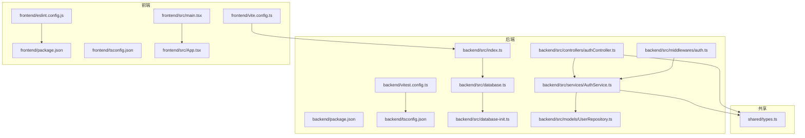
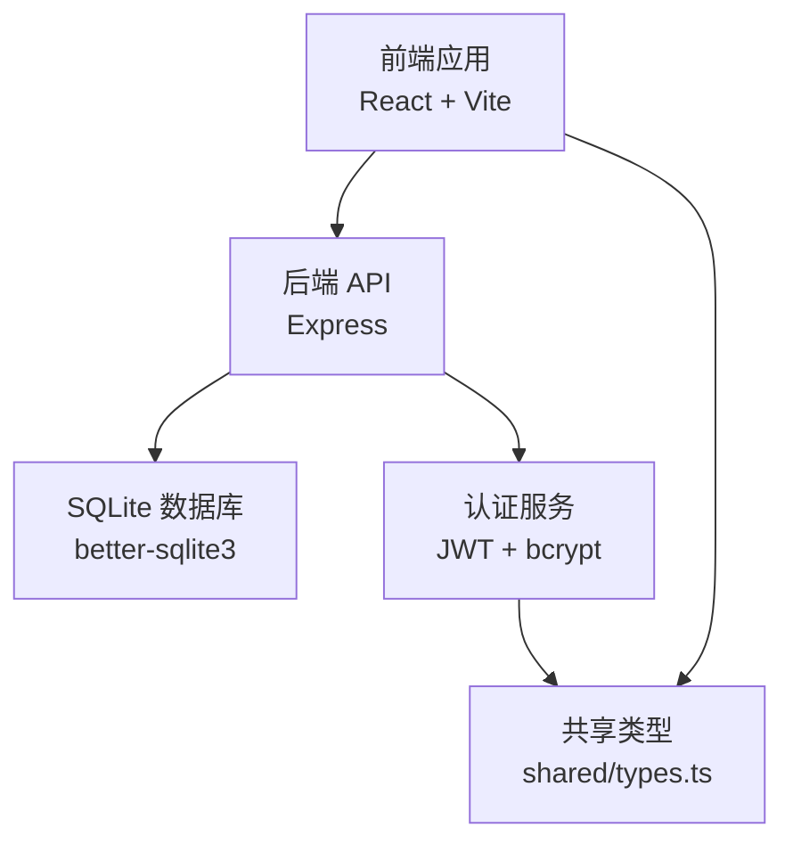
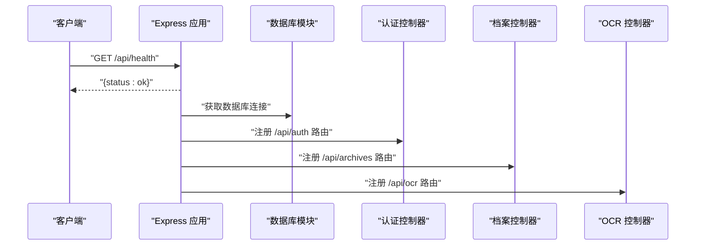
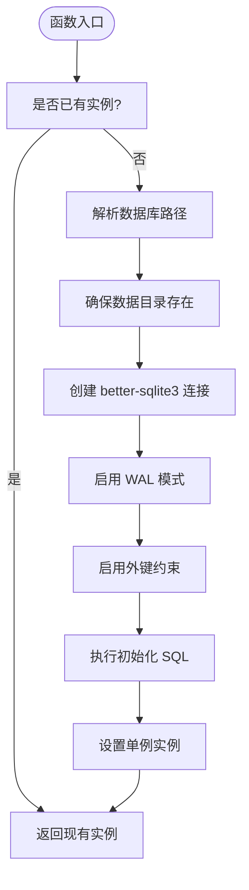
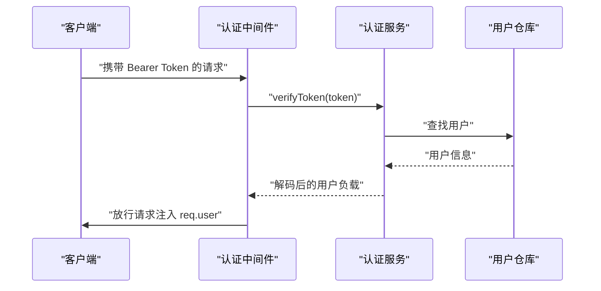
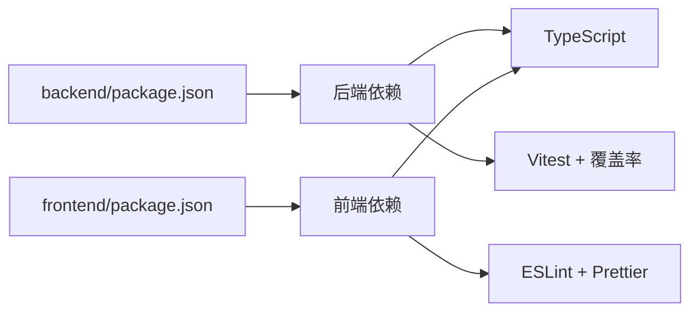

# 开发指南

<cite>
**本文引用的文件**
- [backend/package.json](file://backend/package.json)
- [backend/tsconfig.json](file://backend/tsconfig.json)
- [backend/vitest.config.ts](file://backend/vitest.config.ts)
- [backend/src/index.ts](file://backend/src/index.ts)
- [backend/src/database.ts](file://backend/src/database.ts)
- [backend/src/database-init.ts](file://backend/src/database-init.ts)
- [backend/src/services/AuthService.ts](file://backend/src/services/AuthService.ts)
- [backend/src/controllers/authController.ts](file://backend/src/controllers/authController.ts)
- [backend/src/models/UserRepository.ts](file://backend/src/models/UserRepository.ts)
- [backend/src/middlewares/auth.ts](file://backend/src/middlewares/auth.ts)
- [shared/types.ts](file://shared/types.ts)
- [frontend/package.json](file://frontend/package.json)
- [frontend/eslint.config.js](file://frontend/eslint.config.js)
- [frontend/vite.config.ts](file://frontend/vite.config.ts)
- [frontend/tsconfig.json](file://frontend/tsconfig.json)
- [frontend/src/main.tsx](file://frontend/src/main.tsx)
- [frontend/src/App.tsx](file://frontend/src/App.tsx)
- [start.sh](file://start.sh)
- [start.ps1](file://start.ps1)
</cite>

## 目录
1. [简介](#简介)
2. [项目结构](#项目结构)
3. [核心组件](#核心组件)
4. [架构总览](#架构总览)
5. [详细组件分析](#详细组件分析)
6. [依赖分析](#依赖分析)
7. [性能考虑](#性能考虑)
8. [故障排除指南](#故障排除指南)
9. [结论](#结论)
10. [附录](#附录)

## 简介
本开发指南面向开发团队，提供从环境准备到本地开发、测试、调试、部署前检查的完整流程说明。项目采用前后端分离架构：后端基于 Node.js + TypeScript + Express + better-sqlite3，前端基于 React + TypeScript + Vite，共享类型定义位于 shared 目录。文档涵盖环境搭建、工具链配置、代码规范、调试与性能分析、版本控制与分支策略、代码审查清单以及部署前检查清单。

## 项目结构
项目采用多包结构，包含后端、前端与共享类型三个主要部分：
- backend：后端服务，使用 Express 提供 REST API，better-sqlite3 管理 SQLite 数据库，Vitest 进行单元/集成测试。
- frontend：前端应用，使用 React + TypeScript + Vite，Ant Design 作为 UI 组件库，通过代理访问后端 API。
- shared：前后端共享的类型定义与常量集合。

图表来源
- [backend/src/index.ts:1-39](file://backend/src/index.ts#L1-L39)
- [backend/src/database.ts:1-87](file://backend/src/database.ts#L1-L87)
- [backend/src/database-init.ts:1-65](file://backend/src/database-init.ts#L1-L65)
- [backend/src/services/AuthService.ts:1-126](file://backend/src/services/AuthService.ts#L1-L126)
- [backend/src/controllers/authController.ts:1-77](file://backend/src/controllers/authController.ts#L1-L77)
- [backend/src/models/UserRepository.ts:1-56](file://backend/src/models/UserRepository.ts#L1-L56)
- [backend/src/middlewares/auth.ts:1-56](file://backend/src/middlewares/auth.ts#L1-L56)
- [frontend/vite.config.ts:1-22](file://frontend/vite.config.ts#L1-L22)
- [frontend/eslint.config.js:1-24](file://frontend/eslint.config.js#L1-L24)
- [frontend/tsconfig.json:1-8](file://frontend/tsconfig.json#L1-L8)
- [shared/types.ts:1-289](file://shared/types.ts#L1-L289)

章节来源
- [backend/package.json:1-41](file://backend/package.json#L1-L41)
- [frontend/package.json:1-35](file://frontend/package.json#L1-L35)
- [backend/tsconfig.json:1-25](file://backend/tsconfig.json#L1-L25)
- [frontend/tsconfig.json:1-8](file://frontend/tsconfig.json#L1-L8)

## 核心组件
- 后端入口与健康检查：后端通过 Express 启动，初始化数据库与种子用户，注册认证、档案与 OCR 路由，并提供健康检查端点。
- 数据库模块：使用 better-sqlite3，单例连接，启用 WAL 模式与外键约束，首次访问时执行表结构初始化。
- 认证服务与控制器：提供登录、Token 校验、当前用户信息查询；认证中间件从请求头解析 Bearer Token 并注入用户上下文。
- 共享类型：统一定义用户角色、状态、权限、API 请求/响应等类型，确保前后端一致的数据契约。

章节来源
- [backend/src/index.ts:1-39](file://backend/src/index.ts#L1-L39)
- [backend/src/database.ts:1-87](file://backend/src/database.ts#L1-L87)
- [backend/src/database-init.ts:1-65](file://backend/src/database-init.ts#L1-L65)
- [backend/src/services/AuthService.ts:1-126](file://backend/src/services/AuthService.ts#L1-L126)
- [backend/src/controllers/authController.ts:1-77](file://backend/src/controllers/authController.ts#L1-L77)
- [backend/src/middlewares/auth.ts:1-56](file://backend/src/middlewares/auth.ts#L1-L56)
- [shared/types.ts:1-289](file://shared/types.ts#L1-L289)

## 架构总览
系统采用前后端分离架构，前端通过 Vite 代理访问后端 API。后端以 Express 为核心，配合 better-sqlite3 存储数据，Vitest 负责测试覆盖。共享类型确保前后端数据模型一致。

图表来源
- [frontend/vite.config.ts:14-19](file://frontend/vite.config.ts#L14-L19)
- [backend/src/index.ts:10-26](file://backend/src/index.ts#L10-L26)
- [backend/src/database.ts:25-52](file://backend/src/database.ts#L25-L52)
- [backend/src/services/AuthService.ts:11-125](file://backend/src/services/AuthService.ts#L11-L125)
- [shared/types.ts:1-289](file://shared/types.ts#L1-L289)

## 详细组件分析

### 后端入口与路由注册
- 初始化 Express 应用，启用 CORS 与 JSON 解析。
- 获取数据库连接并执行种子用户初始化，完成后注册认证、档案与 OCR 路由。
- 提供健康检查端点，输出服务状态与测试账号提示。

图表来源
- [backend/src/index.ts:14-36](file://backend/src/index.ts#L14-L36)
- [backend/src/controllers/authController.ts:16-43](file://backend/src/controllers/authController.ts#L16-L43)
- [backend/src/controllers/archiveController.ts:1-200](file://backend/src/controllers/archiveController.ts#L1-L200)
- [backend/src/controllers/ocrController.ts:1-200](file://backend/src/controllers/ocrController.ts#L1-L200)

章节来源
- [backend/src/index.ts:1-39](file://backend/src/index.ts#L1-L39)

### 数据库连接与初始化
- 单例模式管理数据库连接，首次访问时创建目录、启用 WAL 模式与外键约束，并执行初始化 SQL。
- 提供关闭连接与创建独立连接（用于测试）的方法。

图表来源
- [backend/src/database.ts:25-52](file://backend/src/database.ts#L25-L52)
- [backend/src/database-init.ts:8-64](file://backend/src/database-init.ts#L8-L64)

章节来源
- [backend/src/database.ts:1-87](file://backend/src/database.ts#L1-L87)
- [backend/src/database-init.ts:1-65](file://backend/src/database-init.ts#L1-L65)

### 认证服务与中间件
- 认证服务负责登录校验、Token 生成与校验、权限映射与用户信息查询。
- 认证中间件从 Authorization 请求头提取 Bearer Token，校验后将用户信息注入请求上下文。

图表来源
- [backend/src/middlewares/auth.ts:26-55](file://backend/src/middlewares/auth.ts#L26-L55)
- [backend/src/services/AuthService.ts:85-92](file://backend/src/services/AuthService.ts#L85-L92)
- [backend/src/models/UserRepository.ts:39-54](file://backend/src/models/UserRepository.ts#L39-L54)

章节来源
- [backend/src/services/AuthService.ts:1-126](file://backend/src/services/AuthService.ts#L1-L126)
- [backend/src/middlewares/auth.ts:1-56](file://backend/src/middlewares/auth.ts#L1-L56)
- [backend/src/models/UserRepository.ts:1-56](file://backend/src/models/UserRepository.ts#L1-L56)

### 前端应用与代理配置
- 前端通过 Vite 启动，配置了代理将 /api 前缀转发至后端服务。
- 应用入口渲染路由与全局 Provider，使用 Ant Design 组件库。

章节来源
- [frontend/vite.config.ts:1-22](file://frontend/vite.config.ts#L1-L22)
- [frontend/src/main.tsx:1-18](file://frontend/src/main.tsx#L1-L18)
- [frontend/src/App.tsx:1-122](file://frontend/src/App.tsx#L1-L122)

## 依赖分析
- 后端依赖：Express 提供 Web 服务，better-sqlite3 管理 SQLite，bcryptjs 用于密码哈希，jsonwebtoken 用于 JWT，multer 用于文件上传，uuid 生成标识符，xlsx 支持 Excel 导入导出。
- 前端依赖：React + React DOM，Ant Design，Axios 发起 HTTP 请求，React Router 管理路由，Vite 提供构建与开发服务器。
- 测试与类型：Vitest 作为测试框架与覆盖率提供者，TypeScript 提供静态类型检查。

图表来源
- [backend/package.json:14-39](file://backend/package.json#L14-L39)
- [frontend/package.json:12-33](file://frontend/package.json#L12-L33)

章节来源
- [backend/package.json:1-41](file://backend/package.json#L1-L41)
- [frontend/package.json:1-35](file://frontend/package.json#L1-L35)

## 性能考虑
- 数据库性能：启用 WAL 模式提升并发读写性能；为常用查询字段建立索引；避免在热路径上执行复杂查询。
- 服务性能：合理拆分控制器与服务层，避免在中间件中执行重逻辑；对大文件上传使用流式处理与大小限制。
- 前端性能：按需加载组件与页面；减少不必要的重渲染；利用浏览器缓存与资源压缩。
- 测试性能：使用内存数据库进行单元测试；合理划分测试套件，避免重复初始化数据库。

## 故障排除指南
- 启动失败（端口占用）
  - 现象：后端服务无法绑定端口。
  - 处理：修改端口或释放占用端口。
  - 参考：[backend/src/index.ts](file://backend/src/index.ts#L15)
- 数据库连接异常
  - 现象：首次启动时报错或表未创建。
  - 处理：检查数据目录权限与路径；确认初始化 SQL 成功执行。
  - 参考：[backend/src/database.ts:32-52](file://backend/src/database.ts#L32-L52)，[backend/src/database-init.ts:8-64](file://backend/src/database-init.ts#L8-L64)
- 认证失败
  - 现象：登录返回 401 或 Token 校验失败。
  - 处理：确认 JWT_SECRET 设置；检查用户是否存在且密码正确；确认请求头格式为 Bearer Token。
  - 参考：[backend/src/services/AuthService.ts:11-12](file://backend/src/services/AuthService.ts#L11-L12), [backend/src/middlewares/auth.ts:26-55](file://backend/src/middlewares/auth.ts#L26-L55)
- 前端无法访问后端 API
  - 现象：浏览器控制台出现跨域或 404。
  - 处理：确认 Vite 代理配置；确保后端服务已启动；检查路由前缀。
  - 参考：[frontend/vite.config.ts:14-19](file://frontend/vite.config.ts#L14-L19)，[backend/src/index.ts:24-26](file://backend/src/index.ts#L24-L26)
- 测试覆盖率缺失
  - 现象：覆盖率报告为空或不准确。
  - 处理：确认 Vitest 配置中的 include/exclude；确保源文件路径正确。
  - 参考：[backend/vitest.config.ts:14-18](file://backend/vitest.config.ts#L14-L18)

章节来源
- [backend/src/index.ts:14-36](file://backend/src/index.ts#L14-L36)
- [backend/src/database.ts:25-52](file://backend/src/database.ts#L25-L52)
- [backend/src/database-init.ts:8-64](file://backend/src/database-init.ts#L8-L64)
- [backend/src/services/AuthService.ts:11-12](file://backend/src/services/AuthService.ts#L11-L12)
- [backend/src/middlewares/auth.ts:26-55](file://backend/src/middlewares/auth.ts#L26-L55)
- [frontend/vite.config.ts:14-19](file://frontend/vite.config.ts#L14-L19)
- [backend/vitest.config.ts:14-18](file://backend/vitest.config.ts#L14-L18)

## 结论
本指南提供了从环境准备到开发、测试、调试与部署前检查的全流程说明。建议团队严格遵循代码规范与测试要求，结合本指南的调试与故障排除方法，确保项目高质量交付。

## 附录

### 环境搭建步骤
- 安装 Node.js 与 npm（建议使用 LTS 版本）
- 安装依赖
  - 后端：进入 backend 目录，执行依赖安装命令。
  - 前端：进入 frontend 目录，执行依赖安装命令。
- 启动项目
  - 后端：执行开发脚本启动服务。
  - 前端：执行开发脚本启动前端。
  - 一键启动：使用仓库提供的启动脚本。
- 数据库
  - better-sqlite3 自动创建数据库文件与表结构，无需额外初始化步骤。

章节来源
- [backend/package.json:6-12](file://backend/package.json#L6-L12)
- [frontend/package.json:6-11](file://frontend/package.json#L6-L11)
- [start.sh](file://start.sh)
- [start.ps1](file://start.ps1)

### 开发工具链配置
- ESLint（前端）
  - 使用 flat 配置，扩展推荐规则集，启用 React Hooks 与 React Refresh 插件。
  - 参考：[frontend/eslint.config.js:1-24](file://frontend/eslint.config.js#L1-L24)
- Prettier（建议）
  - 在项目根目录新增 Prettier 配置文件，统一缩进、引号与行宽等风格。
  - 与 ESLint 配合，确保保存时自动格式化。
- IDE 设置（VS Code）
  - 安装 TypeScript、ESLint、Prettier 插件。
  - 设置默认 formatter 为 Prettier，保存时自动格式化。
  - 前端启用 ESLint 校验，后端启用 TypeScript 校验。

章节来源
- [frontend/eslint.config.js:1-24](file://frontend/eslint.config.js#L1-L24)

### 代码规范与最佳实践
- 命名约定
  - 类型与接口使用 PascalCase；变量与函数使用 camelCase；常量使用 UPPER_SNAKE_CASE。
  - 文件夹与模块使用小写短横线分隔。
- 注释标准
  - 公开 API 与复杂逻辑需提供清晰注释；使用 JSDoc 风格描述参数与返回值。
- 模块组织
  - 后端按职责划分为 controllers、services、models、middlewares、routes、utils。
  - 前端按功能划分为 pages、components、hooks、store、utils、types。
- 共享类型
  - 所有跨层数据契约集中于 shared/types.ts，保持前后端一致性。

章节来源
- [shared/types.ts:1-289](file://shared/types.ts#L1-L289)

### 调试技巧与性能分析
- 后端
  - 使用 ts-node 直接运行 TypeScript 源码进行调试；开启源码映射以便断点调试。
  - 利用 Vitest 的 watch 模式快速迭代测试。
- 前端
  - 使用 Vite 的热更新能力；在浏览器开发者工具中检查网络与性能面板。
- 性能分析
  - 后端：关注数据库查询与 Token 校验耗时；必要时引入慢查询日志与中间件埋点。
  - 前端：使用 React DevTools 检查重渲染；分析打包体积与懒加载效果。

章节来源
- [backend/package.json](file://backend/package.json#L7)
- [backend/vitest.config.ts:10-13](file://backend/vitest.config.ts#L10-L13)

### 版本控制流程与分支管理策略
- 分支策略
  - main/master：稳定发布分支。
  - develop：日常开发分支。
  - feature/*：新功能开发分支，完成后合并至 develop。
  - hotfix/*：紧急修复分支，直接合并至 main 并打标签发布。
- 提交规范
  - 使用简短明确的提交信息，遵循“类型: 内容”的格式。
- 合并与审查
  - Pull Request 必须通过 CI 与代码审查后合并。

### 代码审查检查清单
- 功能正确性：单元测试与集成测试覆盖关键路径。
- 安全性：输入校验、权限控制、敏感信息保护（如 JWT_SECRET）。
- 可维护性：命名清晰、注释充分、模块职责单一。
- 性能：避免 N+1 查询、合理使用缓存与索引。
- 兼容性：TypeScript 类型完善，前后端共享类型一致。

### 部署前检查清单
- 本地自测
  - 启动后端与前端，验证登录、查询、导入、状态流转等核心功能。
- 代码质量
  - 通过 ESLint 与 TypeScript 类型检查；运行 Vitest 并查看覆盖率。
- 配置检查
  - 确认生产环境变量（如数据库路径、JWT_SECRET、端口）正确。
- 文档更新
  - 更新 README 中的部署与使用说明。

### 常见问题与解决方案
- “找不到模块”或路径别名失效
  - 确认 tsconfig 中的路径映射与实际目录一致。
- “跨域”或 “CORS” 错误
  - 检查后端 CORS 配置与前端代理设置。
- “Token 无效”
  - 确认 JWT_SECRET 设置与前端存储一致；检查 Token 是否过期。