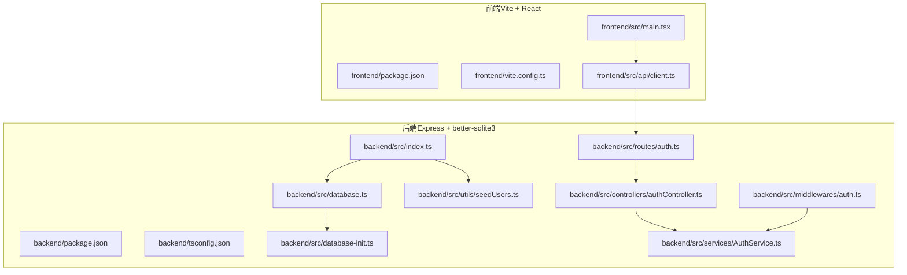
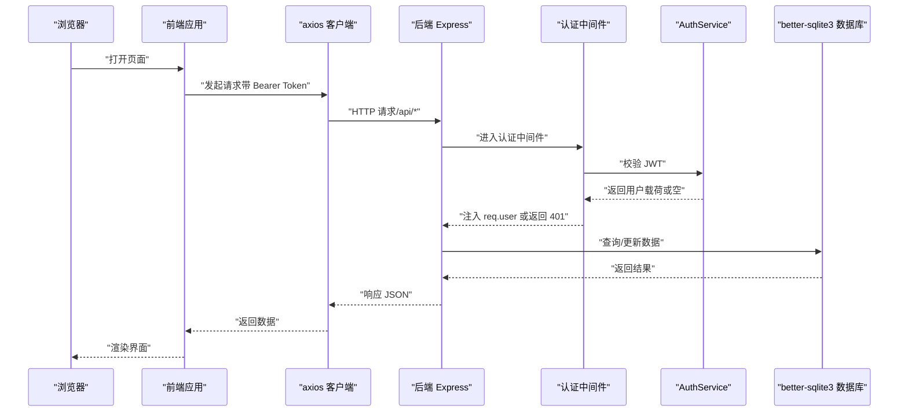
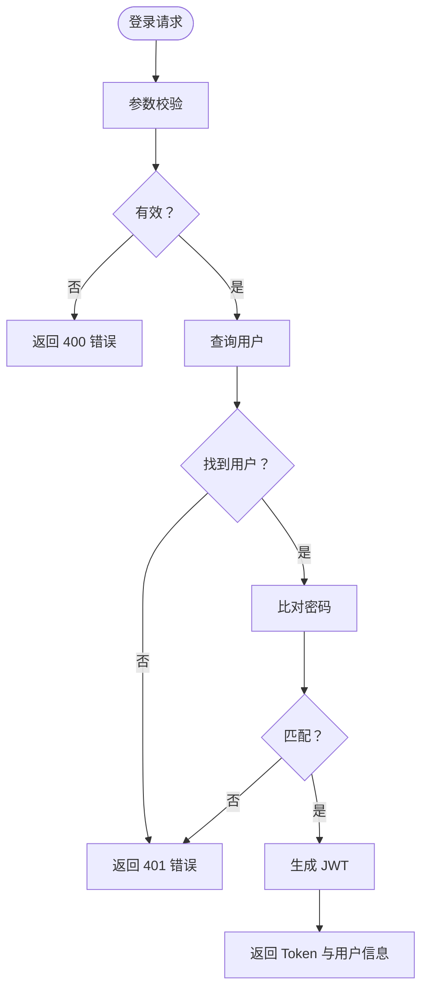
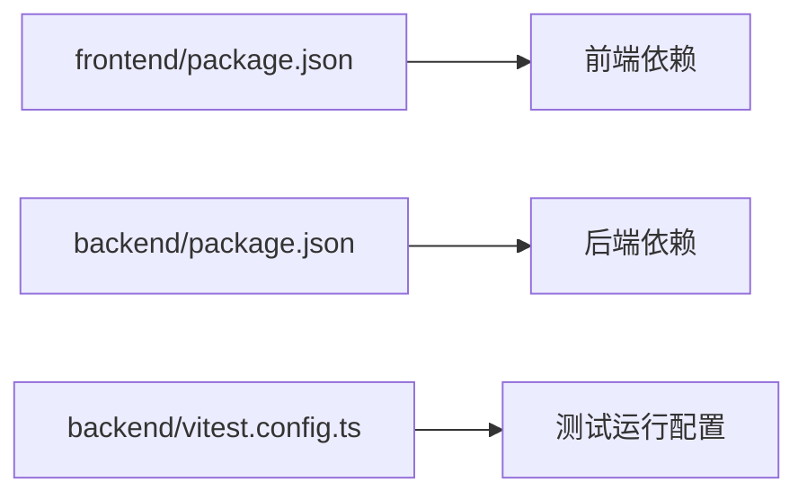

# 构建与部署

<cite>
**本文引用的文件**
- [backend/package.json](file://backend/package.json)
- [backend/tsconfig.json](file://backend/tsconfig.json)
- [backend/vitest.config.ts](file://backend/vitest.config.ts)
- [backend/src/index.ts](file://backend/src/index.ts)
- [backend/src/database.ts](file://backend/src/database.ts)
- [backend/src/database-init.ts](file://backend/src/database-init.ts)
- [backend/src/utils/seedUsers.ts](file://backend/src/utils/seedUsers.ts)
- [backend/src/middlewares/auth.ts](file://backend/src/middlewares/auth.ts)
- [backend/src/services/AuthService.ts](file://backend/src/services/AuthService.ts)
- [backend/src/controllers/authController.ts](file://backend/src/controllers/authController.ts)
- [backend/src/routes/auth.ts](file://backend/src/routes/auth.ts)
- [frontend/package.json](file://frontend/package.json)
- [frontend/vite.config.ts](file://frontend/vite.config.ts)
- [frontend/tsconfig.app.json](file://frontend/tsconfig.app.json)
- [frontend/src/main.tsx](file://frontend/src/main.tsx)
- [frontend/src/api/client.ts](file://frontend/src/api/client.ts)
- [start.sh](file://start.sh)
- [start.ps1](file://start.ps1)
</cite>

## 目录
1. [简介](#简介)
2. [项目结构](#项目结构)
3. [核心组件](#核心组件)
4. [架构总览](#架构总览)
5. [详细组件分析](#详细组件分析)
6. [依赖关系分析](#依赖关系分析)
7. [性能考虑](#性能考虑)
8. [故障排查指南](#故障排查指南)
9. [结论](#结论)
10. [附录](#附录)

## 简介
本指南面向档案管理系统项目的构建与部署，覆盖前后端构建配置与优化、后端编译与打包、生产环境部署与环境变量管理、数据库初始化与迁移、容器化与 Kubernetes 部署、CI/CD 流水线与自动化测试、监控与日志、备份与灾备、以及部署后的验证与回滚机制。内容基于仓库现有配置与实现，确保可操作性与可追溯性。

## 项目结构
项目采用前后端分离架构：
- 前端：基于 Vite + React + TypeScript，使用 Ant Design 与 axios 发起 API 调用，开发代理指向后端。
- 后端：基于 Express + better-sqlite3，TypeScript 编译输出至 dist，内置健康检查与种子用户初始化。
- 共享层：shared/types.ts 定义前后端共享类型（已在相关文件中引用）。

图表来源
- [frontend/src/main.tsx:1-18](file://frontend/src/main.tsx#L1-L18)
- [frontend/src/api/client.ts:1-55](file://frontend/src/api/client.ts#L1-L55)
- [frontend/vite.config.ts:1-22](file://frontend/vite.config.ts#L1-L22)
- [backend/src/index.ts:1-39](file://backend/src/index.ts#L1-L39)
- [backend/src/database.ts:1-87](file://backend/src/database.ts#L1-L87)
- [backend/src/database-init.ts:1-65](file://backend/src/database-init.ts#L1-L65)
- [backend/src/utils/seedUsers.ts:1-20](file://backend/src/utils/seedUsers.ts#L1-L20)
- [backend/src/middlewares/auth.ts:1-56](file://backend/src/middlewares/auth.ts#L1-L56)
- [backend/src/services/AuthService.ts:1-126](file://backend/src/services/AuthService.ts#L1-L126)
- [backend/src/controllers/authController.ts:1-77](file://backend/src/controllers/authController.ts#L1-L77)
- [backend/src/routes/auth.ts:1-19](file://backend/src/routes/auth.ts#L1-L19)

章节来源
- [frontend/package.json:1-35](file://frontend/package.json#L1-L35)
- [frontend/vite.config.ts:1-22](file://frontend/vite.config.ts#L1-L22)
- [backend/package.json:1-41](file://backend/package.json#L1-L41)
- [backend/tsconfig.json:1-25](file://backend/tsconfig.json#L1-L25)
- [backend/src/index.ts:1-39](file://backend/src/index.ts#L1-L39)

## 核心组件
- 前端构建与开发
  - 使用 Vite 进行开发与构建，支持 React 插件与路径别名；开发服务器通过代理将 /api 转发至后端。
  - 生产构建产物位于 frontend/dist，可通过预览命令本地验证。
- 后端构建与运行
  - 使用 TypeScript 编译器输出至 dist；开发模式通过 ts-node 启动；生产模式以 Node.js 运行 dist/index.js。
  - 启动时初始化数据库并插入种子用户，随后注册路由并监听端口。
- 数据库与初始化
  - better-sqlite3 单例连接，WAL 模式与外键约束；首次访问时执行初始化 SQL 并创建索引；提供独立连接函数用于测试。
- 认证与权限
  - 基于 JWT 的认证流程：登录接口返回 Token，后续请求通过认证中间件校验并注入用户信息；权限根据角色映射。

章节来源
- [frontend/vite.config.ts:1-22](file://frontend/vite.config.ts#L1-L22)
- [frontend/package.json:1-35](file://frontend/package.json#L1-L35)
- [backend/package.json:1-41](file://backend/package.json#L1-L41)
- [backend/tsconfig.json:1-25](file://backend/tsconfig.json#L1-L25)
- [backend/src/index.ts:1-39](file://backend/src/index.ts#L1-L39)
- [backend/src/database.ts:1-87](file://backend/src/database.ts#L1-L87)
- [backend/src/database-init.ts:1-65](file://backend/src/database-init.ts#L1-L65)
- [backend/src/utils/seedUsers.ts:1-20](file://backend/src/utils/seedUsers.ts#L1-L20)
- [backend/src/middlewares/auth.ts:1-56](file://backend/src/middlewares/auth.ts#L1-L56)
- [backend/src/services/AuthService.ts:1-126](file://backend/src/services/AuthService.ts#L1-L126)
- [backend/src/controllers/authController.ts:1-77](file://backend/src/controllers/authController.ts#L1-L77)

## 架构总览
下图展示从浏览器到后端服务的整体交互流程，包括认证、路由分发与数据库访问。

图表来源
- [frontend/src/api/client.ts:1-55](file://frontend/src/api/client.ts#L1-L55)
- [backend/src/middlewares/auth.ts:1-56](file://backend/src/middlewares/auth.ts#L1-L56)
- [backend/src/services/AuthService.ts:1-126](file://backend/src/services/AuthService.ts#L1-L126)
- [backend/src/database.ts:1-87](file://backend/src/database.ts#L1-L87)
- [backend/src/index.ts:1-39](file://backend/src/index.ts#L1-L39)

## 详细组件分析

### 前端构建与优化
- 构建脚本
  - 开发：vite 启动本地开发服务器。
  - 构建：先执行 tsc -b 进行类型检查，再执行 vite build 产出静态资源。
  - 预览：vite preview 在本地预览生产构建。
- 路径别名与插件
  - 使用 @shared 指向 shared 目录，便于跨模块复用类型与工具。
  - 使用 @vitejs/plugin-react 提升开发体验。
- 开发代理
  - 将 /api 代理到后端地址，避免跨域问题，便于联调。
- 代码质量
  - 配置 ESLint 与 TypeScript ESlint 规则，保证代码风格与类型安全。

章节来源
- [frontend/package.json:1-35](file://frontend/package.json#L1-L35)
- [frontend/vite.config.ts:1-22](file://frontend/vite.config.ts#L1-L22)
- [frontend/tsconfig.app.json:1-33](file://frontend/tsconfig.app.json#L1-L33)

### 后端编译与打包
- 编译配置
  - 目标版本与模块系统、路径别名、声明文件与 Source Map 均在 tsconfig.json 中定义。
- 构建与运行
  - 构建：tsc 生成 dist。
  - 开发：ts-node 直接运行源码，支持路径别名。
  - 生产：node dist/index.js 启动服务。
- 启动流程
  - 初始化数据库（WAL、外键、表结构与索引），插入种子用户，注册路由，开放 /api/health 健康检查，监听端口。

章节来源
- [backend/package.json:1-41](file://backend/package.json#L1-L41)
- [backend/tsconfig.json:1-25](file://backend/tsconfig.json#L1-L25)
- [backend/src/index.ts:1-39](file://backend/src/index.ts#L1-L39)
- [backend/src/database.ts:1-87](file://backend/src/database.ts#L1-L87)
- [backend/src/database-init.ts:1-65](file://backend/src/database-init.ts#L1-L65)
- [backend/src/utils/seedUsers.ts:1-20](file://backend/src/utils/seedUsers.ts#L1-L20)

### 数据库初始化与迁移
- 初始化脚本
  - 创建 users、archive_records、status_change_logs 表及必要索引；使用 TEXT + CHECK 约束模拟枚举。
- 连接与模式
  - 默认数据库文件路径：backend/data/archive.db；首次访问时创建目录、启用 WAL 与外键约束、执行初始化 SQL。
- 迁移策略建议
  - 由于使用 better-sqlite3 且无专用迁移工具，建议在 INIT_SQL 中直接维护表结构演进；如需版本化，可在启动时检测版本并增量执行变更（当前实现未包含版本表）。

章节来源
- [backend/src/database-init.ts:1-65](file://backend/src/database-init.ts#L1-L65)
- [backend/src/database.ts:1-87](file://backend/src/database.ts#L1-L87)

### 认证与权限
- 登录流程
  - 控制器接收用户名与密码，参数校验后交由 AuthService 校验；成功则签发 JWT 返回给客户端。
- Token 管理
  - 前端通过 axios 拦截器自动注入 Authorization: Bearer；后端认证中间件从请求头解析并校验 Token，失败返回 401。
- 权限模型
  - 不同角色映射不同权限集合；当前实现未在后端显式校验权限，建议在需要鉴权的路由处增加授权中间件。

图表来源
- [backend/src/controllers/authController.ts:1-77](file://backend/src/controllers/authController.ts#L1-L77)
- [backend/src/services/AuthService.ts:1-126](file://backend/src/services/AuthService.ts#L1-L126)
- [backend/src/middlewares/auth.ts:1-56](file://backend/src/middlewares/auth.ts#L1-L56)

章节来源
- [backend/src/controllers/authController.ts:1-77](file://backend/src/controllers/authController.ts#L1-L77)
- [backend/src/services/AuthService.ts:1-126](file://backend/src/services/AuthService.ts#L1-L126)
- [backend/src/middlewares/auth.ts:1-56](file://backend/src/middlewares/auth.ts#L1-L56)

### 前后端联调与开发体验
- 一键启动
  - 提供 start.sh 与 start.ps1，分别在后台与新窗口启动前端与后端，并打印访问地址与测试账号提示。
- 代理配置
  - 前端开发服务器将 /api 代理到后端地址，避免跨域；生产环境需在反向代理或网关统一转发。

章节来源
- [start.sh:1-35](file://start.sh#L1-L35)
- [start.ps1:1-29](file://start.ps1#L1-L29)
- [frontend/vite.config.ts:1-22](file://frontend/vite.config.ts#L1-L22)

## 依赖关系分析
- 前端
  - 依赖 axios、react、react-router-dom、antd 等；开发依赖 vite、@vitejs/plugin-react、ESLint 等。
- 后端
  - 依赖 express、better-sqlite3、bcryptjs、jsonwebtoken、multer、uuid、xlsx 等；开发依赖 ts-node、vitest、typescript 等。
- 测试
  - Vitest 配置启用全局测试、覆盖率统计范围与别名解析，测试文件位于 tests/**/*.test.ts。

图表来源
- [frontend/package.json:1-35](file://frontend/package.json#L1-L35)
- [backend/package.json:1-41](file://backend/package.json#L1-L41)
- [backend/vitest.config.ts:1-21](file://backend/vitest.config.ts#L1-L21)

章节来源
- [frontend/package.json:1-35](file://frontend/package.json#L1-L35)
- [backend/package.json:1-41](file://backend/package.json#L1-L41)
- [backend/vitest.config.ts:1-21](file://backend/vitest.config.ts#L1-L21)

## 性能考虑
- 数据库
  - WAL 模式提升并发读写性能；外键约束保障一致性；合理索引（主键与常用查询字段）有助于查询效率。
- 后端
  - 使用单例数据库连接减少开销；路由与中间件尽量保持无状态；避免在中间件中做重计算。
- 前端
  - 生产构建开启压缩与 Tree-shaking；避免不必要的全局样式与第三方包体积；路由懒加载与组件拆分降低首屏负担。

## 故障排查指南
- 启动失败
  - 检查端口占用与数据库目录权限；确认 backend/data 存在且可写；查看后端控制台输出。
- 认证失败
  - 确认前端是否正确存储与注入 Token；后端 JWT_SECRET 是否设置；Token 是否过期。
- 数据库异常
  - 确认 INIT_SQL 已执行；表结构与索引是否存在；WAL 与外键是否启用。
- 跨域与代理
  - 前端开发代理是否指向正确后端地址；生产环境是否在网关统一转发 /api。

章节来源
- [backend/src/index.ts:1-39](file://backend/src/index.ts#L1-L39)
- [backend/src/database.ts:1-87](file://backend/src/database.ts#L1-L87)
- [frontend/vite.config.ts:1-22](file://frontend/vite.config.ts#L1-L22)
- [frontend/src/api/client.ts:1-55](file://frontend/src/api/client.ts#L1-L55)

## 结论
本指南基于仓库现有配置，给出了从构建到部署的完整实践路径。建议在现有基础上补充容器化与 Kubernetes 配置、CI/CD 流水线、监控与日志、备份与灾备以及回滚机制，以满足生产级要求。

## 附录

### 生产环境部署与环境变量
- 后端环境变量
  - PORT：服务监听端口（默认值见启动脚本）。
  - JWT_SECRET：JWT 密钥（必须强口令，建议密文注入）。
- 前端环境变量
  - 通常无需额外变量；如需切换后端地址，可在构建时替换 baseURL 或通过反向代理统一转发。
- 数据库位置
  - 默认 backend/data/archive.db；生产建议挂载持久卷并配置只读快照策略。

章节来源
- [backend/src/index.ts:1-39](file://backend/src/index.ts#L1-L39)
- [backend/src/services/AuthService.ts:1-126](file://backend/src/services/AuthService.ts#L1-L126)
- [backend/src/database.ts:1-87](file://backend/src/database.ts#L1-L87)

### 数据库迁移与初始化
- 当前实现
  - 启动时执行 INIT_SQL 初始化表结构与索引；种子用户通过 seedUsers 插入。
- 建议
  - 如需版本化迁移，可在启动时检测版本并执行增量 SQL；或引入迁移工具（需评估与 better-sqlite3 的兼容性）。

章节来源
- [backend/src/database-init.ts:1-65](file://backend/src/database-init.ts#L1-L65)
- [backend/src/utils/seedUsers.ts:1-20](file://backend/src/utils/seedUsers.ts#L1-L20)

### Docker 容器化与 Kubernetes 配置
- 容器镜像建议
  - 基础镜像：官方 Node.js LTS 作为运行时；官方 Nginx 或 Alpine 作为静态资源服务。
  - 构建步骤：安装依赖 → 编译后端 → 构建前端 → 复制 dist 至静态服务目录。
  - 入口：后端启动命令（生产模式）；静态资源由 Nginx 提供。
- Kubernetes 部署要点
  - Deployment：副本数、探针（liveness/readiness）、资源限制。
  - Service：ClusterIP/LoadBalancer，暴露后端端口。
  - ConfigMap/Secret：存放 JWT_SECRET、数据库连接等敏感配置。
  - PersistentVolume：挂载 backend/data 以持久化数据库文件。
  - Ingress：统一入口与 TLS 终止，转发 /api 到后端服务。
- 注意事项
  - 避免在容器内以 root 运行；最小权限原则；健康检查与就绪检查配置合理超时。

### CI/CD 流水线与自动化测试
- 构建阶段
  - 前端：安装依赖 → 类型检查 → 构建 → 产物归档。
  - 后端：安装依赖 → 类型检查 → 构建 → 产物归档。
- 测试阶段
  - 运行单元/集成测试，生成覆盖率报告；失败即中断流水线。
- 安全扫描
  - 依赖漏洞扫描（npm audit/snyk/dependabot）；代码安全扫描（ESLint、SonarQube）。
- 部署阶段
  - 推送镜像至镜像仓库；Kubernetes 应用发布；滚动更新与回滚策略。
- 回滚机制
  - 通过 kubectl rollout undo 或 Helm rollback 快速回退至上一版本。

### 监控与日志
- 日志
  - 后端：标准输出记录启动信息与错误；建议接入结构化日志（JSON）与日志聚合（如 ELK/Fluent Bit）。
  - 前端：浏览器控制台与网络面板定位问题；生产环境上报错误（如 Sentry）。
- 指标
  - HTTP 请求量、延迟、错误率；数据库连接数与慢查询；容器资源使用情况。
- 告警
  - 基于阈值触发告警；结合 SLI/SLO 设定目标。

### 备份策略与灾难恢复
- 备份
  - 数据库文件定期快照（WAL 文件需一致备份）；备份保留周期与轮转策略。
  - 配置与密钥集中管理，纳入版本控制或密钥管理服务。
- 恢复
  - RTO/RPO 明确；演练恢复流程；多可用区部署与异地容灾。

### 部署后验证与回滚
- 验证
  - 健康检查：/api/health；登录接口连通性；关键业务接口（如查询、导入）。
  - 端到端测试：自动化冒烟测试覆盖核心流程。
- 回滚
  - 通过滚动更新回滚至上一稳定版本；若镜像层不可回滚，使用配置回滚与数据库回滚相结合。