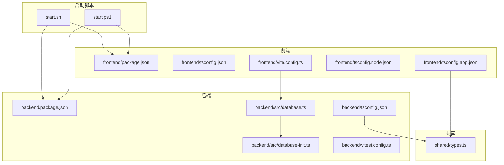
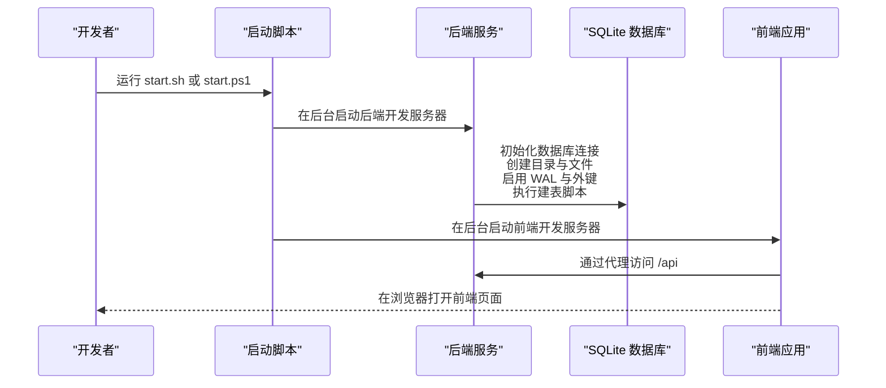
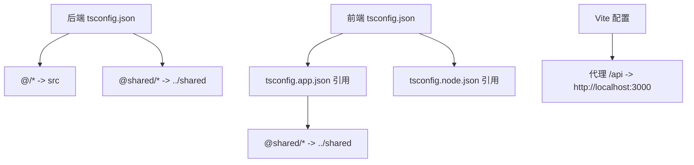
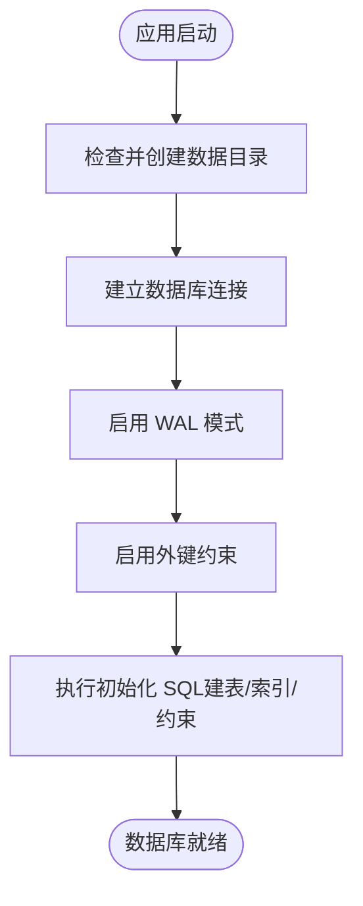
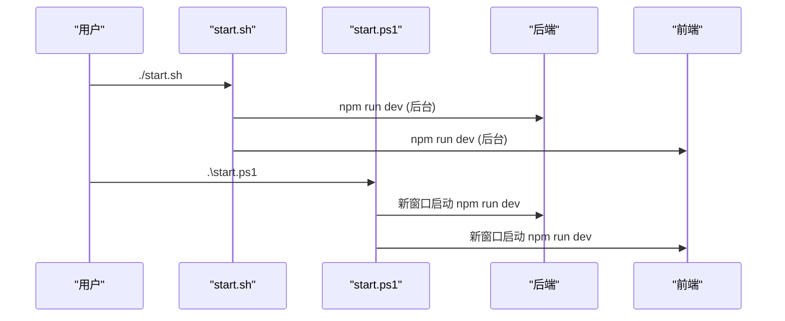
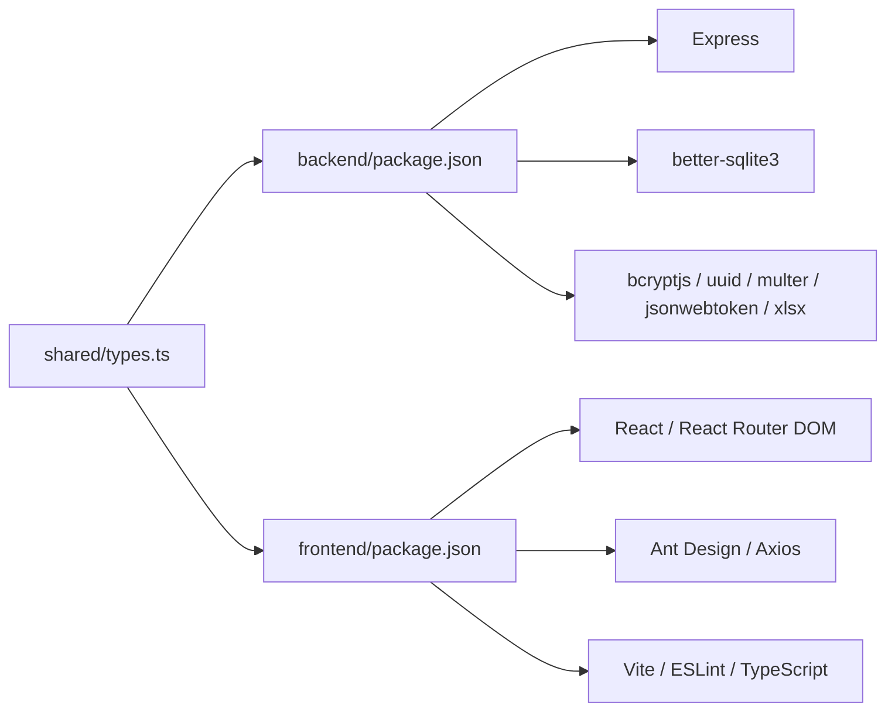

# 环境搭建

<cite>
**本文引用的文件**
- [backend/package.json](file://backend/package.json)
- [frontend/package.json](file://frontend/package.json)
- [backend/tsconfig.json](file://backend/tsconfig.json)
- [frontend/tsconfig.json](file://frontend/tsconfig.json)
- [frontend/tsconfig.app.json](file://frontend/tsconfig.app.json)
- [frontend/tsconfig.node.json](file://frontend/tsconfig.node.json)
- [backend/vitest.config.ts](file://backend/vitest.config.ts)
- [backend/src/database.ts](file://backend/src/database.ts)
- [backend/src/database-init.ts](file://backend/src/database-init.ts)
- [backend/src/utils/seedUsers.ts](file://backend/src/utils/seedUsers.ts)
- [frontend/vite.config.ts](file://frontend/vite.config.ts)
- [start.sh](file://start.sh)
- [start.ps1](file://start.ps1)
</cite>

## 目录
1. [简介](#简介)
2. [项目结构](#项目结构)
3. [核心组件](#核心组件)
4. [架构总览](#架构总览)
5. [详细组件分析](#详细组件分析)
6. [依赖关系分析](#依赖关系分析)
7. [性能考虑](#性能考虑)
8. [故障排查指南](#故障排查指南)
9. [结论](#结论)
10. [附录](#附录)

## 简介
本指南面向新加入的开发成员，帮助你在本地快速搭建完整的开发环境，涵盖以下内容：
- Node.js 版本要求与安装（含 nvm 使用建议）
- TypeScript 编译配置与路径别名设置
- SQLite 数据库安装与配置（better-sqlite3）
- 包管理器选择与使用（npm/yarn/pnpm）
- 跨平台一键启动脚本（Windows PowerShell 与 Linux/macOS Shell）
- 环境变量与数据库初始化步骤
- 常见环境问题排查与解决方案

## 项目结构
该项目采用前后端分离架构，分别位于 backend 与 frontend 目录，共享类型定义位于 shared/types.ts。根目录提供跨平台启动脚本，一键同时启动后端（端口 3000）与前端（端口 5173）。

图表来源
- [backend/package.json:1-41](file://backend/package.json#L1-L41)
- [frontend/package.json:1-35](file://frontend/package.json#L1-L35)
- [backend/tsconfig.json:1-25](file://backend/tsconfig.json#L1-L25)
- [frontend/tsconfig.json:1-8](file://frontend/tsconfig.json#L1-L8)
- [frontend/tsconfig.app.json:1-33](file://frontend/tsconfig.app.json#L1-L33)
- [frontend/tsconfig.node.json:1-27](file://frontend/tsconfig.node.json#L1-L27)
- [backend/vitest.config.ts:1-21](file://backend/vitest.config.ts#L1-L21)
- [backend/src/database.ts:1-87](file://backend/src/database.ts#L1-L87)
- [backend/src/database-init.ts:1-65](file://backend/src/database-init.ts#L1-L65)
- [frontend/vite.config.ts:1-22](file://frontend/vite.config.ts#L1-L22)
- [start.sh:1-35](file://start.sh#L1-L35)
- [start.ps1:1-29](file://start.ps1#L1-L29)

章节来源
- [backend/package.json:1-41](file://backend/package.json#L1-L41)
- [frontend/package.json:1-35](file://frontend/package.json#L1-L35)
- [backend/tsconfig.json:1-25](file://backend/tsconfig.json#L1-L25)
- [frontend/tsconfig.json:1-8](file://frontend/tsconfig.json#L1-L8)
- [frontend/tsconfig.app.json:1-33](file://frontend/tsconfig.app.json#L1-L33)
- [frontend/tsconfig.node.json:1-27](file://frontend/tsconfig.node.json#L1-L27)
- [backend/vitest.config.ts:1-21](file://backend/vitest.config.ts#L1-L21)
- [backend/src/database.ts:1-87](file://backend/src/database.ts#L1-L87)
- [backend/src/database-init.ts:1-65](file://backend/src/database-init.ts#L1-L65)
- [frontend/vite.config.ts:1-22](file://frontend/vite.config.ts#L1-L22)
- [start.sh:1-35](file://start.sh#L1-L35)
- [start.ps1:1-29](file://start.ps1#L1-L29)

## 核心组件
- 后端技术栈：Node.js + Express + better-sqlite3 + TypeScript + Vitest
- 前端技术栈：React + TypeScript + Vite + Ant Design
- 数据库：SQLite（通过 better-sqlite3 访问），默认数据文件位于 backend/data/archive.db
- 路径别名：后端使用 @/* 与 @shared/*；前端使用 @shared/*
- 测试框架：Vitest，覆盖范围与别名配置在 vitest.config.ts 中

章节来源
- [backend/package.json:14-39](file://backend/package.json#L14-L39)
- [frontend/package.json:12-33](file://frontend/package.json#L12-L33)
- [backend/tsconfig.json:17-20](file://backend/tsconfig.json#L17-L20)
- [frontend/tsconfig.app.json:27-29](file://frontend/tsconfig.app.json#L27-L29)
- [backend/vitest.config.ts:5-9](file://backend/vitest.config.ts#L5-L9)

## 架构总览
下图展示从启动脚本到后端数据库初始化与前端代理的整体流程。

图表来源
- [start.sh:7-17](file://start.sh#L7-L17)
- [start.ps1:10-17](file://start.ps1#L10-L17)
- [backend/src/database.ts:25-52](file://backend/src/database.ts#L25-L52)
- [backend/src/database-init.ts:8-64](file://backend/src/database-init.ts#L8-L64)
- [frontend/vite.config.ts:14-20](file://frontend/vite.config.ts#L14-L20)

## 详细组件分析

### Node.js 与包管理器
- Node.js 版本要求
  - 后端与前端均声明了对高版本 Node 的支持，建议使用长期支持（LTS）版本以获得最佳兼容性与稳定性。
- 包管理器选择
  - 项目脚本统一使用 npm（如 scripts 中的 npm run dev）。你可以根据团队约定选择 npm、yarn 或 pnpm。
  - 若使用 yarn/pnpm，请确保其安装命令与 npm 对应脚本一致（例如 dev/build/test 等）。
- 安装与运行步骤
  - 在 backend 与 frontend 目录分别执行安装命令，然后使用对应包管理器的 dev 脚本启动服务。
  - 也可直接使用根目录提供的跨平台启动脚本一键启动。

章节来源
- [backend/package.json:6-12](file://backend/package.json#L6-L12)
- [frontend/package.json:6-11](file://frontend/package.json#L6-L11)
- [start.sh:8-17](file://start.sh#L8-L17)
- [start.ps1:10-17](file://start.ps1#L10-L17)

### TypeScript 编译配置与路径别名
- 后端
  - 基础配置：目标语言、模块系统、输出目录、严格模式、路径映射等。
  - 路径别名：@/* 指向 src，@shared/* 指向 ../shared。
  - 测试别名：Vitest 别名与后端保持一致，确保测试可解析共享路径。
- 前端
  - 多 tsconfig：通过 tsconfig.json 引用 app 与 node 两个配置文件。
  - app 配置：Bundler 模式、React JSX、严格模式、路径别名 @shared/*。
  - node 配置：Bundler 模式、Node 类型、严格模式。
  - Vite 配置：路径别名 @shared/*，开发服务器代理 /api 到后端 3000 端口。

图表来源
- [backend/tsconfig.json:17-20](file://backend/tsconfig.json#L17-L20)
- [backend/vitest.config.ts:5-9](file://backend/vitest.config.ts#L5-L9)
- [frontend/tsconfig.json:3-6](file://frontend/tsconfig.json#L3-L6)
- [frontend/tsconfig.app.json:27-29](file://frontend/tsconfig.app.json#L27-L29)
- [frontend/vite.config.ts:8-20](file://frontend/vite.config.ts#L8-L20)

章节来源
- [backend/tsconfig.json:1-25](file://backend/tsconfig.json#L1-L25)
- [backend/vitest.config.ts:1-21](file://backend/vitest.config.ts#L1-L21)
- [frontend/tsconfig.json:1-8](file://frontend/tsconfig.json#L1-L8)
- [frontend/tsconfig.app.json:1-33](file://frontend/tsconfig.app.json#L1-L33)
- [frontend/tsconfig.node.json:1-27](file://frontend/tsconfig.node.json#L1-L27)
- [frontend/vite.config.ts:1-22](file://frontend/vite.config.ts#L1-L22)

### SQLite 数据库安装与配置
- 组件与驱动
  - 使用 better-sqlite3 作为 SQLite 驱动，无需额外数据库服务，开箱即用。
- 默认数据库位置
  - 数据库文件默认位于 backend/data/archive.db；首次连接会自动创建目录与文件。
- 初始化流程
  - 启动时自动启用 WAL 模式与外键约束，并执行建表脚本（包含索引与约束）。
- 内存数据库（测试）
  - 提供独立连接函数，支持传入 ':memory:' 使用内存数据库进行测试隔离。

图表来源
- [backend/src/database.ts:25-52](file://backend/src/database.ts#L25-L52)
- [backend/src/database-init.ts:8-64](file://backend/src/database-init.ts#L8-L64)

章节来源
- [backend/src/database.ts:1-87](file://backend/src/database.ts#L1-L87)
- [backend/src/database-init.ts:1-65](file://backend/src/database-init.ts#L1-L65)

### 环境变量与数据库初始化步骤
- 环境变量
  - 项目未显式定义后端环境变量；如需扩展，可在后端入口或配置中添加。
- 数据库初始化
  - 首次启动后端时，数据库文件与表结构会自动创建。
  - 如需手动插入示例用户，可参考种子脚本逻辑（使用 bcrypt 哈希与 UUID 插入）。

章节来源
- [backend/src/database.ts:13-52](file://backend/src/database.ts#L13-L52)
- [backend/src/utils/seedUsers.ts:1-20](file://backend/src/utils/seedUsers.ts#L1-L20)

### 跨平台启动脚本
- Linux/macOS
  - 使用 bash 脚本，后台启动后端与前端，打印访问地址与测试账号信息，支持 Ctrl+C 统一停止。
- Windows
  - 使用 PowerShell 脚本，在新控制台窗口分别启动后端与前端，打印访问地址与测试账号信息。

图表来源
- [start.sh:1-35](file://start.sh#L1-L35)
- [start.ps1:1-29](file://start.ps1#L1-L29)

章节来源
- [start.sh:1-35](file://start.sh#L1-L35)
- [start.ps1:1-29](file://start.ps1#L1-L29)

## 依赖关系分析
- 后端依赖
  - Web 框架：Express
  - 数据库：better-sqlite3
  - 工具：bcryptjs、uuid、multer、jsonwebtoken、xlsx
  - 开发工具：TypeScript、ts-node、tsconfig-paths、Vitest、@vitest/coverage-v8
- 前端依赖
  - 框架：React、React Router DOM
  - 工具：Ant Design、Axios、Vite、ESLint、TypeScript
- 共享类型
  - shared/types.ts 由前后端共同引用，确保类型一致性。

图表来源
- [backend/package.json:14-39](file://backend/package.json#L14-L39)
- [frontend/package.json:12-33](file://frontend/package.json#L12-L33)

章节来源
- [backend/package.json:1-41](file://backend/package.json#L1-L41)
- [frontend/package.json:1-35](file://frontend/package.json#L1-L35)

## 性能考虑
- 数据库
  - 启用 WAL 模式提升并发读写性能；外键约束保证数据一致性。
- 编译与构建
  - 前端使用 Vite 快速冷启动与热更新；后端使用 ts-node 开发调试。
- 测试覆盖率
  - Vitest 配置包含覆盖率统计，建议在 CI 中开启并设定阈值。

章节来源
- [backend/src/database.ts:42-45](file://backend/src/database.ts#L42-L45)
- [backend/vitest.config.ts:14-18](file://backend/vitest.config.ts#L14-L18)

## 故障排查指南
- 启动脚本无法找到命令
  - 确认已安装 Node.js 与所选包管理器（npm/yarn/pnpm），并将它们加入 PATH。
- 后端端口被占用
  - 修改后端监听端口或释放 3000 端口占用。
- 前端代理失败
  - 确认后端已在 3000 端口运行；检查 Vite 代理配置是否正确指向后端。
- 数据库文件权限问题
  - 确保 backend/data 目录可读写；若权限不足，手动创建目录并赋予写权限。
- 路径别名导入失败
  - 确认 TypeScript 配置中的 baseUrl 与 paths 正确；重启编辑器以刷新 TS 服务。
- 测试无法识别别名
  - 确认 Vitest 别名与项目配置一致；检查 include/exclude 覆盖范围。
- Windows 控制台乱码
  - 使用提供的 PowerShell 脚本，脚本内已设置 UTF-8 输出编码。

章节来源
- [frontend/vite.config.ts:14-20](file://frontend/vite.config.ts#L14-L20)
- [backend/src/database.ts:32-36](file://backend/src/database.ts#L32-L36)
- [backend/vitest.config.ts:5-9](file://backend/vitest.config.ts#L5-L9)
- [start.ps1:1-4](file://start.ps1#L1-L4)

## 结论
按照本指南完成 Node.js、包管理器、TypeScript、SQLite 与启动脚本的配置后，你将能够在本地快速启动并运行完整的档案管理系统。遇到问题时，可依据“故障排查指南”逐项定位与解决。建议团队统一包管理器与 Node 版本，确保开发环境一致性。

## 附录
- 一键启动
  - Linux/macOS：./start.sh
  - Windows：.\start.ps1
- 访问地址
  - 前端：http://localhost:5173
  - 后端：http://localhost:3000
- 测试账号（密码均为 123456）
  - operator（运营人员）
  - branch（分支机构，上海营业部）
  - general（综合部）

章节来源
- [start.sh:21-28](file://start.sh#L21-L28)
- [start.ps1:20-27](file://start.ps1#L20-L27)