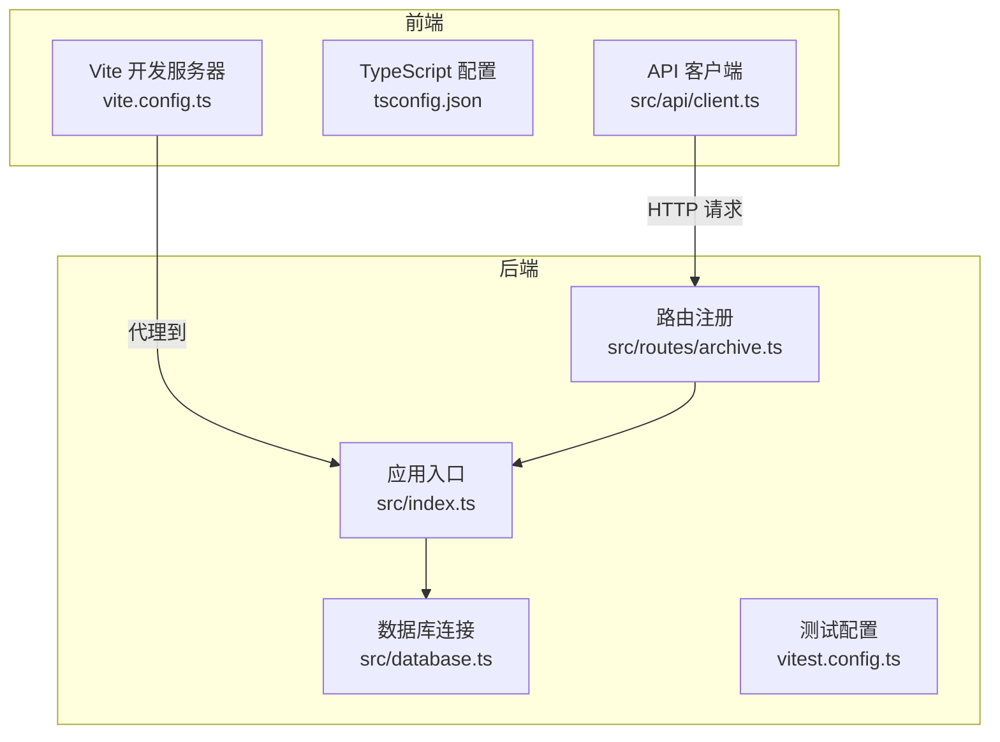
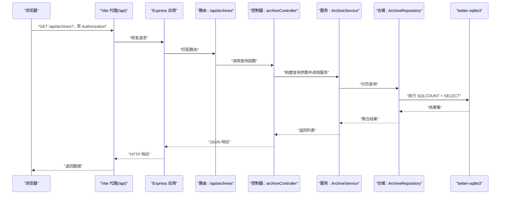
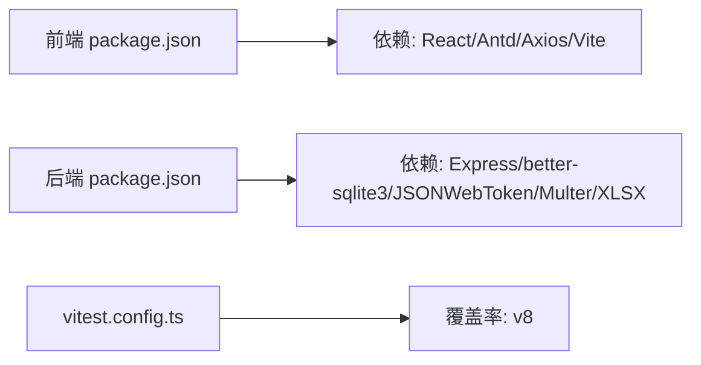

# 调试与开发工具

<cite>
**本文引用的文件**
- [vite.config.ts](file://frontend/vite.config.ts)
- [package.json](file://frontend/package.json)
- [tsconfig.json](file://frontend/tsconfig.json)
- [client.ts](file://frontend/src/api/client.ts)
- [vitest.config.ts](file://backend/vitest.config.ts)
- [package.json](file://backend/package.json)
- [tsconfig.json](file://backend/tsconfig.json)
- [index.ts](file://backend/src/index.ts)
- [database.ts](file://backend/src/database.ts)
- [seedUsers.ts](file://backend/src/utils/seedUsers.ts)
- [archive.ts](file://backend/src/routes/archive.ts)
- [archiveController.ts](file://backend/src/controllers/archiveController.ts)
- [ArchiveService.ts](file://backend/src/services/ArchiveService.ts)
- [ArchiveRepository.ts](file://backend/src/models/ArchiveRepository.ts)
- [setup.test.ts](file://backend/tests/unit/setup.test.ts)
</cite>

## 目录
1. [简介](#简介)
2. [项目结构](#项目结构)
3. [核心组件](#核心组件)
4. [架构总览](#架构总览)
5. [详细组件分析](#详细组件分析)
6. [依赖关系分析](#依赖关系分析)
7. [性能考虑](#性能考虑)
8. [故障排查指南](#故障排查指南)
9. [结论](#结论)
10. [附录](#附录)

## 简介
本指南面向开发与调试场景，围绕以下主题提供系统化方法：
- Vite 开发服务器配置与热重载机制
- VS Code 调试配置与断点设置
- Postman API 测试与 Mock 数据准备
- 数据库调试与查询优化技巧
- 性能分析工具使用（Chrome DevTools、Node.js profiler）
- 日志记录与错误追踪最佳实践
- 单元测试调试与覆盖率分析
- 常见开发问题的诊断与解决策略

## 项目结构
前端采用 Vite + React，后端采用 Express + better-sqlite3；通过代理将前端请求转发至后端服务。测试使用 Vitest，覆盖率使用 v8 提供商。

图表来源
- [vite.config.ts:1-22](file://frontend/vite.config.ts#L1-L22)
- [tsconfig.json:1-8](file://frontend/tsconfig.json#L1-L8)
- [client.ts:1-55](file://frontend/src/api/client.ts#L1-L55)
- [index.ts:1-39](file://backend/src/index.ts#L1-L39)
- [archive.ts:1-42](file://backend/src/routes/archive.ts#L1-L42)
- [database.ts:1-87](file://backend/src/database.ts#L1-L87)
- [vitest.config.ts:1-21](file://backend/vitest.config.ts#L1-L21)

章节来源
- [vite.config.ts:1-22](file://frontend/vite.config.ts#L1-L22)
- [package.json:1-35](file://frontend/package.json#L1-L35)
- [tsconfig.json:1-8](file://frontend/tsconfig.json#L1-L8)
- [client.ts:1-55](file://frontend/src/api/client.ts#L1-L55)
- [vitest.config.ts:1-21](file://backend/vitest.config.ts#L1-L21)
- [package.json:1-41](file://backend/package.json#L1-L41)
- [tsconfig.json:1-25](file://backend/tsconfig.json#L1-L25)
- [index.ts:1-39](file://backend/src/index.ts#L1-L39)
- [archive.ts:1-42](file://backend/src/routes/archive.ts#L1-L42)
- [database.ts:1-87](file://backend/src/database.ts#L1-L87)

## 核心组件
- 前端开发服务器：Vite 提供快速热重载与代理能力，便于联调后端接口。
- 后端应用入口：Express 应用初始化 CORS、JSON 解析、数据库与种子用户、路由注册与健康检查。
- 数据库模块：better-sqlite3 连接管理，WAL 模式与外键约束启用，初始化 SQL 执行。
- API 客户端：统一 axios 实例，自动注入 Authorization 头，集中处理 401 等错误。
- 测试配置：Vitest 全局启用、别名配置、覆盖率统计范围与排除规则。

章节来源
- [vite.config.ts:1-22](file://frontend/vite.config.ts#L1-L22)
- [index.ts:1-39](file://backend/src/index.ts#L1-L39)
- [database.ts:1-87](file://backend/src/database.ts#L1-L87)
- [client.ts:1-55](file://frontend/src/api/client.ts#L1-L55)
- [vitest.config.ts:1-21](file://backend/vitest.config.ts#L1-L21)

## 架构总览
前后端交互链路：浏览器 → Vite 代理 → Express 路由 → 控制器 → 服务层 → 数据访问层 → better-sqlite3。

图表来源
- [vite.config.ts:13-20](file://frontend/vite.config.ts#L13-L20)
- [client.ts:6-8](file://frontend/src/api/client.ts#L6-L8)
- [archive.ts:17-18](file://backend/src/routes/archive.ts#L17-L18)
- [archiveController.ts:99-147](file://backend/src/controllers/archiveController.ts#L99-L147)
- [ArchiveService.ts:33-69](file://backend/src/services/ArchiveService.ts#L33-L69)
- [ArchiveRepository.ts:228-305](file://backend/src/models/ArchiveRepository.ts#L228-L305)
- [database.ts:25-52](file://backend/src/database.ts#L25-L52)

## 详细组件分析

### Vite 开发服务器与热重载
- 插件与别名：React 插件与路径别名，提升开发体验。
- 代理配置：将 /api 前缀转发至后端服务地址，避免跨域并简化联调。
- 热重载机制：Vite 基于 ES 模块与原生 ESM，无需额外配置即可实现模块级热替换。

建议调试要点
- 在浏览器网络面板观察 /api 请求是否被代理命中。
- 修改前端组件后，确认页面即时刷新且状态未丢失（结合路由与状态管理）。
- 若代理失效，检查目标地址与 changeOrigin 配置。

章节来源
- [vite.config.ts:1-22](file://frontend/vite.config.ts#L1-L22)
- [package.json:6-11](file://frontend/package.json#L6-L11)

### VS Code 调试配置与断点
- 后端调试：使用 Node 调试器附加到 ts-node 进程，启用 tsconfig-paths 以便正确解析别名。
- 前端调试：在浏览器中打开开发者工具，设置断点于组件渲染或 API 调用处。
- 调试脚本：后端提供 dev 脚本，前端使用 Vite dev 脚本。

调试步骤
- 后端：启动后端 dev 脚本，VS Code Attach 到进程，断点设在控制器或服务层。
- 前端：启动前端 dev，打开浏览器开发者工具，断点设在组件生命周期或 API 客户端拦截器。
- 联动调试：先断前端请求拦截器，再断后端路由处理函数，观察请求体与响应体。

章节来源
- [package.json:7-7](file://backend/package.json#L7-L7)
- [package.json:7-11](file://frontend/package.json#L7-L11)

### Postman API 测试与 Mock 数据准备
- 认证流程：先调用登录接口获取令牌，保存到环境变量；随后在请求头注入 Authorization。
- Mock 数据：使用种子用户脚本初始化数据库，确保测试账号可用。
- 接口覆盖：使用路由定义中的端点进行测试（查询、导入模板、导入、状态流转等）。

章节来源
- [seedUsers.ts:5-9](file://backend/src/utils/seedUsers.ts#L5-L9)
- [archive.ts:17-39](file://backend/src/routes/archive.ts#L17-L39)
- [client.ts:10-17](file://frontend/src/api/client.ts#L10-L17)

### 数据库调试与查询优化
- 连接与初始化：首次连接创建数据库文件、启用 WAL 与外键约束、执行初始化 SQL。
- 查询优化要点：
  - 分页查询使用 COUNT + LIMIT/OFFSET，注意索引缺失会导致慢查询。
  - 多条件组合查询建议对常用过滤字段建立索引（如资金账号、营业部、状态）。
  - 使用事务批量导入，减少提交次数。
- 调试技巧：开启 WAL 模式提升并发读写；通过日志输出 SQL 语句与耗时；必要时使用内存数据库进行隔离测试。

章节来源
- [database.ts:25-52](file://backend/src/database.ts#L25-L52)
- [ArchiveRepository.ts:228-305](file://backend/src/models/ArchiveRepository.ts#L228-L305)

### 性能分析工具使用
- Chrome DevTools：分析前端渲染性能、网络请求耗时、内存占用；结合断点与性能面板定位瓶颈。
- Node.js profiler：对后端服务进行 CPU/Heap 分析，识别热点函数与内存泄漏。
- 建议流程：先用 Lighthouse 进行整体评估，再用 Performance/Profiler 精确定位。

[本节为通用指导，无需特定文件引用]

### 日志记录与错误追踪最佳实践
- 前端：在 API 客户端拦截器中统一处理 401/403/400 等错误，必要时上报错误上下文。
- 后端：在中间件与控制器中记录请求方法、URL、用户标识与关键参数；对异常捕获并返回结构化错误对象。
- 建议：使用统一的错误码与消息格式，便于前端展示与后端检索。

章节来源
- [client.ts:19-52](file://frontend/src/api/client.ts#L19-L52)
- [archiveController.ts:43-71](file://backend/src/controllers/archiveController.ts#L43-L71)

### 单元测试调试与覆盖率分析
- 测试框架：Vitest，全局启用与别名配置。
- 覆盖率：v8 提供商，统计 src 目录下 TypeScript 文件，排除入口文件。
- 调试策略：使用 watch 模式持续反馈；针对控制器与服务编写最小可复现实例；结合快检库进行属性驱动测试。

章节来源
- [vitest.config.ts:1-21](file://backend/vitest.config.ts#L1-L21)
- [setup.test.ts:1-18](file://backend/tests/unit/setup.test.ts#L1-L18)

## 依赖关系分析
- 前端依赖：React、Axios、Ant Design、ESLint、Vite。
- 后端依赖：Express、better-sqlite3、bcryptjs、jsonwebtoken、multer、uuid、xlsx。
- 测试依赖：Vitest、@vitest/coverage-v8、fast-check。

图表来源
- [package.json:12-33](file://frontend/package.json#L12-L33)
- [package.json:14-39](file://backend/package.json#L14-L39)
- [vitest.config.ts:14-18](file://backend/vitest.config.ts#L14-L18)

章节来源
- [package.json:1-35](file://frontend/package.json#L1-L35)
- [package.json:1-41](file://backend/package.json#L1-L41)
- [vitest.config.ts:1-21](file://backend/vitest.config.ts#L1-L21)

## 性能考虑
- 前端
  - 合理拆分组件，避免不必要的重渲染；使用 React.memo/useMemo/useCallback。
  - 图片与大表格懒加载；减少一次性渲染的数据量。
- 后端
  - 使用 WAL 模式提升并发；对高频查询字段建立索引。
  - 控制响应体大小，分页与筛选优先；批量导入使用事务。
- 工具
  - 使用 Chrome Performance 面板与 Network 面板定位前端瓶颈。
  - 使用 Node --inspect 结合浏览器 DevTools 进行后端性能剖析。

[本节为通用指导，无需特定文件引用]

## 故障排查指南
- 前端无法访问后端接口
  - 检查 Vite 代理配置与目标地址；确认 /api 前缀是否一致。
  - 网络面板查看是否存在跨域错误；若存在，检查后端 CORS 配置。
- 登录后仍提示 401
  - 检查本地存储中令牌是否正确；确认请求拦截器是否注入 Authorization。
  - 后端路由是否正确使用认证中间件。
- 数据库连接失败
  - 确认数据库文件路径与权限；检查 WAL 与外键启用是否成功。
  - 初始化 SQL 是否执行成功；必要时删除数据库文件重新初始化。
- 查询性能差
  - 检查是否缺少索引；确认分页参数是否合理；避免 N+1 查询。
- 测试覆盖率异常
  - 确认 include/exclude 规则；确保别名解析正常；检查测试文件命名与路径。

章节来源
- [vite.config.ts:13-20](file://frontend/vite.config.ts#L13-L20)
- [client.ts:10-17](file://frontend/src/api/client.ts#L10-L17)
- [archive.ts:8-9](file://backend/src/routes/archive.ts#L8-L9)
- [database.ts:30-52](file://backend/src/database.ts#L30-L52)
- [vitest.config.ts:14-18](file://backend/vitest.config.ts#L14-L18)

## 结论
通过合理的开发工具链与调试策略，可以显著提升开发效率与系统稳定性。建议团队在日常工作中：
- 统一前后端调试流程与错误处理规范
- 建立数据库索引与查询优化清单
- 定期进行性能分析与覆盖率回顾
- 使用 Postman 与 Mock 数据保障接口质量

[本节为总结性内容，无需特定文件引用]

## 附录
- 快速启动
  - 前端：安装依赖后运行开发脚本，访问本地开发服务器。
  - 后端：安装依赖后运行开发脚本，访问健康检查端点。
- 常用命令
  - 前端：dev/build/lint/preview
  - 后端：dev/build/start/test/test:watch/test:coverage

章节来源
- [package.json:6-11](file://frontend/package.json#L6-L11)
- [package.json:6-13](file://backend/package.json#L6-L13)