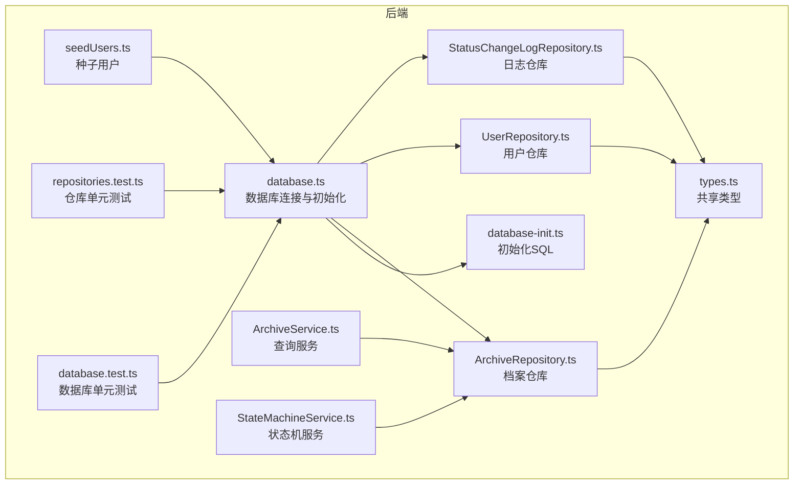
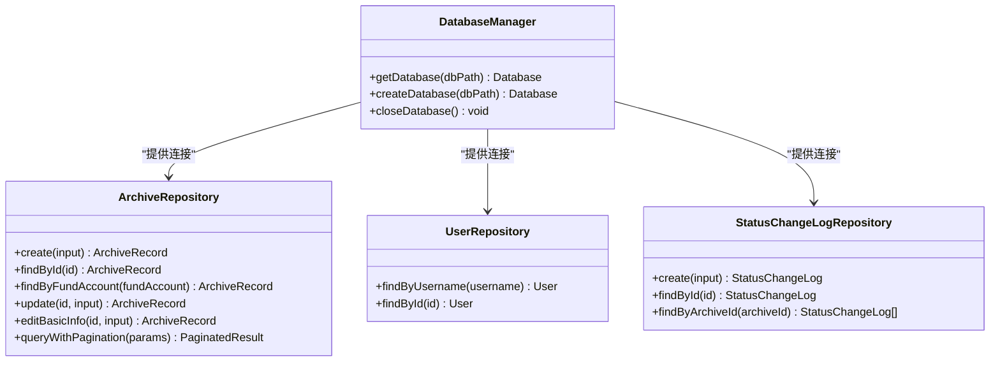
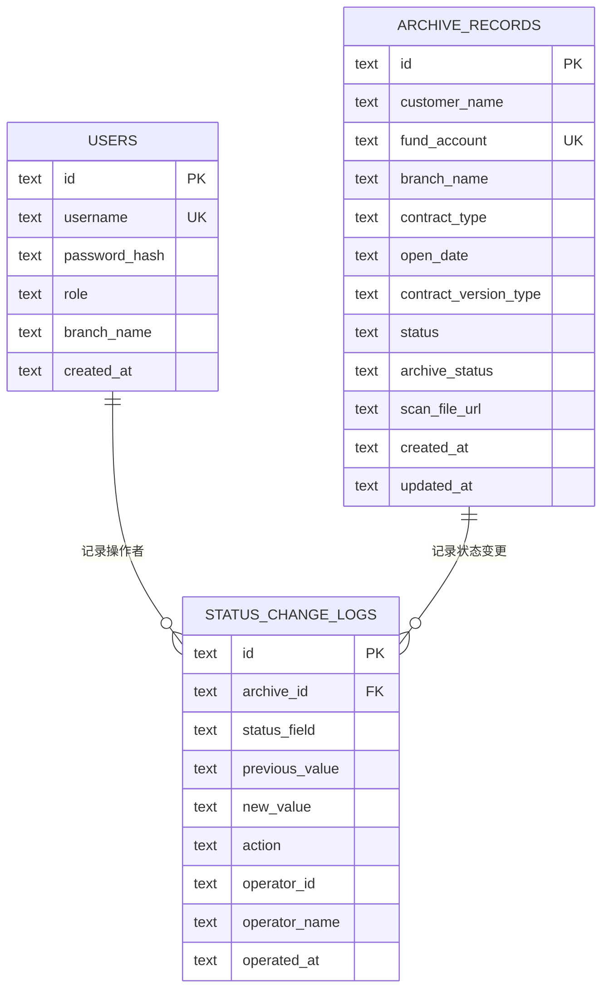
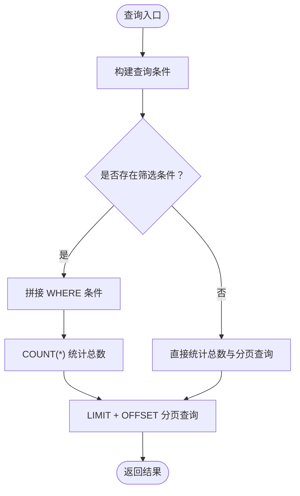
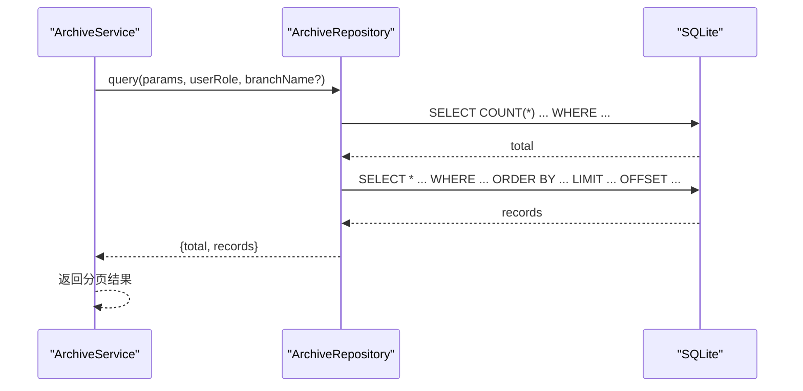
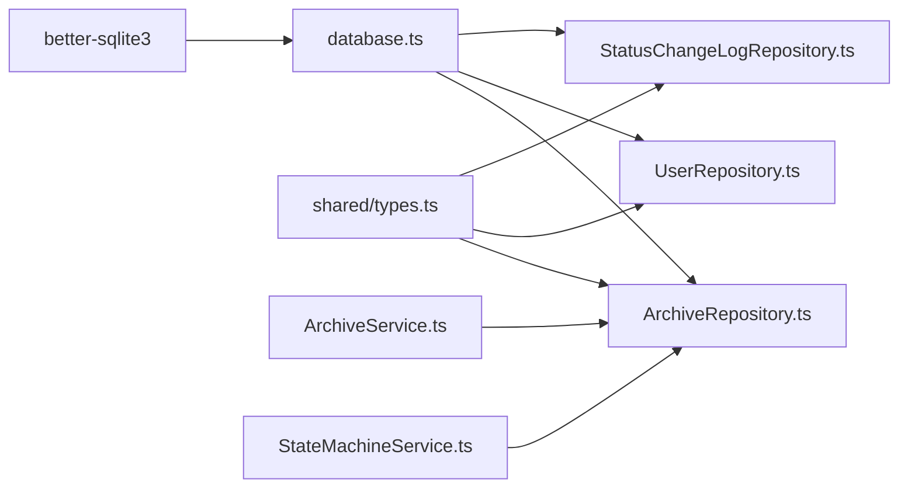

# 数据库设计

<cite>
**本文引用的文件**
- [database.ts](file://backend/src/database.ts)
- [database-init.ts](file://backend/src/database-init.ts)
- [types.ts](file://shared/types.ts)
- [ArchiveRepository.ts](file://backend/src/models/ArchiveRepository.ts)
- [UserRepository.ts](file://backend/src/models/UserRepository.ts)
- [StatusChangeLogRepository.ts](file://backend/src/models/StatusChangeLogRepository.ts)
- [seedUsers.ts](file://backend/src/utils/seedUsers.ts)
- [repositories.test.ts](file://backend/tests/unit/repositories.test.ts)
- [database.test.ts](file://backend/tests/unit/database.test.ts)
- [ArchiveService.ts](file://backend/src/services/ArchiveService.ts)
- [StateMachineService.ts](file://backend/src/services/StateMachineService.ts)
</cite>

## 目录
1. [简介](#简介)
2. [项目结构](#项目结构)
3. [核心组件](#核心组件)
4. [架构总览](#架构总览)
5. [详细组件分析](#详细组件分析)
6. [依赖分析](#依赖分析)
7. [性能考虑](#性能考虑)
8. [故障排查指南](#故障排查指南)
9. [结论](#结论)
10. [附录](#附录)

## 简介
本文件面向数据库设计与实现，围绕 SQLite 数据库存储层进行系统化技术文档编制。重点覆盖以下方面：
- 表结构设计：档案记录表、用户表、状态变更日志表的字段定义、主键、外键、索引与约束
- 实体关系与业务含义：三者之间的关联与职责边界
- 数据访问层（Repository 模式）：各仓库类的职责、方法与数据映射
- 初始化与种子数据：数据库初始化脚本、索引创建与默认用户种子
- 数据完整性与业务规则：CHECK 约束、UNIQUE 约束、外键约束、业务状态机与权限控制
- 迁移与版本管理：基于初始化脚本的版本演进策略
- 查询优化与性能：索引策略、查询条件与时间戳更新

## 项目结构
数据库相关代码主要分布在以下位置：
- 连接与初始化：backend/src/database.ts、backend/src/database-init.ts
- 数据模型与共享类型：shared/types.ts
- 数据访问层：backend/src/models/*.ts
- 种子数据：backend/src/utils/seedUsers.ts
- 测试：backend/tests/unit/*.test.ts

图表来源
- [database.ts:1-87](file://backend/src/database.ts#L1-L87)
- [database-init.ts:1-65](file://backend/src/database-init.ts#L1-L65)
- [ArchiveRepository.ts:1-307](file://backend/src/models/ArchiveRepository.ts#L1-L307)
- [UserRepository.ts:1-56](file://backend/src/models/UserRepository.ts#L1-L56)
- [StatusChangeLogRepository.ts:1-99](file://backend/src/models/StatusChangeLogRepository.ts#L1-L99)
- [ArchiveService.ts:1-71](file://backend/src/services/ArchiveService.ts#L1-L71)
- [StateMachineService.ts:1-253](file://backend/src/services/StateMachineService.ts#L1-L253)
- [types.ts:1-289](file://shared/types.ts#L1-L289)
- [seedUsers.ts:1-20](file://backend/src/utils/seedUsers.ts#L1-L20)
- [repositories.test.ts:1-404](file://backend/tests/unit/repositories.test.ts#L1-L404)
- [database.test.ts:1-157](file://backend/tests/unit/database.test.ts#L1-L157)

章节来源
- [database.ts:1-87](file://backend/src/database.ts#L1-L87)
- [database-init.ts:1-65](file://backend/src/database-init.ts#L1-L65)

## 核心组件
- 数据库连接与初始化：负责创建数据库文件、启用 WAL 模式、外键约束，执行初始化 SQL
- 表结构与约束：users、archive_records、status_change_logs 三张表及其索引
- 数据访问层（Repository）：ArchiveRepository、UserRepository、StatusChangeLogRepository
- 共享类型：定义实体接口、状态枚举、查询参数等
- 种子数据：默认用户初始化
- 服务层：ArchiveService（查询与数据隔离）、StateMachineService（状态机与权限）

章节来源
- [database.ts:19-87](file://backend/src/database.ts#L19-L87)
- [database-init.ts:8-65](file://backend/src/database-init.ts#L8-L65)
- [types.ts:46-83](file://shared/types.ts#L46-L83)
- [seedUsers.ts:11-20](file://backend/src/utils/seedUsers.ts#L11-L20)

## 架构总览
数据库层采用“连接管理 + 初始化脚本 + 仓库模式”的分层设计：
- 连接管理：单例连接、内存连接（测试）
- 初始化脚本：创建表、索引、约束
- 仓库模式：面向实体的 CRUD 与查询封装
- 类型系统：前后端共享接口与枚举，确保一致性

图表来源
- [database.ts:25-87](file://backend/src/database.ts#L25-L87)
- [ArchiveRepository.ts:85-307](file://backend/src/models/ArchiveRepository.ts#L85-L307)
- [UserRepository.ts:31-56](file://backend/src/models/UserRepository.ts#L31-L56)
- [StatusChangeLogRepository.ts:49-99](file://backend/src/models/StatusChangeLogRepository.ts#L49-L99)

## 详细组件分析

### 表结构与约束设计
- users 表
  - 主键：id（TEXT）
  - 唯一约束：username
  - 字段：username、password_hash、role（CHECK 限定枚举）、branch_name、created_at（默认时间）
- archive_records 表
  - 主键：id（TEXT）
  - 唯一约束：fund_account
  - 字段：customer_name、fund_account、branch_name、contract_type、open_date、contract_version_type（CHECK 限定枚举）、status（CHECK 限定枚举或 null）、archive_status（CHECK 限定枚举，默认值）、scan_file_url、created_at、updated_at（默认时间）
- status_change_logs 表
  - 主键：id（TEXT）
  - 外键：archive_id 引用 archive_records(id)
  - 字段：archive_id、status_field、previous_value、new_value、action、operator_id、operator_name、operated_at（默认时间）

图表来源
- [database-init.ts:10-64](file://backend/src/database-init.ts#L10-L64)

章节来源
- [database-init.ts:10-64](file://backend/src/database-init.ts#L10-L64)
- [types.ts:76-83](file://shared/types.ts#L76-L83)
- [types.ts:46-60](file://shared/types.ts#L46-L60)
- [types.ts:62-73](file://shared/types.ts#L62-L73)

### 索引设计原则
- archive_records 表
  - idx_fund_account：资金账号精确匹配查询
  - idx_branch_name：营业部过滤
  - idx_status：主流程状态过滤
  - idx_archive_status：归档状态过滤
  - idx_contract_version_type：合同版本类型过滤
- status_change_logs 表
  - idx_archive_id：按档案 ID 查询日志

图表来源
- [ArchiveRepository.ts:228-305](file://backend/src/models/ArchiveRepository.ts#L228-L305)

章节来源
- [database-init.ts:42-64](file://backend/src/database-init.ts#L42-L64)
- [ArchiveRepository.ts:228-305](file://backend/src/models/ArchiveRepository.ts#L228-L305)

### 数据访问层（Repository 模式）
- ArchiveRepository
  - 职责：档案记录的创建、查询、更新、编辑基础信息、分页与多条件查询
  - 关键点：动态 SET 子句、updated_at 自动更新、分页与条件拼接
- UserRepository
  - 职责：用户按用户名与 ID 查询
- StatusChangeLogRepository
  - 职责：日志创建、按 ID 查询、按档案 ID 查询历史

图表来源
- [ArchiveService.ts:33-70](file://backend/src/services/ArchiveService.ts#L33-L70)
- [ArchiveRepository.ts:228-305](file://backend/src/models/ArchiveRepository.ts#L228-L305)

章节来源
- [ArchiveRepository.ts:85-307](file://backend/src/models/ArchiveRepository.ts#L85-L307)
- [UserRepository.ts:31-56](file://backend/src/models/UserRepository.ts#L31-L56)
- [StatusChangeLogRepository.ts:49-99](file://backend/src/models/StatusChangeLogRepository.ts#L49-L99)

### 数据模型与业务含义
- ArchiveRecord：档案实体，包含客户信息、合同信息、状态字段（主流程与归档状态）、扫描件 URL、时间戳
- User：用户实体，包含角色与所属营业部
- StatusChangeLog：状态变更日志，记录每次状态变更的字段、前值、新值、操作、操作人与时间

章节来源
- [types.ts:46-83](file://shared/types.ts#L46-L83)

### 数据库初始化与种子数据
- 初始化脚本：创建三张表、索引与约束
- 种子用户：默认 operator、branch、general_affairs 三种角色用户，密码经哈希处理

章节来源
- [database-init.ts:8-65](file://backend/src/database-init.ts#L8-L65)
- [seedUsers.ts:11-20](file://backend/src/utils/seedUsers.ts#L11-L20)

### 数据完整性与业务规则
- 约束与校验
  - CHECK 约束：role、contract_version_type、status、archive_status
  - UNIQUE 约束：fund_account
  - 外键约束：status_change_logs.archive_id -> archive_records.id
- 业务规则
  - 电子版合同：status 为 null，禁止状态变更
  - 完全完结：status 为 completed，禁止状态变更
  - 权限控制：ACTION_ROLE_MAP 映射操作与角色
  - 状态机：主流程与归档状态的合法转换表

章节来源
- [database.test.ts:101-156](file://backend/tests/unit/database.test.ts#L101-L156)
- [StateMachineService.ts:96-200](file://backend/src/services/StateMachineService.ts#L96-L200)
- [types.ts:25-43](file://shared/types.ts#L25-L43)

### 查询优化技巧与性能考虑
- 索引命中：针对高频筛选字段建立索引（资金账号、营业部、状态、归档状态、合同版本类型）
- 查询条件：LIKE 模糊匹配仅用于客户姓名，避免在高基数列上滥用
- 时间戳更新：统一在更新时刷新 updated_at，便于排序与审计
- WAL 模式：提升并发读写性能

章节来源
- [database.ts:41-45](file://backend/src/database.ts#L41-L45)
- [database-init.ts:42-64](file://backend/src/database-init.ts#L42-L64)
- [ArchiveRepository.ts:162-166](file://backend/src/models/ArchiveRepository.ts#L162-L166)

## 依赖分析
- 连接层依赖：better-sqlite3
- 类型层依赖：shared/types.ts
- 仓库层依赖：连接实例与 SQL 语句
- 服务层依赖：仓库层与业务规则

图表来源
- [database.ts:8-11](file://backend/src/database.ts#L8-L11)
- [types.ts:1-289](file://shared/types.ts#L1-L289)
- [ArchiveRepository.ts:6-14](file://backend/src/models/ArchiveRepository.ts#L6-L14)
- [UserRepository.ts:6-7](file://backend/src/models/UserRepository.ts#L6-L7)
- [StatusChangeLogRepository.ts:6-8](file://backend/src/models/StatusChangeLogRepository.ts#L6-L8)
- [ArchiveService.ts:6-11](file://backend/src/services/ArchiveService.ts#L6-L11)
- [StateMachineService.ts:6-12](file://backend/src/services/StateMachineService.ts#L6-L12)

## 性能考虑
- 使用 WAL 模式提升并发读写吞吐
- 为高频查询字段建立索引，减少全表扫描
- 分页查询使用 LIMIT/OFFSET，避免一次性加载大量数据
- 更新操作统一刷新 updated_at，便于后续审计与排序

## 故障排查指南
- 表结构与索引
  - 使用 PRAGMA table_info 与 sqlite_master 校验表结构与索引是否存在
- 约束错误
  - CHECK 约束：非法枚举值会抛出异常
  - UNIQUE 约束：重复资金账号会抛出异常
  - 外键约束：引用不存在的 archive_id 会抛出异常
- 电子版合同与完结状态
  - 电子版合同 status 为 null，无法执行状态变更
  - status 为 completed 的记录禁止状态变更

章节来源
- [database.test.ts:19-99](file://backend/tests/unit/database.test.ts#L19-L99)
- [database.test.ts:126-156](file://backend/tests/unit/database.test.ts#L126-L156)
- [StateMachineService.ts:106-121](file://backend/src/services/StateMachineService.ts#L106-L121)

## 结论
本数据库设计方案以 SQLite 为基础，结合初始化脚本与仓库模式，实现了清晰的表结构、完善的约束与索引、一致的类型定义与严格的业务规则。通过 WAL 模式与索引策略保障性能，配合状态机与权限控制确保业务正确性。测试覆盖了表结构、索引、约束与典型 CRUD 场景，为后续演进提供了可靠基础。

## 附录

### 数据库初始化脚本要点
- 创建 users、archive_records、status_change_logs 三表
- 定义主键、唯一约束、CHECK 枚举、默认时间戳
- 创建 archive_records 与 status_change_logs 的索引

章节来源
- [database-init.ts:8-65](file://backend/src/database-init.ts#L8-L65)

### 种子用户说明
- 默认角色：operator、branch、general_affairs
- 密码经 bcrypt 哈希处理
- 使用 INSERT OR IGNORE 避免重复

章节来源
- [seedUsers.ts:5-19](file://backend/src/utils/seedUsers.ts#L5-L19)

### 仓库方法清单
- ArchiveRepository：create、findById、findByFundAccount、update、editBasicInfo、queryWithPagination
- UserRepository：findByUsername、findById
- StatusChangeLogRepository：create、findById、findByArchiveId

章节来源
- [ArchiveRepository.ts:92-307](file://backend/src/models/ArchiveRepository.ts#L92-L307)
- [UserRepository.ts:38-56](file://backend/src/models/UserRepository.ts#L38-L56)
- [StatusChangeLogRepository.ts:56-99](file://backend/src/models/StatusChangeLogRepository.ts#L56-L99)

### 状态机与权限映射
- 主流程状态转换表与归档状态转换表
- 操作-角色映射表
- 状态字段映射（status / archive_status）

章节来源
- [StateMachineService.ts:29-94](file://backend/src/services/StateMachineService.ts#L29-L94)