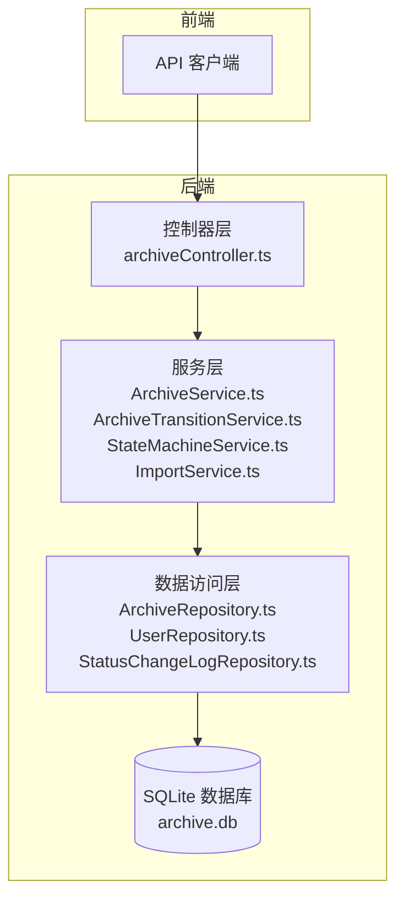
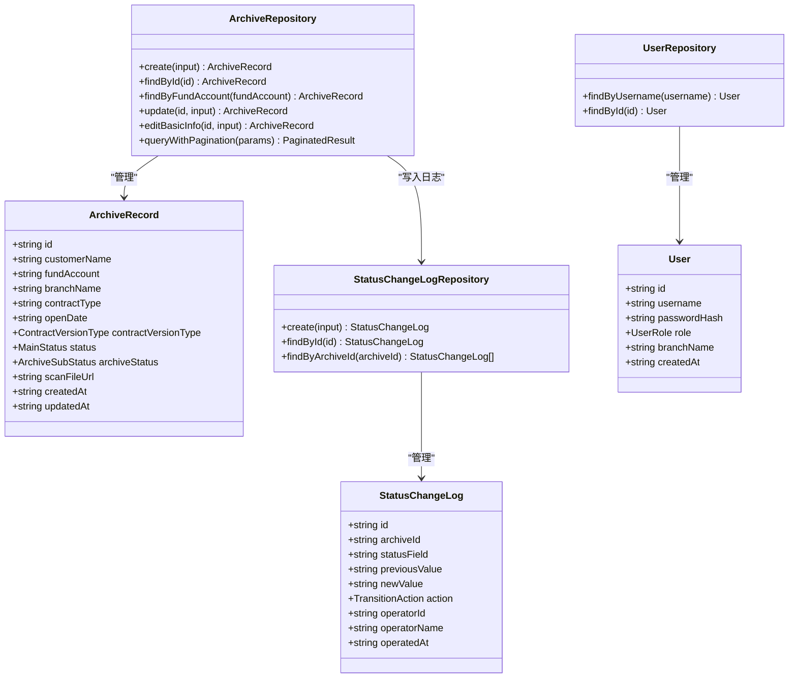
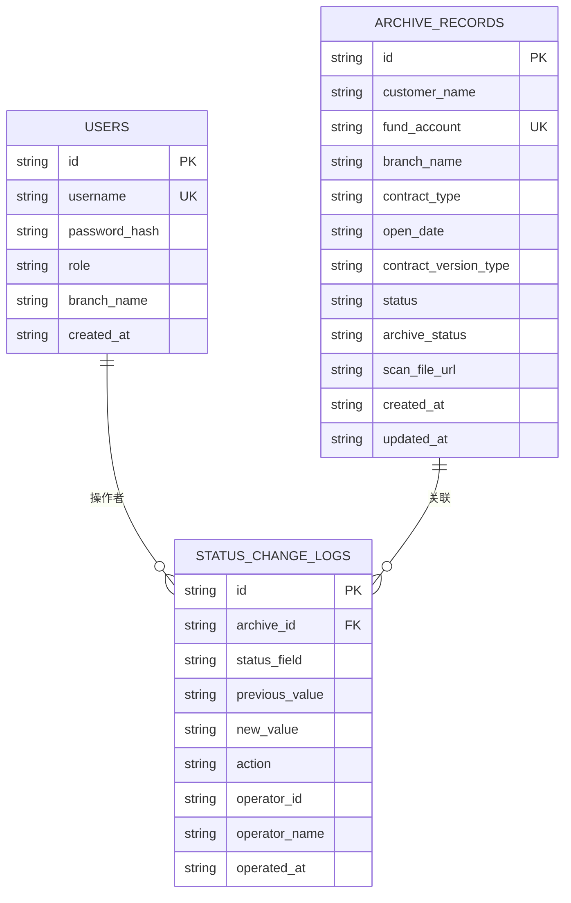
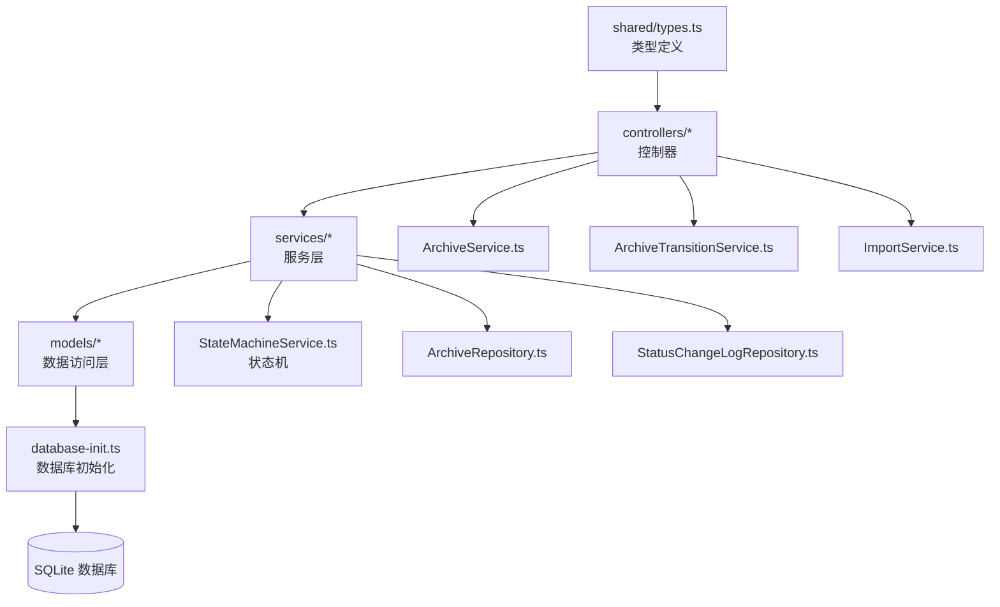
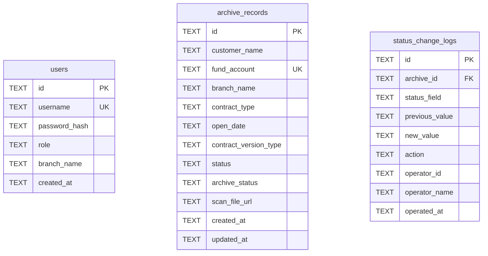
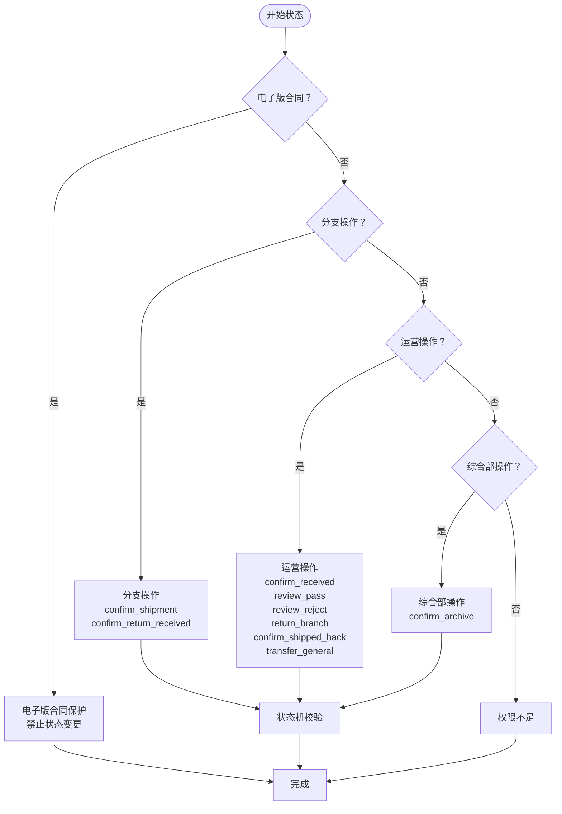

# 数据模型

<cite>
**本文引用的文件**
- [types.ts](file://shared/types.ts)
- [ArchiveRepository.ts](file://backend/src/models/ArchiveRepository.ts)
- [UserRepository.ts](file://backend/src/models/UserRepository.ts)
- [StatusChangeLogRepository.ts](file://backend/src/models/StatusChangeLogRepository.ts)
- [database-init.ts](file://backend/src/database-init.ts)
- [database.ts](file://backend/src/database.ts)
- [ArchiveService.ts](file://backend/src/services/ArchiveService.ts)
- [ArchiveTransitionService.ts](file://backend/src/services/ArchiveTransitionService.ts)
- [StateMachineService.ts](file://backend/src/services/StateMachineService.ts)
- [ImportService.ts](file://backend/src/services/ImportService.ts)
- [archiveController.ts](file://backend/src/controllers/archiveController.ts)
</cite>

## 目录
1. [简介](#简介)
2. [项目结构](#项目结构)
3. [核心组件](#核心组件)
4. [架构概览](#架构概览)
5. [详细组件分析](#详细组件分析)
6. [依赖分析](#依赖分析)
7. [性能考虑](#性能考虑)
8. [故障排除指南](#故障排除指南)
9. [结论](#结论)
10. [附录](#附录)

## 简介
本文档为档案管理系统的核心数据模型提供全面的技术文档，重点涵盖以下三个核心数据模型：
- 档案记录（ArchiveRecord）
- 用户（User）
- 状态变更日志（StatusChangeLog）

文档将详细说明每个模型的属性、类型定义和业务规则，解释模型之间的关系映射（一对一、一对多），说明 TypeScript 接口定义与数据库实体的对应关系，提供模型的序列化和反序列化处理方式，包含数据验证规则和业务约束的实现，并解释模型在 Repository 模式中的使用方式。

## 项目结构
系统采用前后端分离的架构，共享类型定义位于 shared/types.ts，后端通过 Repository 模式访问数据库，服务层负责业务逻辑，控制器层处理 API 请求。

**图表来源**
- [archiveController.ts:1-448](file://backend/src/controllers/archiveController.ts#L1-L448)
- [ArchiveService.ts:1-71](file://backend/src/services/ArchiveService.ts#L1-L71)
- [ArchiveTransitionService.ts:1-156](file://backend/src/services/ArchiveTransitionService.ts#L1-L156)
- [StateMachineService.ts:1-253](file://backend/src/services/StateMachineService.ts#L1-L253)
- [ImportService.ts:1-146](file://backend/src/services/ImportService.ts#L1-L146)
- [ArchiveRepository.ts:1-307](file://backend/src/models/ArchiveRepository.ts#L1-L307)
- [UserRepository.ts:1-56](file://backend/src/models/UserRepository.ts#L1-L56)
- [StatusChangeLogRepository.ts:1-99](file://backend/src/models/StatusChangeLogRepository.ts#L1-L99)

**章节来源**
- [archiveController.ts:1-448](file://backend/src/controllers/archiveController.ts#L1-L448)
- [ArchiveService.ts:1-71](file://backend/src/services/ArchiveService.ts#L1-L71)
- [ArchiveTransitionService.ts:1-156](file://backend/src/services/ArchiveTransitionService.ts#L1-L156)
- [StateMachineService.ts:1-253](file://backend/src/services/StateMachineService.ts#L1-L253)
- [ImportService.ts:1-146](file://backend/src/services/ImportService.ts#L1-L146)
- [ArchiveRepository.ts:1-307](file://backend/src/models/ArchiveRepository.ts#L1-L307)
- [UserRepository.ts:1-56](file://backend/src/models/UserRepository.ts#L1-L56)
- [StatusChangeLogRepository.ts:1-99](file://backend/src/models/StatusChangeLogRepository.ts#L1-L99)

## 核心组件
本节概述三个核心数据模型的完整定义、类型映射和业务规则。

- 档案记录（ArchiveRecord）
  - 描述：系统中存储的客户档案信息，包含客户基本信息、合同信息、状态信息等。
  - 关键属性：id、customerName、fundAccount（唯一）、branchName、contractType、openDate、contractVersionType、status、archiveStatus、scanFileUrl、createdAt、updatedAt。
  - 业务规则：
    - 电子版合同：status 为 null；archive_status 默认为 archived。
    - 纸质版合同：status 从 pending_shipment 开始；archive_status 从 archive_not_started 开始。
    - 完全完结：status 为 completed 的记录不可再进行任何状态变更。
    - 资金账号唯一性：数据库层唯一约束，导入和编辑时进行校验。
    - 分支机构数据隔离：分支用户只能看到自己所在营业部的数据。

- 用户（User）
  - 描述：系统用户信息，包含认证凭据和权限信息。
  - 关键属性：id、username（唯一）、passwordHash、role、branchName（可选）、createdAt。
  - 角色权限：
    - operator：运营人员，可执行大部分状态流转操作。
    - branch：分支机构人员，仅能执行与寄出/回寄相关的操作。
    - general_affairs：综合部人员，仅能执行归档相关的操作。

- 状态变更日志（StatusChangeLog）
  - 描述：记录每次状态变更的详细信息，用于审计和追踪。
  - 关键属性：id、archiveId（关联档案记录）、statusField（变更字段：status 或 archive_status）、previousValue、newValue、action（触发操作）、operatorId、operatorName、operatedAt。
  - 业务规则：
    - 每次成功的状态变更都会生成一条日志。
    - 特殊联动操作会产生多条日志（如 review_pass 同时变更主流程状态和归档状态）。
    - 日志按时间倒序排列，便于查看最新状态变化。

**章节来源**
- [types.ts:46-83](file://shared/types.ts#L46-L83)
- [types.ts:8-43](file://shared/types.ts#L8-L43)
- [database-init.ts:19-64](file://backend/src/database-init.ts#L19-L64)
- [ArchiveRepository.ts:46-60](file://backend/src/models/ArchiveRepository.ts#L46-L60)
- [UserRepository.ts:75-83](file://backend/src/models/UserRepository.ts#L75-L83)
- [StatusChangeLogRepository.ts:62-73](file://backend/src/models/StatusChangeLogRepository.ts#L62-L73)

## 架构概览
系统采用分层架构，数据模型通过 Repository 模式与数据库交互，服务层封装业务逻辑，控制器层处理 API 请求。

**图表来源**
- [types.ts:46-83](file://shared/types.ts#L46-L83)
- [ArchiveRepository.ts:85-307](file://backend/src/models/ArchiveRepository.ts#L85-L307)
- [UserRepository.ts:31-56](file://backend/src/models/UserRepository.ts#L31-L56)
- [StatusChangeLogRepository.ts:49-99](file://backend/src/models/StatusChangeLogRepository.ts#L49-L99)

**章节来源**
- [types.ts:46-83](file://shared/types.ts#L46-L83)
- [ArchiveRepository.ts:85-307](file://backend/src/models/ArchiveRepository.ts#L85-L307)
- [UserRepository.ts:31-56](file://backend/src/models/UserRepository.ts#L31-L56)
- [StatusChangeLogRepository.ts:49-99](file://backend/src/models/StatusChangeLogRepository.ts#L49-L99)

## 详细组件分析

### 档案记录（ArchiveRecord）模型
档案记录是系统的核心实体，承载完整的客户档案信息和状态流转。

#### 属性定义与类型映射
- 基本信息字段
  - id: string - 主键，UUID 格式
  - customerName: string - 客户姓名，必填
  - fundAccount: string - 资金账号，唯一标识符，必填
  - branchName: string - 营业部名称，必填
  - contractType: string - 合同类型，必填
  - openDate: string - 开户日期，YYYY-MM-DD 格式，必填

- 合同信息字段
  - contractVersionType: ContractVersionType - 合同版本类型，枚举值：'electronic' | 'paper'
  - status: MainStatus | 'completed' | null - 主流程状态，null 表示电子版合同
  - archiveStatus: ArchiveSubStatus - 综合部归档状态，默认 'archive_not_started'

- 文件信息字段
  - scanFileUrl?: string - 扫描件文件 URL，可选

- 时间戳字段
  - createdAt: string - 创建时间，默认当前时间
  - updatedAt: string - 更新时间，默认当前时间

#### 业务规则与约束
- 状态初始化规则
  - 电子版合同：status = null，archive_status = 'archived'
  - 纸质版合同：status = 'pending_shipment'，archive_status = 'archive_not_started'
- 完全完结保护：status = 'completed' 的记录禁止任何状态变更
- 资金账号唯一性：数据库唯一约束 + 导入/编辑时双重校验
- 电子版合同保护：电子版合同禁止所有状态变更操作

#### 数据库映射
档案记录对应数据库表 archive_records，字段命名采用 snake_case，包含以下约束：
- 主键：id
- 唯一约束：fund_account
- CHECK 约束：contract_version_type、status、archive_status
- 索引：fund_account、branch_name、status、archive_status、contract_version_type

**章节来源**
- [types.ts:46-60](file://shared/types.ts#L46-L60)
- [database-init.ts:19-40](file://backend/src/database-init.ts#L19-L40)
- [ArchiveRepository.ts:17-30](file://backend/src/models/ArchiveRepository.ts#L17-L30)
- [archiveController.ts:374-396](file://backend/src/controllers/archiveController.ts#L374-L396)

### 用户（User）模型
用户模型管理系统的认证和授权信息。

#### 属性定义与类型映射
- 基本信息字段
  - id: string - 主键，UUID 格式
  - username: string - 用户名，唯一
  - passwordHash: string - 密码哈希值
  - role: UserRole - 用户角色，枚举值：'operator' | 'branch' | 'general_affairs'
  - branchName?: string - 所属营业部，分支用户必填
  - createdAt: string - 创建时间

#### 角色权限体系
- operator（运营人员）
  - 权限：导入、搜索、审核、回寄、确认收到、转交综合部、OCR、查看自己的档案
  - 可执行状态流转：除分支专属操作外的所有操作
- branch（分支机构人员）
  - 权限：搜索、确认寄出、确认收到回寄
  - 可执行状态流转：confirm_shipment、confirm_return_received
  - 数据隔离：自动过滤为本营业部数据
- general_affairs（综合部人员）
  - 权限：搜索、确认入库
  - 可执行状态流转：confirm_archive
  - 数据隔离：仅能处理综合部相关状态

#### 数据库映射
用户模型对应数据库表 users，字段命名采用 snake_case，包含以下约束：
- 主键：id
- 唯一约束：username
- CHECK 约束：role
- 索引：username

**章节来源**
- [types.ts:75-83](file://shared/types.ts#L75-L83)
- [types.ts:8-9](file://shared/types.ts#L8-L9)
- [types.ts:87-102](file://shared/types.ts#L87-L102)
- [database-init.ts:9-17](file://backend/src/database-init.ts#L9-L17)
- [UserRepository.ts:9-17](file://backend/src/models/UserRepository.ts#L9-L17)

### 状态变更日志（StatusChangeLog）模型
状态变更日志模型记录每次状态变更的详细信息，用于审计和追踪。

#### 属性定义与类型映射
- 基本信息字段
  - id: string - 主键，UUID 格式
  - archiveId: string - 关联的档案记录 ID
  - statusField: string - 变更的状态字段名，'status' 或 'archive_status'
  - previousValue: string | null - 变更前的状态值
  - newValue: string - 变更后的状态值
  - action: TransitionAction | 'create' - 触发操作
  - operatorId: string - 操作人 ID
  - operatorName: string - 操作人姓名
  - operatedAt: string - 操作时间

#### 日志生成规则
- 每次成功的状态变更都会生成一条日志
- 特殊联动操作会产生多条日志：
  - review_pass：同时变更主流程状态和归档状态，产生两条日志
  - confirm_return_received：根据当前归档状态决定后续状态，可能产生额外日志
- 日志按时间倒序排列，便于查看最新状态变化

#### 数据库映射
状态变更日志模型对应数据库表 status_change_logs，字段命名采用 snake_case，包含以下约束：
- 主键：id
- 外键约束：archive_id 引用 archive_records(id)
- 索引：archive_id

**章节来源**
- [types.ts:62-73](file://shared/types.ts#L62-L73)
- [database-init.ts:49-64](file://backend/src/database-init.ts#L49-L64)
- [StatusChangeLogRepository.ts:10-21](file://backend/src/models/StatusChangeLogRepository.ts#L10-L21)

### 模型关系映射
系统中三个核心模型之间的关系如下：

**图表来源**
- [database-init.ts:9-64](file://backend/src/database-init.ts#L9-L64)
- [types.ts:75-83](file://shared/types.ts#L75-L83)
- [types.ts:46-60](file://shared/types.ts#L46-L60)
- [types.ts:62-73](file://shared/types.ts#L62-L73)

#### 关系说明
- 一对一关系
  - User 与 StatusChangeLog：一个操作者可以有多条日志记录
- 一对多关系
  - ArchiveRecord 与 StatusChangeLog：一个档案记录可以有多条状态变更日志
- 外键约束
  - status_change_logs.archive_id 引用 archive_records.id

**章节来源**
- [database-init.ts:50-60](file://backend/src/database-init.ts#L50-L60)
- [types.ts:62-73](file://shared/types.ts#L62-L73)

### Repository 模式实现
Repository 模式为每个实体提供统一的数据访问接口，实现数据持久化与业务逻辑的解耦。

#### ArchiveRepository 实现要点
- 数据库行到接口的转换：rowToRecord 函数将数据库行转换为 ArchiveRecord 接口
- CRUD 操作：提供 create、findById、findByFundAccount、update、editBasicInfo 方法
- 分页查询：queryWithPagination 支持多条件组合查询
- 输入参数类型：CreateArchiveInput、UpdateArchiveInput、EditArchiveInput

#### UserRepository 实现要点
- 用户查询：findByUsername、findById 方法
- 数据库行转换：rowToUser 函数

#### StatusChangeLogRepository 实现要点
- 日志写入：create 方法自动生成 UUID 和时间戳
- 查询方法：findById、findByArchiveId
- 数据库行转换：rowToLog 函数

**章节来源**
- [ArchiveRepository.ts:32-48](file://backend/src/models/ArchiveRepository.ts#L32-L48)
- [ArchiveRepository.ts:93-120](file://backend/src/models/ArchiveRepository.ts#L93-L120)
- [UserRepository.ts:19-29](file://backend/src/models/UserRepository.ts#L19-L29)
- [StatusChangeLogRepository.ts:23-36](file://backend/src/models/StatusChangeLogRepository.ts#L23-L36)

### 序列化与反序列化处理
系统采用以下策略处理数据的序列化和反序列化：

#### 数据库层处理
- 数据库行到接口转换：每个 Repository 都包含 rowToXxx 函数，将数据库行（snake_case）转换为 TypeScript 接口（camelCase）
- 自动时间戳：创建和更新时自动设置 created_at 和 updated_at 字段

#### API 层处理
- 控制器层负责接收请求参数并进行基本验证
- 服务层进行业务逻辑处理和权限校验
- Repository 层负责与数据库交互

#### 类型安全保证
- 共享类型定义确保前后端类型一致性
- 枚举类型限制值域范围
- 可选字段明确表示可为空的情况

**章节来源**
- [ArchiveRepository.ts:32-48](file://backend/src/models/ArchiveRepository.ts#L32-L48)
- [UserRepository.ts:19-29](file://backend/src/models/UserRepository.ts#L19-L29)
- [StatusChangeLogRepository.ts:23-36](file://backend/src/models/StatusChangeLogRepository.ts#L23-L36)
- [archiveController.ts:340-396](file://backend/src/controllers/archiveController.ts#L340-L396)

### 数据验证规则与业务约束
系统在多个层次实施数据验证和业务约束：

#### 数据库约束
- 唯一性约束：users.username、archive_records.fund_account
- CHECK 约束：限制枚举值范围
- 外键约束：保证数据完整性

#### 业务逻辑验证
- 电子版合同保护：电子版合同禁止所有状态变更操作
- 完全完结保护：status = 'completed' 的记录不可修改
- 角色权限校验：操作必须符合角色要求
- 资金账号唯一性：导入和编辑时双重校验

#### API 层验证
- 请求参数校验：必填字段检查、格式验证
- 权限验证：基于用户角色的访问控制
- 业务规则验证：状态流转合法性检查

**章节来源**
- [database-init.ts:14-40](file://backend/src/database-init.ts#L14-L40)
- [StateMachineService.ts:106-142](file://backend/src/services/StateMachineService.ts#L106-L142)
- [archiveController.ts:342-371](file://backend/src/controllers/archiveController.ts#L342-L371)
- [ImportService.ts:75-111](file://backend/src/services/ImportService.ts#L75-L111)

## 依赖分析
系统各组件之间的依赖关系如下：

**图表来源**
- [types.ts:1-289](file://shared/types.ts#L1-L289)
- [archiveController.ts:1-448](file://backend/src/controllers/archiveController.ts#L1-L448)
- [ArchiveService.ts:1-71](file://backend/src/services/ArchiveService.ts#L1-L71)
- [ArchiveTransitionService.ts:1-156](file://backend/src/services/ArchiveTransitionService.ts#L1-L156)
- [StateMachineService.ts:1-253](file://backend/src/services/StateMachineService.ts#L1-L253)
- [ImportService.ts:1-146](file://backend/src/services/ImportService.ts#L1-L146)
- [ArchiveRepository.ts:1-307](file://backend/src/models/ArchiveRepository.ts#L1-L307)
- [StatusChangeLogRepository.ts:1-99](file://backend/src/models/StatusChangeLogRepository.ts#L1-L99)
- [database-init.ts:1-65](file://backend/src/database-init.ts#L1-L65)

**章节来源**
- [types.ts:1-289](file://shared/types.ts#L1-L289)
- [archiveController.ts:1-448](file://backend/src/controllers/archiveController.ts#L1-L448)
- [ArchiveService.ts:1-71](file://backend/src/services/ArchiveService.ts#L1-L71)
- [ArchiveTransitionService.ts:1-156](file://backend/src/services/ArchiveTransitionService.ts#L1-L156)
- [StateMachineService.ts:1-253](file://backend/src/services/StateMachineService.ts#L1-L253)
- [ImportService.ts:1-146](file://backend/src/services/ImportService.ts#L1-L146)
- [ArchiveRepository.ts:1-307](file://backend/src/models/ArchiveRepository.ts#L1-L307)
- [StatusChangeLogRepository.ts:1-99](file://backend/src/models/StatusChangeLogRepository.ts#L1-L99)
- [database-init.ts:1-65](file://backend/src/database-init.ts#L1-L65)

## 性能考虑
系统在设计时考虑了以下性能优化：

- 数据库索引优化
  - 为常用查询字段建立索引：fund_account、branch_name、status、archive_status、contract_version_type
  - 提升分页查询和条件查询性能

- WAL 模式启用
  - 使用 Write-Ahead Logging 模式提升并发读写性能
  - 支持更好的并发控制

- 外键约束启用
  - 确保数据完整性的同时，通过索引优化查询性能

- 查询优化
  - 分页查询使用 LIMIT 和 OFFSET
  - 条件查询动态构建 WHERE 子句
  - 索引字段优先使用精确匹配而非模糊查询

- 内存管理
  - 数据库连接采用单例模式
  - 测试场景支持内存数据库

**章节来源**
- [database-init.ts:42-48](file://backend/src/database-init.ts#L42-L48)
- [database.ts:41-45](file://backend/src/database.ts#L41-L45)
- [ArchiveRepository.ts:228-305](file://backend/src/models/ArchiveRepository.ts#L228-L305)

## 故障排除指南
常见问题及解决方案：

### 数据库连接问题
- 症状：应用启动时报数据库连接错误
- 解决方案：检查数据库文件路径和权限，确认数据库目录存在且可写

### 数据唯一性冲突
- 症状：创建档案记录时报资金账号重复
- 解决方案：检查是否存在重复的资金账号，或修改为唯一的资金账号

### 权限不足错误
- 症状：状态流转操作返回权限不足
- 解决方案：确认用户角色是否正确，检查对应的操作权限

### 状态流转不合法
- 症状：状态变更失败，提示状态流转不合法
- 解决方案：检查当前状态是否允许该操作，确认操作角色是否正确

### 电子版合同保护
- 症状：对电子版合同执行状态变更被拒绝
- 解决方案：电子版合同不支持状态变更操作，这是预期行为

**章节来源**
- [archiveController.ts:363-371](file://backend/src/controllers/archiveController.ts#L363-L371)
- [archiveController.ts:244-252](file://backend/src/controllers/archiveController.ts#L244-L252)
- [StateMachineService.ts:106-142](file://backend/src/services/StateMachineService.ts#L106-L142)

## 结论
本文档全面阐述了档案管理系统的核心数据模型，包括档案记录、用户和状态变更日志三个关键实体。系统采用清晰的分层架构，通过 Repository 模式实现了数据访问与业务逻辑的解耦，确保了类型安全和数据完整性。

关键特性包括：
- 完整的业务规则实现，涵盖状态流转、权限控制、数据验证
- 清晰的模型关系映射，支持审计追踪
- 高效的数据库设计，包含必要的索引和约束
- 完善的错误处理和故障排除机制

这些设计使得系统能够可靠地管理复杂的档案状态流转，同时保持良好的性能和可维护性。

## 附录

### 数据库表结构

**图表来源**
- [database-init.ts:9-64](file://backend/src/database-init.ts#L9-L64)

### 状态流转图

**图表来源**
- [StateMachineService.ts:71-94](file://backend/src/services/StateMachineService.ts#L71-L94)
- [StateMachineService.ts:106-142](file://backend/src/services/StateMachineService.ts#L106-L142)