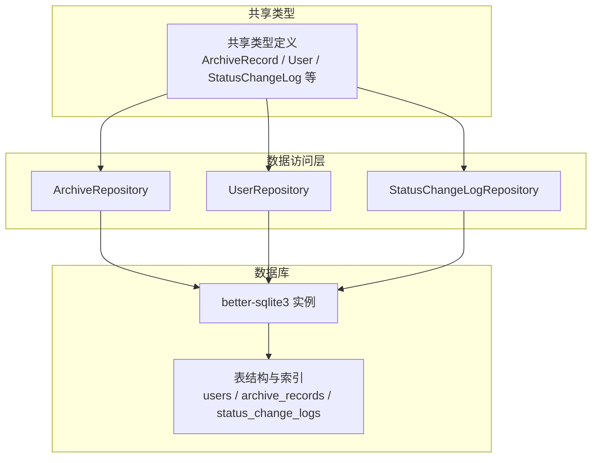
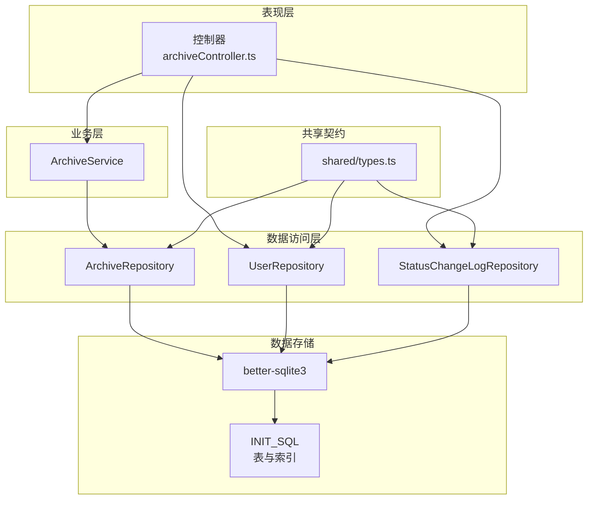
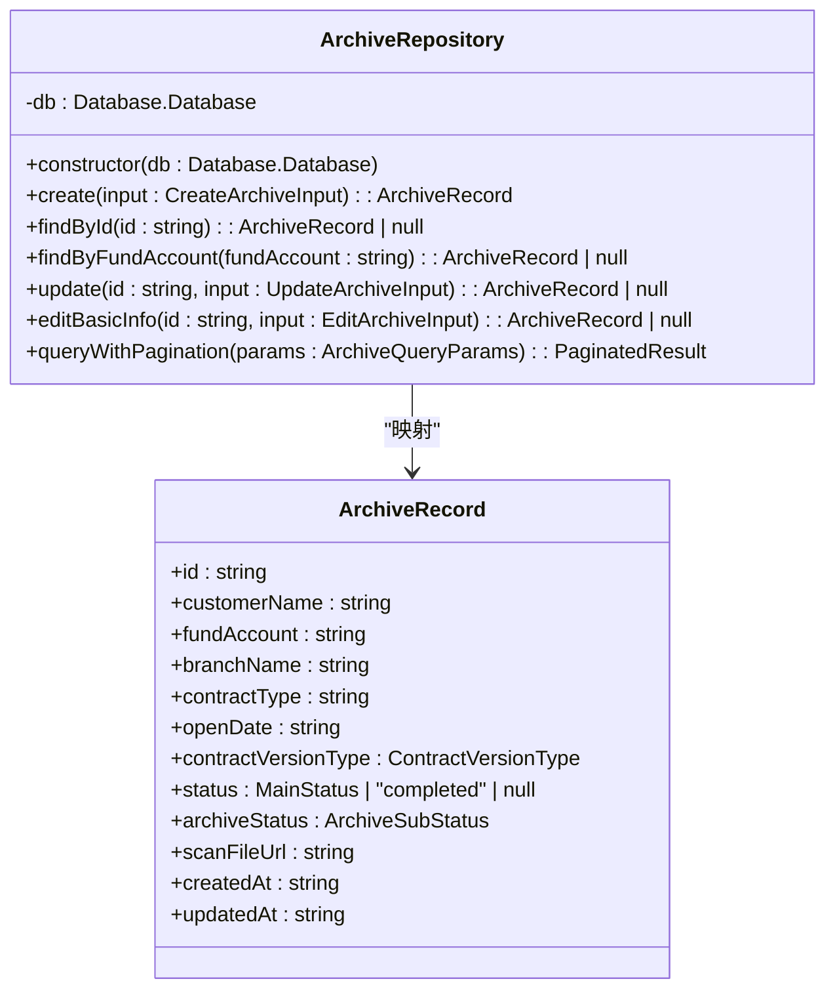
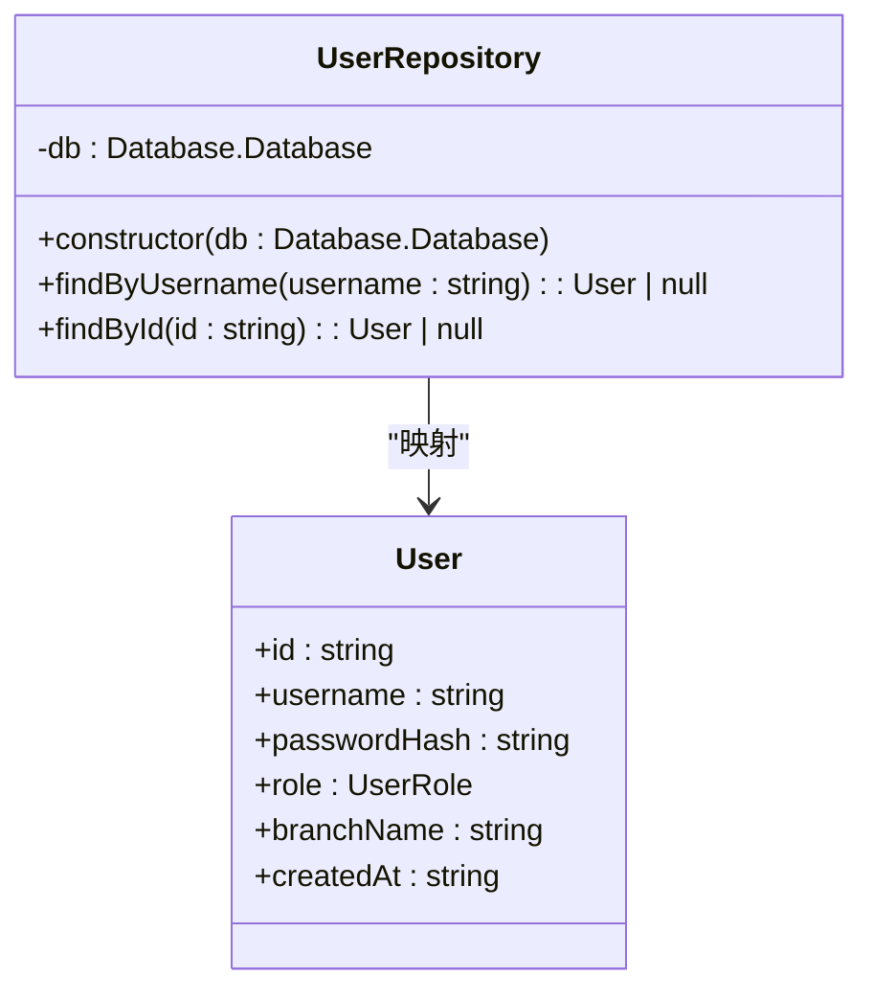
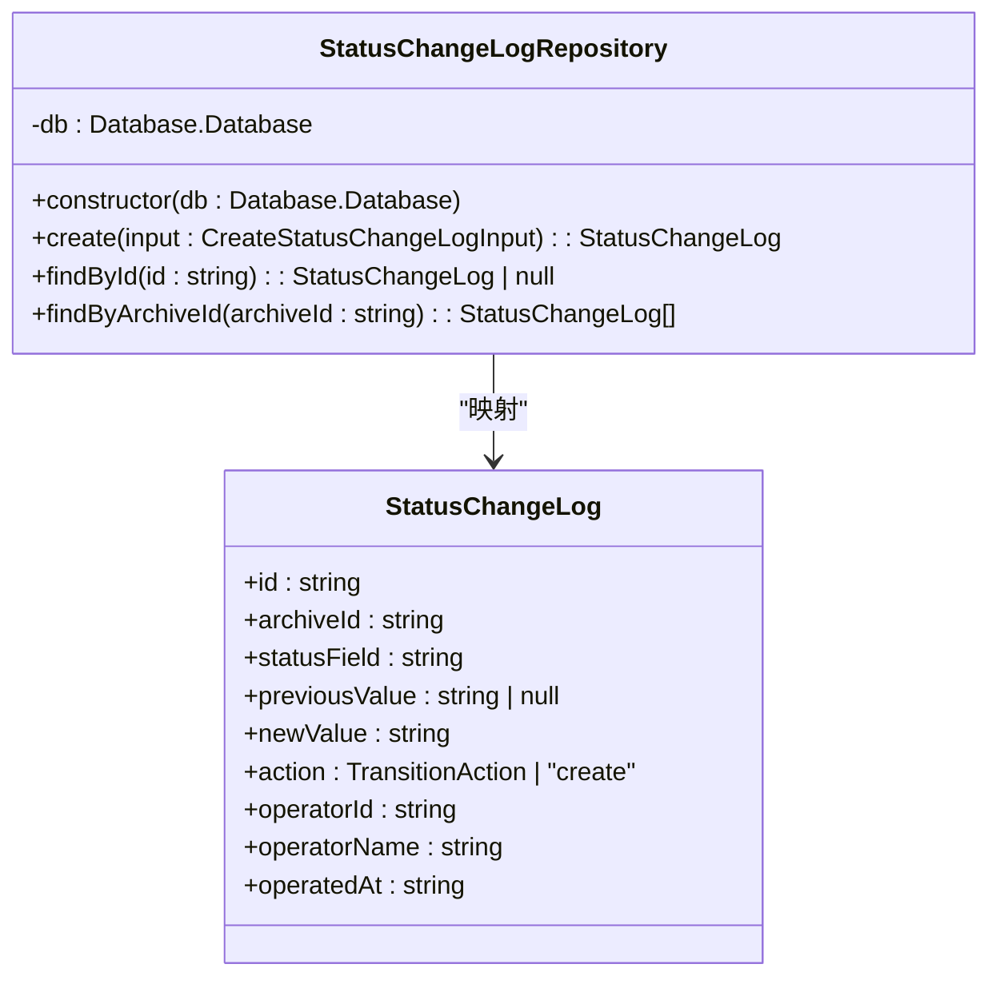
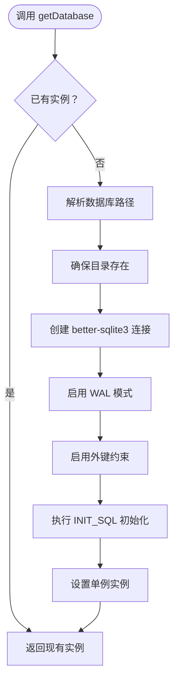
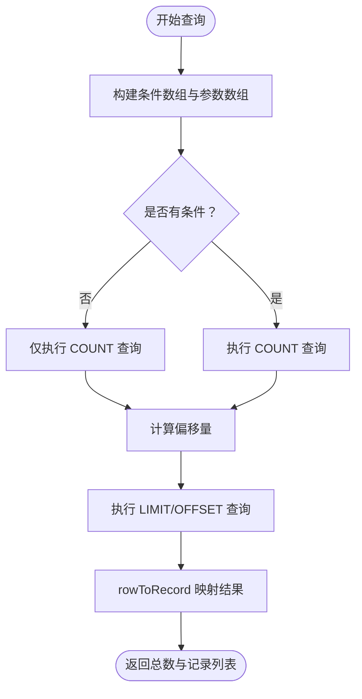
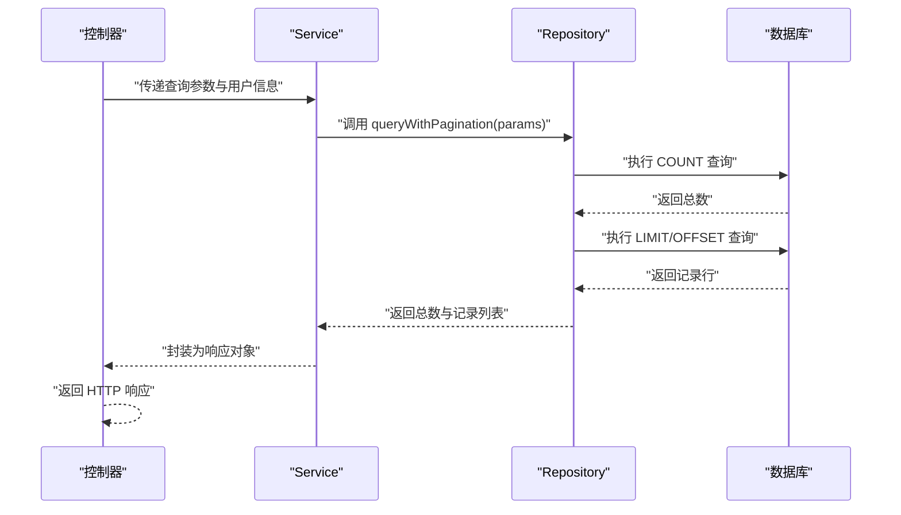
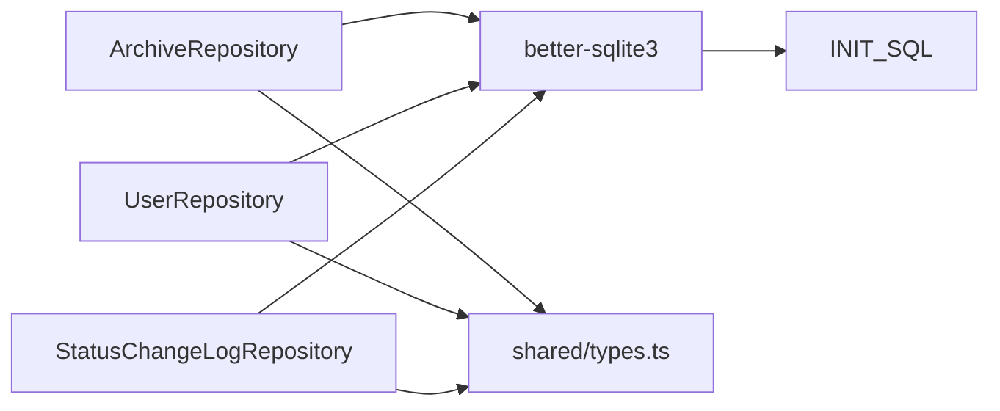

# 数据访问层

<cite>
**本文引用的文件**
- [ArchiveRepository.ts](file://backend/src/models/ArchiveRepository.ts)
- [UserRepository.ts](file://backend/src/models/UserRepository.ts)
- [StatusChangeLogRepository.ts](file://backend/src/models/StatusChangeLogRepository.ts)
- [database.ts](file://backend/src/database.ts)
- [database-init.ts](file://backend/src/database-init.ts)
- [types.ts](file://shared/types.ts)
- [archiveController.ts](file://backend/src/controllers/archiveController.ts)
- [ArchiveService.ts](file://backend/src/services/ArchiveService.ts)
- [repositories.test.ts](file://backend/tests/unit/repositories.test.ts)
</cite>

## 目录
1. [简介](#简介)
2. [项目结构](#项目结构)
3. [核心组件](#核心组件)
4. [架构总览](#架构总览)
5. [详细组件分析](#详细组件分析)
6. [依赖关系分析](#依赖关系分析)
7. [性能考量](#性能考量)
8. [故障排查指南](#故障排查指南)
9. [结论](#结论)
10. [附录](#附录)

## 简介
本文件面向数据访问层（Repository）的技术文档，重点阐述以下三个核心Repository类的设计与实现：
- ArchiveRepository：负责档案记录的CRUD与分页查询
- UserRepository：负责用户查询
- StatusChangeLogRepository：负责状态变更日志的写入与查询

文档涵盖数据库连接管理、查询构建与结果映射、SQL构造与参数绑定、事务处理与错误处理策略、CRUD示例与最佳实践、查询优化与性能调优建议，以及Repository与Service层的交互模式。

## 项目结构
数据访问层位于 backend/src/models，配合共享类型定义 shared/types.ts，以及数据库初始化脚本 backend/src/database-init.ts 和连接管理 backend/src/database.ts。控制器 backend/src/controllers/archiveController.ts 展示了Repository与Service层的典型交互模式。

图表来源
- [ArchiveRepository.ts:85-307](file://backend/src/models/ArchiveRepository.ts#L85-L307)
- [UserRepository.ts:31-56](file://backend/src/models/UserRepository.ts#L31-L56)
- [StatusChangeLogRepository.ts:49-99](file://backend/src/models/StatusChangeLogRepository.ts#L49-L99)
- [database.ts:25-87](file://backend/src/database.ts#L25-L87)
- [database-init.ts:8-65](file://backend/src/database-init.ts#L8-L65)
- [types.ts:46-83](file://shared/types.ts#L46-L83)

章节来源
- [database.ts:1-87](file://backend/src/database.ts#L1-L87)
- [database-init.ts:1-65](file://backend/src/database-init.ts#L1-L65)
- [types.ts:1-289](file://shared/types.ts#L1-L289)

## 核心组件
- ArchiveRepository：提供创建、查询、更新、编辑基础信息、分页查询等能力；内部通过prepare/run执行SQL，使用rowToRecord进行结果映射。
- UserRepository：提供按用户名与ID查询用户的能力；内部通过prepare/get执行SQL，使用rowToUser进行结果映射。
- StatusChangeLogRepository：提供创建日志、按ID查询、按档案ID查询日志列表的能力；内部通过prepare/run与prepare/all执行SQL，使用rowToLog进行结果映射。
- 数据库连接管理：通过单例模式提供数据库实例，启用WAL与外键约束，并执行初始化SQL创建表与索引。
- 共享类型：统一定义实体接口与枚举，确保Repository层与上层（Service/Controller）的数据契约一致。

章节来源
- [ArchiveRepository.ts:85-307](file://backend/src/models/ArchiveRepository.ts#L85-L307)
- [UserRepository.ts:31-56](file://backend/src/models/UserRepository.ts#L31-L56)
- [StatusChangeLogRepository.ts:49-99](file://backend/src/models/StatusChangeLogRepository.ts#L49-L99)
- [database.ts:25-87](file://backend/src/database.ts#L25-L87)
- [types.ts:46-83](file://shared/types.ts#L46-L83)

## 架构总览
下图展示了Repository层与数据库、共享类型及上层Service/Controller之间的交互关系。

图表来源
- [archiveController.ts:99-147](file://backend/src/controllers/archiveController.ts#L99-L147)
- [ArchiveService.ts:19-71](file://backend/src/services/ArchiveService.ts#L19-L71)
- [ArchiveRepository.ts:85-307](file://backend/src/models/ArchiveRepository.ts#L85-L307)
- [UserRepository.ts:31-56](file://backend/src/models/UserRepository.ts#L31-L56)
- [StatusChangeLogRepository.ts:49-99](file://backend/src/models/StatusChangeLogRepository.ts#L49-L99)
- [database.ts:25-87](file://backend/src/database.ts#L25-L87)
- [database-init.ts:8-65](file://backend/src/database-init.ts#L8-L65)
- [types.ts:46-83](file://shared/types.ts#L46-L83)

## 详细组件分析

### ArchiveRepository 设计与实现
- 数据库连接：构造函数接收better-sqlite3实例，所有操作基于该连接执行。
- 结果映射：通过rowToRecord将数据库行（snake_case字段）映射为ArchiveRecord接口（camelCase字段）。
- CRUD与查询：
  - create：生成UUID作为主键，填充时间戳，使用INSERT语句写入；随后通过findById返回最新记录。
  - findById/findByFundAccount：使用SELECT查询单条记录，返回null或映射后的对象。
  - update：动态拼接SET子句，仅对传入的字段进行更新，自动更新updated_at；若无字段更新则直接返回原记录。
  - editBasicInfo：对基础信息字段进行部分更新，同样自动更新updated_at。
  - queryWithPagination：支持多条件组合查询（客户姓名模糊匹配、资金账号精确匹配、营业部、合同类型、主流程状态、归档状态、合同版本类型、开户日期范围），先COUNT再LIMIT/OFFSET分页查询，返回总数与记录列表。
- SQL构造与参数绑定：所有查询均使用占位符（?）进行参数绑定，避免SQL注入风险；动态拼接WHERE与SET子句时注意逗号与空格处理。
- 错误处理策略：Repository层不抛出异常，查询不到时返回null；上层根据返回值进行判断与HTTP状态码处理。

图表来源
- [ArchiveRepository.ts:85-307](file://backend/src/models/ArchiveRepository.ts#L85-L307)
- [types.ts:46-60](file://shared/types.ts#L46-L60)

章节来源
- [ArchiveRepository.ts:85-307](file://backend/src/models/ArchiveRepository.ts#L85-L307)
- [types.ts:46-60](file://shared/types.ts#L46-L60)

### UserRepository 设计与实现
- 数据库连接：构造函数接收better-sqlite3实例。
- 结果映射：通过rowToUser将数据库行映射为User接口。
- 查询：
  - findByUsername：按用户名精确查询。
  - findById：按ID精确查询。
- 错误处理策略：查询不到返回null，由上层决定HTTP状态码。

图表来源
- [UserRepository.ts:31-56](file://backend/src/models/UserRepository.ts#L31-L56)
- [types.ts:75-83](file://shared/types.ts#L75-L83)

章节来源
- [UserRepository.ts:31-56](file://backend/src/models/UserRepository.ts#L31-L56)
- [types.ts:75-83](file://shared/types.ts#L75-L83)

### StatusChangeLogRepository 设计与实现
- 数据库连接：构造函数接收better-sqlite3实例。
- 结果映射：通过rowToLog将数据库行映射为StatusChangeLog接口。
- 日志管理：
  - create：生成UUID与时间戳，写入日志记录，随后通过findById返回最新记录。
  - findById：按ID查询单条日志。
  - findByArchiveId：按档案ID查询所有日志，按时间倒序排列。
- 错误处理策略：查询不到返回null或空数组，由上层处理。

图表来源
- [StatusChangeLogRepository.ts:49-99](file://backend/src/models/StatusChangeLogRepository.ts#L49-L99)
- [types.ts:62-73](file://shared/types.ts#L62-L73)

章节来源
- [StatusChangeLogRepository.ts:49-99](file://backend/src/models/StatusChangeLogRepository.ts#L49-L99)
- [types.ts:62-73](file://shared/types.ts#L62-L73)

### 数据库连接管理与初始化
- 单例模式：getDatabase首次调用时创建数据库文件、启用WAL与外键约束、执行INIT_SQL初始化表结构与索引；后续调用直接返回同一实例。
- 测试支持：createDatabase用于测试场景，支持内存数据库（':memory:'），同样启用WAL与外键约束并执行初始化。
- 表结构与索引：users、archive_records、status_change_logs三张表；archive_records针对常用查询字段建立索引，status_change_logs针对archive_id建立索引。

图表来源
- [database.ts:25-52](file://backend/src/database.ts#L25-L52)
- [database-init.ts:8-65](file://backend/src/database-init.ts#L8-L65)

章节来源
- [database.ts:1-87](file://backend/src/database.ts#L1-L87)
- [database-init.ts:1-65](file://backend/src/database-init.ts#L1-L65)

### 查询构建与结果映射机制
- 查询构建：Repository层通过字符串拼接构建WHERE与SET子句，结合参数数组进行绑定；queryWithPagination对多条件进行AND组合。
- 结果映射：每个Repository提供rowToXxx函数将数据库行（snake_case）映射到接口（camelCase），并进行类型断言与可选字段处理。
- 参数绑定：所有SQL使用占位符（?），参数顺序与位置严格对应，避免SQL注入。
- 分页策略：先COUNT统计总数，再LIMIT/OFFSET分页查询，保证一致性。

图表来源
- [ArchiveRepository.ts:228-305](file://backend/src/models/ArchiveRepository.ts#L228-L305)

章节来源
- [ArchiveRepository.ts:228-305](file://backend/src/models/ArchiveRepository.ts#L228-L305)

### 事务处理与错误处理策略
- 事务处理：当前Repository层未显式开启事务；所有操作基于单连接执行，未使用begin/commit/rollback。如需跨多条SQL的原子性，可在Service层协调并使用事务包装。
- 错误处理：Repository层返回null或空数组表示“未找到”，由上层（Service/Controller）根据业务语义决定HTTP状态码与错误信息；未捕获底层异常，保持上抛以便上层统一处理。

章节来源
- [ArchiveRepository.ts:93-120](file://backend/src/models/ArchiveRepository.ts#L93-L120)
- [UserRepository.ts:38-54](file://backend/src/models/UserRepository.ts#L38-L54)
- [StatusChangeLogRepository.ts:56-79](file://backend/src/models/StatusChangeLogRepository.ts#L56-L79)

### CRUD操作示例与最佳实践
- 创建档案记录：使用create方法，传入基础信息；电子版默认status为null且archive_status为archived；纸质版默认status为pending_shipment且archive_status为archive_not_started。
- 查询与分页：使用queryWithPagination传入分页参数与多条件；Service层负责设置默认分页值与分支机构数据隔离。
- 更新与编辑：update支持部分字段更新，自动更新updated_at；editBasicInfo用于编辑基础信息字段。
- 最佳实践：
  - 使用参数绑定（?）防止SQL注入。
  - 对高频查询字段建立索引（已由INIT_SQL完成）。
  - 在Service层进行业务校验与事务控制（如需）。
  - 控制单次查询的字段数量，避免SELECT *。

章节来源
- [archiveController.ts:330-396](file://backend/src/controllers/archiveController.ts#L330-L396)
- [ArchiveService.ts:33-69](file://backend/src/services/ArchiveService.ts#L33-L69)
- [repositories.test.ts:13-243](file://backend/tests/unit/repositories.test.ts#L13-L243)

### Repository与Service层的交互模式
- 控制器负责参数解析与HTTP响应；Service层负责业务规则与数据聚合；Repository层负责数据持久化。
- 示例交互：
  - 查询：控制器从请求中提取参数，调用Service.query，Service组装查询参数并调用Repository.queryWithPagination。
  - 状态流转：控制器调用Service.executeTransition，Service协调状态机与Repository，最终返回结果。
  - 详情：控制器分别调用ArchiveRepository.findById与StatusChangeLogRepository.findByArchiveId，合并为详情响应。

图表来源
- [archiveController.ts:99-147](file://backend/src/controllers/archiveController.ts#L99-L147)
- [ArchiveService.ts:33-69](file://backend/src/services/ArchiveService.ts#L33-L69)
- [ArchiveRepository.ts:228-305](file://backend/src/models/ArchiveRepository.ts#L228-L305)

章节来源
- [archiveController.ts:99-147](file://backend/src/controllers/archiveController.ts#L99-L147)
- [ArchiveService.ts:19-71](file://backend/src/services/ArchiveService.ts#L19-L71)

## 依赖关系分析
- 组件内聚：各Repository职责单一，均围绕特定实体进行CRUD与查询。
- 组件耦合：Repository依赖better-sqlite3连接实例；共享类型定义贯穿于Repository与上层。
- 外部依赖：better-sqlite3、uuid（生成ID）、path/fs（文件系统）。

图表来源
- [ArchiveRepository.ts:6-14](file://backend/src/models/ArchiveRepository.ts#L6-L14)
- [UserRepository.ts:6-8](file://backend/src/models/UserRepository.ts#L6-L8)
- [StatusChangeLogRepository.ts:6-8](file://backend/src/models/StatusChangeLogRepository.ts#L6-L8)
- [database.ts:8-11](file://backend/src/database.ts#L8-L11)
- [types.ts:46-83](file://shared/types.ts#L46-L83)

章节来源
- [ArchiveRepository.ts:6-14](file://backend/src/models/ArchiveRepository.ts#L6-L14)
- [UserRepository.ts:6-8](file://backend/src/models/UserRepository.ts#L6-L8)
- [StatusChangeLogRepository.ts:6-8](file://backend/src/models/StatusChangeLogRepository.ts#L6-L8)
- [database.ts:8-11](file://backend/src/database.ts#L8-L11)
- [types.ts:46-83](file://shared/types.ts#L46-L83)

## 性能考量
- 索引优化：INIT_SQL已为archive_records的关键查询字段建立索引（fund_account、branch_name、status、archive_status、contract_version_type），以及status_change_logs的archive_id索引，有助于提升查询性能。
- 查询策略：分页查询先COUNT后LIMIT/OFFSET，避免一次性加载大量数据；建议在高并发场景下考虑缓存热点查询结果。
- 参数绑定：使用占位符绑定参数，减少SQL解析与编译开销。
- WAL模式：启用WAL提升并发读写性能，适合读多写少的场景。
- 建议：
  - 对高频组合查询（如branchName+status）评估复合索引。
  - 控制单次查询字段数量，避免不必要的大字段传输。
  - 在Service层进行批量操作时，考虑事务包裹以减少锁竞争。

章节来源
- [database-init.ts:42-64](file://backend/src/database-init.ts#L42-L64)
- [database.ts:41-45](file://backend/src/database.ts#L41-L45)
- [ArchiveRepository.ts:228-305](file://backend/src/models/ArchiveRepository.ts#L228-L305)

## 故障排查指南
- 常见问题与定位：
  - 查询无结果：检查参数是否正确传入；确认条件拼接逻辑与LIKE模式；验证索引是否存在。
  - 更新无效：确认传入的更新字段非空；检查SET子句拼接是否正确；确认updated_at是否被自动更新。
  - 外键约束错误：StatusChangeLogRepository依赖archive_records存在，确保先插入档案记录再写入日志。
  - 数据库连接问题：确认getDatabase是否已初始化；检查WAL与外键约束是否启用；验证INIT_SQL是否执行成功。
- 单元测试参考：repositories.test.ts覆盖了各Repository的CRUD与查询行为，可作为回归测试与问题定位的依据。

章节来源
- [repositories.test.ts:13-404](file://backend/tests/unit/repositories.test.ts#L13-L404)
- [StatusChangeLogRepository.ts:56-79](file://backend/src/models/StatusChangeLogRepository.ts#L56-L79)
- [database.ts:25-52](file://backend/src/database.ts#L25-L52)

## 结论
本数据访问层采用清晰的Repository模式，围绕三个核心实体提供了完整的CRUD与查询能力。通过参数绑定、索引与WAL优化，满足了中低并发下的性能需求。建议在Service层引入事务与批量操作优化，在上层控制器中完善错误处理与鉴权校验，以进一步提升系统的稳定性与可维护性。

## 附录
- 关键实现路径参考：
  - [ArchiveRepository.create:93-120](file://backend/src/models/ArchiveRepository.ts#L93-L120)
  - [ArchiveRepository.update:141-174](file://backend/src/models/ArchiveRepository.ts#L141-L174)
  - [ArchiveRepository.editBasicInfo:177-220](file://backend/src/models/ArchiveRepository.ts#L177-L220)
  - [ArchiveRepository.queryWithPagination:228-305](file://backend/src/models/ArchiveRepository.ts#L228-L305)
  - [UserRepository.findByUsername:38-44](file://backend/src/models/UserRepository.ts#L38-L44)
  - [StatusChangeLogRepository.create:56-79](file://backend/src/models/StatusChangeLogRepository.ts#L56-L79)
  - [数据库连接单例:25-52](file://backend/src/database.ts#L25-L52)
  - [表结构与索引初始化:8-65](file://backend/src/database-init.ts#L8-L65)
  - [控制器与Service交互示例:99-147](file://backend/src/controllers/archiveController.ts#L99-L147)