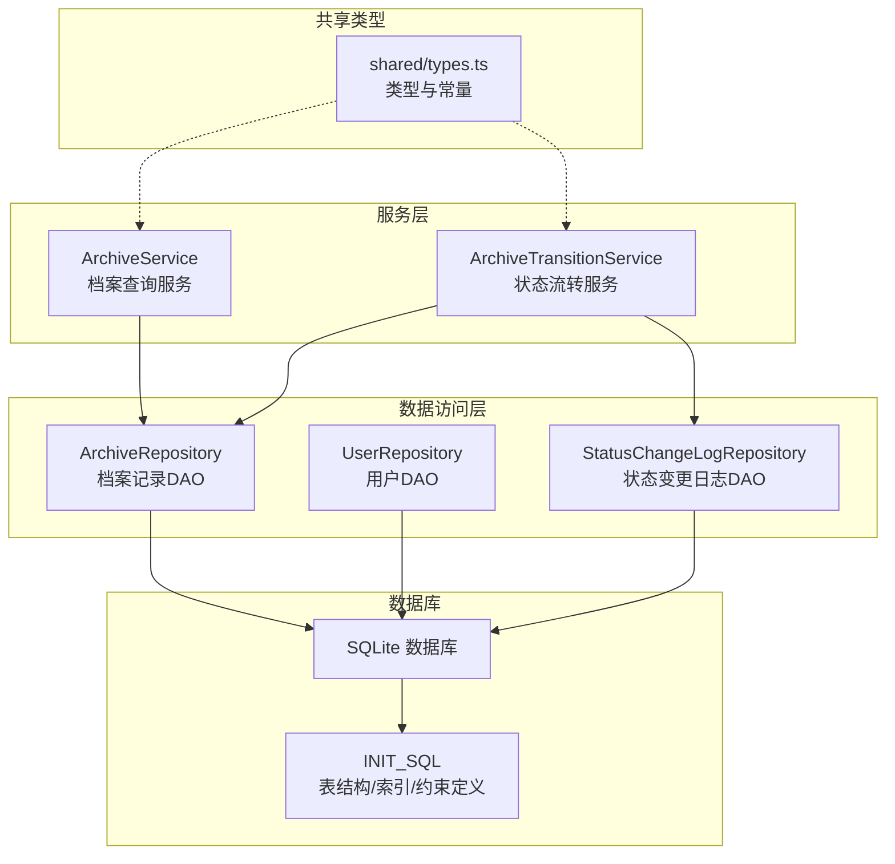
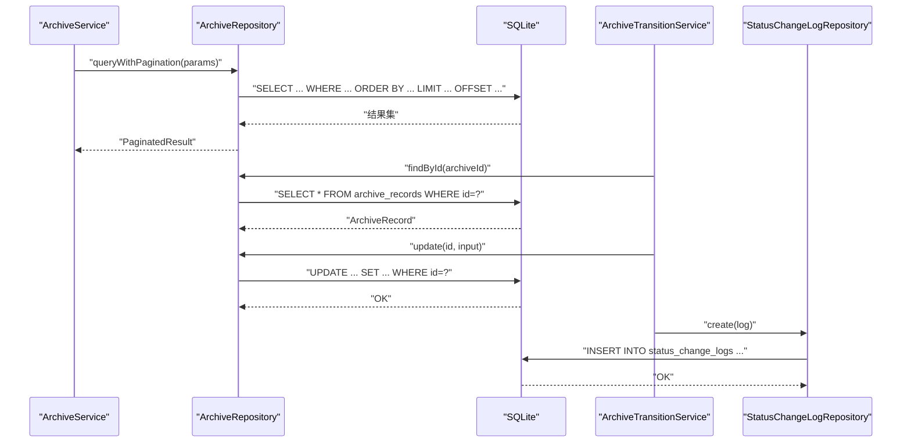
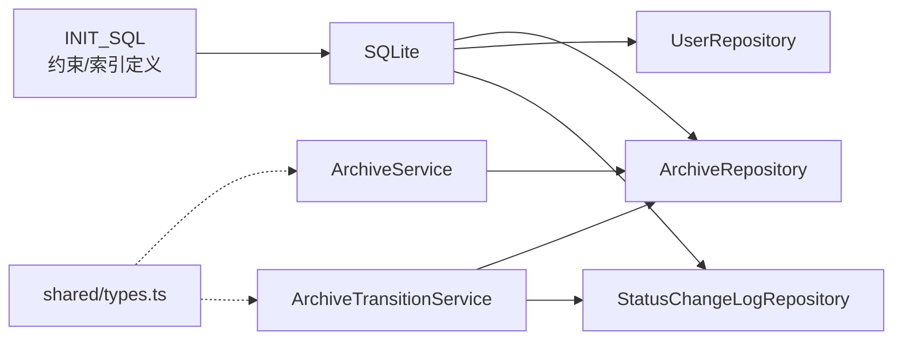

# 索引与约束

<cite>
**本文引用的文件**
- [backend/src/database-init.ts](file://backend/src/database-init.ts)
- [backend/src/database.ts](file://backend/src/database.ts)
- [backend/src/models/ArchiveRepository.ts](file://backend/src/models/ArchiveRepository.ts)
- [backend/src/models/UserRepository.ts](file://backend/src/models/UserRepository.ts)
- [backend/src/models/StatusChangeLogRepository.ts](file://backend/src/models/StatusChangeLogRepository.ts)
- [backend/src/services/ArchiveService.ts](file://backend/src/services/ArchiveService.ts)
- [backend/src/services/ArchiveTransitionService.ts](file://backend/src/services/ArchiveTransitionService.ts)
- [shared/types.ts](file://shared/types.ts)
- [backend/tests/unit/database.test.ts](file://backend/tests/unit/database.test.ts)
</cite>

## 目录
1. [简介](#简介)
2. [项目结构](#项目结构)
3. [核心组件](#核心组件)
4. [架构总览](#架构总览)
5. [详细组件分析](#详细组件分析)
6. [依赖关系分析](#依赖关系分析)
7. [性能考量](#性能考量)
8. [故障排查指南](#故障排查指南)
9. [结论](#结论)
10. [附录](#附录)

## 简介
本文件聚焦于数据库中索引与约束的设计与实现，围绕系统的关键字段 fund_account、branch_name、status、archive_status 等，系统阐述以下内容：
- 索引设计策略与选择性分析，以及对查询性能的影响
- CHECK 约束的应用场景与业务规则验证
- PRIMARY KEY、UNIQUE、FOREIGN KEY 约束的作用与实现原理
- 索引的选择性分析与查询性能优化建议
- 索引维护与重建的最佳实践
- 约束冲突的处理策略与错误处理机制
- 数据库完整性约束对业务数据质量的保障作用

## 项目结构
本项目采用分层架构，数据库初始化脚本集中定义表结构、约束与索引；各模型层负责数据访问；服务层封装业务流程；共享类型定义统一前后端契约。

图表来源
- [backend/src/database-init.ts:8-65](file://backend/src/database-init.ts#L8-L65)
- [backend/src/database.ts:25-52](file://backend/src/database.ts#L25-L52)
- [backend/src/models/ArchiveRepository.ts:85-307](file://backend/src/models/ArchiveRepository.ts#L85-L307)
- [backend/src/models/UserRepository.ts:31-56](file://backend/src/models/UserRepository.ts#L31-L56)
- [backend/src/models/StatusChangeLogRepository.ts:49-99](file://backend/src/models/StatusChangeLogRepository.ts#L49-L99)
- [backend/src/services/ArchiveService.ts:19-71](file://backend/src/services/ArchiveService.ts#L19-L71)
- [backend/src/services/ArchiveTransitionService.ts:24-156](file://backend/src/services/ArchiveTransitionService.ts#L24-L156)
- [shared/types.ts:46-83](file://shared/types.ts#L46-L83)

章节来源
- [backend/src/database-init.ts:8-65](file://backend/src/database-init.ts#L8-L65)
- [backend/src/database.ts:25-52](file://backend/src/database.ts#L25-L52)

## 核心组件
- 数据库初始化与约束定义：集中于初始化脚本，定义表结构、主键、唯一、检查约束与索引。
- 数据访问层：ArchiveRepository、UserRepository、StatusChangeLogRepository 提供 CRUD 与查询能力。
- 服务层：ArchiveService 负责查询与分页；ArchiveTransitionService 负责状态流转与日志记录。
- 共享类型：统一状态枚举、查询参数与响应结构，确保约束值在运行时也受控。

章节来源
- [backend/src/database-init.ts:8-65](file://backend/src/database-init.ts#L8-L65)
- [backend/src/models/ArchiveRepository.ts:85-307](file://backend/src/models/ArchiveRepository.ts#L85-L307)
- [backend/src/models/UserRepository.ts:31-56](file://backend/src/models/UserRepository.ts#L31-L56)
- [backend/src/models/StatusChangeLogRepository.ts:49-99](file://backend/src/models/StatusChangeLogRepository.ts#L49-L99)
- [backend/src/services/ArchiveService.ts:19-71](file://backend/src/services/ArchiveService.ts#L19-L71)
- [backend/src/services/ArchiveTransitionService.ts:24-156](file://backend/src/services/ArchiveTransitionService.ts#L24-L156)
- [shared/types.ts:14-31](file://shared/types.ts#L14-L31)

## 架构总览
下图展示数据库层与业务层之间的交互，重点体现约束与索引如何支撑查询与事务一致性。

图表来源
- [backend/src/services/ArchiveService.ts:33-69](file://backend/src/services/ArchiveService.ts#L33-L69)
- [backend/src/models/ArchiveRepository.ts:228-305](file://backend/src/models/ArchiveRepository.ts#L228-L305)
- [backend/src/services/ArchiveTransitionService.ts:46-125](file://backend/src/services/ArchiveTransitionService.ts#L46-L125)
- [backend/src/models/StatusChangeLogRepository.ts:56-97](file://backend/src/models/StatusChangeLogRepository.ts#L56-L97)

## 详细组件分析

### 数据库表结构与约束
- users 表
  - 主键：id
  - 唯一：username
  - 检查：role ∈ {'operator','branch','general_affairs'}
- archive_records 表
  - 主键：id
  - 唯一：fund_account
  - 检查：contract_version_type ∈ {'electronic','paper'}；status ∈ 合法主流程状态集合；archive_status 默认值与检查
- status_change_logs 表
  - 主键：id
  - 外键：archive_id 引用 archive_records(id)，启用外键约束
- 索引
  - archive_records：fund_account、branch_name、status、archive_status、contract_version_type
  - status_change_logs：archive_id

章节来源
- [backend/src/database-init.ts:10-64](file://backend/src/database-init.ts#L10-L64)
- [backend/src/database.ts:41-45](file://backend/src/database.ts#L41-L45)

### 索引设计策略与选择性分析
- fund_account（唯一索引）
  - 设计意图：唯一标识客户资产账户，支持快速定位与去重
  - 选择性：高，适合精确匹配查询
  - 性能影响：插入/更新受唯一约束影响，查询命中率高
- branch_name（普通索引）
  - 设计意图：按营业部过滤，支持分支机构数据隔离
  - 选择性：中等，适合精确匹配与范围查询
- status / archive_status（普通索引）
  - 设计意图：支持主流程状态与归档状态的过滤与排序
  - 选择性：中低到中等，适合多值过滤与排序
- contract_version_type（普通索引）
  - 设计意图：区分电子/纸质合同版本，便于报表与统计
  - 选择性：低到中等，适合等值过滤
- idx_archive_id（日志表索引）
  - 设计意图：按档案 ID 查询状态变更历史，支持审计追踪

章节来源
- [backend/src/database-init.ts:42-64](file://backend/src/database-init.ts#L42-L64)
- [backend/src/models/ArchiveRepository.ts:131-138](file://backend/src/models/ArchiveRepository.ts#L131-L138)
- [backend/src/models/ArchiveRepository.ts:238-266](file://backend/src/models/ArchiveRepository.ts#L238-L266)
- [backend/src/models/StatusChangeLogRepository.ts:90-97](file://backend/src/models/StatusChangeLogRepository.ts#L90-L97)

### CHECK 约束与业务规则验证
- 角色合法性：role 必须属于预定义集合
- 合同版本类型：contract_version_type 仅允许 'electronic' 或 'paper'
- 主流程状态：status 仅允许系统定义的主流程状态集合
- 归档状态：archive_status 默认值与取值集合严格控制
- 电子版合同：status 允许为 NULL，纸质合同不允许

章节来源
- [backend/src/database-init.ts:13-39](file://backend/src/database-init.ts#L13-L39)
- [shared/types.ts:14-31](file://shared/types.ts#L14-L31)
- [backend/tests/unit/database.test.ts:101-124](file://backend/tests/unit/database.test.ts#L101-L124)

### 主键、唯一、外键约束
- 主键（PRIMARY KEY）
  - users.id、archive_records.id、status_change_logs.id
- 唯一（UNIQUE）
  - users.username、archive_records.fund_account
- 外键（FOREIGN KEY）
  - status_change_logs.archive_id → archive_records.id
- 实现原理
  - SQLite 在初始化时启用外键约束；违反约束会抛出异常
  - 唯一约束保证插入/更新时的唯一性
  - 主键约束保证每行的唯一标识与非空

章节来源
- [backend/src/database-init.ts:10-60](file://backend/src/database-init.ts#L10-L60)
- [backend/src/database.ts:41-45](file://backend/src/database.ts#L41-L45)
- [backend/tests/unit/database.test.ts:138-145](file://backend/tests/unit/database.test.ts#L138-L145)

### 查询路径与索引利用
- 精确匹配查询
  - fund_account：ArchiveRepository.findByFundAccount
  - branch_name：ArchiveRepository.queryWithPagination 中的 branchName 条件
- 多条件组合查询
  - ArchiveRepository.queryWithPagination 支持 customerName、fundAccount、branchName、contractType、status、archiveStatus、contractVersionType、openDateStart/openDateEnd 等条件组合
- 分页与排序
  - 基于 created_at DESC 的分页查询，避免全表扫描
- 日志查询
  - StatusChangeLogRepository.findByArchiveId 按 archive_id 查询日志

章节来源
- [backend/src/models/ArchiveRepository.ts:131-138](file://backend/src/models/ArchiveRepository.ts#L131-L138)
- [backend/src/models/ArchiveRepository.ts:228-305](file://backend/src/models/ArchiveRepository.ts#L228-L305)
- [backend/src/models/StatusChangeLogRepository.ts:90-97](file://backend/src/models/StatusChangeLogRepository.ts#L90-L97)

### 状态流转与约束联动
- ArchiveTransitionService 执行状态流转时：
  - 先校验状态机合法性
  - 更新对应状态字段（status 或 archive_status）
  - 记录主变更与副作用变更的日志
- 外键约束保障日志与档案记录的一致性

章节来源
- [backend/src/services/ArchiveTransitionService.ts:46-125](file://backend/src/services/ArchiveTransitionService.ts#L46-L125)
- [backend/src/models/StatusChangeLogRepository.ts:56-97](file://backend/src/models/StatusChangeLogRepository.ts#L56-L97)

### 约束冲突处理与错误处理机制
- 违反 CHECK 约束：插入/更新时抛出异常，阻止非法值进入数据库
- 违反 UNIQUE 约束：重复 fund_account 抛出异常
- 违反 FOREIGN KEY 约束：引用不存在的 archive_id 抛出异常
- 服务层返回结构化错误：ArchiveTransitionService 返回 {success, record?, message?}

章节来源
- [backend/tests/unit/database.test.ts:101-145](file://backend/tests/unit/database.test.ts#L101-L145)
- [backend/src/services/ArchiveTransitionService.ts:53-71](file://backend/src/services/ArchiveTransitionService.ts#L53-L71)

### 索引维护与重建最佳实践
- 维护策略
  - 定期评估索引选择性与使用频率，删除低效索引
  - 对热点查询字段保持索引，如 fund_account、branch_name、status、archive_status
  - 避免过度索引导致写入性能下降
- 重建建议
  - 在业务低峰期进行索引重建
  - 使用 SQLite 的 VACUUM 与 ANALYZE（如适用）提升统计信息准确性
- 监控手段
  - 结合查询计划（EXPLAIN QUERY PLAN）与慢查询日志评估索引效果

[本节为通用实践建议，无需特定文件引用]

## 依赖关系分析
- 数据访问层依赖数据库连接与初始化脚本
- 服务层依赖数据访问层与共享类型
- 约束与索引由初始化脚本集中定义，被各层查询与写入路径所依赖

图表来源
- [backend/src/database-init.ts:8-65](file://backend/src/database-init.ts#L8-L65)
- [backend/src/models/ArchiveRepository.ts:85-307](file://backend/src/models/ArchiveRepository.ts#L85-L307)
- [backend/src/models/UserRepository.ts:31-56](file://backend/src/models/UserRepository.ts#L31-L56)
- [backend/src/models/StatusChangeLogRepository.ts:49-99](file://backend/src/models/StatusChangeLogRepository.ts#L49-L99)
- [backend/src/services/ArchiveService.ts:19-71](file://backend/src/services/ArchiveService.ts#L19-L71)
- [backend/src/services/ArchiveTransitionService.ts:24-156](file://backend/src/services/ArchiveTransitionService.ts#L24-L156)
- [shared/types.ts:46-83](file://shared/types.ts#L46-L83)

## 性能考量
- 索引选择性与查询效率
  - 高选择性字段（如 fund_account）适合精确匹配，命中率高
  - 中等选择性字段（如 branch_name、status、archive_status）适合多值过滤
- 写入性能权衡
  - 唯一索引与外键约束带来更强一致性，但会增加写入成本
- 分页与排序
  - 基于 created_at 的分页减少排序开销，避免全表扫描
- 约束带来的收益
  - 通过 CHECK/UNIQUE/FOREIGN KEY 在写入阶段拦截脏数据，降低后续清洗成本

[本节为通用性能讨论，无需特定文件引用]

## 故障排查指南
- 插入失败：违反 CHECK 约束
  - 现象：插入时抛出异常
  - 排查：检查 role、contract_version_type、status、archive_status 是否在允许集合内
- 插入失败：违反 UNIQUE 约束
  - 现象：重复 fund_account 导致异常
  - 排查：确认资金账号是否已存在
- 外键约束失败
  - 现象：status_change_logs 引用不存在的 archive_id
  - 排查：先创建档案记录再写入日志
- 查询性能问题
  - 现象：多条件组合查询慢
  - 排查：确认相关字段是否建立索引；检查查询条件是否能利用现有索引

章节来源
- [backend/tests/unit/database.test.ts:101-145](file://backend/tests/unit/database.test.ts#L101-L145)
- [backend/src/models/ArchiveRepository.ts:228-305](file://backend/src/models/ArchiveRepository.ts#L228-L305)

## 结论
本系统通过明确的表结构、约束与索引设计，实现了对关键业务字段（fund_account、branch_name、status、archive_status）的高效查询与强一致保障。CHECK/UNIQUE/FOREIGN KEY 约束在写入阶段即拦截非法数据，显著提升了数据质量；针对高频查询字段的索引设计有效降低了查询延迟。结合合理的索引维护策略与错误处理机制，系统在性能与可靠性之间取得了良好平衡。

[本节为总结性内容，无需特定文件引用]

## 附录
- 关键字段与索引映射
  - fund_account：唯一索引，支持精确匹配
  - branch_name：普通索引，支持精确匹配与过滤
  - status：普通索引，支持主流程状态过滤
  - archive_status：普通索引，支持归档状态过滤
  - contract_version_type：普通索引，支持合同版本过滤
  - archive_id：日志表索引，支持按档案查询日志
- 业务规则要点
  - role、contract_version_type、status、archive_status 的取值集合由 CHECK 约束严格限定
  - 电子版合同的 status 可为 NULL，纸质合同不允许

章节来源
- [backend/src/database-init.ts:42-64](file://backend/src/database-init.ts#L42-L64)
- [backend/src/database-init.ts:13-39](file://backend/src/database-init.ts#L13-L39)
- [shared/types.ts:14-31](file://shared/types.ts#L14-L31)