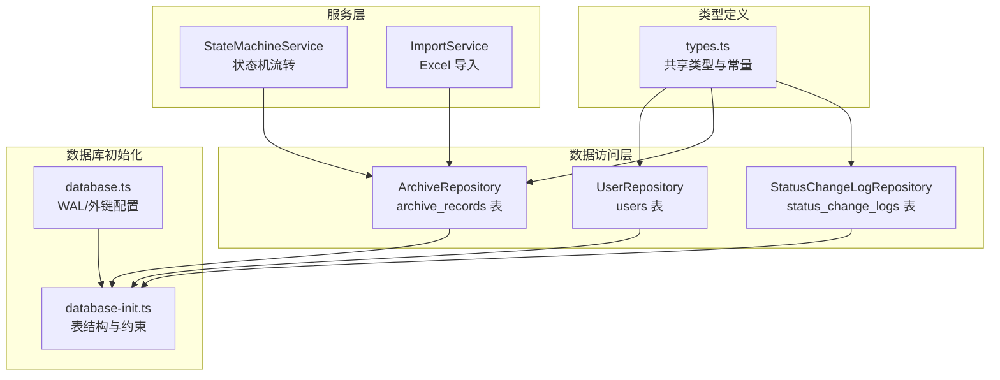
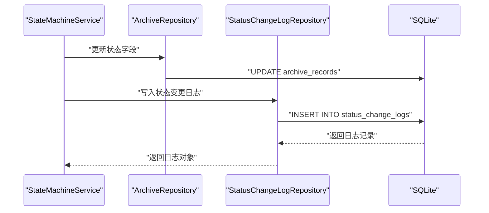
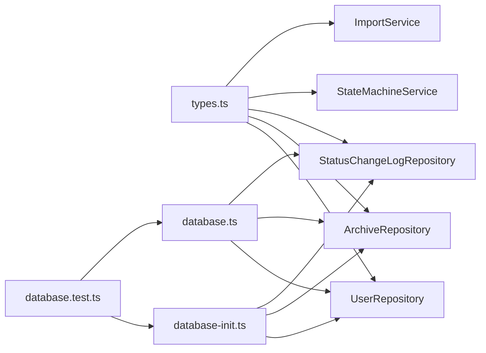

# 表结构设计

<cite>
**本文引用的文件**
- [database-init.ts](file://backend/src/database-init.ts)
- [database.ts](file://backend/src/database.ts)
- [types.ts](file://shared/types.ts)
- [UserRepository.ts](file://backend/src/models/UserRepository.ts)
- [ArchiveRepository.ts](file://backend/src/models/ArchiveRepository.ts)
- [StatusChangeLogRepository.ts](file://backend/src/models/StatusChangeLogRepository.ts)
- [StateMachineService.ts](file://backend/src/services/StateMachineService.ts)
- [ImportService.ts](file://backend/src/services/ImportService.ts)
- [database.test.ts](file://backend/tests/unit/database.test.ts)
</cite>

## 目录
1. [简介](#简介)
2. [项目结构](#项目结构)
3. [核心组件](#核心组件)
4. [架构概览](#架构概览)
5. [详细组件分析](#详细组件分析)
6. [依赖分析](#依赖分析)
7. [性能考虑](#性能考虑)
8. [故障排查指南](#故障排查指南)
9. [结论](#结论)

## 简介
本文档系统性地阐述档案管理系统的三张核心表结构设计，包括 users、archive_records、status_change_logs 的字段定义、数据类型选择、约束条件与业务用途。重点说明：
- 主键设计原则与唯一性约束
- CHECK 约束在替代 ENUM 方面的应用与优势
- 表间关系设计，特别是 archive_records 与 status_change_logs 的外键关联
- TEXT 类型替代 ENUM 的设计决策及其带来的灵活性
- 字段说明、取值范围与业务含义
- 索引设计策略与性能考量

## 项目结构
围绕表结构设计，系统采用分层架构：
- 数据访问层（Models）：封装对 users、archive_records、status_change_logs 的 CRUD 与查询
- 服务层（Services）：封装业务规则，如状态机流转、导入校验等
- 类型定义（Shared Types）：前后端共享的类型与常量集合，确保一致性
- 数据库初始化（Init SQL）：集中定义表结构、约束与索引
- 测试（Tests）：验证表结构、约束与索引的正确性



图表来源
- [database-init.ts:1-65](file://backend/src/database-init.ts#L1-L65)
- [database.ts:1-87](file://backend/src/database.ts#L1-L87)
- [types.ts:1-289](file://shared/types.ts#L1-L289)
- [UserRepository.ts:1-56](file://backend/src/models/UserRepository.ts#L1-L56)
- [ArchiveRepository.ts:1-307](file://backend/src/models/ArchiveRepository.ts#L1-L307)
- [StatusChangeLogRepository.ts:1-99](file://backend/src/models/StatusChangeLogRepository.ts#L1-L99)
- [StateMachineService.ts:1-253](file://backend/src/services/StateMachineService.ts#L1-L253)
- [ImportService.ts:1-146](file://backend/src/services/ImportService.ts#L1-L146)

章节来源
- [database-init.ts:1-65](file://backend/src/database-init.ts#L1-L65)
- [database.ts:1-87](file://backend/src/database.ts#L1-L87)
- [types.ts:1-289](file://shared/types.ts#L1-L289)

## 核心组件
本节聚焦三张核心表的字段定义、约束与业务用途。

- users 表
  - 设计目的：存储系统用户信息，支持认证与权限控制
  - 主键：id（TEXT）
  - 唯一性：username（UNIQUE）
  - 检查约束：role ∈ {'operator','branch','general_affairs'}
  - 其他：branch_name 可空；created_at 默认当前时间
  - 业务含义：用户标识、登录凭据、角色与所属营业部

- archive_records 表
  - 设计目的：存储档案记录的主数据，包含双状态字段以覆盖主流程与归档流程
  - 主键：id（TEXT）
  - 唯一性：fund_account（UNIQUE）
  - 检查约束：
    - contract_version_type ∈ {'electronic','paper'}
    - status ∈ {合法主流程状态集合}
    - archive_status ∈ {合法归档状态集合}
  - 默认值：archive_status 默认 'archive_not_started'
  - 其他：created_at/updated_at 默认当前时间；scan_file_url 可空
  - 业务含义：客户信息、合同关键属性、状态与时间戳

- status_change_logs 表
  - 设计目的：记录状态变更历史，支持审计与追溯
  - 主键：id（TEXT）
  - 外键：archive_id 引用 archive_records(id)
  - 其他：operated_at 默认当前时间；记录操作人与动作
  - 业务含义：状态字段、变更前后值、触发动作与操作人

章节来源
- [database-init.ts:8-65](file://backend/src/database-init.ts#L8-L65)
- [types.ts:8-102](file://shared/types.ts#L8-L102)
- [UserRepository.ts:10-29](file://backend/src/models/UserRepository.ts#L10-L29)
- [ArchiveRepository.ts:17-48](file://backend/src/models/ArchiveRepository.ts#L17-L48)
- [StatusChangeLogRepository.ts:11-36](file://backend/src/models/StatusChangeLogRepository.ts#L11-L36)

## 架构概览
三张表通过外键建立清晰的关系：
- status_change_logs.archive_id → archive_records.id
- users 与档案记录无直接外键关联，但通过业务逻辑（如操作人）间接关联

```mermaid
erDiagram
USERS {
text id PK
text username UK
text password_hash
text role CK
text branch_name
text created_at
}
ARCHIVE_RECORDS {
text id PK
text customer_name
text fund_account UK
text branch_name
text contract_type
text open_date
text contract_version_type CK
text status CK
text archive_status CK
text scan_file_url
text created_at
text updated_at
}
STATUS_CHANGE_LOGS {
text id PK
text archive_id FK
text status_field
text previous_value
text new_value
text action
text operator_id
text operator_name
text operated_at
}
USERS ||--o{ STATUS_CHANGE_LOGS : "操作人"
ARCHIVE_RECORDS ||--o{ STATUS_CHANGE_LOGS : "状态变更历史"
```

图表来源
- [database-init.ts:10-60](file://backend/src/database-init.ts#L10-L60)
- [types.ts:75-83](file://shared/types.ts#L75-L83)
- [types.ts:46-60](file://shared/types.ts#L46-L60)
- [types.ts:62-73](file://shared/types.ts#L62-L73)

## 详细组件分析

### users 表设计
- 字段与约束
  - id：TEXT 主键，UUID 字符串
  - username：TEXT NOT NULL UNIQUE，用户名唯一
  - password_hash：TEXT NOT NULL，密码哈希
  - role：TEXT NOT NULL CHECK(role IN ...)，枚举值限定
  - branch_name：TEXT 可空，所属营业部
  - created_at：TEXT DEFAULT datetime('now')
- 设计要点
  - 使用 TEXT 替代 ENUM，CHECK 约束保证取值合法
  - username 唯一性确保登录唯一性
  - created_at 记录账户创建时间
- 业务用途
  - 用户认证与授权的基础数据
  - 与状态变更日志中的 operator_id/operator_name 关联

章节来源
- [database-init.ts:10-17](file://backend/src/database-init.ts#L10-L17)
- [types.ts:75-83](file://shared/types.ts#L75-L83)
- [UserRepository.ts:10-29](file://backend/src/models/UserRepository.ts#L10-L29)

### archive_records 表设计
- 字段与约束
  - id：TEXT 主键
  - customer_name/fund_account/branch_name/contract_type/open_date：均为 NOT NULL
  - fund_account：UNIQUE，资金账号唯一
  - contract_version_type：CHECK IN {'electronic','paper'}，区分电子版与纸质版
  - status：CHECK IN 主流程状态集合，电子版合同可为 NULL
  - archive_status：NOT NULL DEFAULT 'archive_not_started'，CHECK IN 归档状态集合
  - scan_file_url：TEXT 可空
  - created_at/updated_at：默认当前时间
- 设计要点
  - 双状态字段设计：status（主流程）+ archive_status（归档流程）
  - 电子版合同特殊处理：status 为 NULL，archive_status 直接设为 'archived'
  - 通过 UNIQUE 约束保证业务唯一性
- 业务用途
  - 存储档案主数据与状态
  - 支持导入、查询与状态流转

章节来源
- [database-init.ts:19-40](file://backend/src/database-init.ts#L19-L40)
- [types.ts:46-60](file://shared/types.ts#L46-L60)
- [ImportService.ts:112-124](file://backend/src/services/ImportService.ts#L112-L124)
- [ArchiveRepository.ts:17-48](file://backend/src/models/ArchiveRepository.ts#L17-L48)

### status_change_logs 表设计
- 字段与约束
  - id：TEXT 主键
  - archive_id：NOT NULL REFERENCES archive_records(id)，外键约束
  - status_field：NOT NULL，变更的状态字段名（'status'/'archive_status'）
  - previous_value/new_value：可空/非空，变更前后值
  - action：NOT NULL，触发操作
  - operator_id/operator_name：NOT NULL，操作人信息
  - operated_at：DEFAULT datetime('now')
- 设计要点
  - 外键约束确保日志与档案记录强关联
  - 记录操作人与时间，便于审计
- 业务用途
  - 审计追踪：记录每次状态变更的触发者、时间与值变化
  - 与状态机服务配合，生成变更日志

章节来源
- [database-init.ts:49-64](file://backend/src/database-init.ts#L49-L64)
- [types.ts:62-73](file://shared/types.ts#L62-L73)
- [StatusChangeLogRepository.ts:11-36](file://backend/src/models/StatusChangeLogRepository.ts#L11-L36)

### 表间关系与外键设计
- archive_records 与 status_change_logs
  - 外键：status_change_logs.archive_id → archive_records.id
  - 作用：确保日志仅指向存在的档案记录，防止悬挂引用
- users 与 status_change_logs
  - 无直接外键，但通过 operator_id/operator_name 与用户关联
  - 业务上用于审计与溯源



图表来源
- [StateMachineService.ts:96-142](file://backend/src/services/StateMachineService.ts#L96-L142)
- [ArchiveRepository.ts:140-174](file://backend/src/models/ArchiveRepository.ts#L140-L174)
- [StatusChangeLogRepository.ts:56-79](file://backend/src/models/StatusChangeLogRepository.ts#L56-L79)

章节来源
- [StateMachineService.ts:96-142](file://backend/src/services/StateMachineService.ts#L96-L142)
- [ArchiveRepository.ts:140-174](file://backend/src/models/ArchiveRepository.ts#L140-L174)
- [StatusChangeLogRepository.ts:56-79](file://backend/src/models/StatusChangeLogRepository.ts#L56-L79)

### TEXT 类型替代 ENUM 的设计决策与优势
- 决策依据
  - SQLite 不原生支持 ENUM，使用 TEXT + CHECK 约束实现枚举效果
- 优势
  - 更高的灵活性：新增状态值无需迁移数据库结构
  - 更易维护：业务扩展时只需更新 CHECK 约束与前端常量
  - 更强的表达能力：可结合业务规则进行复杂校验
- 实践体现
  - users.role、archive_records.contract_version_type、archive_records.status、archive_records.archive_status 均采用该策略
  - 测试用例验证了 CHECK 约束的有效性与非法值拒绝

章节来源
- [database-init.ts:14](file://backend/src/database-init.ts#L14)
- [database-init.ts:27](file://backend/src/database-init.ts#L27)
- [database-init.ts:34](file://backend/src/database-init.ts#L34)
- [database.test.ts:101-124](file://backend/tests/unit/database.test.ts#L101-L124)

### 字段说明、取值范围与业务含义
- users
  - id：用户唯一标识
  - username：登录名，唯一
  - password_hash：密码哈希
  - role：用户角色，operator/branch/general_affairs
  - branch_name：所属营业部
  - created_at：创建时间
- archive_records
  - id：档案记录唯一标识
  - customer_name：客户姓名
  - fund_account：资金账号，唯一
  - branch_name：营业部
  - contract_type：合同类型
  - open_date：开户日期（YYYY-MM-DD）
  - contract_version_type：合同版本类型，electronic/paper
  - status：主流程状态，电子版为 NULL，完结为 'completed'
  - archive_status：归档状态，归档未开始/待转交/待归档/已归档
  - scan_file_url：扫描件 URL
  - created_at/updated_at：创建与更新时间
- status_change_logs
  - id：日志唯一标识
  - archive_id：关联档案记录
  - status_field：变更字段名（'status'/'archive_status'）
  - previous_value/new_value：变更前后值
  - action：触发操作
  - operator_id/operator_name：操作人
  - operated_at：操作时间

章节来源
- [types.ts:75-83](file://shared/types.ts#L75-L83)
- [types.ts:46-60](file://shared/types.ts#L46-L60)
- [types.ts:62-73](file://shared/types.ts#L62-L73)

### 索引设计策略与性能考虑
- archive_records 表索引
  - idx_fund_account：支持资金账号唯一性与快速查询
  - idx_branch_name：按营业部过滤
  - idx_status：按主流程状态过滤
  - idx_archive_status：按归档状态过滤
  - idx_contract_version_type：按合同版本类型过滤
- status_change_logs 表索引
  - idx_archive_id：按档案 ID 查询日志
- 性能考量
  - WAL 模式提升并发读写性能
  - 外键约束保障数据完整性
  - 索引覆盖高频查询条件，减少全表扫描

章节来源
- [database-init.ts:42-48](file://backend/src/database-init.ts#L42-L48)
- [database-init.ts:62-64](file://backend/src/database-init.ts#L62-L64)
- [database.ts:41-45](file://backend/src/database.ts#L41-L45)

## 依赖分析
- 类型定义依赖
  - types.ts 提供枚举与接口，被 models 与 services 广泛使用
- 模型依赖
  - UserRepository/ArchiveRepository/StatusChangeLogRepository 依赖 database-init.ts 中的表结构定义
- 服务依赖
  - StateMachineService 依赖 ArchiveRepository 与 types.ts 常量
  - ImportService 依赖 ArchiveRepository 与 types.ts 常量
- 测试依赖
  - database.test.ts 验证表结构、索引与约束



图表来源
- [types.ts:1-289](file://shared/types.ts#L1-L289)
- [database-init.ts:1-65](file://backend/src/database-init.ts#L1-L65)
- [database.ts:1-87](file://backend/src/database.ts#L1-L87)
- [database.test.ts:1-157](file://backend/tests/unit/database.test.ts#L1-L157)

章节来源
- [types.ts:1-289](file://shared/types.ts#L1-L289)
- [database-init.ts:1-65](file://backend/src/database-init.ts#L1-L65)
- [database.ts:1-87](file://backend/src/database.ts#L1-L87)
- [database.test.ts:1-157](file://backend/tests/unit/database.test.ts#L1-L157)

## 性能考虑
- WAL 模式
  - 提升并发读写吞吐，适合多用户并发场景
- 外键约束
  - 保障参照完整性，避免脏数据
- 索引策略
  - 针对高频查询条件建立索引，降低查询成本
- 数据类型选择
  - TEXT 作为统一字符串类型，简化迁移与扩展
- 约束与校验
  - CHECK 约束与 UNIQUE 约束在写入阶段即拦截非法数据，减少后续修复成本

[本节为通用性能讨论，无需具体文件分析]

## 故障排查指南
- 插入失败（非法枚举值）
  - 现象：插入 users.role 或 archive_records.contract_version_type/status/archive_status 时抛出异常
  - 原因：CHECK 约束拒绝非法值
  - 处理：核对 types.ts 中的合法值集合，修正输入
- 唯一性冲突
  - 现象：重复资金账号导致插入失败
  - 原因：fund_account 唯一性约束
  - 处理：检查数据源，确保唯一性
- 外键约束失败
  - 现象：status_change_logs 引用不存在的 archive_id 抛出异常
  - 原因：archive_id 外键约束
  - 处理：先创建档案记录，再写入日志
- 电子版合同状态异常
  - 现象：电子版合同不应有状态变更
  - 原因：业务前置校验拒绝
  - 处理：确认合同版本类型与状态流转逻辑

章节来源
- [database.test.ts:101-145](file://backend/tests/unit/database.test.ts#L101-L145)
- [StateMachineService.ts:106-130](file://backend/src/services/StateMachineService.ts#L106-L130)

## 结论
本设计以清晰的表结构、严格的约束与合理的索引策略，支撑档案管理系统的完整业务闭环。通过 TEXT + CHECK 的替代 ENUM 设计，既满足了业务约束，又提升了扩展性与可维护性。双状态字段设计有效覆盖主流程与归档流程，外键与日志表确保了数据完整性与可追溯性。建议在后续迭代中持续关注查询热点与索引命中率，适时优化索引与查询条件。