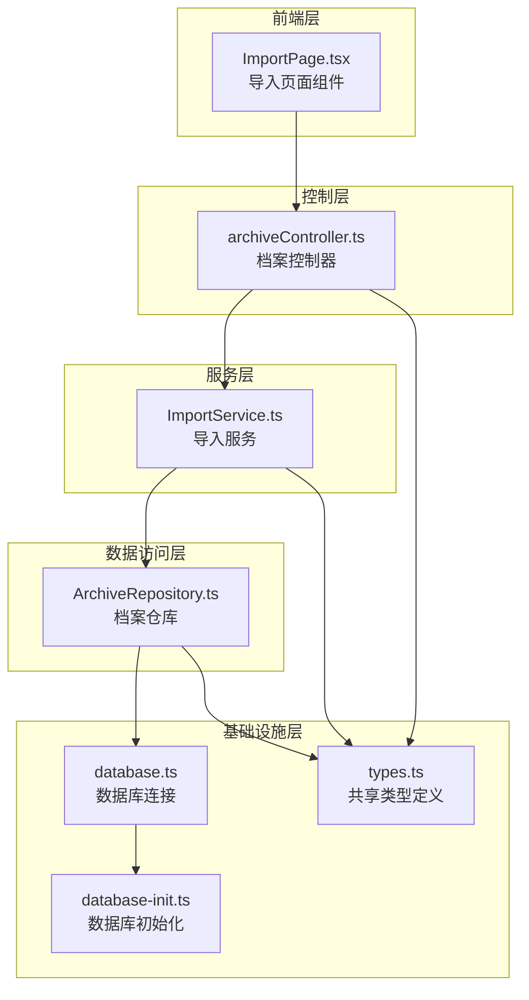
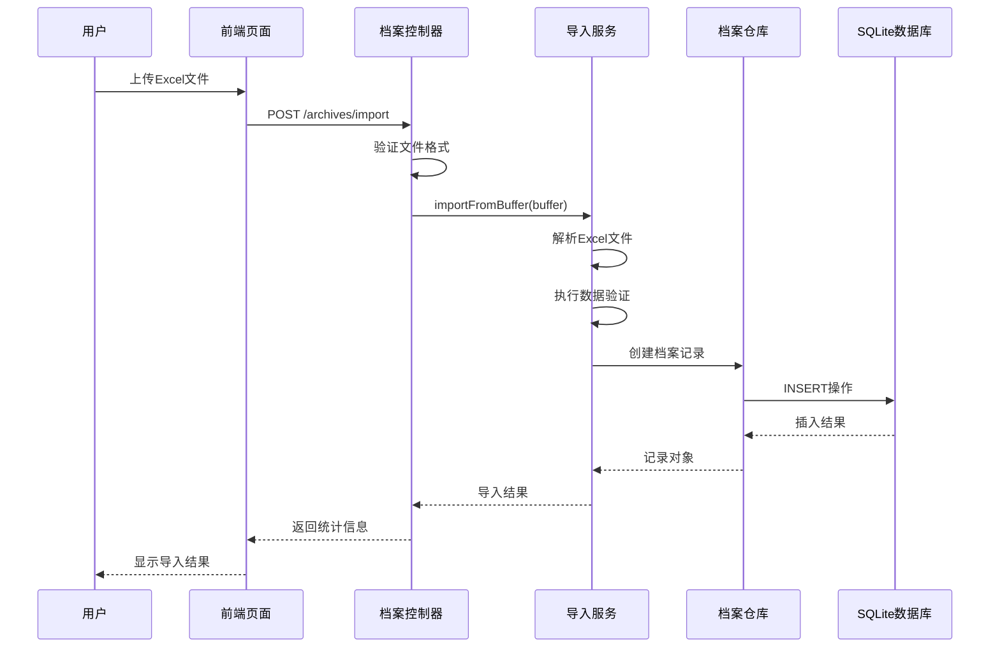
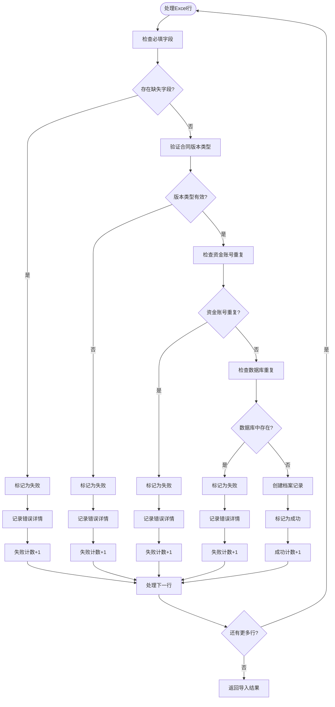
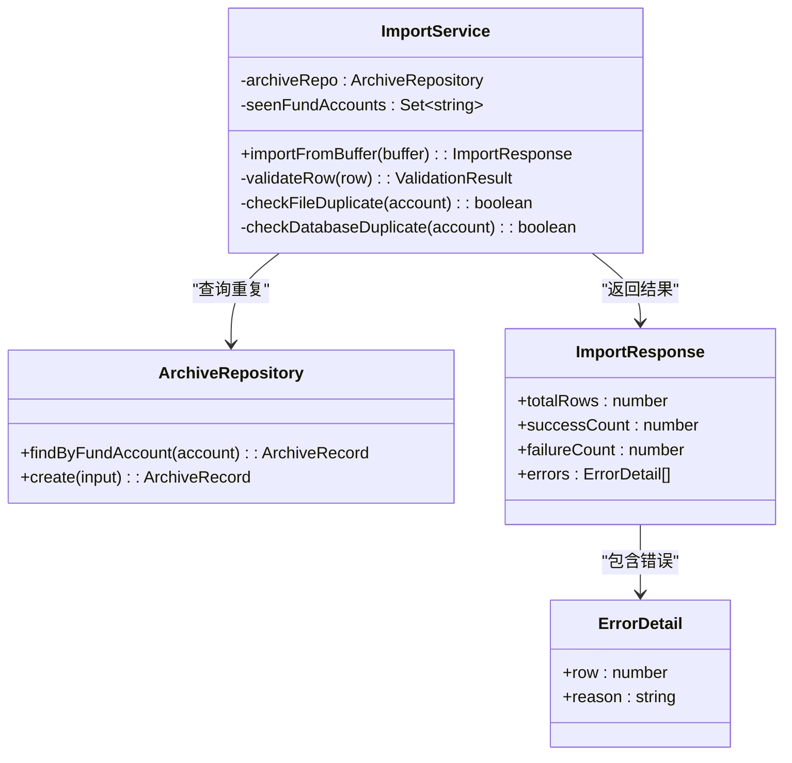
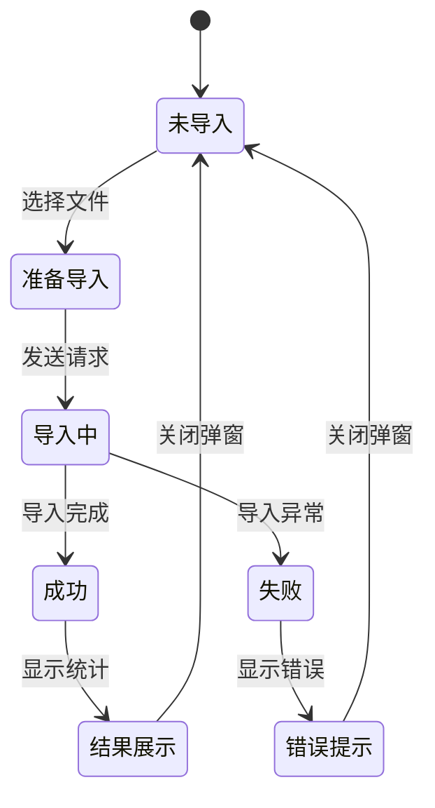
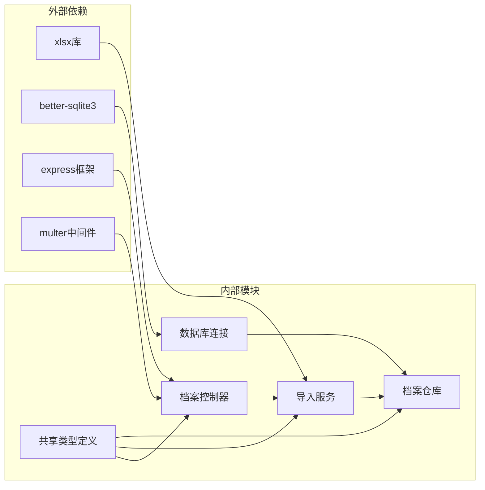

# Excel导入模块

<cite>
**本文档引用的文件**
- [ImportService.ts](file://backend/src/services/ImportService.ts)
- [archiveController.ts](file://backend/src/controllers/archiveController.ts)
- [ImportPage.tsx](file://frontend/src/pages/ImportPage.tsx)
- [ArchiveRepository.ts](file://backend/src/models/ArchiveRepository.ts)
- [types.ts](file://shared/types.ts)
- [database.ts](file://backend/src/database.ts)
- [database-init.ts](file://backend/src/database-init.ts)
- [import.test.ts](file://backend/tests/unit/import.test.ts)
- [package.json](file://backend/package.json)
</cite>

## 目录
1. [简介](#简介)
2. [项目结构](#项目结构)
3. [核心组件](#核心组件)
4. [架构概览](#架构概览)
5. [详细组件分析](#详细组件分析)
6. [依赖关系分析](#依赖关系分析)
7. [性能考虑](#性能考虑)
8. [故障排除指南](#故障排除指南)
9. [结论](#结论)

## 简介

Excel导入模块是档案管理系统中的关键功能，负责批量处理Excel文件中的档案数据。该模块实现了完整的数据导入流程，包括文件上传、格式验证、数据提取、业务规则校验、重复数据处理和结果统计等功能。系统支持纸质版和电子版两种合同类型的差异化处理，确保数据的准确性和完整性。

## 项目结构

Excel导入模块采用分层架构设计，主要包含以下层次：

**图表来源**
- [ImportPage.tsx:1-127](file://frontend/src/pages/ImportPage.tsx#L1-L127)
- [archiveController.ts:1-448](file://backend/src/controllers/archiveController.ts#L1-L448)
- [ImportService.ts:1-146](file://backend/src/services/ImportService.ts#L1-L146)
- [ArchiveRepository.ts:1-307](file://backend/src/models/ArchiveRepository.ts#L1-L307)

**章节来源**
- [ImportPage.tsx:1-127](file://frontend/src/pages/ImportPage.tsx#L1-L127)
- [archiveController.ts:1-448](file://backend/src/controllers/archiveController.ts#L1-L448)
- [ImportService.ts:1-146](file://backend/src/services/ImportService.ts#L1-L146)
- [ArchiveRepository.ts:1-307](file://backend/src/models/ArchiveRepository.ts#L1-L307)

## 核心组件

### 导入服务 (ImportService)

导入服务是模块的核心组件，负责解析Excel文件并执行数据验证和导入逻辑。其主要职责包括：

- **Excel文件解析**：使用xlsx库解析Excel文件，提取JSON格式的数据
- **数据验证**：执行必填字段检查、值域验证和重复数据检测
- **业务规则处理**：根据合同版本类型设置不同的初始状态
- **数据导入**：将验证通过的数据批量插入数据库

### 档案控制器 (archiveController)

档案控制器处理HTTP请求，协调导入流程的各个组件。主要功能包括：

- **文件格式验证**：检查上传文件的扩展名和MIME类型
- **模板下载**：生成标准的Excel导入模板文件
- **导入结果处理**：将导入服务的结果返回给前端

### 前端导入页面 (ImportPage)

前端组件提供用户界面，支持拖拽上传、模板下载和结果展示功能。

**章节来源**
- [ImportService.ts:40-146](file://backend/src/services/ImportService.ts#L40-L146)
- [archiveController.ts:43-92](file://backend/src/controllers/archiveController.ts#L43-L92)
- [ImportPage.tsx:18-127](file://frontend/src/pages/ImportPage.tsx#L18-L127)

## 架构概览

Excel导入模块采用经典的三层架构，各层职责清晰分离：

**图表来源**
- [archiveController.ts:43-71](file://backend/src/controllers/archiveController.ts#L43-L71)
- [ImportService.ts:52-144](file://backend/src/services/ImportService.ts#L52-L144)
- [ArchiveRepository.ts:93-120](file://backend/src/models/ArchiveRepository.ts#L93-L120)

## 详细组件分析

### 导入模板设计规范

导入模板遵循严格的设计规范，确保数据的一致性和准确性：

#### 模板字段映射规则

| Excel列名 | 数据库字段 | 类型 | 必填 | 说明 |
|-----------|------------|------|------|------|
| 客户姓名 | customer_name | string | ✓ | 客户真实姓名 |
| 资金账号 | fund_account | string | ✓ | 资金账户唯一标识 |
| 营业部 | branch_name | string | ✓ | 所属营业部名称 |
| 合同类型 | contract_type | string | ✓ | 合同类型描述 |
| 开户日期 | open_date | string | ✓ | YYYY-MM-DD格式 |
| 合同版本类型 | contract_version_type | enum | ✓ | 电子版/纸质版 |

#### 模板生成逻辑

**图表来源**
- [archiveController.ts:77-92](file://backend/src/controllers/archiveController.ts#L77-L92)

**章节来源**
- [archiveController.ts:28-37](file://backend/src/controllers/archiveController.ts#L28-L37)
- [archiveController.ts:77-92](file://backend/src/controllers/archiveController.ts#L77-L92)

### 数据验证逻辑

系统实施多层次的数据验证机制，确保导入数据的质量：

#### 必填字段验证

验证逻辑检查所有必需字段是否存在且非空：

**图表来源**
- [ImportService.ts:75-141](file://backend/src/services/ImportService.ts#L75-L141)

#### 业务规则验证

系统根据合同版本类型应用不同的业务规则：

| 合同版本类型 | 主流程状态 | 归档状态 | 说明 |
|-------------|------------|----------|------|
| 纸质版 | pending_shipment | archive_not_started | 需要经过完整的业务流程 |
| 电子版 | null | archived | 创建即完结 |

**章节来源**
- [ImportService.ts:112-136](file://backend/src/services/ImportService.ts#L112-L136)

### 重复数据处理机制

系统实施双重重复数据检查机制：

1. **文件内重复检查**：使用Set数据结构在当前Excel文件内检测重复的资金账号
2. **数据库重复检查**：查询现有数据库记录确保全局唯一性

**图表来源**
- [ImportService.ts:40-45](file://backend/src/services/ImportService.ts#L40-L45)
- [ArchiveRepository.ts:131-138](file://backend/src/models/ArchiveRepository.ts#L131-L138)
- [types.ts:132-141](file://shared/types.ts#L132-L141)

**章节来源**
- [ImportService.ts:68-110](file://backend/src/services/ImportService.ts#L68-L110)
- [ArchiveRepository.ts:131-138](file://backend/src/models/ArchiveRepository.ts#L131-L138)

### 导入结果统计与错误报告

系统提供详细的导入结果统计和错误报告功能：

#### 统计指标

- **总行数**：Excel文件中的总记录数量
- **成功数量**：通过验证并成功导入的记录数
- **失败数量**：验证失败或导入失败的记录数
- **错误详情**：每条失败记录的行号和具体原因

#### 错误分类

| 错误类型 | 触发条件 | 错误消息示例 |
|----------|----------|--------------|
| 缺少必填字段 | 某些必需字段为空 | "缺少必填字段: 资金账号, 营业部" |
| 合同版本类型不合法 | 版本类型不在允许范围内 | "合同版本类型不合法" |
| 资金账号重复 | 文件内或数据库中已存在 | "资金账号 FA001 在文件中重复" |
| 资金账号已存在 | 数据库中已存在该账号 | "资金账号 FA001 已存在" |

**章节来源**
- [ImportService.ts:66-144](file://backend/src/services/ImportService.ts#L66-L144)
- [types.ts:132-141](file://shared/types.ts#L132-L141)

### 前端集成与用户体验

前端组件提供直观的用户界面和良好的交互体验：

#### 功能特性

- **拖拽上传**：支持拖拽或点击选择Excel文件
- **实时状态反馈**：显示导入进度和状态信息
- **结果可视化**：以表格形式展示错误详情
- **模板下载**：一键下载标准导入模板

#### 用户界面流程

**图表来源**
- [ImportPage.tsx:18-127](file://frontend/src/pages/ImportPage.tsx#L18-L127)

**章节来源**
- [ImportPage.tsx:18-127](file://frontend/src/pages/ImportPage.tsx#L18-L127)

## 依赖关系分析

Excel导入模块的依赖关系清晰明确，各组件之间的耦合度适中：

**图表来源**
- [package.json:14-22](file://backend/package.json#L14-L22)
- [archiveController.ts:6-23](file://backend/src/controllers/archiveController.ts#L6-L23)
- [ImportService.ts:7-14](file://backend/src/services/ImportService.ts#L7-L14)

**章节来源**
- [package.json:14-22](file://backend/package.json#L14-L22)
- [archiveController.ts:6-23](file://backend/src/controllers/archiveController.ts#L6-L23)

## 性能考虑

### 内存管理策略

系统采用高效的内存管理策略处理大文件导入：

1. **流式处理**：使用xlsx库的流式API避免一次性加载整个文件
2. **增量处理**：逐行处理Excel数据，减少内存占用
3. **及时释放**：处理完每行数据后及时释放相关变量

### 数据库性能优化

1. **索引优化**：为fund_account字段建立唯一索引
2. **批量插入**：使用prepared statements进行批量数据插入
3. **WAL模式**：启用Write-Ahead Logging提升并发性能

### 并发处理

系统支持高并发场景下的稳定运行：
- 使用better-sqlite3的连接池机制
- 避免长时间持有数据库连接
- 实施适当的锁机制防止竞态条件

**章节来源**
- [database.ts:41-48](file://backend/src/database.ts#L41-L48)
- [database-init.ts:42-47](file://backend/src/database-init.ts#L42-L47)

## 故障排除指南

### 常见问题及解决方案

#### 文件格式错误

**问题症状**：上传Excel文件时报"文件格式不正确"错误

**可能原因**：
- 文件扩展名不是.xlsx或.xls
- 文件损坏或格式不兼容
- 文件被其他程序占用

**解决方法**：
1. 确认文件扩展名为.xlsx或.xls
2. 使用Excel重新保存文件
3. 关闭占用文件的程序

#### 数据验证失败

**问题症状**：导入结果显示大量验证错误

**可能原因**：
- 必填字段缺失或格式不正确
- 合同版本类型不在允许范围内
- 资金账号重复或已存在

**解决方法**：
1. 检查Excel模板中的字段格式
2. 确保所有必填字段都有有效值
3. 验证合同版本类型的有效性
4. 清理重复的或已存在的资金账号

#### 数据库连接问题

**问题症状**：导入过程中出现数据库连接错误

**可能原因**：
- 数据库文件权限不足
- 数据库文件被其他进程占用
- 磁盘空间不足

**解决方法**：
1. 检查数据库文件权限
2. 关闭占用数据库的其他进程
3. 确保有足够的磁盘空间

### 调试技巧

1. **查看导入日志**：检查服务器端的日志输出
2. **验证Excel格式**：使用Excel自带的"数据验证"功能
3. **测试小批量数据**：先导入少量数据验证流程
4. **检查网络连接**：确保前后端通信正常

**章节来源**
- [archiveController.ts:46-62](file://backend/src/controllers/archiveController.ts#L46-L62)
- [ImportService.ts:75-110](file://backend/src/services/ImportService.ts#L75-L110)

## 结论

Excel导入模块通过精心设计的架构和严格的验证机制，为档案管理系统提供了可靠的批量数据处理能力。模块具有以下优势：

1. **完整的数据验证**：多层验证确保数据质量
2. **清晰的错误报告**：详细的错误信息帮助用户快速定位问题
3. **良好的用户体验**：直观的界面和实时的状态反馈
4. **高性能设计**：合理的内存管理和数据库优化
5. **可扩展性**：模块化的架构便于功能扩展和维护

该模块为档案管理系统的数字化转型奠定了坚实的基础，能够有效提升数据录入效率和准确性。