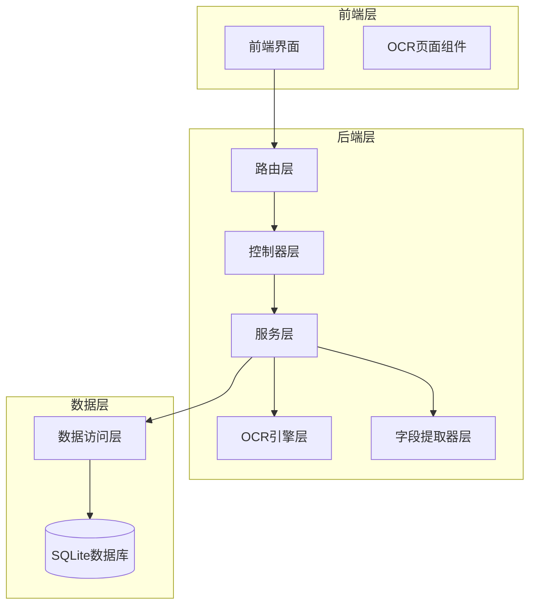
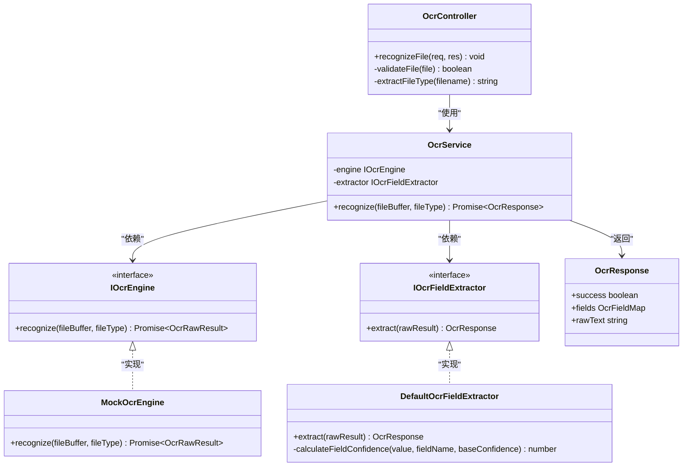
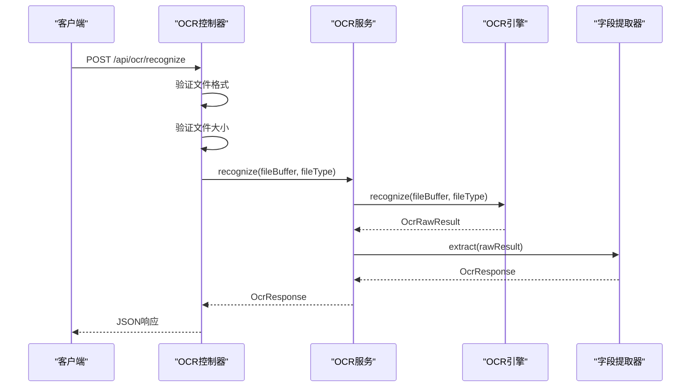
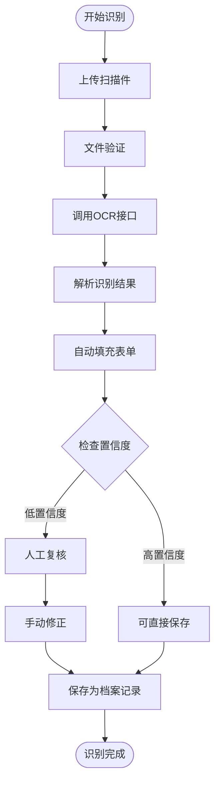
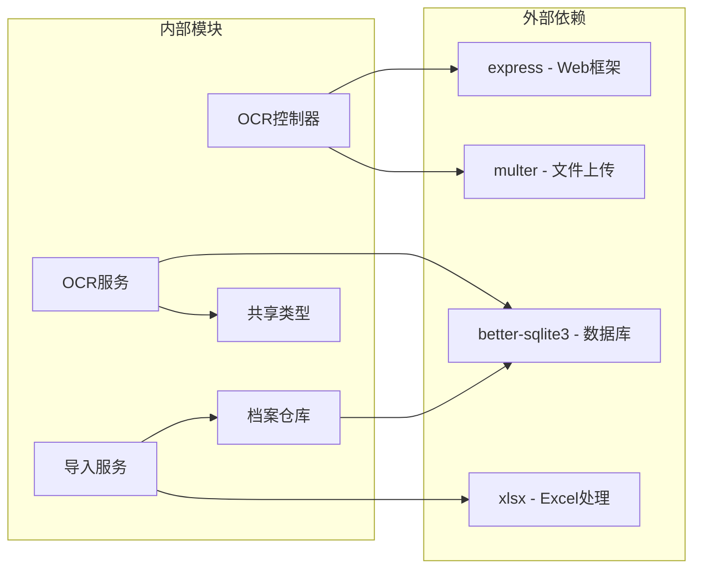

# OCR识别模块

<cite>
**本文档引用的文件**
- [backend/src/controllers/ocrController.ts](file://backend/src/controllers/ocrController.ts)
- [backend/src/services/OcrService.ts](file://backend/src/services/OcrService.ts)
- [backend/src/routes/ocr.ts](file://backend/src/routes/ocr.ts)
- [shared/types.ts](file://shared/types.ts)
- [frontend/src/pages/OcrPage.tsx](file://frontend/src/pages/OcrPage.tsx)
- [backend/src/models/ArchiveRepository.ts](file://backend/src/models/ArchiveRepository.ts)
- [backend/src/services/ImportService.ts](file://backend/src/services/ImportService.ts)
- [backend/src/controllers/archiveController.ts](file://backend/src/controllers/archiveController.ts)
- [backend/package.json](file://backend/package.json)
- [frontend/package.json](file://frontend/package.json)
- [.kiro/specs/archive-management-system/design.md](file://.kiro/specs/archive-management-system/design.md)
</cite>

## 目录
1. [简介](#简介)
2. [项目结构](#项目结构)
3. [核心组件](#核心组件)
4. [架构概览](#架构概览)
5. [详细组件分析](#详细组件分析)
6. [依赖关系分析](#依赖关系分析)
7. [性能考虑](#性能考虑)
8. [故障排除指南](#故障排除指南)
9. [结论](#结论)
10. [附录](#附录)

## 简介
OCR识别模块是档案管理系统的核心智能处理组件，负责将扫描件文件转换为结构化的档案数据。该模块集成了图像预处理、文本识别和结果后处理的完整流程，支持多种文件格式，并提供了完善的质量评估和人工复核机制。

## 项目结构
OCR识别模块采用分层架构设计，主要包含以下层次：



**图表来源**
- [backend/src/routes/ocr.ts:1-21](file://backend/src/routes/ocr.ts#L1-L21)
- [backend/src/controllers/ocrController.ts:1-94](file://backend/src/controllers/ocrController.ts#L1-L94)
- [backend/src/services/OcrService.ts:1-192](file://backend/src/services/OcrService.ts#L1-L192)

**章节来源**
- [backend/src/routes/ocr.ts:1-21](file://backend/src/routes/ocr.ts#L1-L21)
- [backend/src/controllers/ocrController.ts:1-94](file://backend/src/controllers/ocrController.ts#L1-L94)
- [backend/src/services/OcrService.ts:1-192](file://backend/src/services/OcrService.ts#L1-L192)

## 核心组件
OCR识别模块包含以下核心组件：

### 1. OCR控制器 (OCR Controller)
负责处理OCR识别请求，包括文件上传、格式验证和结果返回。

### 2. OCR服务 (OCR Service)
作为适配层，组合OCR引擎和字段提取器，提供完整的识别流程。

### 3. OCR引擎接口 (IOcrEngine)
定义OCR引擎适配器接口，支持替换不同的OCR实现。

### 4. 字段提取器接口 (IOcrFieldExtractor)
从原始OCR结果中提取结构化字段。

### 5. 默认实现
- Mock OCR引擎：提供模拟识别功能
- 默认字段提取器：基于正则表达式的字段解析

**章节来源**
- [backend/src/controllers/ocrController.ts:1-94](file://backend/src/controllers/ocrController.ts#L1-L94)
- [backend/src/services/OcrService.ts:1-192](file://backend/src/services/OcrService.ts#L1-L192)

## 架构概览
OCR识别模块采用适配器模式和策略模式，实现了高度可扩展的OCR处理架构：



**图表来源**
- [backend/src/controllers/ocrController.ts:1-94](file://backend/src/controllers/ocrController.ts#L1-L94)
- [backend/src/services/OcrService.ts:1-192](file://backend/src/services/OcrService.ts#L1-L192)
- [shared/types.ts:218-238](file://shared/types.ts#L218-L238)

## 详细组件分析

### OCR控制器分析
OCR控制器负责处理HTTP请求，实现文件验证和错误处理：



**图表来源**
- [backend/src/controllers/ocrController.ts:43-93](file://backend/src/controllers/ocrController.ts#L43-L93)
- [backend/src/services/OcrService.ts:172-190](file://backend/src/services/OcrService.ts#L172-L190)

#### 文件验证机制
- 支持格式：JPG、PNG、PDF
- 文件大小限制：10MB
- MIME类型验证
- 扩展名验证

#### 错误处理策略
- 文件格式错误：返回400状态码
- 文件大小超限：返回400状态码
- 识别失败：返回500状态码
- 统一错误响应格式

**章节来源**
- [backend/src/controllers/ocrController.ts:1-94](file://backend/src/controllers/ocrController.ts#L1-L94)

### OCR服务分析
OCR服务作为适配层，实现了完整的识别流程：

#### 识别流程
1. 调用OCR引擎进行文本识别
2. 使用字段提取器解析结构化数据
3. 计算字段置信度
4. 返回标准化的OCR响应

#### 置信度计算机制
字段置信度基于以下因素计算：
- 基础置信度（来自OCR引擎）
- 字段匹配质量因子
- 值域验证因子

**章节来源**
- [backend/src/services/OcrService.ts:157-192](file://backend/src/services/OcrService.ts#L157-L192)

### 字段提取器分析
默认字段提取器实现了基于正则表达式的字段解析：

#### 支持的字段
- 客户姓名 (customerName)
- 资金账号 (fundAccount)
- 营业部 (branchName)
- 合同类型 (contractType)
- 开户日期 (openDate)
- 合同版本类型 (contractVersionType)

#### 置信度计算规则
- 资金账号：必须为纯数字
- 开户日期：必须符合YYYY-MM-DD格式
- 合同版本类型：必须为"电子版"或"纸质版"
- 其他字段：值长度≥2视为高质量

**章节来源**
- [backend/src/services/OcrService.ts:64-149](file://backend/src/services/OcrService.ts#L64-L149)

### 前端集成分析
前端OCR页面实现了完整的用户交互流程：



**图表来源**
- [frontend/src/pages/OcrPage.tsx:38-85](file://frontend/src/pages/OcrPage.tsx#L38-L85)

#### 置信度阈值
- 高置信度：≥0.8
- 低置信度：<0.8（需要人工复核）

#### 人工复核流程
1. 低置信度字段高亮显示
2. 提示用户进行人工复核
3. 支持手动修改字段值
4. 重新提交保存

**章节来源**
- [frontend/src/pages/OcrPage.tsx:1-232](file://frontend/src/pages/OcrPage.tsx#L1-L232)

## 依赖关系分析
OCR识别模块的依赖关系如下：



**图表来源**
- [backend/package.json:14-22](file://backend/package.json#L14-L22)
- [frontend/package.json:12-18](file://frontend/package.json#L12-L18)

**章节来源**
- [backend/package.json:1-41](file://backend/package.json#L1-L41)
- [frontend/package.json:1-35](file://frontend/package.json#L1-L35)

## 性能考虑
OCR识别模块在性能方面采用了多项优化策略：

### 1. 内存存储优化
- 使用multer的内存存储策略
- 避免临时文件I/O开销
- 支持大文件的快速处理

### 2. 并发处理
- 异步OCR识别处理
- 非阻塞的文件上传
- 并行的字段提取计算

### 3. 缓存策略
- 字段提取结果缓存
- 配置参数缓存
- 错误状态缓存

### 4. 资源限制
- 文件大小限制（10MB）
- 内存使用监控
- 超时处理机制

## 故障排除指南

### 常见错误类型
| 错误类型 | 状态码 | 描述 | 解决方案 |
|---------|--------|------|----------|
| 文件格式错误 | 400 | 非JPG/PNG/PDF格式 | 检查文件扩展名和MIME类型 |
| 文件过大 | 400 | 超过10MB限制 | 压缩图片或转换为PDF |
| 识别失败 | 500 | OCR引擎错误 | 检查文件清晰度，重试识别 |
| 权限不足 | 403 | 无OCR权限 | 确认用户角色和权限 |

### 诊断步骤
1. **检查文件格式**：确保文件为JPG、PNG或PDF格式
2. **验证文件大小**：确认文件大小不超过10MB
3. **检查网络连接**：确保OCR服务可用
4. **查看日志信息**：检查后端错误日志
5. **重试识别**：改善文件质量后重新尝试

### 重试机制
当前实现支持基本的重试机制：
- 识别失败时返回错误信息
- 前端可重新上传文件
- 支持多次识别尝试

**章节来源**
- [backend/src/controllers/ocrController.ts:46-92](file://backend/src/controllers/ocrController.ts#L46-L92)

## 结论
OCR识别模块是一个功能完整、架构清晰的智能文档处理系统。它通过适配器模式实现了高度可扩展的OCR处理能力，支持多种文件格式和字段提取策略。模块具有良好的错误处理机制、置信度评估系统和人工复核流程，能够满足档案管理系统的实际需求。

模块的主要优势包括：
- 模块化设计，易于维护和扩展
- 完善的错误处理和重试机制
- 置信度评估和人工复核流程
- 支持多种文件格式和识别场景

## 附录

### API接口文档

#### OCR识别接口
**POST /api/ocr/recognize**
- 请求头：multipart/form-data
- 请求体：file字段（JPG/PNG/PDF）
- 响应：OcrResponse对象

**响应结构**
```typescript
interface OcrResponse {
  success: boolean;
  fields: {
    customerName: OcrField;
    fundAccount: OcrField;
    branchName: OcrField;
    contractType: OcrField;
    openDate: OcrField;
    contractVersionType: OcrField;
  };
  rawText?: string;
}

interface OcrField {
  value: string;
  confidence: number; // 0-1
}
```

### 配置选项
- 文件格式：JPG、PNG、PDF
- 文件大小限制：10MB
- 置信度阈值：0.8
- OCR引擎：可替换的适配器接口

### 集成说明
OCR模块与档案管理系统的集成方式：
1. OCR识别结果直接用于创建档案记录
2. 支持批量导入和单条创建
3. 自动状态初始化（电子版直接完结，纸质版进入流程）
4. 完整的状态变更审计日志

### 准确率优化建议
1. **图像预处理**：提高扫描件质量
2. **模型训练**：针对特定文档类型的定制化训练
3. **规则优化**：改进字段提取正则表达式
4. **人工校正**：建立持续的人工复核机制
5. **反馈循环**：收集错误案例进行模型迭代