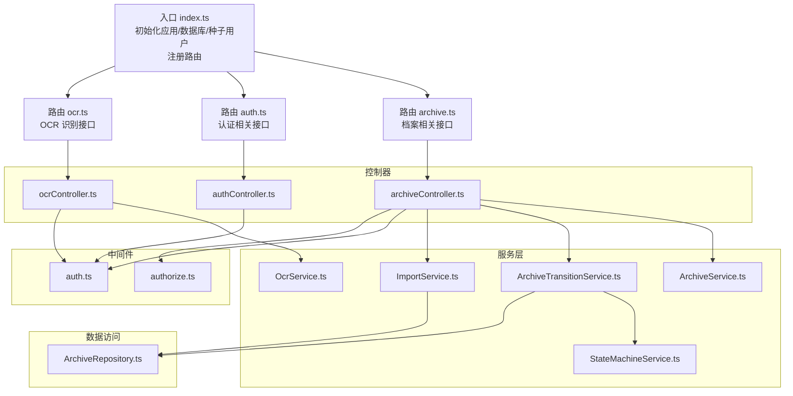
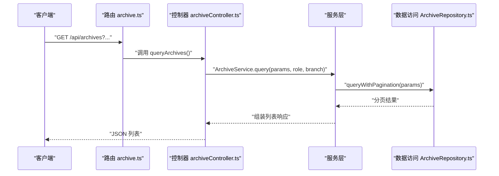
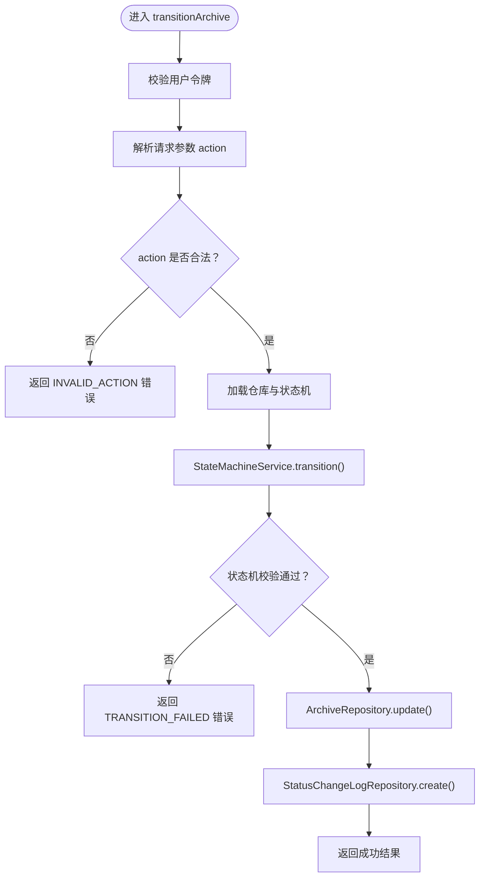
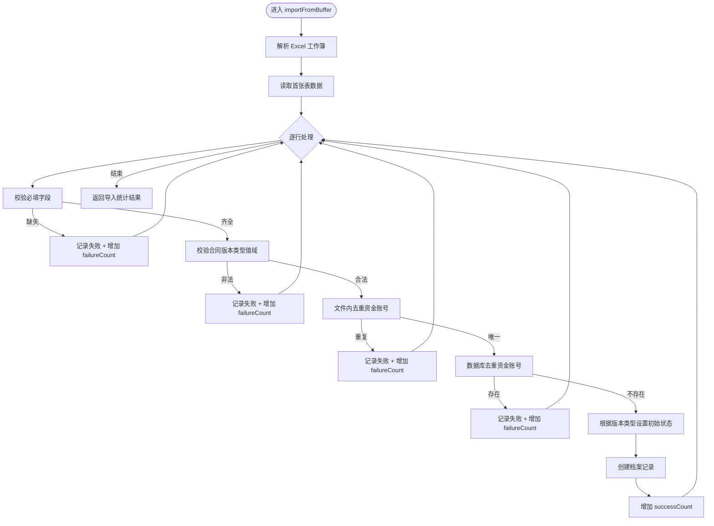
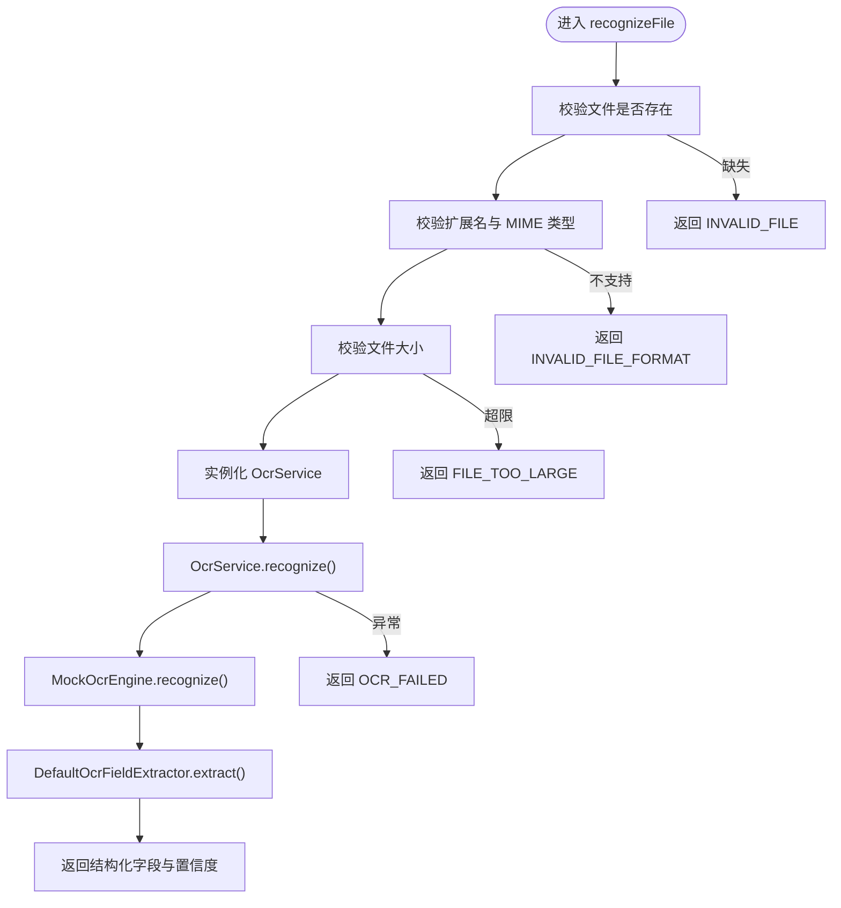
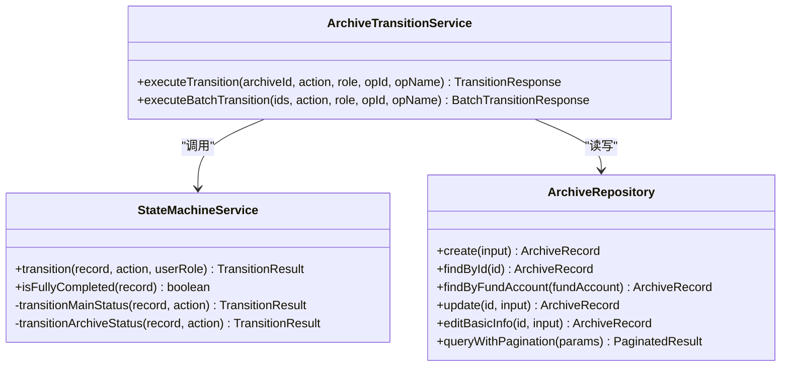
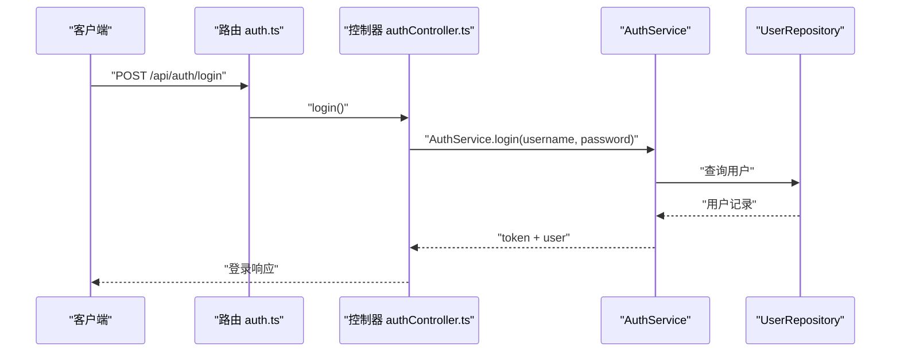
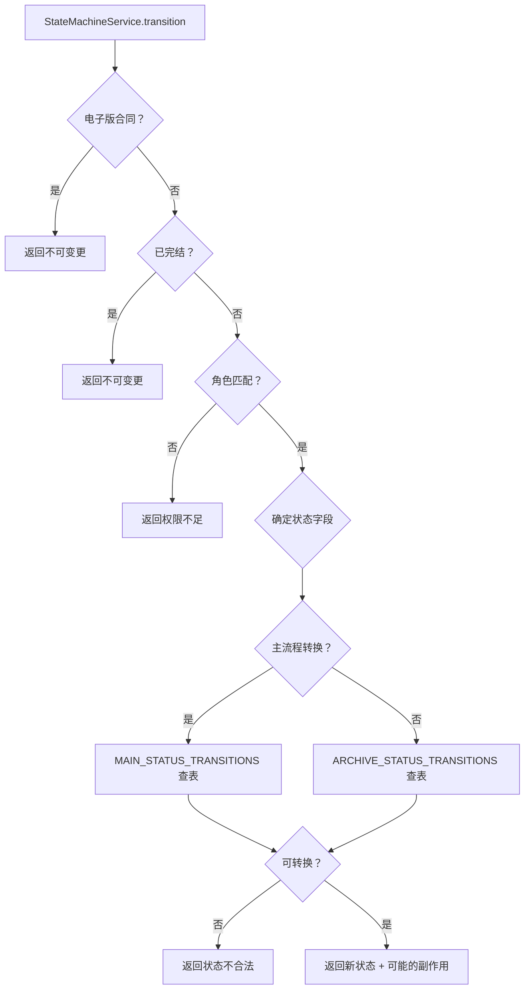
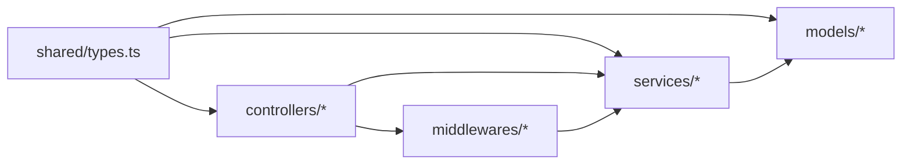

# 核心功能模块

<cite>
**本文引用的文件**
- [backend/src/index.ts](file://backend/src/index.ts)
- [backend/src/controllers/archiveController.ts](file://backend/src/controllers/archiveController.ts)
- [backend/src/controllers/authController.ts](file://backend/src/controllers/authController.ts)
- [backend/src/controllers/ocrController.ts](file://backend/src/controllers/ocrController.ts)
- [backend/src/services/ArchiveService.ts](file://backend/src/services/ArchiveService.ts)
- [backend/src/services/StateMachineService.ts](file://backend/src/services/StateMachineService.ts)
- [backend/src/services/ArchiveTransitionService.ts](file://backend/src/services/ArchiveTransitionService.ts)
- [backend/src/services/ImportService.ts](file://backend/src/services/ImportService.ts)
- [backend/src/services/OcrService.ts](file://backend/src/services/OcrService.ts)
- [backend/src/models/ArchiveRepository.ts](file://backend/src/models/ArchiveRepository.ts)
- [backend/src/middlewares/auth.ts](file://backend/src/middlewares/auth.ts)
- [backend/src/middlewares/authorize.ts](file://backend/src/middlewares/authorize.ts)
- [backend/src/routes/archive.ts](file://backend/src/routes/archive.ts)
- [backend/src/routes/auth.ts](file://backend/src/routes/auth.ts)
- [shared/types.ts](file://shared/types.ts)
</cite>

## 目录
1. [简介](#简介)
2. [项目结构](#项目结构)
3. [核心组件](#核心组件)
4. [架构总览](#架构总览)
5. [详细组件分析](#详细组件分析)
6. [依赖分析](#依赖分析)
7. [性能考量](#性能考量)
8. [故障排除指南](#故障排除指南)
9. [结论](#结论)
10. [附录](#附录)

## 简介
本文件面向档案管理系统的核心功能模块，围绕以下主题展开：档案管理（Excel 导入、模板下载、查询、详情、状态流转、批量流转、新增与编辑）、用户认证（登录、当前用户信息）、状态机服务（主流程状态与归档状态的合法转换、角色权限映射、副作用联动）、OCR 识别（扫描件上传、识别与字段抽取）。文档解释每个功能的业务逻辑、数据流程、用户交互模式、功能间协作关系与依赖关系，并提供配置项、参数说明、返回值格式、权限控制机制与安全考虑、使用示例与最佳实践、故障排除与性能优化建议。

## 项目结构
后端采用 Express + better-sqlite3 的轻量架构，按职责分层组织：路由层（routes）、中间件（middlewares）、控制器（controllers）、服务（services）、数据访问（models）、共享类型（shared/types）。入口文件初始化应用、数据库与种子用户，注册路由并对外提供健康检查。

图表来源
- [backend/src/index.ts:14-36](file://backend/src/index.ts#L14-L36)
- [backend/src/routes/archive.ts:10-41](file://backend/src/routes/archive.ts#L10-L41)
- [backend/src/routes/auth.ts:6-18](file://backend/src/routes/auth.ts#L6-L18)

章节来源
- [backend/src/index.ts:14-36](file://backend/src/index.ts#L14-L36)
- [backend/src/routes/archive.ts:10-41](file://backend/src/routes/archive.ts#L10-L41)
- [backend/src/routes/auth.ts:6-18](file://backend/src/routes/auth.ts#L6-L18)

## 核心组件
- 档案管理：Excel 导入、模板下载、查询与分页、详情与状态变更历史、单条与批量状态流转、新增与编辑。
- 用户认证：登录获取 JWT，携带令牌访问受保护接口；获取当前用户信息。
- 状态机服务：主流程状态与归档状态的合法转换矩阵、角色权限映射、联动副作用（如审核通过联动归档状态）。
- OCR 识别：扫描件上传校验（格式、MIME、大小）、调用 OCR 引擎与字段提取器，输出结构化字段与置信度。
- 权限控制：基于角色的权限中间件，结合状态机内部的角色校验，确保操作合规。

章节来源
- [backend/src/controllers/archiveController.ts:43-447](file://backend/src/controllers/archiveController.ts#L43-L447)
- [backend/src/controllers/authController.ts:16-76](file://backend/src/controllers/authController.ts#L16-L76)
- [backend/src/controllers/ocrController.ts:43-93](file://backend/src/controllers/ocrController.ts#L43-L93)
- [backend/src/services/StateMachineService.ts:96-252](file://backend/src/services/StateMachineService.ts#L96-L252)
- [backend/src/services/ArchiveTransitionService.ts:24-155](file://backend/src/services/ArchiveTransitionService.ts#L24-L155)
- [backend/src/services/ImportService.ts:40-145](file://backend/src/services/ImportService.ts#L40-L145)
- [backend/src/services/OcrService.ts:157-191](file://backend/src/services/OcrService.ts#L157-L191)
- [backend/src/middlewares/auth.ts:26-55](file://backend/src/middlewares/auth.ts#L26-L55)
- [backend/src/middlewares/authorize.ts:16-46](file://backend/src/middlewares/authorize.ts#L16-L46)

## 架构总览
系统采用“路由 -> 控制器 -> 服务 -> 数据访问”的分层设计。控制器负责请求解析与响应封装；服务层编排业务规则（状态机、导入、OCR）；数据访问层封装数据库操作；中间件负责认证与授权；共享类型定义前后端一致的数据契约。

图表来源
- [backend/src/routes/archive.ts:17-18](file://backend/src/routes/archive.ts#L17-L18)
- [backend/src/controllers/archiveController.ts:99-146](file://backend/src/controllers/archiveController.ts#L99-L146)
- [backend/src/services/ArchiveService.ts:33-69](file://backend/src/services/ArchiveService.ts#L33-L69)
- [backend/src/models/ArchiveRepository.ts:228-304](file://backend/src/models/ArchiveRepository.ts#L228-L304)

## 详细组件分析

### 档案管理
- 功能清单
  - Excel 导入：校验文件格式与大小，解析模板列，逐行校验必填字段与值域，去重（文件内+数据库），创建记录。
  - 模板下载：返回包含标准列头的 Excel 模板。
  - 查询与分页：支持多条件组合查询（客户姓名模糊、资金账号精确、营业部、合同类型、主流程/归档状态、合同版本类型、开户日期范围），默认分页参数与分支机构数据隔离。
  - 详情与历史：返回档案记录与状态变更历史（按时间倒序）。
  - 单条状态流转：校验 action 合法性、调用状态机校验、更新记录、写入日志。
  - 批量状态流转：逐条执行状态机校验，汇总结果。
  - 新增档案：运营人员可新增，校验必填字段与合同版本类型，电子版直接完结，纸质版进入流程。
  - 编辑档案：运营人员可编辑基础信息，完结记录不可编辑，资金账号唯一性校验。

- 关键流程图（单条状态流转）

图表来源
- [backend/src/controllers/archiveController.ts:208-258](file://backend/src/controllers/archiveController.ts#L208-L258)
- [backend/src/services/ArchiveTransitionService.ts:46-125](file://backend/src/services/ArchiveTransitionService.ts#L46-L125)
- [backend/src/services/StateMachineService.ts:106-142](file://backend/src/services/StateMachineService.ts#L106-L142)
- [backend/src/models/ArchiveRepository.ts:140-174](file://backend/src/models/ArchiveRepository.ts#L140-L174)

- 关键流程图（Excel 导入）

图表来源
- [backend/src/services/ImportService.ts:52-144](file://backend/src/services/ImportService.ts#L52-L144)
- [backend/src/models/ArchiveRepository.ts:92-120](file://backend/src/models/ArchiveRepository.ts#L92-L120)

- 关键流程图（OCR 识别）

图表来源
- [backend/src/controllers/ocrController.ts:43-93](file://backend/src/controllers/ocrController.ts#L43-L93)
- [backend/src/services/OcrService.ts:157-191](file://backend/src/services/OcrService.ts#L157-L191)
- [backend/src/services/OcrService.ts:38-57](file://backend/src/services/OcrService.ts#L38-L57)
- [backend/src/services/OcrService.ts:78-149](file://backend/src/services/OcrService.ts#L78-L149)

- 关键类图（状态机与流转服务）

图表来源
- [backend/src/services/StateMachineService.ts:96-252](file://backend/src/services/StateMachineService.ts#L96-L252)
- [backend/src/services/ArchiveTransitionService.ts:24-155](file://backend/src/services/ArchiveTransitionService.ts#L24-L155)
- [backend/src/models/ArchiveRepository.ts:85-306](file://backend/src/models/ArchiveRepository.ts#L85-L306)

- 使用示例与参数说明
  - Excel 导入
    - 请求：POST /api/archives/import，multipart/form-data，字段 file 为 Excel 文件
    - 成功响应：包含 totalRows、successCount、failureCount、errors 数组
    - 失败响应：INVALID_FILE/INVALID_FILE_FORMAT 等错误码
  - 模板下载
    - 请求：GET /api/archives/template
    - 响应：application/vnd.openxmlformats-officedocument.spreadsheetml.sheet 流
  - 查询档案
    - 请求：GET /api/archives?customerName=...&fundAccount=...&branchName=...&contractType=...&status=...&archiveStatus=...&contractVersionType=...&openDateStart=...&openDateEnd=...&page=...&pageSize=...
    - 响应：total、page、pageSize、records
  - 获取详情
    - 请求：GET /api/archives/:id
    - 响应：record + statusHistory
  - 单条状态流转
    - 请求：POST /api/archives/:id/transition，body: { action }
    - 响应：success + record；失败：TRANSITION_FAILED
  - 批量状态流转
    - 请求：POST /api/archives/batch-transition，body: { archiveIds[], action }
    - 响应：successCount、failureCount、results[]
  - 新增档案
    - 请求：POST /api/archives，body: { customerName,fundAccount,branchName,contractType,openDate,contractVersionType }
    - 响应：success + record
  - 编辑档案
    - 请求：PUT /api/archives/:id，body: { customerName,fundAccount,branchName,contractType,openDate,contractVersionType? }
    - 响应：success + record
  - OCR 识别
    - 请求：POST /api/ocr/recognize，multipart/form-data，字段 file 为扫描件
    - 响应：success + fields（含 value 与 confidence）

- 返回值格式与错误码
  - 统一错误响应：code + message + details?
  - 导入：ImportResponse
  - 查询：ArchiveListResponse
  - 详情：ArchiveDetailResponse
  - 状态流转：TransitionResponse / BatchTransitionResponse
  - OCR：OcrResponse

章节来源
- [backend/src/controllers/archiveController.ts:43-447](file://backend/src/controllers/archiveController.ts#L43-L447)
- [backend/src/services/ImportService.ts:52-144](file://backend/src/services/ImportService.ts#L52-L144)
- [backend/src/services/ArchiveService.ts:33-69](file://backend/src/services/ArchiveService.ts#L33-L69)
- [backend/src/services/ArchiveTransitionService.ts:46-154](file://backend/src/services/ArchiveTransitionService.ts#L46-L154)
- [backend/src/services/OcrService.ts:157-191](file://backend/src/services/OcrService.ts#L157-L191)
- [shared/types.ts:132-247](file://shared/types.ts#L132-L247)

### 用户认证
- 功能清单
  - 登录：校验用户名与密码，成功返回 token 与用户信息
  - 获取当前用户：校验令牌，返回用户信息与权限列表
- 关键流程图（登录）

图表来源
- [backend/src/routes/auth.ts:12-13](file://backend/src/routes/auth.ts#L12-L13)
- [backend/src/controllers/authController.ts:16-42](file://backend/src/controllers/authController.ts#L16-L42)
- [backend/src/middlewares/auth.ts:26-55](file://backend/src/middlewares/auth.ts#L26-L55)

- 权限控制机制
  - 认证中间件：从 Authorization 头提取 Bearer 令牌，校验并注入用户信息
  - 授权中间件：根据用户角色计算权限集合，校验是否具备所需权限
  - 档案状态流转：除权限外，状态机内部还进行角色校验与前置保护（电子版/完结记录）

章节来源
- [backend/src/controllers/authController.ts:16-76](file://backend/src/controllers/authController.ts#L16-L76)
- [backend/src/middlewares/auth.ts:26-55](file://backend/src/middlewares/auth.ts#L26-L55)
- [backend/src/middlewares/authorize.ts:16-46](file://backend/src/middlewares/authorize.ts#L16-L46)
- [backend/src/services/StateMachineService.ts:106-130](file://backend/src/services/StateMachineService.ts#L106-L130)

### 状态机服务
- 业务逻辑
  - 主流程状态（status）：8 个状态，严格按动作映射转换
  - 归档状态（archive_status）：4 个状态，支持“审核通过”联动激活
  - 角色权限映射：不同动作要求不同角色
  - 前置保护：电子版合同禁止状态变更；完结记录禁止变更
  - 自动判断与副作用：回寄确认后根据归档状态自动回退或完结
- 关键流程图（状态机校验）

图表来源
- [backend/src/services/StateMachineService.ts:106-243](file://backend/src/services/StateMachineService.ts#L106-L243)

- 最佳实践
  - 在调用状态机前，先做业务前置校验（如唯一性、日期范围）
  - 对“审核通过”等关键动作，注意联动副作用，确保日志完整
  - 批量流转时，逐条记录失败原因，便于后续修复

章节来源
- [backend/src/services/StateMachineService.ts:29-94](file://backend/src/services/StateMachineService.ts#L29-L94)
- [backend/src/services/StateMachineService.ts:106-243](file://backend/src/services/StateMachineService.ts#L106-L243)

### Excel 导入
- 业务逻辑
  - 仅允许 .xlsx/.xls
  - 严格校验模板列与值域
  - 文件内与数据库双重去重
  - 电子版直接完结，纸质版进入流程
- 性能与可靠性
  - 建议分批导入，避免单次导入过大导致内存压力
  - 对必填字段与值域的校验在导入阶段完成，减少后续错误

章节来源
- [backend/src/controllers/archiveController.ts:43-71](file://backend/src/controllers/archiveController.ts#L43-L71)
- [backend/src/services/ImportService.ts:52-144](file://backend/src/services/ImportService.ts#L52-L144)

### OCR 识别
- 业务逻辑
  - 支持 jpg/png/pdf，最大 10MB
  - 默认 Mock 引擎与字段提取器，生产环境可替换
  - 输出结构化字段与置信度，低置信度需人工复核
- 集成建议
  - 生产环境集成真实 OCR 服务（如百度/腾讯），替换 MockOcrEngine
  - 对低置信度字段建立二次校验或人工复核流程

章节来源
- [backend/src/controllers/ocrController.ts:43-93](file://backend/src/controllers/ocrController.ts#L43-L93)
- [backend/src/services/OcrService.ts:157-191](file://backend/src/services/OcrService.ts#L157-L191)

## 依赖分析
- 组件耦合
  - 控制器依赖服务层；服务层依赖状态机与数据访问；控制器与服务层均依赖共享类型
  - 状态机服务独立性强，仅依赖共享类型中的状态与动作枚举
  - 导入服务与 OCR 服务分别与数据访问层耦合
- 外部依赖
  - Express、better-sqlite3、multer、uuid、xlsx、cors
- 可能的循环依赖
  - 未发现循环依赖迹象，分层清晰

图表来源
- [shared/types.ts:6-289](file://shared/types.ts#L6-L289)
- [backend/src/controllers/archiveController.ts:10-23](file://backend/src/controllers/archiveController.ts#L10-L23)
- [backend/src/services/ArchiveTransitionService.ts:18-22](file://backend/src/services/ArchiveTransitionService.ts#L18-L22)
- [backend/src/models/ArchiveRepository.ts:6-14](file://backend/src/models/ArchiveRepository.ts#L6-L14)

章节来源
- [shared/types.ts:6-289](file://shared/types.ts#L6-L289)
- [backend/src/controllers/archiveController.ts:10-23](file://backend/src/controllers/archiveController.ts#L10-L23)
- [backend/src/services/ArchiveTransitionService.ts:18-22](file://backend/src/services/ArchiveTransitionService.ts#L18-L22)
- [backend/src/models/ArchiveRepository.ts:6-14](file://backend/src/models/ArchiveRepository.ts#L6-L14)

## 性能考量
- 数据库查询
  - 分页查询使用 LIMIT/OFFSET，建议对常用查询字段建立索引（如 fund_account、branch_name、contract_type、status、archive_status、open_date）
- 导入性能
  - 分批导入，避免一次性处理过多行；对文件内去重使用 Set，复杂度 O(n)
- 状态流转
  - 批量流转逐条执行，建议在前端提示进度；对失败项单独导出
- OCR
  - 控制并发与队列，避免大文件阻塞；对低置信度字段建立缓存与复核队列

## 故障排除指南
- 认证相关
  - 未提供令牌：401 UNAUTHORIZED
  - 令牌无效或过期：401 UNAUTHORIZED
  - 权限不足：403 PERMISSION_DENIED
- 档案管理
  - 未登录访问受保护接口：401 UNAUTHORIZED
  - 无效的状态流转操作：400 INVALID_ACTION
  - 记录不存在：404 NOT_FOUND
  - 资金账号重复：409 DUPLICATE_FUND_ACCOUNT
  - 电子版/完结记录不可变更：400/403（具体取决于错误来源）
- Excel 导入
  - 文件为空或格式不支持：400 INVALID_FILE/INVALID_FILE_FORMAT
  - 文件过大：400 FILE_TOO_LARGE
  - 导入失败：检查必填字段、值域与重复项
- OCR 识别
  - 文件不支持或过大：400 INVALID_FILE_FORMAT/FILE_TOO_LARGE
  - 识别失败：500 OCR_FAILED（可重试或检查清晰度）

章节来源
- [backend/src/middlewares/auth.ts:26-55](file://backend/src/middlewares/auth.ts#L26-L55)
- [backend/src/middlewares/authorize.ts:16-46](file://backend/src/middlewares/authorize.ts#L16-L46)
- [backend/src/controllers/archiveController.ts:101-107](file://backend/src/controllers/archiveController.ts#L101-L107)
- [backend/src/controllers/archiveController.ts:222-228](file://backend/src/controllers/archiveController.ts#L222-L228)
- [backend/src/controllers/archiveController.ts:364-371](file://backend/src/controllers/archiveController.ts#L364-L371)
- [backend/src/controllers/ocrController.ts:47-71](file://backend/src/controllers/ocrController.ts#L47-L71)
- [backend/src/services/StateMachineService.ts:108-130](file://backend/src/services/StateMachineService.ts#L108-L130)

## 结论
本系统以清晰的分层架构实现了档案管理、用户认证、状态机服务与 OCR 识别四大核心能力。通过严格的权限控制与状态机约束，保障业务流程的合规与可追溯；通过导入与 OCR 能力提升数据录入效率与准确性。建议在生产环境中替换 OCR 引擎、完善数据库索引与监控告警，并对批量操作与高并发场景进行容量规划与限流控制。

## 附录
- 常用使用场景与最佳实践
  - 批量导入：准备标准模板，分批上传，关注失败明细并修复
  - 状态流转：遵循角色权限与状态机规则，关键动作做好日志与通知
  - OCR：确保扫描件清晰，低置信度字段二次校验
  - 查询：合理使用筛选条件与分页，避免全表扫描
- 安全考虑
  - 令牌传输与存储安全，避免明文泄露
  - 文件上传白名单与大小限制，防止恶意文件
  - 日志记录操作人与动作，便于审计与追踪