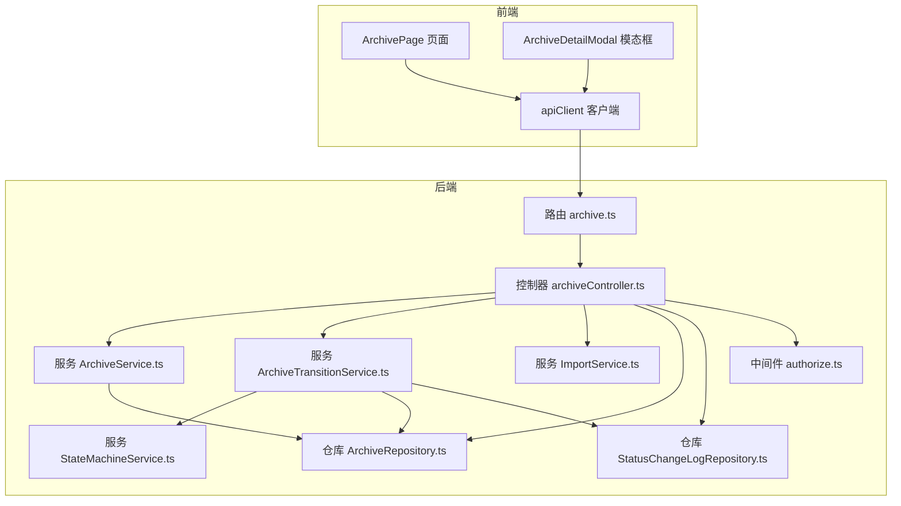
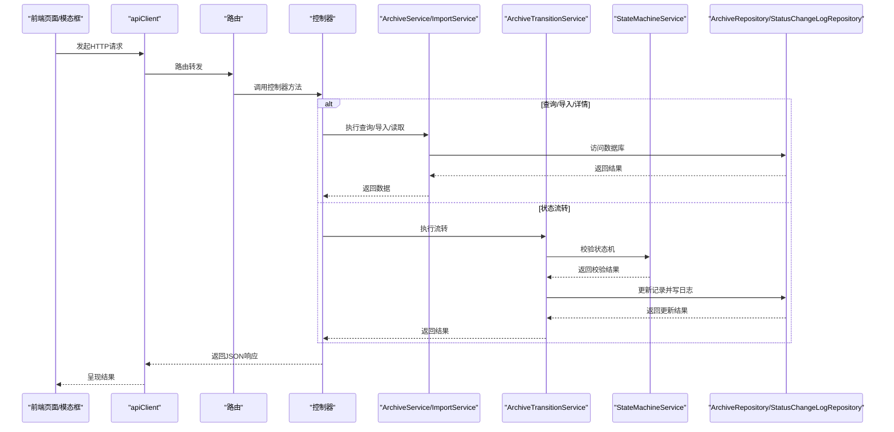
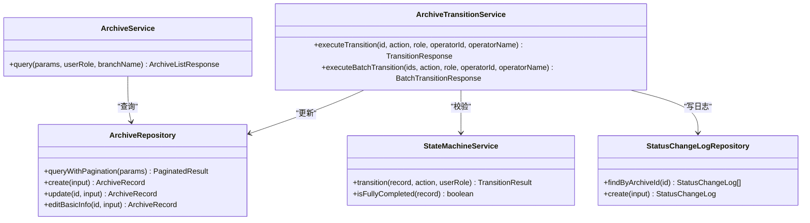
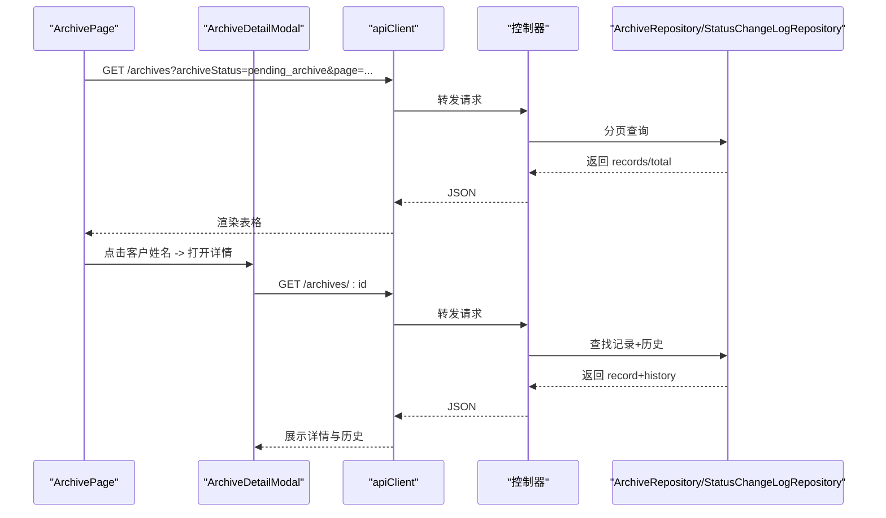
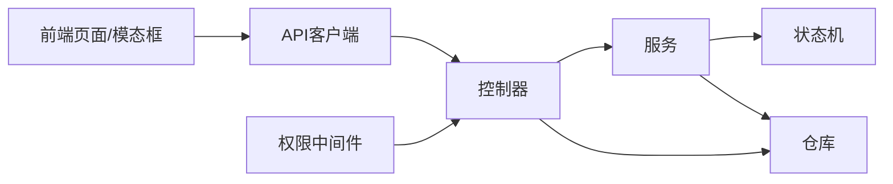

# 档案管理模块

<cite>
**本文引用的文件**
- [backend/src/controllers/archiveController.ts](file://backend/src/controllers/archiveController.ts)
- [backend/src/services/ArchiveService.ts](file://backend/src/services/ArchiveService.ts)
- [backend/src/models/ArchiveRepository.ts](file://backend/src/models/ArchiveRepository.ts)
- [backend/src/routers/archive.ts](file://backend/src/routes/archive.ts)
- [shared/types.ts](file://shared/types.ts)
- [backend/src/services/StateMachineService.ts](file://backend/src/services/StateMachineService.ts)
- [backend/src/services/ArchiveTransitionService.ts](file://backend/src/services/ArchiveTransitionService.ts)
- [backend/src/middlewares/authorize.ts](file://backend/src/middlewares/authorize.ts)
- [backend/src/models/StatusChangeLogRepository.ts](file://backend/src/models/StatusChangeLogRepository.ts)
- [backend/src/services/ImportService.ts](file://backend/src/services/ImportService.ts)
- [frontend/src/pages/ArchivePage.tsx](file://frontend/src/pages/ArchivePage.tsx)
- [frontend/src/components/ArchiveDetailModal.tsx](file://frontend/src/components/ArchiveDetailModal.tsx)
- [frontend/src/api/client.ts](file://frontend/src/api/client.ts)
- [backend/tests/unit/archiveController.test.ts](file://backend/tests/unit/archiveController.test.ts)
</cite>

## 目录
1. [简介](#简介)
2. [项目结构](#项目结构)
3. [核心组件](#核心组件)
4. [架构总览](#架构总览)
5. [详细组件分析](#详细组件分析)
6. [依赖分析](#依赖分析)
7. [性能考虑](#性能考虑)
8. [故障排查指南](#故障排查指南)
9. [结论](#结论)
10. [附录](#附录)

## 简介
本文件为档案管理模块的功能文档，覆盖档案记录的CRUD操作、查询分页与数据隔离、权限控制、状态管理、字段验证与数据完整性、前端交互与模态框、API调用示例、导入导出、搜索过滤与排序、以及与状态机服务和权限控制的集成关系。文档面向开发与产品团队，既提供代码级细节，也提供面向非技术读者的清晰说明。

## 项目结构
档案管理模块位于后端与前端两侧，采用分层架构：
- 后端：控制器（Controller）负责HTTP路由与请求响应；服务（Service）封装业务逻辑；仓库（Repository）负责数据持久化；中间件（Middleware）负责认证与授权；共享类型（Shared Types）统一前后端数据契约。
- 前端：页面组件负责展示与交互；模态框组件负责详情查看与历史追踪；API客户端负责统一请求与错误处理。

**图表来源**
- [backend/src/routers/archive.ts:1-42](file://backend/src/routes/archive.ts#L1-L42)
- [backend/src/controllers/archiveController.ts:1-448](file://backend/src/controllers/archiveController.ts#L1-L448)
- [backend/src/services/ArchiveService.ts:1-71](file://backend/src/services/ArchiveService.ts#L1-L71)
- [backend/src/services/ArchiveTransitionService.ts:1-156](file://backend/src/services/ArchiveTransitionService.ts#L1-L156)
- [backend/src/services/StateMachineService.ts:1-253](file://backend/src/services/StateMachineService.ts#L1-L253)
- [backend/src/services/ImportService.ts:1-146](file://backend/src/services/ImportService.ts#L1-L146)
- [backend/src/models/ArchiveRepository.ts:1-307](file://backend/src/models/ArchiveRepository.ts#L1-L307)
- [backend/src/models/StatusChangeLogRepository.ts:1-99](file://backend/src/models/StatusChangeLogRepository.ts#L1-L99)
- [backend/src/middlewares/authorize.ts:1-47](file://backend/src/middlewares/authorize.ts#L1-L47)
- [frontend/src/pages/ArchivePage.tsx:1-181](file://frontend/src/pages/ArchivePage.tsx#L1-L181)
- [frontend/src/components/ArchiveDetailModal.tsx:1-153](file://frontend/src/components/ArchiveDetailModal.tsx#L1-L153)
- [frontend/src/api/client.ts:1-55](file://frontend/src/api/client.ts#L1-L55)

**章节来源**
- [backend/src/routers/archive.ts:1-42](file://backend/src/routes/archive.ts#L1-L42)
- [backend/src/controllers/archiveController.ts:1-448](file://backend/src/controllers/archiveController.ts#L1-L448)
- [frontend/src/pages/ArchivePage.tsx:1-181](file://frontend/src/pages/ArchivePage.tsx#L1-L181)
- [frontend/src/components/ArchiveDetailModal.tsx:1-153](file://frontend/src/components/ArchiveDetailModal.tsx#L1-L153)
- [frontend/src/api/client.ts:1-55](file://frontend/src/api/client.ts#L1-L55)

## 核心组件
- 控制器：处理导入、模板下载、查询、详情、状态流转、批量流转、创建、编辑等HTTP请求。
- 服务：
  - ArchiveService：封装查询逻辑，含分页与数据隔离。
  - ArchiveTransitionService：整合状态机校验、记录更新与日志写入。
  - StateMachineService：定义主流程与归档状态的合法转换及角色权限映射。
  - ImportService：解析Excel并批量导入，含字段校验与去重。
- 仓库：
  - ArchiveRepository：提供CRUD与分页查询。
  - StatusChangeLogRepository：提供状态变更日志的写入与查询。
- 中间件：authorize中间件基于角色授予所需权限。
- 前端页面与组件：ArchivePage负责列表与批量入库；ArchiveDetailModal负责详情与历史；apiClient统一请求与错误处理。

**章节来源**
- [backend/src/controllers/archiveController.ts:1-448](file://backend/src/controllers/archiveController.ts#L1-L448)
- [backend/src/services/ArchiveService.ts:1-71](file://backend/src/services/ArchiveService.ts#L1-L71)
- [backend/src/services/ArchiveTransitionService.ts:1-156](file://backend/src/services/ArchiveTransitionService.ts#L1-L156)
- [backend/src/services/StateMachineService.ts:1-253](file://backend/src/services/StateMachineService.ts#L1-L253)
- [backend/src/services/ImportService.ts:1-146](file://backend/src/services/ImportService.ts#L1-L146)
- [backend/src/models/ArchiveRepository.ts:1-307](file://backend/src/models/ArchiveRepository.ts#L1-L307)
- [backend/src/models/StatusChangeLogRepository.ts:1-99](file://backend/src/models/StatusChangeLogRepository.ts#L1-L99)
- [backend/src/middlewares/authorize.ts:1-47](file://backend/src/middlewares/authorize.ts#L1-L47)
- [frontend/src/pages/ArchivePage.tsx:1-181](file://frontend/src/pages/ArchivePage.tsx#L1-L181)
- [frontend/src/components/ArchiveDetailModal.tsx:1-153](file://frontend/src/components/ArchiveDetailModal.tsx#L1-L153)
- [frontend/src/api/client.ts:1-55](file://frontend/src/api/client.ts#L1-L55)

## 架构总览
档案管理模块遵循“控制器-服务-仓库”的分层设计，前端通过API客户端调用后端REST接口，后端通过状态机服务确保状态流转的合法性，并在每次状态变更时写入日志以便审计。

**图表来源**
- [backend/src/routers/archive.ts:1-42](file://backend/src/routes/archive.ts#L1-L42)
- [backend/src/controllers/archiveController.ts:1-448](file://backend/src/controllers/archiveController.ts#L1-L448)
- [backend/src/services/ArchiveService.ts:1-71](file://backend/src/services/ArchiveService.ts#L1-L71)
- [backend/src/services/ArchiveTransitionService.ts:1-156](file://backend/src/services/ArchiveTransitionService.ts#L1-L156)
- [backend/src/services/StateMachineService.ts:1-253](file://backend/src/services/StateMachineService.ts#L1-L253)
- [backend/src/services/ImportService.ts:1-146](file://backend/src/services/ImportService.ts#L1-L146)
- [backend/src/models/ArchiveRepository.ts:1-307](file://backend/src/models/ArchiveRepository.ts#L1-L307)
- [backend/src/models/StatusChangeLogRepository.ts:1-99](file://backend/src/models/StatusChangeLogRepository.ts#L1-L99)
- [frontend/src/api/client.ts:1-55](file://frontend/src/api/client.ts#L1-L55)

## 详细组件分析

### 控制器：档案管理API
- 导入Excel：校验文件类型，解析并批量导入，返回统计结果。
- 模板下载：生成包含标准列头的Excel模板文件流。
- 查询档案：支持多条件组合查询与分页，默认按创建时间倒序。
- 获取详情：返回档案记录与状态变更历史。
- 状态流转：单条与批量流转，调用状态机服务进行合法性校验。
- 创建档案：校验必填字段与唯一性，按合同版本类型设置初始状态。
- 编辑档案：运营角色可编辑基础信息，完结记录不可编辑。

**章节来源**
- [backend/src/controllers/archiveController.ts:1-448](file://backend/src/controllers/archiveController.ts#L1-L448)

### 服务：查询与状态流转
- ArchiveService：设置分页默认值，强制分支机构用户仅能查询本营业部数据，调用仓库执行分页查询。
- ArchiveTransitionService：执行状态机校验，更新记录，写入主变更与副作用日志。
- StateMachineService：定义主流程与归档状态的转换矩阵，角色权限映射，前置保护（电子版与完结记录）。

**图表来源**
- [backend/src/services/ArchiveService.ts:1-71](file://backend/src/services/ArchiveService.ts#L1-L71)
- [backend/src/services/ArchiveTransitionService.ts:1-156](file://backend/src/services/ArchiveTransitionService.ts#L1-L156)
- [backend/src/services/StateMachineService.ts:1-253](file://backend/src/services/StateMachineService.ts#L1-L253)
- [backend/src/models/ArchiveRepository.ts:1-307](file://backend/src/models/ArchiveRepository.ts#L1-L307)
- [backend/src/models/StatusChangeLogRepository.ts:1-99](file://backend/src/models/StatusChangeLogRepository.ts#L1-L99)

**章节来源**
- [backend/src/services/ArchiveService.ts:1-71](file://backend/src/services/ArchiveService.ts#L1-L71)
- [backend/src/services/ArchiveTransitionService.ts:1-156](file://backend/src/services/ArchiveTransitionService.ts#L1-L156)
- [backend/src/services/StateMachineService.ts:1-253](file://backend/src/services/StateMachineService.ts#L1-L253)

### 仓库：数据访问与分页查询
- ArchiveRepository：提供创建、按ID/资金账号查询、更新、编辑基础信息、分页查询与条件过滤。
- StatusChangeLogRepository：提供日志写入与按档案ID查询历史。

**章节来源**
- [backend/src/models/ArchiveRepository.ts:1-307](file://backend/src/models/ArchiveRepository.ts#L1-L307)
- [backend/src/models/StatusChangeLogRepository.ts:1-99](file://backend/src/models/StatusChangeLogRepository.ts#L1-L99)

### 前端：页面与模态框交互
- ArchivePage：加载“待综合部入库”档案列表，支持分页与批量确认入库；点击客户姓名打开详情。
- ArchiveDetailModal：展示档案基本信息与状态变更历史（按时间倒序）。
- apiClient：统一注入Token，处理401/403/400/409等错误。

**图表来源**
- [frontend/src/pages/ArchivePage.tsx:1-181](file://frontend/src/pages/ArchivePage.tsx#L1-L181)
- [frontend/src/components/ArchiveDetailModal.tsx:1-153](file://frontend/src/components/ArchiveDetailModal.tsx#L1-L153)
- [frontend/src/api/client.ts:1-55](file://frontend/src/api/client.ts#L1-L55)
- [backend/src/controllers/archiveController.ts:1-448](file://backend/src/controllers/archiveController.ts#L1-L448)
- [backend/src/models/ArchiveRepository.ts:1-307](file://backend/src/models/ArchiveRepository.ts#L1-L307)
- [backend/src/models/StatusChangeLogRepository.ts:1-99](file://backend/src/models/StatusChangeLogRepository.ts#L1-L99)

**章节来源**
- [frontend/src/pages/ArchivePage.tsx:1-181](file://frontend/src/pages/ArchivePage.tsx#L1-L181)
- [frontend/src/components/ArchiveDetailModal.tsx:1-153](file://frontend/src/components/ArchiveDetailModal.tsx#L1-L153)
- [frontend/src/api/client.ts:1-55](file://frontend/src/api/client.ts#L1-L55)

### 数据模型与字段约束
- 档案记录字段：主键、客户姓名、资金账号（唯一）、营业部、合同类型、开户日期、合同版本类型、主流程状态、归档状态、扫描件URL、创建/更新时间。
- 状态枚举：主流程状态8个，归档状态4个，状态流转操作9个。
- 字段验证：创建/导入时校验必填字段与值域；资金账号唯一性校验（数据库+文件内）。
- 数据完整性：状态机前置保护（电子版合同与完结记录不可变）；日志记录保证可追溯。

**章节来源**
- [shared/types.ts:46-83](file://shared/types.ts#L46-L83)
- [shared/types.ts:14-43](file://shared/types.ts#L14-L43)
- [backend/src/services/ImportService.ts:1-146](file://backend/src/services/ImportService.ts#L1-L146)
- [backend/src/controllers/archiveController.ts:326-448](file://backend/src/controllers/archiveController.ts#L326-L448)
- [backend/src/services/StateMachineService.ts:106-142](file://backend/src/services/StateMachineService.ts#L106-L142)

### 权限控制与数据隔离
- 路由权限：创建/编辑需要review权限；导入需要import权限；查询与详情需要认证。
- 角色权限映射：不同状态流转操作要求不同角色。
- 数据隔离：分支机构用户查询时强制过滤为本营业部数据。

**章节来源**
- [backend/src/routers/archive.ts:1-42](file://backend/src/routes/archive.ts#L1-L42)
- [backend/src/middlewares/authorize.ts:1-47](file://backend/src/middlewares/authorize.ts#L1-L47)
- [backend/src/services/StateMachineService.ts:71-81](file://backend/src/services/StateMachineService.ts#L71-L81)
- [backend/src/services/ArchiveService.ts:56-59](file://backend/src/services/ArchiveService.ts#L56-L59)

### 导入导出与搜索过滤
- 导入：Excel模板列头固定；解析并逐行校验；支持文件内与数据库重复资金账号检测；按版本类型设置初始状态。
- 导出：下载Excel模板文件流。
- 搜索过滤：支持客户姓名（模糊）、资金账号（精确）、营业部（精确）、合同类型（精确）、主流程状态（精确）、归档状态（精确）、合同版本类型（精确）、开户日期范围；默认按创建时间倒序。

**章节来源**
- [backend/src/controllers/archiveController.ts:77-92](file://backend/src/controllers/archiveController.ts#L77-L92)
- [backend/src/controllers/archiveController.ts:43-71](file://backend/src/controllers/archiveController.ts#L43-L71)
- [backend/src/services/ImportService.ts:16-38](file://backend/src/services/ImportService.ts#L16-L38)
- [backend/src/models/ArchiveRepository.ts:228-305](file://backend/src/models/ArchiveRepository.ts#L228-L305)

### 状态管理与日志
- 状态机：主流程与归档状态分别定义转换矩阵；review_pass与confirm_return_received存在联动与自动判断逻辑。
- 日志：每次状态变更写入日志，包含字段名、前值、后值、操作、操作人信息与时间；详情页按时间倒序展示。

**章节来源**
- [backend/src/services/StateMachineService.ts:29-94](file://backend/src/services/StateMachineService.ts#L29-L94)
- [backend/src/services/ArchiveTransitionService.ts:46-125](file://backend/src/services/ArchiveTransitionService.ts#L46-L125)
- [backend/src/models/StatusChangeLogRepository.ts:90-97](file://backend/src/models/StatusChangeLogRepository.ts#L90-L97)
- [frontend/src/components/ArchiveDetailModal.tsx:120-146](file://frontend/src/components/ArchiveDetailModal.tsx#L120-L146)

## 依赖分析
- 控制器依赖服务与仓库，服务依赖状态机与仓库，仓库依赖数据库。
- 前端依赖API客户端与共享类型，页面与模态框依赖控制器提供的接口。
- 权限中间件在路由层统一拦截，确保操作安全。

**图表来源**
- [backend/src/controllers/archiveController.ts:1-448](file://backend/src/controllers/archiveController.ts#L1-L448)
- [backend/src/services/ArchiveService.ts:1-71](file://backend/src/services/ArchiveService.ts#L1-L71)
- [backend/src/services/ArchiveTransitionService.ts:1-156](file://backend/src/services/ArchiveTransitionService.ts#L1-L156)
- [backend/src/services/StateMachineService.ts:1-253](file://backend/src/services/StateMachineService.ts#L1-L253)
- [backend/src/models/ArchiveRepository.ts:1-307](file://backend/src/models/ArchiveRepository.ts#L1-L307)
- [backend/src/models/StatusChangeLogRepository.ts:1-99](file://backend/src/models/StatusChangeLogRepository.ts#L1-L99)
- [frontend/src/api/client.ts:1-55](file://frontend/src/api/client.ts#L1-L55)

**章节来源**
- [backend/src/controllers/archiveController.ts:1-448](file://backend/src/controllers/archiveController.ts#L1-L448)
- [frontend/src/api/client.ts:1-55](file://frontend/src/api/client.ts#L1-L55)

## 性能考虑
- 分页查询：后端按LIMIT/OFFSET分页，避免一次性加载大量数据；建议前端合理设置pageSize并启用服务端排序。
- 查询条件：尽量使用精确匹配字段（如资金账号、营业部、合同类型）以减少模糊匹配成本。
- 状态机校验：单条流转为O(1)映射查找，批量流转逐条执行，注意网络往返与事务一致性。
- 日志写入：每次状态变更写入日志，建议在高并发下评估数据库写入压力。

[本节为通用指导，无需具体文件引用]

## 故障排查指南
- 400错误：参数缺失或非法（如合同版本类型、资金账号重复、无效状态流转操作）。
- 401错误：未提供认证令牌或Token过期，前端会清除本地凭证并跳转登录。
- 403错误：权限不足，检查用户角色与所需权限。
- 404错误：档案记录不存在。
- 409错误：资金账号重复。
- 测试覆盖：控制器对导入文件格式与模板下载进行了单元测试，可参考定位问题。

**章节来源**
- [backend/src/controllers/archiveController.ts:43-71](file://backend/src/controllers/archiveController.ts#L43-L71)
- [backend/src/controllers/archiveController.ts:326-448](file://backend/src/controllers/archiveController.ts#L326-L448)
- [backend/src/middlewares/authorize.ts:1-47](file://backend/src/middlewares/authorize.ts#L1-L47)
- [frontend/src/api/client.ts:20-52](file://frontend/src/api/client.ts#L20-L52)
- [backend/tests/unit/archiveController.test.ts:1-185](file://backend/tests/unit/archiveController.test.ts#L1-L185)

## 结论
档案管理模块通过清晰的分层设计与严格的状态机控制，实现了从导入、查询、编辑到状态流转与审计日志的完整闭环。前端页面与模态框提供了直观的交互体验，配合权限中间件与数据隔离策略，保障了系统的安全性与数据完整性。建议在生产环境中关注分页与日志写入的性能表现，并持续完善测试覆盖。

[本节为总结性内容，无需具体文件引用]

## 附录

### API调用示例（路径与要点）
- GET /api/archives
  - 查询参数：customerName、fundAccount、branchName、contractType、status、archiveStatus、contractVersionType、openDateStart、openDateEnd、page、pageSize
  - 分支机构用户自动按本营业部过滤
- GET /api/archives/template
  - 下载Excel模板（标准列头）
- POST /api/archives/import
  - 上传Excel文件，解析并批量导入
- GET /api/archives/:id
  - 获取档案详情与状态变更历史
- POST /api/archives/:id/transition
  - 单条状态流转（action为允许的操作之一）
- POST /api/archives/batch-transition
  - 批量状态流转（支持批量确认寄出/入库等）
- POST /api/archives
  - 创建档案记录（运营角色）
- PUT /api/archives/:id
  - 编辑档案基础信息（运营角色）

**章节来源**
- [backend/src/controllers/archiveController.ts:94-448](file://backend/src/controllers/archiveController.ts#L94-L448)
- [backend/src/routers/archive.ts:1-42](file://backend/src/routes/archive.ts#L1-L42)
- [shared/types.ts:144-216](file://shared/types.ts#L144-L216)

### 数据模型说明（关键字段）
- 档案记录：id、customerName、fundAccount（唯一）、branchName、contractType、openDate、contractVersionType、status、archiveStatus、scanFileUrl、createdAt、updatedAt
- 状态变更日志：id、archiveId、statusField、previousValue、newValue、action、operatorId、operatorName、operatedAt

**章节来源**
- [shared/types.ts:46-83](file://shared/types.ts#L46-L83)
- [shared/types.ts:62-73](file://shared/types.ts#L62-L73)

### 最佳实践指南
- 前端：分页参数与表格列宽合理配置；批量操作前提示与清空选中项；详情弹窗按需懒加载。
- 后端：导入前先校验文件类型与列头；创建/编辑时严格校验唯一性；状态流转前先读取最新记录。
- 安全：所有敏感操作均需认证与授权；电子版与完结记录禁止状态变更；日志保留完整审计轨迹。

[本节为通用指导，无需具体文件引用]